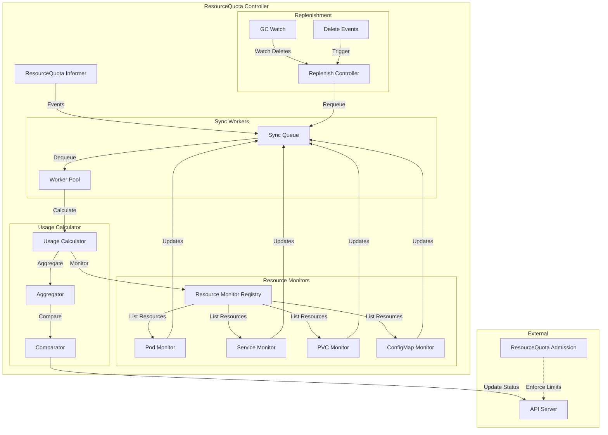
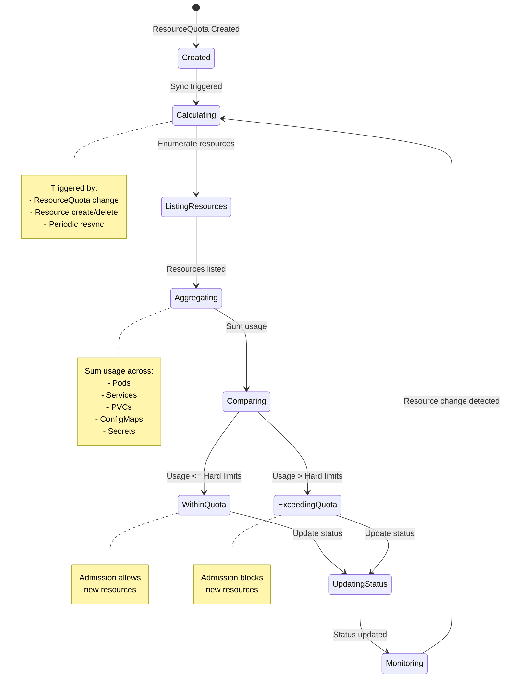
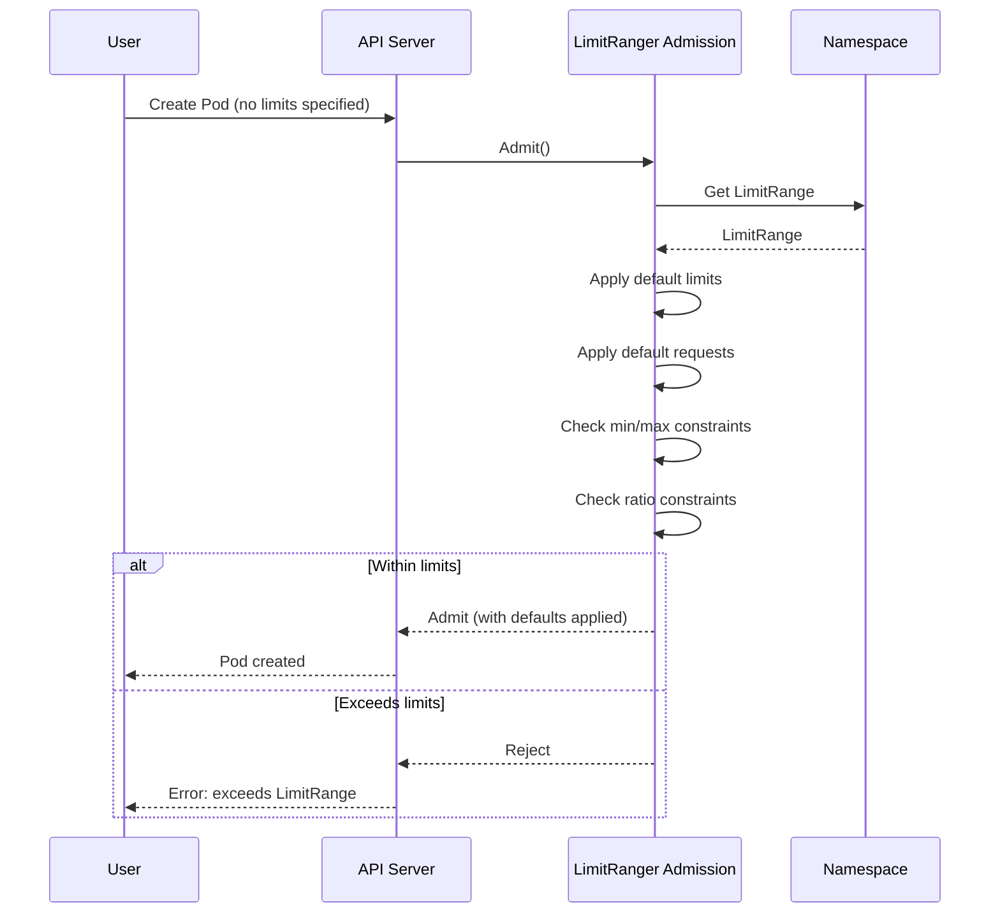

# ResourceQuota and LimitRange Controllers

**Author**: Claude (AI Assistant)
**Date**: 2025-10-21
**Status**: Architecture Study
**Component**: kube-controller-manager

## Overview

ResourceQuota and LimitRange controllers enforce resource consumption constraints in Kubernetes namespaces. ResourceQuota limits aggregate resource usage across a namespace, while LimitRange sets default resource requests/limits and enforces min/max constraints on individual resources.

## Key Components

### 1. ResourceQuota Controller

**Source**: `pkg/controller/resourcequota/resource_quota_controller.go`

Monitors resource usage and updates ResourceQuota status to reflect current consumption.

#### Architecture



#### ResourceQuota State Machine



#### Core Data Structures

```go
// Source: pkg/controller/resourcequota/resource_quota_controller.go

type Controller struct {
    // ResourceQuota informer
    rqLister corelisters.ResourceQuotaLister
    rqSynced cache.InformerSynced

    // Client
    kubeClient clientset.Interface

    // Resource monitor registry
    registry quota.Registry

    // Quota evaluator
    quotaEvaluator QuotaEvaluator

    // Work queue
    queue workqueue.RateLimitingInterface

    // Resync period
    resyncPeriod time.Duration

    // Replenishment controller
    replenishmentController *replenishmentController
}

// Quota evaluator
type QuotaEvaluator interface {
    // Calculate usage for a ResourceQuota
    CalculateUsage(
        namespace string,
        quota *v1.ResourceQuota,
    ) (v1.ResourceList, error)
}

// Resource monitor registry
type Registry interface {
    // Add a resource monitor
    Add(monitor Monitor)

    // Get monitors for scope
    Monitors(scope v1.ResourceQuotaScope) []Monitor
}

// Resource monitor
type Monitor interface {
    // List resources matching quota
    List(
        namespace string,
        scope v1.ResourceQuotaScope,
    ) ([]runtime.Object, error)

    // Calculate usage from resources
    Usage(resources []runtime.Object) v1.ResourceList
}
```

#### ResourceQuota Sync Algorithm

```go
// Source: pkg/controller/resourcequota/resource_quota_controller.go

// Sync ResourceQuota
func (rq *Controller) syncResourceQuota(key string) error {
    namespace, name, err := cache.SplitMetaNamespaceKey(key)
    if err != nil {
        return err
    }

    // Get ResourceQuota
    quota, err := rq.rqLister.ResourceQuotas(namespace).Get(name)
    if err != nil {
        if errors.IsNotFound(err) {
            return nil
        }
        return err
    }

    // Calculate current usage
    usage, err := rq.calculateUsage(quota)
    if err != nil {
        return err
    }

    // Update status if changed
    return rq.updateQuotaStatus(quota, usage)
}

// Calculate usage for ResourceQuota
func (rq *Controller) calculateUsage(
    quota *v1.ResourceQuota,
) (v1.ResourceList, error) {
    return rq.quotaEvaluator.CalculateUsage(
        quota.Namespace,
        quota,
    )
}

// Update ResourceQuota status
func (rq *Controller) updateQuotaStatus(
    quota *v1.ResourceQuota,
    usage v1.ResourceList,
) error {
    // Check if status needs update
    if apiequality.Semantic.DeepEqual(quota.Status.Used, usage) {
        return nil
    }

    // Clone quota
    quotaCopy := quota.DeepCopy()
    quotaCopy.Status.Used = usage

    // Update status
    _, err := rq.kubeClient.CoreV1().ResourceQuotas(quota.Namespace).
        UpdateStatus(context.TODO(), quotaCopy, metav1.UpdateOptions{})

    return err
}
```

#### Usage Calculation

```go
// Source: pkg/quota/v1/evaluator/core/evaluator.go

type quotaEvaluator struct {
    registry quota.Registry
}

// Calculate usage for ResourceQuota
func (qe *quotaEvaluator) CalculateUsage(
    namespace string,
    quota *v1.ResourceQuota,
) (v1.ResourceList, error) {
    // Initialize usage
    usage := v1.ResourceList{}

    // Get scopes from quota
    scopes := quota.Spec.Scopes

    // Get monitors for scopes
    var monitors []quota.Monitor
    if len(scopes) == 0 {
        // No scopes, use all monitors
        monitors = qe.registry.Monitors(v1.ResourceQuotaScopeNotTerminating)
    } else {
        // Get monitors for each scope
        for _, scope := range scopes {
            monitors = append(monitors, qe.registry.Monitors(scope)...)
        }
    }

    // Calculate usage from each monitor
    for _, monitor := range monitors {
        // List resources
        resources, err := monitor.List(namespace, scopes...)
        if err != nil {
            return nil, err
        }

        // Calculate usage
        monitorUsage := monitor.Usage(resources)

        // Merge usage
        usage = mergeResourceList(usage, monitorUsage)
    }

    // Filter to only resources in quota spec
    filteredUsage := v1.ResourceList{}
    for resourceName := range quota.Spec.Hard {
        if quantity, found := usage[resourceName]; found {
            filteredUsage[resourceName] = quantity
        } else {
            // Resource not found, set to zero
            filteredUsage[resourceName] = resource.MustParse("0")
        }
    }

    return filteredUsage, nil
}

// Merge resource lists
func mergeResourceList(a, b v1.ResourceList) v1.ResourceList {
    result := a.DeepCopy()

    for name, quantity := range b {
        if existing, found := result[name]; found {
            existing.Add(quantity)
            result[name] = existing
        } else {
            result[name] = quantity
        }
    }

    return result
}
```

#### Pod Usage Monitor

```go
// Source: pkg/quota/v1/evaluator/core/pods.go

type podEvaluator struct {
    podLister corelisters.PodLister
}

// List pods in namespace matching scope
func (pe *podEvaluator) List(
    namespace string,
    scopes ...v1.ResourceQuotaScope,
) ([]runtime.Object, error) {
    // List all pods in namespace
    pods, err := pe.podLister.Pods(namespace).List(labels.Everything())
    if err != nil {
        return nil, err
    }

    // Filter by scopes
    var result []runtime.Object
    for _, pod := range pods {
        if matchesScopes(pod, scopes) {
            result = append(result, pod)
        }
    }

    return result, nil
}

// Calculate usage from pods
func (pe *podEvaluator) Usage(resources []runtime.Object) v1.ResourceList {
    usage := v1.ResourceList{}

    for _, obj := range resources {
        pod := obj.(*v1.Pod)

        // Count pod
        usage[v1.ResourcePods] = addQuantity(
            usage[v1.ResourcePods],
            resource.MustParse("1"),
        )

        // Sum resource requests and limits
        for _, container := range pod.Spec.Containers {
            // Requests
            for resourceName, quantity := range container.Resources.Requests {
                usage[resourceName] = addQuantity(usage[resourceName], quantity)
            }

            // Limits
            for resourceName, quantity := range container.Resources.Limits {
                limitResourceName := v1.ResourceName(string(resourceName) + ".limit")
                usage[limitResourceName] = addQuantity(
                    usage[limitResourceName],
                    quantity,
                )
            }
        }
    }

    return usage
}

// Match pod against scopes
func matchesScopes(pod *v1.Pod, scopes []v1.ResourceQuotaScope) bool {
    if len(scopes) == 0 {
        return true
    }

    for _, scope := range scopes {
        switch scope {
        case v1.ResourceQuotaScopeTerminating:
            if pod.Spec.ActiveDeadlineSeconds == nil {
                return false
            }

        case v1.ResourceQuotaScopeNotTerminating:
            if pod.Spec.ActiveDeadlineSeconds != nil {
                return false
            }

        case v1.ResourceQuotaScopeBestEffort:
            if !isBestEffort(pod) {
                return false
            }

        case v1.ResourceQuotaScopeNotBestEffort:
            if isBestEffort(pod) {
                return false
            }

        case v1.ResourceQuotaScopePriorityClass:
            // Check priority class (matched separately)
            continue
        }
    }

    return true
}

// Check if pod is BestEffort QoS
func isBestEffort(pod *v1.Pod) bool {
    for _, container := range pod.Spec.Containers {
        if len(container.Resources.Requests) > 0 || len(container.Resources.Limits) > 0 {
            return false
        }
    }
    return true
}
```

#### Scope Selectors

```go
// Source: pkg/quota/v1/evaluator/core/scope_selector.go

// Match pod against scope selector
func matchesScopeSelector(
    pod *v1.Pod,
    selector *v1.ScopeSelector,
) bool {
    if selector == nil {
        return true
    }

    // All match expressions must be satisfied
    for _, expr := range selector.MatchExpressions {
        if !matchesScopeSelectorRequirement(pod, expr) {
            return false
        }
    }

    return true
}

// Match individual scope selector requirement
func matchesScopeSelectorRequirement(
    pod *v1.Pod,
    requirement v1.ScopedResourceSelectorRequirement,
) bool {
    switch requirement.ScopeName {
    case v1.ResourceQuotaScopePriorityClass:
        // Match priority class
        return matchesPriorityClass(pod, requirement)

    case v1.ResourceQuotaScopeCrossNamespacePodAffinity:
        // Match cross-namespace affinity
        return matchesCrossNamespaceAffinity(pod, requirement)
    }

    return true
}

// Match priority class requirement
func matchesPriorityClass(
    pod *v1.Pod,
    requirement v1.ScopedResourceSelectorRequirement,
) bool {
    if pod.Spec.PriorityClassName == "" {
        return false
    }

    switch requirement.Operator {
    case v1.ScopeSelectorOpIn:
        for _, value := range requirement.Values {
            if pod.Spec.PriorityClassName == value {
                return true
            }
        }
        return false

    case v1.ScopeSelectorOpNotIn:
        for _, value := range requirement.Values {
            if pod.Spec.PriorityClassName == value {
                return false
            }
        }
        return true

    case v1.ScopeSelectorOpExists:
        return true
    }

    return false
}
```

#### Replenishment Controller

```go
// Source: pkg/controller/resourcequota/replenishment_controller.go

type replenishmentController struct {
    // ResourceQuota controller
    rqController *Controller

    // Resource monitors
    monitors []replenishmentMonitor

    // Queue for replenishment
    queue workqueue.RateLimitingInterface
}

type replenishmentMonitor struct {
    // Resource group-version-resource
    gvr schema.GroupVersionResource

    // Informer for this resource
    informer cache.SharedIndexInformer
}

// Handle resource deletion
func (rc *replenishmentController) handleDelete(obj interface{}) {
    // Extract namespace
    namespace := getNamespace(obj)
    if namespace == "" {
        return
    }

    // List ResourceQuotas in namespace
    quotas, err := rc.rqController.rqLister.ResourceQuotas(namespace).
        List(labels.Everything())
    if err != nil {
        return
    }

    // Enqueue all quotas for resync
    for _, quota := range quotas {
        rc.queue.Add(quota.Namespace + "/" + quota.Name)
    }
}

// Replenish quota after deletion
func (rc *replenishmentController) replenish(key string) {
    // Trigger quota resync
    rc.rqController.queue.Add(key)
}
```

---

### 2. ResourceQuota Admission

**Source**: `plugin/pkg/admission/resourcequota/admission.go`

Admission plugin that enforces ResourceQuota limits on resource creation.

#### Architecture

```go
// Source: plugin/pkg/admission/resourcequota/admission.go

type quotaAdmission struct {
    // Handler for admission
    Handler admission.Interface

    // Quota accessor
    quotaAccessor QuotaAccessor

    // Quota evaluator
    evaluator Evaluator
}

// Admit checks if request is within quota
func (q *quotaAdmission) Admit(
    ctx context.Context,
    a admission.Attributes,
    o admission.ObjectInterfaces,
) error {
    // Only check creates and updates
    if a.GetOperation() != admission.Create &&
        a.GetOperation() != admission.Update {
        return nil
    }

    // Get ResourceQuotas for namespace
    quotas, err := q.quotaAccessor.GetQuotas(a.GetNamespace())
    if err != nil {
        return err
    }

    if len(quotas) == 0 {
        return nil // No quotas to check
    }

    // Evaluate each quota
    for _, quota := range quotas {
        err := q.checkQuota(quota, a)
        if err != nil {
            return err
        }
    }

    return nil
}

// Check single quota
func (q *quotaAdmission) checkQuota(
    quota *v1.ResourceQuota,
    attributes admission.Attributes,
) error {
    // Calculate usage delta from this request
    delta := q.evaluator.CalculateDelta(quota, attributes.GetObject())

    // Check if quota would be exceeded
    for resourceName, deltaQuantity := range delta {
        // Get hard limit
        hardLimit, found := quota.Spec.Hard[resourceName]
        if !found {
            continue
        }

        // Get current usage
        currentUsage := quota.Status.Used[resourceName]

        // Calculate new usage
        newUsage := currentUsage.DeepCopy()
        newUsage.Add(deltaQuantity)

        // Check if exceeds limit
        if newUsage.Cmp(hardLimit) > 0 {
            return fmt.Errorf(
                "exceeded quota: %s, requested: %s, used: %s, limited: %s",
                resourceName,
                deltaQuantity.String(),
                currentUsage.String(),
                hardLimit.String(),
            )
        }
    }

    return nil
}

// Calculate usage delta
func (e *quotaEvaluator) CalculateDelta(
    quota *v1.ResourceQuota,
    obj runtime.Object,
) v1.ResourceList {
    delta := v1.ResourceList{}

    // Convert to internal type
    switch o := obj.(type) {
    case *v1.Pod:
        return calculatePodDelta(o)

    case *v1.Service:
        return calculateServiceDelta(o)

    case *v1.PersistentVolumeClaim:
        return calculatePVCDelta(o)
    }

    return delta
}

// Calculate pod resource delta
func calculatePodDelta(pod *v1.Pod) v1.ResourceList {
    delta := v1.ResourceList{}

    // Count pod
    delta[v1.ResourcePods] = resource.MustParse("1")

    // Sum container resources
    for _, container := range pod.Spec.Containers {
        for resourceName, quantity := range container.Resources.Requests {
            delta[resourceName] = addQuantity(delta[resourceName], quantity)
        }

        for resourceName, quantity := range container.Resources.Limits {
            limitName := v1.ResourceName(string(resourceName) + ".limit")
            delta[limitName] = addQuantity(delta[limitName], quantity)
        }
    }

    return delta
}
```

---

### 3. LimitRange Controller

**Source**: `plugin/pkg/admission/limitranger/admission.go`

Admission plugin that enforces LimitRange constraints and applies defaults.

#### LimitRange Admission Flow



#### Core Algorithm

```go
// Source: plugin/pkg/admission/limitranger/admission.go

type limitRanger struct {
    Handler admission.Interface

    // LimitRange lister
    lrLister corelisters.LimitRangeLister
}

// Admit applies limits and validates
func (l *limitRanger) Admit(
    ctx context.Context,
    a admission.Attributes,
    o admission.ObjectInterfaces,
) error {
    // Only handle creates and updates
    if a.GetOperation() != admission.Create &&
        a.GetOperation() != admission.Update {
        return nil
    }

    // Get LimitRanges for namespace
    limitRanges, err := l.lrLister.LimitRanges(a.GetNamespace()).
        List(labels.Everything())
    if err != nil {
        return err
    }

    if len(limitRanges) == 0 {
        return nil
    }

    // Merge all limit ranges
    limits := mergeLimitRanges(limitRanges)

    // Apply based on resource type
    switch obj := a.GetObject().(type) {
    case *v1.Pod:
        return l.admitPod(obj, limits)

    case *v1.PersistentVolumeClaim:
        return l.admitPVC(obj, limits)
    }

    return nil
}

// Admit pod with limit range
func (l *limitRanger) admitPod(pod *v1.Pod, limits *v1.LimitRangeSpec) error {
    // Process each container
    for i := range pod.Spec.Containers {
        container := &pod.Spec.Containers[i]

        // Apply defaults
        applyContainerDefaults(container, limits)

        // Validate constraints
        if err := validateContainer(container, limits); err != nil {
            return err
        }
    }

    // Validate pod-level constraints
    return validatePod(pod, limits)
}

// Apply container defaults from LimitRange
func applyContainerDefaults(
    container *v1.Container,
    limits *v1.LimitRangeSpec,
) {
    for _, limit := range limits.Limits {
        if limit.Type != v1.LimitTypeContainer {
            continue
        }

        // Apply default requests
        if container.Resources.Requests == nil {
            container.Resources.Requests = v1.ResourceList{}
        }

        for resourceName, quantity := range limit.DefaultRequest {
            if _, exists := container.Resources.Requests[resourceName]; !exists {
                container.Resources.Requests[resourceName] = quantity.DeepCopy()
            }
        }

        // Apply default limits
        if container.Resources.Limits == nil {
            container.Resources.Limits = v1.ResourceList{}
        }

        for resourceName, quantity := range limit.Default {
            if _, exists := container.Resources.Limits[resourceName]; !exists {
                container.Resources.Limits[resourceName] = quantity.DeepCopy()
            }
        }
    }
}

// Validate container against LimitRange
func validateContainer(
    container *v1.Container,
    limits *v1.LimitRangeSpec,
) error {
    for _, limit := range limits.Limits {
        if limit.Type != v1.LimitTypeContainer {
            continue
        }

        // Check min constraints
        for resourceName, minQuantity := range limit.Min {
            // Check request
            if request, exists := container.Resources.Requests[resourceName]; exists {
                if request.Cmp(minQuantity) < 0 {
                    return fmt.Errorf(
                        "container %s request for %s is less than min %s",
                        container.Name,
                        resourceName,
                        minQuantity.String(),
                    )
                }
            }

            // Check limit
            if limitVal, exists := container.Resources.Limits[resourceName]; exists {
                if limitVal.Cmp(minQuantity) < 0 {
                    return fmt.Errorf(
                        "container %s limit for %s is less than min %s",
                        container.Name,
                        resourceName,
                        minQuantity.String(),
                    )
                }
            }
        }

        // Check max constraints
        for resourceName, maxQuantity := range limit.Max {
            // Check request
            if request, exists := container.Resources.Requests[resourceName]; exists {
                if request.Cmp(maxQuantity) > 0 {
                    return fmt.Errorf(
                        "container %s request for %s exceeds max %s",
                        container.Name,
                        resourceName,
                        maxQuantity.String(),
                    )
                }
            }

            // Check limit
            if limitVal, exists := container.Resources.Limits[resourceName]; exists {
                if limitVal.Cmp(maxQuantity) > 0 {
                    return fmt.Errorf(
                        "container %s limit for %s exceeds max %s",
                        container.Name,
                        resourceName,
                        maxQuantity.String(),
                    )
                }
            }
        }

        // Check max limit/request ratio
        for resourceName, maxRatio := range limit.MaxLimitRequestRatio {
            request := container.Resources.Requests[resourceName]
            limitVal := container.Resources.Limits[resourceName]

            if request.IsZero() {
                continue
            }

            // Calculate ratio
            ratio := float64(limitVal.MilliValue()) / float64(request.MilliValue())
            maxRatioFloat := float64(maxRatio.MilliValue()) / 1000.0

            if ratio > maxRatioFloat {
                return fmt.Errorf(
                    "container %s limit/request ratio for %s (%.2f) exceeds max (%.2f)",
                    container.Name,
                    resourceName,
                    ratio,
                    maxRatioFloat,
                )
            }
        }
    }

    return nil
}

// Validate pod-level constraints
func validatePod(pod *v1.Pod, limits *v1.LimitRangeSpec) error {
    for _, limit := range limits.Limits {
        if limit.Type != v1.LimitTypePod {
            continue
        }

        // Sum resources across all containers
        totalRequests := v1.ResourceList{}
        totalLimits := v1.ResourceList{}

        for _, container := range pod.Spec.Containers {
            for resourceName, quantity := range container.Resources.Requests {
                totalRequests[resourceName] = addQuantity(
                    totalRequests[resourceName],
                    quantity,
                )
            }

            for resourceName, quantity := range container.Resources.Limits {
                totalLimits[resourceName] = addQuantity(
                    totalLimits[resourceName],
                    quantity,
                )
            }
        }

        // Check pod min
        for resourceName, minQuantity := range limit.Min {
            if total, exists := totalRequests[resourceName]; exists {
                if total.Cmp(minQuantity) < 0 {
                    return fmt.Errorf(
                        "pod total request for %s is less than min %s",
                        resourceName,
                        minQuantity.String(),
                    )
                }
            }
        }

        // Check pod max
        for resourceName, maxQuantity := range limit.Max {
            if total, exists := totalRequests[resourceName]; exists {
                if total.Cmp(maxQuantity) > 0 {
                    return fmt.Errorf(
                        "pod total request for %s exceeds max %s",
                        resourceName,
                        maxQuantity.String(),
                    )
                }
            }
        }
    }

    return nil
}
```

---

## Configuration Examples

### ResourceQuota Examples

#### Basic Resource Quota

```yaml
apiVersion: v1
kind: ResourceQuota
metadata:
  name: compute-quota
  namespace: dev
spec:
  hard:
    # Limit total pods
    pods: "10"

    # Limit total CPU requests
    requests.cpu: "4"
    requests.memory: "8Gi"

    # Limit total CPU limits
    limits.cpu: "8"
    limits.memory: "16Gi"
```

#### Object Count Quota

```yaml
apiVersion: v1
kind: ResourceQuota
metadata:
  name: object-quota
  namespace: dev
spec:
  hard:
    # Limit object counts
    configmaps: "10"
    persistentvolumeclaims: "5"
    services: "5"
    services.loadbalancers: "2"
    secrets: "10"
```

#### Scoped Quota (Priority Class)

```yaml
apiVersion: v1
kind: ResourceQuota
metadata:
  name: high-priority-quota
  namespace: dev
spec:
  hard:
    pods: "5"
    requests.cpu: "2"
    requests.memory: "4Gi"
  scopeSelector:
    matchExpressions:
    - scopeName: PriorityClass
      operator: In
      values:
      - high-priority
```

#### Storage Quota

```yaml
apiVersion: v1
kind: ResourceQuota
metadata:
  name: storage-quota
  namespace: dev
spec:
  hard:
    # Total storage across all PVCs
    requests.storage: "100Gi"

    # Storage by class
    ssd.storageclass.storage.k8s.io/requests.storage: "50Gi"
    standard.storageclass.storage.k8s.io/requests.storage: "50Gi"

    # PVC count
    persistentvolumeclaims: "10"
```

### LimitRange Examples

#### Container Limits

```yaml
apiVersion: v1
kind: LimitRange
metadata:
  name: container-limits
  namespace: dev
spec:
  limits:
  - type: Container
    # Default limits if not specified
    default:
      cpu: "500m"
      memory: "512Mi"

    # Default requests if not specified
    defaultRequest:
      cpu: "100m"
      memory: "128Mi"

    # Minimum allowed
    min:
      cpu: "50m"
      memory: "64Mi"

    # Maximum allowed
    max:
      cpu: "2"
      memory: "2Gi"

    # Max limit/request ratio
    maxLimitRequestRatio:
      cpu: "4"
      memory: "4"
```

#### Pod Limits

```yaml
apiVersion: v1
kind: LimitRange
metadata:
  name: pod-limits
  namespace: dev
spec:
  limits:
  - type: Pod
    # Total across all containers
    min:
      cpu: "100m"
      memory: "128Mi"
    max:
      cpu: "4"
      memory: "8Gi"
```

#### PVC Limits

```yaml
apiVersion: v1
kind: LimitRange
metadata:
  name: pvc-limits
  namespace: dev
spec:
  limits:
  - type: PersistentVolumeClaim
    min:
      storage: "1Gi"
    max:
      storage: "100Gi"
```

---

## Performance Optimizations

### 1. Quota Caching

```go
// Cache quota status to reduce API calls
type quotaCache struct {
    cache map[string]*v1.ResourceQuota
    ttl   time.Duration
}

func (qc *quotaCache) get(key string) (*v1.ResourceQuota, bool) {
    quota, exists := qc.cache[key]
    if !exists {
        return nil, false
    }

    // Check if expired
    if time.Since(quota.CreationTimestamp.Time) > qc.ttl {
        delete(qc.cache, key)
        return nil, false
    }

    return quota, true
}
```

### 2. Incremental Updates

```go
// Only recalculate affected quotas
func (rq *Controller) handleResourceChange(obj interface{}) {
    namespace := getNamespace(obj)

    // List quotas in namespace
    quotas, _ := rq.rqLister.ResourceQuotas(namespace).List(labels.Everything())

    // Only enqueue quotas that track this resource type
    for _, quota := range quotas {
        if tracksResource(quota, obj) {
            rq.queue.Add(quota.Namespace + "/" + quota.Name)
        }
    }
}
```

### 3. Batch Processing

```go
// Batch multiple updates
const quotaBatchSize = 10

func (rq *Controller) processQuotaBatch(quotas []*v1.ResourceQuota) {
    var wg sync.WaitGroup

    for _, quota := range quotas {
        wg.Add(1)
        go func(q *v1.ResourceQuota) {
            defer wg.Done()
            rq.syncResourceQuota(q.Namespace + "/" + q.Name)
        }(quota)
    }

    wg.Wait()
}
```

---

## Source References

1. **ResourceQuota Controller**: `pkg/controller/resourcequota/resource_quota_controller.go`
2. **Quota Admission**: `plugin/pkg/admission/resourcequota/admission.go`
3. **LimitRange Admission**: `plugin/pkg/admission/limitranger/admission.go`
4. **Quota Evaluator**: `pkg/quota/v1/evaluator/core/evaluator.go`
5. **Pod Evaluator**: `pkg/quota/v1/evaluator/core/pods.go`

---

## Summary

ResourceQuota and LimitRange controllers provide comprehensive resource governance:

1. **ResourceQuota Controller**: Monitors aggregate resource usage and updates quota status
2. **ResourceQuota Admission**: Enforces quota limits at admission time, rejecting requests that exceed quotas
3. **LimitRange Admission**: Applies default resource requests/limits and enforces min/max constraints
4. **Scoped Quotas**: Support for priority classes and other scope selectors for fine-grained control
5. **Replenishment**: Automatic quota status updates when resources are deleted

These controllers work together to prevent resource exhaustion, enforce fair resource allocation, and provide predictable resource management within Kubernetes namespaces.
