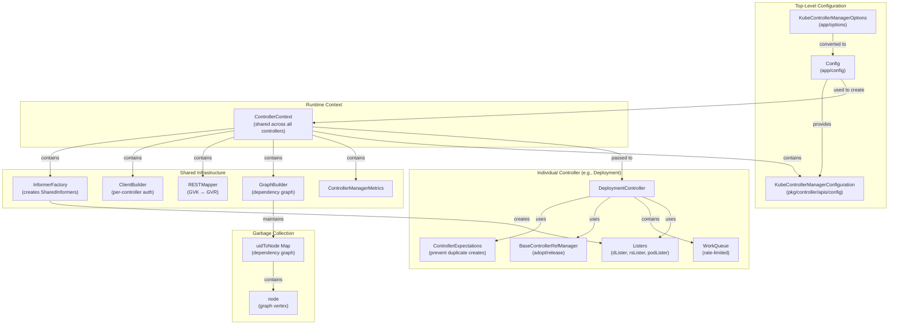

# Data Structures Deep Dive

**Document Version:** 1.0
**Last Updated:** 2025-10-22
**Status:** Complete

---

## Table of Contents
1. [Introduction](#introduction)
2. [Top-Level Manager Structures](#top-level-manager-structures)
3. [Controller Context](#controller-context)
4. [Controller Configuration](#controller-configuration)
5. [Individual Controller Structures](#individual-controller-structures)
6. [Shared Infrastructure Data Structures](#shared-infrastructure-data-structures)
7. [Expectations System](#expectations-system)
8. [Adoption and Reference Management](#adoption-and-reference-management)
9. [Garbage Collection Structures](#garbage-collection-structures)
10. [Work Queue Structures](#work-queue-structures)
11. [Memory Layout and Alignment](#memory-layout-and-alignment)
12. [Data Structure Relationships](#data-structure-relationships)

---

## Introduction

This document provides an in-depth analysis of the key data structures used throughout the kube-controller-manager. Understanding these structures is critical for comprehending:
- How controllers are initialized and managed
- How shared infrastructure is organized
- How concurrency and synchronization are implemented
- How memory efficiency is achieved at scale

All data structures are analyzed with:
- **Field-by-field breakdown** with purposes
- **Concurrency considerations** (locks, atomics, thread safety)
- **Memory layout implications** (alignment, padding)
- **Typical sizes and scalability characteristics**

**Source References:**
- `cmd/kube-controller-manager/app/controllermanager.go` - Core orchestration structures
- `cmd/kube-controller-manager/app/config/config.go` - Configuration structures
- `cmd/kube-controller-manager/app/options/options.go` - Options structures
- `pkg/controller/apis/config/types.go` - Component configuration
- `pkg/controller/deployment/deployment_controller.go` - Example controller structure
- `pkg/controller/controller_utils.go` - Expectations utilities
- `pkg/controller/controller_ref_manager.go` - Adoption/release structures
- `pkg/controller/garbagecollector/graph_builder.go` - Garbage collection graph
- `staging/src/k8s.io/client-go/tools/cache/shared_informer.go` - Informer interfaces
- `staging/src/k8s.io/client-go/util/workqueue/rate_limiting_queue.go` - Work queue

---

## Top-Level Manager Structures

### Config

**Purpose:** Top-level configuration for the entire controller manager process.

**Location:** `cmd/kube-controller-manager/app/config/config.go:31`

```go
type Config struct {
    // Flagz is the Reader interface to get flags for the flagz page.
    Flagz flagz.Reader

    // ComponentConfig holds per-controller configuration
    ComponentConfig kubectrlmgrconfig.KubeControllerManagerConfiguration

    // SecureServing holds HTTPS server configuration (port, cert, key)
    SecureServing *apiserver.SecureServingInfo

    // LoopbackClientConfig is a config for a privileged loopback connection
    // Used for internal communication with the embedded metrics/health server
    LoopbackClientConfig *restclient.Config

    // Authentication info for securing the HTTPS endpoint
    Authentication apiserver.AuthenticationInfo

    // Authorization info for RBAC on the HTTPS endpoint
    Authorization  apiserver.AuthorizationInfo

    // Client is the general kube client (for leader election, events, etc.)
    Client *clientset.Clientset

    // Kubeconfig is the rest config for the master
    Kubeconfig *restclient.Config

    // EventBroadcaster sends events to multiple sinks
    EventBroadcaster record.EventBroadcaster

    // EventRecorder is the interface controllers use to record events
    EventRecorder    record.EventRecorder

    // ControllerShutdownTimeout is the max time to wait for controllers to stop
    ControllerShutdownTimeout time.Duration

    // ComponentGlobalsRegistry tracks effective versions and feature gates
    ComponentGlobalsRegistry basecompatibility.ComponentGlobalsRegistry
}
```

**Characteristics:**
- **Size:** ~200-300 bytes (mostly pointers)
- **Lifecycle:** Created during startup, immutable after `Complete()` is called
- **Concurrency:** Read-only after initialization, no locks needed
- **Typical Values:**
  - `ControllerShutdownTimeout`: 15 seconds
  - `SecureServing.BindPort`: 10257

**Completion Pattern:**
```go
type completedConfig struct {
    *Config
}

func (c *Config) Complete() CompletedConfig {
    return CompletedConfig{&completedConfig{c}}
}
```
This prevents further mutation after configuration is finalized.

---

## Controller Context

### ControllerContext

**Purpose:** Shared runtime context passed to every controller during initialization. Acts as dependency injection container.

**Location:** `cmd/kube-controller-manager/app/controllermanager.go:406`

```go
type ControllerContext struct {
    // ClientBuilder will provide a client for this controller to use
    // Uses service account credentials when available
    ClientBuilder clientbuilder.ControllerClientBuilder

    // InformerFactory gives access to typed informers for core resources
    // (Pods, Services, Nodes, etc.)
    InformerFactory informers.SharedInformerFactory

    // ObjectOrMetadataInformerFactory gives access to informers for generic
    // controllers (garbage collector, etc.) - uses metadata-only informers
    // for 80-90% memory savings
    ObjectOrMetadataInformerFactory informerfactory.InformerFactory

    // ComponentConfig provides access to init options for a given controller
    // Contains per-controller settings (concurrency, sync periods, etc.)
    ComponentConfig kubectrlmgrconfig.KubeControllerManagerConfiguration

    // DeferredDiscoveryRESTMapper maps GVK ↔ GVR with lazy initialization
    // and 30-second refresh for CRD detection
    RESTMapper *restmapper.DeferredDiscoveryRESTMapper

    // InformersStarted is closed after all controllers are initialized
    // Controllers MUST wait on this before starting their informers
    InformersStarted chan struct{}

    // ResyncPeriod generates a jittered duration to prevent thundering herd
    // Each call returns a slightly different duration around the base period
    ResyncPeriod func() time.Duration

    // ControllerManagerMetrics provides controller-specific metrics
    ControllerManagerMetrics *controllersmetrics.ControllerManagerMetrics

    // GraphBuilder tracks resource dependencies for garbage collection
    // Shared across all controllers for orphan detection
    GraphBuilder *garbagecollector.GraphBuilder
}
```

**Characteristics:**
- **Size:** ~150-200 bytes (mostly pointers and one channel)
- **Lifecycle:** Created once per controller manager process
- **Concurrency:**
  - Mostly read-only after creation
  - `InformersStarted` channel: write-once, read-many
  - `ResyncPeriod()` function: thread-safe with internal sync
- **Shared:** Single instance passed to all ~50 controllers

**Key Methods:**

```go
// IsControllerEnabled checks if a controller should be started
func (c ControllerContext) IsControllerEnabled(
    controllerDescriptor *ControllerDescriptor,
) bool

// NewClientConfig creates a REST config for a specific controller
// with that controller's service account credentials
func (c ControllerContext) NewClientConfig(name string) (*restclient.Config, error)
```

**ResyncPeriod Implementation:**
```go
// Generates periods with ±2% jitter to prevent all controllers
// resyncing simultaneously
ResyncPeriod: func() time.Duration {
    factor := rand.Float64() + 1.96 // 1.96 to 2.96
    return time.Duration(float64(minResyncPeriod.Nanoseconds()) * factor)
}
```

---

## Controller Configuration

### KubeControllerManagerOptions

**Purpose:** Command-line options structure, parsed from flags.

**Location:** `cmd/kube-controller-manager/app/options/options.go:70`

```go
type KubeControllerManagerOptions struct {
    // Generic controller manager settings (leader election, profiling, etc.)
    Generic           *cmoptions.GenericControllerManagerConfigurationOptions

    // Cloud provider shared configuration
    KubeCloudShared   *cpoptions.KubeCloudSharedOptions
    ServiceController *cpoptions.ServiceControllerOptions

    // Per-controller options (25+ controller-specific option structs)
    AttachDetachController                    *AttachDetachControllerOptions
    CSRSigningController                      *CSRSigningControllerOptions
    DaemonSetController                       *DaemonSetControllerOptions
    DeploymentController                      *DeploymentControllerOptions
    StatefulSetController                     *StatefulSetControllerOptions
    DeprecatedFlags                           *DeprecatedControllerOptions
    EndpointController                        *EndpointControllerOptions
    EndpointSliceController                   *EndpointSliceControllerOptions
    EndpointSliceMirroringController          *EndpointSliceMirroringControllerOptions
    EphemeralVolumeController                 *EphemeralVolumeControllerOptions
    GarbageCollectorController                *GarbageCollectorControllerOptions
    HPAController                             *HPAControllerOptions
    JobController                             *JobControllerOptions
    CronJobController                         *CronJobControllerOptions
    LegacySATokenCleaner                      *LegacySATokenCleanerOptions
    NamespaceController                       *NamespaceControllerOptions
    NodeIPAMController                        *NodeIPAMControllerOptions
    NodeLifecycleController                   *NodeLifecycleControllerOptions
    PersistentVolumeBinderController          *PersistentVolumeBinderControllerOptions
    PodGCController                           *PodGCControllerOptions
    ReplicaSetController                      *ReplicaSetControllerOptions
    ReplicationController                     *ReplicationControllerOptions
    ResourceQuotaController                   *ResourceQuotaControllerOptions
    SAController                              *SAControllerOptions
    TTLAfterFinishedController                *TTLAfterFinishedControllerOptions
    ValidatingAdmissionPolicyStatusController *ValidatingAdmissionPolicyStatusControllerOptions

    // HTTPS server options
    SecureServing  *apiserveroptions.SecureServingOptionsWithLoopback
    Authentication *apiserveroptions.DelegatingAuthenticationOptions
    Authorization  *apiserveroptions.DelegatingAuthorizationOptions

    // Metrics and logging options
    Metrics        *metrics.Options
    Logs           *logs.Options

    // Connection to API server
    Master                      string
    ShowHiddenMetricsForVersion string
    ControllerShutdownTimeout   time.Duration

    // Version and feature gate registry
    ComponentGlobalsRegistry basecompatibility.ComponentGlobalsRegistry

    // Parsed CLI flags for debugging
    ParsedFlags *cliflag.NamedFlagSets
}
```

**Characteristics:**
- **Size:** ~500-800 bytes (mostly pointers to option structs)
- **Lifecycle:** Created during flag parsing, converted to Config
- **Typical Values:**
  - Most controllers: `ConcurrentSyncs: 5`
  - Deployment: `ConcurrentDeploymentSyncs: 5`
  - Endpoint: `ConcurrentEndpointSyncs: 5`
  - Namespace: `ConcurrentNamespaceSyncs: 10`
  - ResourceQuota: `ConcurrentResourceQuotaSyncs: 5`
  - ServiceAccount: `ConcurrentSATokenSyncs: 5`

### KubeControllerManagerConfiguration

**Purpose:** Internal configuration structure (versioned API type).

**Location:** `pkg/controller/apis/config/types.go:52`

```go
type KubeControllerManagerConfiguration struct {
    metav1.TypeMeta

    // Generic holds configuration for a generic controller-manager
    Generic cmconfig.GenericControllerManagerConfiguration

    // KubeCloudShared holds configuration for cloud-provider features
    KubeCloudShared cpconfig.KubeCloudSharedConfiguration

    // Per-controller configurations (25+ structs)
    AttachDetachController       attachdetachconfig.AttachDetachControllerConfiguration
    CSRSigningController         csrsigningconfig.CSRSigningControllerConfiguration
    DaemonSetController          daemonconfig.DaemonSetControllerConfiguration
    DeploymentController         deploymentconfig.DeploymentControllerConfiguration
    StatefulSetController        statefulsetconfig.StatefulSetControllerConfiguration
    DeprecatedController         DeprecatedControllerConfiguration
    EndpointController           endpointconfig.EndpointControllerConfiguration
    EndpointSliceController      endpointsliceconfig.EndpointSliceControllerConfiguration
    EndpointSliceMirroringController endpointslicemirroringconfig.EndpointSliceMirroringControllerConfiguration
    EphemeralVolumeController    ephemeralvolumeconfig.EphemeralVolumeControllerConfiguration
    GarbageCollectorController   garbagecollectorconfig.GarbageCollectorControllerConfiguration
    HPAController                poautosclerconfig.HPAControllerConfiguration
    JobController                jobconfig.JobControllerConfiguration
    CronJobController            cronjobconfig.CronJobControllerConfiguration
    LegacySATokenCleaner         serviceaccountconfig.LegacySATokenCleanerConfiguration
    NamespaceController          namespaceconfig.NamespaceControllerConfiguration
    NodeIPAMController           nodeipamconfig.NodeIPAMControllerConfiguration
    NodeLifecycleController      nodelifecycleconfig.NodeLifecycleControllerConfiguration
    PersistentVolumeBinderController persistentvolumeconfig.PersistentVolumeBinderControllerConfiguration
    PodGCController              podgcconfig.PodGCControllerConfiguration
    ReplicaSetController         replicasetconfig.ReplicaSetControllerConfiguration
    ReplicationController        replicationconfig.ReplicationControllerConfiguration
    ResourceQuotaController      resourcequotaconfig.ResourceQuotaControllerConfiguration
    SAController                 serviceaccountconfig.SAControllerConfiguration
    ServiceController            serviceconfig.ServiceControllerConfiguration
    TTLAfterFinishedController   ttlafterfinishedconfig.TTLAfterFinishedControllerConfiguration
    ValidatingAdmissionPolicyStatusController validatingadmissionpolicystatusconfig.ValidatingAdmissionPolicyStatusControllerConfiguration
}
```

**Characteristics:**
- **Versioned:** Supports conversion between versions (v1alpha1, internal)
- **Serializable:** Can be loaded from config file or command-line flags
- **Deep Copy:** Generated deep copy methods for thread safety

---

## Individual Controller Structures

### Generic Controller Template

All controllers follow a similar structural pattern. Here's the canonical example:

### DeploymentController

**Location:** `pkg/controller/deployment/deployment_controller.go:66`

```go
type DeploymentController struct {
    // ┌─────────────────────────────────────────────────────────────┐
    // │ CONTROL INTERFACES (for creating/updating managed resources) │
    // └─────────────────────────────────────────────────────────────┘

    // rsControl is used for adopting/releasing replica sets
    rsControl controller.RSControlInterface

    // client is the Kubernetes clientset for API calls
    client    clientset.Interface

    // ┌─────────────────────────────────────────────────────────────┐
    // │ EVENT RECORDING                                               │
    // └─────────────────────────────────────────────────────────────┘

    eventBroadcaster record.EventBroadcaster
    eventRecorder    record.EventRecorder

    // ┌─────────────────────────────────────────────────────────────┐
    // │ RECONCILIATION HANDLER (injected for testing)                │
    // └─────────────────────────────────────────────────────────────┘

    // syncHandler is the main reconciliation function
    // Signature: func(ctx context.Context, dKey string) error
    syncHandler func(ctx context.Context, dKey string) error

    // enqueueDeployment is used for unit testing to inject custom enqueue logic
    enqueueDeployment func(deployment *apps.Deployment)

    // ┌─────────────────────────────────────────────────────────────┐
    // │ LOCAL CACHES (listers) - Read-only indexed caches            │
    // └─────────────────────────────────────────────────────────────┘

    // dLister can list/get deployments from the shared informer's store
    dLister appslisters.DeploymentLister

    // rsLister can list/get replica sets from the shared informer's store
    rsLister appslisters.ReplicaSetLister

    // podLister can list/get pods from the shared informer's store
    podLister corelisters.PodLister

    // ┌─────────────────────────────────────────────────────────────┐
    // │ SYNC STATE TRACKING                                           │
    // └─────────────────────────────────────────────────────────────┘

    // dListerSynced returns true if the Deployment store has been synced at least once
    dListerSynced cache.InformerSynced

    // rsListerSynced returns true if the ReplicaSet store has been synced at least once
    rsListerSynced cache.InformerSynced

    // podListerSynced returns true if the Pod store has been synced at least once
    podListerSynced cache.InformerSynced

    // ┌─────────────────────────────────────────────────────────────┐
    // │ WORK QUEUE - Rate-limited, deduplicating queue               │
    // └─────────────────────────────────────────────────────────────┘

    // queue holds deployment keys (namespace/name) to process
    queue workqueue.TypedRateLimitingInterface[string]
}
```

**Field Categories:**

| Category | Purpose | Examples |
|----------|---------|----------|
| **Control Interfaces** | Create/update/delete managed resources | `rsControl`, `client` |
| **Event Recording** | Publish events to API server | `eventRecorder` |
| **Sync Handlers** | Main reconciliation logic | `syncHandler` |
| **Listers** | Read-only local caches | `dLister`, `rsLister`, `podLister` |
| **Sync Trackers** | Check if informers are synced | `dListerSynced`, `rsListerSynced` |
| **Work Queue** | Deduplicated, rate-limited queue | `queue` |

**Memory Characteristics:**
- **Base Size:** ~200-250 bytes (struct with pointers)
- **Queue Size:** Depends on cluster load (typically 0-100 items)
- **Lister Memory:** Shared across all controllers via informer factory
- **Total Per-Instance:** ~300-400 bytes + queue contents

**Concurrency:**
- **Thread-Safe Components:** `queue`, listers (via informer)
- **Single-Threaded Processing:** `syncHandler` runs in dedicated worker goroutines
- **No Locks Needed:** Controller struct itself is not directly accessed concurrently

---

## Shared Infrastructure Data Structures

### SharedInformer Interface

**Location:** `staging/src/k8s.io/client-go/tools/cache/shared_informer.go:139`

```go
type SharedInformer interface {
    // AddEventHandler adds an event handler to the shared informer using
    // the shared informer's resync period
    AddEventHandler(handler ResourceEventHandler) (ResourceEventHandlerRegistration, error)

    // AddEventHandlerWithResyncPeriod adds an event handler with a custom resync period
    AddEventHandlerWithResyncPeriod(
        handler ResourceEventHandler,
        resyncPeriod time.Duration,
    ) (ResourceEventHandlerRegistration, error)

    // GetStore returns the informer's local cache
    GetStore() Store

    // Run starts the informer - blocks until stopCh is closed
    Run(stopCh <-chan struct{})

    // HasSynced returns true when the informer has synced with the apiserver
    HasSynced() bool

    // LastSyncResourceVersion returns the resource version observed when last synced
    LastSyncResourceVersion() string

    // SetWatchErrorHandler sets the error handler for watch errors
    SetWatchErrorHandler(handler WatchErrorHandler) error

    // SetTransform allows transforming objects before they are stored
    SetTransform(handler TransformFunc) error

    // IsStopped returns true if the informer has been stopped
    IsStopped() bool
}

type SharedIndexInformer interface {
    SharedInformer

    // AddIndexers adds indexers to the informer before it starts
    AddIndexers(indexers Indexers) error

    // GetIndexer returns the indexer (local cache with indices)
    GetIndexer() Indexer
}
```

**Implementation Details:**

```go
// Internal implementation (simplified)
type sharedIndexInformer struct {
    indexer    Indexer           // Local cache with indices
    controller Controller        // Reflector + DeltaFIFO
    processor  *sharedProcessor  // Distributes events to handlers

    listerWatcher ListerWatcher  // List + Watch functions

    objectType runtime.Object    // Example object for type

    resyncCheckPeriod time.Duration // How often to check if resync is needed
    defaultEventHandlerResyncPeriod time.Duration // Default resync period

    clock clock.Clock

    started     bool
    startedLock sync.Mutex

    stopped     bool
    stoppedLock sync.Mutex

    blockDeltas sync.Mutex

    // Tombstone cache for deleted objects
    objectDescription string
}
```

**Memory Profile (per informer):**
- **Base Struct:** ~200-300 bytes
- **Indexer (cache):** Varies by resource count
  - Small resources (100 objects): ~50 KB
  - Large resources (10,000 objects): ~5-10 MB
  - Metadata-only: 80-90% smaller
- **DeltaFIFO:** Typically small (< 1 KB when idle)
- **Processor:** ~50 bytes + handlers

---

## Expectations System

### ControlleeExpectations

**Purpose:** Track anticipated creates/deletes to prevent duplicate operations.

**Location:** `pkg/controller/controller_utils.go:273`

```go
type ControlleeExpectations struct {
    // ┌─────────────────────────────────────────────────────────────┐
    // │ ATOMIC COUNTERS - MUST BE FIRST FOR 32-BIT ALIGNMENT         │
    // └─────────────────────────────────────────────────────────────┘

    // Important: Since these two int64 fields are using sync/atomic, they
    // have to be at the top of the struct due to a bug on 32-bit platforms
    // See: https://golang.org/pkg/sync/atomic/

    // add is the number of expected creates still pending
    // Positive values mean we're waiting for creates to appear
    add       int64

    // del is the number of expected deletes still pending
    // Positive values mean we're waiting for deletes to appear
    del       int64

    // ┌─────────────────────────────────────────────────────────────┐
    // │ METADATA                                                      │
    // └─────────────────────────────────────────────────────────────┘

    // key is the controller key (namespace/name)
    key       string

    // timestamp records when expectations were set
    // Used for timeout detection (default: 5 minutes)
    timestamp time.Time
}
```

**Critical Memory Layout:**

```
┌──────────────────────────────────────────┐
│ add (int64)          - 8 bytes @ offset 0│  ← MUST be 8-byte aligned on 32-bit
├──────────────────────────────────────────┤
│ del (int64)          - 8 bytes @ offset 8│  ← MUST be 8-byte aligned on 32-bit
├──────────────────────────────────────────┤
│ key (string)         - 16 bytes          │  (pointer + length)
├──────────────────────────────────────────┤
│ timestamp (time.Time) - 24 bytes         │  (wall, ext, loc pointer)
└──────────────────────────────────────────┘
Total: 56 bytes
```

**Why Ordering Matters:**
On 32-bit platforms, `atomic.AddInt64()` and `atomic.LoadInt64()` require 8-byte alignment. By placing `add` and `del` at the top of the struct, we guarantee proper alignment regardless of where the struct is allocated.

**Thread Safety:**
```go
// Add increments the add and del counters - THREAD SAFE
func (e *ControlleeExpectations) Add(add, del int64) {
    atomic.AddInt64(&e.add, add)
    atomic.AddInt64(&e.del, del)
}

// Fulfilled returns true if expectations are met - THREAD SAFE
func (e *ControlleeExpectations) Fulfilled() bool {
    return atomic.LoadInt64(&e.add) <= 0 && atomic.LoadInt64(&e.del) <= 0
}

// GetExpectations returns current values - THREAD SAFE
func (e *ControlleeExpectations) GetExpectations() (int64, int64) {
    return atomic.LoadInt64(&e.add), atomic.LoadInt64(&e.del)
}
```

### ControllerExpectations

**Purpose:** Store of expectations for all controllers.

**Location:** `pkg/controller/controller_utils.go:169`

```go
type ControllerExpectations struct {
    // Embeds cache.Store (thread-safe TTL store)
    cache.Store
}
```

**Implementation:**
- Backed by `cache.TTLStore` with 5-minute TTL
- Key: controller key (namespace/name)
- Value: `*ControlleeExpectations`

**Methods:**
```go
func (r *ControllerExpectations) GetExpectations(controllerKey string) (
    *ControlleeExpectations, bool, error,
)

func (r *ControllerExpectations) DeleteExpectations(
    logger klog.Logger,
    controllerKey string,
)

func (r *ControllerExpectations) SetExpectations(
    logger klog.Logger,
    controllerKey string,
    add, del int,
) error

func (r *ControllerExpectations) ExpectCreations(
    logger klog.Logger,
    controllerKey string,
    adds int,
) error

func (r *ControllerExpectations) ExpectDeletions(
    logger klog.Logger,
    controllerKey string,
    dels int,
) error

// Most important: check if expectations are satisfied
func (r *ControllerExpectations) SatisfiedExpectations(
    logger klog.Logger,
    controllerKey string,
) bool
```

### UIDTrackingControllerExpectations

**Purpose:** Enhanced expectations that track specific UIDs (used by StatefulSet, DaemonSet).

**Location:** `pkg/controller/controller_utils.go:340`

```go
type UIDTrackingControllerExpectations struct {
    // Embeds standard expectations
    ControllerExpectationsInterface

    // Lock protects uidStore access
    uidStoreLock sync.Mutex

    // Store used for the UIDs associated with any expectation tracked
    // Key: controller key, Value: *UIDSet (set of expected UIDs)
    uidStore cache.Store
}
```

**UIDSet:**
```go
type UIDSet struct {
    // String is a set of UIDs (map for O(1) lookup)
    String sets.String

    // key is the controller key
    key string
}
```

**Thread Safety:**
- `uidStoreLock` protects all uidStore operations
- Must be held when checking or modifying UID sets

---

## Adoption and Reference Management

### BaseControllerRefManager

**Purpose:** Manages ownership (adoption/release) for a specific controller.

**Location:** `pkg/controller/controller_ref_manager.go:36`

```go
type BaseControllerRefManager struct {
    // Controller is the object that owns managed resources
    // (e.g., Deployment, ReplicaSet, DaemonSet)
    Controller metav1.Object

    // Selector is the label selector for matching managed resources
    Selector   labels.Selector

    // ┌─────────────────────────────────────────────────────────────┐
    // │ LAZY ADOPTION CHECK (executed at most once)                   │
    // └─────────────────────────────────────────────────────────────┘

    // canAdoptErr caches the result of CanAdoptFunc
    canAdoptErr  error

    // canAdoptOnce ensures CanAdoptFunc is called at most once
    canAdoptOnce sync.Once

    // CanAdoptFunc checks if adoption is allowed
    // Typically verifies the controller still exists in API server
    CanAdoptFunc func(ctx context.Context) error
}
```

**Thread Safety:**
- `sync.Once` guarantees `CanAdoptFunc` executes exactly once
- Subsequent calls to `CanAdopt()` return cached `canAdoptErr`

**Adoption Logic:**
```go
// ClaimObject attempts to adopt or release an object
func (m *BaseControllerRefManager) ClaimObject(
    ctx context.Context,
    obj metav1.Object,
    match func(metav1.Object) bool,
    adopt, release func(context.Context, metav1.Object) error,
) (bool, error)
```

**Decision Matrix:**

| Condition | Owner Ref Set? | Selector Match? | Action |
|-----------|----------------|-----------------|--------|
| Orphan | No | Yes | **Adopt** (set owner ref) |
| Owned by us | Yes (UID matches) | Yes | **Keep** |
| Owned by us | Yes (UID matches) | No | **Release** (remove owner ref) |
| Owned by other | Yes (UID differs) | - | **Ignore** |

### Specialized RefManagers

**PodControllerRefManager:**
```go
type PodControllerRefManager struct {
    BaseControllerRefManager
    controllerKind schema.GroupVersionKind
    podControl     PodControlInterface
    finalizers     []string
}
```

**ReplicaSetControllerRefManager:**
```go
type ReplicaSetControllerRefManager struct {
    BaseControllerRefManager
    controllerKind schema.GroupVersionKind
    rsControl      RSControlInterface
}
```

**ControllerRevisionControllerRefManager:**
```go
type ControllerRevisionControllerRefManager struct {
    BaseControllerRefManager
    controllerKind schema.GroupVersionKind
    crControl      ControllerRevisionControlInterface
}
```

---

## Garbage Collection Structures

### GraphBuilder

**Purpose:** Builds and maintains dependency graph for garbage collection.

**Location:** `pkg/controller/garbagecollector/graph_builder.go:81`

```go
type GraphBuilder struct {
    // ┌─────────────────────────────────────────────────────────────┐
    // │ DISCOVERY AND MAPPING                                         │
    // └─────────────────────────────────────────────────────────────┘

    // restMapper maps GVK ↔ GVR with 30-second refresh
    restMapper meta.RESTMapper

    // ┌─────────────────────────────────────────────────────────────┐
    // │ RESOURCE MONITORS (one per resource type being watched)      │
    // └─────────────────────────────────────────────────────────────┘

    // monitors is a map of GVR → monitor
    monitors    monitors

    // monitorLock protects monitors map access
    monitorLock sync.RWMutex

    // informersStarted signals when it's safe to start monitors
    informersStarted <-chan struct{}

    // ┌─────────────────────────────────────────────────────────────┐
    // │ LIFECYCLE CONTROL                                             │
    // └─────────────────────────────────────────────────────────────┘

    // stopCh drives shutdown
    stopCh <-chan struct{}

    // running tracks whether Run() has been called
    // Protected by monitorLock
    running bool

    // ┌─────────────────────────────────────────────────────────────┐
    // │ EVENT RECORDING                                               │
    // └─────────────────────────────────────────────────────────────┘

    eventRecorder    record.EventRecorder
    eventBroadcaster record.EventBroadcaster

    // ┌─────────────────────────────────────────────────────────────┐
    // │ API CLIENT                                                    │
    // └─────────────────────────────────────────────────────────────┘

    // metadataClient is used to fetch metadata-only representations
    metadataClient metadata.Interface

    // ┌─────────────────────────────────────────────────────────────┐
    // │ WORK QUEUES                                                   │
    // └─────────────────────────────────────────────────────────────┘

    // graphChanges receives events from monitors
    // Type: *event (add/update/delete of a resource)
    graphChanges workqueue.TypedRateLimitingInterface[*event]

    // uidToNode is the in-memory dependency graph
    // Key: UID, Value: *node
    // NOT protected by a lock - only accessed by single-threaded processGraphChanges()
    uidToNode *concurrentUIDToNode

    // attemptToDelete sends nodes ready for deletion to GC
    attemptToDelete workqueue.TypedRateLimitingInterface[*node]

    // attemptToOrphan sends nodes needing orphaning to GC
    attemptToOrphan workqueue.TypedRateLimitingInterface[*node]

    // absentOwnerCache caches owners that don't exist
    // Prevents repeated API lookups for the same missing owner
    absentOwnerCache *ReferenceCache
}
```

**Memory Profile:**
- **Base Struct:** ~300-400 bytes
- **uidToNode Map:** Dominant memory consumer
  - Small cluster (1,000 objects): ~200 KB
  - Medium cluster (10,000 objects): ~2 MB
  - Large cluster (100,000 objects): ~20 MB
- **Work Queues:** Typically < 10 KB when idle

### node (Dependency Graph Node)

**Purpose:** Represents a single object in the dependency graph.

**Location:** `pkg/controller/garbagecollector/graph.go:63`

```go
type node struct {
    // ┌─────────────────────────────────────────────────────────────┐
    // │ IDENTITY                                                      │
    // └─────────────────────────────────────────────────────────────┘

    // identity uniquely identifies this object
    identity objectReference

    // ┌─────────────────────────────────────────────────────────────┐
    // │ DEPENDENTS (objects that list this node as an owner)         │
    // └─────────────────────────────────────────────────────────────┘

    // dependentsLock protects dependents map
    dependentsLock sync.RWMutex

    // dependents are nodes that have this node as an owner
    // Map key is node pointer, value is empty struct (set)
    dependents map[*node]struct{}

    // ┌─────────────────────────────────────────────────────────────┐
    // │ DELETION STATE                                                │
    // └─────────────────────────────────────────────────────────────┘

    // deletingDependentsLock protects deletingDependents flag
    deletingDependentsLock sync.RWMutex

    // deletingDependents is set if object has DeletionTimestamp != nil
    // and has the FinalizerDeleteDependents
    deletingDependents     bool

    // beingDeletedLock protects beingDeleted flag
    beingDeletedLock sync.RWMutex

    // beingDeleted records if the object's deletionTimestamp is non-nil
    beingDeleted     bool

    // ┌─────────────────────────────────────────────────────────────┐
    // │ VIRTUAL NODE FLAG                                             │
    // └─────────────────────────────────────────────────────────────┘

    // virtual records if the object was constructed virtually and never
    // observed via informer event (e.g., owner reference points to
    // non-existent object)
    virtual     bool

    // virtualLock protects virtual flag
    virtualLock sync.RWMutex
}
```

**objectReference:**
```go
type objectReference struct {
    OwnerReference metav1.OwnerReference
    Namespace      string
}
```

**Memory Size:**
- **Per Node:** ~150-200 bytes + dependent map size
- **Dependent Map:**
  - No dependents: ~0 bytes (nil map)
  - Few dependents (1-5): ~50-200 bytes
  - Many dependents (100+): ~1-2 KB

**Thread Safety:**
- **Three separate RWMutexes** for fine-grained locking:
  1. `dependentsLock` - protects dependent set
  2. `deletingDependentsLock` - protects deletion cascade flag
  3. `beingDeletedLock` - protects deletion timestamp flag
  4. `virtualLock` - protects virtual flag
- Allows concurrent reads while protecting writes

---

## Work Queue Structures

### TypedRateLimitingInterface

**Purpose:** Rate-limited, deduplicated work queue.

**Location:** `staging/src/k8s.io/client-go/util/workqueue/rate_limiting_queue.go:26`

```go
type TypedRateLimitingInterface[T comparable] interface {
    TypedDelayingInterface[T]

    // AddRateLimited adds an item after the rate limiter says it's ok
    AddRateLimited(item T)

    // Forget indicates that an item is finished being retried
    // Clears the rate limiter state for this item
    Forget(item T)

    // NumRequeues returns how many times the item was requeued
    NumRequeues(item T) int
}
```

**TypedDelayingInterface:**
```go
type TypedDelayingInterface[T comparable] interface {
    TypedInterface[T]

    // AddAfter adds an item after the specified duration
    AddAfter(item T, duration time.Duration)
}
```

**TypedInterface (Base Queue):**
```go
type TypedInterface[T comparable] interface {
    Add(item T)
    Len() int
    Get() (item T, shutdown bool)
    Done(item T)
    ShutDown()
    ShutDownWithDrain()
    ShuttingDown() bool
}
```

**Common Rate Limiters:**

**1. BucketRateLimiter** (Token Bucket)
```go
// Allows bursts up to burst size, refills at rate
type BucketRateLimiter struct {
    *rate.Limiter
}
```

**2. ItemExponentialFailureRateLimiter** (Exponential Backoff)
```go
type ItemExponentialFailureRateLimiter[T comparable] struct {
    failuresLock sync.Mutex
    failures     map[T]int  // Key → failure count

    baseDelay time.Duration   // Initial delay (e.g., 5ms)
    maxDelay  time.Duration   // Max delay (e.g., 1000s)
}

// When(item) returns:
//   - 0 failures: 0 seconds
//   - 1 failure:  baseDelay * 2^0 = 5ms
//   - 2 failures: baseDelay * 2^1 = 10ms
//   - 3 failures: baseDelay * 2^2 = 20ms
//   - ...
//   - n failures: min(baseDelay * 2^(n-1), maxDelay)
```

**3. ItemFastSlowRateLimiter** (Fast → Slow Threshold)
```go
type ItemFastSlowRateLimiter[T comparable] struct {
    failuresLock sync.Mutex
    failures     map[T]int

    maxFastAttempts int
    fastDelay       time.Duration  // e.g., 5ms
    slowDelay       time.Duration  // e.g., 10s
}

// When(item) returns:
//   - failures <= maxFastAttempts: fastDelay
//   - failures >  maxFastAttempts: slowDelay
```

**4. MaxOfRateLimiter** (Use worst-case delay)
```go
type MaxOfRateLimiter[T comparable] struct {
    limiters []TypedRateLimiter[T]
}

// When(item) returns max(limiter1.When(item), limiter2.When(item), ...)
```

**Default Controller Queue Configuration:**
```go
// Most controllers use this rate limiter
workqueue.NewTypedRateLimitingQueueWithConfig(
    workqueue.NewTypedMaxOfRateLimiter(
        // Fast retries for transient errors
        workqueue.NewTypedItemExponentialFailureRateLimiter[string](
            5*time.Millisecond,  // base delay
            1000*time.Second,     // max delay
        ),
        // Overall throughput limit (10 QPS, burst 100)
        &workqueue.TypedBucketRateLimiter[string]{
            Limiter: rate.NewLimiter(rate.Limit(10), 100),
        },
    ),
    workqueue.TypedRateLimitingQueueConfig[string]{
        Name: "deployment",
    },
)
```

---

## Memory Layout and Alignment

### 32-bit vs 64-bit Considerations

**Problem:** `sync/atomic` operations on `int64`/`uint64` require 8-byte alignment on 32-bit platforms.

**Solution:** Place atomic fields at the beginning of structs.

**Example: ControlleeExpectations (Correct):**
```go
type ControlleeExpectations struct {
    add       int64       // ← FIRST FIELD - guaranteed 8-byte aligned
    del       int64       // ← SECOND FIELD - also 8-byte aligned
    key       string      // Can follow atomic fields
    timestamp time.Time   // Can follow atomic fields
}
```

**Bad Example (Would fail on 32-bit):**
```go
type ControlleeExpectations struct {
    key       string      // 16 bytes on 64-bit, but might not align add
    add       int64       // ← MIGHT NOT BE 8-BYTE ALIGNED on 32-bit!
    del       int64
    timestamp time.Time
}
```

**Struct Padding:**

Go automatically adds padding to ensure proper alignment:

```
64-bit platform:
┌────────────────────────┐
│ add (int64)     8 bytes│
├────────────────────────┤
│ del (int64)     8 bytes│
├────────────────────────┤
│ key (string)   16 bytes│ (ptr + len)
├────────────────────────┤
│ timestamp      24 bytes│ (wall, ext, loc ptr)
└────────────────────────┘
Total: 56 bytes, no padding needed

32-bit platform (if add/del were NOT first):
┌────────────────────────┐
│ key (string)    8 bytes│ (ptr + len)
├────────────────────────┤
│ PADDING         4 bytes│ ← Inserted to align add
├────────────────────────┤
│ add (int64)     8 bytes│ ← Now aligned
├────────────────────────┤
│ del (int64)     8 bytes│
├────────────────────────┤
│ timestamp      12 bytes│
└────────────────────────┘
Total: 48 bytes (with 4 bytes wasted)
```

**Best Practice:** Always place atomic `int64`/`uint64` fields first.

---

## Data Structure Relationships

### Complete System Diagram



### Dependency Flow

**Startup Sequence:**

1. **Parse Flags** → `KubeControllerManagerOptions`
2. **Validate & Convert** → `Config`
3. **Complete Config** → `CompletedConfig`
4. **Create Context** → `ControllerContext`
5. **Create Informer Factory** → Attach to Context
6. **Create Client Builder** → Attach to Context
7. **Create GraphBuilder** → Attach to Context
8. **For Each Controller:**
   - Call controller constructor with `ControllerContext`
   - Controller creates:
     - `Expectations` (if needed)
     - `RefManager` (if needed)
     - `WorkQueue`
     - Registers event handlers with informers
     - Gets listers from informers
9. **Start Informers** → Begin watching API server
10. **Wait for Sync** → `InformersStarted` channel closed
11. **Start Controllers** → Begin processing work queues

### Memory Ownership

| Structure | Owner | Shared? | Lifecycle |
|-----------|-------|---------|-----------|
| `Config` | Main | No | Entire process |
| `ControllerContext` | Main | Yes (read-only) | Entire process |
| `InformerFactory` | ControllerContext | Yes | Entire process |
| `GraphBuilder` | ControllerContext | Yes | Entire process |
| `DeploymentController` | Main (via descriptor) | No | Entire process |
| `Expectations` | Individual controller | No | Per controller |
| `RefManager` | Individual controller | No | Per reconciliation |
| `WorkQueue` | Individual controller | No | Entire process |
| `SharedInformer` | InformerFactory | Yes | Entire process |
| `Lister` | SharedInformer | Yes | Entire process |

---

## Summary

### Key Takeaways

1. **Hierarchical Configuration:** Options → Config → ControllerContext → Individual Controllers

2. **Shared Infrastructure:** Informers, client builder, REST mapper, graph builder are shared across all controllers via `ControllerContext`

3. **Memory Efficiency:**
   - Informers are shared (single watch per resource type)
   - Metadata-only informers save 80-90% memory
   - Work queues use string keys (deduplication)

4. **Thread Safety:**
   - Atomic fields placed first for alignment
   - Fine-grained locking (separate locks for separate concerns)
   - Read-mostly structures use `sync.RWMutex`
   - Controller structs themselves don't need locks (single-threaded workers)

5. **Expectations Pattern:** Prevents duplicate creates/deletes via atomic counters with 5-minute TTL

6. **Adoption Pattern:** Lazy-evaluated ownership checks with `sync.Once`

7. **Graph Structure:** UID-based dependency graph with virtual nodes for missing owners

8. **Work Queues:** Rate-limited, deduplicated, with exponential backoff

### Typical Memory Profile (Medium Cluster: 5,000 objects, 50 controllers)

| Component | Memory Usage |
|-----------|--------------|
| **Informer Caches** | ~50 MB (10 resource types × 5 MB avg) |
| **GraphBuilder uidToNode** | ~1 MB |
| **Work Queues** | ~500 KB (50 controllers × 10 KB avg) |
| **Controller Structs** | ~50 KB (50 controllers × 1 KB avg) |
| **Expectations Stores** | ~200 KB |
| **Total** | **~52 MB** |

**Scalability:** Informer cache dominates memory usage. Metadata-only informers reduce this by 80-90%.

---

**Next Steps:**
- Read `18-concurrency-synchronization.md` for thread safety analysis
- Read `19-inter-controller-interactions.md` for event chains and dependencies
- Read `21-generic-controller-framework.md` for base interfaces and utilities

**Cross-References:**
- [07-shared-infrastructure.md](07-shared-infrastructure.md) - Informer architecture
- [16-controller-patterns.md](16-controller-patterns.md) - Usage patterns for these structures
- [06-initialization-lifecycle.md](06-initialization-lifecycle.md) - How these structures are created
