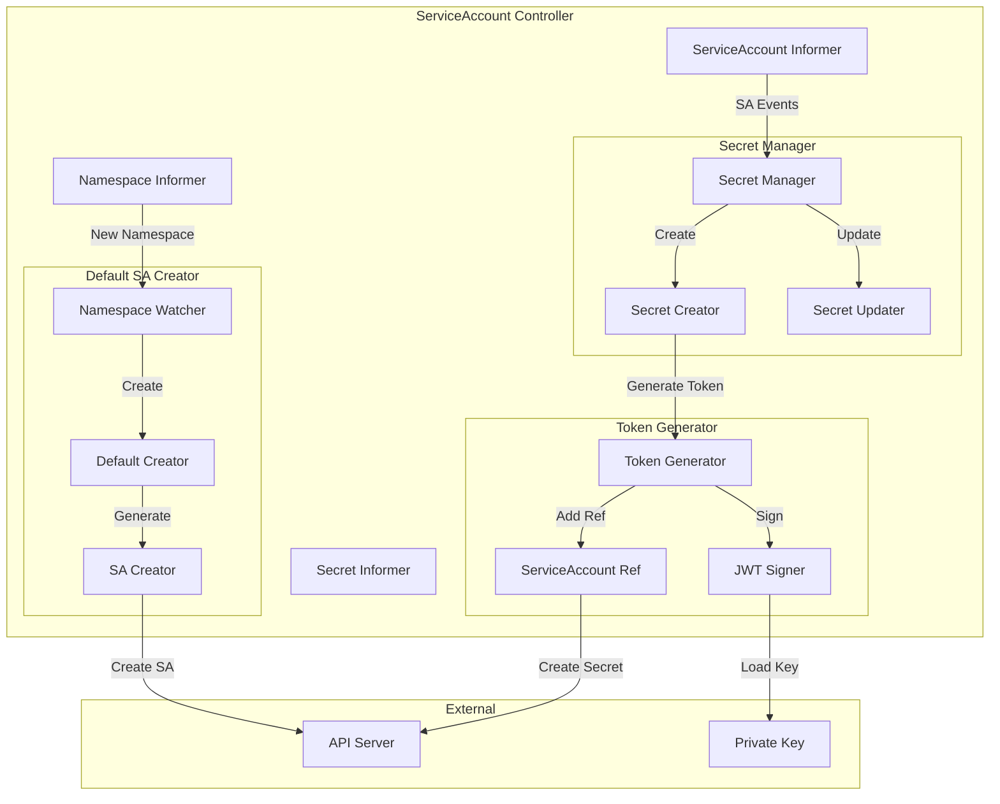
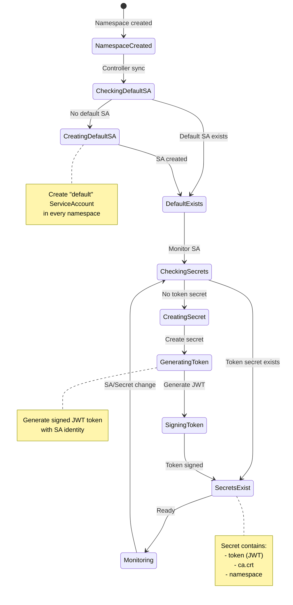
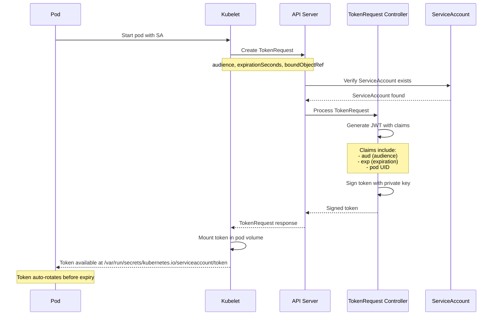

# ServiceAccount and Token Controllers

**Author**: Claude (AI Assistant)
**Date**: 2025-10-21
**Status**: Architecture Study
**Component**: kube-controller-manager

## Overview

ServiceAccount and token controllers manage service account lifecycle, token generation, and secret management. These controllers enable pods to authenticate to the API server and access cluster resources with appropriate permissions.

## Key Components

### 1. ServiceAccount Controller

**Source**: `pkg/controller/serviceaccount/serviceaccount_controller.go`

Ensures every namespace has a default ServiceAccount and manages ServiceAccount secrets.

#### Architecture



#### ServiceAccount Lifecycle



#### Core Data Structures

```go
// Source: pkg/controller/serviceaccount/serviceaccount_controller.go

type ServiceAccountsController struct {
    // ServiceAccount informer
    serviceAccountLister corelisters.ServiceAccountLister
    serviceAccountSynced cache.InformerSynced

    // Namespace informer
    namespaceLister corelisters.NamespaceLister
    namespaceSynced cache.InformerSynced

    // Secret informer
    secretLister corelisters.SecretLister
    secretSynced cache.InformerSynced

    // Client
    client clientset.Interface

    // Work queues
    serviceAccountQueue workqueue.RateLimitingInterface
    namespaceQueue      workqueue.RateLimitingInterface
}
```

#### Default ServiceAccount Creation

```go
// Source: pkg/controller/serviceaccount/serviceaccount_controller.go

// Sync namespace - ensure default ServiceAccount exists
func (c *ServiceAccountsController) syncNamespace(key string) error {
    namespace, err := c.namespaceLister.Get(key)
    if err != nil {
        if errors.IsNotFound(err) {
            return nil
        }
        return err
    }

    // Check if default ServiceAccount exists
    _, err = c.serviceAccountLister.ServiceAccounts(namespace.Name).
        Get("default")
    if err == nil {
        return nil // Default SA already exists
    }

    if !errors.IsNotFound(err) {
        return err
    }

    // Create default ServiceAccount
    return c.createDefaultServiceAccount(namespace.Name)
}

// Create default ServiceAccount
func (c *ServiceAccountsController) createDefaultServiceAccount(
    namespace string,
) error {
    sa := &v1.ServiceAccount{
        ObjectMeta: metav1.ObjectMeta{
            Name:      "default",
            Namespace: namespace,
        },
    }

    _, err := c.client.CoreV1().ServiceAccounts(namespace).Create(
        context.TODO(),
        sa,
        metav1.CreateOptions{},
    )

    if err != nil && !errors.IsAlreadyExists(err) {
        return err
    }

    return nil
}
```

---

### 2. ServiceAccount Token Secret Controller

**Source**: `pkg/controller/serviceaccount/tokens_controller.go`

Manages token secrets for ServiceAccounts.

#### Token Secret Management

```go
// Source: pkg/controller/serviceaccount/tokens_controller.go

type TokensController struct {
    // Informers
    serviceAccountLister corelisters.ServiceAccountLister
    secretLister         corelisters.SecretLister

    // Client
    client clientset.Interface

    // Token generator
    tokenGenerator token.Generator

    // Root CA content
    rootCA []byte

    // Work queue
    serviceAccountQueue workqueue.RateLimitingInterface
    secretQueue         workqueue.RateLimitingInterface
}

// Token generator interface
type Generator interface {
    // Generate token for ServiceAccount
    GenerateToken(serviceAccount *v1.ServiceAccount) (string, error)
}
```

#### Sync ServiceAccount Secrets

```go
// Source: pkg/controller/serviceaccount/tokens_controller.go

// Sync ServiceAccount - ensure token secret exists
func (c *TokensController) syncServiceAccount(key string) error {
    namespace, name, err := cache.SplitMetaNamespaceKey(key)
    if err != nil {
        return err
    }

    // Get ServiceAccount
    sa, err := c.serviceAccountLister.ServiceAccounts(namespace).Get(name)
    if err != nil {
        if errors.IsNotFound(err) {
            return nil
        }
        return err
    }

    // List secrets for this ServiceAccount
    secrets, err := c.listSecretsForServiceAccount(sa)
    if err != nil {
        return err
    }

    // Check if token secret exists
    hasTokenSecret := false
    for _, secret := range secrets {
        if secret.Type == v1.SecretTypeServiceAccountToken {
            hasTokenSecret = true
            break
        }
    }

    // Create token secret if needed
    if !hasTokenSecret {
        return c.createTokenSecret(sa)
    }

    return nil
}

// List secrets for ServiceAccount
func (c *TokensController) listSecretsForServiceAccount(
    sa *v1.ServiceAccount,
) ([]*v1.Secret, error) {
    secrets, err := c.secretLister.Secrets(sa.Namespace).List(labels.Everything())
    if err != nil {
        return nil, err
    }

    var result []*v1.Secret
    for _, secret := range secrets {
        // Check if secret references this ServiceAccount
        if secret.Annotations[v1.ServiceAccountNameKey] == sa.Name {
            result = append(result, secret)
        }
    }

    return result, nil
}

// Create token secret for ServiceAccount
func (c *TokensController) createTokenSecret(sa *v1.ServiceAccount) error {
    // Generate token
    token, err := c.tokenGenerator.GenerateToken(sa)
    if err != nil {
        return err
    }

    // Create secret
    secret := &v1.Secret{
        ObjectMeta: metav1.ObjectMeta{
            Name:      sa.Name + "-token-" + rand.String(5),
            Namespace: sa.Namespace,
            Annotations: map[string]string{
                v1.ServiceAccountNameKey: sa.Name,
                v1.ServiceAccountUIDKey:  string(sa.UID),
            },
        },
        Type: v1.SecretTypeServiceAccountToken,
        Data: map[string][]byte{
            v1.ServiceAccountTokenKey:     []byte(token),
            v1.ServiceAccountRootCAKey:    c.rootCA,
            v1.ServiceAccountNamespaceKey: []byte(sa.Namespace),
        },
    }

    _, err = c.client.CoreV1().Secrets(sa.Namespace).Create(
        context.TODO(),
        secret,
        metav1.CreateOptions{},
    )

    return err
}
```

#### Token Generation

```go
// Source: pkg/serviceaccount/jwt.go

type jwtTokenGenerator struct {
    // Private key for signing
    privateKey crypto.PrivateKey

    // Issuer
    issuer string
}

// Generate JWT token for ServiceAccount
func (j *jwtTokenGenerator) GenerateToken(
    sa *v1.ServiceAccount,
) (string, error) {
    // Create claims
    now := time.Now()
    claims := &jwt.Claims{
        Subject:   serviceaccount.MakeUsername(sa.Namespace, sa.Name),
        IssuedAt:  jwt.NewNumericDate(now),
        NotBefore: jwt.NewNumericDate(now),
        Issuer:    j.issuer,

        // Custom claims
        "kubernetes.io/serviceaccount/namespace":           sa.Namespace,
        "kubernetes.io/serviceaccount/service-account.name": sa.Name,
        "kubernetes.io/serviceaccount/service-account.uid":  string(sa.UID),
    }

    // Sign token
    token := jwt.NewWithClaims(jwt.SigningMethodRS256, claims)
    signed, err := token.SignedString(j.privateKey)
    if err != nil {
        return "", err
    }

    return signed, nil
}

// Make ServiceAccount username
func MakeUsername(namespace, name string) string {
    return fmt.Sprintf("system:serviceaccount:%s:%s", namespace, name)
}
```

---

### 3. TokenRequest Controller

**Source**: `pkg/controller/serviceaccount/tokensrequest_controller.go`

Handles TokenRequest API for bound service account tokens.

#### TokenRequest vs Legacy Tokens

| Feature | Legacy Token Secret | TokenRequest (Bound Token) |
|---------|---------------------|----------------------------|
| Storage | Secret object | Not stored |
| Expiration | Never | Configurable (default 1h) |
| Audience | Any | Bound to specific audience |
| Pod binding | No | Bound to pod |
| Rotation | Manual | Automatic |
| Security | Lower | Higher |

#### TokenRequest Flow



#### TokenRequest Processing

```go
// Source: pkg/registry/core/serviceaccount/storage/token.go

type TokenRequestREST struct {
    // Token generator
    tokenGenerator serviceaccount.TokenGenerator

    // Pod getter for bound tokens
    podLister corelisters.PodLister

    // Secret getter for bound tokens
    secretLister corelisters.SecretLister

    // Max token expiration
    maxExpirationSeconds int64

    // Issuer
    issuer string
}

// Create TokenRequest
func (r *TokenRequestREST) Create(
    ctx context.Context,
    name string,
    obj runtime.Object,
    createValidation rest.ValidateObjectFunc,
    options *metav1.CreateOptions,
) (runtime.Object, error) {
    // Cast to TokenRequest
    tokenRequest := obj.(*authenticationv1.TokenRequest)

    // Get ServiceAccount
    sa, err := r.getServiceAccount(ctx, name)
    if err != nil {
        return nil, err
    }

    // Validate bound object reference
    if tokenRequest.Spec.BoundObjectRef != nil {
        if err := r.validateBoundObjectRef(
            ctx,
            sa.Namespace,
            tokenRequest.Spec.BoundObjectRef,
        ); err != nil {
            return nil, err
        }
    }

    // Determine expiration
    expirationSeconds := tokenRequest.Spec.ExpirationSeconds
    if expirationSeconds == nil {
        defaultExpiration := int64(3600) // 1 hour
        expirationSeconds = &defaultExpiration
    }

    // Apply max expiration
    if *expirationSeconds > r.maxExpirationSeconds {
        expirationSeconds = &r.maxExpirationSeconds
    }

    // Generate token
    token, err := r.generateToken(
        sa,
        tokenRequest.Spec.Audiences,
        *expirationSeconds,
        tokenRequest.Spec.BoundObjectRef,
    )
    if err != nil {
        return nil, err
    }

    // Return TokenRequest with token
    tokenRequest.Status = authenticationv1.TokenRequestStatus{
        Token:               token,
        ExpirationTimestamp: metav1.NewTime(time.Now().Add(time.Duration(*expirationSeconds) * time.Second)),
    }

    return tokenRequest, nil
}

// Generate bound token
func (r *TokenRequestREST) generateToken(
    sa *v1.ServiceAccount,
    audiences []string,
    expirationSeconds int64,
    boundObjectRef *authenticationv1.BoundObjectReference,
) (string, error) {
    // Create claims
    now := time.Now()
    expiry := now.Add(time.Duration(expirationSeconds) * time.Second)

    privateClaims := map[string]interface{}{
        "kubernetes.io": map[string]interface{}{
            "namespace": sa.Namespace,
            "serviceaccount": map[string]interface{}{
                "name": sa.Name,
                "uid":  string(sa.UID),
            },
        },
    }

    // Add bound object reference
    if boundObjectRef != nil {
        privateClaims["kubernetes.io"].(map[string]interface{})["pod"] = map[string]interface{}{
            "name": boundObjectRef.Name,
            "uid":  boundObjectRef.UID,
        }
    }

    // Create JWT
    token, err := r.tokenGenerator.GenerateToken(&jwt.Claims{
        Subject:   serviceaccount.MakeUsername(sa.Namespace, sa.Name),
        Audience:  jwt.Audience(audiences),
        IssuedAt:  jwt.NewNumericDate(now),
        NotBefore: jwt.NewNumericDate(now),
        Expiry:    jwt.NewNumericDate(expiry),
        Issuer:    r.issuer,
    }, privateClaims)

    return token, err
}

// Validate bound object reference
func (r *TokenRequestREST) validateBoundObjectRef(
    ctx context.Context,
    namespace string,
    ref *authenticationv1.BoundObjectReference,
) error {
    switch ref.Kind {
    case "Pod":
        // Verify pod exists
        _, err := r.podLister.Pods(namespace).Get(ref.Name)
        if err != nil {
            return err
        }

    case "Secret":
        // Verify secret exists
        _, err := r.secretLister.Secrets(namespace).Get(ref.Name)
        if err != nil {
            return err
        }

    default:
        return fmt.Errorf("unsupported bound object kind: %s", ref.Kind)
    }

    return nil
}
```

---

### 4. Token Cleanup Controller

**Source**: `pkg/controller/serviceaccount/tokens_controller.go`

Removes invalid or orphaned ServiceAccount token secrets.

```go
// Source: pkg/controller/serviceaccount/tokens_controller.go

// Sync secret - clean up if invalid
func (c *TokensController) syncSecret(key string) error {
    namespace, name, err := cache.SplitMetaNamespaceKey(key)
    if err != nil {
        return err
    }

    // Get secret
    secret, err := c.secretLister.Secrets(namespace).Get(name)
    if err != nil {
        if errors.IsNotFound(err) {
            return nil
        }
        return err
    }

    // Only process ServiceAccount token secrets
    if secret.Type != v1.SecretTypeServiceAccountToken {
        return nil
    }

    // Check if ServiceAccount exists
    saName := secret.Annotations[v1.ServiceAccountNameKey]
    if saName == "" {
        // Invalid secret, delete it
        return c.deleteSecret(secret)
    }

    sa, err := c.serviceAccountLister.ServiceAccounts(namespace).Get(saName)
    if err != nil {
        if errors.IsNotFound(err) {
            // ServiceAccount deleted, remove secret
            return c.deleteSecret(secret)
        }
        return err
    }

    // Check if UID matches
    saUID := secret.Annotations[v1.ServiceAccountUIDKey]
    if saUID != "" && saUID != string(sa.UID) {
        // UID mismatch, ServiceAccount was recreated
        return c.deleteSecret(secret)
    }

    // Verify token is valid
    token := secret.Data[v1.ServiceAccountTokenKey]
    if len(token) == 0 {
        // No token, delete secret
        return c.deleteSecret(secret)
    }

    return nil
}

// Delete secret
func (c *TokensController) deleteSecret(secret *v1.Secret) error {
    return c.client.CoreV1().Secrets(secret.Namespace).Delete(
        context.TODO(),
        secret.Name,
        metav1.DeleteOptions{},
    )
}
```

---

## Projected Volume Token Rotation

### Kubelet Token Rotation

**Source**: `pkg/kubelet/token/token_manager.go`

Kubelet automatically rotates projected ServiceAccount tokens before expiry.

```go
// Source: pkg/kubelet/token/token_manager.go

type Manager struct {
    // Token getter
    getToken func() (string, error)

    // Current token
    token string

    // Token expiration
    expiration time.Time

    // Rotation threshold (80% of lifetime)
    rotationThreshold float64
}

// Get token, rotating if necessary
func (m *Manager) GetToken() (string, error) {
    m.mu.Lock()
    defer m.mu.Unlock()

    // Check if rotation needed
    if m.needsRotation() {
        token, err := m.getToken()
        if err != nil {
            return "", err
        }

        m.token = token
        m.expiration = m.parseExpiration(token)
    }

    return m.token, nil
}

// Check if token needs rotation
func (m *Manager) needsRotation() bool {
    if m.token == "" {
        return true
    }

    // Calculate rotation time
    now := time.Now()
    lifetime := m.expiration.Sub(now)
    threshold := time.Duration(float64(lifetime) * m.rotationThreshold)

    return now.Add(threshold).After(m.expiration)
}
```

### Projected Volume Configuration

```yaml
apiVersion: v1
kind: Pod
metadata:
  name: token-rotation-example
spec:
  serviceAccountName: my-service-account
  containers:
  - name: app
    image: nginx
    volumeMounts:
    - name: token
      mountPath: /var/run/secrets/kubernetes.io/serviceaccount
      readOnly: true
  volumes:
  - name: token
    projected:
      sources:
      - serviceAccountToken:
          # Audience for the token
          audience: api
          # Token expiration (default 1h)
          expirationSeconds: 3600
          # Path where token is mounted
          path: token
      - configMap:
          name: kube-root-ca.crt
          items:
          - key: ca.crt
            path: ca.crt
      - downwardAPI:
          items:
          - path: namespace
            fieldRef:
              fieldPath: metadata.namespace
```

---

## Migration from Legacy to Bound Tokens

### Feature Gates

```bash
# kube-apiserver flags
--feature-gates=TokenRequest=true,TokenRequestProjection=true

# kube-controller-manager flags
--feature-gates=TokenRequest=true
```

### Gradual Migration Strategy

```yaml
# Step 1: Enable both legacy and bound tokens
apiVersion: v1
kind: ServiceAccount
metadata:
  name: my-app
# Legacy secret will be created automatically

---
# Step 2: Update pods to use projected volumes
apiVersion: v1
kind: Pod
metadata:
  name: my-app
spec:
  serviceAccountName: my-app
  # Use projected volume (bound token)
  volumes:
  - name: token
    projected:
      sources:
      - serviceAccountToken:
          path: token
          expirationSeconds: 3600

---
# Step 3: Disable automatic legacy token creation
apiVersion: v1
kind: ServiceAccount
metadata:
  name: my-app
automountServiceAccountToken: false
# No legacy secret created
```

---

## Security Considerations

### 1. Token Audience Binding

```yaml
# Bind token to specific audience
apiVersion: v1
kind: Pod
spec:
  volumes:
  - name: token
    projected:
      sources:
      - serviceAccountToken:
          audience: "https://my-api.example.com"
          expirationSeconds: 3600
```

### 2. Pod Binding

Bound tokens include pod UID in claims, preventing token reuse:

```json
{
  "kubernetes.io": {
    "namespace": "default",
    "serviceaccount": {
      "name": "my-app",
      "uid": "abc-123"
    },
    "pod": {
      "name": "my-app-pod",
      "uid": "def-456"
    }
  }
}
```

### 3. Short Expiration

```yaml
# Use short-lived tokens
serviceAccountToken:
  expirationSeconds: 600  # 10 minutes
```

---

## Configuration

### ServiceAccount Controller

```bash
# kube-controller-manager flags
--service-account-private-key-file=/etc/kubernetes/pki/sa.key
--root-ca-file=/etc/kubernetes/pki/ca.crt
```

### TokenRequest

```bash
# kube-apiserver flags
--service-account-issuer=https://kubernetes.default.svc
--service-account-key-file=/etc/kubernetes/pki/sa.pub
--service-account-signing-key-file=/etc/kubernetes/pki/sa.key
--api-audiences=api,https://kubernetes.default.svc
--service-account-max-token-expiration=8760h  # 1 year
```

---

## Source References

1. **ServiceAccount Controller**: `pkg/controller/serviceaccount/serviceaccount_controller.go`
2. **Tokens Controller**: `pkg/controller/serviceaccount/tokens_controller.go`
3. **TokenRequest**: `pkg/registry/core/serviceaccount/storage/token.go`
4. **JWT Generator**: `pkg/serviceaccount/jwt.go`
5. **Token Manager**: `pkg/kubelet/token/token_manager.go`

---

## Summary

ServiceAccount and token controllers provide identity and authentication for pods:

1. **ServiceAccount Controller**: Creates default ServiceAccounts in every namespace
2. **Token Secret Controller**: Generates and manages legacy token secrets
3. **TokenRequest Controller**: Handles bound, time-limited tokens with audience and pod binding
4. **Token Cleanup Controller**: Removes orphaned or invalid token secrets
5. **Token Rotation**: Automatic rotation of projected volume tokens before expiry

Modern deployments should prefer TokenRequest (bound tokens) over legacy token secrets for improved security through time-limited, audience-bound, and pod-bound tokens.
