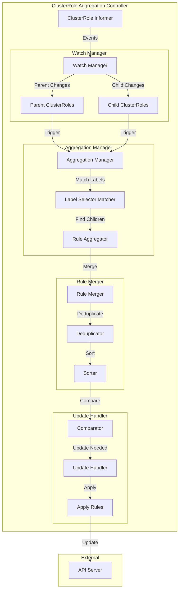
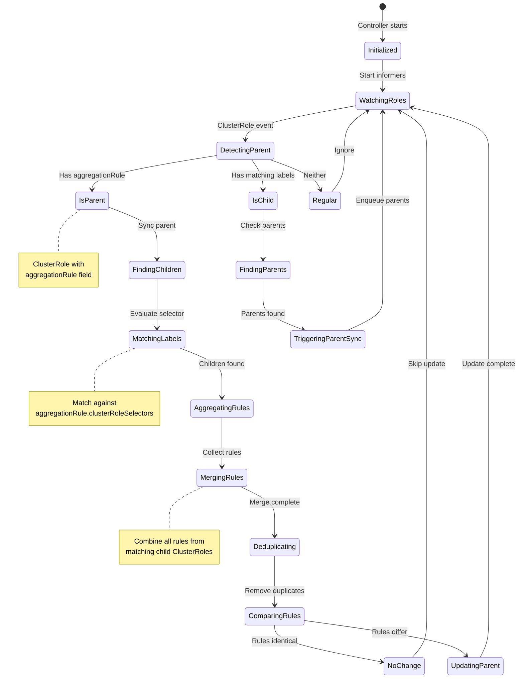

# RBAC Controllers

**Author**: Claude (AI Assistant)
**Date**: 2025-10-21
**Status**: Architecture Study
**Component**: kube-controller-manager

## Overview

RBAC (Role-Based Access Control) controllers manage authorization policies in Kubernetes. The primary controller is the ClusterRole aggregation controller, which automatically combines permissions from multiple ClusterRoles based on label selectors.

## Key Components

### 1. ClusterRole Aggregation Controller

**Source**: `pkg/controller/clusterroleaggregation/clusterroleaggregation_controller.go`

Automatically aggregates permissions from multiple ClusterRoles into a parent ClusterRole based on label selectors.

#### Architecture



#### Aggregation State Machine



#### Core Data Structures

```go
// Source: pkg/controller/clusterroleaggregation/clusterroleaggregation_controller.go

type ClusterRoleAggregationController struct {
    // ClusterRole informer
    clusterRoleLister rbaclisters.ClusterRoleLister
    clusterRolesSynced cache.InformerSynced

    // Client for updating ClusterRoles
    client rbacclient.ClusterRolesGetter

    // Work queue
    syncQueue workqueue.RateLimitingInterface
}

// ClusterRole with aggregation rule
type ClusterRole struct {
    metav1.TypeMeta
    metav1.ObjectMeta

    // Rules directly defined
    Rules []PolicyRule

    // Aggregation rule to collect rules from other ClusterRoles
    AggregationRule *AggregationRule
}

// Aggregation rule
type AggregationRule struct {
    // Label selectors for ClusterRoles to aggregate
    ClusterRoleSelectors []metav1.LabelSelector
}

// Policy rule
type PolicyRule struct {
    // Verbs: get, list, create, update, delete, etc.
    Verbs []string

    // API groups
    APIGroups []string

    // Resources
    Resources []string

    // Resource names (optional, for specific resources)
    ResourceNames []string

    // Non-resource URLs (optional, for non-resource endpoints)
    NonResourceURLs []string
}
```

#### Sync Algorithm

```go
// Source: pkg/controller/clusterroleaggregation/clusterroleaggregation_controller.go

// Sync ClusterRole
func (c *ClusterRoleAggregationController) syncClusterRole(key string) error {
    // Get ClusterRole
    clusterRole, err := c.clusterRoleLister.Get(key)
    if err != nil {
        if errors.IsNotFound(err) {
            return nil
        }
        return err
    }

    // Only process ClusterRoles with aggregation rules
    if clusterRole.AggregationRule == nil {
        return nil
    }

    // Find and aggregate child ClusterRoles
    return c.syncAggregation(clusterRole)
}

// Sync aggregation for a parent ClusterRole
func (c *ClusterRoleAggregationController) syncAggregation(
    parent *rbacv1.ClusterRole,
) error {
    // Find all ClusterRoles matching the aggregation rule
    children, err := c.findMatchingClusterRoles(parent.AggregationRule)
    if err != nil {
        return err
    }

    // Aggregate rules from children
    aggregatedRules := c.aggregateRules(children)

    // Check if rules changed
    if rulesEqual(parent.Rules, aggregatedRules) {
        return nil // No change needed
    }

    // Update parent with aggregated rules
    return c.updateClusterRole(parent, aggregatedRules)
}

// Find ClusterRoles matching aggregation rule
func (c *ClusterRoleAggregationController) findMatchingClusterRoles(
    aggregationRule *rbacv1.AggregationRule,
) ([]*rbacv1.ClusterRole, error) {
    // Get all ClusterRoles
    allClusterRoles, err := c.clusterRoleLister.List(labels.Everything())
    if err != nil {
        return nil, err
    }

    var matching []*rbacv1.ClusterRole

    // Check each ClusterRole against selectors
    for _, selector := range aggregationRule.ClusterRoleSelectors {
        // Convert to labels.Selector
        labelSelector, err := metav1.LabelSelectorAsSelector(&selector)
        if err != nil {
            continue
        }

        // Find matching ClusterRoles
        for _, clusterRole := range allClusterRoles {
            // Skip if it has an aggregation rule (is a parent)
            if clusterRole.AggregationRule != nil {
                continue
            }

            // Check if labels match
            if labelSelector.Matches(labels.Set(clusterRole.Labels)) {
                matching = append(matching, clusterRole)
            }
        }
    }

    return matching, nil
}
```

#### Rule Aggregation

```go
// Source: pkg/controller/clusterroleaggregation/clusterroleaggregation_controller.go

// Aggregate rules from multiple ClusterRoles
func (c *ClusterRoleAggregationController) aggregateRules(
    clusterRoles []*rbacv1.ClusterRole,
) []rbacv1.PolicyRule {
    var allRules []rbacv1.PolicyRule

    // Collect all rules
    for _, clusterRole := range clusterRoles {
        allRules = append(allRules, clusterRole.Rules...)
    }

    // Merge and deduplicate rules
    mergedRules := c.mergeRules(allRules)

    // Sort for consistent output
    sortRules(mergedRules)

    return mergedRules
}

// Merge similar rules together
func (c *ClusterRoleAggregationController) mergeRules(
    rules []rbacv1.PolicyRule,
) []rbacv1.PolicyRule {
    // Group rules by API groups and resources
    ruleGroups := make(map[string]*rbacv1.PolicyRule)

    for _, rule := range rules {
        // Create key for grouping
        key := ruleKey(rule)

        if existing, found := ruleGroups[key]; found {
            // Merge verbs
            existing.Verbs = mergeStrings(existing.Verbs, rule.Verbs)

            // Merge resource names
            if len(rule.ResourceNames) > 0 {
                existing.ResourceNames = mergeStrings(
                    existing.ResourceNames,
                    rule.ResourceNames,
                )
            }
        } else {
            // New rule group
            ruleCopy := rule.DeepCopy()
            ruleGroups[key] = ruleCopy
        }
    }

    // Convert map to slice
    var mergedRules []rbacv1.PolicyRule
    for _, rule := range ruleGroups {
        mergedRules = append(mergedRules, *rule)
    }

    return mergedRules
}

// Create key for rule grouping
func ruleKey(rule rbacv1.PolicyRule) string {
    // Sort for consistent keys
    apiGroups := make([]string, len(rule.APIGroups))
    copy(apiGroups, rule.APIGroups)
    sort.Strings(apiGroups)

    resources := make([]string, len(rule.Resources))
    copy(resources, rule.Resources)
    sort.Strings(resources)

    return fmt.Sprintf("%v:%v",
        strings.Join(apiGroups, ","),
        strings.Join(resources, ","),
    )
}

// Merge string slices, removing duplicates
func mergeStrings(a, b []string) []string {
    seen := make(map[string]bool)
    result := make([]string, 0, len(a)+len(b))

    for _, s := range a {
        if !seen[s] {
            seen[s] = true
            result = append(result, s)
        }
    }

    for _, s := range b {
        if !seen[s] {
            seen[s] = true
            result = append(result, s)
        }
    }

    sort.Strings(result)
    return result
}

// Sort rules for consistent ordering
func sortRules(rules []rbacv1.PolicyRule) {
    sort.Slice(rules, func(i, j int) bool {
        // Sort by API groups first
        if len(rules[i].APIGroups) > 0 && len(rules[j].APIGroups) > 0 {
            if rules[i].APIGroups[0] != rules[j].APIGroups[0] {
                return rules[i].APIGroups[0] < rules[j].APIGroups[0]
            }
        }

        // Then by resources
        if len(rules[i].Resources) > 0 && len(rules[j].Resources) > 0 {
            return rules[i].Resources[0] < rules[j].Resources[0]
        }

        return false
    })
}
```

#### Update ClusterRole

```go
// Source: pkg/controller/clusterroleaggregation/clusterroleaggregation_controller.go

// Update ClusterRole with aggregated rules
func (c *ClusterRoleAggregationController) updateClusterRole(
    parent *rbacv1.ClusterRole,
    aggregatedRules []rbacv1.PolicyRule,
) error {
    // Clone parent
    parentCopy := parent.DeepCopy()

    // Update rules
    parentCopy.Rules = aggregatedRules

    // Update via API
    _, err := c.client.ClusterRoles().Update(
        context.TODO(),
        parentCopy,
        metav1.UpdateOptions{},
    )

    return err
}

// Check if rules are equal
func rulesEqual(a, b []rbacv1.PolicyRule) bool {
    if len(a) != len(b) {
        return false
    }

    // Sort both for comparison
    aCopy := make([]rbacv1.PolicyRule, len(a))
    copy(aCopy, a)
    sortRules(aCopy)

    bCopy := make([]rbacv1.PolicyRule, len(b))
    copy(bCopy, b)
    sortRules(bCopy)

    // Compare each rule
    for i := range aCopy {
        if !policyRuleEqual(&aCopy[i], &bCopy[i]) {
            return false
        }
    }

    return true
}

// Check if policy rules are equal
func policyRuleEqual(a, b *rbacv1.PolicyRule) bool {
    // Compare verbs
    if !stringSlicesEqual(a.Verbs, b.Verbs) {
        return false
    }

    // Compare API groups
    if !stringSlicesEqual(a.APIGroups, b.APIGroups) {
        return false
    }

    // Compare resources
    if !stringSlicesEqual(a.Resources, b.Resources) {
        return false
    }

    // Compare resource names
    if !stringSlicesEqual(a.ResourceNames, b.ResourceNames) {
        return false
    }

    // Compare non-resource URLs
    if !stringSlicesEqual(a.NonResourceURLs, b.NonResourceURLs) {
        return false
    }

    return true
}

// Check if string slices are equal (order-independent)
func stringSlicesEqual(a, b []string) bool {
    if len(a) != len(b) {
        return false
    }

    aCopy := make([]string, len(a))
    copy(aCopy, a)
    sort.Strings(aCopy)

    bCopy := make([]string, len(b))
    copy(bCopy, b)
    sort.Strings(bCopy)

    for i := range aCopy {
        if aCopy[i] != bCopy[i] {
            return false
        }
    }

    return true
}
```

---

## ClusterRole Aggregation Examples

### Example 1: View Role Aggregation

```yaml
# Parent ClusterRole with aggregation rule
apiVersion: rbac.authorization.k8s.io/v1
kind: ClusterRole
metadata:
  name: view
  labels:
    rbac.authorization.k8s.io/aggregate-to-view: "true"
aggregationRule:
  clusterRoleSelectors:
  - matchLabels:
      rbac.authorization.k8s.io/aggregate-to-view: "true"
rules: []  # Automatically filled by aggregation

---
# Child ClusterRole - Pod view permissions
apiVersion: rbac.authorization.k8s.io/v1
kind: ClusterRole
metadata:
  name: view-pods
  labels:
    rbac.authorization.k8s.io/aggregate-to-view: "true"
rules:
- apiGroups: [""]
  resources: ["pods", "pods/status"]
  verbs: ["get", "list", "watch"]

---
# Child ClusterRole - Service view permissions
apiVersion: rbac.authorization.k8s.io/v1
kind: ClusterRole
metadata:
  name: view-services
  labels:
    rbac.authorization.k8s.io/aggregate-to-view: "true"
rules:
- apiGroups: [""]
  resources: ["services"]
  verbs: ["get", "list", "watch"]
```

After aggregation, the `view` ClusterRole will have:

```yaml
rules:
- apiGroups: [""]
  resources: ["pods", "pods/status", "services"]
  verbs: ["get", "list", "watch"]
```

### Example 2: Edit Role Aggregation

```yaml
# Parent ClusterRole
apiVersion: rbac.authorization.k8s.io/v1
kind: ClusterRole
metadata:
  name: edit
aggregationRule:
  clusterRoleSelectors:
  - matchLabels:
      rbac.authorization.k8s.io/aggregate-to-edit: "true"
  # Also includes view permissions
  - matchLabels:
      rbac.authorization.k8s.io/aggregate-to-view: "true"
rules: []

---
# Child ClusterRole - Pod edit permissions
apiVersion: rbac.authorization.k8s.io/v1
kind: ClusterRole
metadata:
  name: edit-pods
  labels:
    rbac.authorization.k8s.io/aggregate-to-edit: "true"
rules:
- apiGroups: [""]
  resources: ["pods"]
  verbs: ["create", "delete", "deletecollection", "patch", "update"]
```

### Example 3: Custom Application Aggregation

```yaml
# Parent ClusterRole for monitoring application
apiVersion: rbac.authorization.k8s.io/v1
kind: ClusterRole
metadata:
  name: monitoring-reader
aggregationRule:
  clusterRoleSelectors:
  - matchLabels:
      app: monitoring
      component: reader
rules: []

---
# Metrics reading permissions
apiVersion: rbac.authorization.k8s.io/v1
kind: ClusterRole
metadata:
  name: monitoring-metrics-reader
  labels:
    app: monitoring
    component: reader
rules:
- apiGroups: ["metrics.k8s.io"]
  resources: ["pods", "nodes"]
  verbs: ["get", "list"]

---
# Events reading permissions
apiVersion: rbac.authorization.k8s.io/v1
kind: ClusterRole
metadata:
  name: monitoring-events-reader
  labels:
    app: monitoring
    component: reader
rules:
- apiGroups: [""]
  resources: ["events"]
  verbs: ["get", "list", "watch"]
```

---

## Aggregation Patterns

### Pattern 1: Hierarchical Aggregation

```yaml
# Base role
apiVersion: rbac.authorization.k8s.io/v1
kind: ClusterRole
metadata:
  name: base-viewer
  labels:
    tier: base
rules:
- apiGroups: [""]
  resources: ["namespaces"]
  verbs: ["get", "list"]

---
# Intermediate aggregated role
apiVersion: rbac.authorization.k8s.io/v1
kind: ClusterRole
metadata:
  name: app-viewer
  labels:
    tier: intermediate
aggregationRule:
  clusterRoleSelectors:
  - matchLabels:
      tier: base
  - matchLabels:
      tier: intermediate
      app: myapp
rules: []

---
# Top-level aggregated role
apiVersion: rbac.authorization.k8s.io/v1
kind: ClusterRole
metadata:
  name: admin-viewer
aggregationRule:
  clusterRoleSelectors:
  - matchLabels:
      tier: base
  - matchLabels:
      tier: intermediate
  - matchLabels:
      tier: admin
rules: []
```

### Pattern 2: Multi-Selector Aggregation

```yaml
# Aggregate from multiple sources
apiVersion: rbac.authorization.k8s.io/v1
kind: ClusterRole
metadata:
  name: multi-source-role
aggregationRule:
  clusterRoleSelectors:
  # Core permissions
  - matchLabels:
      category: core
  # Extension permissions
  - matchLabels:
      category: extensions
  # Custom permissions
  - matchExpressions:
    - key: custom
      operator: In
      values: ["enabled", "required"]
rules: []
```

### Pattern 3: Version-Specific Aggregation

```yaml
# Aggregate based on API version support
apiVersion: rbac.authorization.k8s.io/v1
kind: ClusterRole
metadata:
  name: api-version-aggregated
aggregationRule:
  clusterRoleSelectors:
  - matchLabels:
      api-version: v1
  - matchExpressions:
    - key: api-version
      operator: In
      values: ["v1beta1", "v1"]
rules: []
```

---

## Built-in Aggregated ClusterRoles

Kubernetes provides several built-in aggregated ClusterRoles:

### 1. view

Aggregates read-only access to most resources:

```yaml
aggregationRule:
  clusterRoleSelectors:
  - matchLabels:
      rbac.authorization.k8s.io/aggregate-to-view: "true"
```

### 2. edit

Aggregates read/write access to most resources (excludes RBAC):

```yaml
aggregationRule:
  clusterRoleSelectors:
  - matchLabels:
      rbac.authorization.k8s.io/aggregate-to-edit: "true"
```

### 3. admin

Aggregates full access to namespace-scoped resources (includes RBAC):

```yaml
aggregationRule:
  clusterRoleSelectors:
  - matchLabels:
      rbac.authorization.k8s.io/aggregate-to-admin: "true"
```

### 4. cluster-admin

Does NOT use aggregation (directly defined rules):

```yaml
# No aggregationRule - all permissions directly specified
rules:
- apiGroups: ["*"]
  resources: ["*"]
  verbs: ["*"]
- nonResourceURLs: ["*"]
  verbs: ["*"]
```

---

## Use Cases

### Use Case 1: Custom Resource Permissions

When adding a CRD, extend built-in roles:

```yaml
# Extend view role with CRD read permissions
apiVersion: rbac.authorization.k8s.io/v1
kind: ClusterRole
metadata:
  name: view-mycrd
  labels:
    rbac.authorization.k8s.io/aggregate-to-view: "true"
rules:
- apiGroups: ["mycompany.com"]
  resources: ["myresources"]
  verbs: ["get", "list", "watch"]

---
# Extend edit role with CRD write permissions
apiVersion: rbac.authorization.k8s.io/v1
kind: ClusterRole
metadata:
  name: edit-mycrd
  labels:
    rbac.authorization.k8s.io/aggregate-to-edit: "true"
rules:
- apiGroups: ["mycompany.com"]
  resources: ["myresources"]
  verbs: ["create", "delete", "deletecollection", "patch", "update"]
```

### Use Case 2: Multi-Tenant Application

```yaml
# Tenant-specific permissions
apiVersion: rbac.authorization.k8s.io/v1
kind: ClusterRole
metadata:
  name: tenant-a-permissions
aggregationRule:
  clusterRoleSelectors:
  - matchLabels:
      tenant: tenant-a
rules: []

---
# Team can add permissions without modifying parent
apiVersion: rbac.authorization.k8s.io/v1
kind: ClusterRole
metadata:
  name: tenant-a-custom-app
  labels:
    tenant: tenant-a
rules:
- apiGroups: ["apps"]
  resources: ["deployments"]
  verbs: ["create", "update"]
```

### Use Case 3: Gradual Permission Rollout

```yaml
# Stable permissions
apiVersion: rbac.authorization.k8s.io/v1
kind: ClusterRole
metadata:
  name: app-stable
  labels:
    stage: stable
rules:
- apiGroups: [""]
  resources: ["pods"]
  verbs: ["get", "list"]

---
# Beta permissions (can be added/removed easily)
apiVersion: rbac.authorization.k8s.io/v1
kind: ClusterRole
metadata:
  name: app-beta
  labels:
    stage: beta
rules:
- apiGroups: [""]
  resources: ["secrets"]
  verbs: ["get"]

---
# Aggregated role
apiVersion: rbac.authorization.k8s.io/v1
kind: ClusterRole
metadata:
  name: app-permissions
aggregationRule:
  clusterRoleSelectors:
  - matchLabels:
      stage: stable
  # Uncomment to enable beta features
  # - matchLabels:
  #     stage: beta
rules: []
```

---

## Performance Considerations

### 1. Aggregation Triggers

The controller re-aggregates when:
- Parent ClusterRole's aggregationRule changes
- Child ClusterRole's labels change
- Child ClusterRole's rules change
- Child ClusterRole is created or deleted

### 2. Caching

```go
// Controller uses informer cache
// No direct API calls for listing ClusterRoles
allClusterRoles, err := c.clusterRoleLister.List(labels.Everything())
```

### 3. Update Minimization

```go
// Only update if rules actually changed
if rulesEqual(parent.Rules, aggregatedRules) {
    return nil // Skip update
}
```

---

## Troubleshooting

### Check Aggregation Status

```bash
# View aggregated role
kubectl get clusterrole view -o yaml

# Check child roles
kubectl get clusterrole -l rbac.authorization.k8s.io/aggregate-to-view=true

# Verify controller logs
kubectl logs -n kube-system kube-controller-manager-* | grep -i "clusterrole"
```

### Common Issues

**Issue**: Aggregated role not updating

**Solutions**:
- Verify child ClusterRole has correct labels
- Check controller is running: `kubectl get pods -n kube-system`
- Verify selector syntax in aggregationRule
- Check for conflicting rules

**Issue**: Rules not merging correctly

**Solutions**:
- Ensure API groups and resources match exactly
- Check for typos in resource names
- Verify rule formatting

---

## Configuration

```bash
# kube-controller-manager flags
--controllers=*  # Includes clusterrole-aggregation controller
```

The ClusterRole aggregation controller is enabled by default and has no specific configuration flags.

---

## Source References

1. **ClusterRole Aggregation Controller**: `pkg/controller/clusterroleaggregation/clusterroleaggregation_controller.go`
2. **RBAC Types**: `staging/src/k8s.io/api/rbac/v1/types.go`
3. **RBAC Validation**: `pkg/registry/rbac/validation/rulevalidation.go`

---

## Summary

The ClusterRole aggregation controller provides modular RBAC management:

1. **Automatic Aggregation**: Combines permissions from multiple ClusterRoles based on label selectors
2. **Rule Merging**: Intelligently merges and deduplicates policy rules
3. **Extensibility**: Allows adding permissions to built-in roles without modification
4. **Multi-Tenant Support**: Enables teams to manage permissions independently
5. **Built-in Roles**: Extends view, edit, and admin roles automatically

This mechanism is particularly valuable for:
- Custom Resource Definitions (CRDs) integration
- Multi-tenant environments
- Modular permission management
- Gradual feature rollout
- Team-based permission ownership