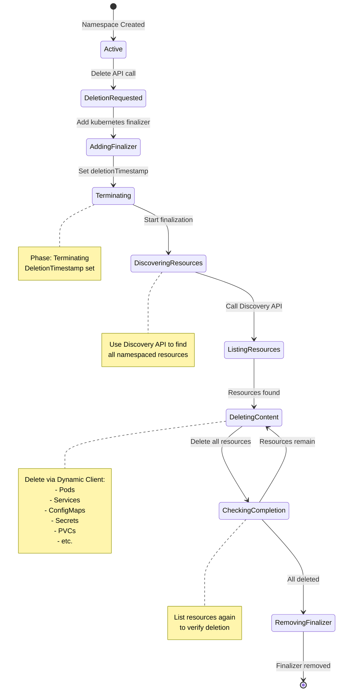
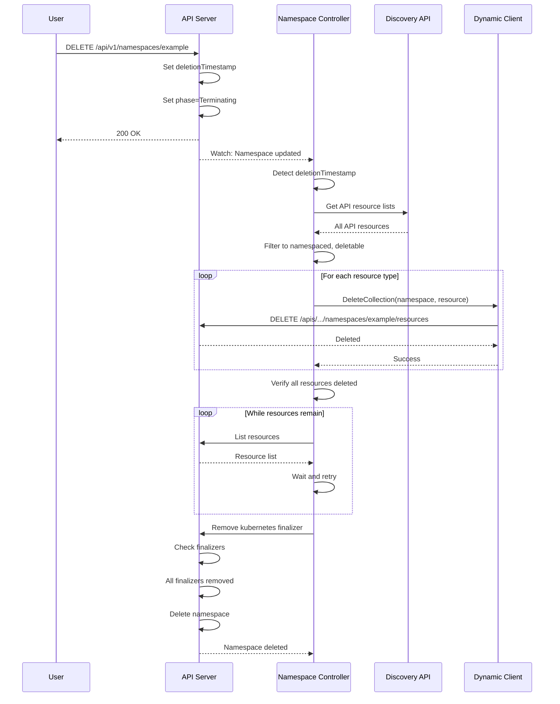

# Namespace Lifecycle Controller

**Author**: Claude (AI Assistant)
**Date**: 2025-10-21
**Status**: Architecture Study
**Component**: kube-controller-manager

## Overview

The Namespace Lifecycle Controller manages the complete lifecycle of namespaces, focusing primarily on namespace deletion and finalization. It ensures all resources within a namespace are properly cleaned up before the namespace itself is removed from the system.

**Note**: This controller overlaps with the Namespace controller covered in document 12 (resource-lifecycle-controllers.md). This document provides additional depth on namespace-specific lifecycle management.

## Key Components

### 1. Namespace Lifecycle Controller

**Source**: `pkg/controller/namespace/namespace_controller.go`

Manages namespace finalization, ensuring complete cleanup before deletion.

#### Architecture

```mermaid
graph TB
    subgraph "Namespace Lifecycle Controller"
        NSI[Namespace Informer]

        subgraph "Deletion Handler"
            DH[Deletion Handler]
            FC[Finalizer Check]
            DC[Deletion Check]
        end

        subgraph "Content Deleter"
            CD[Content Deleter]
            RD[Resource Discoverer]
            DD[Dynamic Deleter]
        end

        subgraph "Finalizer Manager"
            FM[Finalizer Manager]
            FA[Finalizer Adder]
            FR[Finalizer Remover]
        end

        subgraph "Phase Manager"
            PM[Phase Manager]
            TM[Terminating Marker]
            SM[Status Manager]
        end

        subgraph "Worker Pool"
            WP[Worker Pool]
            WQ[Work Queue]
        end
    end

    subgraph "External"
        API[API Server]
        DISC[Discovery API]
        DYN[Dynamic Client]
    end

    NSI -->|Events| WQ
    WQ -->|Dequeue| WP

    WP -->|Check| DH
    DH -->|Has DeletionTimestamp| FC
    DH -->|No DeletionTimestamp| SM

    FC -->|Has Finalizers| CD
    FC -->|No Finalizers| DC

    CD -->|Discover Resources| RD
    RD -->|Query| DISC
    DISC -->>RD: API Resource Lists

    RD -->|Delete Resources| DD
    DD -->|Delete All| DYN
    DYN -->|Call| API

    DD -->|Complete| FM
    FM -->|Remove| FR
    FR -->|Update| API

    SM -->|Set Phase| PM
    PM -->|Update Status| API
```

#### Namespace Deletion State Machine



#### Core Data Structures

```go
// Source: pkg/controller/namespace/namespace_controller.go

type NamespaceController struct {
    // Namespace informer
    lister       corelisters.NamespaceLister
    listerSynced cache.InformerSynced

    // Client for namespace updates
    client clientset.Interface

    // Work queue
    queue workqueue.RateLimitingInterface

    // Content deleter
    namespacedResourcesDeleter NamespacedResourcesDeleterInterface

    // Finalization token
    finalizerToken v1.FinalizerName
}

// Namespaced resources deleter interface
type NamespacedResourcesDeleterInterface interface {
    // Delete all resources in namespace
    Delete(nsName string) error
}

type namespacedResourcesDeleter struct {
    // Metadata client for efficient deletion
    metadataClient metadata.Interface

    // Dynamic client for resource deletion
    dynamicClient dynamic.Interface

    // Discovery for finding resources
    discoverResourcesFn func() ([]*metav1.APIResourceList, error)

    // Finalizer token
    finalizerToken v1.FinalizerName
}

// Deletable resource representation
type deletableResource struct {
    Group   string
    Version string
    Name    string
}
```

#### Namespace Sync Algorithm

```go
// Source: pkg/controller/namespace/namespace_controller.go

// Sync namespace
func (nm *NamespaceController) syncNamespaceFromKey(key string) error {
    namespace, err := nm.lister.Get(key)
    if err != nil {
        if errors.IsNotFound(err) {
            return nil
        }
        return err
    }

    // If namespace is not being deleted, ensure finalizer exists
    if namespace.DeletionTimestamp == nil {
        return nm.ensureFinalizerExists(namespace)
    }

    // Namespace is being deleted, finalize it
    return nm.namespacedResourcesDeleter.Delete(namespace.Name)
}

// Ensure finalizer exists on namespace
func (nm *NamespaceController) ensureFinalizerExists(
    namespace *v1.Namespace,
) error {
    // Check if finalizer already exists
    for _, finalizer := range namespace.Spec.Finalizers {
        if finalizer == nm.finalizerToken {
            return nil
        }
    }

    // Add finalizer
    namespaceCopy := namespace.DeepCopy()
    namespaceCopy.Spec.Finalizers = append(
        namespaceCopy.Spec.Finalizers,
        nm.finalizerToken,
    )

    _, err := nm.client.CoreV1().Namespaces().Finalize(
        context.TODO(),
        namespaceCopy,
        metav1.UpdateOptions{},
    )

    return err
}
```

#### Resource Discovery

```go
// Source: pkg/controller/namespace/deletion/namespaced_resources_deleter.go

// Delete all resources in namespace
func (d *namespacedResourcesDeleter) Delete(nsName string) error {
    // Discover all deletable resources
    deletableResources, err := d.discoverResources()
    if err != nil {
        return err
    }

    // Delete all content in namespace
    deleteErrors := d.deleteAllContent(nsName, deletableResources)
    if len(deleteErrors) > 0 {
        return fmt.Errorf("failed to delete all content: %v", deleteErrors)
    }

    // Check if any resources remain
    remainingResources, err := d.checkRemainingResources(nsName, deletableResources)
    if err != nil {
        return err
    }

    if len(remainingResources) > 0 {
        return fmt.Errorf("resources remaining: %v", remainingResources)
    }

    // All clear, remove finalizer
    return d.removeFinalizer(nsName)
}

// Discover deletable resources
func (d *namespacedResourcesDeleter) discoverResources() ([]deletableResource, error) {
    // Get API resource lists from discovery
    apiResourceLists, err := d.discoverResourcesFn()
    if err != nil {
        return nil, err
    }

    var deletableResources []deletableResource

    for _, apiResourceList := range apiResourceLists {
        // Parse group version
        gv, err := schema.ParseGroupVersion(apiResourceList.GroupVersion)
        if err != nil {
            continue
        }

        for _, apiResource := range apiResourceList.APIResources {
            // Skip non-namespaced resources
            if !apiResource.Namespaced {
                continue
            }

            // Skip subresources (like pods/status)
            if strings.Contains(apiResource.Name, "/") {
                continue
            }

            // Check if resource supports deletion
            if !supportsVerb(apiResource, "delete") {
                continue
            }

            // Check if resource supports list
            if !supportsVerb(apiResource, "list") {
                continue
            }

            deletableResources = append(deletableResources, deletableResource{
                Group:   gv.Group,
                Version: gv.Version,
                Name:    apiResource.Name,
            })
        }
    }

    return deletableResources, nil
}

// Check if resource supports verb
func supportsVerb(apiResource metav1.APIResource, verb string) bool {
    for _, v := range apiResource.Verbs {
        if v == verb {
            return true
        }
    }
    return false
}
```

#### Content Deletion

```go
// Source: pkg/controller/namespace/deletion/namespaced_resources_deleter.go

// Delete all content in namespace
func (d *namespacedResourcesDeleter) deleteAllContent(
    nsName string,
    resources []deletableResource,
) []error {
    var errs []error

    // Group resources by priority
    critical, normal := d.categorizeResources(resources)

    // Delete critical resources first (e.g., pods)
    for _, resource := range critical {
        if err := d.deleteResource(nsName, resource); err != nil {
            errs = append(errs, err)
        }
    }

    // Delete remaining resources
    for _, resource := range normal {
        if err := d.deleteResource(nsName, resource); err != nil {
            errs = append(errs, err)
        }
    }

    return errs
}

// Categorize resources by deletion priority
func (d *namespacedResourcesDeleter) categorizeResources(
    resources []deletableResource,
) (critical, normal []deletableResource) {
    for _, resource := range resources {
        // Pods are critical - delete first
        if resource.Group == "" && resource.Name == "pods" {
            critical = append(critical, resource)
            continue
        }

        // PVCs are critical - delete before PVs
        if resource.Group == "" && resource.Name == "persistentvolumeclaims" {
            critical = append(critical, resource)
            continue
        }

        normal = append(normal, resource)
    }

    return critical, normal
}

// Delete all resources of a type in namespace
func (d *namespacedResourcesDeleter) deleteResource(
    nsName string,
    resource deletableResource,
) error {
    // Build GVR
    gvr := schema.GroupVersionResource{
        Group:    resource.Group,
        Version:  resource.Version,
        Resource: resource.Name,
    }

    // Use background deletion
    deletePolicy := metav1.DeletePropagationBackground

    // Delete collection
    err := d.metadataClient.Resource(gvr).Namespace(nsName).DeleteCollection(
        context.TODO(),
        metav1.DeleteOptions{
            PropagationPolicy: &deletePolicy,
        },
        metav1.ListOptions{},
    )

    // Ignore not found errors
    if err != nil && !errors.IsNotFound(err) {
        return err
    }

    return nil
}
```

#### Remaining Resources Check

```go
// Source: pkg/controller/namespace/deletion/namespaced_resources_deleter.go

// Check for remaining resources after deletion
func (d *namespacedResourcesDeleter) checkRemainingResources(
    nsName string,
    resources []deletableResource,
) ([]deletableResource, error) {
    var remaining []deletableResource

    for _, resource := range resources {
        // Build GVR
        gvr := schema.GroupVersionResource{
            Group:    resource.Group,
            Version:  resource.Version,
            Resource: resource.Name,
        }

        // List resources
        list, err := d.metadataClient.Resource(gvr).Namespace(nsName).List(
            context.TODO(),
            metav1.ListOptions{},
        )

        if err != nil {
            // If we can't list, assume resources might remain
            if !errors.IsNotFound(err) && !errors.IsMethodNotSupported(err) {
                remaining = append(remaining, resource)
            }
            continue
        }

        // Check if any resources exist
        if len(list.Items) > 0 {
            remaining = append(remaining, resource)
        }
    }

    return remaining, nil
}
```

#### Finalizer Removal

```go
// Source: pkg/controller/namespace/deletion/namespaced_resources_deleter.go

// Remove finalizer from namespace
func (d *namespacedResourcesDeleter) removeFinalizer(nsName string) error {
    // Get latest namespace
    namespace, err := d.client.CoreV1().Namespaces().Get(
        context.TODO(),
        nsName,
        metav1.GetOptions{},
    )
    if err != nil {
        return err
    }

    // Remove finalizer
    namespaceCopy := namespace.DeepCopy()
    var newFinalizers []v1.FinalizerName

    for _, finalizer := range namespace.Spec.Finalizers {
        if finalizer != d.finalizerToken {
            newFinalizers = append(newFinalizers, finalizer)
        }
    }

    namespaceCopy.Spec.Finalizers = newFinalizers

    // Update namespace
    _, err = d.client.CoreV1().Namespaces().Finalize(
        context.TODO(),
        namespaceCopy,
        metav1.UpdateOptions{},
    )

    return err
}
```

---

## Namespace Deletion Sequence

### Complete Flow



---

## Special Resource Handling

### 1. Pods

Pods are deleted first to:
- Stop consuming resources quickly
- Allow controllers to react to pod termination
- Trigger PVC release if needed

```go
// Pods are high-priority for deletion
if resource.Group == "" && resource.Name == "pods" {
    critical = append(critical, resource)
}
```

### 2. PersistentVolumeClaims

PVCs are deleted early to:
- Release PersistentVolumes
- Allow storage cleanup
- Prevent volume leaks

```go
if resource.Group == "" && resource.Name == "persistentvolumeclaims" {
    critical = append(critical, resource)
}
```

### 3. Finalizers on Resources

Resources with finalizers will block namespace deletion:

```yaml
apiVersion: v1
kind: ConfigMap
metadata:
  name: important-config
  namespace: example
  finalizers:
  - example.com/protection
data:
  key: value
```

Namespace will remain in Terminating state until finalizers are removed.

---

## Troubleshooting Namespace Deletion

### Stuck in Terminating

**Check remaining resources:**

```bash
# List all resources in namespace
kubectl api-resources --verbs=list --namespaced -o name | \
  xargs -n 1 kubectl get --show-kind --ignore-not-found -n stuck-namespace

# Check for resources with finalizers
kubectl get all -n stuck-namespace -o json | \
  jq '.items[] | select(.metadata.finalizers != null) |
  {kind: .kind, name: .metadata.name, finalizers: .metadata.finalizers}'
```

**Force remove finalizer (last resort):**

```bash
# Edit namespace to remove finalizer
kubectl get namespace stuck-namespace -o json | \
  jq '.spec.finalizers = []' | \
  kubectl replace --raw "/api/v1/namespaces/stuck-namespace/finalize" -f -
```

### Common Causes

1. **CRDs with finalizers** - Custom resources waiting for operator cleanup
2. **Webhook failures** - Validating/mutating webhooks blocking deletion
3. **API server issues** - Discovery API not returning all resources
4. **Orphaned resources** - Resources not properly owned/managed

---

## Namespace Finalizers

### Built-in Finalizers

```go
const (
    // Kubernetes finalizer for namespace content deletion
    FinalizerKubernetes v1.FinalizerName = "kubernetes"
)
```

### Custom Finalizers

Operators can add custom finalizers:

```yaml
apiVersion: v1
kind: Namespace
metadata:
  name: example
  finalizers:
  - kubernetes
  - example.com/custom-cleanup
```

Controller must remove finalizer after cleanup:

```go
// Remove custom finalizer
func (c *Controller) cleanupNamespace(ns *v1.Namespace) error {
    // Perform cleanup...

    // Remove finalizer
    nsCopy := ns.DeepCopy()
    var newFinalizers []v1.FinalizerName
    for _, f := range ns.Spec.Finalizers {
        if f != "example.com/custom-cleanup" {
            newFinalizers = append(newFinalizers, f)
        }
    }
    nsCopy.Spec.Finalizers = newFinalizers

    _, err := c.client.CoreV1().Namespaces().Finalize(
        context.TODO(),
        nsCopy,
        metav1.UpdateOptions{},
    )
    return err
}
```

---

## Performance Considerations

### 1. Parallel Deletion

Resources are deleted in parallel where safe:

```go
// Delete multiple resource types concurrently
const maxConcurrentDeletions = 10

sem := make(chan struct{}, maxConcurrentDeletions)
for _, resource := range resources {
    sem <- struct{}{}
    go func(r deletableResource) {
        defer func() { <-sem }()
        deleteResource(nsName, r)
    }(resource)
}
```

### 2. Metadata-Only Listing

Uses metadata client for efficiency:

```go
// Metadata client only fetches name, namespace, UID
list, err := d.metadataClient.Resource(gvr).Namespace(nsName).List(...)
```

### 3. Discovery Caching

Discovery results are cached:

```go
// Discovery client caches API resource lists
discoverResourcesFn := client.Discovery().ServerPreferredNamespacedResources
```

---

## Configuration

```bash
# kube-controller-manager flags
--namespace-sync-period=5m          # How often to sync namespaces
--concurrent-namespace-syncs=10     # Number of namespace workers
```

---

## Source References

1. **Namespace Controller**: `pkg/controller/namespace/namespace_controller.go`
2. **Namespaced Resources Deleter**: `pkg/controller/namespace/deletion/namespaced_resources_deleter.go`
3. **Namespace Types**: `staging/src/k8s.io/api/core/v1/types.go`

---

## Summary

The Namespace Lifecycle Controller ensures proper namespace deletion:

1. **Finalizer Management**: Adds and removes kubernetes finalizer
2. **Resource Discovery**: Uses Discovery API to find all namespaced resources
3. **Content Deletion**: Systematically deletes all resources via Dynamic Client
4. **Prioritization**: Deletes critical resources (pods, PVCs) first
5. **Verification**: Ensures all resources deleted before removing finalizer
6. **Error Handling**: Retries deletion until namespace is clean

The controller's systematic approach prevents:
- Resource leaks
- Orphaned objects
- Incomplete cleanup
- Storage waste

Understanding this controller is crucial for:
- Debugging stuck namespace deletions
- Implementing custom finalizers
- Designing multi-tenant architectures
- Managing resource cleanup in operators
