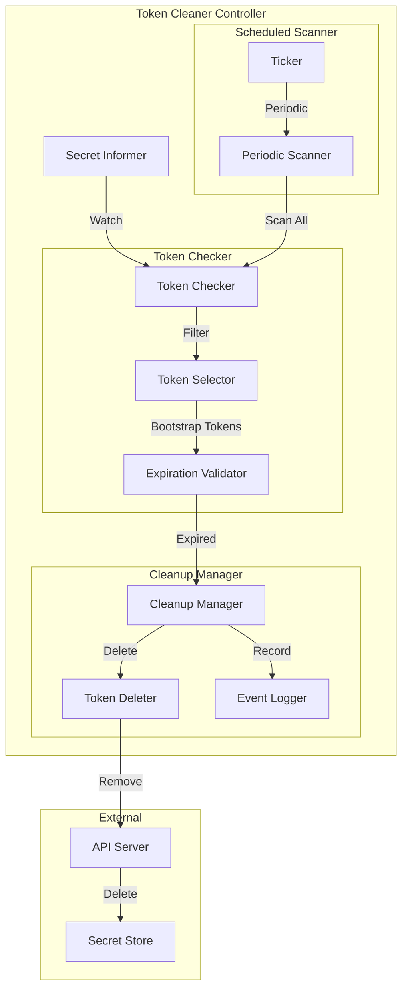
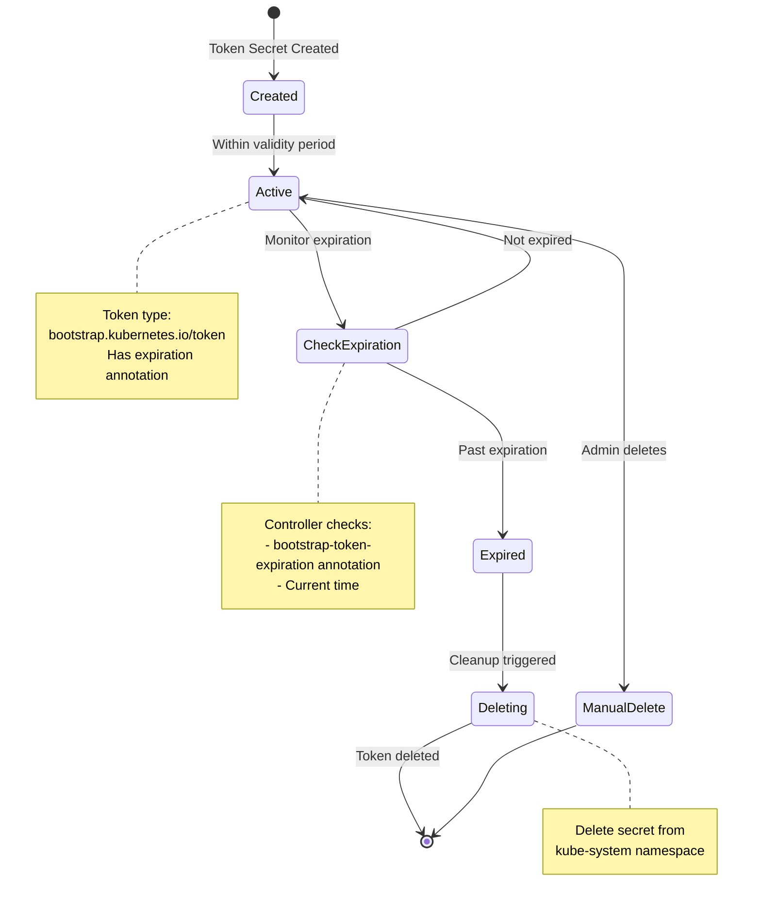
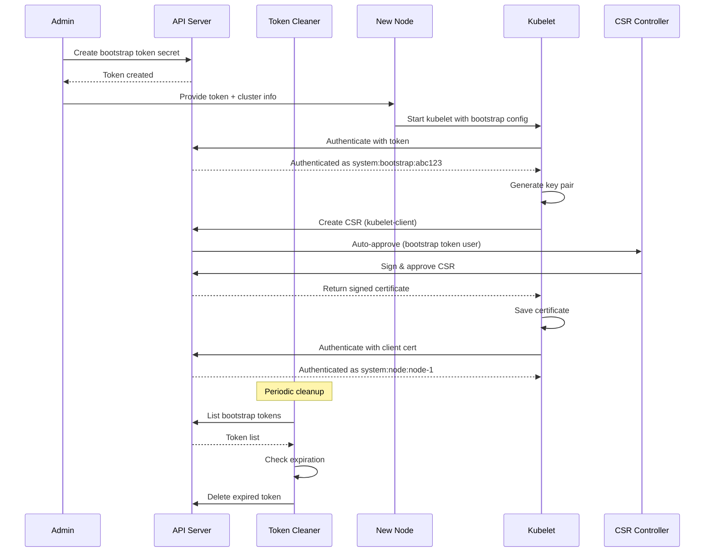

# Bootstrap Token Controllers

**Author**: Claude (AI Assistant)
**Date**: 2025-10-21
**Status**: Architecture Study
**Component**: kube-controller-manager

## Overview

Bootstrap token controllers manage the lifecycle of bootstrap tokens used for secure cluster joining. These tokens enable new nodes to authenticate to the cluster during the bootstrap process and obtain long-term credentials via the TLS Bootstrap mechanism.

## Key Components

### 1. Bootstrap Token Cleaner Controller

**Source**: `pkg/controller/bootstrap/tokencleaner.go`

Automatically removes expired bootstrap tokens.

#### Architecture



#### Token Lifecycle State Machine



#### Core Data Structures

```go
// Source: pkg/controller/bootstrap/tokencleaner.go

type TokenCleaner struct {
    // Secret informer
    secretLister corelisters.SecretLister
    secretSynced cache.InformerSynced

    // Client for deleting secrets
    client clientset.Interface

    // Sync interval
    syncInterval time.Duration

    // Secret namespace
    secretNamespace string
}

// Bootstrap token secret format
const (
    // Secret type for bootstrap tokens
    SecretTypeBootstrapToken v1.SecretType = "bootstrap.kubernetes.io/token"

    // Token ID (public part)
    BootstrapTokenIDKey = "token-id"

    // Token Secret (private part)
    BootstrapTokenSecretKey = "token-secret"

    // Expiration timestamp
    BootstrapTokenExpirationKey = "expiration"

    // Description
    BootstrapTokenDescriptionKey = "description"

    // Usage flags
    BootstrapTokenUsageAuthentication = "usage-bootstrap-authentication"
    BootstrapTokenUsageSigningKey     = "usage-bootstrap-signing"

    // Extra groups
    BootstrapTokenExtraGroupsKey = "auth-extra-groups"
)
```

#### Token Cleanup Algorithm

```go
// Source: pkg/controller/bootstrap/tokencleaner.go

// Run token cleaner
func (tc *TokenCleaner) Run(stopCh <-chan struct{}) {
    defer runtime.HandleCrash()

    // Wait for cache sync
    if !cache.WaitForCacheSync(stopCh, tc.secretSynced) {
        return
    }

    // Run periodic cleanup
    wait.Until(tc.cleanup, tc.syncInterval, stopCh)
}

// Cleanup expired tokens
func (tc *TokenCleaner) cleanup() {
    // List all secrets in kube-system
    secrets, err := tc.secretLister.Secrets(tc.secretNamespace).List(
        labels.Everything(),
    )
    if err != nil {
        klog.Errorf("Error listing secrets: %v", err)
        return
    }

    // Filter to bootstrap token secrets
    for _, secret := range secrets {
        if secret.Type != SecretTypeBootstrapToken {
            continue
        }

        // Check if expired
        if tc.isExpired(secret) {
            tc.deleteToken(secret)
        }
    }
}

// Check if token is expired
func (tc *TokenCleaner) isExpired(secret *v1.Secret) bool {
    // Get expiration from secret data
    expirationBytes, ok := secret.Data[BootstrapTokenExpirationKey]
    if !ok {
        // No expiration set, token doesn't expire
        return false
    }

    // Parse expiration time
    expirationStr := string(expirationBytes)
    expiration, err := time.Parse(time.RFC3339, expirationStr)
    if err != nil {
        klog.Errorf("Error parsing expiration for %s: %v", secret.Name, err)
        return false
    }

    // Check if expired
    return time.Now().After(expiration)
}

// Delete expired token
func (tc *TokenCleaner) deleteToken(secret *v1.Secret) {
    klog.Infof("Deleting expired bootstrap token: %s", secret.Name)

    err := tc.client.CoreV1().Secrets(tc.secretNamespace).Delete(
        context.TODO(),
        secret.Name,
        metav1.DeleteOptions{},
    )

    if err != nil && !errors.IsNotFound(err) {
        klog.Errorf("Error deleting token %s: %v", secret.Name, err)
    }
}
```

---

### 2. Bootstrap Signer Controller

**Source**: `pkg/controller/bootstrap/bootstrapsigner.go`

Signs ConfigMaps to enable bootstrap token authentication.

#### Architecture

```go
// Source: pkg/controller/bootstrap/bootstrapsigner.go

type SignerController struct {
    // ConfigMap informer
    configMapLister corelisters.ConfigMapLister
    configMapSynced cache.InformerSynced

    // Secret informer (for tokens)
    secretLister corelisters.SecretLister
    secretSynced cache.InformerSynced

    // Client
    client clientset.Interface

    // Signer
    signer crypto.Signer

    // Work queue
    queue workqueue.RateLimitingInterface
}

// ConfigMap signature annotation
const (
    ConfigMapSignatureAnnotation = "bootstrap.kubernetes.io/token-signature"
)
```

#### ConfigMap Signing

```go
// Source: pkg/controller/bootstrap/bootstrapsigner.go

// Sync ConfigMap
func (sc *SignerController) syncConfigMap(key string) error {
    namespace, name, err := cache.SplitMetaNamespaceKey(key)
    if err != nil {
        return err
    }

    // Get ConfigMap
    configMap, err := sc.configMapLister.ConfigMaps(namespace).Get(name)
    if err != nil {
        if errors.IsNotFound(err) {
            return nil
        }
        return err
    }

    // Only sign cluster-info ConfigMap
    if configMap.Name != "cluster-info" {
        return nil
    }

    // Check if signature needed
    if sc.hasValidSignature(configMap) {
        return nil
    }

    // Sign ConfigMap
    return sc.signConfigMap(configMap)
}

// Sign cluster-info ConfigMap
func (sc *SignerController) signConfigMap(configMap *v1.ConfigMap) error {
    // Get kubeconfig data
    kubeconfigData, ok := configMap.Data["kubeconfig"]
    if !ok {
        return fmt.Errorf("kubeconfig not found in ConfigMap")
    }

    // Compute signature
    signature, err := sc.computeSignature([]byte(kubeconfigData))
    if err != nil {
        return err
    }

    // Update ConfigMap with signature
    configMapCopy := configMap.DeepCopy()
    if configMapCopy.Annotations == nil {
        configMapCopy.Annotations = make(map[string]string)
    }
    configMapCopy.Annotations[ConfigMapSignatureAnnotation] = signature

    _, err = sc.client.CoreV1().ConfigMaps(configMap.Namespace).Update(
        context.TODO(),
        configMapCopy,
        metav1.UpdateOptions{},
    )

    return err
}

// Compute signature
func (sc *SignerController) computeSignature(data []byte) (string, error) {
    // Hash the data
    hash := sha256.Sum256(data)

    // Sign with private key
    signature, err := sc.signer.Sign(rand.Reader, hash[:], crypto.SHA256)
    if err != nil {
        return "", err
    }

    // Encode as base64
    return base64.StdEncoding.EncodeToString(signature), nil
}
```

---

### 3. Token Controller (Auto-Approval)

**Source**: `pkg/controller/bootstrap/tokencleaner.go`

While not a separate controller, bootstrap tokens integrate with CSR auto-approval.

#### Token-Based CSR Approval

```go
// Bootstrap tokens enable auto-approval of node client certificates
func isBootstrapTokenUser(username string) bool {
    return strings.HasPrefix(username, "system:bootstrap:")
}

// Extract token ID from username
func getTokenID(username string) string {
    // Username format: system:bootstrap:<token-id>
    parts := strings.Split(username, ":")
    if len(parts) != 3 {
        return ""
    }
    return parts[2]
}
```

---

## Bootstrap Token Format

### Secret Structure

```yaml
apiVersion: v1
kind: Secret
metadata:
  name: bootstrap-token-abc123
  namespace: kube-system
type: bootstrap.kubernetes.io/token
data:
  # Token ID (6 characters, lowercase alphanumeric)
  token-id: YWJjMTIz              # "abc123"

  # Token Secret (16 characters, lowercase alphanumeric)
  token-secret: ZGVmNDU2Z2hpamtsbW5vcA==  # "def456ghijklmnop"

  # Optional: Expiration time (RFC3339)
  expiration: MjAyNS0xMi0zMVQyMzo1OTo1OVo=  # "2025-12-31T23:59:59Z"

  # Optional: Description
  description: Vm0wd2QyUXlVWGxWV0d4V1YwZDRWMVl3WkRSV01WbDNXa1JTV0ZKdGVGWlZNakExVmpGYWMySkVU  # base64 encoded

stringData:
  # Usage flags (plain text)
  usage-bootstrap-authentication: "true"
  usage-bootstrap-signing: "true"

  # Extra groups (comma-separated)
  auth-extra-groups: "system:bootstrappers:kubeadm:default-node-token"
```

### Token Format

The complete token is: `<token-id>.<token-secret>`

Example: `abc123.def456ghijklmnop`

---

## Bootstrap Token Workflow

### Complete Node Bootstrap Flow



---

## Token Usage Scenarios

### Scenario 1: Node Bootstrapping

```yaml
# Create bootstrap token for node joining
apiVersion: v1
kind: Secret
metadata:
  name: bootstrap-token-07401b
  namespace: kube-system
type: bootstrap.kubernetes.io/token
stringData:
  description: "Bootstrap token for production nodes"
  token-id: "07401b"
  token-secret: "f395accd246ae52d"
  expiration: "2025-12-31T23:59:59Z"
  usage-bootstrap-authentication: "true"
  usage-bootstrap-signing: "true"
  auth-extra-groups: "system:bootstrappers:kubeadm:default-node-token"
```

Usage on node:

```yaml
# /etc/kubernetes/bootstrap-kubelet.conf
apiVersion: v1
kind: Config
clusters:
- cluster:
    certificate-authority: /etc/kubernetes/pki/ca.crt
    server: https://api-server:6443
  name: kubernetes
contexts:
- context:
    cluster: kubernetes
    user: kubelet-bootstrap
  name: kubelet-bootstrap
current-context: kubelet-bootstrap
users:
- name: kubelet-bootstrap
  user:
    token: 07401b.f395accd246ae52d  # Bootstrap token
```

### Scenario 2: Temporary Admin Access

```yaml
# Short-lived admin token for troubleshooting
apiVersion: v1
kind: Secret
metadata:
  name: bootstrap-token-temp
  namespace: kube-system
type: bootstrap.kubernetes.io/token
stringData:
  token-id: "temp01"
  token-secret: "temporarysecret1"
  expiration: "2025-10-22T01:00:00Z"  # Expires in 1 hour
  usage-bootstrap-authentication: "true"
  auth-extra-groups: "system:masters"  # Admin access
  description: "Temporary admin access for incident response"
```

### Scenario 3: CI/CD Integration

```yaml
# Token for automated cluster setup
apiVersion: v1
kind: Secret
metadata:
  name: bootstrap-token-ci
  namespace: kube-system
type: bootstrap.kubernetes.io/token
stringData:
  token-id: "cicd01"
  token-secret: "automatedsetup01"
  expiration: "2025-12-31T23:59:59Z"
  usage-bootstrap-authentication: "true"
  usage-bootstrap-signing: "true"
  auth-extra-groups: "system:bootstrappers:ci-cd"
  description: "CI/CD pipeline token for automated cluster provisioning"
```

---

## Token Management Commands

### Create Token with kubeadm

```bash
# Create a new bootstrap token
kubeadm token create \
  --description "Node bootstrap token" \
  --ttl 24h \
  --usages authentication,signing \
  --groups system:bootstrappers:kubeadm:default-node-token

# Output: abc123.def456ghijklmnop
```

### List Tokens

```bash
# List all bootstrap tokens
kubeadm token list

# Manual listing via kubectl
kubectl get secrets -n kube-system \
  -o json | jq -r '.items[] |
  select(.type=="bootstrap.kubernetes.io/token") |
  .metadata.name'
```

### Delete Token

```bash
# Delete with kubeadm
kubeadm token delete abc123

# Delete with kubectl
kubectl delete secret -n kube-system bootstrap-token-abc123
```

### Create Token Manually

```bash
# Generate token ID (6 chars)
TOKEN_ID=$(openssl rand -hex 3)

# Generate token secret (16 chars)
TOKEN_SECRET=$(openssl rand -hex 8)

# Calculate expiration (24 hours from now)
EXPIRATION=$(date -u -d '+24 hours' +%Y-%m-%dT%H:%M:%SZ)

# Create secret
kubectl create secret generic bootstrap-token-${TOKEN_ID} \
  -n kube-system \
  --type bootstrap.kubernetes.io/token \
  --from-literal=token-id=${TOKEN_ID} \
  --from-literal=token-secret=${TOKEN_SECRET} \
  --from-literal=expiration=${EXPIRATION} \
  --from-literal=usage-bootstrap-authentication=true \
  --from-literal=usage-bootstrap-signing=true \
  --from-literal=auth-extra-groups=system:bootstrappers:kubeadm:default-node-token

echo "Token: ${TOKEN_ID}.${TOKEN_SECRET}"
```

---

## Security Considerations

### 1. Token Scope

Bootstrap tokens should have minimal privileges:

```yaml
# Limit to bootstrap operations only
auth-extra-groups: "system:bootstrappers:kubeadm:default-node-token"
```

RBAC for bootstrappers group:

```yaml
apiVersion: rbac.authorization.k8s.io/v1
kind: ClusterRoleBinding
metadata:
  name: kubeadm:kubelet-bootstrap
roleRef:
  apiGroup: rbac.authorization.k8s.io
  kind: ClusterRole
  name: system:node-bootstrapper
subjects:
- kind: Group
  name: system:bootstrappers:kubeadm:default-node-token
```

### 2. Short Expiration

```yaml
# Use short expiration times
expiration: "2025-10-22T01:00:00Z"  # 1 hour
```

### 3. Rotation

```bash
# Regularly rotate tokens
kubeadm token delete old-token
kubeadm token create --ttl 24h
```

### 4. Audit Logging

Monitor token usage:

```yaml
# Enable audit logging for bootstrap token usage
apiVersion: audit.k8s.io/v1
kind: Policy
rules:
- level: RequestResponse
  users:
  - "system:bootstrap:*"
  verbs: ["create"]
  resources:
  - group: "certificates.k8s.io"
    resources: ["certificatesigningrequests"]
```

---

## Configuration

### Token Cleaner

```bash
# kube-controller-manager flags
--controllers=*,bootstrapsigner,tokencleaner
--experimental-cluster-signing-duration=8760h  # Certificate duration
```

### Bootstrap Signer

```bash
# kube-controller-manager flags
--cluster-signing-cert-file=/etc/kubernetes/pki/ca.crt
--cluster-signing-key-file=/etc/kubernetes/pki/ca.key
```

---

## Troubleshooting

### Token Not Working

**Check token exists:**

```bash
kubectl get secret -n kube-system bootstrap-token-abc123
```

**Verify token format:**

```bash
kubectl get secret -n kube-system bootstrap-token-abc123 -o yaml
```

**Check expiration:**

```bash
TOKEN_ID="abc123"
kubectl get secret -n kube-system bootstrap-token-${TOKEN_ID} \
  -o jsonpath='{.data.expiration}' | base64 -d
```

### CSR Not Auto-Approved

**Check RBAC:**

```bash
# Verify bootstrap group permissions
kubectl get clusterrolebinding kubeadm:kubelet-bootstrap -o yaml

# Check if user has correct group
kubectl get csr -o yaml | grep -A 5 username
```

### Tokens Not Being Cleaned

**Check controller status:**

```bash
# Verify tokencleaner controller is running
kubectl logs -n kube-system kube-controller-manager-* | grep tokencleaner
```

---

## Source References

1. **Token Cleaner**: `pkg/controller/bootstrap/tokencleaner.go`
2. **Bootstrap Signer**: `pkg/controller/bootstrap/bootstrapsigner.go`
3. **Bootstrap Token Types**: `pkg/bootstrap/api/types.go`
4. **Token Authentication**: `plugin/pkg/auth/authenticator/token/bootstrap/bootstrap.go`

---

## Summary

Bootstrap token controllers provide secure cluster joining:

1. **Token Cleaner**: Automatically removes expired bootstrap tokens
2. **Bootstrap Signer**: Signs cluster-info ConfigMap for token validation
3. **Token Format**: Structured secrets with ID, secret, expiration, and usage flags
4. **Integration**: Works with CSR auto-approval for node bootstrapping
5. **Security**: Short-lived, scoped tokens with automatic cleanup

Bootstrap tokens are essential for:
- Automated node provisioning
- Cluster expansion
- Temporary access grants
- CI/CD integration
- Secure initial authentication

Best practices:
- Use short expiration times (hours, not days)
- Limit token scope with appropriate groups
- Rotate tokens regularly
- Monitor token usage via audit logs
- Clean up tokens after use
