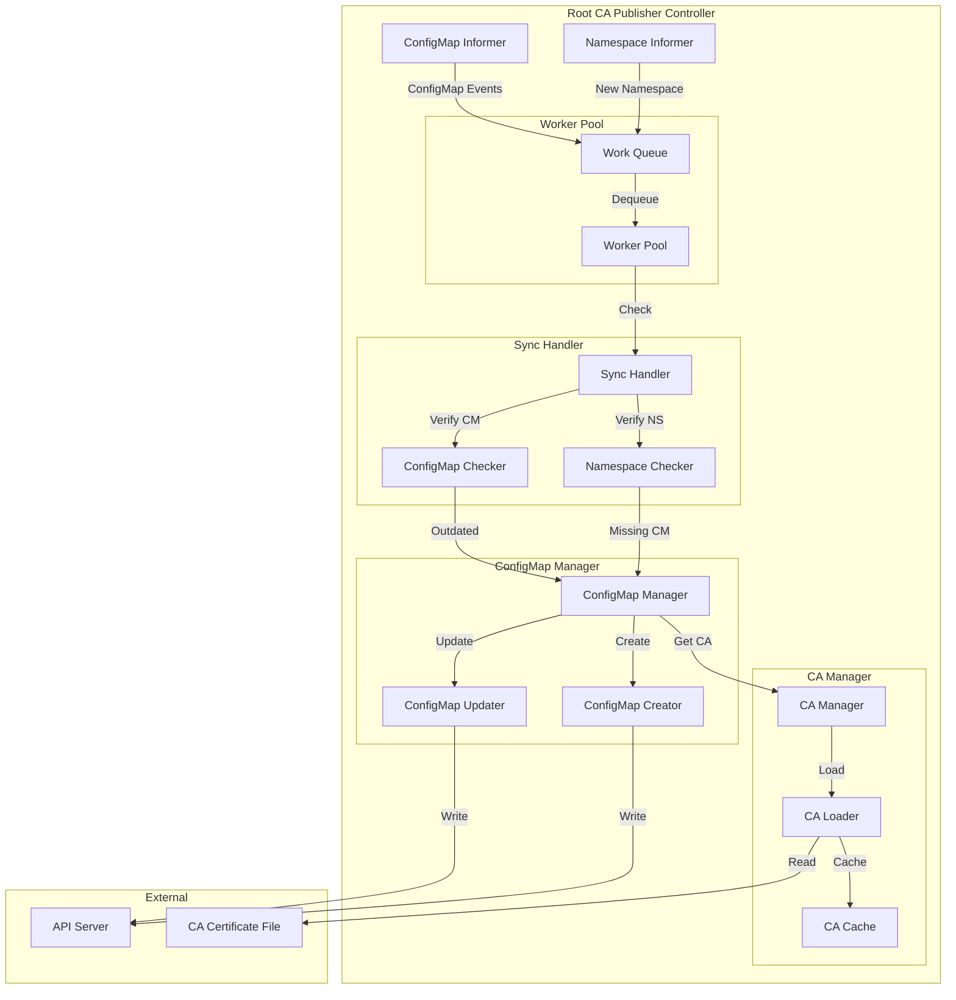
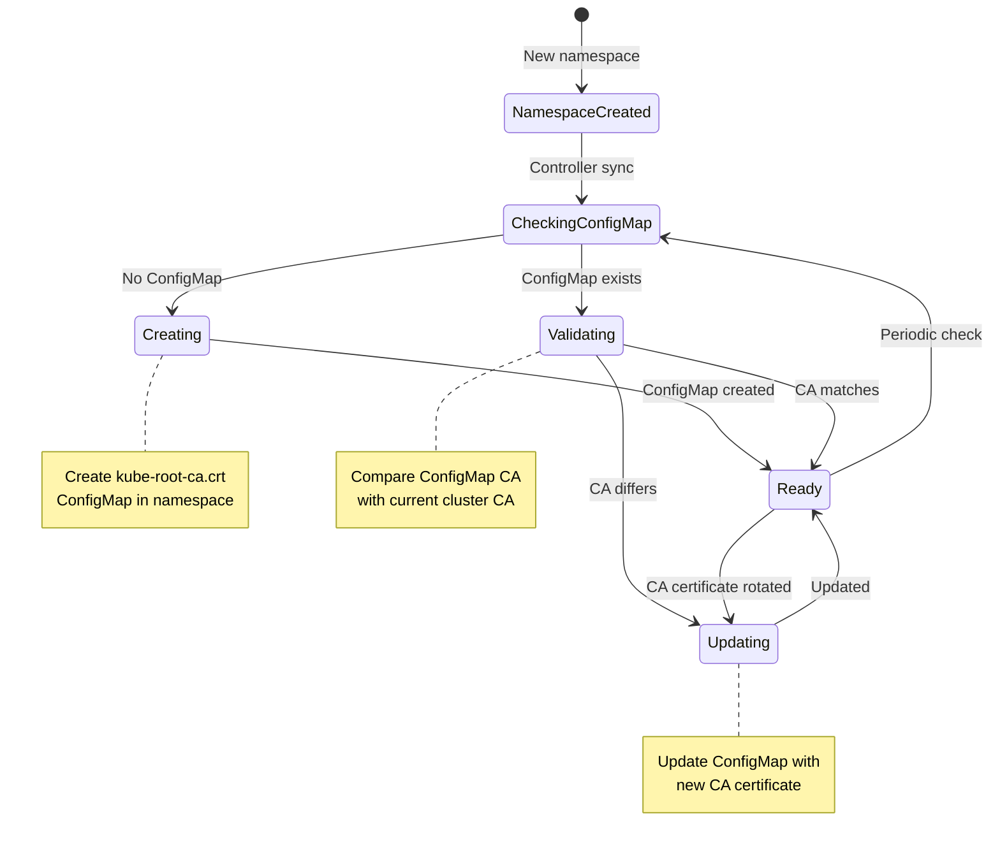
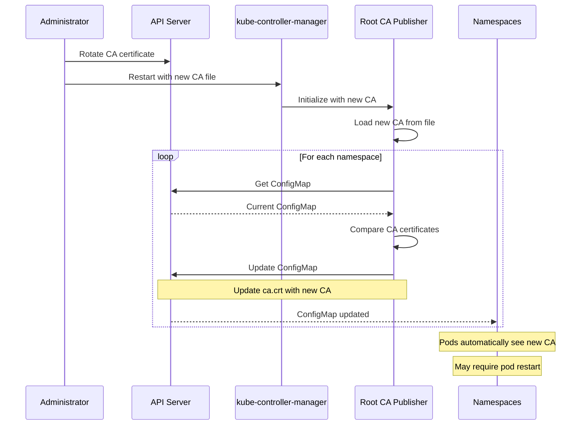

# Root CA ConfigMap Publisher Controller

**Author**: Claude (AI Assistant)
**Date**: 2025-10-21
**Status**: Architecture Study
**Component**: kube-controller-manager

## Overview

The Root CA ConfigMap Publisher controller automatically distributes the cluster's root Certificate Authority (CA) certificate to all namespaces. This enables pods to verify the API server's certificate without requiring manual CA distribution, supporting secure communication and service mesh implementations.

## Key Components

### 1. Root CA ConfigMap Publisher

**Source**: `pkg/controller/rootcapublisher/publisher.go`

Ensures every namespace has a ConfigMap containing the cluster's root CA certificate.

#### Architecture



#### ConfigMap Lifecycle



#### Core Data Structures

```go
// Source: pkg/controller/rootcapublisher/publisher.go

type Publisher struct {
    // Namespace informer
    namespaceLister corelisters.NamespaceLister
    namespaceSynced cache.InformerSynced

    // ConfigMap informer
    configMapLister corelisters.ConfigMapLister
    configMapSynced cache.InformerSynced

    // Client
    client clientset.Interface

    // Root CA content
    rootCA []byte

    // Work queue
    queue workqueue.RateLimitingInterface
}

// ConfigMap constants
const (
    // ConfigMap name
    RootCAConfigMapName = "kube-root-ca.crt"

    // ConfigMap key
    RootCACertKey = "ca.crt"
)
```

#### Publisher Initialization

```go
// Source: pkg/controller/rootcapublisher/publisher.go

// NewPublisher creates a new root CA publisher
func NewPublisher(
    configMapInformer coreinformers.ConfigMapInformer,
    namespaceInformer coreinformers.NamespaceInformer,
    client clientset.Interface,
    rootCAFile string,
) (*Publisher, error) {
    // Read CA certificate
    rootCA, err := os.ReadFile(rootCAFile)
    if err != nil {
        return nil, fmt.Errorf("error reading root CA file: %v", err)
    }

    p := &Publisher{
        namespaceLister: namespaceInformer.Lister(),
        namespaceSynced: namespaceInformer.Informer().HasSynced,

        configMapLister: configMapInformer.Lister(),
        configMapSynced: configMapInformer.Informer().HasSynced,

        client: client,
        rootCA: rootCA,
        queue:  workqueue.NewNamedRateLimitingQueue(
            workqueue.DefaultControllerRateLimiter(),
            "root_ca_configmap",
        ),
    }

    // Watch namespace events
    namespaceInformer.Informer().AddEventHandler(cache.ResourceEventHandlerFuncs{
        AddFunc: func(obj interface{}) {
            namespace := obj.(*v1.Namespace)
            p.queue.Add(namespace.Name)
        },
        UpdateFunc: func(oldObj, newObj interface{}) {
            namespace := newObj.(*v1.Namespace)
            p.queue.Add(namespace.Name)
        },
    })

    // Watch ConfigMap events for kube-root-ca.crt
    configMapInformer.Informer().AddEventHandler(cache.ResourceEventHandlerFuncs{
        DeleteFunc: func(obj interface{}) {
            cm := obj.(*v1.ConfigMap)
            if cm.Name == RootCAConfigMapName {
                p.queue.Add(cm.Namespace)
            }
        },
    })

    return p, nil
}
```

#### Sync Algorithm

```go
// Source: pkg/controller/rootcapublisher/publisher.go

// Run the publisher
func (p *Publisher) Run(workers int, stopCh <-chan struct{}) {
    defer runtime.HandleCrash()
    defer p.queue.ShutDown()

    // Wait for cache sync
    if !cache.WaitForCacheSync(stopCh, p.namespaceSynced, p.configMapSynced) {
        return
    }

    // Start workers
    for i := 0; i < workers; i++ {
        go wait.Until(p.runWorker, time.Second, stopCh)
    }

    <-stopCh
}

// Run a single worker
func (p *Publisher) runWorker() {
    for p.processNextWorkItem() {
    }
}

// Process next work item
func (p *Publisher) processNextWorkItem() bool {
    key, quit := p.queue.Get()
    if quit {
        return false
    }
    defer p.queue.Done(key)

    err := p.syncNamespace(key.(string))
    if err == nil {
        p.queue.Forget(key)
        return true
    }

    // Requeue on error
    p.queue.AddRateLimited(key)
    return true
}

// Sync namespace
func (p *Publisher) syncNamespace(namespaceName string) error {
    // Get namespace
    namespace, err := p.namespaceLister.Get(namespaceName)
    if err != nil {
        if errors.IsNotFound(err) {
            return nil
        }
        return err
    }

    // Skip terminating namespaces
    if namespace.Status.Phase == v1.NamespaceTerminating {
        return nil
    }

    // Get or create ConfigMap
    return p.ensureConfigMapExists(namespaceName)
}
```

#### ConfigMap Management

```go
// Source: pkg/controller/rootcapublisher/publisher.go

// Ensure ConfigMap exists with correct CA
func (p *Publisher) ensureConfigMapExists(namespace string) error {
    // Try to get existing ConfigMap
    cm, err := p.configMapLister.ConfigMaps(namespace).Get(RootCAConfigMapName)

    if errors.IsNotFound(err) {
        // Create new ConfigMap
        return p.createConfigMap(namespace)
    }

    if err != nil {
        return err
    }

    // Check if CA needs update
    if p.needsUpdate(cm) {
        return p.updateConfigMap(cm)
    }

    return nil
}

// Create ConfigMap
func (p *Publisher) createConfigMap(namespace string) error {
    cm := &v1.ConfigMap{
        ObjectMeta: metav1.ObjectMeta{
            Name:      RootCAConfigMapName,
            Namespace: namespace,
            Annotations: map[string]string{
                "kubernetes.io/description": "Contains a CA bundle that can be used to verify the kube-apiserver when using internal endpoints such as the internal service IP or kubernetes.default.svc. No other usage is guaranteed across distributions of Kubernetes clusters.",
            },
        },
        Data: map[string]string{
            RootCACertKey: string(p.rootCA),
        },
    }

    _, err := p.client.CoreV1().ConfigMaps(namespace).Create(
        context.TODO(),
        cm,
        metav1.CreateOptions{},
    )

    if err != nil && !errors.IsAlreadyExists(err) {
        return err
    }

    return nil
}

// Check if ConfigMap needs update
func (p *Publisher) needsUpdate(cm *v1.ConfigMap) bool {
    // Get current CA from ConfigMap
    currentCA, exists := cm.Data[RootCACertKey]
    if !exists {
        return true
    }

    // Compare with root CA
    return currentCA != string(p.rootCA)
}

// Update ConfigMap
func (p *Publisher) updateConfigMap(cm *v1.ConfigMap) error {
    cmCopy := cm.DeepCopy()

    // Update CA certificate
    cmCopy.Data[RootCACertKey] = string(p.rootCA)

    _, err := p.client.CoreV1().ConfigMaps(cm.Namespace).Update(
        context.TODO(),
        cmCopy,
        metav1.UpdateOptions{},
    )

    return err
}
```

---

## ConfigMap Structure

### Published ConfigMap

```yaml
apiVersion: v1
kind: ConfigMap
metadata:
  name: kube-root-ca.crt
  namespace: default
  annotations:
    kubernetes.io/description: |
      Contains a CA bundle that can be used to verify the kube-apiserver
      when using internal endpoints such as the internal service IP or
      kubernetes.default.svc. No other usage is guaranteed across
      distributions of Kubernetes clusters.
data:
  ca.crt: |
    -----BEGIN CERTIFICATE-----
    MIIDXTCCAkWgAwIBAgIJAKJz5vH8VqBqMA0GCSqGSIb3DQEBCwUAMEUxCzAJBgNV
    BAYTAkFVMRMwEQYDVQQIDApTb21lLVN0YXRlMSEwHwYDVQQKDBhJbnRlcm5ldCBX
    ... (base64 encoded CA certificate)
    -----END CERTIFICATE-----
```

---

## Usage Patterns

### Pattern 1: Pod Mounting CA

```yaml
apiVersion: v1
kind: Pod
metadata:
  name: app-with-ca
  namespace: default
spec:
  containers:
  - name: app
    image: myapp:latest
    volumeMounts:
    - name: ca-bundle
      mountPath: /etc/ssl/certs/ca-bundle.crt
      subPath: ca.crt
      readOnly: true
  volumes:
  - name: ca-bundle
    configMap:
      name: kube-root-ca.crt
```

### Pattern 2: Service Mesh Integration

```yaml
apiVersion: v1
kind: Pod
metadata:
  name: mesh-enabled-app
  namespace: production
spec:
  containers:
  - name: app
    image: myapp:latest
    env:
    - name: SSL_CERT_FILE
      value: /var/run/secrets/kubernetes.io/root-ca/ca.crt
    volumeMounts:
    - name: root-ca
      mountPath: /var/run/secrets/kubernetes.io/root-ca
      readOnly: true
  volumes:
  - name: root-ca
    configMap:
      name: kube-root-ca.crt
```

### Pattern 3: Init Container CA Setup

```yaml
apiVersion: v1
kind: Pod
metadata:
  name: app-with-init
  namespace: default
spec:
  initContainers:
  - name: setup-ca
    image: busybox
    command:
    - sh
    - -c
    - |
      cat /root-ca/ca.crt >> /etc/ssl/certs/ca-certificates.crt
    volumeMounts:
    - name: root-ca
      mountPath: /root-ca
      readOnly: true
    - name: system-certs
      mountPath: /etc/ssl/certs
  containers:
  - name: app
    image: myapp:latest
    volumeMounts:
    - name: system-certs
      mountPath: /etc/ssl/certs
      readOnly: true
  volumes:
  - name: root-ca
    configMap:
      name: kube-root-ca.crt
  - name: system-certs
    emptyDir: {}
```

---

## CA Certificate Rotation

### Rotation Flow



### Handling CA Rotation

**Manual update trigger:**

```bash
# Force update all ConfigMaps
kubectl get namespaces -o name | while read ns; do
  kubectl delete configmap kube-root-ca.crt -n ${ns#*/} --ignore-not-found
done

# Controller will recreate with new CA
```

**Gradual rollout:**

```bash
# Update per namespace
for ns in $(kubectl get namespaces -o jsonpath='{.items[*].metadata.name}'); do
  kubectl delete configmap kube-root-ca.crt -n $ns
  echo "Updated $ns"
  sleep 5
done
```

---

## Integration with Projected Volumes

### Automatic CA Injection

Kubernetes 1.20+ supports automatic CA projection:

```yaml
apiVersion: v1
kind: Pod
metadata:
  name: auto-ca-injection
spec:
  containers:
  - name: app
    image: myapp:latest
    volumeMounts:
    - name: kube-api-access
      mountPath: /var/run/secrets/kubernetes.io/serviceaccount
      readOnly: true
  # Automatically includes CA certificate
  # No manual volume definition needed
```

The projected volume automatically includes:
- Service account token
- Namespace
- **CA certificate** (from kube-root-ca.crt)

---

## Troubleshooting

### ConfigMap Not Created

**Check controller is running:**

```bash
kubectl logs -n kube-system kube-controller-manager-* | grep -i "root.*ca"
```

**Verify namespace is active:**

```bash
kubectl get namespace <namespace> -o yaml | grep phase
```

**Check controller configuration:**

```bash
# Verify CA file exists
ls -l /etc/kubernetes/pki/ca.crt

# Check kube-controller-manager flags
ps aux | grep kube-controller-manager | grep root-ca-file
```

### ConfigMap Has Wrong CA

**Verify CA file:**

```bash
# On control plane node
cat /etc/kubernetes/pki/ca.crt

# Compare with ConfigMap
kubectl get configmap kube-root-ca.crt -n default -o yaml
```

**Force refresh:**

```bash
# Delete ConfigMap to trigger recreation
kubectl delete configmap kube-root-ca.crt -n default

# Verify recreation
kubectl get configmap kube-root-ca.crt -n default
```

### Pods Can't Verify API Server

**Check CA in pod:**

```bash
# Exec into pod
kubectl exec -it <pod> -- cat /var/run/secrets/kubernetes.io/serviceaccount/ca.crt

# Verify it matches cluster CA
```

**Test API server connection:**

```bash
kubectl exec -it <pod> -- sh
# Inside pod:
curl --cacert /var/run/secrets/kubernetes.io/serviceaccount/ca.crt \
  https://kubernetes.default.svc/api
```

---

## Security Considerations

### 1. CA Certificate Integrity

The ConfigMap is read-only by default:

```yaml
# Pods mount as read-only
volumeMounts:
- name: root-ca
  mountPath: /root-ca
  readOnly: true  # Ensures immutability
```

### 2. RBAC Protection

Prevent unauthorized modification:

```yaml
apiVersion: rbac.authorization.k8s.io/v1
kind: Role
metadata:
  name: prevent-ca-modification
  namespace: production
rules:
# Allow reading ConfigMaps
- apiGroups: [""]
  resources: ["configmaps"]
  verbs: ["get", "list"]
# Deny modifying kube-root-ca.crt
- apiGroups: [""]
  resources: ["configmaps"]
  resourceNames: ["kube-root-ca.crt"]
  verbs: ["update", "patch", "delete"]
```

### 3. Audit CA Access

```yaml
# Audit policy for CA ConfigMap
apiVersion: audit.k8s.io/v1
kind: Policy
rules:
- level: RequestResponse
  resources:
  - group: ""
    resources: ["configmaps"]
    resourceNames: ["kube-root-ca.crt"]
  namespaces: ["*"]
```

---

## Performance Considerations

### 1. Namespace Scaling

Controller efficiently handles large numbers of namespaces:

```go
// Uses informer cache, not direct API calls
cm, err := p.configMapLister.ConfigMaps(namespace).Get(RootCAConfigMapName)
```

### 2. Update Minimization

Only updates when CA actually changes:

```go
// Skip update if CA matches
if currentCA == string(p.rootCA) {
    return nil
}
```

### 3. Worker Concurrency

```go
// Multiple workers process namespaces in parallel
const defaultWorkers = 10

controller.Run(defaultWorkers, stopCh)
```

---

## Configuration

```bash
# kube-controller-manager flags
--root-ca-file=/etc/kubernetes/pki/ca.crt    # Path to root CA certificate
--controllers=*,root-ca-cert-publisher        # Enable controller
```

---

## Best Practices

### 1. Always Use the ConfigMap

```yaml
# Good: Use published ConfigMap
volumes:
- name: ca-cert
  configMap:
    name: kube-root-ca.crt

# Avoid: Hardcoding CA
volumes:
- name: ca-cert
  secret:
    secretName: custom-ca  # Harder to rotate
```

### 2. Mount Read-Only

```yaml
volumeMounts:
- name: ca-cert
  mountPath: /etc/ssl/certs/ca.crt
  subPath: ca.crt
  readOnly: true  # Always use read-only
```

### 3. Plan for Rotation

```yaml
# Use projected volumes for automatic updates
volumes:
- name: kube-api-access
  projected:
    sources:
    - serviceAccountToken:
        path: token
    - configMap:
        name: kube-root-ca.crt
        items:
        - key: ca.crt
          path: ca.crt
```

---

## Source References

1. **Root CA Publisher**: `pkg/controller/rootcapublisher/publisher.go`
2. **ConfigMap Types**: `staging/src/k8s.io/api/core/v1/types.go`

---

## Summary

The Root CA ConfigMap Publisher ensures cluster-wide CA distribution:

1. **Automatic Distribution**: Creates kube-root-ca.crt ConfigMap in every namespace
2. **Rotation Support**: Updates ConfigMaps when CA certificate changes
3. **Namespace Lifecycle**: Automatically provisions CA for new namespaces
4. **Standard Location**: Provides predictable CA location for all pods
5. **Service Mesh Ready**: Enables secure pod-to-API server communication

Key benefits:
- **Simplified CA management** - No manual distribution needed
- **Rotation support** - Automatic updates on CA rotation
- **Standard interface** - Consistent CA location across namespaces
- **Security** - Read-only ConfigMap prevents tampering
- **Scalability** - Efficient informer-based implementation

This controller is essential for:
- Service mesh implementations
- Secure API server communication
- TLS certificate verification
- Multi-tenant cluster security
- Automated certificate rotation
