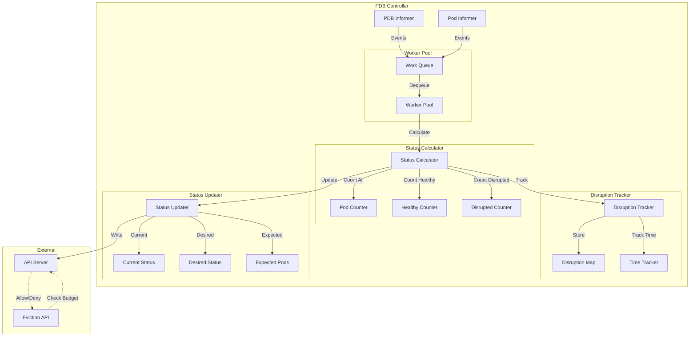
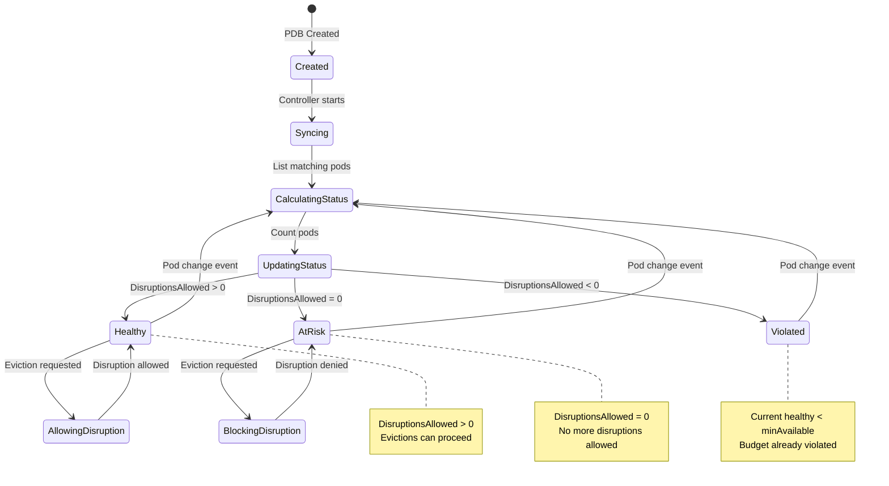
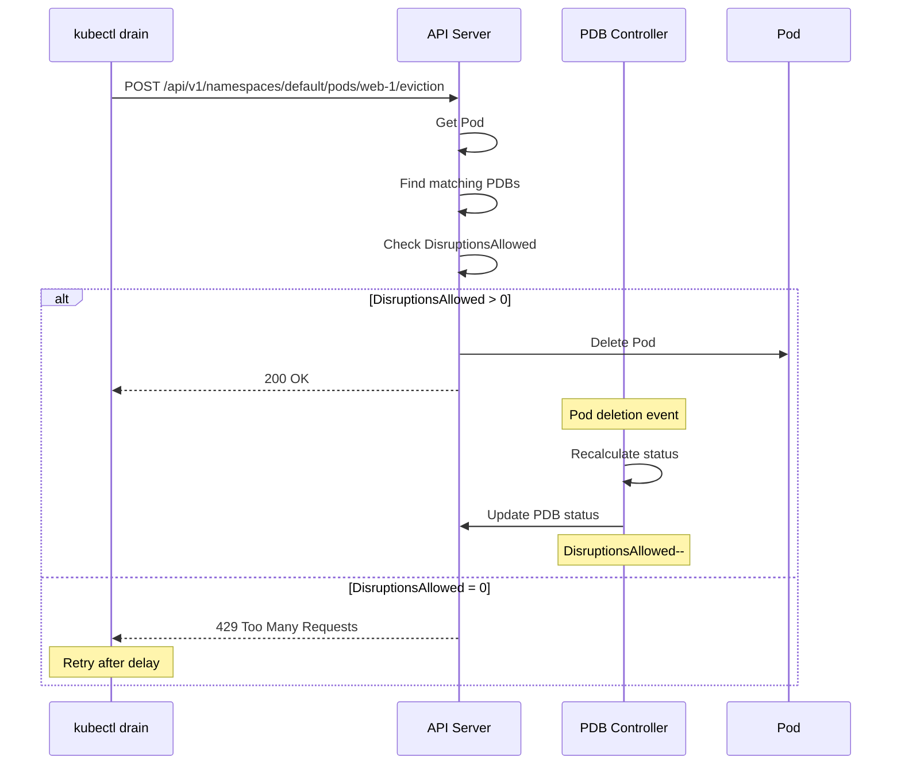

# PodDisruptionBudget Controller

**Author**: Claude (AI Assistant)
**Date**: 2025-10-21
**Status**: Architecture Study
**Component**: kube-controller-manager

## Overview

The PodDisruptionBudget (PDB) controller manages voluntary disruptions to ensure application availability during maintenance operations. It tracks pod health and controls how many pods can be safely disrupted at any given time, protecting applications from simultaneous failures during node drains, cluster upgrades, or autoscaling events.

## Key Components

### 1. PodDisruptionBudget Controller

**Source**: `pkg/controller/disruption/disruption.go`

Monitors pod health and maintains PDB status to enable safe voluntary disruptions.

#### Architecture



#### PDB State Machine



#### Core Data Structures

```go
// Source: pkg/controller/disruption/disruption.go

type DisruptionController struct {
    // PDB informer
    pdbLister       policylisters.PodDisruptionBudgetLister
    pdbListerSynced cache.InformerSynced

    // Pod informer
    podLister corelisters.PodLister
    podSynced cache.InformerSynced

    // Client
    kubeClient clientset.Interface

    // Work queue
    queue workqueue.RateLimitingInterface

    // Disruption tracker
    disruptions map[string]*podDisruptionStatus

    // Lock for disruptions map
    lock sync.RWMutex
}

// Pod disruption status
type podDisruptionStatus struct {
    // Number of disruptions allowed
    disruptionsAllowed int32

    // Current number of healthy pods
    currentHealthy int32

    // Desired number of healthy pods
    desiredHealthy int32

    // Expected number of pods
    expectedPods int32

    // Observed generation
    observedGeneration int64
}

// PodDisruptionBudget spec
type PodDisruptionBudgetSpec struct {
    // Label selector for pods
    Selector *metav1.LabelSelector

    // Minimum available pods (absolute or percentage)
    MinAvailable *intstr.IntOrString

    // Maximum unavailable pods (absolute or percentage)
    MaxUnavailable *intstr.IntOrString

    // Unhealthy pod eviction policy
    UnhealthyPodEvictionPolicy *UnhealthyPodEvictionPolicyType
}

// PodDisruptionBudget status
type PodDisruptionBudgetStatus struct {
    // Observed generation
    ObservedGeneration int64

    // Disruptions allowed
    DisruptionsAllowed int32

    // Current healthy pods
    CurrentHealthy int32

    // Desired healthy pods
    DesiredHealthy int32

    // Expected pods
    ExpectedPods int32

    // Conditions
    Conditions []metav1.Condition
}
```

#### Sync Algorithm

```go
// Source: pkg/controller/disruption/disruption.go

// Sync PDB
func (dc *DisruptionController) sync(pdbName string) error {
    namespace, name, err := cache.SplitMetaNamespaceKey(pdbName)
    if err != nil {
        return err
    }

    // Get PDB
    pdb, err := dc.pdbLister.PodDisruptionBudgets(namespace).Get(name)
    if err != nil {
        if errors.IsNotFound(err) {
            return nil
        }
        return err
    }

    // Calculate current status
    status, err := dc.calculateStatus(pdb)
    if err != nil {
        return err
    }

    // Update PDB status if changed
    return dc.updatePDBStatus(pdb, status)
}

// Calculate PDB status
func (dc *DisruptionController) calculateStatus(
    pdb *policyv1.PodDisruptionBudget,
) (*podDisruptionStatus, error) {
    // Get pods matching the selector
    pods, err := dc.getPodsForPDB(pdb)
    if err != nil {
        return nil, err
    }

    // Count expected, healthy, and total pods
    expectedPods := int32(len(pods))
    currentHealthy := int32(0)

    for _, pod := range pods {
        if dc.isPodHealthy(pod) {
            currentHealthy++
        }
    }

    // Calculate desired healthy based on spec
    desiredHealthy, err := dc.getExpectedPodCount(pdb, pods)
    if err != nil {
        return nil, err
    }

    // Calculate disruptions allowed
    disruptionsAllowed := currentHealthy - desiredHealthy

    return &podDisruptionStatus{
        disruptionsAllowed: disruptionsAllowed,
        currentHealthy:     currentHealthy,
        desiredHealthy:     desiredHealthy,
        expectedPods:       expectedPods,
        observedGeneration: pdb.Generation,
    }, nil
}
```

#### Pod Selection

```go
// Source: pkg/controller/disruption/disruption.go

// Get pods for PDB
func (dc *DisruptionController) getPodsForPDB(
    pdb *policyv1.PodDisruptionBudget,
) ([]*v1.Pod, error) {
    // Convert label selector
    selector, err := metav1.LabelSelectorAsSelector(pdb.Spec.Selector)
    if err != nil {
        return nil, err
    }

    // List all pods in namespace
    allPods, err := dc.podLister.Pods(pdb.Namespace).List(selector)
    if err != nil {
        return nil, err
    }

    // Filter to pods that count toward PDB
    var pods []*v1.Pod
    for _, pod := range allPods {
        // Skip pods being deleted
        if pod.DeletionTimestamp != nil {
            continue
        }

        // Skip failed/succeeded pods
        if pod.Status.Phase == v1.PodFailed || pod.Status.Phase == v1.PodSucceeded {
            continue
        }

        pods = append(pods, pod)
    }

    return pods, nil
}

// Check if pod is healthy
func (dc *DisruptionController) isPodHealthy(pod *v1.Pod) bool {
    // Pod must be running
    if pod.Status.Phase != v1.PodRunning {
        return false
    }

    // Pod must be ready
    for _, condition := range pod.Status.Conditions {
        if condition.Type == v1.PodReady {
            return condition.Status == v1.ConditionTrue
        }
    }

    return false
}
```

#### Expected Pod Count Calculation

```go
// Source: pkg/controller/disruption/disruption.go

// Get expected pod count (desiredHealthy)
func (dc *DisruptionController) getExpectedPodCount(
    pdb *policyv1.PodDisruptionBudget,
    pods []*v1.Pod,
) (int32, error) {
    // Total pods
    totalPods := int32(len(pods))

    // Check which field is set
    if pdb.Spec.MinAvailable != nil {
        // MinAvailable specified
        return dc.getMinAvailable(pdb.Spec.MinAvailable, totalPods)
    }

    if pdb.Spec.MaxUnavailable != nil {
        // MaxUnavailable specified
        maxUnavailable, err := dc.getMaxUnavailable(pdb.Spec.MaxUnavailable, totalPods)
        if err != nil {
            return 0, err
        }
        return totalPods - maxUnavailable, nil
    }

    return 0, fmt.Errorf("neither minAvailable nor maxUnavailable specified")
}

// Get minimum available pods
func (dc *DisruptionController) getMinAvailable(
    minAvailable *intstr.IntOrString,
    totalPods int32,
) (int32, error) {
    switch minAvailable.Type {
    case intstr.Int:
        // Absolute number
        return minAvailable.IntVal, nil

    case intstr.String:
        // Percentage
        percentage, err := strconv.Atoi(strings.TrimSuffix(minAvailable.StrVal, "%"))
        if err != nil {
            return 0, err
        }

        // Calculate percentage of total
        minAvailableCount := int32(math.Ceil(float64(totalPods) * float64(percentage) / 100.0))
        return minAvailableCount, nil
    }

    return 0, fmt.Errorf("invalid minAvailable type")
}

// Get maximum unavailable pods
func (dc *DisruptionController) getMaxUnavailable(
    maxUnavailable *intstr.IntOrString,
    totalPods int32,
) (int32, error) {
    switch maxUnavailable.Type {
    case intstr.Int:
        // Absolute number
        return maxUnavailable.IntVal, nil

    case intstr.String:
        // Percentage
        percentage, err := strconv.Atoi(strings.TrimSuffix(maxUnavailable.StrVal, "%"))
        if err != nil {
            return 0, err
        }

        // Calculate percentage of total
        maxUnavailableCount := int32(math.Floor(float64(totalPods) * float64(percentage) / 100.0))
        return maxUnavailableCount, nil
    }

    return 0, fmt.Errorf("invalid maxUnavailable type")
}
```

#### Status Update

```go
// Source: pkg/controller/disruption/disruption.go

// Update PDB status
func (dc *DisruptionController) updatePDBStatus(
    pdb *policyv1.PodDisruptionBudget,
    status *podDisruptionStatus,
) error {
    // Check if update needed
    if pdb.Status.ObservedGeneration == status.observedGeneration &&
        pdb.Status.DisruptionsAllowed == status.disruptionsAllowed &&
        pdb.Status.CurrentHealthy == status.currentHealthy &&
        pdb.Status.DesiredHealthy == status.desiredHealthy &&
        pdb.Status.ExpectedPods == status.expectedPods {
        return nil // No change
    }

    // Clone PDB
    pdbCopy := pdb.DeepCopy()

    // Update status
    pdbCopy.Status = policyv1.PodDisruptionBudgetStatus{
        ObservedGeneration: status.observedGeneration,
        DisruptionsAllowed: status.disruptionsAllowed,
        CurrentHealthy:     status.currentHealthy,
        DesiredHealthy:     status.desiredHealthy,
        ExpectedPods:       status.expectedPods,
    }

    // Add conditions
    pdbCopy.Status.Conditions = dc.buildConditions(status)

    // Update via API
    _, err := dc.kubeClient.PolicyV1().PodDisruptionBudgets(pdb.Namespace).
        UpdateStatus(context.TODO(), pdbCopy, metav1.UpdateOptions{})

    return err
}

// Build status conditions
func (dc *DisruptionController) buildConditions(
    status *podDisruptionStatus,
) []metav1.Condition {
    var conditions []metav1.Condition

    // Check if budget is violated
    if status.currentHealthy < status.desiredHealthy {
        conditions = append(conditions, metav1.Condition{
            Type:    "DisruptionAllowed",
            Status:  metav1.ConditionFalse,
            Reason:  "InsufficientPods",
            Message: "Current number of healthy pods is below the desired number",
        })
    } else if status.disruptionsAllowed <= 0 {
        conditions = append(conditions, metav1.Condition{
            Type:    "DisruptionAllowed",
            Status:  metav1.ConditionFalse,
            Reason:  "NoDisruptionsAllowed",
            Message: "No disruptions are currently allowed",
        })
    } else {
        conditions = append(conditions, metav1.Condition{
            Type:    "DisruptionAllowed",
            Status:  metav1.ConditionTrue,
            Reason:  "SufficientPods",
            Message: fmt.Sprintf("%d disruption(s) allowed", status.disruptionsAllowed),
        })
    }

    return conditions
}
```

---

## Eviction API Integration

### Eviction Request Validation

The API server checks PDB before allowing evictions:

```go
// Source: plugin/pkg/admission/podtolerationrestriction/admission.go (conceptual)

// Check if eviction is allowed
func checkPDB(pod *v1.Pod) error {
    // Find PDBs matching pod
    pdbs := findPDBsForPod(pod)

    for _, pdb := range pdbs {
        if pdb.Status.DisruptionsAllowed <= 0 {
            return fmt.Errorf(
                "Cannot evict pod: PodDisruptionBudget %s/%s has 0 disruptions allowed",
                pdb.Namespace,
                pdb.Name,
            )
        }
    }

    return nil
}
```

### Eviction Flow



---

## PodDisruptionBudget Examples

### Example 1: Absolute MinAvailable

```yaml
apiVersion: policy/v1
kind: PodDisruptionBudget
metadata:
  name: web-pdb
  namespace: production
spec:
  minAvailable: 2  # Always keep at least 2 pods running
  selector:
    matchLabels:
      app: web
```

**Behavior:**
- Total pods: 3
- Min available: 2
- Disruptions allowed: 3 - 2 = 1

### Example 2: Percentage MaxUnavailable

```yaml
apiVersion: policy/v1
kind: PodDisruptionBudget
metadata:
  name: cache-pdb
  namespace: production
spec:
  maxUnavailable: 25%  # At most 25% can be unavailable
  selector:
    matchLabels:
      app: cache
```

**Behavior:**
- Total pods: 8
- Max unavailable: floor(8 * 0.25) = 2
- Min available: 8 - 2 = 6
- Disruptions allowed: currentHealthy - 6

### Example 3: Multiple Selectors

```yaml
apiVersion: policy/v1
kind: PodDisruptionBudget
metadata:
  name: critical-services-pdb
  namespace: production
spec:
  minAvailable: 1
  selector:
    matchExpressions:
    - key: tier
      operator: In
      values:
      - critical
    - key: environment
      operator: In
      values:
      - production
```

### Example 4: Unhealthy Pod Eviction Policy

```yaml
apiVersion: policy/v1
kind: PodDisruptionBudget
metadata:
  name: app-pdb
  namespace: production
spec:
  minAvailable: 2
  selector:
    matchLabels:
      app: myapp
  unhealthyPodEvictionPolicy: AlwaysAllow  # Allow evicting unhealthy pods
```

**Policies:**
- `IfHealthyBudget` (default): Only allow if budget permits
- `AlwaysAllow`: Always allow evicting unhealthy pods

---

## Common Patterns

### Pattern 1: High Availability Web Service

```yaml
apiVersion: apps/v1
kind: Deployment
metadata:
  name: web
  namespace: production
spec:
  replicas: 5
  selector:
    matchLabels:
      app: web
  template:
    metadata:
      labels:
        app: web
    spec:
      containers:
      - name: nginx
        image: nginx:latest
---
apiVersion: policy/v1
kind: PodDisruptionBudget
metadata:
  name: web-pdb
  namespace: production
spec:
  minAvailable: 3  # At least 60% always available
  selector:
    matchLabels:
      app: web
```

### Pattern 2: StatefulSet with Quorum

```yaml
apiVersion: apps/v1
kind: StatefulSet
metadata:
  name: etcd
  namespace: database
spec:
  replicas: 5
  selector:
    matchLabels:
      app: etcd
  template:
    metadata:
      labels:
        app: etcd
    spec:
      containers:
      - name: etcd
        image: quay.io/coreos/etcd:latest
---
apiVersion: policy/v1
kind: PodDisruptionBudget
metadata:
  name: etcd-pdb
  namespace: database
spec:
  minAvailable: 3  # Maintain quorum (3 out of 5)
  selector:
    matchLabels:
      app: etcd
```

### Pattern 3: Rolling Update Protection

```yaml
apiVersion: apps/v1
kind: Deployment
metadata:
  name: api
  namespace: production
spec:
  replicas: 10
  strategy:
    type: RollingUpdate
    rollingUpdate:
      maxUnavailable: 2  # Deployment-level control
  selector:
    matchLabels:
      app: api
  template:
    metadata:
      labels:
        app: api
    spec:
      containers:
      - name: api
        image: api:latest
---
apiVersion: policy/v1
kind: PodDisruptionBudget
metadata:
  name: api-pdb
  namespace: production
spec:
  maxUnavailable: 1  # PDB-level control (more restrictive)
  selector:
    matchLabels:
      app: api
```

**Note:** PDB is more restrictive than deployment strategy, providing additional protection.

---

## Troubleshooting

### Cannot Drain Node

**Symptoms:**

```bash
kubectl drain node-1 --ignore-daemonsets
# Error: Cannot evict pod: PDB web-pdb has 0 disruptions allowed
```

**Check PDB status:**

```bash
kubectl get pdb web-pdb -o yaml
```

**Solutions:**

1. **Wait for pods to become healthy:**
```bash
kubectl get pods -l app=web -o wide
kubectl describe pod <unhealthy-pod>
```

2. **Temporarily adjust PDB:**
```bash
# Edit PDB to allow more disruptions
kubectl edit pdb web-pdb
# Change minAvailable from 3 to 2
```

3. **Force drain (dangerous):**
```bash
kubectl drain node-1 --force --delete-emptydir-data --ignore-daemonsets
```

### PDB Blocking Autoscaler

**Symptoms:**
Cluster autoscaler cannot scale down due to PDB.

**Check:**

```bash
kubectl describe pdb
kubectl logs -n kube-system cluster-autoscaler-* | grep -i disruption
```

**Solutions:**

1. **Adjust PDB for cluster autoscaler:**
```yaml
spec:
  maxUnavailable: 1  # Allow some disruption
  # Instead of:
  # minAvailable: 100%
```

2. **Use percentage-based PDB:**
```yaml
spec:
  maxUnavailable: 10%  # Scales with replica count
```

### PDB Not Protecting Pods

**Check PDB selector:**

```bash
# Get PDB selector
kubectl get pdb web-pdb -o jsonpath='{.spec.selector}'

# Get pod labels
kubectl get pods -l app=web --show-labels
```

**Verify match:**

```bash
kubectl get pods -l app=web
# Should show pods protected by PDB
```

---

## Best Practices

### 1. Use Percentage for Dynamic Scaling

```yaml
# Good: Scales with replicas
spec:
  maxUnavailable: 25%

# Avoid: Fixed count doesn't scale
spec:
  minAvailable: 3  # Problem if scaling from 3 to 30 replicas
```

### 2. Don't Over-Constrain

```yaml
# Too restrictive - prevents any maintenance
spec:
  minAvailable: 100%

# Better - allows controlled disruption
spec:
  maxUnavailable: 1
```

### 3. Coordinate with Deployment Strategy

```yaml
# Deployment allows 2 unavailable
spec:
  strategy:
    rollingUpdate:
      maxUnavailable: 2

# PDB allows 1 disruption (more restrictive wins)
---
spec:
  maxUnavailable: 1  # This takes precedence
```

### 4. Monitor PDB Status

```bash
# Check all PDBs
kubectl get pdb --all-namespaces

# Watch for violations
kubectl get pdb -w

# Set up alerts
kubectl get pdb -o json | jq '.items[] |
  select(.status.disruptionsAllowed == 0) |
  {name: .metadata.name, allowed: .status.disruptionsAllowed}'
```

---

## Configuration

```bash
# kube-controller-manager flags
--concurrent-disruption-budget-syncs=5  # Number of PDB workers
```

---

## Source References

1. **Disruption Controller**: `pkg/controller/disruption/disruption.go`
2. **PDB Types**: `staging/src/k8s.io/api/policy/v1/types.go`
3. **Eviction Validation**: `pkg/registry/core/pod/storage/eviction.go`

---

## Summary

The PodDisruptionBudget controller ensures application availability during voluntary disruptions:

1. **Status Tracking**: Continuously monitors pod health and calculates disruptions allowed
2. **Eviction Control**: Integrates with eviction API to prevent unsafe disruptions
3. **Flexible Policies**: Supports absolute counts and percentages for minAvailable/maxUnavailable
4. **Multiple Workloads**: Works with Deployments, StatefulSets, ReplicaSets
5. **Unhealthy Pod Handling**: Configurable policies for unhealthy pod eviction

PDBs are essential for:
- Node maintenance and draining
- Cluster upgrades
- Autoscaling operations
- Application SLO maintenance
- Multi-tenant cluster safety

By properly configuring PDBs, operators can safely perform maintenance while maintaining application availability guarantees.
