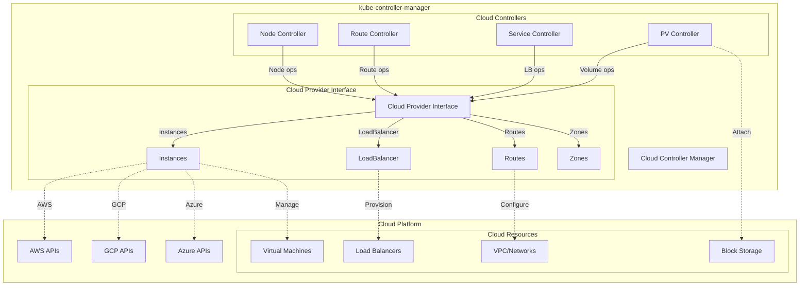
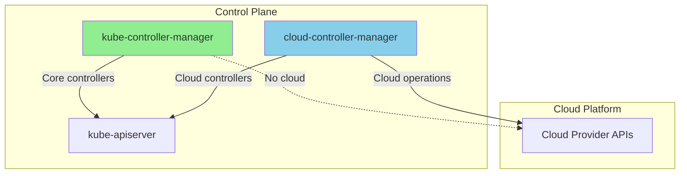

# Cloud Provider Integration

**Author**: Claude (AI Assistant)
**Date**: 2025-10-21
**Status**: Architecture Study
**Component**: kube-controller-manager

## Overview

Cloud provider integration enables Kubernetes to interact with cloud infrastructure for node management, load balancer provisioning, volume attachment, and route management. The controller manager coordinates multiple cloud-specific controllers that bridge Kubernetes abstractions with cloud platform APIs.

## Cloud Provider Architecture

### Overall Integration Model



## Cloud Provider Interface

### Core Interface Definition

**Source**: `staging/src/k8s.io/cloud-provider/cloud.go`

```go
// Source: staging/src/k8s.io/cloud-provider/cloud.go

// Interface is the main cloud provider interface
type Interface interface {
    // Initialize passes a Kubernetes clientset to the cloud provider
    Initialize(clientBuilder ControllerClientBuilder, stop <-chan struct{})

    // LoadBalancer returns a load balancer interface (if supported)
    LoadBalancer() (LoadBalancer, bool)

    // Instances returns an instances interface (deprecated, use InstancesV2)
    Instances() (Instances, bool)

    // InstancesV2 returns an instances interface
    InstancesV2() (InstancesV2, bool)

    // Zones returns a zones interface (if supported)
    Zones() (Zones, bool)

    // Clusters returns a clusters interface (deprecated)
    Clusters() (Clusters, bool)

    // Routes returns a routes interface (if supported)
    Routes() (Routes, bool)

    // ProviderName returns the cloud provider ID
    ProviderName() string

    // HasClusterID returns true if the cluster has a cluster ID
    HasClusterID() bool
}
```

### Instances Interface

```go
// Source: staging/src/k8s.io/cloud-provider/cloud.go

// InstancesV2 is the interface for cloud provider instances (v2)
type InstancesV2 interface {
    // InstanceExists returns true if instance exists
    InstanceExists(ctx context.Context, node *v1.Node) (bool, error)

    // InstanceShutdown returns true if instance is shutdown
    InstanceShutdown(ctx context.Context, node *v1.Node) (bool, error)

    // InstanceMetadata returns metadata for the instance
    InstanceMetadata(ctx context.Context, node *v1.Node) (*InstanceMetadata, error)
}

// InstanceMetadata contains instance metadata
type InstanceMetadata struct {
    // Provider ID (e.g., aws:///us-west-2a/i-1234567890abcdef0)
    ProviderID string

    // Instance type (e.g., m5.large)
    InstanceType string

    // Node addresses
    NodeAddresses []v1.NodeAddress

    // Availability zone
    Zone string

    // Region
    Region string
}
```

### LoadBalancer Interface

```go
// Source: staging/src/k8s.io/cloud-provider/cloud.go

// LoadBalancer is the interface for load balancer services
type LoadBalancer interface {
    // GetLoadBalancer returns load balancer status
    GetLoadBalancer(
        ctx context.Context,
        clusterName string,
        service *v1.Service,
    ) (*v1.LoadBalancerStatus, bool, error)

    // GetLoadBalancerName returns the name of the load balancer
    GetLoadBalancerName(
        ctx context.Context,
        clusterName string,
        service *v1.Service,
    ) string

    // EnsureLoadBalancer creates or updates load balancer
    EnsureLoadBalancer(
        ctx context.Context,
        clusterName string,
        service *v1.Service,
        nodes []*v1.Node,
    ) (*v1.LoadBalancerStatus, error)

    // UpdateLoadBalancer updates load balancer
    UpdateLoadBalancer(
        ctx context.Context,
        clusterName string,
        service *v1.Service,
        nodes []*v1.Node,
    ) error

    // EnsureLoadBalancerDeleted deletes load balancer
    EnsureLoadBalancerDeleted(
        ctx context.Context,
        clusterName string,
        service *v1.Service,
    ) error
}
```

### Routes Interface

```go
// Source: staging/src/k8s.io/cloud-provider/cloud.go

// Routes is the interface for network routes
type Routes interface {
    // ListRoutes lists all routes for the cluster
    ListRoutes(ctx context.Context, clusterName string) ([]*Route, error)

    // CreateRoute creates a route
    CreateRoute(ctx context.Context, clusterName string, nameHint string, route *Route) error

    // DeleteRoute deletes a route
    DeleteRoute(ctx context.Context, clusterName string, route *Route) error
}

// Route represents a network route
type Route struct {
    // Name of the route
    Name string

    // Target node for the route
    TargetNode string

    // Destination CIDR
    DestinationCIDR string

    // Blackhole indicates if this is a blackhole route
    Blackhole bool
}
```

---

## Cloud-Specific Controllers

### 1. Cloud Node Controller

**Source**: `pkg/controller/cloud/node_controller.go`

Already covered in detail in document 18 (node-lifecycle-controllers.md), but key aspects:

```go
// Sync node with cloud metadata
func (cnc *CloudNodeController) reconcileNode(node *v1.Node) error {
    // Check if instance exists
    exists, err := cnc.cloud.InstancesV2().InstanceExists(ctx, node)
    if err != nil {
        return err
    }

    if !exists {
        // Node doesn't exist in cloud, delete from cluster
        return cnc.deleteNode(node)
    }

    // Get instance metadata
    metadata, err := cnc.cloud.InstancesV2().InstanceMetadata(ctx, node)
    if err != nil {
        return err
    }

    // Update node with cloud metadata
    return cnc.updateNodeWithMetadata(node, metadata)
}

// Update node with cloud metadata
func (cnc *CloudNodeController) updateNodeWithMetadata(
    node *v1.Node,
    metadata *cloudprovider.InstanceMetadata,
) error {
    nodeCopy := node.DeepCopy()

    // Update provider ID
    nodeCopy.Spec.ProviderID = metadata.ProviderID

    // Update instance type label
    if metadata.InstanceType != "" {
        nodeCopy.Labels[v1.LabelInstanceTypeStable] = metadata.InstanceType
    }

    // Update zone labels
    if metadata.Zone != "" {
        nodeCopy.Labels[v1.LabelTopologyZone] = metadata.Zone
    }

    if metadata.Region != "" {
        nodeCopy.Labels[v1.LabelTopologyRegion] = metadata.Region
    }

    // Update node addresses
    nodeCopy.Status.Addresses = metadata.NodeAddresses

    // Update node
    _, err := cnc.client.CoreV1().Nodes().Update(ctx, nodeCopy, metav1.UpdateOptions{})
    return err
}
```

### 2. Cloud Service Controller

**Source**: `pkg/controller/service/service_controller.go`

Already covered in document 14 (service-endpoint-controllers.md), manages LoadBalancer services.

```go
// Ensure load balancer exists
func (c *Controller) ensureLoadBalancer(service *v1.Service) error {
    // Get nodes
    nodes, err := c.nodeLister.List(labels.Everything())
    if err != nil {
        return err
    }

    // Filter to ready nodes
    readyNodes := filterReadyNodes(nodes)

    // Ensure load balancer via cloud provider
    status, err := c.cloud.LoadBalancer().EnsureLoadBalancer(
        ctx,
        c.clusterName,
        service,
        readyNodes,
    )
    if err != nil {
        return err
    }

    // Update service status
    return c.updateServiceStatus(service, status)
}
```

### 3. Cloud Route Controller

**Source**: `pkg/controller/route/route_controller.go`

Manages network routes for pod-to-pod communication across nodes.

```go
// Source: pkg/controller/route/route_controller.go

type RouteController struct {
    // Routes interface from cloud provider
    routes cloudprovider.Routes

    // Node informer
    nodeLister corelisters.NodeLister
    nodeSynced cache.InformerSynced

    // Cluster name
    clusterName string

    // Cluster CIDR
    clusterCIDR *net.IPNet

    // Work queue
    queue workqueue.RateLimitingInterface
}

// Reconcile routes
func (rc *RouteController) reconcile() error {
    // Get all nodes
    nodes, err := rc.nodeLister.List(labels.Everything())
    if err != nil {
        return err
    }

    // Get existing routes from cloud
    existingRoutes, err := rc.routes.ListRoutes(ctx, rc.clusterName)
    if err != nil {
        return err
    }

    // Calculate desired routes (one per node)
    desiredRoutes := rc.calculateDesiredRoutes(nodes)

    // Reconcile routes
    return rc.reconcileRoutes(existingRoutes, desiredRoutes)
}

// Calculate desired routes
func (rc *RouteController) calculateDesiredRoutes(nodes []*v1.Node) []*cloudprovider.Route {
    var routes []*cloudprovider.Route

    for _, node := range nodes {
        // Skip nodes without PodCIDR
        if node.Spec.PodCIDR == "" {
            continue
        }

        route := &cloudprovider.Route{
            Name:            node.Name,
            TargetNode:      node.Name,
            DestinationCIDR: node.Spec.PodCIDR,
        }

        routes = append(routes, route)
    }

    return routes
}

// Reconcile routes
func (rc *RouteController) reconcileRoutes(
    existing []*cloudprovider.Route,
    desired []*cloudprovider.Route,
) error {
    // Build maps for comparison
    existingMap := make(map[string]*cloudprovider.Route)
    for _, route := range existing {
        existingMap[route.DestinationCIDR] = route
    }

    desiredMap := make(map[string]*cloudprovider.Route)
    for _, route := range desired {
        desiredMap[route.DestinationCIDR] = route
    }

    // Create missing routes
    for cidr, route := range desiredMap {
        if _, exists := existingMap[cidr]; !exists {
            err := rc.routes.CreateRoute(ctx, rc.clusterName, route.Name, route)
            if err != nil {
                return err
            }
        }
    }

    // Delete extra routes
    for cidr, route := range existingMap {
        if _, exists := desiredMap[cidr]; !exists {
            err := rc.routes.DeleteRoute(ctx, rc.clusterName, route)
            if err != nil {
                return err
            }
        }
    }

    return nil
}
```

---

## Provider-Specific Implementations

### AWS Cloud Provider Example

```go
// Source: staging/src/k8s.io/legacy-cloud-providers/aws/aws.go

type Cloud struct {
    ec2      *ec2.EC2
    elb      *elb.ELB
    metadata *metadata.EC2Metadata

    region string
    vpcID  string
}

// InstanceMetadata for AWS
func (c *Cloud) InstanceMetadata(ctx context.Context, node *v1.Node) (*InstanceMetadata, error) {
    // Parse provider ID: aws:///us-west-2a/i-1234567890abcdef0
    providerID := node.Spec.ProviderID
    instanceID := parseAWSInstanceID(providerID)

    // Describe instance
    result, err := c.ec2.DescribeInstances(&ec2.DescribeInstancesInput{
        InstanceIds: []*string{aws.String(instanceID)},
    })
    if err != nil {
        return nil, err
    }

    instance := result.Reservations[0].Instances[0]

    // Build metadata
    metadata := &InstanceMetadata{
        ProviderID:   providerID,
        InstanceType: *instance.InstanceType,
        Zone:         *instance.Placement.AvailabilityZone,
        Region:       c.region,
        NodeAddresses: []v1.NodeAddress{
            {
                Type:    v1.NodeInternalIP,
                Address: *instance.PrivateIpAddress,
            },
        },
    }

    // Add external IP if exists
    if instance.PublicIpAddress != nil {
        metadata.NodeAddresses = append(metadata.NodeAddresses, v1.NodeAddress{
            Type:    v1.NodeExternalIP,
            Address: *instance.PublicIpAddress,
        })
    }

    return metadata, nil
}

// EnsureLoadBalancer for AWS (ELB/NLB/ALB)
func (c *Cloud) EnsureLoadBalancer(
    ctx context.Context,
    clusterName string,
    service *v1.Service,
    nodes []*v1.Node,
) (*v1.LoadBalancerStatus, error) {
    // Get load balancer name
    lbName := c.GetLoadBalancerName(clusterName, service)

    // Check if load balancer exists
    existing, err := c.getLoadBalancer(lbName)
    if err != nil && !isNotFound(err) {
        return nil, err
    }

    if existing == nil {
        // Create new load balancer
        return c.createLoadBalancer(lbName, service, nodes)
    }

    // Update existing load balancer
    return c.updateLoadBalancer(lbName, service, nodes)
}

// CreateLoadBalancer creates ELB/NLB
func (c *Cloud) createLoadBalancer(
    name string,
    service *v1.Service,
    nodes []*v1.Node,
) (*v1.LoadBalancerStatus, error) {
    // Determine LB type from annotations
    lbType := getLoadBalancerType(service)

    switch lbType {
    case "nlb":
        return c.createNLB(name, service, nodes)
    case "alb":
        return c.createALB(name, service, nodes)
    default:
        return c.createELB(name, service, nodes)
    }
}

// CreateRoute for AWS VPC
func (c *Cloud) CreateRoute(
    ctx context.Context,
    clusterName string,
    nameHint string,
    route *Route,
) error {
    // Get route table
    routeTableID, err := c.getRouteTableID()
    if err != nil {
        return err
    }

    // Get instance ID for target node
    instanceID, err := c.getInstanceIDForNode(route.TargetNode)
    if err != nil {
        return err
    }

    // Create route in VPC
    _, err = c.ec2.CreateRoute(&ec2.CreateRouteInput{
        RouteTableId:         aws.String(routeTableID),
        DestinationCidrBlock: aws.String(route.DestinationCIDR),
        InstanceId:           aws.String(instanceID),
    })

    return err
}
```

---

## Cloud Provider Configuration

### Controller Manager Configuration

```bash
# kube-controller-manager flags

# Cloud provider
--cloud-provider=aws  # aws, gce, azure, vsphere, openstack

# Cloud config file
--cloud-config=/etc/kubernetes/cloud.conf

# External cloud controller manager (for out-of-tree providers)
--cloud-provider=external
```

### Cloud Config Examples

**AWS cloud.conf:**

```ini
[Global]
Zone=us-west-2a
VPC=vpc-12345678
SubnetID=subnet-12345678
RouteTableID=rtb-12345678
KubernetesClusterTag=kubernetes.io/cluster/my-cluster
KubernetesClusterID=my-cluster
```

**GCP cloud.conf:**

```ini
[Global]
project-id=my-gcp-project
network-name=kubernetes
subnetwork-name=kubernetes-nodes
node-tags=kubernetes-node
multizone=true
```

**Azure cloud.conf:**

```json
{
  "cloud": "AzurePublicCloud",
  "tenantId": "00000000-0000-0000-0000-000000000000",
  "subscriptionId": "00000000-0000-0000-0000-000000000000",
  "resourceGroup": "kubernetes-rg",
  "location": "eastus",
  "vnetName": "kubernetes-vnet",
  "subnetName": "kubernetes-subnet",
  "securityGroupName": "kubernetes-nsg",
  "routeTableName": "kubernetes-routes",
  "loadBalancerSku": "Standard",
  "useInstanceMetadata": true
}
```

---

## Cloud Controller Manager (Out-of-Tree)

### Architecture Shift

Modern Kubernetes uses **external cloud controller manager** (CCM):



**Benefits:**
- Cloud provider code separate from Kubernetes core
- Faster cloud provider development cycles
- Reduced kube-controller-manager complexity
- Independent versioning

### External CCM Controllers

```go
// Cloud controller manager runs subset of controllers
func NewCloudControllerManager() {
    controllers := []string{
        "cloud-node-lifecycle",
        "service",
        "route",
    }

    // Does NOT run:
    // - deployment
    // - replicaset
    // - endpoint
    // - etc.
}
```

---

## Migration to External CCM

### Migration Steps

**1. Enable external cloud provider:**

```bash
# kube-controller-manager
--cloud-provider=external

# kubelet
--cloud-provider=external
```

**2. Deploy cloud controller manager:**

```yaml
apiVersion: apps/v1
kind: DaemonSet
metadata:
  name: cloud-controller-manager
  namespace: kube-system
spec:
  selector:
    matchLabels:
      component: cloud-controller-manager
  template:
    metadata:
      labels:
        component: cloud-controller-manager
    spec:
      serviceAccountName: cloud-controller-manager
      containers:
      - name: cloud-controller-manager
        image: gcr.io/cloud-provider-aws:latest
        command:
        - /bin/aws-cloud-controller-manager
        - --cloud-provider=aws
        - --cloud-config=/etc/kubernetes/cloud.conf
        - --v=2
        volumeMounts:
        - name: cloud-config
          mountPath: /etc/kubernetes
          readOnly: true
      volumes:
      - name: cloud-config
        configMap:
          name: cloud-config
```

**3. Taint master nodes:**

```bash
kubectl taint nodes node1 \
  node.cloudprovider.kubernetes.io/uninitialized=true:NoSchedule
```

CCM removes taint after initializing node.

---

## Best Practices

### 1. Use Provider ID

Always set provider ID on nodes:

```yaml
spec:
  providerID: "aws:///us-west-2a/i-1234567890abcdef0"
```

### 2. Leverage Cloud Labels

Use topology labels for scheduling:

```yaml
spec:
  affinity:
    nodeAffinity:
      requiredDuringSchedulingIgnoredDuringExecution:
        nodeSelectorTerms:
        - matchExpressions:
          - key: topology.kubernetes.io/zone
            operator: In
            values:
            - us-west-2a
            - us-west-2b
```

### 3. Service Annotations

Use cloud-specific annotations:

```yaml
metadata:
  annotations:
    # AWS
    service.beta.kubernetes.io/aws-load-balancer-type: "nlb"
    service.beta.kubernetes.io/aws-load-balancer-internal: "true"

    # GCP
    cloud.google.com/load-balancer-type: "Internal"

    # Azure
    service.beta.kubernetes.io/azure-load-balancer-internal: "true"
```

---

## Troubleshooting

### Node Not Getting Cloud Metadata

```bash
# Check provider ID
kubectl get node node1 -o jsonpath='{.spec.providerID}'

# Check cloud controller logs
kubectl logs -n kube-system cloud-controller-manager-*

# Verify cloud credentials
kubectl get secret -n kube-system cloud-provider-credentials
```

### Load Balancer Not Created

```bash
# Check service events
kubectl describe service myapp

# Check cloud controller logs
kubectl logs -n kube-system cloud-controller-manager-* | grep -i loadbalancer

# Verify IAM permissions
aws iam get-role --role-name KubernetesControllerRole
```

### Routes Not Created

```bash
# Check route controller logs
kubectl logs -n kube-system cloud-controller-manager-* | grep -i route

# List routes in cloud
aws ec2 describe-route-tables --filters "Name=tag:KubernetesCluster,Values=my-cluster"

# Check node PodCIDR
kubectl get nodes -o custom-columns=NAME:.metadata.name,PODCIDR:.spec.podCIDR
```

---

## Source References

1. **Cloud Provider Interface**: `staging/src/k8s.io/cloud-provider/cloud.go`
2. **Route Controller**: `pkg/controller/route/route_controller.go`
3. **Cloud Node Controller**: `pkg/controller/cloud/node_controller.go`
4. **AWS Provider**: `staging/src/k8s.io/legacy-cloud-providers/aws/aws.go`
5. **GCP Provider**: `staging/src/k8s.io/legacy-cloud-providers/gce/gce.go`

---

## Summary

Cloud provider integration enables Kubernetes to leverage cloud infrastructure:

1. **Cloud Provider Interface**: Defines contracts for Instances, LoadBalancer, Routes, Zones
2. **Cloud Controllers**: Node, Service, and Route controllers use cloud APIs
3. **External CCM**: Modern approach with out-of-tree cloud controller manager
4. **Provider-Specific**: Each cloud has custom implementation (AWS, GCP, Azure, etc.)
5. **Migration Path**: Legacy in-tree to external CCM for better modularity

Key integrations:
- **Nodes**: Metadata, addresses, zones, instance types
- **LoadBalancers**: Automatic provisioning for Services
- **Routes**: Pod-to-pod networking across nodes
- **Volumes**: Persistent volume attachment and management

The shift to external CCM provides:
- Faster cloud provider updates
- Reduced core Kubernetes complexity
- Better cloud provider innovation
- Independent release cycles
