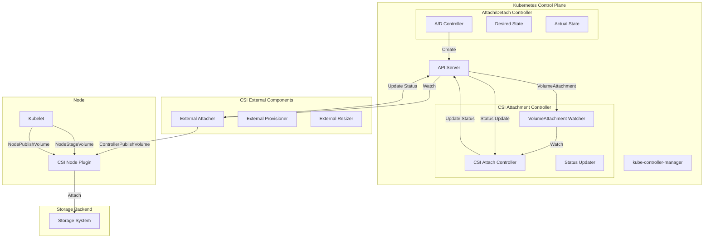
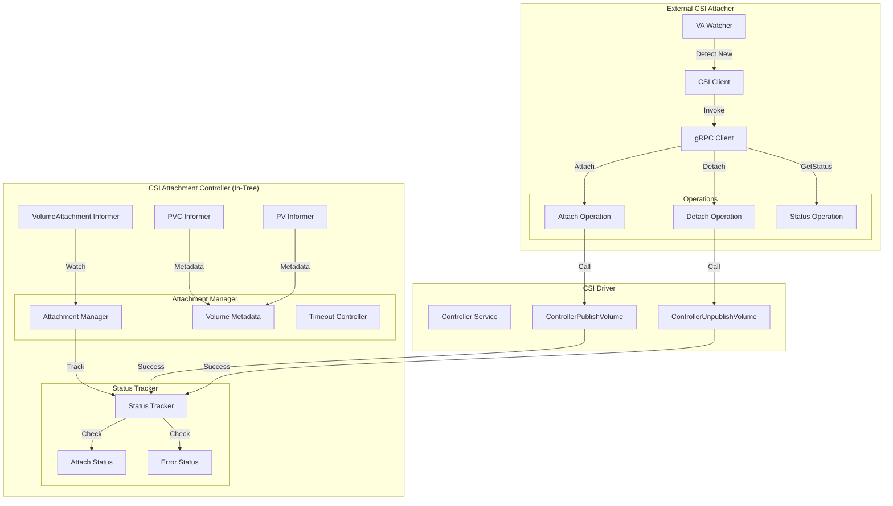
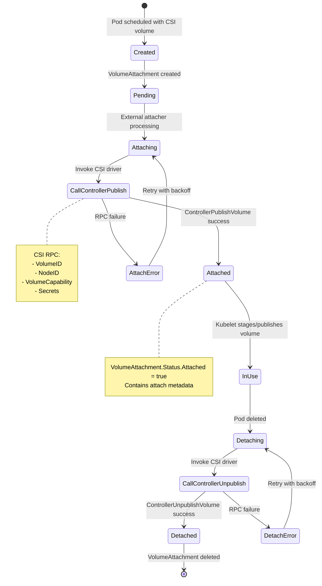
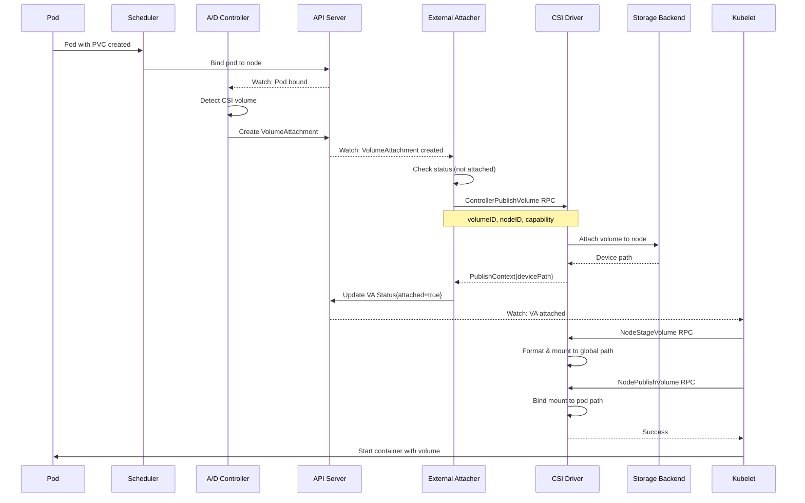

# CSI Attachment Controller

**Author**: Claude (AI Assistant)
**Date**: 2025-10-21
**Status**: Architecture Study
**Component**: kube-controller-manager

## Overview

The CSI (Container Storage Interface) Attachment controller manages VolumeAttachment objects that coordinate volume attach/detach operations with CSI drivers. It bridges Kubernetes' volume attachment abstraction with external CSI driver implementations, enabling pluggable storage backends without modifying Kubernetes core.

## CSI Architecture Overview

### CSI Component Interaction



## CSI Attachment Controller

### Source

**Source**: `pkg/controller/volume/attachdetach/csi/csi_attacher.go` and external-attacher sidecar

Note: The CSI attachment flow involves both in-tree controller-manager code and external CSI sidecar containers.

### Architecture



### VolumeAttachment Lifecycle



## VolumeAttachment Object

### Structure

```go
// Source: staging/src/k8s.io/api/storage/v1/types.go

// VolumeAttachment captures attachment/detachment of a volume
type VolumeAttachment struct {
    metav1.TypeMeta
    metav1.ObjectMeta

    // Spec is the specification
    Spec VolumeAttachmentSpec

    // Status is the status
    Status VolumeAttachmentStatus
}

// VolumeAttachmentSpec is the specification
type VolumeAttachmentSpec struct {
    // Attacher is the CSI driver name
    Attacher string

    // Source specifies the volume to attach
    Source VolumeAttachmentSource

    // NodeName is the node the volume should be attached to
    NodeName string
}

// VolumeAttachmentSource specifies volume source
type VolumeAttachmentSource struct {
    // PersistentVolumeName for in-tree PV
    PersistentVolumeName *string

    // InlineVolumeSpec for inline CSI volumes
    InlineVolumeSpec *v1.PersistentVolumeSpec
}

// VolumeAttachmentStatus is the status
type VolumeAttachmentStatus struct {
    // Attached indicates volume is attached
    Attached bool

    // AttachmentMetadata from ControllerPublishVolume
    AttachmentMetadata map[string]string

    // AttachError is the last attach error
    AttachError *VolumeError

    // DetachError is the last detach error
    DetachError *VolumeError
}
```

### Example VolumeAttachment

```yaml
apiVersion: storage.k8s.io/v1
kind: VolumeAttachment
metadata:
  name: csi-aws-ebs-pvc-12345-node-1
spec:
  attacher: ebs.csi.aws.com
  nodeName: node-1
  source:
    persistentVolumeName: pvc-12345
status:
  attached: true
  attachmentMetadata:
    devicePath: /dev/xvdba
```

## External CSI Attacher

### Sidecar Container

The external-attacher runs as a sidecar to the CSI driver:

```yaml
apiVersion: apps/v1
kind: Deployment
metadata:
  name: csi-aws-ebs-controller
  namespace: kube-system
spec:
  replicas: 2
  selector:
    matchLabels:
      app: csi-aws-ebs-controller
  template:
    metadata:
      labels:
        app: csi-aws-ebs-controller
    spec:
      containers:
      # External attacher sidecar
      - name: csi-attacher
        image: registry.k8s.io/sig-storage/csi-attacher:v4.0.0
        args:
        - --csi-address=/csi/csi.sock
        - --v=5
        - --leader-election=true
        volumeMounts:
        - name: socket-dir
          mountPath: /csi

      # CSI driver
      - name: ebs-plugin
        image: amazon/aws-ebs-csi-driver:latest
        args:
        - controller
        - --endpoint=unix:///csi/csi.sock
        volumeMounts:
        - name: socket-dir
          mountPath: /csi

      volumes:
      - name: socket-dir
        emptyDir: {}
```

### Attacher Logic

```go
// Source: external-attacher (kubernetes-csi/external-attacher)

type CSIAttacher struct {
    client    clientset.Interface
    csiClient csiclient.ControllerClient
    timeout   time.Duration
}

// Sync VolumeAttachment
func (a *CSIAttacher) syncVolumeAttachment(va *storage.VolumeAttachment) error {
    // Check if already attached
    if va.Status.Attached {
        return nil
    }

    // Check if detach requested
    if va.DeletionTimestamp != nil {
        return a.detachVolume(va)
    }

    // Attach volume
    return a.attachVolume(va)
}

// Attach volume via CSI
func (a *CSIAttacher) attachVolume(va *storage.VolumeAttachment) error {
    // Get PV
    pv, err := a.getPersistentVolume(va)
    if err != nil {
        return err
    }

    // Extract CSI volume attributes
    volumeID := pv.Spec.CSI.VolumeHandle
    volumeContext := pv.Spec.CSI.VolumeAttributes

    // Get secrets if needed
    secrets, err := a.getSecrets(pv.Spec.CSI.ControllerPublishSecretRef)
    if err != nil {
        return err
    }

    // Build CSI request
    req := &csi.ControllerPublishVolumeRequest{
        VolumeId: volumeID,
        NodeId:   va.Spec.NodeName,
        VolumeCapability: &csi.VolumeCapability{
            AccessType: &csi.VolumeCapability_Mount{
                Mount: &csi.VolumeCapability_MountVolume{
                    FsType: pv.Spec.CSI.FSType,
                },
            },
            AccessMode: &csi.VolumeCapability_AccessMode{
                Mode: csi.VolumeCapability_AccessMode_SINGLE_NODE_WRITER,
            },
        },
        VolumeContext: volumeContext,
        Secrets:       secrets,
    }

    // Call CSI driver
    ctx, cancel := context.WithTimeout(context.Background(), a.timeout)
    defer cancel()

    resp, err := a.csiClient.ControllerPublishVolume(ctx, req)
    if err != nil {
        return a.recordAttachError(va, err)
    }

    // Update VolumeAttachment status
    return a.updateAttachStatus(va, resp.PublishContext)
}

// Update attach status
func (a *CSIAttacher) updateAttachStatus(
    va *storage.VolumeAttachment,
    publishContext map[string]string,
) error {
    vaCopy := va.DeepCopy()
    vaCopy.Status.Attached = true
    vaCopy.Status.AttachmentMetadata = publishContext
    vaCopy.Status.AttachError = nil

    _, err := a.client.StorageV1().VolumeAttachments().UpdateStatus(
        context.TODO(),
        vaCopy,
        metav1.UpdateOptions{},
    )

    return err
}

// Detach volume via CSI
func (a *CSIAttacher) detachVolume(va *storage.VolumeAttachment) error {
    // Get PV
    pv, err := a.getPersistentVolume(va)
    if err != nil {
        return err
    }

    volumeID := pv.Spec.CSI.VolumeHandle

    // Get secrets if needed
    secrets, err := a.getSecrets(pv.Spec.CSI.ControllerPublishSecretRef)
    if err != nil {
        return err
    }

    // Build CSI request
    req := &csi.ControllerUnpublishVolumeRequest{
        VolumeId: volumeID,
        NodeId:   va.Spec.NodeName,
        Secrets:  secrets,
    }

    // Call CSI driver
    ctx, cancel := context.WithTimeout(context.Background(), a.timeout)
    defer cancel()

    _, err = a.csiClient.ControllerUnpublishVolume(ctx, req)
    if err != nil {
        return a.recordDetachError(va, err)
    }

    // Delete VolumeAttachment
    return a.client.StorageV1().VolumeAttachments().Delete(
        context.TODO(),
        va.Name,
        metav1.DeleteOptions{},
    )
}
```

## CSI RPC Calls

### ControllerPublishVolume

```protobuf
// Source: CSI spec

service Controller {
    rpc ControllerPublishVolume (ControllerPublishVolumeRequest)
        returns (ControllerPublishVolumeResponse) {}

    rpc ControllerUnpublishVolume (ControllerUnpublishVolumeRequest)
        returns (ControllerUnpublishVolumeResponse) {}
}

message ControllerPublishVolumeRequest {
    // Volume ID from CreateVolume
    string volume_id = 1;

    // Node ID from GetNodeInfo
    string node_id = 2;

    // Volume capability
    VolumeCapability volume_capability = 3;

    // Read only flag
    bool readonly = 4;

    // Secrets for attaching
    map<string, string> secrets = 5;

    // Volume context from CreateVolume
    map<string, string> volume_context = 6;
}

message ControllerPublishVolumeResponse {
    // Publish context (e.g., device path)
    map<string, string> publish_context = 1;
}
```

### Example CSI Driver Implementation

```go
// Example AWS EBS CSI driver

func (d *Driver) ControllerPublishVolume(
    ctx context.Context,
    req *csi.ControllerPublishVolumeRequest,
) (*csi.ControllerPublishVolumeResponse, error) {
    volumeID := req.GetVolumeId()
    nodeID := req.GetNodeId()

    // Attach EBS volume to EC2 instance
    devicePath, err := d.cloud.AttachDisk(volumeID, nodeID)
    if err != nil {
        return nil, status.Error(codes.Internal, err.Error())
    }

    // Wait for attachment
    err = d.cloud.WaitForAttachment(volumeID, nodeID)
    if err != nil {
        return nil, status.Error(codes.Internal, err.Error())
    }

    // Return publish context
    return &csi.ControllerPublishVolumeResponse{
        PublishContext: map[string]string{
            "devicePath": devicePath,
        },
    }, nil
}

func (d *Driver) ControllerUnpublishVolume(
    ctx context.Context,
    req *csi.ControllerUnpublishVolumeRequest,
) (*csi.ControllerUnpublishVolumeResponse, error) {
    volumeID := req.GetVolumeId()
    nodeID := req.GetNodeId()

    // Detach EBS volume from EC2 instance
    err := d.cloud.DetachDisk(volumeID, nodeID)
    if err != nil {
        return nil, status.Error(codes.Internal, err.Error())
    }

    // Wait for detachment
    err = d.cloud.WaitForDetachment(volumeID, nodeID)
    if err != nil {
        return nil, status.Error(codes.Internal, err.Error())
    }

    return &csi.ControllerUnpublishVolumeResponse{}, nil
}
```

## Complete Attach Flow



## Error Handling

### Retry Logic

```go
// Exponential backoff for CSI operations
func (a *CSIAttacher) attachWithRetry(va *storage.VolumeAttachment) error {
    backoff := wait.Backoff{
        Duration: 1 * time.Second,
        Factor:   2.0,
        Steps:    5,
        Cap:      30 * time.Second,
    }

    return wait.ExponentialBackoff(backoff, func() (bool, error) {
        err := a.attachVolume(va)
        if err == nil {
            return true, nil // Success
        }

        // Check if error is retryable
        if isRetryable(err) {
            return false, nil // Retry
        }

        return false, err // Permanent failure
    })
}

// Check if CSI error is retryable
func isRetryable(err error) bool {
    st, ok := status.FromError(err)
    if !ok {
        return false
    }

    // Retry on transient errors
    switch st.Code() {
    case codes.Unavailable, codes.DeadlineExceeded, codes.Aborted:
        return true
    default:
        return false
    }
}
```

## Configuration

### CSI Driver Registration

```yaml
apiVersion: storage.k8s.io/v1
kind: CSIDriver
metadata:
  name: ebs.csi.aws.com
spec:
  attachRequired: true  # Requires ControllerPublishVolume
  podInfoOnMount: false
  volumeLifecycleModes:
  - Persistent
  - Ephemeral
```

### External Attacher Flags

```bash
# external-attacher flags
--csi-address=/csi/csi.sock          # CSI driver socket
--timeout=60s                         # RPC timeout
--worker-threads=10                   # Concurrent operations
--retry-interval-start=1s             # Initial retry interval
--retry-interval-max=5m               # Max retry interval
--leader-election=true                # Enable leader election
--leader-election-namespace=kube-system
```

## Troubleshooting

### VolumeAttachment Stuck

```bash
# Check VA status
kubectl get volumeattachment
kubectl describe volumeattachment csi-xxxxx

# Check external-attacher logs
kubectl logs -n kube-system csi-aws-ebs-controller-* -c csi-attacher

# Check CSI driver logs
kubectl logs -n kube-system csi-aws-ebs-controller-* -c ebs-plugin
```

### Common Issues

**Issue**: Attach timeout

```yaml
status:
  attachError:
    message: "rpc error: code = DeadlineExceeded desc = context deadline exceeded"
    time: "2025-10-21T10:00:00Z"
```

**Solutions**:
- Increase `--timeout` on external-attacher
- Check CSI driver performance
- Verify storage backend connectivity

---

## Source References

1. **CSI Attacher**: `pkg/controller/volume/attachdetach/csi/csi_attacher.go`
2. **External Attacher**: `kubernetes-csi/external-attacher`
3. **VolumeAttachment Types**: `staging/src/k8s.io/api/storage/v1/types.go`
4. **CSI Spec**: Container Storage Interface specification

---

## Summary

The CSI Attachment controller enables pluggable storage via CSI:

1. **VolumeAttachment CRD**: Declares desired attach/detach operations
2. **External Attacher**: Sidecar that calls CSI driver RPCs
3. **CSI Driver**: Implements ControllerPublishVolume/ControllerUnpublishVolume
4. **Status Tracking**: Maintains attachment state in VolumeAttachment status
5. **Error Handling**: Retry logic with exponential backoff

This architecture separates Kubernetes from storage implementation details, enabling third-party storage providers without core code changes.