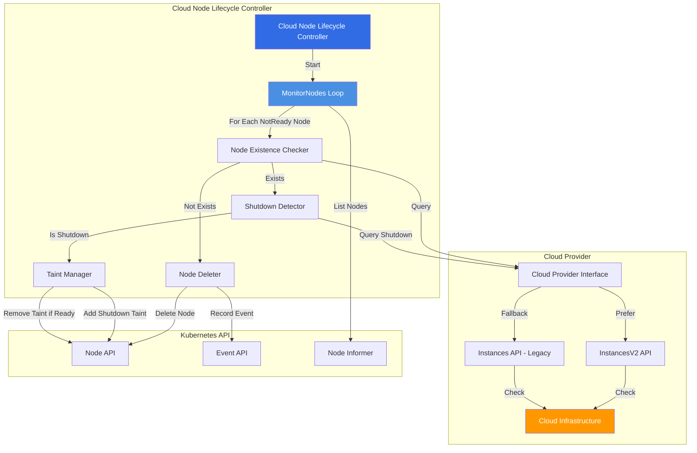
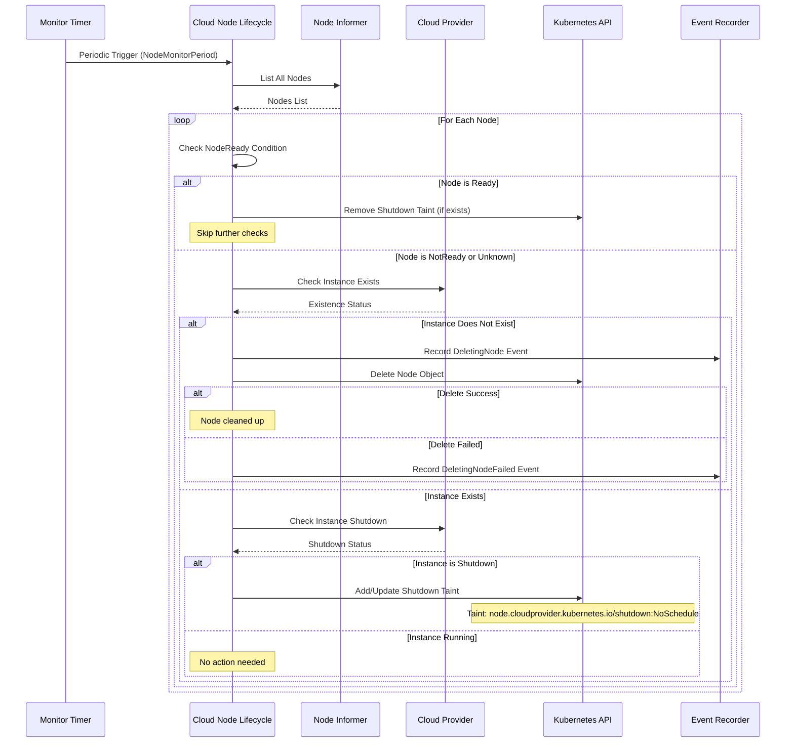
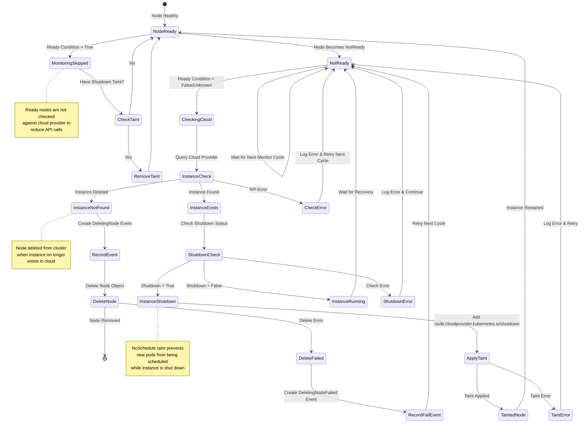
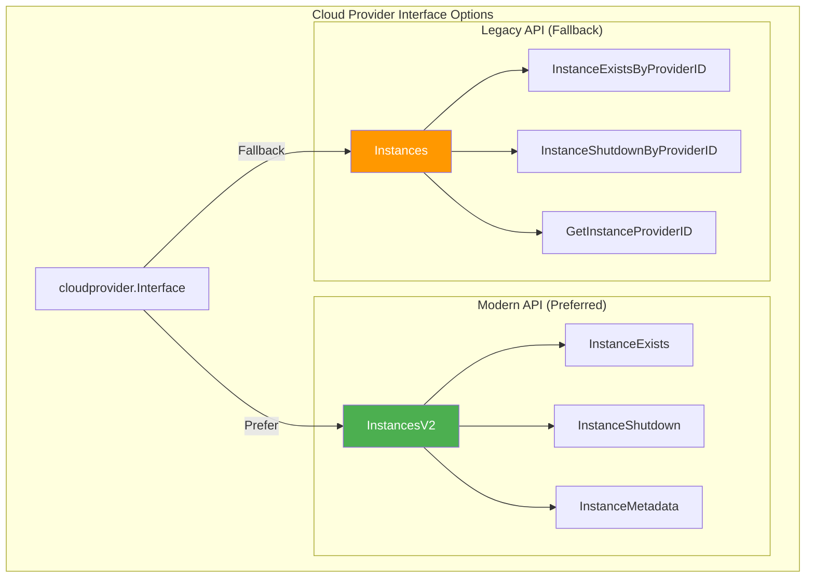
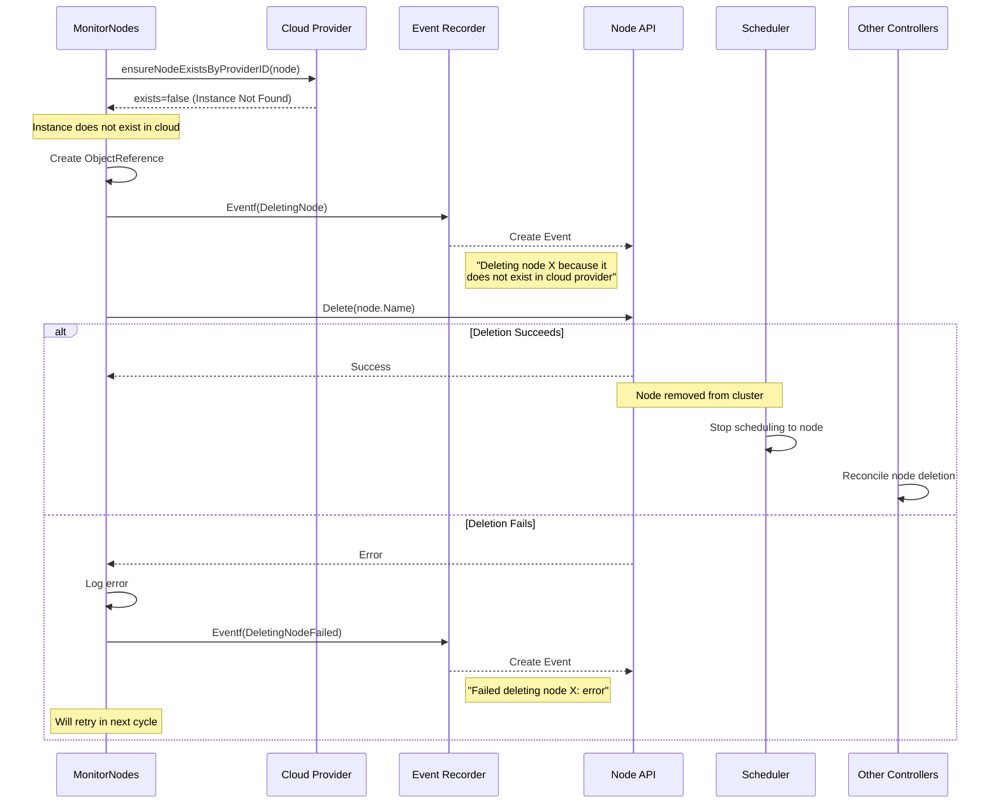
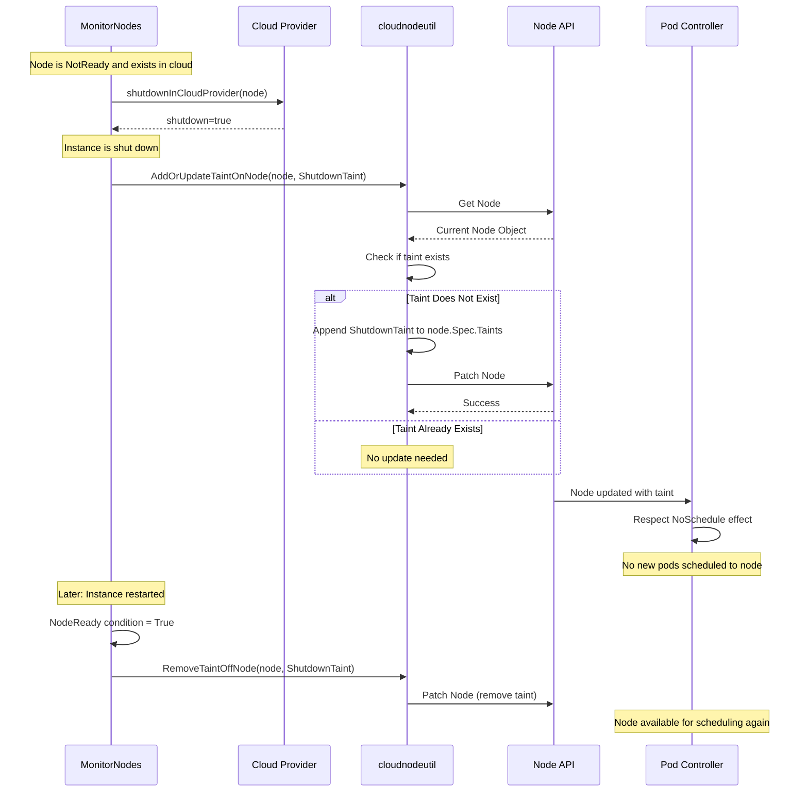
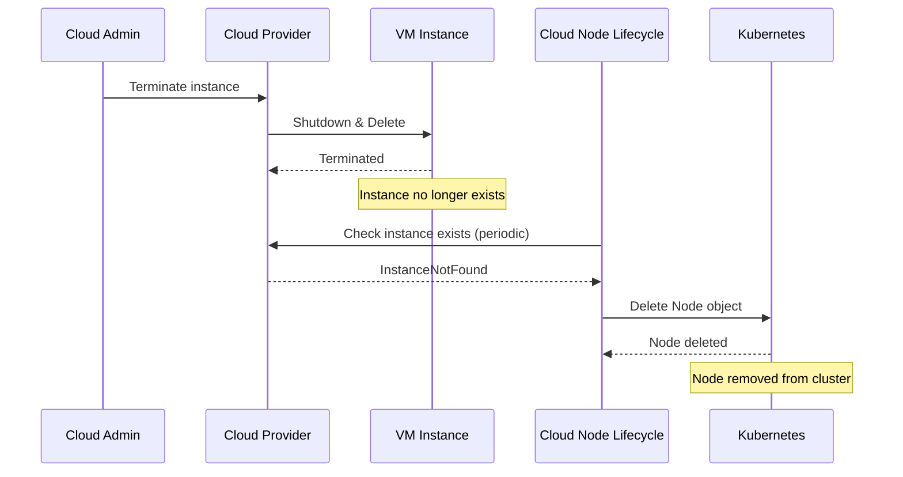
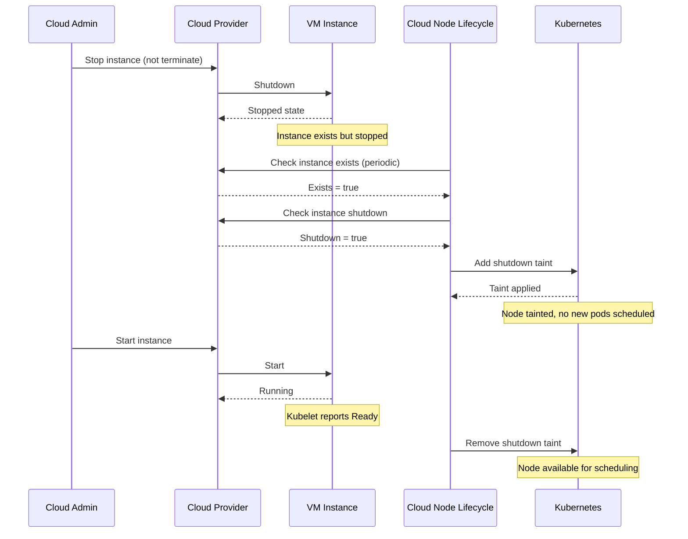
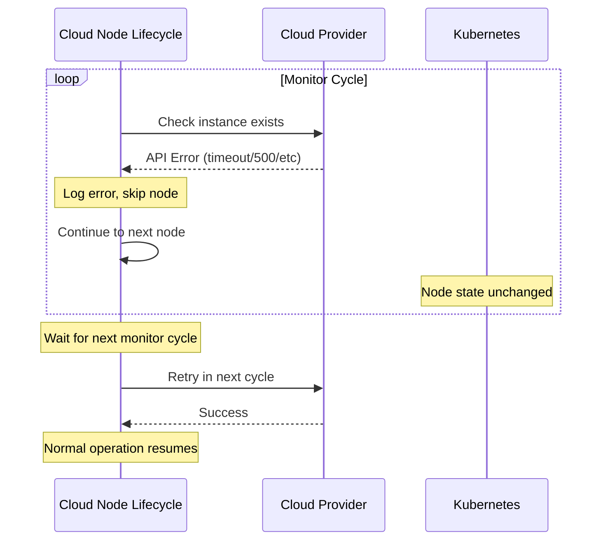

# Cloud Node Lifecycle Controller

## Overview

The Cloud Node Lifecycle Controller is a critical component of the cloud-controller-manager (and optionally kube-controller-manager in legacy configurations) responsible for managing the lifecycle of Kubernetes nodes based on their corresponding cloud provider instance state. It monitors nodes in the cluster and synchronizes their state with the underlying cloud infrastructure, deleting nodes when instances are terminated and applying shutdown taints when instances are stopped.

**Primary Location**: `staging/src/k8s.io/cloud-provider/controllers/nodelifecycle/`

**Key Responsibilities**:
- Monitor cloud provider instance existence
- Detect instance shutdown state
- Delete node objects when instances are terminated
- Apply shutdown taints to stopped instances
- Synchronize node lifecycle with cloud infrastructure

## Architecture

### High-Level Architecture



### Component Interactions



## Controller State Machine

### Node Lifecycle States



## Core Data Structures

### Controller Structure

```go
// Location: staging/src/k8s.io/cloud-provider/controllers/nodelifecycle/node_lifecycle_controller.go:56-69

type CloudNodeLifecycleController struct {
    kubeClient clientset.Interface    // Kubernetes API client
    nodeLister v1lister.NodeLister     // Node lister from informer cache

    broadcaster record.EventBroadcaster // Event broadcaster
    recorder    record.EventRecorder    // Event recorder for node events

    cloud cloudprovider.Interface       // Cloud provider interface

    // Value controlling NodeController monitoring period, i.e. how often does NodeController
    // check node status posted from kubelet. This value should be lower than nodeMonitorGracePeriod
    // set in controller-manager
    nodeMonitorPeriod time.Duration
}
```

### Shutdown Taint

```go
// Location: staging/src/k8s.io/cloud-provider/controllers/nodelifecycle/node_lifecycle_controller.go:49-52
// Location: staging/src/k8s.io/cloud-provider/api/well_known_taints.go:26-28

var ShutdownTaint = &v1.Taint{
    Key:    cloudproviderapi.TaintNodeShutdown, // "node.cloudprovider.kubernetes.io/shutdown"
    Effect: v1.TaintEffectNoSchedule,
}

// TaintNodeShutdown when node is shutdown in external cloud provider
TaintNodeShutdown = "node.cloudprovider.kubernetes.io/shutdown"
```

### Event Constants

```go
// Location: staging/src/k8s.io/cloud-provider/controllers/nodelifecycle/node_lifecycle_controller.go:44-47

const (
    deleteNodeEvent       = "DeletingNode"        // Event when deleting node
    deleteNodeFailedEvent = "DeletingNodeFailed"  // Event when delete fails
)
```

## Key Operations

### 1. Controller Initialization

```go
// Location: staging/src/k8s.io/cloud-provider/controllers/nodelifecycle/node_lifecycle_controller.go:71-99

func NewCloudNodeLifecycleController(
    nodeInformer coreinformers.NodeInformer,
    kubeClient clientset.Interface,
    cloud cloudprovider.Interface,
    nodeMonitorPeriod time.Duration) (*CloudNodeLifecycleController, error) {

    if kubeClient == nil {
        return nil, errors.New("kubernetes client is nil")
    }

    if cloud == nil {
        return nil, errors.New("no cloud provider provided")
    }

    // Verify cloud provider supports instances
    _, instancesSupported := cloud.Instances()
    _, instancesV2Supported := cloud.InstancesV2()
    if !instancesSupported && !instancesV2Supported {
        return nil, errors.New("cloud provider does not support instances")
    }

    c := &CloudNodeLifecycleController{
        kubeClient:        kubeClient,
        nodeLister:        nodeInformer.Lister(),
        cloud:             cloud,
        nodeMonitorPeriod: nodeMonitorPeriod,
    }

    return c, nil
}
```

**Validation Steps**:
1. Verify Kubernetes client is not nil
2. Verify cloud provider is not nil
3. Check cloud provider supports Instances() or InstancesV2() interface
4. Initialize controller with informer, client, and cloud provider

### 2. Main Control Loop

```go
// Location: staging/src/k8s.io/cloud-provider/controllers/nodelifecycle/node_lifecycle_controller.go:103-124

func (c *CloudNodeLifecycleController) Run(ctx context.Context,
    controllerManagerMetrics *controllersmetrics.ControllerManagerMetrics) {

    c.broadcaster = record.NewBroadcaster(record.WithContext(ctx))
    c.recorder = c.broadcaster.NewRecorder(scheme.Scheme,
        v1.EventSource{Component: "cloud-node-lifecycle-controller"})

    defer utilruntime.HandleCrash()
    controllerManagerMetrics.ControllerStarted("cloud-node-lifecycle")
    defer controllerManagerMetrics.ControllerStopped("cloud-node-lifecycle")

    // Start event processing pipeline
    klog.Info("Sending events to api server")
    c.broadcaster.StartStructuredLogging(0)
    c.broadcaster.StartRecordingToSink(&v1core.EventSinkImpl{
        Interface: c.kubeClient.CoreV1().Events("")})
    defer c.broadcaster.Shutdown()

    // The following loops run communicate with the APIServer with a worst case complexity
    // of O(num_nodes) per cycle. These functions are justified here because these events fire
    // very infrequently. DO NOT MODIFY this to perform frequent operations.

    // Start a loop to periodically check if any nodes have been
    // deleted or shutdown from the cloudprovider
    wait.UntilWithContext(ctx, c.MonitorNodes, c.nodeMonitorPeriod)
}
```

**Control Loop Characteristics**:
- Runs with O(num_nodes) complexity per cycle
- Designed for infrequent events (node deletion, shutdown)
- Uses periodic timer with configurable monitor period
- Sets up event broadcasting to API server

### 3. Node Monitoring

```go
// Location: staging/src/k8s.io/cloud-provider/controllers/nodelifecycle/node_lifecycle_controller.go:129-198

func (c *CloudNodeLifecycleController) MonitorNodes(ctx context.Context) {
    nodes, err := c.nodeLister.List(labels.Everything())
    if err != nil {
        klog.Errorf("error listing nodes from cache: %s", err)
        return
    }

    for _, node := range nodes {
        // Default NodeReady status to v1.ConditionUnknown
        status := v1.ConditionUnknown
        if _, c := nodeutil.GetNodeCondition(&node.Status, v1.NodeReady); c != nil {
            status = c.Status
        }

        if status == v1.ConditionTrue {
            // if taint exist remove taint
            err = cloudnodeutil.RemoveTaintOffNode(c.kubeClient, node.Name, node, ShutdownTaint)
            if err != nil {
                klog.Errorf("error patching node taints: %v", err)
            }
            continue
        }

        // At this point the node has NotReady status, we need to check if the node has been removed
        // from the cloud provider. If node cannot be found in cloudprovider, then delete the node
        exists, err := c.ensureNodeExistsByProviderID(ctx, node)
        if err != nil {
            klog.Errorf("error checking if node %s exists: %v", node.Name, err)
            continue
        }

        if !exists {
            // Current node does not exist, we should delete it, its taints do not matter anymore

            klog.V(2).Infof("deleting node since it is no longer present in cloud provider: %s", node.Name)

            ref := &v1.ObjectReference{
                Kind:      "Node",
                Name:      node.Name,
                UID:       types.UID(node.UID),
                Namespace: "",
            }

            c.recorder.Eventf(ref, v1.EventTypeNormal, deleteNodeEvent,
                "Deleting node %s because it does not exist in the cloud provider", node.Name)

            if err := c.kubeClient.CoreV1().Nodes().Delete(ctx, node.Name, metav1.DeleteOptions{}); err != nil {
                klog.Errorf("unable to delete node %q: %v", node.Name, err)
                c.recorder.Eventf(ref, v1.EventTypeWarning, deleteNodeFailedEvent,
                    "Failed deleting node %s: %v", node.Name, err)
            }
        } else {
            // Node exists. We need to check this to get taint working in similar in all cloudproviders
            // current problem is that shutdown nodes are not working in similar way ie. all cloudproviders
            // does not delete node from kubernetes cluster when instance it is shutdown see issue #46442
            shutdown, err := c.shutdownInCloudProvider(ctx, node)
            if err != nil {
                klog.Errorf("error checking if node %s is shutdown: %v", node.Name, err)
            }

            if shutdown && err == nil {
                // if node is shutdown add shutdown taint
                err = cloudnodeutil.AddOrUpdateTaintOnNode(c.kubeClient, node.Name, ShutdownTaint)
                if err != nil {
                    klog.Errorf("failed to apply shutdown taint to node %s, it may have been deleted.", node.Name)
                }
            }
        }
    }
}
```

**Monitor Logic Flow**:
1. List all nodes from informer cache
2. For each node, check NodeReady condition
3. If Ready: Remove shutdown taint if present
4. If NotReady/Unknown:
   - Check if instance exists in cloud
   - If not exists: Delete node from cluster
   - If exists: Check if shutdown and apply taint if needed

### 4. Instance Existence Check

```go
// Location: staging/src/k8s.io/cloud-provider/controllers/nodelifecycle/node_lifecycle_controller.go:251-270

func (c *CloudNodeLifecycleController) ensureNodeExistsByProviderID(
    ctx context.Context, node *v1.Node) (bool, error) {

    if instanceV2, ok := c.cloud.InstancesV2(); ok {
        return instanceV2.InstanceExists(ctx, node)
    }

    instances, ok := c.cloud.Instances()
    if !ok {
        return false, errors.New("instances interface not supported in the cloud provider")
    }

    providerID, err := c.getProviderID(ctx, node)
    if err != nil {
        if err == cloudprovider.InstanceNotFound {
            return false, nil
        }
        return false, err
    }

    return instances.InstanceExistsByProviderID(ctx, providerID)
}
```

**Existence Check Priority**:
1. Prefer InstancesV2 API if available (modern interface)
2. Fallback to legacy Instances API
3. Use provider ID from node spec or query cloud provider
4. Handle InstanceNotFound as non-existent (return false, nil)

### 5. Shutdown State Detection

```go
// Location: staging/src/k8s.io/cloud-provider/controllers/nodelifecycle/node_lifecycle_controller.go:224-248

func (c *CloudNodeLifecycleController) shutdownInCloudProvider(
    ctx context.Context, node *v1.Node) (bool, error) {

    if instanceV2, ok := c.cloud.InstancesV2(); ok {
        return instanceV2.InstanceShutdown(ctx, node)
    }

    instances, ok := c.cloud.Instances()
    if !ok {
        return false, errors.New("cloud provider does not support instances")
    }

    providerID, err := c.getProviderID(ctx, node)
    if err != nil {
        if err == cloudprovider.InstanceNotFound {
            return false, nil
        }
        return false, err
    }

    shutdown, err := instances.InstanceShutdownByProviderID(ctx, providerID)
    if err == cloudprovider.NotImplemented {
        return false, nil
    }

    return shutdown, err
}
```

**Shutdown Detection**:
- Uses InstancesV2.InstanceShutdown() or legacy Instances.InstanceShutdownByProviderID()
- Returns false if cloud provider doesn't implement shutdown detection
- Handles NotImplemented error gracefully (feature not available)

### 6. Provider ID Resolution

```go
// Location: staging/src/k8s.io/cloud-provider/controllers/nodelifecycle/node_lifecycle_controller.go:202-221

func (c *CloudNodeLifecycleController) getProviderID(
    ctx context.Context, node *v1.Node) (string, error) {

    if node.Spec.ProviderID != "" {
        return node.Spec.ProviderID, nil
    }

    if instanceV2, ok := c.cloud.InstancesV2(); ok {
        metadata, err := instanceV2.InstanceMetadata(ctx, node)
        if err != nil {
            return "", err
        }
        return metadata.ProviderID, nil
    }

    providerID, err := cloudprovider.GetInstanceProviderID(ctx, c.cloud,
        types.NodeName(node.Name))
    if err != nil {
        return "", err
    }

    return providerID, nil
}
```

**Provider ID Resolution Strategy**:
1. Use node.Spec.ProviderID if already set (fast path)
2. Query InstancesV2.InstanceMetadata() for metadata
3. Fallback to legacy cloudprovider.GetInstanceProviderID()

## Controller Startup

### Initialization in Cloud Controller Manager

```go
// Location: staging/src/k8s.io/cloud-provider/app/core.go:62-79

func startCloudNodeLifecycleController(ctx context.Context,
    initContext ControllerInitContext,
    controlexContext controllermanagerapp.ControllerContext,
    completedConfig *config.CompletedConfig,
    cloud cloudprovider.Interface) (controller.Interface, bool, error) {

    // Start the cloudNodeLifecycleController
    cloudNodeLifecycleController, err := cloudnodelifecyclecontroller.NewCloudNodeLifecycleController(
        completedConfig.SharedInformers.Core().V1().Nodes(),
        // cloud node lifecycle controller uses existing cluster role from node-controller
        completedConfig.ClientBuilder.ClientOrDie(initContext.ClientName),
        cloud,
        completedConfig.ComponentConfig.KubeCloudShared.NodeMonitorPeriod.Duration,
    )
    if err != nil {
        klog.Warningf("failed to start cloud node lifecycle controller: %s", err)
        return nil, false, nil
    }

    go cloudNodeLifecycleController.Run(ctx, controlexContext.ControllerManagerMetrics)

    return nil, true, nil
}
```

**Startup Process**:
1. Create controller with node informer, client, cloud provider
2. Use NodeMonitorPeriod from configuration
3. Reuses node-controller cluster role (RBAC)
4. Start as goroutine with metrics tracking
5. Errors are logged but don't fail the controller manager

## Configuration

### Command-Line Flags

```go
// Location: staging/src/k8s.io/cloud-provider/options/kubecloudshared.go:61-62

fs.DurationVar(&o.NodeMonitorPeriod.Duration, "node-monitor-period", o.NodeMonitorPeriod.Duration,
    fmt.Sprintf("The period for syncing NodeStatus in %s.", names.CloudNodeLifecycleController))
```

### Configuration Structure

```go
// Location: staging/src/k8s.io/cloud-provider/config/types.go

type KubeCloudSharedConfiguration struct {
    // NodeMonitorPeriod is the period for syncing NodeStatus in cloud-node-lifecycle-controller
    NodeMonitorPeriod metav1.Duration

    // Other shared configuration...
    ClusterName string
    ClusterCIDR string
    AllocateNodeCIDRs bool
    RouteReconciliationPeriod metav1.Duration
}
```

### Default Configuration

| Parameter | Default Value | Description |
|-----------|---------------|-------------|
| `node-monitor-period` | 5s | How often to check node cloud provider status |

## Cloud Provider Integration

### Required Cloud Provider Interfaces



### InstancesV2 Interface (Modern)

```go
type InstancesV2 interface {
    // InstanceExists returns true if the instance for the given node exists
    InstanceExists(ctx context.Context, node *v1.Node) (bool, error)

    // InstanceShutdown returns true if the instance is stopped
    InstanceShutdown(ctx context.Context, node *v1.Node) (bool, error)

    // InstanceMetadata returns the instance metadata
    InstanceMetadata(ctx context.Context, node *v1.Node) (*InstanceMetadata, error)
}
```

### Instances Interface (Legacy)

```go
type Instances interface {
    // InstanceExistsByProviderID returns true if the instance exists
    InstanceExistsByProviderID(ctx context.Context, providerID string) (bool, error)

    // InstanceShutdownByProviderID returns true if the instance is stopped
    // Returns cloudprovider.NotImplemented if not supported
    InstanceShutdownByProviderID(ctx context.Context, providerID string) (bool, error)
}
```

## Node Deletion Flow

### Detailed Deletion Sequence



### Event Examples

**Successful Deletion Event**:
```yaml
apiVersion: v1
kind: Event
metadata:
  name: node-example.17a8b9c4d5e6f7a8
  namespace: default
type: Normal
reason: DeletingNode
message: "Deleting node node-example because it does not exist in the cloud provider"
involvedObject:
  kind: Node
  name: node-example
  uid: 12345678-1234-1234-1234-123456789abc
```

**Failed Deletion Event**:
```yaml
apiVersion: v1
kind: Event
metadata:
  name: node-example.17a8b9c4d5e6f7b9
  namespace: default
type: Warning
reason: DeletingNodeFailed
message: "Failed deleting node node-example: nodes \"node-example\" is forbidden: User \"system:serviceaccount:kube-system:cloud-node-lifecycle-controller\" cannot delete resource \"nodes\" in API group \"\" at the cluster scope"
involvedObject:
  kind: Node
  name: node-example
  uid: 12345678-1234-1234-1234-123456789abc
```

## Shutdown Taint Management

### Taint Application Flow



### Shutdown Taint Effects

**Taint Structure**:
```yaml
spec:
  taints:
  - key: node.cloudprovider.kubernetes.io/shutdown
    effect: NoSchedule
```

**Pod Scheduling Behavior**:
- **NoSchedule Effect**: Prevents new pods from being scheduled to the node
- **Existing Pods**: Continue running (not evicted)
- **Taint Tolerations**: Pods can tolerate this taint to allow scheduling

**Toleration Example**:
```yaml
apiVersion: v1
kind: Pod
metadata:
  name: tolerate-shutdown
spec:
  tolerations:
  - key: node.cloudprovider.kubernetes.io/shutdown
    operator: Exists
    effect: NoSchedule
  containers:
  - name: app
    image: myapp:latest
```

## RBAC Requirements

### Required Permissions

```yaml
apiVersion: rbac.authorization.k8s.io/v1
kind: ClusterRole
metadata:
  name: system:cloud-node-lifecycle-controller
rules:
# Node management
- apiGroups: [""]
  resources: ["nodes"]
  verbs: ["get", "list", "watch", "delete", "patch"]

# Event recording
- apiGroups: [""]
  resources: ["events"]
  verbs: ["create", "patch", "update"]
```

### Service Account Binding

```yaml
apiVersion: rbac.authorization.k8s.io/v1
kind: ClusterRoleBinding
metadata:
  name: system:cloud-node-lifecycle-controller
roleRef:
  apiGroup: rbac.authorization.k8s.io
  kind: ClusterRole
  name: system:cloud-node-lifecycle-controller
subjects:
- kind: ServiceAccount
  name: cloud-node-lifecycle-controller
  namespace: kube-system
```

**Note**: The controller typically reuses the `system:node-controller` cluster role.

## Metrics and Monitoring

### Controller Metrics

```go
// Metrics are tracked through ControllerManagerMetrics
controllerManagerMetrics.ControllerStarted("cloud-node-lifecycle")
controllerManagerMetrics.ControllerStopped("cloud-node-lifecycle")
```

### Key Metrics to Monitor

| Metric | Type | Description |
|--------|------|-------------|
| `controller_manager_started` | Counter | Controller start count |
| `controller_manager_stopped` | Counter | Controller stop count |
| `node_deletions_total` | Counter | Total node deletions attempted |
| `node_deletion_failures_total` | Counter | Failed node deletion attempts |
| `node_shutdown_taints_applied` | Counter | Shutdown taints applied |

### Health Indicators

**Healthy Operation**:
- Controller runs continuously without crashes
- Node deletions succeed when instances are terminated
- Shutdown taints applied/removed correctly
- Minimal API errors in logs

**Warning Signs**:
- Frequent "unable to delete node" errors
- Cloud provider API timeouts
- Nodes remaining after instance deletion
- Taint application failures

## Common Scenarios

### Scenario 1: Instance Termination



**Timeline**:
1. T+0s: Cloud admin terminates instance
2. T+0-5s: Instance fully terminated in cloud
3. T+5s (next monitor cycle): Controller detects missing instance
4. T+5s: Controller deletes node from Kubernetes

### Scenario 2: Instance Shutdown (Stop)



### Scenario 3: Cloud Provider API Failure



**Error Handling Strategy**:
- Errors are logged but don't stop monitoring
- Controller continues processing other nodes
- Failed checks retry in next monitor cycle
- No aggressive action on transient errors

## Troubleshooting Guide

### Problem: Nodes Not Deleted After Instance Termination

**Symptoms**:
- Nodes remain in cluster after cloud instances deleted
- Nodes stuck in NotReady state
- No "DeletingNode" events

**Diagnostic Steps**:
```bash
# 1. Check controller is running
kubectl get pods -n kube-system | grep cloud-node-lifecycle

# 2. Check controller logs
kubectl logs -n kube-system <cloud-node-lifecycle-pod> | grep -i delete

# 3. Check node status
kubectl get nodes -o wide

# 4. Check node events
kubectl describe node <node-name> | tail -20

# 5. Verify cloud provider configuration
kubectl logs -n kube-system <cloud-node-lifecycle-pod> | grep -i "cloud provider"
```

**Common Causes**:
1. **Controller not running**: Cloud controller manager not deployed
2. **RBAC issues**: Insufficient permissions to delete nodes
3. **Cloud provider not configured**: No cloud provider interface available
4. **Provider ID mismatch**: Node spec.providerID doesn't match cloud instance

**Solutions**:
```bash
# Check RBAC permissions
kubectl auth can-i delete nodes --as=system:serviceaccount:kube-system:cloud-node-lifecycle-controller

# Manually delete stuck node if needed
kubectl delete node <node-name>

# Restart cloud controller manager
kubectl rollout restart deployment cloud-controller-manager -n kube-system
```

### Problem: Shutdown Taint Not Applied

**Symptoms**:
- Stopped instances don't get shutdown taint
- New pods still scheduled to stopped nodes
- No taint in node spec

**Diagnostic Steps**:
```bash
# 1. Check cloud provider supports shutdown detection
kubectl logs -n kube-system <cloud-node-lifecycle-pod> | grep -i shutdown

# 2. Check node taints
kubectl get node <node-name> -o jsonpath='{.spec.taints}' | jq

# 3. Check if instance is actually stopped
# (Use cloud provider CLI, e.g., aws ec2 describe-instances)

# 4. Check for taint application errors
kubectl logs -n kube-system <cloud-node-lifecycle-pod> | grep -i "failed to apply shutdown taint"
```

**Common Causes**:
1. **Cloud provider doesn't support shutdown detection**: Returns NotImplemented
2. **Node is Ready**: Taint only applied to NotReady nodes
3. **RBAC issues**: Can't patch node taints
4. **Instance state not propagated**: Cloud API delay

**Solutions**:
```bash
# Manually apply taint if needed
kubectl taint nodes <node-name> node.cloudprovider.kubernetes.io/shutdown=:NoSchedule

# Check cloud provider implementation
# Some providers may not support InstanceShutdown API

# Verify node is actually NotReady
kubectl get node <node-name> -o jsonpath='{.status.conditions[?(@.type=="Ready")].status}'
```

### Problem: Nodes Deleted Prematurely

**Symptoms**:
- Nodes deleted while instances still running
- Workloads disrupted unexpectedly
- Frequent node churn

**Diagnostic Steps**:
```bash
# 1. Check deletion events
kubectl get events --all-namespaces --field-selector reason=DeletingNode

# 2. Check instance state in cloud
# Verify instances actually don't exist

# 3. Check node-monitor-period setting
kubectl get cm cloud-controller-manager-config -n kube-system -o yaml

# 4. Check for provider ID issues
kubectl get nodes -o jsonpath='{range .items[*]}{.metadata.name}{"\t"}{.spec.providerID}{"\n"}{end}'
```

**Common Causes**:
1. **Provider ID mismatch**: Controller can't find instance due to wrong provider ID
2. **Cloud API issues**: Transient failures returning InstanceNotFound
3. **Multiple cloud providers**: Wrong cloud provider configured
4. **Race conditions**: Node not fully initialized

**Solutions**:
```bash
# Ensure provider ID is set correctly
kubectl edit node <node-name>
# Set spec.providerID to correct value (e.g., aws:///<instance-id>)

# Increase node-monitor-period for slower checks
# (Reduces load but increases detection time)

# Check cloud provider configuration in controller manager
kubectl describe pod <cloud-controller-manager-pod> -n kube-system
```

### Problem: High Cloud API Usage

**Symptoms**:
- Cloud provider API rate limiting
- Increased cloud costs
- Slow controller performance

**Diagnostic Steps**:
```bash
# 1. Check number of nodes
kubectl get nodes --no-headers | wc -l

# 2. Check monitor period
kubectl logs -n kube-system <cloud-node-lifecycle-pod> | grep "node-monitor-period"

# 3. Check API call rate
# Monitor cloud provider API metrics

# 4. Check for errors causing retries
kubectl logs -n kube-system <cloud-node-lifecycle-pod> | grep -i error
```

**Common Causes**:
1. **Too frequent monitoring**: node-monitor-period too short
2. **Large cluster**: Many nodes * frequent checks = high API usage
3. **API errors causing retries**: Failed calls retried immediately

**Solutions**:
```yaml
# Increase node-monitor-period to reduce API calls
# Default is 5s, consider 30s or 60s for large clusters
apiVersion: v1
kind: ConfigMap
metadata:
  name: cloud-controller-manager-config
  namespace: kube-system
data:
  node-monitor-period: "30s"
```

**Best Practices**:
- Use longer monitor periods for large clusters (30s-60s)
- Ensure cloud provider implements InstancesV2 for efficient batching
- Monitor cloud provider API quotas and usage
- Consider node-monitor-period vs detection latency tradeoff

### Problem: Events Not Recorded

**Symptoms**:
- No DeletingNode or DeletingNodeFailed events
- Can't audit node deletions
- Missing event history

**Diagnostic Steps**:
```bash
# 1. Check event broadcaster initialization
kubectl logs -n kube-system <cloud-node-lifecycle-pod> | grep -i "event"

# 2. Check RBAC for events
kubectl auth can-i create events --as=system:serviceaccount:kube-system:cloud-node-lifecycle-controller

# 3. Check event API
kubectl get events --all-namespaces

# 4. Check for event recording errors
kubectl logs -n kube-system <cloud-node-lifecycle-pod> | grep -i "event.*error"
```

**Solutions**:
- Verify RBAC permissions for creating events
- Check event API server is functioning
- Restart controller if event broadcaster failed to start

## Performance Considerations

### Scalability Analysis

**Time Complexity**:
- Per cycle: O(n) where n = number of nodes
- Each node: 1-2 cloud API calls (if NotReady)
- Ready nodes: No cloud API calls (taint check only)

**API Call Optimization**:
```
Total API calls per cycle = (NotReady nodes × 2) + (Shutdown nodes × 1)

Example:
- 100 nodes total
- 95 Ready, 5 NotReady
- 2 shutdown

API calls = (5 × 2) + (2 × 1) = 12 calls
```

**Cycle Time Calculation**:
```
Cycle time = node-monitor-period
API load = (NotReady count × 2) / cycle time

Example:
- node-monitor-period = 30s
- 10 NotReady nodes
- API load = (10 × 2) / 30s = 0.67 calls/sec
```

### Recommended Settings by Cluster Size

| Cluster Size | node-monitor-period | Expected API Load |
|--------------|---------------------|-------------------|
| < 50 nodes | 5s (default) | Low |
| 50-200 nodes | 15s | Medium |
| 200-1000 nodes | 30s | Medium |
| 1000+ nodes | 60s | High |

**Note**: Longer periods reduce API load but increase detection latency.

### Cloud Provider Optimizations

**InstancesV2 Benefits**:
- More efficient API design
- Potential batching support
- Better error handling
- Direct node object usage (no provider ID resolution)

**Implementation Recommendation**:
Cloud providers should implement InstancesV2 interface for best performance.

## Integration with Other Controllers

### Cloud Node Controller

**Relationship**:
- **Cloud Node Controller**: Initializes nodes, syncs metadata, manages provider ID
- **Cloud Node Lifecycle Controller**: Monitors lifecycle, deletes terminated nodes

**Workflow**:
1. Cloud Node Controller initializes node with provider ID
2. Cloud Node Lifecycle Controller monitors based on provider ID
3. Both use same cloud provider interface

### Node Lifecycle Controller (kube-controller-manager)

**Differences**:

| Feature | Cloud Node Lifecycle | Node Lifecycle Controller |
|---------|---------------------|---------------------------|
| **Scope** | Cloud instance state | Kubelet health |
| **Deletion Trigger** | Instance not found in cloud | Prolonged NotReady state |
| **Taint Applied** | shutdown taint | unreachable/not-ready taints |
| **Location** | cloud-controller-manager | kube-controller-manager |

**Interaction**:
- Both can mark nodes NotReady
- Cloud Node Lifecycle deletes faster for terminated instances
- Node Lifecycle handles non-cloud related failures

### Taint Eviction Controller

**Pod Eviction on Shutdown Taint**:
```yaml
# TaintEviction controller respects shutdown taint
# Pods without toleration are evicted after toleration seconds
spec:
  tolerations:
  - key: node.cloudprovider.kubernetes.io/shutdown
    operator: Exists
    effect: NoSchedule
    tolerationSeconds: 300  # Pod evicted after 5 minutes
```

## Testing

### Unit Test Structure

```go
// Location: staging/src/k8s.io/cloud-provider/controllers/nodelifecycle/node_lifecycle_controller_test.go

func Test_NodesDeleted(t *testing.T) {
    testcases := []struct {
        name            string
        fakeCloud       *fakecloud.Cloud
        existingNode    *v1.Node
        expectedNode    *v1.Node
        expectedDeleted bool
    }{
        {
            name: "node is not ready and does not exist",
            existingNode: &v1.Node{
                Status: v1.NodeStatus{
                    Conditions: []v1.NodeCondition{
                        {
                            Type:   v1.NodeReady,
                            Status: v1.ConditionFalse,
                        },
                    },
                },
            },
            expectedDeleted: true,
            fakeCloud: &fakecloud.Cloud{
                ExistsByProviderID: false,
            },
        },
        // More test cases...
    }
}
```

### Test Scenarios Covered

1. **Node Deletion**:
   - NotReady node with non-existent instance → deleted
   - NotReady node with cloud API error → not deleted
   - Ready node → never deleted

2. **Shutdown Taint**:
   - Shutdown instance with NotReady node → taint applied
   - Running instance → no taint
   - Shutdown not implemented → no taint

3. **Provider ID Resolution**:
   - Node with spec.providerID → use directly
   - Node without providerID → query cloud
   - InstancesV2 vs Instances API → both work

### Manual Testing

```bash
# 1. Test instance termination detection
# Terminate instance in cloud
aws ec2 terminate-instances --instance-ids i-1234567890abcdef0

# Wait for monitor cycle (default 5s)
sleep 10

# Verify node deleted
kubectl get nodes

# Check events
kubectl get events --field-selector reason=DeletingNode

# 2. Test shutdown detection
# Stop instance (don't terminate)
aws ec2 stop-instances --instance-ids i-1234567890abcdef0

# Wait for monitor cycle
sleep 10

# Verify taint applied
kubectl get node <node-name> -o jsonpath='{.spec.taints}'

# 3. Test recovery after restart
# Start instance
aws ec2 start-instances --instance-ids i-1234567890abcdef0

# Wait for kubelet to report Ready
# (May take 1-2 minutes)

# Verify taint removed
kubectl get node <node-name> -o jsonpath='{.spec.taints}'
```

## Security Considerations

### Permissions Required

**Minimal RBAC**:
```yaml
rules:
- apiGroups: [""]
  resources: ["nodes"]
  verbs: ["get", "list", "watch"]  # Read-only for monitoring

- apiGroups: [""]
  resources: ["nodes"]
  verbs: ["delete", "patch"]  # Write for deletion and tainting

- apiGroups: [""]
  resources: ["events"]
  verbs: ["create", "patch"]  # Event recording
```

### Security Best Practices

1. **Least Privilege**: Controller runs with minimal required permissions
2. **Service Account Isolation**: Uses dedicated service account
3. **Cloud Credentials**: Cloud provider credentials should be scoped to read-only instance queries
4. **Audit Logging**: Enable audit logs for node deletions

### Potential Security Risks

**Risk 1: Accidental Node Deletion**
- **Scenario**: Cloud API returns false positive InstanceNotFound
- **Mitigation**: Cloud providers should have robust APIs; consider confirmation delay

**Risk 2: Privilege Escalation**
- **Scenario**: Attacker compromises controller service account
- **Impact**: Can delete all nodes
- **Mitigation**: Strong RBAC, network policies, pod security standards

**Risk 3: Cloud Credential Compromise**
- **Scenario**: Cloud credentials leaked
- **Impact**: Attacker can manipulate instance state view
- **Mitigation**: Use workload identity, credential rotation, minimal permissions

## Future Enhancements

### Potential Improvements

1. **Batched Cloud API Calls**:
   - Query multiple instances in single API call
   - Reduce API load for large clusters

2. **Configurable Deletion Delay**:
   - Add confirmation period before deleting nodes
   - Prevent premature deletion on transient API errors

3. **Metrics Enhancement**:
   - Add detailed metrics for API call latency
   - Track deletion reasons and taint application counts

4. **Graceful Shutdown Handling**:
   - Coordinate with graceful node shutdown
   - Ensure pods terminated before node deleted

5. **Multi-Cloud Support**:
   - Better abstraction for different cloud behaviors
   - Unified shutdown state across providers

## Related Components

### Dependencies
- **Cloud Provider Interface**: Core integration point
- **Node Informer**: Caches node state
- **Kubernetes API**: Node and event APIs

### Dependents
- **Scheduler**: Respects shutdown taint
- **Taint Eviction Controller**: Evicts pods from tainted nodes
- **Cluster Autoscaler**: May react to node deletions

### Related Controllers
- **Cloud Node Controller**: Initializes cloud nodes
- **Node Lifecycle Controller**: Handles kubelet health
- **Node IPAM Controller**: May interact with deleted nodes

## Code Locations

### Main Implementation
- Controller: `staging/src/k8s.io/cloud-provider/controllers/nodelifecycle/node_lifecycle_controller.go`
- Tests: `staging/src/k8s.io/cloud-provider/controllers/nodelifecycle/node_lifecycle_controller_test.go`
- Startup: `staging/src/k8s.io/cloud-provider/app/core.go:62-79`
- Taints: `staging/src/k8s.io/cloud-provider/api/well_known_taints.go:26-28`
- Options: `staging/src/k8s.io/cloud-provider/options/kubecloudshared.go`
- Config: `staging/src/k8s.io/cloud-provider/config/types.go`

### Supporting Code
- Cloud Provider Interface: `staging/src/k8s.io/cloud-provider/cloud.go`
- Node Helpers: `staging/src/k8s.io/cloud-provider/node/helpers/`
- Controller Names: `staging/src/k8s.io/cloud-provider/names/controller_names.go`

## References

### Documentation
- Cloud Provider Interface: `staging/src/k8s.io/cloud-provider/`
- Node Controller Design: `docs/design-proposals/node/`
- KEP-2395: Removing Cloud Provider Code from kubernetes/kubernetes

### Related Issues
- Issue #46442: Shutdown node behavior inconsistency across cloud providers
- Graceful Node Shutdown KEP
- Cloud Provider Extraction KEP

### External Resources
- Kubernetes Node Lifecycle: https://kubernetes.io/docs/concepts/architecture/nodes/
- Cloud Controller Manager: https://kubernetes.io/docs/concepts/architecture/cloud-controller/
- Taints and Tolerations: https://kubernetes.io/docs/concepts/scheduling-eviction/taint-and-toleration/

## Summary

The Cloud Node Lifecycle Controller is a specialized controller responsible for synchronizing Kubernetes node objects with cloud provider instance state. It operates on a simple principle: nodes should only exist in Kubernetes if their corresponding cloud instances exist and are running.

**Key Takeaways**:
1. **Monitors cloud instance state** periodically (default 5s)
2. **Deletes nodes** when instances are terminated in cloud
3. **Applies shutdown taint** when instances are stopped but not deleted
4. **Optimized for cloud environments** with instance state tracking
5. **Works with both modern (InstancesV2) and legacy (Instances) cloud provider APIs**
6. **Complements node lifecycle controller** by handling cloud-specific scenarios

The controller is essential for cloud-based Kubernetes clusters to maintain accurate node inventory and prevent scheduling to terminated or stopped instances.
