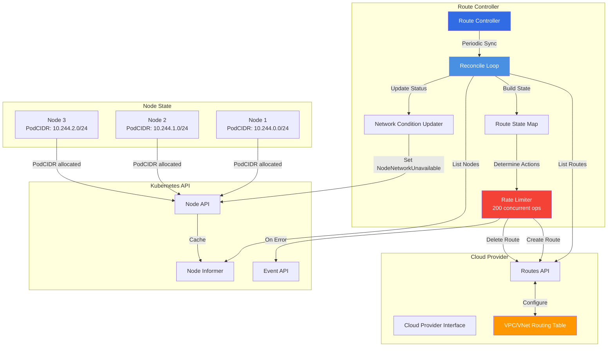
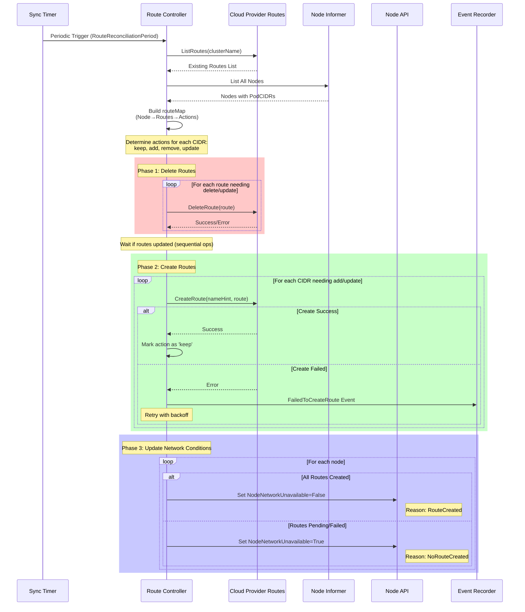
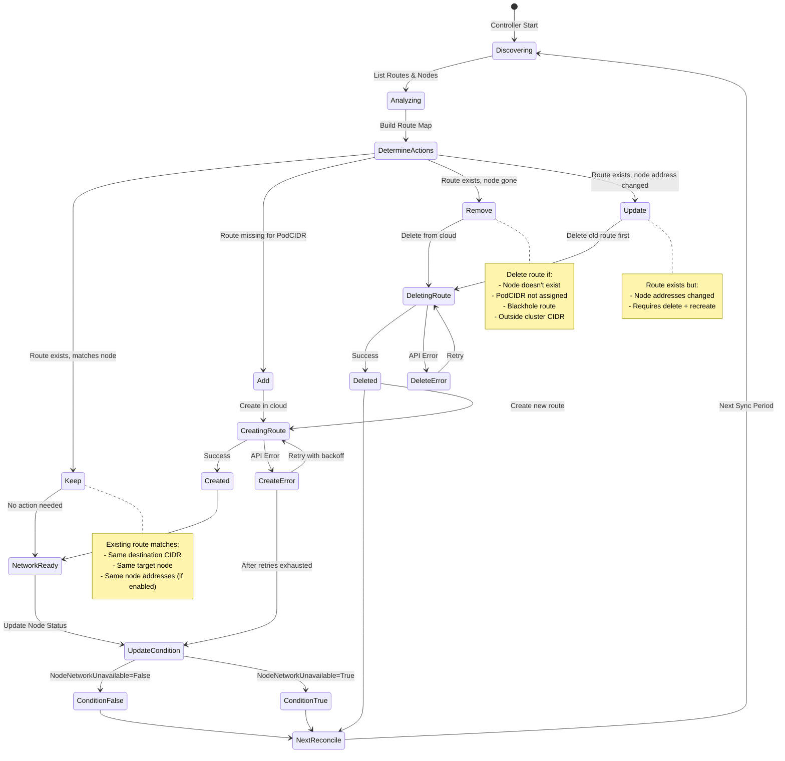
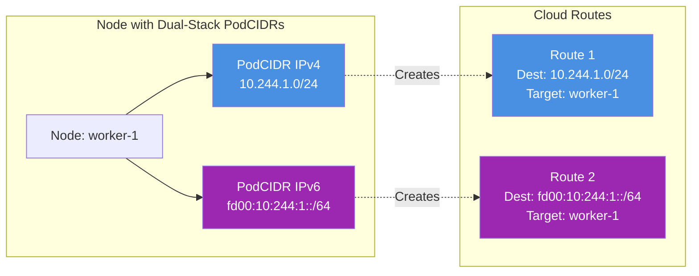
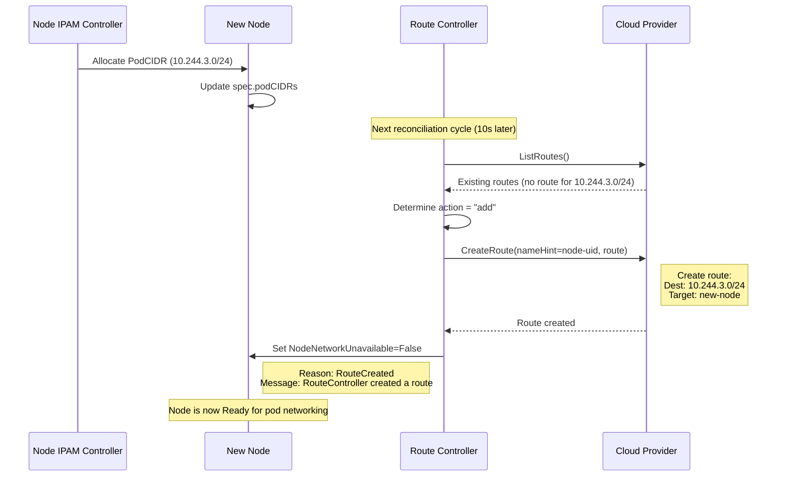
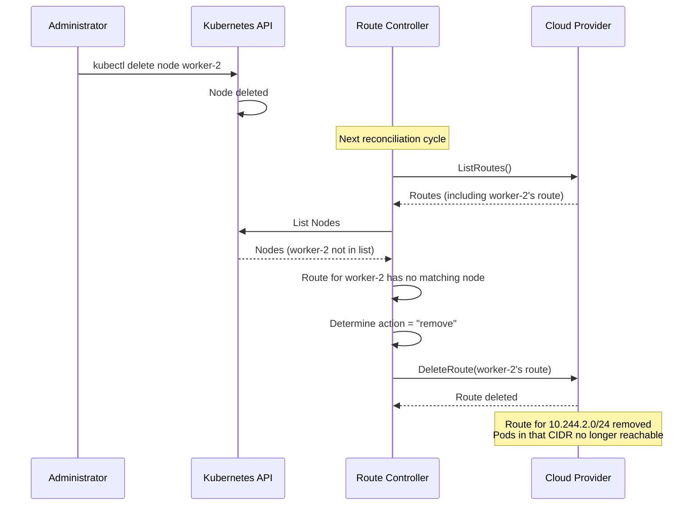
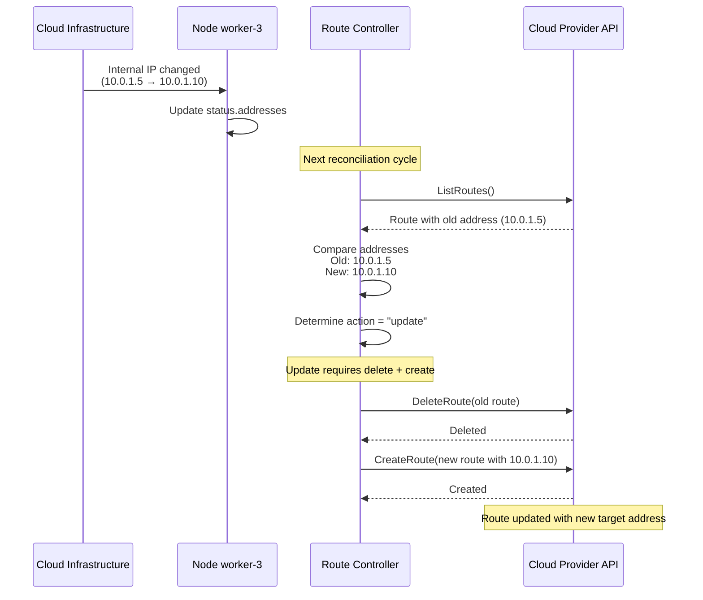
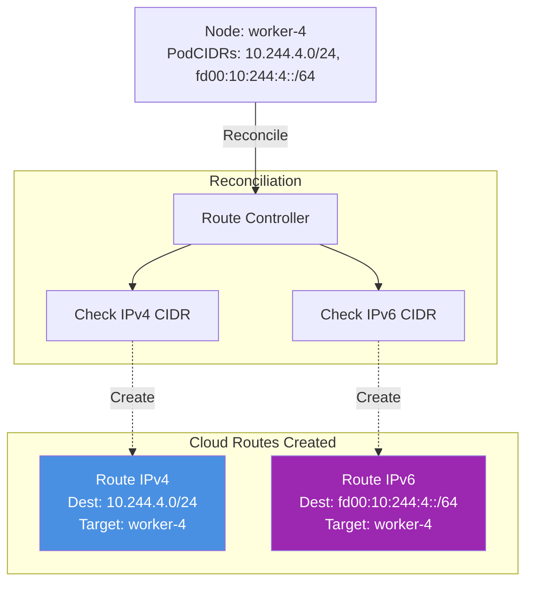

# Cloud Route Controller

## Overview

The Cloud Route Controller is a critical component of cloud-based Kubernetes clusters responsible for configuring cloud provider routing rules that enable pod-to-pod communication across different nodes. It creates and manages route entries in the cloud provider's routing infrastructure (VPC/VNet routing tables) to ensure that pods can communicate with each other regardless of which node they're running on.

**Primary Location**: `staging/src/k8s.io/cloud-provider/controllers/route/`

**Key Responsibilities**:
- Create cloud provider routes for each node's pod CIDR
- Reconcile route state with node allocations
- Update routes when node addresses change
- Delete stale routes for removed nodes or CIDRs
- Manage NodeNetworkUnavailable condition
- Support dual-stack networking (IPv4 + IPv6)

## Architecture

### High-Level Architecture



### Component Interactions



## Route State Machine

### Route Lifecycle States



## Core Data Structures

### Route Controller Structure

```go
// Location: staging/src/k8s.io/cloud-provider/controllers/route/route_controller.go:61-70

type RouteController struct {
    routes           cloudprovider.Routes       // Cloud provider routes interface
    kubeClient       clientset.Interface        // Kubernetes API client
    clusterName      string                     // Cluster identifier
    clusterCIDRs     []*net.IPNet              // Managed cluster CIDRs (1-2 for dual-stack)
    nodeLister       corelisters.NodeLister     // Node lister from informer
    nodeListerSynced cache.InformerSynced       // Informer sync status
    broadcaster      record.EventBroadcaster    // Event broadcaster
    recorder         record.EventRecorder       // Event recorder
}
```

### Route Structure

```go
// Location: staging/src/k8s.io/cloud-provider/cloud.go:226-243

type Route struct {
    // Name is the name of the routing rule in the cloud-provider.
    // It will be ignored in a Create (although nameHint may influence it)
    Name string

    // TargetNode is the NodeName of the target instance.
    TargetNode types.NodeName

    // EnableNodeAddresses is a feature gate for TargetNodeAddresses. If false, ignore TargetNodeAddresses.
    // Without this, if users haven't updated their cloud-provider, reconcile() will delete and create same route every time.
    EnableNodeAddresses bool

    // TargetNodeAddresses are the Node IPs of the target Node.
    TargetNodeAddresses []v1.NodeAddress

    // DestinationCIDR is the CIDR format IP range that this routing rule
    // applies to.
    DestinationCIDR string

    // Blackhole is set to true if this is a blackhole route
    // The node controller will delete the route if it is in the managed range.
    Blackhole bool
}
```

### Route Action Types

```go
// Location: staging/src/k8s.io/cloud-provider/controllers/route/route_controller.go:137-144

type routeAction string

var (
    keep   routeAction = "keep"     // Route is correct, no action
    add    routeAction = "add"      // Route needs to be created
    remove routeAction = "remove"   // Route should be deleted
    update routeAction = "update"   // Route exists but needs updating (delete + create)
)
```

### Internal Route Node State

```go
// Location: staging/src/k8s.io/cloud-provider/controllers/route/route_controller.go:146-151

type routeNode struct {
    name            types.NodeName              // Node name
    addrs           []v1.NodeAddress            // Current node addresses
    routes          []*cloudprovider.Route      // Routes associated with this node
    cidrWithActions *map[string]routeAction     // Map of CIDR → action to take
}
```

### Cloud Provider Routes Interface

```go
// Location: staging/src/k8s.io/cloud-provider/cloud.go:245-256

type Routes interface {
    // ListRoutes lists all managed routes that belong to the specified clusterName
    ListRoutes(ctx context.Context, clusterName string) ([]*Route, error)

    // CreateRoute creates the described managed route
    // route.Name will be ignored, although the cloud-provider may use nameHint
    // to create a more user-meaningful name.
    CreateRoute(ctx context.Context, clusterName string, nameHint string, route *Route) error

    // DeleteRoute deletes the specified managed route
    // Route should be as returned by ListRoutes
    DeleteRoute(ctx context.Context, clusterName string, route *Route) error
}
```

## Key Operations

### 1. Controller Initialization

```go
// Location: staging/src/k8s.io/cloud-provider/controllers/route/route_controller.go:72-87

func New(routes cloudprovider.Routes, kubeClient clientset.Interface,
    nodeInformer coreinformers.NodeInformer, clusterName string,
    clusterCIDRs []*net.IPNet) *RouteController {

    if len(clusterCIDRs) == 0 {
        klog.Fatal("RouteController: Must specify clusterCIDR.")
    }

    rc := &RouteController{
        routes:           routes,
        kubeClient:       kubeClient,
        clusterName:      clusterName,
        clusterCIDRs:     clusterCIDRs,
        nodeLister:       nodeInformer.Lister(),
        nodeListerSynced: nodeInformer.Informer().HasSynced,
    }

    return rc
}
```

**Initialization Requirements**:
- Cloud provider must support Routes interface
- ClusterCIDR must be specified (1 or 2 for dual-stack)
- Node informer must be provided
- Cluster name required for cloud provider routing tables

### 2. Main Control Loop

```go
// Location: staging/src/k8s.io/cloud-provider/controllers/route/route_controller.go:89-123

func (rc *RouteController) Run(ctx context.Context, syncPeriod time.Duration,
    controllerManagerMetrics *controllersmetrics.ControllerManagerMetrics) {

    defer utilruntime.HandleCrash()

    rc.broadcaster = record.NewBroadcaster(record.WithContext(ctx))
    rc.recorder = rc.broadcaster.NewRecorder(scheme.Scheme,
        v1.EventSource{Component: "route_controller"})

    // Start event processing pipeline
    if rc.broadcaster != nil {
        rc.broadcaster.StartStructuredLogging(0)
        rc.broadcaster.StartRecordingToSink(&v1core.EventSinkImpl{
            Interface: rc.kubeClient.CoreV1().Events("")})
        defer rc.broadcaster.Shutdown()
    }

    klog.Info("Starting route controller")
    defer klog.Info("Shutting down route controller")
    controllerManagerMetrics.ControllerStarted("route")
    defer controllerManagerMetrics.ControllerStopped("route")

    if !cache.WaitForNamedCacheSyncWithContext(ctx, rc.nodeListerSynced) {
        return
    }

    // TODO: If we do just the full Resync every 5 minutes (default value)
    // that means that we may wait up to 5 minutes before even starting
    // creating a route for it. This is bad.
    // We should have a watch on node and if we observe a new node (with CIDR?)
    // trigger reconciliation for that node.
    go wait.NonSlidingUntil(func() {
        if err := rc.reconcileNodeRoutes(ctx); err != nil {
            klog.Errorf("Couldn't reconcile node routes: %v", err)
        }
    }, syncPeriod, ctx.Done())

    <-ctx.Done()
}
```

**Control Loop Characteristics**:
- Periodic reconciliation (default: 5 minutes, configurable via --route-reconciliation-period)
- Full reconciliation each cycle (not event-driven currently)
- Waits for node informer to sync before starting
- Uses NonSlidingUntil (fixed interval, not affected by reconciliation duration)

**Known Limitation**: Currently uses periodic reconciliation instead of watch-based triggering. This means new nodes may wait up to the full sync period before routes are created.

### 3. Route Reconciliation Algorithm

```go
// Location: staging/src/k8s.io/cloud-provider/controllers/route/route_controller.go:153-371

func (rc *RouteController) reconcile(ctx context.Context, nodes []*v1.Node,
    routes []*cloudprovider.Route) error {

    var l sync.Mutex
    // routeMap includes info about a target Node and its addresses, routes and a map between Pod CIDRs and actions.
    // If action is add/remove, the route will be added/removed.
    // If action is keep, the route will not be touched.
    // If action is update, the route will be deleted and then added.
    routeMap := make(map[types.NodeName]routeNode)

    // Phase 1: Put current routes into routeMap
    for _, route := range routes {
        if route.TargetNode == "" {
            continue
        }
        rn, ok := routeMap[route.TargetNode]
        if !ok {
            rn = routeNode{
                name:            route.TargetNode,
                addrs:           []v1.NodeAddress{},
                routes:          []*cloudprovider.Route{},
                cidrWithActions: &map[string]routeAction{},
            }
        } else if rn.routes == nil {
            rn.routes = []*cloudprovider.Route{}
        }
        rn.routes = append(rn.routes, route)
        routeMap[route.TargetNode] = rn
    }

    wg := sync.WaitGroup{}
    rateLimiter := make(chan struct{}, maxConcurrentRouteOperations) // 200

    // Phase 2: Check Nodes and their Pod CIDRs, determine actions
    for _, node := range nodes {
        // Skip if the node hasn't been assigned a CIDR yet
        if len(node.Spec.PodCIDRs) == 0 {
            continue
        }
        nodeName := types.NodeName(node.Name)
        l.Lock()
        rn, ok := routeMap[nodeName]
        if !ok {
            rn = routeNode{
                name:            nodeName,
                addrs:           []v1.NodeAddress{},
                routes:          []*cloudprovider.Route{},
                cidrWithActions: &map[string]routeAction{},
            }
        }
        rn.addrs = node.Status.Addresses
        routeMap[nodeName] = rn
        l.Unlock()

        // For every node, for every CIDR
        for _, podCIDR := range node.Spec.PodCIDRs {
            l.Lock()
            action := getRouteAction(rn.routes, podCIDR, nodeName, node.Status.Addresses)
            (*routeMap[nodeName].cidrWithActions)[podCIDR] = action
            l.Unlock()
            klog.Infof("action for Node %q with CIDR %q: %q", nodeName, podCIDR, action)
        }
    }

    // Phase 3: Delete routes that are not in use or need to be updated
    for _, route := range routes {
        if !rc.isResponsibleForRoute(route) {
            continue
        }
        // Check if this route is a blackhole, or applies to a node we know about & CIDR status is created
        if route.Blackhole || shouldDeleteRoute(route.TargetNode, route.DestinationCIDR) {
            wg.Add(1)
            go func(route *cloudprovider.Route, startTime time.Time) {
                defer wg.Done()
                rateLimiter <- struct{}{}  // Acquire rate limit token
                klog.Infof("Deleting route %s %s", route.Name, route.DestinationCIDR)
                if err := rc.routes.DeleteRoute(ctx, rc.clusterName, route); err != nil {
                    klog.Errorf("Could not delete route %s %s after %v: %v",
                        route.Name, route.DestinationCIDR, time.Since(startTime), err)
                } else {
                    klog.Infof("Deleted route %s %s after %v",
                        route.Name, route.DestinationCIDR, time.Since(startTime))
                }
                <-rateLimiter  // Release rate limit token
            }(route, time.Now())
        }
    }

    // Wait for deletes if EnableNodeAddresses is true (avoid race with creates)
    if len(routes) != 0 && routes[0].EnableNodeAddresses {
        wg.Wait()
    }

    // Phase 4: Create new routes or update existing ones
    for _, node := range nodes {
        if len(node.Spec.PodCIDRs) == 0 {
            continue
        }
        nodeName := types.NodeName(node.Name)

        for _, podCIDR := range node.Spec.PodCIDRs {
            l.Lock()
            action := (*routeMap[nodeName].cidrWithActions)[podCIDR]
            l.Unlock()
            if action == keep || action == remove {
                continue
            }

            route := &cloudprovider.Route{
                TargetNode:          nodeName,
                TargetNodeAddresses: node.Status.Addresses,
                DestinationCIDR:     podCIDR,
            }
            klog.Infof("route spec to be created: %v", route)
            nameHint := string(node.UID)
            wg.Add(1)
            go func(nodeName types.NodeName, nameHint string, route *cloudprovider.Route) {
                defer wg.Done()
                err := clientretry.RetryOnConflict(updateNetworkConditionBackoff, func() error {
                    startTime := time.Now()
                    rateLimiter <- struct{}{}
                    klog.Infof("Creating route for node %s %s with hint %s, throttled %v",
                        nodeName, route.DestinationCIDR, nameHint, time.Since(startTime))
                    err := rc.routes.CreateRoute(ctx, rc.clusterName, nameHint, route)
                    <-rateLimiter
                    if err != nil {
                        msg := fmt.Sprintf("Could not create route %s %s for node %s after %v: %v",
                            nameHint, route.DestinationCIDR, nodeName, time.Since(startTime), err)
                        if rc.recorder != nil {
                            rc.recorder.Eventf(&v1.ObjectReference{
                                Kind: "Node", Name: string(nodeName),
                                UID: types.UID(nodeName), Namespace: "",
                            }, v1.EventTypeWarning, "FailedToCreateRoute", msg)
                            klog.V(4).Info(msg)
                            return err
                        }
                    }
                    l.Lock()
                    (*routeMap[nodeName].cidrWithActions)[route.DestinationCIDR] = keep
                    l.Unlock()
                    klog.Infof("Created route for node %s %s with hint %s after %v",
                        nodeName, route.DestinationCIDR, nameHint, time.Since(startTime))
                    return nil
                })
                if err != nil {
                    klog.Errorf("Could not create route %s %s for node %s: %v",
                        nameHint, route.DestinationCIDR, nodeName, err)
                }
            }(nodeName, nameHint, route)
        }
    }
    wg.Wait()

    // Phase 5: Update all nodes' NodeNetworkUnavailable status
    for _, node := range nodes {
        actions := routeMap[types.NodeName(node.Name)].cidrWithActions
        if actions == nil {
            continue
        }

        wg.Add(1)
        if len(*actions) == 0 {
            go func(n *v1.Node) {
                defer wg.Done()
                klog.Infof("node %v has no routes assigned to it. NodeNetworkUnavailable will be set to true", n.Name)
                if err := rc.updateNetworkingCondition(n, false); err != nil {
                    klog.Errorf("failed to update networking condition when no actions: %v", err)
                }
            }(node)
            continue
        }

        // Check if all route actions were done
        allRoutesCreated := true
        for _, action := range *actions {
            if action == add || action == update {
                allRoutesCreated = false
                break
            }
        }
        go func(n *v1.Node) {
            defer wg.Done()
            if err := rc.updateNetworkingCondition(n, allRoutesCreated); err != nil {
                klog.Errorf("failed to update networking condition: %v", err)
            }
        }(node)
    }
    wg.Wait()
    return nil
}
```

**Reconciliation Algorithm Summary**:

1. **Build Route Map**: Index existing cloud routes by target node
2. **Determine Actions**: For each node+CIDR, decide: keep/add/remove/update
3. **Delete Phase**: Remove blackhole routes, stale routes, routes needing update
4. **Create Phase**: Add missing routes, recreate updated routes
5. **Status Update**: Set NodeNetworkUnavailable based on route creation success

**Concurrency Control**:
- Rate limiter: Max 200 concurrent cloud API operations
- Mutex protection for shared routeMap
- WaitGroup for synchronization between phases
- Sequential operation (delete then create) when EnableNodeAddresses=true

### 4. Route Action Determination

```go
// Location: staging/src/k8s.io/cloud-provider/controllers/route/route_controller.go:446-457

func getRouteAction(routes []*cloudprovider.Route, cidr string, nodeName types.NodeName,
    realNodeAddrs []v1.NodeAddress) routeAction {

    for _, route := range routes {
        if route.DestinationCIDR == cidr {
            if !route.EnableNodeAddresses || equalNodeAddrs(realNodeAddrs, route.TargetNodeAddresses) {
                return keep
            }
            klog.Infof("Node addresses have changed from %v to %v", route.TargetNodeAddresses, realNodeAddrs)
            return update
        }
    }
    return add
}
```

**Action Logic**:
- **keep**: Route exists with matching CIDR and node addresses
- **update**: Route exists but node addresses changed (requires delete + recreate)
- **add**: No route exists for this CIDR

### 5. Route Responsibility Check

```go
// Location: staging/src/k8s.io/cloud-provider/controllers/route/route_controller.go:424-443

func (rc *RouteController) isResponsibleForRoute(route *cloudprovider.Route) bool {
    _, cidr, err := netutils.ParseCIDRSloppy(route.DestinationCIDR)
    if err != nil {
        klog.Errorf("Ignoring route %s, unparsable CIDR: %v", route.Name, err)
        return false
    }

    // Not responsible if this route's CIDR is not within our clusterCIDR
    lastIP := make([]byte, len(cidr.IP))
    for i := range lastIP {
        lastIP[i] = cidr.IP[i] | ^cidr.Mask[i]
    }

    // Check across all cluster CIDRs
    for _, clusterCIDR := range rc.clusterCIDRs {
        if clusterCIDR.Contains(cidr.IP) || clusterCIDR.Contains(lastIP) {
            return true
        }
    }
    return false
}
```

**Responsibility Check**:
- Controller only manages routes within configured clusterCIDRs
- Checks if route's destination CIDR overlaps with cluster CIDRs
- Prevents interference with other routing rules in the cloud

### 6. Network Condition Update

```go
// Location: staging/src/k8s.io/cloud-provider/controllers/route/route_controller.go:373-422

func (rc *RouteController) updateNetworkingCondition(node *v1.Node, routesCreated bool) error {
    _, condition := nodeutil.GetNodeCondition(&(node.Status), v1.NodeNetworkUnavailable)

    // Skip if condition already matches desired state
    if routesCreated && condition != nil && condition.Status == v1.ConditionFalse {
        klog.V(2).Infof("set node %v with NodeNetworkUnavailable=false was canceled because it is already set", node.Name)
        return nil
    }

    if !routesCreated && condition != nil && condition.Status == v1.ConditionTrue {
        klog.V(2).Infof("set node %v with NodeNetworkUnavailable=true was canceled because it is already set", node.Name)
        return nil
    }

    klog.Infof("Patching node status %v with %v previous condition was:%+v", node.Name, routesCreated, condition)

    err := clientretry.RetryOnConflict(updateNetworkConditionBackoff, func() error {
        var err error
        currentTime := metav1.Now()
        if routesCreated {
            err = nodeutil.SetNodeCondition(rc.kubeClient, types.NodeName(node.Name), v1.NodeCondition{
                Type:               v1.NodeNetworkUnavailable,
                Status:             v1.ConditionFalse,
                Reason:             "RouteCreated",
                Message:            "RouteController created a route",
                LastTransitionTime: currentTime,
            })
        } else {
            err = nodeutil.SetNodeCondition(rc.kubeClient, types.NodeName(node.Name), v1.NodeCondition{
                Type:               v1.NodeNetworkUnavailable,
                Status:             v1.ConditionTrue,
                Reason:             "NoRouteCreated",
                Message:            "RouteController failed to create a route",
                LastTransitionTime: currentTime,
            })
        }
        if err != nil {
            klog.V(4).Infof("Error updating node %s, retrying: %v", types.NodeName(node.Name), err)
        }
        return err
    })

    if err != nil {
        klog.Errorf("Error updating node %s: %v", node.Name, err)
    }

    return err
}
```

**Network Condition Management**:
- Sets `NodeNetworkUnavailable` condition on each node
- `False` (Ready): Routes successfully created
- `True` (Not Ready): Routes failed to create or node has no routes
- Uses retry with exponential backoff for API conflicts
- Skips update if condition already matches desired state

## Controller Startup

### Initialization in Cloud Controller Manager

```go
// Location: staging/src/k8s.io/cloud-provider/app/core.go:102-141

func startRouteController(ctx context.Context,
    initContext ControllerInitContext,
    controlexContext controllermanagerapp.ControllerContext,
    completedConfig *config.CompletedConfig,
    cloud cloudprovider.Interface) (controller.Interface, bool, error) {

    if !completedConfig.ComponentConfig.KubeCloudShared.ConfigureCloudRoutes {
        klog.Infof("Will not configure cloud provider routes, --configure-cloud-routes: %v",
            completedConfig.ComponentConfig.KubeCloudShared.ConfigureCloudRoutes)
        return nil, false, nil
    }

    // If CIDRs should be allocated for pods and set on the CloudProvider, then start the route controller
    routes, ok := cloud.Routes()
    if !ok {
        klog.Warning("--configure-cloud-routes is set, but cloud provider does not support routes. Will not configure cloud provider routes.")
        return nil, false, nil
    }

    // Parse and validate cluster CIDRs
    clusterCIDRs, dualStack, err := processCIDRs(completedConfig.ComponentConfig.KubeCloudShared.ClusterCIDR)
    if err != nil {
        return nil, false, err
    }

    // Validate dual-stack configuration
    if len(clusterCIDRs) > 1 && !dualStack {
        return nil, false, fmt.Errorf("len of ClusterCIDRs==%v and they are not configured as dual stack (at least one from each IPFamily", len(clusterCIDRs))
    }

    // Maximum 2 CIDRs allowed (IPv4 + IPv6)
    if len(clusterCIDRs) > 2 {
        return nil, false, fmt.Errorf("length of clusterCIDRs is:%v more than max allowed of 2", len(clusterCIDRs))
    }

    routeController := routecontroller.New(
        routes,
        completedConfig.ClientBuilder.ClientOrDie(initContext.ClientName),
        completedConfig.SharedInformers.Core().V1().Nodes(),
        completedConfig.ComponentConfig.KubeCloudShared.ClusterName,
        clusterCIDRs,
    )
    go routeController.Run(ctx,
        completedConfig.ComponentConfig.KubeCloudShared.RouteReconciliationPeriod.Duration,
        controlexContext.ControllerManagerMetrics)

    return nil, true, nil
}
```

**Startup Validation**:
1. Check `--configure-cloud-routes` flag is enabled
2. Verify cloud provider supports Routes() interface
3. Parse and validate cluster CIDR configuration
4. Ensure dual-stack CIDRs are properly configured (one from each IP family)
5. Limit to maximum 2 CIDRs (IPv4 + IPv6)
6. Create and start controller

## Configuration

### Command-Line Flags

```go
// Location: staging/src/k8s.io/cloud-provider/options/kubecloudshared.go

--configure-cloud-routes bool
    Should CIDRs allocated by allocate-node-cidrs be configured on the cloud provider.
    Default: true

--cluster-cidr string
    CIDR Range for Pods in cluster. Only used when --allocate-node-cidrs=true;
    if false, this option will be ignored.
    Example: "10.244.0.0/16" or "10.244.0.0/16,fd00:10:244::/56" (dual-stack)

--route-reconciliation-period duration
    The period for reconciling routes created for Nodes by cloud provider.
    Default: 10s

--cluster-name string
    The instance prefix for the cluster.
    Required for cloud provider routing table identification.
```

### Rate Limiting Configuration

```go
// Location: staging/src/k8s.io/cloud-provider/controllers/route/route_controller.go:50-59

const (
    // Maximal number of concurrent route operation API calls.
    // TODO: This should be per-provider.
    maxConcurrentRouteOperations int = 200
)

var updateNetworkConditionBackoff = wait.Backoff{
    Steps:    5,                     // Maximum 5 retries
    Duration: 100 * time.Millisecond, // Initial delay
    Jitter:   1.0,                   // Full jitter
}
```

### Example Configuration

```yaml
apiVersion: v1
kind: ConfigMap
metadata:
  name: cloud-controller-manager-config
  namespace: kube-system
data:
  # Enable route configuration
  configure-cloud-routes: "true"

  # Single-stack IPv4
  cluster-cidr: "10.244.0.0/16"

  # Dual-stack
  # cluster-cidr: "10.244.0.0/16,fd00:10:244::/56"

  # Reconciliation frequency
  route-reconciliation-period: "10s"

  # Cluster identifier
  cluster-name: "my-kubernetes-cluster"
```

## Dual-Stack Networking Support

### Dual-Stack Route Configuration



**Dual-Stack Handling**:
- Controller processes each PodCIDR independently
- Creates separate routes for IPv4 and IPv6
- Uses same target node for both routes
- Name hint (node UID) allows cloud providers to differentiate routes

### Validation Requirements

```go
// Dual-stack requirements:
// 1. Exactly 2 CIDRs
// 2. One from each IP family (IPv4 + IPv6)
// 3. Both CIDRs must be valid

// Valid dual-stack examples:
clusterCIDR: "10.244.0.0/16,fd00:10:244::/56"
clusterCIDR: "192.168.0.0/16,2001:db8::/32"

// Invalid configurations:
clusterCIDR: "10.244.0.0/16,10.245.0.0/16"  // Both IPv4
clusterCIDR: "fd00:1::/56,fd00:2::/56"      // Both IPv6
clusterCIDR: "10.0.0.0/8,10.1.0.0/8,fd00::/56"  // More than 2
```

## Cloud Provider Integration

### Routes Interface Requirements

Cloud providers must implement the Routes interface to support the route controller:

```go
type Routes interface {
    ListRoutes(ctx context.Context, clusterName string) ([]*Route, error)
    CreateRoute(ctx context.Context, clusterName string, nameHint string, route *Route) error
    DeleteRoute(ctx context.Context, clusterName string, route *Route) error
}
```

### Example Cloud Provider Implementations

**AWS**:
- Routes are entries in VPC route tables
- DestinationCIDR → target instance ID
- ClusterName used to identify route table

**GCE**:
- Routes are GCE route resources
- DestinationCIDR → target instance
- Routes tagged with cluster name

**Azure**:
- Routes are entries in UDR (User Defined Route) tables
- DestinationCIDR → target VM NIC
- Route table associated with subnet

### Node Address Handling

```go
// EnableNodeAddresses feature allows tracking node address changes
route := &cloudprovider.Route{
    Name:                "route-name",
    TargetNode:          "worker-1",
    EnableNodeAddresses: true,  // Enable address tracking
    TargetNodeAddresses: []v1.NodeAddress{
        {Type: v1.NodeInternalIP, Address: "10.0.1.5"},
        {Type: v1.NodeExternalIP, Address: "203.0.113.10"},
    },
    DestinationCIDR:     "10.244.1.0/24",
    Blackhole:           false,
}
```

**When EnableNodeAddresses=true**:
- Controller compares node addresses when determining if route needs update
- If addresses change, route is deleted and recreated
- Prevents churn when cloud provider doesn't track node addresses

**When EnableNodeAddresses=false**:
- Node address changes are ignored
- Route kept as long as CIDR matches
- Backward compatibility with older cloud providers

## Common Scenarios

### Scenario 1: New Node Added to Cluster



**Timeline**:
1. T+0s: Node joins cluster, IPAM controller allocates PodCIDR
2. T+0-10s: Waiting for next route reconciliation
3. T+10s: Route controller creates cloud route
4. T+10s: NodeNetworkUnavailable set to False
5. T+10s: Pods can be scheduled and communicate

**Improvement Opportunity**: Current implementation uses periodic reconciliation. Future versions could use event-driven triggers to reduce latency.

### Scenario 2: Node Deleted from Cluster



### Scenario 3: Node Address Changes



**Note**: This scenario only occurs when `EnableNodeAddresses=true` in the route object.

### Scenario 4: Dual-Stack Node



**Dual-Stack Workflow**:
1. Node allocated both IPv4 and IPv6 PodCIDRs
2. Route controller processes each CIDR independently
3. Two routes created (one for each CIDR)
4. Both routes point to same target node
5. NodeNetworkUnavailable=False when both routes created successfully

## Performance Considerations

### Scalability Analysis

**Time Complexity**:
- ListRoutes: O(n) where n = number of routes
- Per reconciliation:
  - Build route map: O(r) where r = number of routes
  - Process nodes: O(n × c) where n = nodes, c = CIDRs per node (typically 1-2)
  - Route operations: O(changes) with 200 concurrent operations max

**API Call Optimization**:
```
Reconciliation API calls:
- 1 × ListRoutes (gets all routes)
- 1 × List Nodes (from informer cache, not API call)
- d × DeleteRoute (d = routes to delete)
- c × CreateRoute (c = routes to create)

Total cloud API calls = 1 + d + c
```

**Concurrency**:
- Max 200 concurrent cloud API operations
- Independent goroutines for each route operation
- Rate limiter prevents overwhelming cloud provider API

### Recommended Settings by Cluster Size

| Cluster Size | route-reconciliation-period | Expected Churn |
|--------------|----------------------------|----------------|
| < 50 nodes | 10s (default) | Low |
| 50-200 nodes | 30s | Medium |
| 200-1000 nodes | 60s | Medium-High |
| 1000+ nodes | 120s | High |

**Factors to Consider**:
- **Node churn rate**: Higher churn → shorter period for faster route creation
- **Cloud API rate limits**: Longer period reduces API load
- **Network partition tolerance**: Shorter period detects issues faster
- **Cost**: More frequent reconciliation = more API calls = potentially higher cost

### Rate Limiting

```go
const maxConcurrentRouteOperations int = 200
```

**Rate Limiter Behavior**:
- Buffered channel with 200 capacity
- Each route operation acquires token before cloud API call
- Releases token after operation completes
- Prevents overloading cloud provider APIs
- Protects against rate limit errors

**Tuning Recommendations**:
- Default (200) suitable for most clouds
- Reduce if cloud provider has strict rate limits
- Increase for clouds with high rate limits and large clusters
- Monitor cloud provider API metrics for throttling

## Troubleshooting Guide

### Problem: Routes Not Created for New Nodes

**Symptoms**:
- New nodes stuck with `NodeNetworkUnavailable=True`
- Pods cannot be scheduled (or schedule but can't communicate)
- No routes visible in cloud provider console

**Diagnostic Steps**:
```bash
# 1. Check node PodCIDR assignment
kubectl get nodes -o custom-columns=NAME:.metadata.name,POD-CIDR:.spec.podCIDRs

# 2. Check NodeNetworkUnavailable condition
kubectl get nodes -o jsonpath='{range .items[*]}{.metadata.name}{"\t"}{.status.conditions[?(@.type=="NetworkUnavailable")].status}{"\n"}{end}'

# 3. Check route controller logs
kubectl logs -n kube-system <cloud-controller-manager-pod> | grep route

# 4. Check for route controller errors
kubectl logs -n kube-system <cloud-controller-manager-pod> | grep -i "route.*error"

# 5. Verify cloud provider supports routes
kubectl logs -n kube-system <cloud-controller-manager-pod> | grep "does not support routes"
```

**Common Causes**:
1. **PodCIDR not assigned**: Node IPAM controller not allocating CIDRs
2. **Cloud provider doesn't support Routes()**: Check cloud provider implementation
3. **--configure-cloud-routes=false**: Flag disabled
4. **Cloud API errors**: Permissions, rate limiting, or API failures
5. **Cluster CIDR mismatch**: Route outside configured cluster CIDR

**Solutions**:
```bash
# Enable route configuration
--configure-cloud-routes=true

# Verify cluster CIDR includes node PodCIDRs
--cluster-cidr=10.244.0.0/16

# Check cloud provider permissions (example for AWS)
# Ensure IAM role has ec2:CreateRoute, ec2:DeleteRoute, ec2:DescribeRouteTables

# Manually trigger reconciliation (restart cloud controller manager)
kubectl rollout restart deployment cloud-controller-manager -n kube-system
```

### Problem: Routes Not Deleted for Removed Nodes

**Symptoms**:
- Stale routes remain in cloud provider
- Unnecessary cloud costs
- Potential IP address conflicts

**Diagnostic Steps**:
```bash
# 1. List current nodes
kubectl get nodes

# 2. Check cloud provider routes
# (Example for AWS)
aws ec2 describe-route-tables --filters "Name=tag:kubernetes.io/cluster/my-cluster,Values=owned"

# 3. Compare routes with nodes
# Look for routes to deleted nodes

# 4. Check route controller reconciliation
kubectl logs -n kube-system <cloud-controller-manager-pod> | grep "Deleting route"
```

**Common Causes**:
1. **Route controller not running**: Cloud controller manager down
2. **Outside cluster CIDR**: Route not in managed CIDR range
3. **Cloud API errors**: Deletion failures
4. **Reconciliation period too long**: Routes not cleaned up yet

**Solutions**:
```bash
# Verify route controller is running
kubectl get pods -n kube-system -l component=cloud-controller-manager

# Check deletion errors in logs
kubectl logs -n kube-system <cloud-controller-manager-pod> | grep "Could not delete route"

# Manually delete stale route (if necessary)
# AWS example:
aws ec2 delete-route --route-table-id rtb-xxx --destination-cidr-block 10.244.X.0/24

# Reduce reconciliation period for faster cleanup
--route-reconciliation-period=30s
```

### Problem: NodeNetworkUnavailable Always True

**Symptoms**:
- Nodes have routes created but condition stays True
- Pods can communicate but node shows as Not Ready
- Route controller logs show successful creation

**Diagnostic Steps**:
```bash
# 1. Check exact condition
kubectl get node <node-name> -o jsonpath='{.status.conditions[?(@.type=="NetworkUnavailable")]}'

# 2. Check route controller logs for condition updates
kubectl logs -n kube-system <cloud-controller-manager-pod> | grep "Patching node status"

# 3. Verify routes exist in cloud
# (Check cloud provider console or CLI)

# 4. Check for RBAC issues
kubectl auth can-i patch nodes --as=system:serviceaccount:kube-system:cloud-controller-manager
```

**Common Causes**:
1. **RBAC insufficient**: Can't patch node status
2. **Condition update failures**: API conflicts or errors
3. **Route creation reported success but actually failed**: Cloud provider API issue
4. **Multiple reconciliations conflicting**: Race condition

**Solutions**:
```yaml
# Ensure RBAC permissions
apiVersion: rbac.authorization.k8s.io/v1
kind: ClusterRole
metadata:
  name: system:cloud-controller-manager
rules:
- apiGroups: [""]
  resources: ["nodes"]
  verbs: ["get", "list", "watch", "patch"]
- apiGroups: [""]
  resources: ["nodes/status"]
  verbs: ["patch"]
```

```bash
# Check for conflicts in logs
kubectl logs -n kube-system <cloud-controller-manager-pod> | grep "conflict"

# Manually clear condition (temporary workaround)
kubectl patch node <node-name> --type json -p '[{"op":"remove","path":"/status/conditions/X"}]'
# (where X is index of NetworkUnavailable condition)
```

### Problem: High Cloud API Usage / Rate Limiting

**Symptoms**:
- Cloud provider API rate limit errors
- High cloud costs for API calls
- Route controller logs show throttling errors

**Diagnostic Steps**:
```bash
# 1. Check for rate limit errors
kubectl logs -n kube-system <cloud-controller-manager-pod> | grep -i "rate\|throttle\|limit"

# 2. Monitor API call frequency
# (Use cloud provider monitoring, e.g., AWS CloudWatch)

# 3. Check reconciliation period
kubectl get pod <cloud-controller-manager-pod> -n kube-system -o jsonpath='{.spec.containers[0].args}' | grep route-reconciliation-period

# 4. Count current routes
# AWS example:
aws ec2 describe-route-tables --query 'RouteTables[*].Routes[*]' | grep -c "10.244"
```

**Common Causes**:
1. **Reconciliation period too short**: Excessive full reconciliations
2. **Large cluster**: Many routes to manage
3. **Route churn**: Frequent node additions/deletions
4. **Cloud provider API limits**: Conservative rate limits

**Solutions**:
```bash
# Increase reconciliation period
--route-reconciliation-period=60s  # or 120s for very large clusters

# Monitor and optimize
# - Reduce node churn if possible
# - Use cluster autoscaler with longer stabilization windows
# - Consider batching node additions

# Request higher API limits from cloud provider
# (If needed for large-scale operations)
```

### Problem: Dual-Stack Routes Not Working

**Symptoms**:
- Only IPv4 or IPv6 routes created, not both
- Pods can't communicate on one IP family
- Route controller errors about CIDR validation

**Diagnostic Steps**:
```bash
# 1. Check node PodCIDRs
kubectl get nodes -o jsonpath='{range .items[*]}{.metadata.name}{"\t"}{.spec.podCIDRs}{"\n"}{end}'

# 2. Verify cluster CIDR configuration
kubectl get pod <cloud-controller-manager-pod> -n kube-system -o jsonpath='{.spec.containers[0].args}' | grep cluster-cidr

# 3. Check route controller validation errors
kubectl logs -n kube-system <cloud-controller-manager-pod> | grep -i "dual\|cidr"

# 4. List routes by IP family
# Check both IPv4 and IPv6 routes exist in cloud provider
```

**Common Causes**:
1. **Invalid dual-stack CIDR**: Both CIDRs same IP family
2. **More than 2 CIDRs**: Controller rejects > 2
3. **Cloud provider doesn't support IPv6 routes**: Implementation limitation
4. **PodCIDRs not allocated correctly**: Node IPAM issue

**Solutions**:
```bash
# Correct dual-stack configuration
--cluster-cidr=10.244.0.0/16,fd00:10:244::/56

# Verify IP families are different
# Use CIDR validation:
echo "10.244.0.0/16,fd00:10:244::/56" | grep -E '^([0-9.]+/[0-9]+),([0-9a-f:]+/[0-9]+)$'

# Check cloud provider IPv6 support
# AWS: Ensure VPC has IPv6 CIDR block
# GCE: Ensure network has IPv6 enabled
# Azure: Ensure VNet has IPv6 address space

# Restart cloud controller manager with correct config
kubectl set env deployment/cloud-controller-manager -n kube-system CLUSTER_CIDR="10.244.0.0/16,fd00:10:244::/56"
```

## Integration with Other Controllers

### Node IPAM Controller

**Relationship**:
- **Node IPAM Controller**: Allocates PodCIDRs to nodes
- **Route Controller**: Creates cloud routes for allocated CIDRs

**Workflow**:
1. Node IPAM allocates CIDR, sets `node.spec.podCIDRs`
2. Route controller detects CIDR in reconciliation
3. Route controller creates cloud route
4. Route controller updates `NodeNetworkUnavailable` condition

**Dependencies**:
- Route controller requires `node.spec.podCIDRs` to be set
- Both controllers must use same `--cluster-cidr`
- Both must agree on dual-stack configuration

### Kubelet

**Interaction**:
- Kubelet checks `NodeNetworkUnavailable` condition
- If True, kubelet may delay pod startup or mark node NotReady
- Route controller clears condition when routes created

### Cloud Node Controller

**Coordination**:
- **Cloud Node Controller**: Initializes node, sets provider ID and addresses
- **Route Controller**: Uses node addresses for route targeting

**Sequence**:
1. Cloud Node Controller creates node with addresses
2. Node IPAM allocates PodCIDR
3. Route Controller creates route using node addresses

### Scheduler

**Awareness**:
- Scheduler respects `NodeNetworkUnavailable` condition
- Pods requiring networking won't schedule to unavailable nodes
- Once routes created and condition cleared, pods can schedule

## Security Considerations

### RBAC Requirements

```yaml
apiVersion: rbac.authorization.k8s.io/v1
kind: ClusterRole
metadata:
  name: system:route-controller
rules:
# Node read access
- apiGroups: [""]
  resources: ["nodes"]
  verbs: ["get", "list", "watch"]

# Node status update for NetworkUnavailable condition
- apiGroups: [""]
  resources: ["nodes/status"]
  verbs: ["patch"]

# Event recording
- apiGroups: [""]
  resources: ["events"]
  verbs: ["create", "patch", "update"]
```

### Cloud Provider Permissions

**AWS Example**:
```json
{
  "Version": "2012-10-17",
  "Statement": [
    {
      "Effect": "Allow",
      "Action": [
        "ec2:DescribeRouteTables",
        "ec2:DescribeInstances",
        "ec2:CreateRoute",
        "ec2:DeleteRoute",
        "ec2:ReplaceRoute"
      ],
      "Resource": "*"
    }
  ]
}
```

**GCE Example**:
```yaml
# IAM role requires:
# - compute.routes.list
# - compute.routes.create
# - compute.routes.delete
# - compute.instances.get
```

**Azure Example**:
```yaml
# Service principal requires:
# - Microsoft.Network/routeTables/read
# - Microsoft.Network/routeTables/routes/read
# - Microsoft.Network/routeTables/routes/write
# - Microsoft.Network/routeTables/routes/delete
```

### Security Best Practices

1. **Least Privilege**: Grant only required permissions
2. **Credential Rotation**: Regularly rotate cloud credentials
3. **Audit Logging**: Enable cloud provider audit logs for route changes
4. **Network Isolation**: Route tables should be cluster-specific
5. **Validation**: Controller validates CIDR ownership before deletion

### Potential Security Risks

**Risk 1: Route Hijacking**
- **Scenario**: Malicious actor creates conflicting routes
- **Mitigation**: Cloud provider permissions scoped to specific route tables

**Risk 2: Accidental Deletion**
- **Scenario**: Bug or misconfiguration deletes all routes
- **Mitigation**: `isResponsibleForRoute()` check ensures only managed routes deleted

**Risk 3: Cluster CIDR Overlap**
- **Scenario**: Multiple clusters share CIDR ranges
- **Mitigation**: Unique cluster names and route table tags

## Future Enhancements

### Planned Improvements

1. **Event-Driven Reconciliation**:
   - Watch node events instead of periodic full reconciliation
   - Create routes immediately when PodCIDR assigned
   - Reduce latency from 5-10 seconds to near-instant

2. **Incremental Reconciliation**:
   - Only reconcile changed nodes
   - Reduce cloud API calls
   - Improve scalability

3. **Route Batching**:
   - Batch create/delete operations where cloud provider supports it
   - Reduce API call count
   - Faster reconciliation for large changes

4. **Per-Provider Rate Limiting**:
   - Configurable rate limits per cloud provider
   - Adaptive rate limiting based on API responses
   - Better handling of cloud-specific constraints

5. **Metrics and Observability**:
   - Detailed metrics for route operations
   - Reconciliation duration tracking
   - Cloud API call latency and error rates

### Long-Term Vision

1. **Custom Resource for Routes**:
   - Expose routes as Kubernetes resources
   - Enable declarative route management
   - Better observability and debugging

2. **Multi-Cloud Route Management**:
   - Support multiple cloud providers in single cluster
   - Hybrid cloud routing
   - Cross-cloud connectivity

3. **Advanced Routing Policies**:
   - Support for more complex routing rules
   - BGP integration
   - Policy-based routing

## Related Components

### Dependencies
- **Cloud Provider Interface**: Routes() API
- **Node Informer**: Node state and PodCIDRs
- **Kubernetes API**: Node status updates

### Dependents
- **Pod Networking**: Routes enable pod-to-pod communication
- **CNI Plugins**: Rely on cloud routes for cross-node traffic
- **Network Policies**: Depend on functioning routes

### Related Controllers
- **Node IPAM Controller**: Allocates PodCIDRs
- **Cloud Node Controller**: Provides node addresses
- **Service Controller**: May use same cloud networking

## Code Locations

### Main Implementation
- Controller: `staging/src/k8s.io/cloud-provider/controllers/route/route_controller.go`
- Tests: `staging/src/k8s.io/cloud-provider/controllers/route/route_controller_test.go`
- Startup: `staging/src/k8s.io/cloud-provider/app/core.go:102-141`
- Interface: `staging/src/k8s.io/cloud-provider/cloud.go:226-256`
- Options: `staging/src/k8s.io/cloud-provider/options/kubecloudshared.go`

### Cloud Provider Implementations
- AWS: `staging/src/k8s.io/legacy-cloud-providers/aws/aws_routes.go`
- GCE: `staging/src/k8s.io/legacy-cloud-providers/gce/gce_routes.go`
- Azure: `staging/src/k8s.io/legacy-cloud-providers/azure/azure_routes.go`

**Note**: Legacy cloud providers are deprecated. External cloud providers should implement the Routes interface in their own repositories.

## References

### Documentation
- Cloud Provider Interface: `staging/src/k8s.io/cloud-provider/`
- KEP-2395: Removing Cloud Provider Code from kubernetes/kubernetes
- Network Architecture: `docs/design-proposals/network/`

### External Resources
- AWS VPC Routing: https://docs.aws.amazon.com/vpc/latest/userguide/VPC_Route_Tables.html
- GCE Routes: https://cloud.google.com/vpc/docs/routes
- Azure UDR: https://docs.microsoft.com/en-us/azure/virtual-network/virtual-networks-udr-overview
- Kubernetes Networking: https://kubernetes.io/docs/concepts/cluster-administration/networking/

## Summary

The Cloud Route Controller is essential for pod networking in cloud-based Kubernetes clusters using native cloud routing. It creates and manages route entries in cloud provider routing tables (VPCs, VNets) to enable pod-to-pod communication across nodes.

**Key Takeaways**:
1. **Manages cloud provider routes** for pod CIDR to node mappings
2. **Periodic reconciliation** (default 10s) of desired vs actual route state
3. **Dual-stack support** with separate routes for IPv4 and IPv6
4. **Rate limited** to 200 concurrent cloud API operations
5. **Updates NodeNetworkUnavailable** condition based on route creation status
6. **Responsibility-based management** only touches routes within cluster CIDR
7. **Supports route updates** when node addresses change

**When Route Controller is Critical**:
- Using cloud provider native networking (not overlay)
- Pod networking relies on cloud routing tables
- Multi-node clusters requiring cross-node pod communication
- Dual-stack IPv4/IPv6 deployments

**When Route Controller is Not Needed**:
- Using overlay networks (Calico, Flannel VXLAN, Weave)
- All pods on same L2 network
- External routing solution (BGP, etc.)
- Single-node clusters

The route controller is a fundamental component for cloud-native networking, bridging Kubernetes pod networking with cloud provider routing infrastructure.
