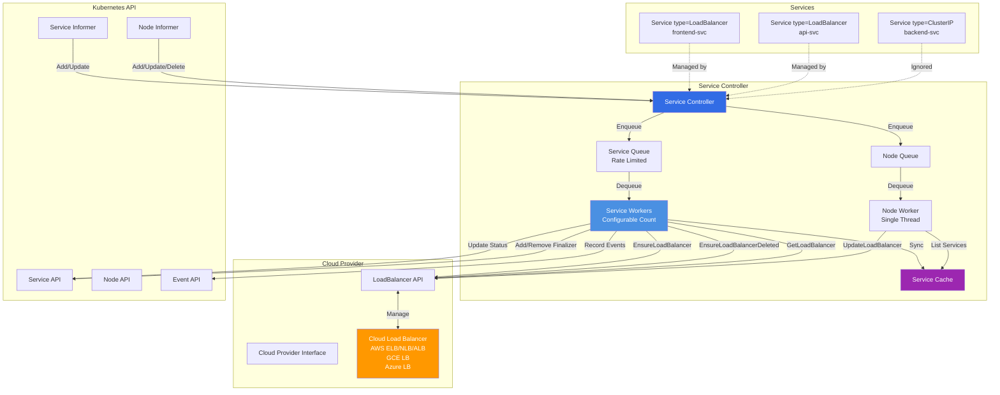
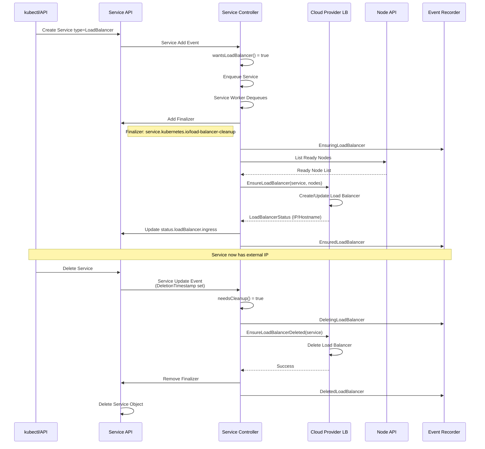
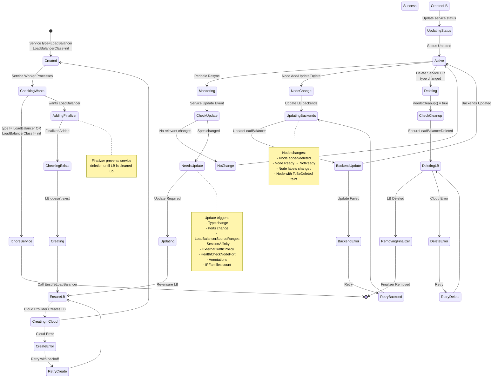
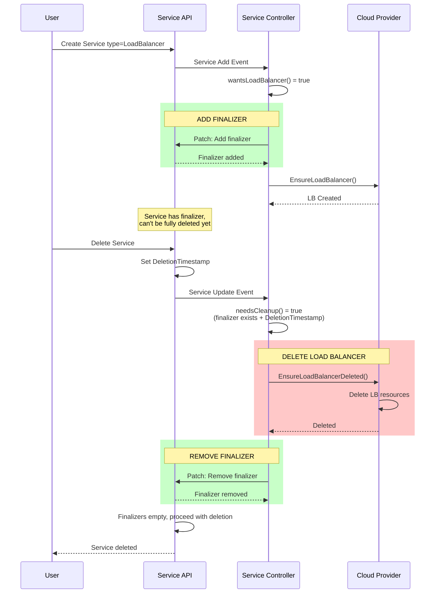
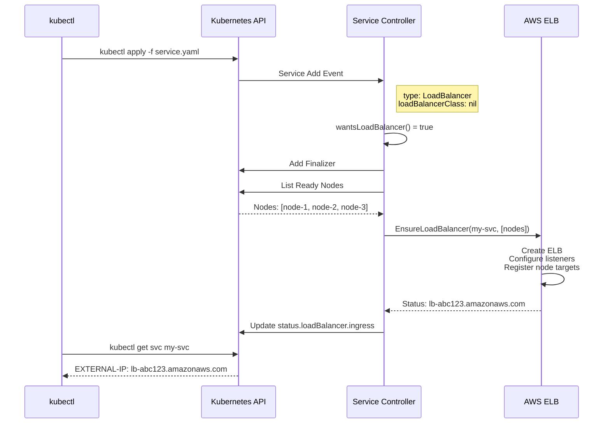
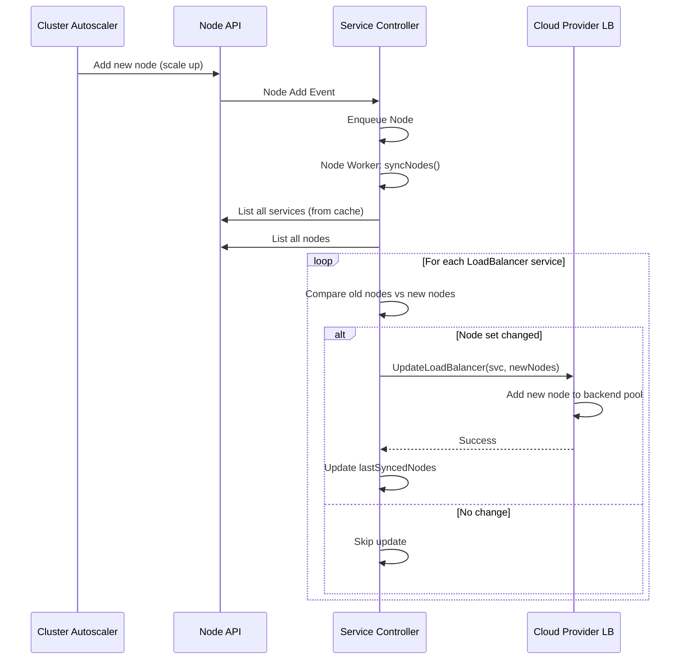
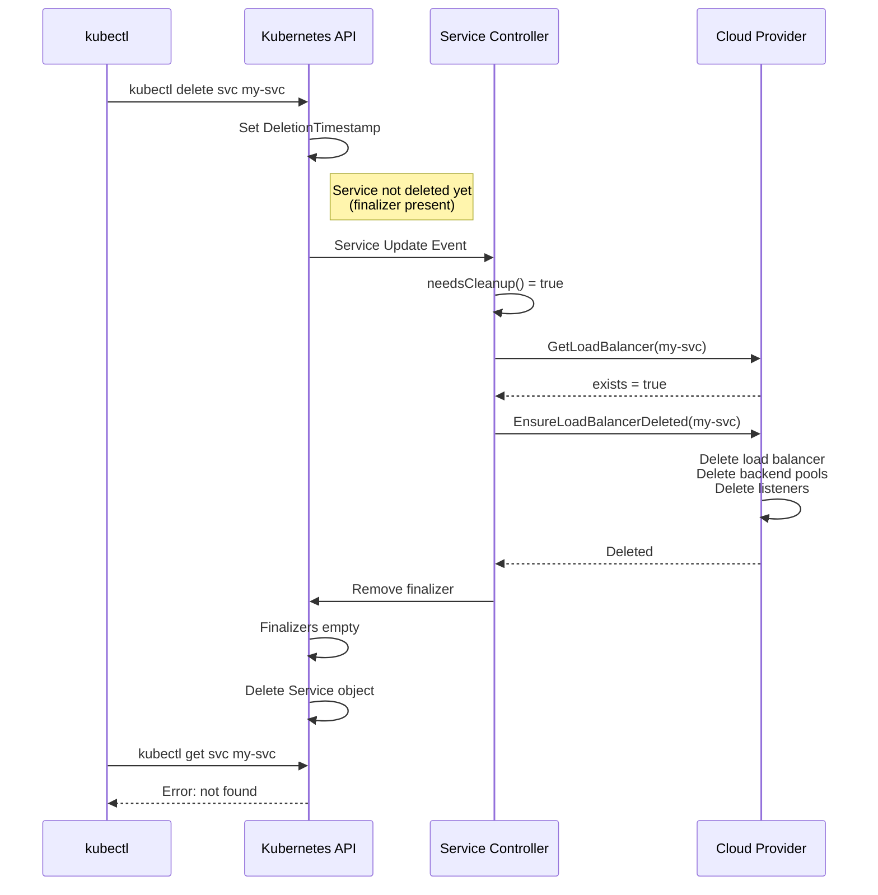

# Cloud Service Controller

## Overview

The Cloud Service Controller is responsible for managing cloud provider load balancers for Kubernetes Services of type `LoadBalancer`. It creates, updates, and deletes load balancers in the cloud infrastructure, ensuring that external traffic can reach cluster services through stable, publicly accessible endpoints.

**Primary Location**: `staging/src/k8s.io/cloud-provider/controllers/service/`

**Key Responsibilities**:
- Create cloud load balancers for Service type=LoadBalancer
- Update load balancer backends when nodes change
- Delete load balancers when services are deleted or changed
- Manage service finalizers for safe cleanup
- Synchronize load balancer status to service objects
- Handle node set changes and updates

## Architecture

### High-Level Architecture



### Component Interactions



## Service State Machine

### Service Lifecycle States



## Core Data Structures

### Controller Structure

```go
// Location: staging/src/k8s.io/cloud-provider/controllers/service/controller.go:78-99

type Controller struct {
    cloud       cloudprovider.Interface        // Cloud provider
    kubeClient  clientset.Interface            // Kubernetes API client
    clusterName string                         // Cluster identifier
    balancer    cloudprovider.LoadBalancer     // LoadBalancer interface

    cache               *serviceCache           // Service cache (legacy, being removed)
    serviceLister       corelisters.ServiceLister
    serviceListerSynced cache.InformerSynced
    eventBroadcaster    record.EventBroadcaster
    eventRecorder       record.EventRecorder
    nodeLister          corelisters.NodeLister
    nodeListerSynced    cache.InformerSynced

    // Work queues
    serviceQueue workqueue.TypedRateLimitingInterface[string]  // Service changes
    nodeQueue    workqueue.TypedRateLimitingInterface[string]   // Node changes

    // Track last synced nodes per service
    lastSyncedNodes     map[string][]*v1.Node
    lastSyncedNodesLock sync.Mutex
}
```

### Service Cache Structure

```go
// Location: staging/src/k8s.io/cloud-provider/controllers/service/controller.go:66-74

type cachedService struct {
    state *v1.Service  // Cached service state
}

type serviceCache struct {
    mu         sync.RWMutex
    serviceMap map[string]*cachedService
}
```

### Load Balancer Operations

```go
// Location: staging/src/k8s.io/cloud-provider/controllers/service/controller.go:353-359

type loadBalancerOperation int

const (
    deleteLoadBalancer loadBalancerOperation = iota  // Delete LB
    ensureLoadBalancer                                // Create/Update LB
    maxNodeNamesToLog = 20                           // Log limit for node names
)
```

### Timing Constants

```go
// Location: staging/src/k8s.io/cloud-provider/controllers/service/controller.go:50-64

const (
    // Interval of synchronizing service status from apiserver
    serviceSyncPeriod = 30 * time.Second

    // Interval of synchronizing node status from apiserver
    nodeSyncPeriod = 100 * time.Second

    // Retry delays for failed operations
    minRetryDelay = 5 * time.Second
    maxRetryDelay = 300 * time.Second  // 5 minutes

    // ToBeDeletedTaint is used by Cluster Autoscaler
    ToBeDeletedTaint = "ToBeDeletedByClusterAutoscaler"
)
```

## Key Operations

### 1. Controller Initialization

```go
// Location: staging/src/k8s.io/cloud-provider/controllers/service/controller.go:103-190

func New(
    cloud cloudprovider.Interface,
    kubeClient clientset.Interface,
    serviceInformer coreinformers.ServiceInformer,
    nodeInformer coreinformers.NodeInformer,
    clusterName string,
    featureGate featuregate.FeatureGate,
) (*Controller, error) {

    s := &Controller{
        cloud:            cloud,
        kubeClient:       kubeClient,
        clusterName:      clusterName,
        cache:            &serviceCache{serviceMap: make(map[string]*cachedService)},
        nodeLister:       nodeInformer.Lister(),
        nodeListerSynced: nodeInformer.Informer().HasSynced,
        serviceQueue: workqueue.NewTypedRateLimitingQueueWithConfig(
            workqueue.NewTypedItemExponentialFailureRateLimiter[string](minRetryDelay, maxRetryDelay),
            workqueue.TypedRateLimitingQueueConfig[string]{Name: "service"},
        ),
        nodeQueue: workqueue.NewTypedRateLimitingQueueWithConfig(
            workqueue.NewTypedItemExponentialFailureRateLimiter[string](minRetryDelay, maxRetryDelay),
            workqueue.TypedRateLimitingQueueConfig[string]{Name: "node"},
        ),
        lastSyncedNodes: make(map[string][]*v1.Node),
    }

    // Initialize cloud provider LoadBalancer interface
    if err := s.init(); err != nil {
        return nil, err
    }

    // Service event handlers
    serviceInformer.Informer().AddEventHandlerWithResyncPeriod(
        cache.ResourceEventHandlerFuncs{
            AddFunc: func(cur interface{}) {
                svc, ok := cur.(*v1.Service)
                if ok && (wantsLoadBalancer(svc) || needsCleanup(svc)) {
                    s.enqueueService(cur)
                }
            },
            UpdateFunc: func(old, cur interface{}) {
                oldSvc, ok1 := old.(*v1.Service)
                curSvc, ok2 := cur.(*v1.Service)
                if ok1 && ok2 && (needsUpdate(oldSvc, curSvc) || needsCleanup(curSvc)) {
                    s.enqueueService(cur)
                }
            },
            // Deletion handled via update with DeletionTimestamp
        },
        serviceSyncPeriod,
    )

    // Node event handlers
    nodeInformer.Informer().AddEventHandlerWithResyncPeriod(
        cache.ResourceEventHandlerFuncs{
            AddFunc: func(cur interface{}) {
                s.enqueueNode(cur)
            },
            UpdateFunc: func(old, cur interface{}) {
                oldNode, ok := old.(*v1.Node)
                curNode, ok2 := cur.(*v1.Node)
                if ok && ok2 && shouldSyncUpdatedNode(oldNode, curNode) {
                    s.enqueueNode(curNode)
                }
            },
            DeleteFunc: func(old interface{}) {
                s.enqueueNode(old)
            },
        },
        nodeSyncPeriod,
    )

    return s, nil
}
```

### 2. Service Reconciliation Logic

```go
// Location: staging/src/k8s.io/cloud-provider/controllers/service/controller.go:364-439

func (c *Controller) syncLoadBalancerIfNeeded(ctx context.Context,
    service *v1.Service, key string) (loadBalancerOperation, error) {

    previousStatus := service.Status.LoadBalancer.DeepCopy()
    var newStatus *v1.LoadBalancerStatus
    var op loadBalancerOperation
    var err error

    if !wantsLoadBalancer(service) || needsCleanup(service) {
        // DELETE PATH
        op = deleteLoadBalancer
        newStatus = &v1.LoadBalancerStatus{}

        _, exists, err := c.balancer.GetLoadBalancer(ctx, c.clusterName, service)
        if err != nil {
            return op, fmt.Errorf("failed to check if load balancer exists before cleanup: %v", err)
        }

        if exists {
            klog.V(2).Infof("Deleting existing load balancer for service %s", key)
            c.eventRecorder.Event(service, v1.EventTypeNormal, "DeletingLoadBalancer", "Deleting load balancer")

            if err := c.balancer.EnsureLoadBalancerDeleted(ctx, c.clusterName, service); err != nil {
                if err == cloudprovider.ImplementedElsewhere {
                    klog.V(4).Infof("LoadBalancer for service %s implemented by a different controller", key)
                } else {
                    return op, fmt.Errorf("failed to delete load balancer: %v", err)
                }
            }
        }

        // Always remove finalizer after LB deletion
        if err := c.removeFinalizer(service); err != nil {
            return op, fmt.Errorf("failed to remove load balancer cleanup finalizer: %v", err)
        }

        c.eventRecorder.Event(service, v1.EventTypeNormal, "DeletedLoadBalancer", "Deleted load balancer")

    } else {
        // CREATE/UPDATE PATH
        op = ensureLoadBalancer
        klog.V(2).Infof("Ensuring load balancer for service %s", key)
        c.eventRecorder.Event(service, v1.EventTypeNormal, "EnsuringLoadBalancer", "Ensuring load balancer")

        // Add finalizer before creating LB
        if err := c.addFinalizer(service); err != nil {
            return op, fmt.Errorf("failed to add load balancer cleanup finalizer: %v", err)
        }

        newStatus, err = c.ensureLoadBalancer(ctx, service)
        if err != nil {
            if err == cloudprovider.ImplementedElsewhere {
                klog.V(4).Infof("LoadBalancer for service %s implemented by a different controller", key)
                return op, nil
            }
            return op, fmt.Errorf("failed to ensure load balancer: %w", err)
        }

        if newStatus == nil {
            return op, fmt.Errorf("service status returned by EnsureLoadBalancer is nil")
        }

        c.eventRecorder.Event(service, v1.EventTypeNormal, "EnsuredLoadBalancer", "Ensured load balancer")
    }

    // Update service status
    if err := c.patchStatus(service, previousStatus, newStatus); err != nil {
        if !apierrors.IsNotFound(err) {
            return op, fmt.Errorf("failed to update load balancer status: %v", err)
        }
    }

    return op, nil
}
```

### 3. Wants LoadBalancer Check

```go
// Location: staging/src/k8s.io/cloud-provider/controllers/service/controller.go:862-865

func wantsLoadBalancer(service *v1.Service) bool {
    // Service wants default cloud-provider LB if:
    // - Type is LoadBalancer
    // - LoadBalancerClass is nil (not using custom LB controller)
    return service.Spec.Type == v1.ServiceTypeLoadBalancer && service.Spec.LoadBalancerClass == nil
}
```

### 4. Needs Update Detection

```go
// Location: staging/src/k8s.io/cloud-provider/controllers/service/controller.go:557-617

func needsUpdate(oldService *v1.Service, newService *v1.Service) bool {
    if !wantsLoadBalancer(oldService) && !wantsLoadBalancer(newService) {
        return false
    }

    // Type change
    if wantsLoadBalancer(oldService) != wantsLoadBalancer(newService) {
        return true
    }

    if wantsLoadBalancer(newService) {
        // LoadBalancerSourceRanges change
        if !reflect.DeepEqual(oldService.Spec.LoadBalancerSourceRanges, newService.Spec.LoadBalancerSourceRanges) {
            return true
        }

        // Ports or SessionAffinity change
        if !portsEqualForLB(oldService, newService) || oldService.Spec.SessionAffinity != newService.Spec.SessionAffinity {
            return true
        }

        // SessionAffinityConfig change
        if !reflect.DeepEqual(oldService.Spec.SessionAffinityConfig, newService.Spec.SessionAffinityConfig) {
            return true
        }

        // LoadBalancerIP change
        if !loadBalancerIPsAreEqual(oldService, newService) {
            return true
        }

        // ExternalIPs change
        if len(oldService.Spec.ExternalIPs) != len(newService.Spec.ExternalIPs) {
            return true
        }
        for i := range oldService.Spec.ExternalIPs {
            if oldService.Spec.ExternalIPs[i] != newService.Spec.ExternalIPs[i] {
                return true
            }
        }

        // Annotations change
        if !reflect.DeepEqual(oldService.Annotations, newService.Annotations) {
            return true
        }

        // UID change (service deleted and recreated)
        if oldService.UID != newService.UID {
            return true
        }

        // ExternalTrafficPolicy change
        if oldService.Spec.ExternalTrafficPolicy != newService.Spec.ExternalTrafficPolicy {
            return true
        }

        // HealthCheckNodePort change
        if oldService.Spec.HealthCheckNodePort != newService.Spec.HealthCheckNodePort {
            return true
        }

        // IPFamilies count change (dual-stack)
        if len(oldService.Spec.IPFamilies) != len(newService.Spec.IPFamilies) {
            return true
        }
    }

    return false
}
```

### 5. Ensure LoadBalancer

```go
// Location: staging/src/k8s.io/cloud-provider/controllers/service/controller.go:441-458

func (c *Controller) ensureLoadBalancer(ctx context.Context, service *v1.Service) (*v1.LoadBalancerStatus, error) {
    // Get list of ready nodes
    nodes, err := listWithPredicates(c.nodeLister, stableNodeSetPredicates...)
    if err != nil {
        return nil, err
    }

    // Warn if no available nodes
    if len(nodes) == 0 {
        c.eventRecorder.Event(service, v1.EventTypeWarning, "UnAvailableLoadBalancer",
            "There are no available nodes for LoadBalancer")
    }

    c.storeLastSyncedNodes(service, nodes)

    // Call cloud provider to ensure LB exists
    status, err := c.balancer.EnsureLoadBalancer(ctx, c.clusterName, service, nodes)
    if err != nil {
        return nil, err
    }

    return status, nil
}
```

### 6. Node Synchronization

```go
// Location: staging/src/k8s.io/cloud-provider/controllers/service/controller.go (synthesized from multiple functions)

func (c *Controller) syncNodes(ctx context.Context, workers int) map[string]struct{} {
    klog.V(2).Infof("Syncing backends for all LB services.")

    servicesToUpdate := c.cache.allServices()
    numServices := len(servicesToUpdate)

    servicesToRetry := c.updateLoadBalancerHosts(ctx, servicesToUpdate, workers)

    klog.V(2).Infof("Successfully updated %d out of %d load balancers to direct traffic to the updated set of nodes",
        numServices-len(servicesToRetry), numServices)

    return servicesToRetry
}

// For each service, check if node set changed and update if needed
func (c *Controller) lockedUpdateLoadBalancerHosts(ctx context.Context, svc *v1.Service) (retStatus) {
    if svc == nil || !wantsLoadBalancer(svc) {
        return retSuccess
    }

    // Get new node set
    newNodes, err := listWithPredicates(c.nodeLister)
    if err != nil {
        return retNeedRetry
    }
    newNodes = filterWithPredicates(newNodes, stableNodeSetPredicates...)

    // Get old node set
    oldNodes := filterWithPredicates(c.getLastSyncedNodes(svc), stableNodeSetPredicates...)

    // Check if node set changed
    if nodeNames(newNodes).Equal(nodeNames(oldNodes)) {
        return retSuccess  // No change, skip update
    }

    klog.V(2).Infof("Updating backends for service %s, old: %v, new: %v",
        key, loggableNodeNames(oldNodes), loggableNodeNames(newNodes))

    // Update load balancer backends
    err = c.balancer.UpdateLoadBalancer(ctx, c.clusterName, svc, newNodes)
    if err != nil {
        c.eventRecorder.Eventf(svc, v1.EventTypeWarning, "UpdateLoadBalancerFailed",
            "Error updating load balancer with new hosts: %v", err)
        return retNeedRetry
    }

    c.storeLastSyncedNodes(svc, newNodes)
    c.eventRecorder.Eventf(svc, v1.EventTypeNormal, "UpdatedLoadBalancer",
        "Updated load balancer with new hosts")

    return retSuccess
}
```

## Finalizer Management

### Finalizer Purpose

The service controller uses a finalizer (`service.kubernetes.io/load-balancer-cleanup`) to ensure load balancers are properly deleted before the Service object is removed from the API server.

### Finalizer Workflow



### Needs Cleanup Logic

```go
// Location: staging/src/k8s.io/cloud-provider/controllers/service/controller.go:539-554

func needsCleanup(service *v1.Service) bool {
    // No finalizer, no cleanup needed
    if !servicehelper.HasLBFinalizer(service) {
        return false
    }

    // Service is being deleted
    if service.ObjectMeta.DeletionTimestamp != nil {
        return true
    }

    // Service no longer wants LoadBalancer but still has finalizer
    if service.Spec.Type != v1.ServiceTypeLoadBalancer {
        return true
    }

    return false
}
```

## Cloud Provider Integration

### LoadBalancer Interface

```go
// Location: staging/src/k8s.io/cloud-provider/cloud.go

type LoadBalancer interface {
    // GetLoadBalancer returns whether the specified load balancer exists
    GetLoadBalancer(ctx context.Context, clusterName string, service *v1.Service) (
        status *v1.LoadBalancerStatus, exists bool, err error)

    // GetLoadBalancerName returns the name of the load balancer
    GetLoadBalancerName(ctx context.Context, clusterName string, service *v1.Service) string

    // EnsureLoadBalancer creates a new load balancer or updates the existing one
    EnsureLoadBalancer(ctx context.Context, clusterName string, service *v1.Service, nodes []*v1.Node) (
        *v1.LoadBalancerStatus, error)

    // UpdateLoadBalancer updates hosts under the specified load balancer
    UpdateLoadBalancer(ctx context.Context, clusterName string, service *v1.Service, nodes []*v1.Node) error

    // EnsureLoadBalancerDeleted deletes the specified load balancer
    EnsureLoadBalancerDeleted(ctx context.Context, clusterName string, service *v1.Service) error
}
```

### Implementation Examples

**AWS ELB/NLB/ALB**:
- Classic: Elastic Load Balancer (ELB)
- Network: Network Load Balancer (NLB)
- Application: Application Load Balancer (ALB) via annotations

**GCE Load Balancers**:
- External: GCE Network Load Balancer
- Internal: GCE Internal Load Balancer via annotations

**Azure Load Balancers**:
- Public: Azure Load Balancer
- Internal: Internal Load Balancer via annotations

## Configuration

### Command-Line Flags

```bash
# Number of service workers (default varies, typically 1)
--concurrent-service-syncs=1

# Cluster name for cloud provider
--cluster-name=my-cluster

# Cloud provider name
--cloud-provider=aws  # or gce, azure, etc.
```

### Service Annotations

Cloud providers support various annotations for load balancer customization:

**AWS Example**:
```yaml
apiVersion: v1
kind: Service
metadata:
  name: my-service
  annotations:
    service.beta.kubernetes.io/aws-load-balancer-type: "nlb"
    service.beta.kubernetes.io/aws-load-balancer-internal: "true"
    service.beta.kubernetes.io/aws-load-balancer-backend-protocol: "tcp"
spec:
  type: LoadBalancer
  ports:
  - port: 80
    targetPort: 8080
  selector:
    app: myapp
```

**GCE Example**:
```yaml
apiVersion: v1
kind: Service
metadata:
  name: my-service
  annotations:
    cloud.google.com/load-balancer-type: "Internal"
    networking.gke.io/load-balancer-type: "Internal"
spec:
  type: LoadBalancer
  ports:
  - port: 80
    targetPort: 8080
  selector:
    app: myapp
```

### Service Spec Options

```yaml
apiVersion: v1
kind: Service
metadata:
  name: my-service
spec:
  type: LoadBalancer
  loadBalancerClass: null  # nil = use default cloud provider
  loadBalancerIP: ""       # Request specific IP (cloud-dependent)
  loadBalancerSourceRanges:  # Allowed source IP ranges
  - "10.0.0.0/8"
  - "172.16.0.0/12"
  externalTrafficPolicy: Local  # or Cluster (default)
  healthCheckNodePort: 30000    # For externalTrafficPolicy: Local
  sessionAffinity: ClientIP     # or None (default)
  sessionAffinityConfig:
    clientIP:
      timeoutSeconds: 10800
  ports:
  - port: 80
    targetPort: 8080
    protocol: TCP
  selector:
    app: myapp
```

## Common Scenarios

### Scenario 1: Creating LoadBalancer Service



### Scenario 2: Node Set Changes



### Scenario 3: Service Deletion with Finalizer



## Troubleshooting

### Problem: LoadBalancer Service Stuck in Pending

**Symptoms**:
```bash
$ kubectl get svc my-service
NAME         TYPE           CLUSTER-IP     EXTERNAL-IP   PORT(S)
my-service   LoadBalancer   10.96.100.50   <pending>     80:30123/TCP
```

**Diagnostic Steps**:
```bash
# 1. Check service controller logs
kubectl logs -n kube-system <cloud-controller-manager-pod> | grep -i "my-service"

# 2. Check service events
kubectl describe svc my-service

# 3. Check if cloud provider is configured
kubectl get pods -n kube-system | grep cloud-controller

# 4. Check finalizer
kubectl get svc my-service -o jsonpath='{.metadata.finalizers}'
```

**Common Causes**:
1. **No cloud provider configured**: Cloud controller manager not running
2. **Cloud API errors**: Permission issues, quota exceeded, API failures
3. **Invalid configuration**: Unsupported annotations or settings
4. **No ready nodes**: All nodes are NotReady or tainted

**Solutions**:
```bash
# Verify cloud controller manager is running
kubectl get pods -n kube-system -l component=cloud-controller-manager

# Check cloud provider permissions (AWS example)
# Ensure IAM role has permissions: elasticloadbalancing:*

# Check for errors in events
kubectl get events --field-selector involvedObject.name=my-service

# Manually trigger reconciliation (edit to add/remove annotation)
kubectl annotate svc my-service test=value
```

### Problem: Load Balancer Not Deleted

**Symptoms**:
- Service deleted but load balancer still exists in cloud
- Orphaned load balancers causing costs

**Diagnostic Steps**:
```bash
# 1. Check if service still exists with DeletionTimestamp
kubectl get svc my-service -o yaml | grep -A5 metadata

# 2. Check finalizer
kubectl get svc my-service -o jsonpath='{.metadata.finalizers}'

# 3. Check controller logs
kubectl logs -n kube-system <cloud-controller-manager-pod> | grep -i "delete.*my-service"

# 4. Verify in cloud provider (AWS example)
aws elb describe-load-balancers --query 'LoadBalancerDescriptions[*].[LoadBalancerName,DNSName]'
```

**Common Causes**:
1. **Finalizer stuck**: Service can't be deleted, finalizer not removed
2. **Cloud API error**: Permission denied, network timeout
3. **Manual cloud changes**: LB modified/deleted manually in cloud console

**Solutions**:
```bash
# If service is stuck, check if LB was manually deleted
# Manually remove finalizer (CAUTION: only if LB is confirmed deleted)
kubectl patch svc my-service -p '{"metadata":{"finalizers":null}}'

# Restart cloud controller manager
kubectl rollout restart deployment cloud-controller-manager -n kube-system
```

### Problem: Backends Not Updated After Node Changes

**Symptoms**:
- New nodes added but not receiving traffic
- Deleted nodes still in load balancer backend pool
- Traffic routing to NotReady nodes

**Diagnostic Steps**:
```bash
# 1. Check node worker logs
kubectl logs -n kube-system <cloud-controller-manager-pod> | grep -i "sync.*node"

# 2. Verify nodes are Ready
kubectl get nodes

# 3. Check service events
kubectl describe svc my-service

# 4. Verify backends in cloud (AWS example)
aws elb describe-load-balancers --load-balancer-names <lb-name> --query 'LoadBalancerDescriptions[*].Instances'
```

**Common Causes**:
1. **Node worker not running**: Single node worker crashed
2. **Node not Ready**: Node has NotReady condition
3. **Cloud API throttling**: Too many update requests
4. **Network partition**: Controller can't reach cloud API

**Solutions**:
```bash
# Restart cloud controller manager
kubectl rollout restart deployment cloud-controller-manager -n kube-system

# Manually trigger service update (forces reconciliation)
kubectl annotate svc my-service force-sync="$(date +%s)" --overwrite

# Check cloud API rate limits and quota
```

## Performance Considerations

### Scalability

**Service Worker Concurrency**:
- Default: 1 worker (configurable via `--concurrent-service-syncs`)
- Recommendation: 1 worker for <100 services, 2-5 for larger clusters

**Node Worker**:
- Single-threaded by design
- Processes all services when any node changes
- Can become bottleneck in large clusters (1000+ services)

**Optimization Strategies**:
1. Increase `--concurrent-service-syncs` for large clusters
2. Use LoadBalancerClass for custom controllers (offload from default)
3. Monitor cloud API rate limits
4. Batch node changes during cluster scaling

### Metrics

Key metrics to monitor:
- `service_controller_loadbalancer_sync_total`: Total LB syncs
- `service_controller_loadbalancer_sync_duration_seconds`: Sync latency
- `service_controller_nodesync_latency_seconds`: Node sync latency
- `service_controller_nodesync_error_total`: Node sync errors

## Summary

The Cloud Service Controller is responsible for managing the lifecycle of cloud load balancers for Kubernetes Services of type LoadBalancer. It provides seamless integration between Kubernetes services and cloud provider load balancing infrastructure.

**Key Takeaways**:
1. **Manages cloud load balancers** for Service type=LoadBalancer
2. **Finalizer-based cleanup** ensures safe LB deletion
3. **Dual work queues**: Separate queues for services and nodes
4. **Node backend synchronization**: Updates LB backends when nodes change
5. **Cloud provider agnostic**: Works with AWS, GCE, Azure, and others
6. **LoadBalancerClass support**: Respects custom load balancer controllers

The service controller is essential for exposing Kubernetes services to external traffic using native cloud load balancers.
