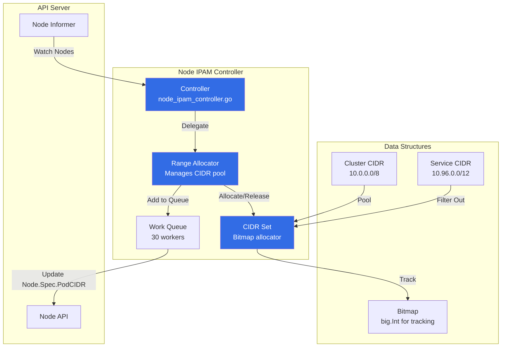
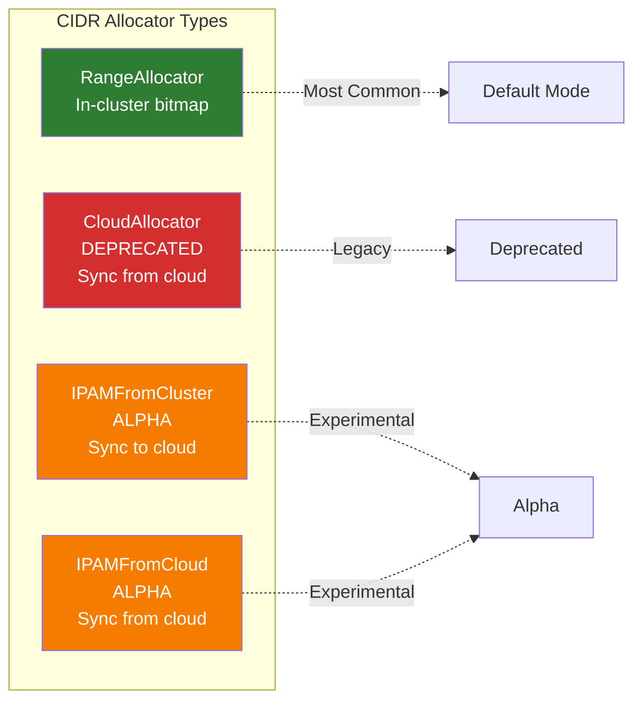
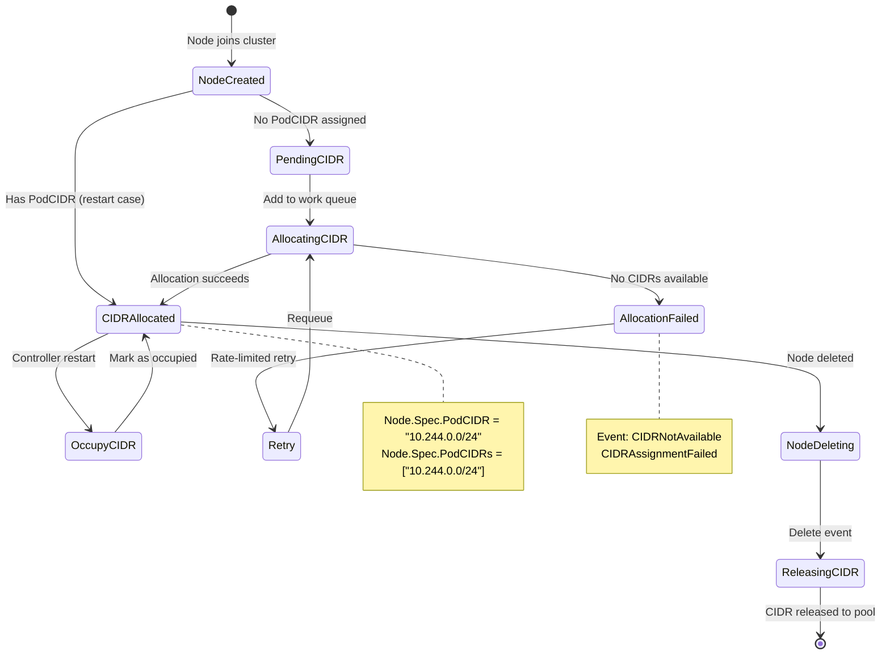
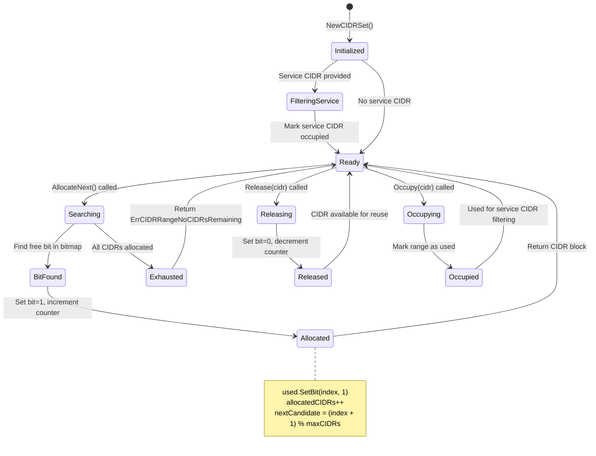
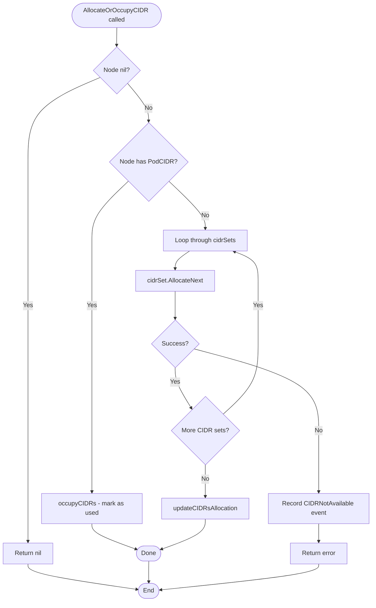
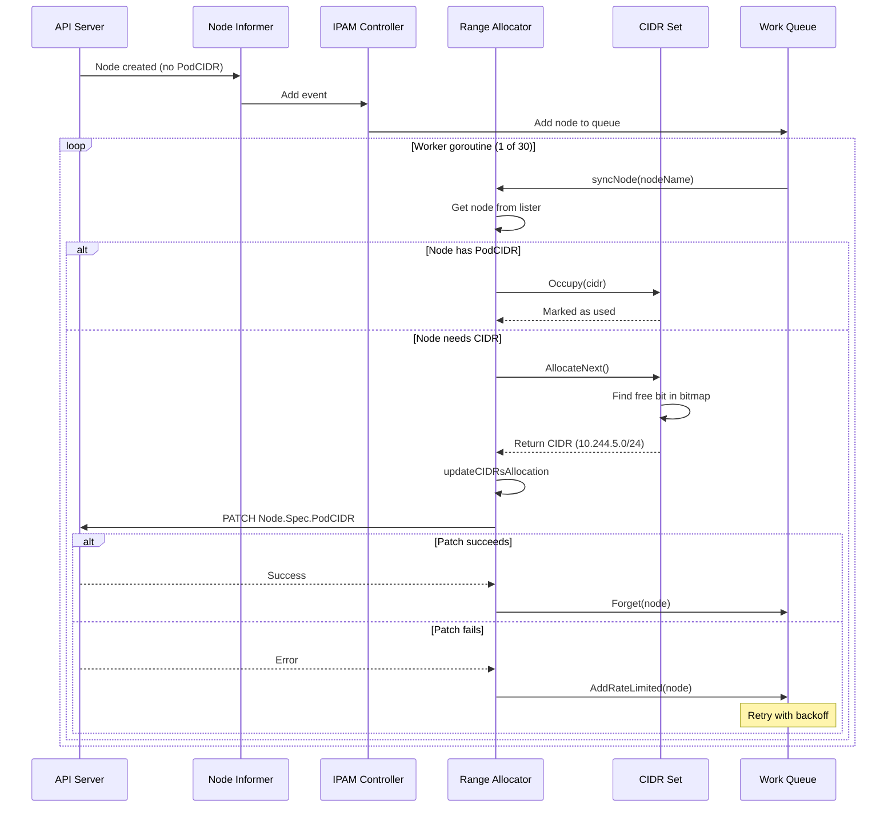
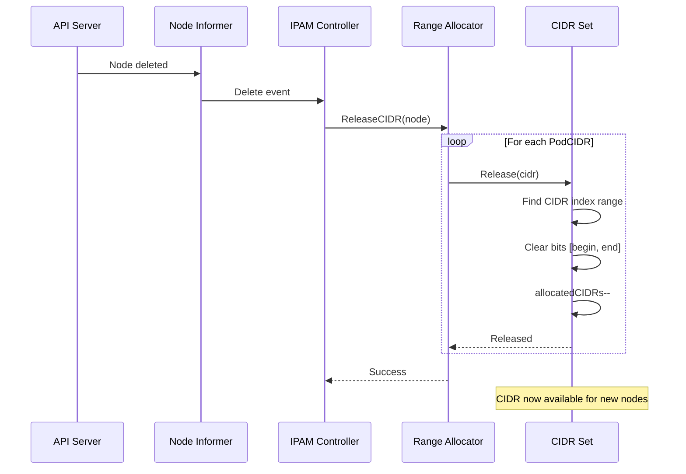
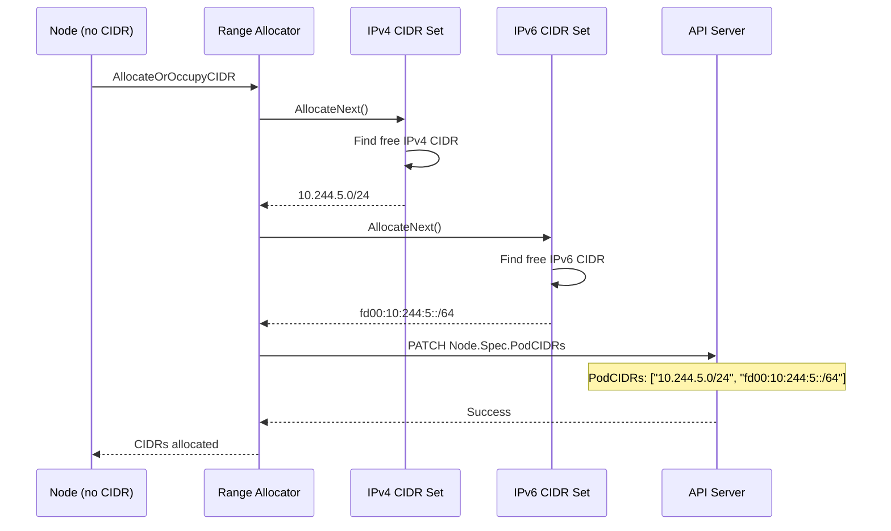
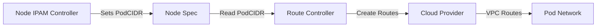

# Node IPAM Controller - CIDR Allocation for Nodes

## Overview

The **Node IPAM Controller** (IP Address Management) is responsible for allocating Pod CIDR ranges to nodes in a Kubernetes cluster. Every node needs a unique CIDR block from which pod IPs are assigned, and this controller ensures efficient allocation, tracking, and release of these CIDR ranges.

**Primary Location**: `pkg/controller/nodeipam/node_ipam_controller.go`

**Core Algorithm**: `pkg/controller/nodeipam/ipam/range_allocator.go`

**CIDR Bitmap**: `pkg/controller/nodeipam/ipam/cidrset/cidr_set.go`

## Key Responsibilities

1. **CIDR Allocation**: Assign unique Pod CIDR ranges to nodes from cluster CIDR pool
2. **CIDR Release**: Reclaim CIDR ranges from deleted nodes for reuse
3. **Dual-Stack Support**: Allocate both IPv4 and IPv6 CIDRs for dual-stack clusters
4. **Service CIDR Filtering**: Prevent allocation of CIDRs that conflict with Service CIDR
5. **State Synchronization**: Track allocated CIDRs across controller restarts

## Architecture

### High-Level Architecture



### Allocator Types

Kubernetes supports multiple CIDR allocator types:



## Core Data Structures

### Controller Structure

```go
// Location: pkg/controller/nodeipam/node_ipam_controller.go:43-58

type Controller struct {
    allocatorType ipam.CIDRAllocatorType

    cloud                cloudprovider.Interface
    clusterCIDRs         []*net.IPNet
    serviceCIDR          *net.IPNet
    secondaryServiceCIDR *net.IPNet
    kubeClient           clientset.Interface
    eventBroadcaster     record.EventBroadcaster

    nodeLister         corelisters.NodeLister
    nodeInformerSynced cache.InformerSynced

    legacyIPAM    ipamController   // For CloudAllocator types
    cidrAllocator ipam.CIDRAllocator // For RangeAllocator
}
```

### Range Allocator Structure

```go
// Location: pkg/controller/nodeipam/ipam/range_allocator.go:46-62

type rangeAllocator struct {
    client clientset.Interface

    // Cluster CIDRs as passed during controller creation
    clusterCIDRs []*net.IPNet

    // For each entry in clusterCIDRs, maintain a set of used/free CIDRs
    cidrSets []*cidrset.CidrSet

    // Node lister populated by shared informer
    nodeLister corelisters.NodeLister
    nodesSynced cache.InformerSynced

    broadcaster record.EventBroadcaster
    recorder    record.EventRecorder

    // Work queue with rate limiting
    queue workqueue.RateLimitingInterface
}
```

### CIDR Set Structure (Bitmap Allocator)

```go
// Location: pkg/controller/nodeipam/ipam/cidrset/cidr_set.go:29-53

type CidrSet struct {
    sync.Mutex

    // Cluster CIDR assigned to the cluster
    clusterCIDR *net.IPNet
    clusterMaskSize int  // Cached to avoid penalty of Mask.Size()

    // Node mask assigned to nodes
    nodeMask net.IPMask
    nodeMaskSize int

    // Maximum number of CIDRs that can be allocated
    maxCIDRs int

    // Number of allocated CIDRs
    allocatedCIDRs int

    // Next CIDR candidate index (optimization for allocation)
    nextCandidate int

    // Bitmap to track allocated CIDRs (using big.Int)
    used big.Int

    // Label for metrics
    label string
}
```

### CIDR Allocator Interface

```go
// Location: pkg/controller/nodeipam/ipam/cidr_allocator.go:73-82

type CIDRAllocator interface {
    // AllocateOrOccupyCIDR looks at the given node, assigns it a valid
    // CIDR if it doesn't currently have one or mark the CIDR as used if
    // the node already has one.
    AllocateOrOccupyCIDR(ctx context.Context, node *v1.Node) error

    // ReleaseCIDR releases the CIDR of the removed node.
    ReleaseCIDR(logger klog.Logger, node *v1.Node) error

    // Run starts all the working logic of the allocator.
    Run(ctx context.Context)
}
```

## State Machine

### Node CIDR Lifecycle



### CIDR Bitmap Allocation State Machine



## Algorithms

### 1. CIDR Allocation Algorithm (AllocateOrOccupyCIDR)

```go
// Location: pkg/controller/nodeipam/ipam/range_allocator.go:311-335

func (r *rangeAllocator) AllocateOrOccupyCIDR(ctx context.Context, node *v1.Node) error {
    if node == nil {
        return nil
    }

    // Case 1: Node already has CIDR(s) - mark as occupied
    if len(node.Spec.PodCIDRs) > 0 {
        return r.occupyCIDRs(node)
    }

    // Case 2: Node needs new CIDR allocation
    logger := klog.FromContext(ctx)
    allocatedCIDRs := make([]*net.IPNet, len(r.cidrSets))

    // Allocate one CIDR from each CIDR set (for dual-stack)
    for idx := range r.cidrSets {
        podCIDR, err := r.cidrSets[idx].AllocateNext()
        if err != nil {
            controllerutil.RecordNodeStatusChange(logger, r.recorder, node, "CIDRNotAvailable")
            return fmt.Errorf("failed to allocate cidr from cluster cidr at idx:%v: %v", idx, err)
        }
        allocatedCIDRs[idx] = podCIDR
    }

    // Queue the assignment for API update
    logger.V(4).Info("Putting node with CIDR into the work queue", "node", klog.KObj(node), "CIDRs", allocatedCIDRs)
    return r.updateCIDRsAllocation(ctx, node.Name, allocatedCIDRs)
}
```

**Algorithm Flow**:



### 2. Bitmap-Based AllocateNext Algorithm

```go
// Location: pkg/controller/nodeipam/ipam/cidrset/cidr_set.go:150-177

func (s *CidrSet) AllocateNext() (*net.IPNet, error) {
    s.Lock()
    defer s.Unlock()

    // Check if exhausted
    if s.allocatedCIDRs == s.maxCIDRs {
        return nil, ErrCIDRRangeNoCIDRsRemaining
    }

    candidate := s.nextCandidate
    var i int

    // Linear search for free bit (used.Bit == 0)
    for i = 0; i < s.maxCIDRs; i++ {
        if s.used.Bit(candidate) == 0 {
            break // Found free CIDR
        }
        candidate = (candidate + 1) % s.maxCIDRs  // Wrap around
    }

    // Mark as allocated
    s.nextCandidate = (candidate + 1) % s.maxCIDRs
    s.used.SetBit(&s.used, candidate, 1)
    s.allocatedCIDRs++

    // Update metrics
    cidrSetAllocations.WithLabelValues(s.label).Inc()
    cidrSetAllocationTriesPerRequest.WithLabelValues(s.label).Observe(float64(i))
    cidrSetUsage.WithLabelValues(s.label).Set(float64(s.allocatedCIDRs) / float64(s.maxCIDRs))

    // Convert index to CIDR block
    return s.indexToCIDRBlock(candidate), nil
}
```

**Key Points**:
- Uses `big.Int` as bitmap for tracking allocated CIDRs
- Linear search from `nextCandidate` to find free bit
- Wraps around to beginning if needed
- O(n) worst case, but optimized by `nextCandidate` tracking

### 3. Index to CIDR Block Conversion

```go
// Location: pkg/controller/nodeipam/ipam/cidrset/cidr_set.go:103-148

func (s *CidrSet) indexToCIDRBlock(index int) *net.IPNet {
    var ip []byte
    switch /*v4 or v6*/ {
    case s.clusterCIDR.IP.To4() != nil:
        // IPv4: Simple bitwise OR
        {
            j := uint32(index) << uint32(32-s.nodeMaskSize)
            ipInt := (binary.BigEndian.Uint32(s.clusterCIDR.IP)) | j
            ip = make([]byte, net.IPv4len)
            binary.BigEndian.PutUint32(ip, ipInt)
        }
    case s.clusterCIDR.IP.To16() != nil:
        // IPv6: Complex 128-bit arithmetic
        {
            leftClusterIP := binary.BigEndian.Uint64(s.clusterCIDR.IP[:8])
            rightClusterIP := binary.BigEndian.Uint64(s.clusterCIDR.IP[8:])

            ip = make([]byte, net.IPv6len)

            if s.nodeMaskSize <= 64 {
                // Only left side affected
                leftClusterIP |= uint64(index) << uint(64-s.nodeMaskSize)
            } else {
                // Both sides affected (complex calculation)
                // ... (handles split across 64-bit boundary)
                rightClusterIP |= uint64(index) << uint(128-s.nodeMaskSize)
            }
            binary.BigEndian.PutUint64(ip[:8], leftClusterIP)
            binary.BigEndian.PutUint64(ip[8:], rightClusterIP)
        }
    }
    return &net.IPNet{
        IP:   ip,
        Mask: s.nodeMask,
    }
}
```

**Example (IPv4)**:
- Cluster CIDR: `10.244.0.0/16`
- Node Mask Size: `24`
- Index: `5`
- Calculation: `10.244.0.0 | (5 << 8) = 10.244.5.0/24`

### 4. CIDR Release Algorithm

```go
// Location: pkg/controller/nodeipam/ipam/range_allocator.go:338-362

func (r *rangeAllocator) ReleaseCIDR(logger klog.Logger, node *v1.Node) error {
    if node == nil || len(node.Spec.PodCIDRs) == 0 {
        return nil
    }

    for idx, cidr := range node.Spec.PodCIDRs {
        _, podCIDR, err := netutils.ParseCIDRSloppy(cidr)
        if err != nil {
            return fmt.Errorf("failed to parse CIDR %s on Node %v: %v", cidr, node.Name, err)
        }

        // Check CIDR index exists
        if idx >= len(r.cidrSets) {
            return fmt.Errorf("node:%s has an allocated cidr: %v at index:%v that does not exist in cluster cidrs configuration", node.Name, cidr, idx)
        }

        logger.V(4).Info("Release CIDR for node", "CIDR", cidr, "node", klog.KObj(node))
        if err = r.cidrSets[idx].Release(podCIDR); err != nil {
            return fmt.Errorf("error when releasing CIDR %v: %v", cidr, err)
        }
    }
    return nil
}
```

```go
// Location: pkg/controller/nodeipam/ipam/cidrset/cidr_set.go:222-242

func (s *CidrSet) Release(cidr *net.IPNet) error {
    begin, end, err := s.getBeginningAndEndIndices(cidr)
    if err != nil {
        return err
    }
    s.Lock()
    defer s.Unlock()

    // Release all bits in range [begin, end]
    for i := begin; i <= end; i++ {
        // Only change counters if bit is actually set
        if s.used.Bit(i) != 0 {
            s.used.SetBit(&s.used, i, 0)
            s.allocatedCIDRs--
            cidrSetReleases.WithLabelValues(s.label).Inc()
        }
    }

    cidrSetUsage.WithLabelValues(s.label).Set(float64(s.allocatedCIDRs) / float64(s.maxCIDRs))
    return nil
}
```

### 5. Service CIDR Filtering

```go
// Location: pkg/controller/nodeipam/ipam/range_allocator.go:366-383

func (r *rangeAllocator) filterOutServiceRange(logger klog.Logger, serviceCIDR *net.IPNet) {
    for idx, cidr := range r.clusterCIDRs {
        // Check if service CIDR overlaps with cluster CIDR
        if !cidr.Contains(serviceCIDR.IP.Mask(cidr.Mask)) &&
           !serviceCIDR.Contains(cidr.IP.Mask(serviceCIDR.Mask)) {
            continue // No overlap, skip
        }

        // Occupy the service CIDR range to prevent allocation
        if err := r.cidrSets[idx].Occupy(serviceCIDR); err != nil {
            logger.Error(err, "Error filtering out service cidr", "CIDR", cidr, "index", idx, "serviceCIDR", serviceCIDR)
        }
    }
}
```

**Purpose**: Prevent pod CIDRs from conflicting with service IPs.

**Example**:
- Cluster CIDR: `10.0.0.0/8`
- Service CIDR: `10.96.0.0/12` (10.96.0.0 - 10.111.255.255)
- Node mask: `/24`
- Result: Ranges `10.96.0.0/24` through `10.111.255.0/24` marked as occupied

## Sequence Diagrams

### CIDR Allocation Sequence



### Node Deletion and CIDR Release Sequence



### Dual-Stack CIDR Allocation



## Configuration

### Controller Manager Flags

```bash
# Enable node CIDR allocation
--allocate-node-cidrs=true

# Cluster CIDR for pod IP allocation (required for RangeAllocator)
--cluster-cidr=10.244.0.0/16

# Service CIDR (to filter out from node allocation)
--service-cluster-ip-range=10.96.0.0/12

# Node CIDR mask size (must be >= cluster CIDR mask)
--node-cidr-mask-size=24

# Allocator type (RangeAllocator, CloudAllocator, IPAMFromCluster, IPAMFromCloud)
--cidr-allocator-type=RangeAllocator

# Dual-stack configuration
--cluster-cidr=10.244.0.0/16,fd00:10:244::/56
--node-cidr-mask-size-ipv4=24
--node-cidr-mask-size-ipv6=64
```

### Example Configurations

**Single-Stack IPv4**:
```yaml
apiVersion: v1
kind: Pod
metadata:
  name: kube-controller-manager
spec:
  containers:
  - name: kube-controller-manager
    command:
    - kube-controller-manager
    - --allocate-node-cidrs=true
    - --cluster-cidr=10.244.0.0/16
    - --service-cluster-ip-range=10.96.0.0/12
    - --node-cidr-mask-size=24
    # Capacity: (2^(24-16)) = 256 nodes with /24 each
```

**Dual-Stack IPv4/IPv6**:
```yaml
apiVersion: v1
kind: Pod
metadata:
  name: kube-controller-manager
spec:
  containers:
  - name: kube-controller-manager
    command:
    - kube-controller-manager
    - --allocate-node-cidrs=true
    - --cluster-cidr=10.244.0.0/16,fd00:10:244::/56
    - --service-cluster-ip-range=10.96.0.0/12,fd00:1234::/108
    - --node-cidr-mask-size-ipv4=24
    - --node-cidr-mask-size-ipv6=64
```

### CIDR Capacity Calculation

**Formula**: `maxNodes = 2^(nodeMaskSize - clusterMaskSize)`

**Examples**:

| Cluster CIDR | Node Mask | Max Nodes | Pods per Node (/24) |
|--------------|-----------|-----------|---------------------|
| 10.0.0.0/8   | /24       | 65,536    | 254                 |
| 10.244.0.0/16| /24       | 256       | 254                 |
| 10.244.0.0/16| /20       | 16        | 4,094               |
| fd00::/56    | /64       | 256       | 2^64 IPs            |

### Constants

```go
// Location: pkg/controller/nodeipam/ipam/cidr_allocator.go:56-66

const (
    // API server startup grace period (wait for API availability)
    apiserverStartupGracePeriod = 10 * time.Minute

    // Number of concurrent workers updating node specs
    cidrUpdateWorkers = 30

    // Retry attempts for node spec updates
    cidrUpdateRetries = 3
)

// Node polling interval during startup
var nodePollInterval = 10 * time.Second
```

## Performance Characteristics

### Allocation Complexity

- **Best Case**: O(1) - `nextCandidate` points to free CIDR
- **Average Case**: O(k) - k = fragmentation distance
- **Worst Case**: O(n) - full bitmap scan where n = maxCIDRs

### Concurrency

- **30 worker goroutines** process node CIDR assignments concurrently
- **Rate-limited work queue** prevents API server overload
- **Bitmap uses mutex** for thread-safe allocation

### Memory Usage

- **Bitmap**: `big.Int` scales with `maxCIDRs`
- **Example**: `/16` cluster with `/24` nodes = 256 CIDRs = ~32 bytes bitmap
- **Large Clusters**: `/8` cluster with `/24` nodes = 65,536 CIDRs = ~8 KB bitmap

### Metrics

```go
// Allocation metrics
cidrSetAllocations              // Total allocations
cidrSetReleases                 // Total releases
cidrSetAllocationTriesPerRequest // Histogram of allocation attempts
cidrSetUsage                    // Current usage ratio (0.0 - 1.0)
cidrSetMaxCidrs                 // Maximum capacity
```

## Troubleshooting

### Problem: Nodes stuck without PodCIDR

**Symptoms**:
```bash
$ kubectl get nodes
NAME     STATUS     ROLES    AGE   VERSION
node-1   NotReady   <none>   5m    v1.28.0

$ kubectl describe node node-1
...
PodCIDR:     <none>
PodCIDRs:    <none>
```

**Diagnosis**:
```bash
# Check controller manager logs
kubectl logs -n kube-system kube-controller-manager-xxx | grep -i cidr

# Common errors:
# "CIDR allocation failed; there are no remaining CIDRs left"
# "Invalid --cluster-cidr, mask size of cluster CIDR must be less than or equal to --node-cidr-mask-size"
```

**Causes**:
1. **CIDR exhaustion**: All CIDRs allocated
2. **Invalid configuration**: Node mask size < cluster mask size
3. **Service CIDR overlap**: Service CIDR consumed all pod CIDRs

**Solutions**:
```bash
# 1. Increase cluster CIDR range
--cluster-cidr=10.0.0.0/8  # Instead of /16

# 2. Decrease node CIDR size (fewer pods per node)
--node-cidr-mask-size=26  # 62 IPs instead of 254

# 3. Check for service CIDR overlap
--cluster-cidr=10.244.0.0/16
--service-cluster-ip-range=10.96.0.0/12  # Non-overlapping
```

### Problem: CIDR not released after node deletion

**Symptoms**:
```bash
# Node deleted but CIDR metric doesn't decrease
$ kubectl get --raw /metrics | grep cidr_set_usage
cidr_set_usage{cidr="10.244.0.0/16"} 0.85  # Stays at 85%
```

**Diagnosis**:
```bash
# Check for controller errors
kubectl logs -n kube-system kube-controller-manager-xxx | grep "ReleaseCIDR"

# Possible errors:
# "failed to parse CIDR 10.244.5.0/24 on Node node-1"
# "node has an allocated cidr at index:1 that does not exist in cluster cidrs configuration"
```

**Causes**:
1. **Dual-stack mismatch**: Node had dual-stack but cluster now single-stack
2. **Controller restart during deletion**: Missed delete event
3. **Invalid CIDR format**: Corrupted node spec

**Solutions**:
```bash
# Restart controller manager (will reconcile on startup)
kubectl delete pod -n kube-system kube-controller-manager-xxx

# On startup, controller:
# 1. Lists all nodes
# 2. Occupies their CIDRs in bitmap
# 3. Any unoccupied CIDRs are available for allocation
```

### Problem: Service CIDR conflicts with pod CIDR

**Symptoms**:
```bash
# Pods cannot reach services or vice versa
$ kubectl run test --image=busybox --command -- ping 10.96.0.1
# Timeout or routing errors
```

**Diagnosis**:
```bash
# Check if service CIDR is inside cluster CIDR
--cluster-cidr=10.0.0.0/8
--service-cluster-ip-range=10.96.0.0/12  # 10.96.x.x is in 10.0.0.0/8!

# Check allocated pod CIDRs
kubectl get nodes -o jsonpath='{range .items[*]}{.metadata.name}{"\t"}{.spec.podCIDR}{"\n"}{end}'
node-1    10.96.5.0/24   # CONFLICT! In service range
```

**Solution**:
```bash
# Option 1: Use non-overlapping CIDRs
--cluster-cidr=10.244.0.0/16
--service-cluster-ip-range=10.96.0.0/12

# Option 2: Use separate RFC1918 ranges
--cluster-cidr=10.0.0.0/8         # Pods: 10.x.x.x
--service-cluster-ip-range=172.16.0.0/12  # Services: 172.16.x.x
```

**Note**: The controller automatically filters out service CIDR from node allocation if they overlap, but it's best practice to use non-overlapping ranges.

### Problem: Dual-stack allocation fails

**Symptoms**:
```bash
$ kubectl get nodes -o jsonpath='{range .items[*]}{.spec.podCIDRs}{"\n"}{end}'
["10.244.5.0/24"]  # Missing IPv6 CIDR
```

**Diagnosis**:
```bash
# Check controller configuration
ps aux | grep kube-controller-manager | grep cluster-cidr
# Should show: --cluster-cidr=10.244.0.0/16,fd00:10:244::/56

# Check logs
kubectl logs -n kube-system kube-controller-manager-xxx | grep "failed to allocate cidr"
# Error: "failed to allocate cidr from cluster cidr at idx:1"
```

**Causes**:
1. **Missing IPv6 cluster CIDR** in configuration
2. **IPv6 CIDR exhausted** (rare)
3. **Invalid IPv6 mask size**: Must satisfy `nodeMask - clusterMask <= 16`

**Solutions**:
```bash
# Correct dual-stack configuration
--cluster-cidr=10.244.0.0/16,fd00:10:244::/56
--node-cidr-mask-size-ipv4=24  # Or use single --node-cidr-mask-size
--node-cidr-mask-size-ipv6=64

# IPv6 mask size constraints
# For IPv6, nodeMaskSize - clusterMaskSize must be <= 16
# Example: /56 cluster with /64 nodes = 64-56 = 8 ✓
# Example: /48 cluster with /112 nodes = 112-48 = 64 ✗ (exceeds 16)
```

### Problem: High CIDR allocation latency

**Symptoms**:
```bash
# Nodes take minutes to get PodCIDR assigned
$ kubectl describe node node-new
Events:
  ... 5m    Normal   CIDRAssigned   Assigned CIDR 10.244.5.0/24
```

**Diagnosis**:
```bash
# Check allocation tries metric
kubectl get --raw /metrics | grep cidr_set_allocation_tries_per_request
cidr_set_allocation_tries_per_request_bucket{cidr="10.244.0.0/16",le="100"} 50  # High!

# Check work queue depth
kubectl get --raw /metrics | grep workqueue_depth
workqueue_depth{name="cidrallocator_node"} 125  # Backlog!
```

**Causes**:
1. **High fragmentation**: Many allocated CIDRs scattered across bitmap
2. **Work queue backlog**: Too many nodes added simultaneously
3. **API server latency**: Node PATCH operations slow

**Solutions**:
```bash
# 1. Reduce fragmentation by restarting controller (rebuilds bitmap)
kubectl delete pod -n kube-system kube-controller-manager-xxx

# 2. Check API server performance
kubectl top pod -n kube-system kube-apiserver-xxx

# 3. Monitor queue metrics
kubectl get --raw /metrics | grep workqueue_queue_duration_seconds
```

## Design Decisions

### Why bitmap-based allocation?

**Alternatives considered**:
1. **Free list**: Track list of free CIDRs
   - ❌ O(1) allocation but O(n) initialization
   - ❌ Higher memory usage for sparse allocations
2. **Tree-based**: Binary tree of CIDR ranges
   - ❌ Complex implementation
   - ❌ Harder to handle dual-stack
3. **Bitmap** (chosen):
   - ✅ Simple implementation
   - ✅ O(n) allocation but optimized with `nextCandidate`
   - ✅ Memory-efficient for dense allocations
   - ✅ Easy to serialize for persistence

### Why 30 worker goroutines?

- **Trade-off** between throughput and API server load
- **Empirical testing** showed 30 provides good balance
- **Rate limiting** prevents thundering herd on API server
- **Configurable** via `cidrUpdateWorkers` constant

### Why not persist CIDR allocations?

**Current approach**: Rebuild from node list on startup
- ✅ Simple, no external storage needed
- ✅ Self-healing: Corrects any inconsistencies
- ✅ Fast startup: O(n) where n = number of nodes

**Alternative**: Persist bitmap to etcd
- ❌ More complex
- ❌ Potential for inconsistency between bitmap and nodes
- ❌ Higher memory usage in etcd

### Why big.Int for bitmap?

- **Scalability**: Supports arbitrary CIDR ranges (e.g., /8 cluster = 65k nodes)
- **Standard library**: No external dependencies
- **Trade-off**: Slower than fixed-size int64, but flexible

## Related Controllers

### RouteController

**Location**: `staging/src/k8s.io/cloud-provider/controllers/route/route_controller.go`

**Relationship**: Uses node `PodCIDR` to configure cloud routes for pod networking.



### Node Lifecycle Controller

**Location**: `staging/src/k8s.io/cloud-provider/controllers/nodelifecycle/node_lifecycle_controller.go`

**Relationship**: When node deleted in cloud, lifecycle controller deletes Node object, triggering CIDR release.

### Kubelet

**Relationship**: Kubelet reads `Node.Spec.PodCIDR` and configures CNI plugin to use that range for pod IPs.

## Future Directions

### Per-Node CIDR Configuration (ClusterCIDR API)

**KEP-2450**: Multi-CIDR pod IP address management

```yaml
apiVersion: networking.k8s.io/v1alpha1
kind: ClusterCIDR
metadata:
  name: ipv4-cidr
spec:
  perNodeHostBits: 8  # /24 nodes
  ipv4: 10.244.0.0/16
  nodeSelector:
    matchLabels:
      node-type: standard
---
apiVersion: networking.k8s.io/v1alpha1
kind: ClusterCIDR
metadata:
  name: ipv4-large-cidr
spec:
  perNodeHostBits: 12  # /20 nodes (more pods)
  ipv4: 10.0.0.0/8
  nodeSelector:
    matchLabels:
      node-type: large
```

**Benefits**:
- Different CIDR sizes per node pool
- Dynamic CIDR range expansion
- Multi-tenant CIDR isolation

### Cloud Provider CIDR Sync (CloudAllocator)

**Status**: DEPRECATED in favor of out-of-tree cloud providers

**Historical use**: Synced CIDR allocations from cloud provider's VPC IPAM

**Migration path**: Use CNI plugins with cloud integration (e.g., AWS VPC CNI, Azure CNI)

## Summary

The Node IPAM Controller is a critical component for pod networking in Kubernetes:

1. **Allocates unique Pod CIDR ranges** to each node from cluster CIDR pool
2. **Uses bitmap-based allocation** with `big.Int` for scalability
3. **Supports dual-stack** IPv4/IPv6 with separate CIDR sets
4. **Filters service CIDR** to prevent conflicts
5. **30 concurrent workers** process allocations with rate limiting
6. **Self-healing design** rebuilds state from node list on startup

**Key Files**:
- `pkg/controller/nodeipam/node_ipam_controller.go` - Controller entrypoint
- `pkg/controller/nodeipam/ipam/range_allocator.go` - Main allocation logic
- `pkg/controller/nodeipam/ipam/cidrset/cidr_set.go` - Bitmap allocator
- `pkg/controller/nodeipam/ipam/cidr_allocator.go` - Interface and constants

**Configuration Essentials**:
```bash
--allocate-node-cidrs=true
--cluster-cidr=10.244.0.0/16
--service-cluster-ip-range=10.96.0.0/12
--node-cidr-mask-size=24
```

**Next Document**: Network policy controllers and endpoint management (documents 33-38).
