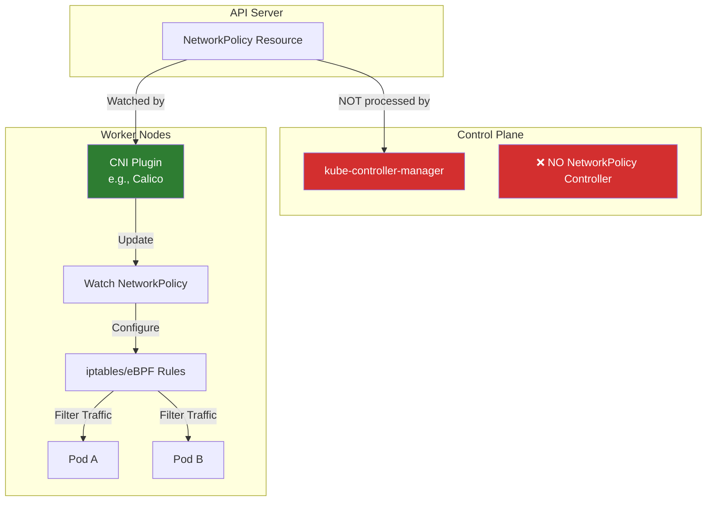
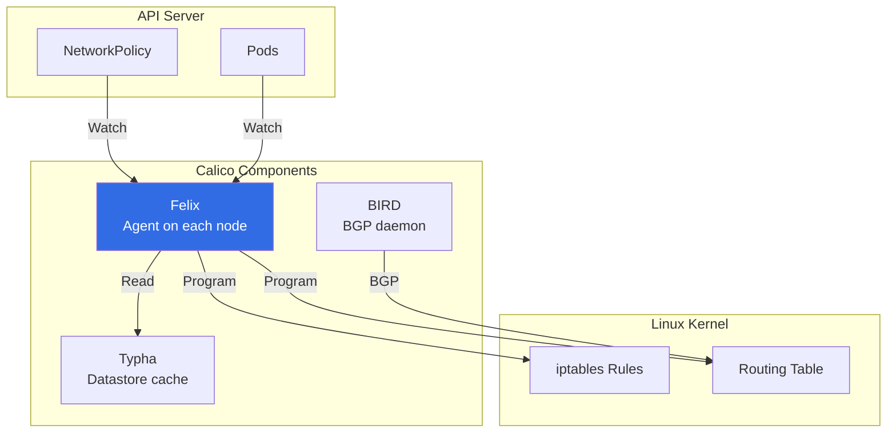

# NetworkPolicy - NOT in Kube-Controller-Manager

## Important Notice

**NetworkPolicy is NOT a controller in kube-controller-manager.**

NetworkPolicy is a **Kubernetes API resource** that defines network isolation rules for pods, but its enforcement is handled by **CNI (Container Network Interface) plugins**, not by kube-controller-manager.

## Where NetworkPolicy is Actually Enforced

### CNI Plugins with NetworkPolicy Support

NetworkPolicy resources are enforced by CNI plugins that support network policies:

**Popular CNI Plugins with NetworkPolicy Support**:
1. **Calico** - Most popular, full NetworkPolicy support
2. **Cilium** - eBPF-based, advanced features
3. **Weave Net** - Simple setup, NetworkPolicy support
4. **Antrea** - VMware-backed, OVS-based
5. **Kube-router** - IPVS-based
6. **Canal** - Combination of Flannel + Calico policies

**CNI Plugins WITHOUT NetworkPolicy Support**:
- **Flannel** (basic version) - No NetworkPolicy enforcement
- **Host-local** - Basic IPAM only
- **Bridge** - Simple bridging only

## How NetworkPolicy Works



### Architecture

```yaml
# User creates NetworkPolicy
apiVersion: networking.k8s.io/v1
kind: NetworkPolicy
metadata:
  name: deny-all
  namespace: production
spec:
  podSelector: {}
  policyTypes:
  - Ingress
  - Egress
```

**What happens**:
1. **API Server** stores the NetworkPolicy resource in etcd
2. **CNI Plugin** (e.g., Calico) watches NetworkPolicy resources
3. **CNI Plugin** translates policy to network rules (iptables, eBPF, OVS)
4. **Network rules** are applied on worker nodes
5. **Traffic is filtered** based on the policy

**kube-controller-manager**: ❌ Does NOT participate in this process

## Example: Calico NetworkPolicy Enforcement

### Calico Architecture



### Calico Felix Agent

**Felix** is Calico's per-node agent that:
1. Watches NetworkPolicy and Pod resources
2. Computes network rules for the node
3. Programs iptables (or eBPF)
4. Enforces network isolation

**Example iptables rules** created by Calico:

```bash
# Created by Calico for a "deny all ingress" policy
iptables -A cali-pi-default.deny-all -m comment --comment "deny all ingress" -j DROP

# Created for an "allow from label" policy
iptables -A cali-pi-default.allow-frontend -m set --match-set cali40s:label-app=backend -j ACCEPT
```

## Why NetworkPolicy is NOT in Controller-Manager

### Design Philosophy

**Separation of Concerns**:
- **kube-controller-manager**: Manages **cluster state** (deployments, replicasets, etc.)
- **CNI Plugins**: Manage **network datapath** (pod networking, firewalling)

**Performance**:
- Network policy enforcement requires **per-packet filtering**
- Must be done in **kernel space** (iptables, eBPF)
- Cannot be done by user-space controller

**Flexibility**:
- Different environments need different network solutions
- Cloud providers have their own network implementations
- Pluggable CNI architecture allows choice

### Comparison

| Aspect | kube-controller-manager | CNI Plugin |
|--------|-------------------------|------------|
| **Purpose** | Cluster state reconciliation | Network datapath |
| **Location** | Control plane | Worker nodes |
| **Language** | Go (user-space) | Go + kernel (iptables/eBPF) |
| **Watches** | API resources (Deployments, etc.) | NetworkPolicy, Pods |
| **Actions** | Create/update API resources | Program kernel network rules |
| **Performance** | Not latency-sensitive | Latency-critical (packet filtering) |

## NetworkPolicy Examples

### Example 1: Deny All Ingress

```yaml
apiVersion: networking.k8s.io/v1
kind: NetworkPolicy
metadata:
  name: deny-all-ingress
  namespace: production
spec:
  podSelector: {}  # Applies to all pods in namespace
  policyTypes:
  - Ingress
```

**Enforced by**: CNI plugin (e.g., Calico Felix)
**Result**: All ingress traffic to pods in `production` namespace blocked

### Example 2: Allow from Specific Labels

```yaml
apiVersion: networking.k8s.io/v1
kind: NetworkPolicy
metadata:
  name: allow-frontend
  namespace: production
spec:
  podSelector:
    matchLabels:
      app: backend
  policyTypes:
  - Ingress
  ingress:
  - from:
    - podSelector:
        matchLabels:
          app: frontend
```

**Enforced by**: CNI plugin
**Result**: Only pods with `app=frontend` can connect to `app=backend` pods

### Example 3: Egress Policy

```yaml
apiVersion: networking.k8s.io/v1
kind: NetworkPolicy
metadata:
  name: allow-dns-only
  namespace: production
spec:
  podSelector:
    matchLabels:
      app: secure-app
  policyTypes:
  - Egress
  egress:
  - to:
    - namespaceSelector:
        matchLabels:
          name: kube-system
    ports:
    - protocol: UDP
      port: 53
```

**Enforced by**: CNI plugin
**Result**: Pods can only make DNS queries, all other egress blocked

## Verifying NetworkPolicy Enforcement

### Check if CNI Supports NetworkPolicy

```bash
# Check CNI plugin
kubectl get pods -n kube-system | grep -E "calico|cilium|weave"

# For Calico
kubectl get felixconfigurations -A

# Check if NetworkPolicy is enforced
kubectl get networkpolicies -A
```

### Test NetworkPolicy

```bash
# Create a test pod
kubectl run test-pod --image=busybox --rm -it -- sh

# Try to connect to a pod that should be blocked
wget -O- http://backend-service:8080
# Should timeout if policy is enforced

# Check Calico logs
kubectl logs -n kube-system -l k8s-app=calico-node
```

### View iptables Rules (Calico)

```bash
# SSH to node and check iptables
sudo iptables-save | grep cali

# Example output:
# -A cali-pi-default.deny-all -j DROP
# -A cali-pi-default.allow-frontend -m set --match-set cali40s:app=frontend -j ACCEPT
```

## Common CNI Implementations

### Calico

**Features**:
- Full NetworkPolicy support
- BGP routing
- IP-in-IP or VXLAN encapsulation
- eBPF dataplane option

**Components**:
- **calico-node**: DaemonSet running Felix + BIRD
- **calico-kube-controllers**: Watches Kubernetes resources
- **calico-typha**: Datastore cache (optional, for scale)

### Cilium

**Features**:
- eBPF-based (faster than iptables)
- L7 NetworkPolicy support
- Service mesh integration
- Hubble observability

**Components**:
- **cilium-agent**: DaemonSet with eBPF programs
- **cilium-operator**: Cluster-wide operations
- **hubble**: Observability (optional)

### Weave Net

**Features**:
- Simple setup
- Automatic network encryption
- NetworkPolicy support
- No external datastore needed

**Components**:
- **weave-net**: DaemonSet with CNI plugin

## Related Documentation

### Kubernetes Documentation
- **NetworkPolicy**: https://kubernetes.io/docs/concepts/services-networking/network-policies/
- **CNI**: https://kubernetes.io/docs/concepts/extend-kubernetes/compute-storage-net/network-plugins/

### CNI Plugin Documentation
- **Calico**: https://docs.tigera.io/calico/latest/about/
- **Cilium**: https://docs.cilium.io/
- **Weave Net**: https://www.weave.works/docs/net/latest/overview/

### Existing Controller-Manager Documentation
- **Service/Endpoint Controllers**: `14-service-endpoint-controllers.md`
- **Node IPAM**: `32-cloud-cidr-allocator.md`
- **ServiceCIDR Controller**: `37-service-cidr-controller.md` (actual controller in kube-controller-manager)

## Summary

**Key Points**:

1. ❌ **NetworkPolicy is NOT a kube-controller-manager controller**
2. ✅ **Enforced by CNI plugins** (Calico, Cilium, Weave, etc.)
3. 🔧 **Requires CNI plugin with NetworkPolicy support**
4. 📍 **Runs on worker nodes**, not control plane
5. ⚡ **Kernel-space enforcement** (iptables/eBPF), not user-space

**To use NetworkPolicy**:
- Install a CNI plugin with NetworkPolicy support (e.g., Calico)
- Create NetworkPolicy resources via Kubernetes API
- CNI plugin watches and enforces policies on nodes

**kube-controller-manager's role**: None. NetworkPolicy is purely a CNI concern.

---

**Next Document**: `34-ingress-not-in-controller-manager.md` - Ingress controllers (also not in kube-controller-manager)
