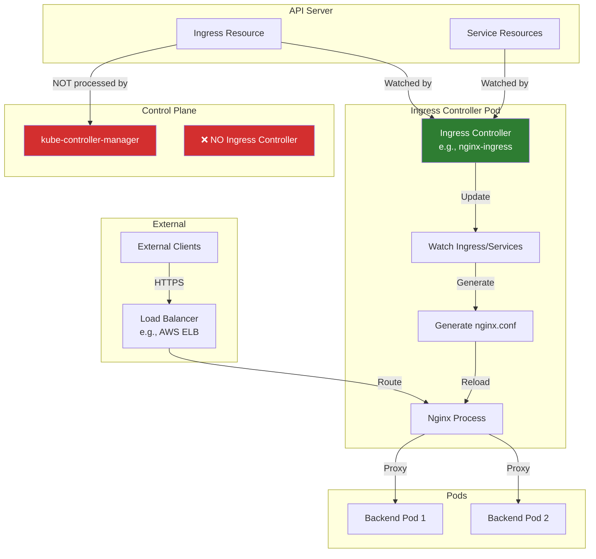

# Ingress - NOT in Kube-Controller-Manager

## Important Notice

**Ingress controllers are NOT part of kube-controller-manager.**

Ingress is a **Kubernetes API resource** that defines HTTP/HTTPS routing rules, but Ingress controllers that actually implement this routing are **separate, external components**, not part of kube-controller-manager.

## Where Ingress is Actually Implemented

### External Ingress Controllers

Ingress resources are implemented by **Ingress controllers** - standalone applications that watch Ingress resources and configure load balancers/proxies:

**Popular Ingress Controllers**:
1. **ingress-nginx** - Official Kubernetes project, nginx-based
2. **Traefik** - Modern, dynamic, supports TCP/UDP
3. **HAProxy Ingress** - High-performance HAProxy-based
4. **Contour** - Envoy-based, VMware-backed
5. **Ambassador/Emissary** - Envoy-based, API Gateway features
6. **Kong** - API Gateway with Ingress support
7. **Istio Ingress Gateway** - Service mesh integration
8. **Cloud Provider Ingress** - AWS ALB, GCE, Azure App Gateway

## How Ingress Works



### Architecture

```yaml
# User creates Ingress resource
apiVersion: networking.k8s.io/v1
kind: Ingress
metadata:
  name: example-ingress
  annotations:
    nginx.ingress.kubernetes.io/rewrite-target: /
spec:
  ingressClassName: nginx
  rules:
  - host: example.com
    http:
      paths:
      - path: /api
        pathType: Prefix
        backend:
          service:
            name: api-service
            port:
              number: 8080
      - path: /web
        pathType: Prefix
        backend:
          service:
            name: web-service
            port:
              number: 80
```

**What happens**:
1. **API Server** stores the Ingress resource in etcd
2. **Ingress Controller** (e.g., nginx-ingress) watches Ingress resources
3. **Ingress Controller** generates configuration (e.g., nginx.conf)
4. **Proxy/Load Balancer** (nginx, HAProxy, etc.) reloads with new config
5. **Traffic is routed** based on host/path rules

**kube-controller-manager**: ❌ Does NOT participate in this process

## Example: NGINX Ingress Controller

### NGINX Ingress Architecture

```mermaid
graph TB
    subgraph "NGINX Ingress Controller Pod"
        Controller[Ingress Controller<br/>Go binary]
        Nginx[Nginx<br/>Reverse Proxy]
        Watch[Watch Loop]
    end

    subgraph "API Server"
        IngressAPI[Ingress Resources]
        ServiceAPI[Service Resources]
        EndpointAPI[Endpoint Resources]
    end

    subgraph "Generated Config"
        NginxConf[/etc/nginx/nginx.conf]
        Lua[Lua Scripts]
    end

    subgraph "Backend Services"
        Pod1[Pod 1: 10.244.1.5:8080]
        Pod2[Pod 2: 10.244.1.6:8080]
        Pod3[Pod 3: 10.244.2.7:8080]
    end

    IngressAPI -->|Watch| Watch
    ServiceAPI -->|Watch| Watch
    EndpointAPI -->|Watch| Watch
    Watch -->|Reconcile| Controller
    Controller -->|Generate| NginxConf
    Controller -->|Generate| Lua
    NginxConf -->|Configure| Nginx
    Lua -->|Dynamic Routing| Nginx
    Nginx -->|Load Balance| Pod1
    Nginx -->|Load Balance| Pod2
    Nginx -->|Load Balance| Pod3

    style Controller fill:#326ce5,color:#fff
```

### How NGINX Ingress Controller Works

**Components**:
1. **Ingress Controller** (Go): Watches API, generates config
2. **Nginx**: Reverse proxy, handles HTTP/HTTPS traffic
3. **Lua modules**: Dynamic backend updates (no reload needed)

**Reconciliation Loop**:

```go
// Pseudo-code for nginx-ingress controller

func (ic *IngressController) Run() {
    for {
        // Watch Ingress, Service, Endpoint resources
        ingresses := ic.ingressLister.List()
        services := ic.serviceLister.List()
        endpoints := ic.endpointLister.List()

        // Build nginx configuration
        config := ic.generateNginxConfig(ingresses, services, endpoints)

        // Write to /etc/nginx/nginx.conf
        ic.writeConfig(config)

        // Reload nginx (or use Lua for dynamic updates)
        ic.reloadNginx()

        // Sleep until next event
        <-ic.queue.Get()
    }
}
```

**Generated nginx.conf excerpt**:

```nginx
# Generated by nginx-ingress controller

upstream example-api-service-8080 {
    server 10.244.1.5:8080 max_fails=0 fail_timeout=0;
    server 10.244.1.6:8080 max_fails=0 fail_timeout=0;
}

server {
    listen 80;
    server_name example.com;

    location /api {
        proxy_pass http://example-api-service-8080;
        proxy_http_version 1.1;
        proxy_set_header Host $host;
    }

    location /web {
        proxy_pass http://example-web-service-80;
    }
}
```

## Why Ingress is NOT in Controller-Manager

### Design Philosophy

**Ingress is a Reverse Proxy, Not a Controller**:
- **kube-controller-manager**: Reconciles **Kubernetes resources**
- **Ingress controllers**: Provide **HTTP routing and load balancing**

**Multiple Implementations**:
- Different organizations have different proxy preferences (nginx, HAProxy, Envoy)
- Cloud providers have native solutions (AWS ALB, GCE Ingress)
- No single implementation fits all use cases

**Deployment Flexibility**:
- Ingress controllers run **as pods** in the cluster
- Can be scaled independently
- Can run in different namespaces
- Can have different implementations per namespace

### Comparison

| Aspect | kube-controller-manager | Ingress Controller |
|--------|-------------------------|---------------------|
| **Purpose** | Cluster state reconciliation | HTTP/HTTPS routing |
| **Location** | Control plane | Deployed as pods |
| **Implementation** | Built into Kubernetes | External project |
| **Multiple instances** | One per cluster | Multiple per cluster possible |
| **What it manages** | Kubernetes resources | HTTP traffic routing |
| **Configuration** | Flags/Config file | Ingress resources |
| **Dependencies** | None (core) | Nginx/HAProxy/Envoy/etc. |

## Ingress Controller Implementations

### 1. NGINX Ingress Controller

**Official Kubernetes Project**: https://github.com/kubernetes/ingress-nginx

**Features**:
- Nginx-based reverse proxy
- SSL/TLS termination
- Path-based and host-based routing
- Rate limiting
- Authentication
- WebSocket support

**Installation**:
```bash
kubectl apply -f https://raw.githubusercontent.com/kubernetes/ingress-nginx/main/deploy/static/provider/cloud/deploy.yaml
```

**IngressClass**:
```yaml
apiVersion: networking.k8s.io/v1
kind: IngressClass
metadata:
  name: nginx
spec:
  controller: k8s.io/ingress-nginx
```

### 2. Traefik

**Project**: https://traefik.io/traefik/

**Features**:
- Dynamic configuration
- Automatic HTTPS with Let's Encrypt
- TCP/UDP support
- Service mesh integration
- Middleware system

**Installation**:
```bash
helm install traefik traefik/traefik
```

### 3. HAProxy Ingress

**Project**: https://haproxy-ingress.github.io/

**Features**:
- High-performance HAProxy
- Blue/green deployment
- Canary deployment
- Circuit breaking

### 4. Contour (Envoy-based)

**Project**: https://projectcontour.io/

**Features**:
- Envoy proxy
- HTTPProxy CRD (extension)
- Multi-tenancy
- gRPC support

### 5. Cloud Provider Ingress

**AWS ALB Ingress Controller**:
- Creates AWS Application Load Balancer
- Native AWS integration
- Targets pods directly (no NodePort needed)

**GCE Ingress**:
- Creates Google Cloud Load Balancer
- Integrated with GKE
- Google Cloud Armor support

## Ingress Examples

### Example 1: Simple Host-Based Routing

```yaml
apiVersion: networking.k8s.io/v1
kind: Ingress
metadata:
  name: host-based-ingress
spec:
  ingressClassName: nginx
  rules:
  - host: api.example.com
    http:
      paths:
      - path: /
        pathType: Prefix
        backend:
          service:
            name: api-service
            port:
              number: 8080
  - host: web.example.com
    http:
      paths:
      - path: /
        pathType: Prefix
        backend:
          service:
            name: web-service
            port:
              number: 80
```

**Enforced by**: Ingress controller (not kube-controller-manager)
**Result**:
- `api.example.com` → api-service:8080
- `web.example.com` → web-service:80

### Example 2: Path-Based Routing with TLS

```yaml
apiVersion: networking.k8s.io/v1
kind: Ingress
metadata:
  name: path-based-ingress
spec:
  ingressClassName: nginx
  tls:
  - hosts:
    - example.com
    secretName: example-tls
  rules:
  - host: example.com
    http:
      paths:
      - path: /api
        pathType: Prefix
        backend:
          service:
            name: api-service
            port:
              number: 8080
      - path: /web
        pathType: Prefix
        backend:
          service:
            name: web-service
            port:
              number: 80
      - path: /
        pathType: Prefix
        backend:
          service:
            name: default-service
            port:
              number: 80
```

**Enforced by**: Ingress controller
**Result**:
- `https://example.com/api/*` → api-service:8080
- `https://example.com/web/*` → web-service:80
- `https://example.com/*` → default-service:80

### Example 3: Annotations for Advanced Features

```yaml
apiVersion: networking.k8s.io/v1
kind: Ingress
metadata:
  name: advanced-ingress
  annotations:
    # NGINX-specific annotations
    nginx.ingress.kubernetes.io/rewrite-target: /$2
    nginx.ingress.kubernetes.io/rate-limit: "10"
    nginx.ingress.kubernetes.io/cors-allow-origin: "*"
    nginx.ingress.kubernetes.io/ssl-redirect: "true"
spec:
  ingressClassName: nginx
  rules:
  - host: example.com
    http:
      paths:
      - path: /v1(/|$)(.*)
        pathType: ImplementationSpecific
        backend:
          service:
            name: api-v1
            port:
              number: 8080
```

**Annotations** are controller-specific (nginx, traefik, etc.)

## Verifying Ingress Controller

### Check if Ingress Controller is Installed

```bash
# Check for ingress controller pods
kubectl get pods -n ingress-nginx
kubectl get pods -A | grep ingress

# Check IngressClass
kubectl get ingressclass
# NAME    CONTROLLER             PARAMETERS   AGE
# nginx   k8s.io/ingress-nginx   <none>       5d

# Check Ingress resources
kubectl get ingress -A
```

### Test Ingress

```bash
# Get ingress external IP
kubectl get svc -n ingress-nginx ingress-nginx-controller
# NAME                       TYPE           EXTERNAL-IP
# ingress-nginx-controller   LoadBalancer   34.123.45.67

# Test with curl
curl -H "Host: example.com" http://34.123.45.67/api
```

### View Ingress Controller Logs

```bash
# NGINX Ingress
kubectl logs -n ingress-nginx -l app.kubernetes.io/name=ingress-nginx

# Check nginx config
kubectl exec -n ingress-nginx <pod-name> -- cat /etc/nginx/nginx.conf
```

## Multiple Ingress Controllers

You can run **multiple ingress controllers** in the same cluster:

```yaml
# NGINX Ingress
apiVersion: networking.k8s.io/v1
kind: Ingress
metadata:
  name: nginx-ingress
spec:
  ingressClassName: nginx  # Routes to nginx controller
  rules: [...]

---

# Traefik Ingress
apiVersion: networking.k8s.io/v1
kind: Ingress
metadata:
  name: traefik-ingress
spec:
  ingressClassName: traefik  # Routes to traefik controller
  rules: [...]
```

**Use cases**:
- Internal vs. external traffic (different controllers)
- Different teams using different controllers
- Migration from one controller to another

## Ingress vs. Service Type=LoadBalancer

**Ingress**:
- ✅ Layer 7 (HTTP/HTTPS) routing
- ✅ Host-based and path-based routing
- ✅ Single load balancer for multiple services
- ✅ SSL/TLS termination
- ❌ No TCP/UDP routing (unless controller supports it)

**Service Type=LoadBalancer**:
- ✅ Layer 4 (TCP/UDP) load balancing
- ✅ Simple setup
- ❌ One load balancer per service (can be expensive)
- ❌ No HTTP routing features

**When to use each**:
- **Ingress**: Multiple HTTP services, need routing/SSL
- **LoadBalancer**: Single service, TCP/UDP, or when Ingress not available

## Related Documentation

### Kubernetes Documentation
- **Ingress**: https://kubernetes.io/docs/concepts/services-networking/ingress/
- **IngressClass**: https://kubernetes.io/docs/concepts/services-networking/ingress/#ingress-class

### Ingress Controller Documentation
- **NGINX Ingress**: https://kubernetes.github.io/ingress-nginx/
- **Traefik**: https://doc.traefik.io/traefik/providers/kubernetes-ingress/
- **Contour**: https://projectcontour.io/docs/
- **HAProxy**: https://haproxy-ingress.github.io/docs/

### Existing Controller-Manager Documentation
- **Service Controllers**: `14-service-endpoint-controllers.md` (manages Service resources)
- **Cloud Service Controller**: `31-cloud-service-controllers.md` (manages LoadBalancer services)

## Summary

**Key Points**:

1. ❌ **Ingress controllers are NOT part of kube-controller-manager**
2. ✅ **Separate applications** (nginx-ingress, Traefik, etc.)
3. 🚀 **Deployed as pods** in the cluster
4. 🔄 **Watch Ingress resources** and configure reverse proxies
5. 🌐 **Provide HTTP/HTTPS routing** and load balancing
6. 🔧 **Multiple controllers** can coexist in one cluster

**To use Ingress**:
1. Install an Ingress controller (e.g., `kubectl apply -f ingress-nginx.yaml`)
2. Create Ingress resources pointing to services
3. Ingress controller configures proxy (nginx, HAProxy, etc.)
4. External clients access cluster via Ingress

**kube-controller-manager's role**: None. Ingress is implemented by external controllers.

**What kube-controller-manager DOES manage**:
- Service resources (endpoint controller)
- LoadBalancer type services (cloud service controller)
- NOT Ingress routing

---

**Next Document**: `35-dns-not-in-controller-manager.md` - DNS (CoreDNS, also not in kube-controller-manager)
