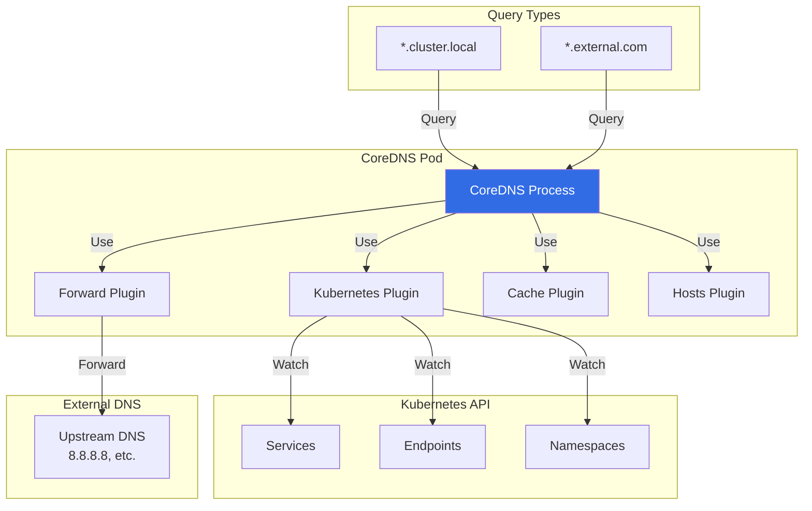

# DNS - NOT in Kube-Controller-Manager

## Important Notice

**DNS is NOT a controller in kube-controller-manager.**

Cluster DNS in Kubernetes is provided by a **separate DNS server** (CoreDNS or legacy kube-dns), deployed as pods in the `kube-system` namespace, not by kube-controller-manager.

## Where DNS is Actually Implemented

### CoreDNS (Modern Default)

**CoreDNS** is the default DNS server for Kubernetes clusters (since v1.13):

- **Deployment**: Runs as a Deployment in `kube-system` namespace
- **Service**: Exposed via a ClusterIP Service (`kube-dns`)
- **Configuration**: ConfigMap with Corefile
- **Purpose**: Resolves service names to ClusterIPs

### Legacy kube-dns

**kube-dns** was the original DNS solution (deprecated, but still exists in old clusters):

- **Components**: kube-dns, dnsmasq, sidecar
- **Replaced by**: CoreDNS
- **Status**: Deprecated, use CoreDNS instead

## How Cluster DNS Works

```mermaid
graph TB
    subgraph "Control Plane"
        API[API Server]
        KCM[kube-controller-manager]
        Note1[❌ NO DNS Controller]
    end

    subgraph "kube-system Namespace"
        CoreDNS[CoreDNS Pod<br/>Deployment]
        DNSService[kube-dns Service<br/>ClusterIP: 10.96.0.10]
        ConfigMap[CoreDNS ConfigMap<br/>Corefile]
    end

    subgraph "Worker Nodes"
        Kubelet[Kubelet]
        Pod1[Application Pod]
        ResolvConf[/etc/resolv.conf]
    end

    subgraph "DNS Resolution"
        Query[DNS Query<br/>my-service.default.svc.cluster.local]
        Response[DNS Response<br/>10.96.1.5]
    end

    API -->|Watches Services/Endpoints| CoreDNS
    API -->|NOT processed by| KCM
    ConfigMap -->|Configure| CoreDNS
    CoreDNS -->|Exposed via| DNSService
    Kubelet -->|Configure| ResolvConf
    ResolvConf -->|nameserver 10.96.0.10| Pod1
    Pod1 -->|DNS Query| Query
    Query -->|Sent to| DNSService
    DNSService -->|Routes to| CoreDNS
    CoreDNS -->|Lookup Service| API
    CoreDNS -->|Return IP| Response
    Response -->|Received by| Pod1

    style KCM fill:#d32f2f,color:#fff
    style Note1 fill:#d32f2f,color:#fff
    style CoreDNS fill:#2e7d32,color:#fff
```

### DNS Resolution Flow

**Example**: Pod resolves `my-service.default.svc.cluster.local`

1. **Pod** reads `/etc/resolv.conf` → nameserver is `10.96.0.10` (kube-dns Service)
2. **Pod** sends DNS query to `10.96.0.10`
3. **kube-dns Service** routes to CoreDNS pod
4. **CoreDNS** watches Kubernetes API for Service resources
5. **CoreDNS** looks up Service `my-service` in namespace `default`
6. **CoreDNS** returns ClusterIP (e.g., `10.96.1.5`)
7. **Pod** receives DNS response and connects to `10.96.1.5`

**kube-controller-manager**: ❌ Does NOT participate in this process

## CoreDNS Architecture



### CoreDNS Plugins

**Kubernetes Plugin**:
- Watches Services, Endpoints, Namespaces
- Resolves `*.cluster.local` and reverse DNS
- Handles service discovery

**Forward Plugin**:
- Forwards external queries (e.g., `google.com`) to upstream DNS
- Default: `/etc/resolv.conf` or configured servers

**Cache Plugin**:
- Caches DNS responses
- Reduces API server load
- TTL-based expiration

**Hosts Plugin**:
- Custom DNS entries from `/etc/hosts`

## CoreDNS Configuration

### Corefile Example

```bash
# CoreDNS Corefile (stored in ConfigMap)

.:53 {
    errors
    health {
       lameduck 5s
    }
    ready
    kubernetes cluster.local in-addr.arpa ip6.arpa {
       pods insecure
       fallthrough in-addr.arpa ip6.arpa
       ttl 30
    }
    prometheus :9153
    forward . /etc/resolv.conf {
       max_concurrent 1000
    }
    cache 30
    loop
    reload
    loadbalance
}
```

**Breakdown**:
- `.:53` - Listen on port 53 for all domains
- `kubernetes cluster.local` - Handle Kubernetes DNS (*.cluster.local)
- `forward . /etc/resolv.conf` - Forward external queries upstream
- `cache 30` - Cache responses for 30 seconds

### Kubernetes Plugin Configuration

```
kubernetes cluster.local in-addr.arpa ip6.arpa {
    pods insecure      # Resolve pod DNS (A records)
    fallthrough in-addr.arpa ip6.arpa  # Fallback for reverse DNS
    ttl 30             # TTL for DNS records
}
```

**What it resolves**:
- `my-service.default.svc.cluster.local` → Service ClusterIP
- `10-244-1-5.default.pod.cluster.local` → Pod IP (if pods=insecure)
- `my-service.default` → Service ClusterIP (search domain)

## Why DNS is NOT in Controller-Manager

### Design Philosophy

**DNS is a Separate Service, Not a Controller**:
- **kube-controller-manager**: Reconciles Kubernetes resource state
- **CoreDNS**: Provides name resolution service

**Deployment Flexibility**:
- DNS can be scaled independently
- Different DNS solutions (CoreDNS, kube-dns, external DNS)
- Can be configured differently per cluster

**Performance**:
- DNS queries are latency-sensitive
- Running as deployment allows horizontal scaling
- Can leverage caching and load balancing

### Comparison

| Aspect | kube-controller-manager | CoreDNS |
|--------|-------------------------|---------|
| **Purpose** | Cluster state reconciliation | Name resolution |
| **Location** | Control plane (static pod) | Deployed as Deployment |
| **Scaling** | One per cluster | Scale with replicas |
| **Configuration** | Flags/config file | Corefile (ConfigMap) |
| **What it does** | Manages resources | Resolves DNS queries |
| **Watches** | All Kubernetes resources | Services, Endpoints |
| **Clients** | None (internal only) | All pods in cluster |
| **Latency** | Not latency-sensitive | Latency-critical (DNS) |

## DNS Resolution Examples

### Example 1: Service DNS

```yaml
apiVersion: v1
kind: Service
metadata:
  name: my-service
  namespace: production
spec:
  clusterIP: 10.96.15.20
  ports:
  - port: 8080
```

**DNS Records Created by CoreDNS**:
```
my-service.production.svc.cluster.local → 10.96.15.20
my-service.production.svc → 10.96.15.20
my-service.production → 10.96.15.20 (if in same namespace)
```

**Resolution**:
```bash
# From a pod in "production" namespace
nslookup my-service
# Server:    10.96.0.10
# Address 1: 10.96.0.10 kube-dns.kube-system.svc.cluster.local
#
# Name:      my-service
# Address 1: 10.96.15.20 my-service.production.svc.cluster.local
```

### Example 2: Headless Service (StatefulSet)

```yaml
apiVersion: v1
kind: Service
metadata:
  name: mysql
  namespace: database
spec:
  clusterIP: None  # Headless
  selector:
    app: mysql
```

```yaml
apiVersion: apps/v1
kind: StatefulSet
metadata:
  name: mysql
  namespace: database
spec:
  serviceName: mysql
  replicas: 3
  selector:
    matchLabels:
      app: mysql
  template:
    metadata:
      labels:
        app: mysql
    spec:
      containers:
      - name: mysql
        image: mysql:8.0
```

**DNS Records Created**:
```
mysql.database.svc.cluster.local → Pod IPs (10.244.1.5, 10.244.2.6, 10.244.3.7)
mysql-0.mysql.database.svc.cluster.local → 10.244.1.5
mysql-1.mysql.database.svc.cluster.local → 10.244.2.6
mysql-2.mysql.database.svc.cluster.local → 10.244.3.7
```

**Use case**: StatefulSet pods get stable DNS names

### Example 3: Pod DNS (if enabled)

```yaml
apiVersion: v1
kind: Pod
metadata:
  name: my-pod
  namespace: default
spec:
  hostname: custom-hostname
  subdomain: my-subdomain
  containers:
  - name: app
    image: nginx
```

**Pod IP**: `10.244.1.15`

**DNS Records Created**:
```
# Standard pod DNS (if pods=insecure)
10-244-1-15.default.pod.cluster.local → 10.244.1.15

# Custom hostname (if subdomain set)
custom-hostname.my-subdomain.default.svc.cluster.local → 10.244.1.15
```

## Verifying DNS

### Check CoreDNS Installation

```bash
# Check CoreDNS deployment
kubectl get deployment -n kube-system coredns
# NAME      READY   UP-TO-DATE   AVAILABLE   AGE
# coredns   2/2     2            2           5d

# Check kube-dns service
kubectl get svc -n kube-system kube-dns
# NAME       TYPE        CLUSTER-IP   EXTERNAL-IP   PORT(S)         AGE
# kube-dns   ClusterIP   10.96.0.10   <none>        53/UDP,53/TCP   5d

# Check CoreDNS pods
kubectl get pods -n kube-system -l k8s-app=kube-dns
```

### Test DNS Resolution

```bash
# Run a test pod
kubectl run test-dns --image=busybox:1.28 --rm -it -- sh

# Inside pod, check /etc/resolv.conf
cat /etc/resolv.conf
# nameserver 10.96.0.10
# search default.svc.cluster.local svc.cluster.local cluster.local
# options ndots:5

# Test service DNS
nslookup kubernetes.default
# Server:    10.96.0.10
# Address 1: 10.96.0.10 kube-dns.kube-system.svc.cluster.local
#
# Name:      kubernetes.default
# Address 1: 10.96.0.1 kubernetes.default.svc.cluster.local

# Test external DNS
nslookup google.com
# Should resolve (forwarded to upstream)
```

### View CoreDNS Logs

```bash
# Check CoreDNS logs
kubectl logs -n kube-system -l k8s-app=kube-dns

# Common log entries:
# [INFO] plugin/kubernetes: waiting for Kubernetes API before starting server
# [INFO] Reloading
# [INFO] plugin/ready: Still waiting on: "kubernetes"
# [INFO] plugin/ready: server become ready
```

### View CoreDNS Configuration

```bash
# Get CoreDNS ConfigMap
kubectl get configmap -n kube-system coredns -o yaml

# Edit CoreDNS config
kubectl edit configmap -n kube-system coredns
# CoreDNS will automatically reload
```

## Common DNS Issues

### Problem: DNS Resolution Fails

**Symptoms**:
```bash
# From pod
nslookup kubernetes.default
# Server:    10.96.0.10
# Address 1: 10.96.0.10
#
# nslookup: can't resolve 'kubernetes.default'
```

**Diagnosis**:
```bash
# Check CoreDNS pods are running
kubectl get pods -n kube-system -l k8s-app=kube-dns

# Check CoreDNS logs
kubectl logs -n kube-system -l k8s-app=kube-dns

# Check kube-dns service exists
kubectl get svc -n kube-system kube-dns
```

**Causes**:
1. CoreDNS pods not running
2. kube-dns service missing/wrong IP
3. Network policy blocking DNS traffic
4. CoreDNS config error

### Problem: External DNS Not Working

**Symptoms**:
```bash
nslookup google.com
# ;; connection timed out; no servers could be reached
```

**Diagnosis**:
```bash
# Check CoreDNS Corefile for forward plugin
kubectl get cm -n kube-system coredns -o yaml | grep forward
# forward . /etc/resolv.conf

# Check node's /etc/resolv.conf
cat /etc/resolv.conf
# Should have valid upstream DNS (8.8.8.8, etc.)
```

**Solution**:
```bash
# Update Corefile to use specific upstream DNS
kubectl edit cm -n kube-system coredns

# Change:
forward . /etc/resolv.conf
# To:
forward . 8.8.8.8 8.8.4.4
```

## Custom DNS Configuration

### Add Custom DNS Entries

```yaml
apiVersion: v1
kind: ConfigMap
metadata:
  name: coredns
  namespace: kube-system
data:
  Corefile: |
    .:53 {
        errors
        health
        kubernetes cluster.local in-addr.arpa ip6.arpa {
           pods insecure
           fallthrough in-addr.arpa ip6.arpa
        }
        # Custom DNS entries
        hosts {
            10.0.1.100 custom-service.example.com
            fallthrough
        }
        prometheus :9153
        forward . 8.8.8.8 8.8.4.4
        cache 30
        loop
        reload
        loadbalance
    }
```

### Configure Pod DNS Policy

```yaml
apiVersion: v1
kind: Pod
metadata:
  name: custom-dns-pod
spec:
  dnsPolicy: "None"  # Override default
  dnsConfig:
    nameservers:
    - 1.1.1.1  # Custom DNS server
    searches:
    - ns1.svc.cluster.local
    - my.dns.search.suffix
    options:
    - name: ndots
      value: "2"
  containers:
  - name: app
    image: nginx
```

## Related Documentation

### Kubernetes Documentation
- **DNS for Services and Pods**: https://kubernetes.io/docs/concepts/services-networking/dns-pod-service/
- **Customizing DNS Service**: https://kubernetes.io/docs/tasks/administer-cluster/dns-custom-nameservers/

### CoreDNS Documentation
- **CoreDNS**: https://coredns.io/
- **Kubernetes Plugin**: https://coredns.io/plugins/kubernetes/

### Existing Controller-Manager Documentation
- **Service/Endpoint Controllers**: `14-service-endpoint-controllers.md` (creates Endpoints that CoreDNS watches)
- **EndpointSlice Controllers**: `14-service-endpoint-controllers.md` (newer endpoint representation)

## Summary

**Key Points**:

1. ❌ **DNS is NOT a kube-controller-manager controller**
2. ✅ **CoreDNS** (or legacy kube-dns) provides cluster DNS
3. 🚀 **Deployed as Deployment** in kube-system namespace
4. 🔄 **Watches Services/Endpoints** from Kubernetes API
5. 🌐 **Resolves service names** to ClusterIPs
6. ⚙️ **Configured via ConfigMap** (Corefile)
7. 🔁 **Forwards external queries** to upstream DNS

**To use cluster DNS**:
1. CoreDNS is automatically installed (default since k8s 1.13)
2. Kubelet configures `/etc/resolv.conf` in pods
3. Pods query CoreDNS for service names
4. CoreDNS watches API and returns Service ClusterIPs

**kube-controller-manager's role**: None. DNS is provided by CoreDNS.

**What kube-controller-manager DOES manage**:
- Service resources (endpoint controller)
- Endpoints that CoreDNS watches
- NOT DNS resolution itself

---

**Next Document**: `36-endpoint-reconciler-already-documented.md` - Endpoint reconciliation (already in doc 14)
