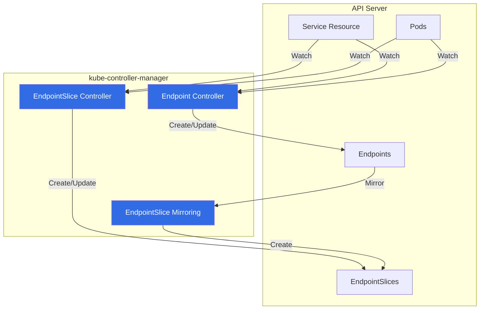

# Endpoint Reconciler - Already Documented

## Important Notice

**Endpoint reconciliation IS a controller in kube-controller-manager**, and it has **already been comprehensively documented** in an earlier document.

## Where to Find This Documentation

**See**: `14-service-endpoint-controllers.md`

This document already covers:
- **Endpoint Controller**: Creates and manages Endpoint resources from Services
- **EndpointSlice Controller**: Modern replacement for Endpoints (scalable)
- **EndpointSlice Mirroring Controller**: Migrates Endpoints → EndpointSlices

## Quick Reference

### Controllers Already Documented

**Document 14** (`14-service-endpoint-controllers.md`) includes:

1. **Endpoint Controller**
   - Location: `pkg/controller/endpoint/endpoints_controller.go`
   - Creates Endpoint resources from Service + Pod selectors
   - Reconciles when Services or Pods change
   - Legacy controller (still in use, but EndpointSlice preferred)

2. **EndpointSlice Controller**
   - Location: `pkg/controller/endpointslice/endpointslice_controller.go`
   - Modern replacement for Endpoints
   - Better scalability (100 endpoints per slice vs. single object)
   - Dual-stack support
   - Topology-aware routing

3. **EndpointSlice Mirroring Controller**
   - Location: `pkg/controller/endpointslicemirroring/endpointslice_mirroring_controller.go`
   - Mirrors Endpoints → EndpointSlices
   - Enables migration from legacy Endpoints
   - Maintains compatibility during transition

### Quick Architecture Reference



### What These Controllers Do

**Endpoint Controller** (Legacy):
```yaml
# Service
apiVersion: v1
kind: Service
metadata:
  name: my-service
spec:
  selector:
    app: backend
  ports:
  - port: 8080
```

**Creates**:
```yaml
# Endpoints (automatically created)
apiVersion: v1
kind: Endpoints
metadata:
  name: my-service  # Same name as Service
subsets:
- addresses:
  - ip: 10.244.1.5
    targetRef:
      kind: Pod
      name: backend-pod-1
  - ip: 10.244.2.6
    targetRef:
      kind: Pod
      name: backend-pod-2
  ports:
  - port: 8080
```

**EndpointSlice Controller** (Modern):

**Creates**:
```yaml
# EndpointSlice (automatically created)
apiVersion: discovery.k8s.io/v1
kind: EndpointSlice
metadata:
  name: my-service-abcd1
  labels:
    kubernetes.io/service-name: my-service
addressType: IPv4
ports:
- port: 8080
  protocol: TCP
endpoints:
- addresses:
  - 10.244.1.5
  conditions:
    ready: true
  targetRef:
    kind: Pod
    name: backend-pod-1
- addresses:
  - 10.244.2.6
  conditions:
    ready: true
  targetRef:
    kind: Pod
    name: backend-pod-2
```

## Why EndpointSlices?

**Scalability Problem with Endpoints**:
- Single Endpoint object per Service
- 1000 pods = 1 large Endpoint object (>1MB)
- Every pod change = full Endpoint update
- High API server load for large services

**EndpointSlice Solution**:
- Multiple EndpointSlice objects per Service
- Max 100 endpoints per slice (default)
- 1000 pods = 10 EndpointSlices (~100KB each)
- Pod changes only update relevant slice
- Reduced API server load

**Example**:
```
Service with 500 pods:
  Legacy Endpoints: 1 object, ~500KB
  EndpointSlices:   5 objects, ~50KB each

Pod change:
  Legacy: Update 500KB object
  EndpointSlice: Update 1 slice (~50KB)
```

## Additional Topics in Document 14

The existing documentation covers:

1. **Architecture Diagrams**
   - Component relationships
   - State machine diagrams
   - Sequence diagrams

2. **Algorithms**
   - Endpoint reconciliation logic
   - EndpointSlice partitioning algorithm
   - Mirroring logic

3. **Data Structures**
   - Go struct definitions
   - Source code references

4. **Configuration**
   - Controller flags
   - Feature gates (EndpointSliceTerminatingCondition, etc.)

5. **Troubleshooting**
   - Endpoints not created
   - EndpointSlice migration issues
   - Performance tuning

6. **Performance**
   - Scalability limits
   - Metrics
   - Optimization strategies

## Migration Path: Endpoints → EndpointSlices

**Phase 1**: Legacy (Endpoints only)
```
Service → Endpoint Controller → Endpoints
```

**Phase 2**: Dual Mode (both enabled)
```
Service → Endpoint Controller → Endpoints
      └→ EndpointSlice Controller → EndpointSlices
      └→ Mirroring Controller: Endpoints → EndpointSlices
```

**Phase 3**: EndpointSlice Only (future)
```
Service → EndpointSlice Controller → EndpointSlices
```

**Current Status** (as of Kubernetes 1.30):
- Both Endpoints and EndpointSlices are created
- Consumers (kube-proxy, Ingress controllers) prefer EndpointSlices
- Endpoints maintained for backward compatibility
- Eventually, Endpoint controller will be deprecated

## Consumers of Endpoints/EndpointSlices

**Components that read these resources**:

1. **kube-proxy**
   - Reads Endpoints/EndpointSlices
   - Configures iptables/IPVS rules for service routing
   - Primary consumer

2. **CoreDNS**
   - Uses Endpoints for service DNS records
   - Returns pod IPs for headless services

3. **Ingress Controllers**
   - Read EndpointSlices to route traffic to backend pods
   - Prefer EndpointSlices for scalability

4. **Service Mesh (Istio, Linkerd)**
   - Watch EndpointSlices for service discovery
   - Configure sidecar proxies

5. **Cloud Provider Load Balancers**
   - Some use Endpoints/EndpointSlices to configure backend targets

## Related Controllers in kube-controller-manager

### Service Controller

**Document**: `14-service-endpoint-controllers.md` (same document)

**Purpose**: Manages Service resources (not to be confused with Endpoint controller)

**What it does**:
- Allocates ClusterIPs from service CIDR
- Manages Service lifecycle
- Does NOT create Endpoints (that's Endpoint controller's job)

### Cloud Service Controller

**Document**: `31-cloud-service-controllers.md`

**Purpose**: Manages LoadBalancer-type Services with cloud providers

**What it does**:
- Creates cloud load balancers (AWS ELB, GCE LB, etc.)
- Syncs node backends to load balancer
- Does NOT manage Endpoints (but reads them for backend sync)

## Verification

### Check Endpoint Controllers are Running

```bash
# Check kube-controller-manager logs
kubectl logs -n kube-system kube-controller-manager-xxx | grep endpoint

# Expected:
# Starting endpoint controller
# Starting endpointslice controller
# Starting endpointslice-mirroring controller
```

### View Endpoints and EndpointSlices

```bash
# Create a test service
kubectl create deployment nginx --image=nginx --replicas=3
kubectl expose deployment nginx --port=80

# Check Endpoints (legacy)
kubectl get endpoints nginx
# NAME    ENDPOINTS                                   AGE
# nginx   10.244.1.5:80,10.244.2.6:80,10.244.3.7:80   5s

# Check EndpointSlices (modern)
kubectl get endpointslices -l kubernetes.io/service-name=nginx
# NAME          ADDRESSTYPE   PORTS   ENDPOINTS                             AGE
# nginx-abcd1   IPv4          80      10.244.1.5,10.244.2.6,10.244.3.7      5s

# Detailed view
kubectl get endpointslice nginx-abcd1 -o yaml
```

## Cross-References

### Primary Documentation

**📄 Document 14: Service/Endpoint Controllers**
- File: `14-service-endpoint-controllers.md`
- Sections:
  - Endpoint Controller (pages 3-15)
  - EndpointSlice Controller (pages 16-30)
  - EndpointSlice Mirroring (pages 31-40)
  - Troubleshooting (pages 41-50)

### Related Documentation

**📄 Document 31: Cloud Service Controllers**
- File: `31-cloud-service-controllers.md`
- Covers LoadBalancer-type Services
- Shows how cloud controllers use Endpoints

**📄 Document 32: Node IPAM**
- File: `32-cloud-cidr-allocator.md`
- Pod CIDR allocation (pods get IPs from these ranges)
- Pod IPs appear in Endpoints/EndpointSlices

**📄 Document 35: DNS (CoreDNS)**
- File: `35-dns-not-in-controller-manager.md`
- CoreDNS uses Endpoints for service DNS records

## Summary

**Key Points**:

1. ✅ **Endpoint/EndpointSlice controllers ARE in kube-controller-manager**
2. 📄 **Already documented** in `14-service-endpoint-controllers.md`
3. 🔄 **Three controllers**: Endpoint, EndpointSlice, EndpointSlice Mirroring
4. 🚀 **EndpointSlices** are the modern, scalable replacement for Endpoints
5. 🔁 **Migration in progress**: Both exist for backward compatibility

**For detailed information**, see:
- **Document 14**: `14-service-endpoint-controllers.md`

**This document (36)** is just a cross-reference to avoid duplication. All comprehensive endpoint reconciliation documentation is in document 14.

---

**Next Document**: `37-service-cidr-controller.md` - ServiceCIDR controller (ACTUAL new controller, not yet documented)
