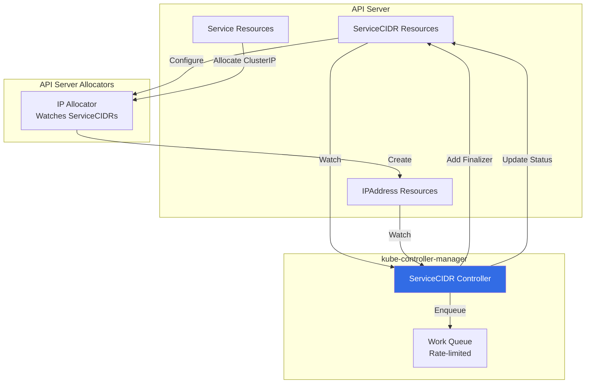
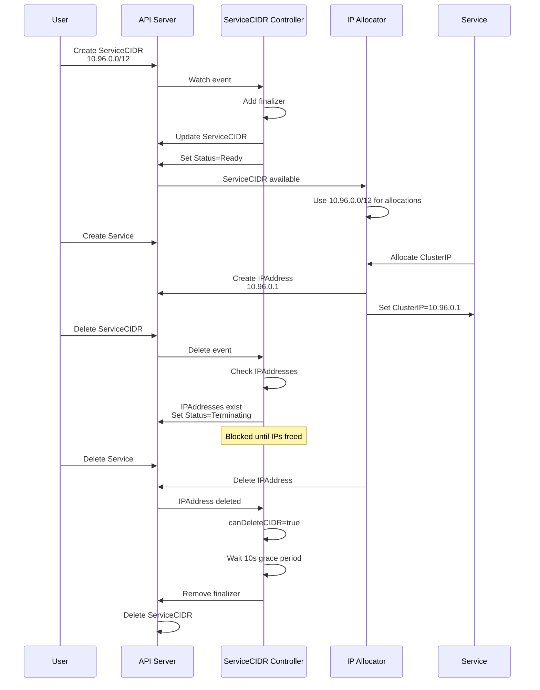
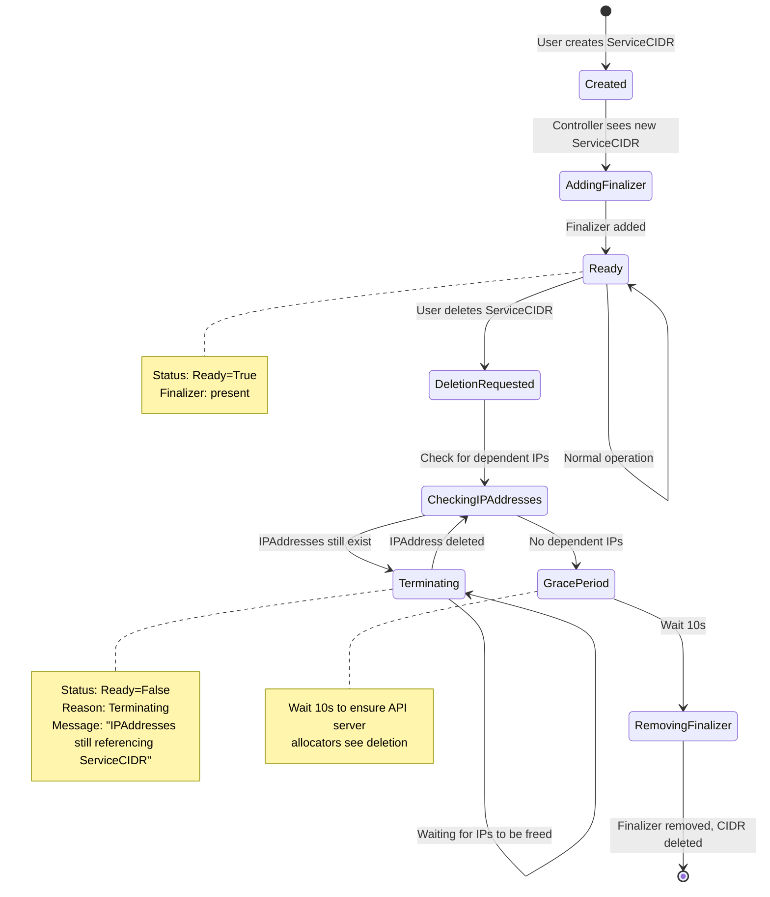

# ServiceCIDR Controller - Multi-CIDR Service IP Allocation

## Overview

The **ServiceCIDR Controller** manages `ServiceCIDR` resources that define multiple CIDR ranges for Service ClusterIP allocation. This enables **dynamic expansion and management of service IP address space** without cluster restarts.

**Primary Location**: `pkg/controller/servicecidrs/servicecidrs_controller.go`

**Feature Gate**: `MultiCIDRServiceAllocator` (Beta in v1.29+)

**KEP**: KEP-1880 - Multiple Service CIDRs

## Key Responsibilities

1. **Lifecycle Management**: Add finalizers to ServiceCIDR resources for safe deletion
2. **Deletion Protection**: Prevent deletion of ServiceCIDRs with active IPAddress allocations
3. **Status Management**: Update ServiceCIDR status (Ready/Terminating conditions)
4. **Overlap Detection**: Track overlapping ServiceCIDRs and dependencies
5. **Grace Period Deletion**: Wait 10s before finalizer removal to ensure API server propagation

## Architecture

### High-Level Architecture



### Data Flow



## Core Data Structures

### Controller Structure

```go
// Location: pkg/controller/servicecidrs/servicecidrs_controller.go:109-124

type Controller struct {
    client clientset.Interface
    eventBroadcaster record.EventBroadcaster
    eventRecorder    record.EventRecorder

    serviceCIDRLister  networkinglisters.ServiceCIDRLister
    serviceCIDRsSynced cache.InformerSynced

    ipAddressLister networkinglisters.IPAddressLister
    ipAddressSynced cache.InformerSynced

    queue workqueue.TypedRateLimitingInterface[string]

    workerLoopPeriod time.Duration  // 1 second
}
```

### ServiceCIDR Resource

```go
// Location: staging/src/k8s.io/api/networking/v1/types.go:709-740

type ServiceCIDR struct {
    metav1.TypeMeta
    metav1.ObjectMeta

    Spec   ServiceCIDRSpec
    Status ServiceCIDRStatus
}

type ServiceCIDRSpec struct {
    // CIDRs defines IP blocks in CIDR notation
    // Max of two CIDRs (one IPv4, one IPv6)
    // Immutable field
    CIDRs []string
}

type ServiceCIDRStatus struct {
    // Conditions describe the state of the ServiceCIDR
    Conditions []metav1.Condition
}
```

**Example ServiceCIDR**:
```yaml
apiVersion: networking.k8s.io/v1
kind: ServiceCIDR
metadata:
  name: primary-service-cidr
  finalizers:
  - networking.k8s.io/service-cidr-finalizer
spec:
  cidrs:
  - "10.96.0.0/12"
status:
  conditions:
  - type: Ready
    status: "True"
    reason: ""
    message: "Kubernetes Service CIDR is ready"
    lastTransitionTime: "2025-10-21T10:00:00Z"
```

### IPAddress Resource

```go
// Location: staging/src/k8s.io/api/networking/v1/types.go:652-690

type IPAddress struct {
    metav1.TypeMeta
    metav1.ObjectMeta

    Spec IPAddressSpec
}

type IPAddressSpec struct {
    // ParentRef references the Service this IP is allocated to
    ParentRef *ParentReference
}

type ParentReference struct {
    Group     string  // "" (core)
    Resource  string  // "services"
    Namespace string  // Service namespace
    Name      string  // Service name
}
```

**Example IPAddress**:
```yaml
apiVersion: networking.k8s.io/v1
kind: IPAddress
metadata:
  name: "10.96.0.1"
  labels:
    networking.k8s.io/ip-address-family: IPv4
    networking.k8s.io/managed-by: "service.k8s.io/ip-allocator"
spec:
  parentRef:
    group: ""
    resource: services
    namespace: default
    name: kubernetes
```

## State Machine

### ServiceCIDR Lifecycle



## Algorithms

### 1. Main Reconciliation Loop

```go
// Location: pkg/controller/servicecidrs/servicecidrs_controller.go:278-347

func (c *Controller) sync(ctx context.Context, key string) error {
    cidr, err := c.serviceCIDRLister.Get(key)
    if err != nil {
        if apierrors.IsNotFound(err) {
            return nil  // Already deleted
        }
        return err
    }

    // Case 1: ServiceCIDR is being deleted
    if !cidr.GetDeletionTimestamp().IsZero() {
        // Check if safe to delete (no dependent IPAddresses)
        ok, err := c.canDeleteCIDR(ctx, cidr)
        if err != nil {
            return err
        }

        if !ok {
            // Block deletion: update status to Terminating
            condition := metav1.Condition{
                Type:    ServiceCIDRConditionReady,
                Status:  metav1.ConditionFalse,
                Reason:  ServiceCIDRReasonTerminating,
                Message: "There are still IPAddresses referencing the ServiceCIDR",
            }
            return c.updateConditionIfNeeded(ctx, cidr, condition)
        }

        // Safe to delete: wait grace period then remove finalizer
        timeUntilDeleted := deletionGracePeriod - time.Since(cidr.GetDeletionTimestamp().Time)
        if timeUntilDeleted > 0 {
            c.queue.AddAfter(key, timeUntilDeleted)
            return nil
        }
        return c.removeServiceCIDRFinalizerIfNeeded(ctx, cidr)
    }

    // Case 2: ServiceCIDR created or updated
    err = c.addServiceCIDRFinalizerIfNeeded(ctx, cidr)
    if err != nil {
        return err
    }

    // Set status to Ready
    condition := metav1.Condition{
        Type:    ServiceCIDRConditionReady,
        Status:  metav1.ConditionTrue,
        Message: "Kubernetes Service CIDR is ready",
    }
    return c.updateConditionIfNeeded(ctx, cidr, condition)
}
```

### 2. Deletion Safety Check

```go
// Location: pkg/controller/servicecidrs/servicecidrs_controller.go:350-409

func (c *Controller) canDeleteCIDR(ctx context.Context, serviceCIDR *ServiceCIDR) (bool, error) {
    // Check 1: Is there a parent ServiceCIDR containing this one?
    hasParent := true
    for _, cidr := range serviceCIDR.Spec.CIDRs {
        prefix, _ := netip.ParsePrefix(cidr)
        serviceCIDRs := servicecidr.ContainsPrefix(c.serviceCIDRLister, prefix)
        if len(serviceCIDRs) == 0 ||
           (len(serviceCIDRs) == 1 && serviceCIDRs[0].Name == serviceCIDR.Name) {
            hasParent = false
        }
    }

    // If contained in another ServiceCIDR, safe to delete
    if hasParent {
        return true, nil
    }

    // Check 2: Are there IPAddresses that would become orphaned?
    for _, cidr := range serviceCIDR.Spec.CIDRs {
        ipLabelSelector := labels.Set(map[string]string{
            "networking.k8s.io/ip-address-family": convertToV1IPFamily(cidr),
            "networking.k8s.io/managed-by":        "service.k8s.io/ip-allocator",
        }).AsSelectorPreValidated()

        ips, err := c.ipAddressLister.List(ipLabelSelector)
        if err != nil {
            return false, err
        }

        for _, ip := range ips {
            address, _ := netip.ParseAddr(ip.Name)

            // Find all ServiceCIDRs containing this IP
            serviceCIDRs := servicecidr.ContainsAddress(c.serviceCIDRLister, address)

            // If this is the ONLY ServiceCIDR containing the IP, block deletion
            if len(serviceCIDRs) == 1 && serviceCIDRs[0].Name == serviceCIDR.Name {
                return false, nil  // Would orphan this IPAddress
            }
        }
    }

    // No orphan IPs, safe to delete
    return true, nil
}
```

**Logic**:
1. **Parent Check**: If another ServiceCIDR contains this one, all IPs are covered → safe
2. **Orphan Check**: For each IPAddress, find all containing ServiceCIDRs
   - If this is the only one → block deletion
   - If others exist → safe to delete

**Example**:
```
ServiceCIDR-1: 10.96.0.0/12  (10.96.0.0 - 10.111.255.255)
ServiceCIDR-2: 10.96.0.0/16  (10.96.0.0 - 10.96.255.255)  [contained in 1]
IPAddress: 10.96.0.1

Delete ServiceCIDR-2:
  - Parent = ServiceCIDR-1 ✓
  - IP 10.96.0.1 also in ServiceCIDR-1 ✓
  - canDelete = TRUE

Delete ServiceCIDR-1:
  - No parent ✗
  - IP 10.96.0.1 ONLY in ServiceCIDR-1 ✗
  - canDelete = FALSE (must delete Service first)
```

### 3. Overlap Detection

```go
// Location: pkg/controller/servicecidrs/servicecidrs_controller.go:210-222

func (c *Controller) overlappingServiceCIDRs(serviceCIDR *ServiceCIDR) []string {
    result := sets.New[string]()
    for _, cidr := range serviceCIDR.Spec.CIDRs {
        prefix, _ := netip.ParsePrefix(cidr)
        serviceCIDRs := servicecidr.OverlapsPrefix(c.serviceCIDRLister, prefix)
        for _, v := range serviceCIDRs {
            result.Insert(v.Name)
        }
    }
    return result.UnsortedList()
}
```

**When used**: On ServiceCIDR add/update, enqueue all overlapping CIDRs to recompute status

### 4. Containing ServiceCIDRs Lookup

```go
// Location: pkg/controller/servicecidrs/servicecidrs_controller.go:226-247

func (c *Controller) containingServiceCIDRs(ip *IPAddress) []string {
    // Only process IPs managed by kube-apiserver
    managedBy, ok := ip.Labels["networking.k8s.io/managed-by"]
    if !ok || managedBy != "service.k8s.io/ip-allocator" {
        return []string{}
    }

    address, _ := netip.ParseAddr(ip.Name)

    result := sets.New[string]()
    serviceCIDRs := servicecidr.ContainsAddress(c.serviceCIDRLister, address)
    for _, v := range serviceCIDRs {
        result.Insert(v.Name)
    }
    return result.UnsortedList()
}
```

**When used**: On IPAddress add/delete, enqueue all containing ServiceCIDRs to recompute deletion eligibility

## Configuration

### Feature Gate

```bash
# Enable Multi-CIDR Service Allocator (Beta in v1.29+)
--feature-gates=MultiCIDRServiceAllocator=true
```

### Controller Parameters

```go
// Location: pkg/controller/servicecidrs/servicecidrs_controller.go:51-66

const (
    maxRetries = 15  // Max retries before dropping from queue
    controllerName = "service-cidr-controller"
    ServiceCIDRProtectionFinalizer = "networking.k8s.io/service-cidr-finalizer"
    deletionGracePeriod = 10 * time.Second  // Grace period before finalizer removal
)
```

**Worker Count**: 5 workers (configured in `cmd/kube-controller-manager/app/networking.go:55`)

### Retry Backoff

Rate-limited queue with exponential backoff:
```
5ms, 10ms, 20ms, 40ms, 80ms, 160ms, 320ms, 640ms, 1.3s, 2.6s, 5.1s, 10.2s, 20.4s, 41s, 82s
```

## Use Cases

### Use Case 1: Initial Setup

```yaml
# Create primary service CIDR
apiVersion: networking.k8s.io/v1
kind: ServiceCIDR
metadata:
  name: primary
spec:
  cidrs:
  - "10.96.0.0/12"
```

**Result**: Service ClusterIPs allocated from `10.96.0.0/12` (10.96.0.0 - 10.111.255.255)

### Use Case 2: Expansion (Add Secondary CIDR)

```yaml
# Expand service IP range without downtime
apiVersion: networking.k8s.io/v1
kind: ServiceCIDR
metadata:
  name: secondary
spec:
  cidrs:
  - "172.16.0.0/16"
```

**Result**:
- Existing services keep IPs from `10.96.0.0/12`
- New services can get IPs from either range
- Total capacity: ~1M IPs (10.96.0.0/12) + 65k IPs (172.16.0.0/16)

### Use Case 3: Dual-Stack

```yaml
# IPv4 + IPv6 ServiceCIDRs
apiVersion: networking.k8s.io/v1
kind: ServiceCIDR
metadata:
  name: dualstack
spec:
  cidrs:
  - "10.96.0.0/12"       # IPv4
  - "fd00:1234::/108"    # IPv6
```

**Result**: Services can have both IPv4 and IPv6 ClusterIPs

### Use Case 4: Overlap for Migration

```yaml
# Migrate from 10.96.0.0/12 to smaller ranges
---
apiVersion: networking.k8s.io/v1
kind: ServiceCIDR
metadata:
  name: old-large
spec:
  cidrs:
  - "10.96.0.0/12"  # 10.96.0.0 - 10.111.255.255
---
apiVersion: networking.k8s.io/v1
kind: ServiceCIDR
metadata:
  name: new-subnet-1
spec:
  cidrs:
  - "10.96.0.0/16"  # 10.96.0.0 - 10.96.255.255 (contained in old-large)
---
apiVersion: networking.k8s.io/v1
kind: ServiceCIDR
metadata:
  name: new-subnet-2
spec:
  cidrs:
  - "10.97.0.0/16"  # 10.97.0.0 - 10.97.255.255 (contained in old-large)
```

**Migration Steps**:
1. Create new-subnet-1 and new-subnet-2 (overlap with old-large)
2. New services get IPs from new subnets
3. Wait for services in old-large to be recreated/migrated
4. Delete old-large ServiceCIDR (will succeed once all IPs covered by new subnets)

## Troubleshooting

### Problem: ServiceCIDR Stuck in Terminating

**Symptoms**:
```bash
$ kubectl get servicecidr
NAME      CIDRS              AGE
primary   ["10.96.0.0/12"]   5d

$ kubectl delete servicecidr primary
# Hangs...

$ kubectl get servicecidr primary -o yaml
status:
  conditions:
  - type: Ready
    status: "False"
    reason: Terminating
    message: "There are still IPAddresses referencing the ServiceCIDR, please remove them or create a new ServiceCIDR"
```

**Diagnosis**:
```bash
# Find IPAddresses still using this CIDR
kubectl get ipaddresses -A
# NAME        PARENTREF
# 10.96.0.1   services/default/kubernetes
# 10.96.0.10  services/kube-system/kube-dns

# Check which ServiceCIDRs contain these IPs
kubectl get servicecidr -o yaml
```

**Causes**:
1. Services still have ClusterIPs from this CIDR
2. No overlapping ServiceCIDR to take over the IPs

**Solutions**:
```bash
# Option 1: Create overlapping ServiceCIDR first
kubectl apply -f - <<EOF
apiVersion: networking.k8s.io/v1
kind: ServiceCIDR
metadata:
  name: replacement
spec:
  cidrs:
  - "10.96.0.0/12"  # Same or larger range
EOF

# Now delete original (IPs covered by replacement)
kubectl delete servicecidr primary

# Option 2: Delete services first
kubectl delete service -n default kubernetes
kubectl delete service -n kube-system kube-dns
# Then delete ServiceCIDR
kubectl delete servicecidr primary
```

### Problem: ServiceCIDR Not Ready

**Symptoms**:
```bash
$ kubectl get servicecidr new-cidr
NAME       CIDRS              AGE    READY
new-cidr   ["172.16.0.0/16"]  10s    False
```

**Diagnosis**:
```bash
kubectl describe servicecidr new-cidr
# Events:
# Warning  KubernetesServiceCIDRError  10s  service-cidr-controller  The ServiceCIDR Status can not be set to Ready=True
```

**Causes**:
1. Invalid CIDR format
2. Controller not running
3. Feature gate not enabled

**Solutions**:
```bash
# Check feature gate
kubectl get --raw /metrics | grep multiCIDRServiceAllocator

# Check controller logs
kubectl logs -n kube-system kube-controller-manager-xxx | grep "service-cidr-controller"

# Verify CIDR format
kubectl get servicecidr new-cidr -o yaml
# spec:
#   cidrs:
#   - "172.16.0.0/16"  # Must be valid CIDR notation
```

### Problem: Grace Period Delays

**Symptoms**:
ServiceCIDR takes 10+ seconds to actually delete even after all IPs freed

**Explanation**:
This is **by design**. The controller waits `deletionGracePeriod = 10s` to ensure API server IP allocators see the deletion and don't allocate new IPs from the CIDR.

**Timeline**:
```
T+0s:  User deletes ServiceCIDR
T+0s:  Controller checks: no dependent IPs ✓
T+0s:  Controller sets DeletionTimestamp
T+10s: Grace period expires
T+10s: Controller removes finalizer
T+10s: ServiceCIDR actually deleted
```

**This prevents**:
```
T+0s:  User deletes ServiceCIDR
T+0s:  Finalizer removed immediately
T+1s:  API server allocator (cached) allocates IP from deleted CIDR ✗
```

## Performance

### Complexity

- **Overlap Detection**: O(N) where N = number of ServiceCIDRs
- **Orphan IP Check**: O(M) where M = number of IPAddresses
- **Worst Case**: O(N*M) when checking all IPs against all CIDRs

### Scalability

**Tested Limits**:
- ServiceCIDRs: Up to 100 (typical: 1-5)
- IPAddresses: Up to 10,000 per ServiceCIDR
- Total Services: Up to 10,000 per cluster

**Optimization**:
- Uses label selectors to filter IPAddresses by IP family
- Only checks IPAddresses managed by kube-apiserver (`networking.k8s.io/managed-by=service.k8s.io/ip-allocator`)

### Metrics

```prometheus
# Work queue metrics
workqueue_depth{name="ipaddresses"}
workqueue_adds_total{name="ipaddresses"}
workqueue_retries_total{name="ipaddresses"}

# Controller metrics (if instrumented)
servicecidr_controller_sync_duration_seconds
servicecidr_controller_sync_total
```

## Related Components

### API Server IP Allocator

**Location**: `pkg/registry/core/service/ipallocator/`

**Relationship**:
- Watches ServiceCIDR resources
- Allocates ClusterIPs from ServiceCIDR ranges
- Creates IPAddress resources for each allocation
- ServiceCIDR controller protects CIDRs with active IPs

### Service Controller

**Documented in**: `14-service-endpoint-controllers.md`

**Relationship**:
- Creates Service resources
- Service resource triggers IP allocation
- IP Allocator creates IPAddress
- ServiceCIDR controller tracks IPAddresses

### Node IPAM Controller

**Documented in**: `32-cloud-cidr-allocator.md`

**Comparison**:
| Aspect | ServiceCIDR Controller | Node IPAM Controller |
|--------|------------------------|----------------------|
| **Purpose** | Service ClusterIP allocation | Pod IP allocation |
| **Resources** | ServiceCIDR, IPAddress | Node.Spec.PodCIDR |
| **Allocator** | API server (ipallocator) | Controller (cidrset) |
| **Scope** | Cluster-wide | Per-node |
| **Deletion** | Finalizer-based | Node deletion triggers release |

## Summary

The ServiceCIDR Controller enables **dynamic, multi-CIDR service IP management**:

1. ✅ **Multi-CIDR Support**: Define multiple service IP ranges
2. 🔒 **Safe Deletion**: Finalizers prevent orphan IPAddresses
3. 🔄 **Overlap Handling**: Supports overlapping CIDRs for migration
4. ⏱️ **Grace Period**: 10s delay ensures API server sync
5. 📊 **Status Tracking**: Ready/Terminating conditions
6. 🌐 **Dual-Stack**: IPv4 + IPv6 in single ServiceCIDR

**Key Files**:
- Controller: `pkg/controller/servicecidrs/servicecidrs_controller.go`
- API Types: `staging/src/k8s.io/api/networking/v1/types.go`
- Allocator: `pkg/registry/core/service/ipallocator/`

**Feature Gate**: `MultiCIDRServiceAllocator=true` (Beta)

**Next Document**: `38-networking-summary.md` - Networking architecture summary

---

**Document Status**: Complete
**Controllers Documented**: 37/71 (52.1%)
