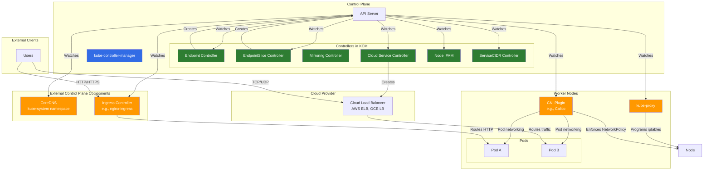

# Networking in Kubernetes - Architecture Summary

## Overview

This document provides a **comprehensive summary** of networking in Kubernetes, clarifying which components are **in kube-controller-manager** versus **external** to the control plane.

**Key Takeaway**: Most networking functionality in Kubernetes is **NOT in kube-controller-manager**. It's distributed across CNI plugins, CoreDNS, Ingress controllers, and kube-proxy.

## Components in kube-controller-manager

### ✅ What IS in Controller-Manager

| Controller | Document | Purpose |
|------------|----------|---------|
| **Endpoint Controller** | `14-service-endpoint-controllers.md` | Creates Endpoints from Services + Pods |
| **EndpointSlice Controller** | `14-service-endpoint-controllers.md` | Modern, scalable Endpoints |
| **EndpointSlice Mirroring** | `14-service-endpoint-controllers.md` | Migrates Endpoints → EndpointSlices |
| **Cloud Service Controller** | `31-cloud-service-controllers.md` | Manages LoadBalancer-type Services (cloud LBs) |
| **Node IPAM Controller** | `32-cloud-cidr-allocator.md` | Allocates Pod CIDRs to nodes |
| **ServiceCIDR Controller** | `37-service-cidr-controller.md` | Manages multi-CIDR service IP ranges |

## Components NOT in kube-controller-manager

### ❌ What is NOT in Controller-Manager

| Component | Document | Actual Location |
|-----------|----------|-----------------|
| **NetworkPolicy** | `33-network-policy-not-in-controller-manager.md` | CNI plugins (Calico, Cilium, etc.) |
| **Ingress** | `34-ingress-not-in-controller-manager.md` | External Ingress controllers (nginx, Traefik) |
| **DNS** | `35-dns-not-in-controller-manager.md` | CoreDNS (deployed as pods) |
| **Service Routing** | N/A | kube-proxy (runs on nodes) |
| **Pod Networking** | N/A | CNI plugins (Calico, Flannel, Cilium) |

## Complete Networking Architecture



## Detailed Component Breakdown

### 1. Service Discovery (Endpoints/EndpointSlices)

**IN kube-controller-manager**: ✅

**Controllers**:
- Endpoint Controller
- EndpointSlice Controller
- EndpointSlice Mirroring Controller

**What they do**:
```yaml
# User creates Service
apiVersion: v1
kind: Service
metadata:
  name: backend
spec:
  selector:
    app: backend
  ports:
  - port: 8080
```

**Controller creates**:
```yaml
# Endpoints (legacy)
apiVersion: v1
kind: Endpoints
metadata:
  name: backend
subsets:
- addresses:
  - ip: 10.244.1.5  # Pod IP
  ports:
  - port: 8080

# EndpointSlices (modern)
apiVersion: discovery.k8s.io/v1
kind: EndpointSlice
metadata:
  name: backend-abc123
endpoints:
- addresses:
  - 10.244.1.5
  conditions:
    ready: true
```

**Consumers**: kube-proxy, CoreDNS, Ingress controllers

### 2. Service Routing (kube-proxy)

**IN kube-controller-manager**: ❌

**Location**: Runs as DaemonSet on worker nodes

**What it does**:
- Watches Services and Endpoints/EndpointSlices
- Programs iptables/IPVS rules for service routing
- Enables ClusterIP → Pod IP translation

**Example**:
```bash
# Service has ClusterIP 10.96.0.1
# kube-proxy creates iptables rule:
iptables -t nat -A KUBE-SERVICES -d 10.96.0.1/32 -p tcp -m tcp --dport 8080 \
  -j KUBE-SVC-BACKEND

# Routes to pod IPs
iptables -t nat -A KUBE-SVC-BACKEND -m statistic --mode random --probability 0.5 \
  -j KUBE-SEP-POD1  # 10.244.1.5:8080
iptables -t nat -A KUBE-SVC-BACKEND \
  -j KUBE-SEP-POD2  # 10.244.2.6:8080
```

### 3. Cloud Load Balancers

**IN kube-controller-manager**: ✅

**Controller**: Cloud Service Controller

**What it does**:
```yaml
# User creates LoadBalancer service
apiVersion: v1
kind: Service
metadata:
  name: web
spec:
  type: LoadBalancer
  ports:
  - port: 80
```

**Controller creates**:
- AWS: Elastic Load Balancer (ELB/NLB)
- GCE: Google Cloud Load Balancer
- Azure: Azure Load Balancer

**Updates Service**:
```yaml
status:
  loadBalancer:
    ingress:
    - ip: 34.123.45.67  # Cloud LB external IP
```

### 4. Pod Networking (CNI)

**IN kube-controller-manager**: ❌

**Location**: CNI plugins on worker nodes (Calico, Flannel, Cilium, etc.)

**What it does**:
- Assigns IP addresses to pods (from node's PodCIDR)
- Sets up pod network interfaces
- Routes traffic between pods
- **Enforces NetworkPolicy** (if supported)

**Example (Calico)**:
```bash
# Pod gets IP from node's PodCIDR
Node: PodCIDR=10.244.1.0/24
Pod:  IP=10.244.1.5

# Calico creates veth pair
# Pod → veth0 → host veth1 → routing
```

### 5. NetworkPolicy Enforcement

**IN kube-controller-manager**: ❌

**Location**: CNI plugin (Calico Felix, Cilium Agent, etc.)

**What it does**:
```yaml
# User creates NetworkPolicy
apiVersion: networking.k8s.io/v1
kind: NetworkPolicy
metadata:
  name: deny-all
spec:
  podSelector: {}
  policyTypes:
  - Ingress
```

**CNI plugin enforces**:
```bash
# Calico creates iptables rules
iptables -A cali-pi-deny-all -j DROP
```

**kube-controller-manager role**: NONE

### 6. DNS (CoreDNS)

**IN kube-controller-manager**: ❌

**Location**: Deployed as Deployment in `kube-system` namespace

**What it does**:
- Watches Services and Endpoints
- Resolves service names to ClusterIPs
- Forwards external queries to upstream DNS

**Example**:
```bash
# Pod queries: my-service.default.svc.cluster.local
# CoreDNS returns: 10.96.0.1 (Service ClusterIP)
```

**kube-controller-manager role**: NONE (but Endpoint controller creates Endpoints that CoreDNS reads)

### 7. Ingress (HTTP/HTTPS Routing)

**IN kube-controller-manager**: ❌

**Location**: External Ingress controllers (nginx-ingress, Traefik, etc.)

**What it does**:
```yaml
# User creates Ingress
apiVersion: networking.k8s.io/v1
kind: Ingress
metadata:
  name: web
spec:
  rules:
  - host: example.com
    http:
      paths:
      - path: /
        backend:
          service:
            name: web
            port:
              number: 80
```

**Ingress controller**:
- Watches Ingress resources
- Configures reverse proxy (nginx, HAProxy, Envoy)
- Routes HTTP/HTTPS traffic to services

**kube-controller-manager role**: NONE

### 8. Node CIDR Allocation

**IN kube-controller-manager**: ✅

**Controller**: Node IPAM Controller

**What it does**:
```bash
# Allocates PodCIDR to each node
Node-1: PodCIDR=10.244.0.0/24  (256 IP addresses for pods)
Node-2: PodCIDR=10.244.1.0/24
Node-3: PodCIDR=10.244.2.0/24
```

**Documented in**: `32-cloud-cidr-allocator.md`

### 9. Service CIDR Management

**IN kube-controller-manager**: ✅

**Controller**: ServiceCIDR Controller

**What it does**:
```yaml
# Manages service IP ranges
apiVersion: networking.k8s.io/v1
kind: ServiceCIDR
metadata:
  name: primary
spec:
  cidrs:
  - "10.96.0.0/12"  # Service ClusterIPs allocated from this range
```

**Documented in**: `37-service-cidr-controller.md`

## Traffic Flow Examples

### Example 1: Pod-to-Service Communication

```
1. Pod A (10.244.1.5) wants to connect to "backend" service
2. Pod queries CoreDNS: backend.default.svc.cluster.local
3. CoreDNS returns: 10.96.0.1 (Service ClusterIP)
4. Pod sends packet to 10.96.0.1:8080
5. kube-proxy iptables rule intercepts
6. iptables rewrites destination to pod IP: 10.244.2.10:8080
7. CNI routes packet to Pod B (10.244.2.10)
8. Response flows back through same path (NAT reversed)
```

**Controllers involved**:
- ✅ Endpoint Controller (created Endpoints)
- ❌ CoreDNS (resolved DNS)
- ❌ kube-proxy (routing)
- ❌ CNI (pod networking)

### Example 2: External-to-Service (LoadBalancer)

```
1. User accesses http://34.123.45.67 (Cloud LB IP)
2. Cloud LB forwards to node:NodePort (e.g., 30080)
3. kube-proxy iptables forwards NodePort → Service ClusterIP
4. kube-proxy iptables forwards ClusterIP → Pod IP
5. CNI routes to pod
6. Response flows back
```

**Controllers involved**:
- ✅ Cloud Service Controller (created cloud LB)
- ✅ Endpoint Controller (provided pod IPs)
- ❌ Cloud LB (routes traffic)
- ❌ kube-proxy (routing)
- ❌ CNI (pod networking)

### Example 3: External-to-Service (Ingress)

```
1. User accesses https://example.com/api
2. DNS resolves to Ingress Controller IP
3. Ingress Controller (nginx) terminates TLS
4. nginx proxies to backend Service ClusterIP
5. kube-proxy iptables forwards to Pod IP
6. CNI routes to pod
```

**Controllers involved**:
- ✅ Endpoint Controller (EndpointSlice with pod IPs)
- ❌ Ingress Controller (HTTP routing)
- ❌ kube-proxy (Service routing)
- ❌ CNI (pod networking)

### Example 4: Pod-to-Pod with NetworkPolicy

```
1. Pod A tries to connect to Pod B
2. CNI plugin checks NetworkPolicy
3. If allowed: CNI routes packet
4. If denied: CNI drops packet (iptables/eBPF)
```

**Controllers involved**:
- ❌ CNI plugin (enforces NetworkPolicy)

**Note**: kube-controller-manager has NO role in NetworkPolicy enforcement

## Summary Table

| Feature | In Controller-Manager? | Actual Component | Document |
|---------|------------------------|------------------|----------|
| Service discovery (Endpoints) | ✅ YES | Endpoint Controller | 14 |
| Service ClusterIP routing | ❌ NO | kube-proxy | N/A |
| Cloud Load Balancers | ✅ YES | Cloud Service Controller | 31 |
| Pod CIDR allocation | ✅ YES | Node IPAM Controller | 32 |
| Service CIDR management | ✅ YES | ServiceCIDR Controller | 37 |
| Pod networking | ❌ NO | CNI plugin | N/A |
| NetworkPolicy enforcement | ❌ NO | CNI plugin | 33 |
| DNS resolution | ❌ NO | CoreDNS | 35 |
| Ingress (HTTP routing) | ❌ NO | Ingress Controller | 34 |
| Service Mesh | ❌ NO | Istio/Linkerd/etc. | N/A |

## Key Insights

### kube-controller-manager's Networking Role

**What it DOES**:
1. **Creates Endpoints** from Services + Pods
2. **Manages cloud load balancers** for LoadBalancer-type Services
3. **Allocates IP ranges** (Pod CIDRs to nodes, Service CIDRs)

**What it DOES NOT do**:
1. **Route traffic** (that's kube-proxy)
2. **Enforce network policies** (that's CNI)
3. **Resolve DNS** (that's CoreDNS)
4. **Route HTTP/HTTPS** (that's Ingress controllers)
5. **Provide pod networking** (that's CNI)

### Why This Architecture?

**Separation of Concerns**:
- **Control plane** (controller-manager): Manages cluster state (resources)
- **Data plane** (kube-proxy, CNI): Handles actual traffic routing

**Flexibility**:
- Different CNI plugins for different environments
- Multiple Ingress controller options
- Cloud-agnostic design with pluggable components

**Performance**:
- Traffic routing in kernel space (iptables/eBPF)
- Control plane doesn't touch data plane packets

## Related Documentation

### Documents in This Series

**Networking Controllers (in controller-manager)**:
- `14-service-endpoint-controllers.md` - Endpoint/EndpointSlice controllers
- `31-cloud-service-controllers.md` - LoadBalancer service controller
- `32-cloud-cidr-allocator.md` - Node IPAM (Pod CIDR allocation)
- `37-service-cidr-controller.md` - ServiceCIDR controller

**Networking Explanatory Notes**:
- `33-network-policy-not-in-controller-manager.md` - NetworkPolicy (CNI)
- `34-ingress-not-in-controller-manager.md` - Ingress (external)
- `35-dns-not-in-controller-manager.md` - DNS (CoreDNS)
- `36-endpoint-reconciler-already-documented.md` - Cross-reference

### External Documentation

**Kubernetes Official**:
- Services: https://kubernetes.io/docs/concepts/services-networking/service/
- NetworkPolicy: https://kubernetes.io/docs/concepts/services-networking/network-policies/
- Ingress: https://kubernetes.io/docs/concepts/services-networking/ingress/
- DNS: https://kubernetes.io/docs/concepts/services-networking/dns-pod-service/

**CNI**:
- CNI Specification: https://github.com/containernetworking/cni
- Calico: https://docs.tigera.io/calico/
- Cilium: https://docs.cilium.io/
- Flannel: https://github.com/flannel-io/flannel

**Ingress Controllers**:
- NGINX Ingress: https://kubernetes.github.io/ingress-nginx/
- Traefik: https://doc.traefik.io/traefik/
- Contour: https://projectcontour.io/

## Conclusion

**Kubernetes networking is a distributed system**:
- kube-controller-manager handles **control plane** (resource management)
- kube-proxy, CNI, CoreDNS, Ingress handle **data plane** (traffic routing)

**kube-controller-manager's limited networking role**:
- ✅ Endpoint/EndpointSlice creation
- ✅ Cloud load balancer management
- ✅ IP range allocation (Pod CIDRs, Service CIDRs)
- ❌ NOT involved in actual packet routing

This design enables **flexibility, scalability, and performance** by separating cluster state management from traffic routing.

---

**Next Section**: Storage Controllers (documents 39-44)
**Networking Section**: Complete (documents 33-38, 6/6 ✅)
