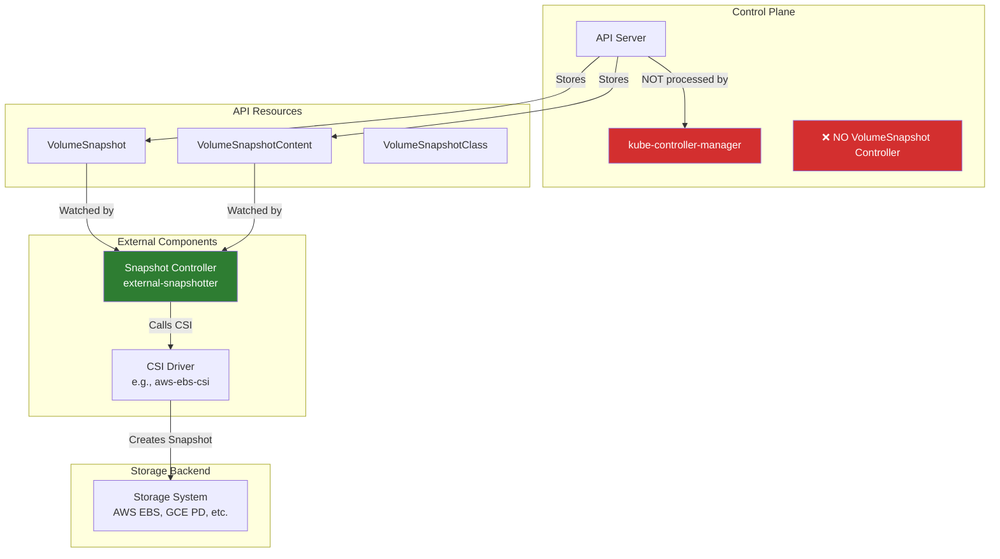

# Volume Snapshots - NOT in Kube-Controller-Manager

## Important Notice

**VolumeSnapshot controllers are NOT part of kube-controller-manager.**

VolumeSnapshot is a **Kubernetes API resource** for creating point-in-time copies of volumes, but the snapshot lifecycle is managed by **external snapshot controllers** and **CSI drivers**, not by kube-controller-manager.

## Where Volume Snapshots are Actually Implemented

### External Snapshot Controller

**Repository**: https://github.com/kubernetes-csi/external-snapshotter

**Components**:
1. **snapshot-controller**: Watches VolumeSnapshot/VolumeSnapshotContent resources
2. **snapshot-validation-webhook**: Validates snapshot API objects
3. **CSI Driver**: Implements actual snapshot creation (storage-specific)

**Deployment**: Runs as separate pods, not part of control plane

## Architecture



## How Volume Snapshots Work

### 1. User Creates VolumeSnapshot

```yaml
apiVersion: snapshot.storage.k8s.io/v1
kind: VolumeSnapshot
metadata:
  name: pvc-snapshot
  namespace: default
spec:
  volumeSnapshotClassName: csi-snapclass
  source:
    persistentVolumeClaimName: my-pvc
```

### 2. Snapshot Controller Processes

**What happens**:
1. **API Server** stores VolumeSnapshot resource
2. **Snapshot Controller** (external) watches VolumeSnapshot
3. **Snapshot Controller** creates VolumeSnapshotContent
4. **Snapshot Controller** calls CSI driver via gRPC
5. **CSI Driver** creates snapshot in storage backend
6. **CSI Driver** returns snapshot ID
7. **Snapshot Controller** updates VolumeSnapshot status

**kube-controller-manager**: ❌ Does NOT participate

### 3. Resources Created

```yaml
# VolumeSnapshotContent (created by snapshot controller)
apiVersion: snapshot.storage.k8s.io/v1
kind: VolumeSnapshotContent
metadata:
  name: snapcontent-12345
spec:
  deletionPolicy: Delete
  driver: ebs.csi.aws.com
  source:
    volumeHandle: vol-0abcd1234efgh5678
  volumeSnapshotRef:
    name: pvc-snapshot
    namespace: default
status:
  snapshotHandle: snap-0xyz9876abcd5432  # Backend snapshot ID
  readyToUse: true
  creationTime: 1698765432000000000
  restoreSize: 10737418240  # 10 GiB
```

## VolumeSnapshot API Resources

### VolumeSnapshot

```go
// External API, not in core Kubernetes
type VolumeSnapshot struct {
    metav1.TypeMeta
    metav1.ObjectMeta

    Spec   VolumeSnapshotSpec
    Status VolumeSnapshotStatus
}

type VolumeSnapshotSpec struct {
    Source              VolumeSnapshotSource
    VolumeSnapshotClassName *string
}

type VolumeSnapshotSource struct {
    PersistentVolumeClaimName *string  // Snapshot from PVC
    VolumeSnapshotContentName *string  // Pre-provisioned snapshot
}
```

### VolumeSnapshotContent

```go
type VolumeSnapshotContent struct {
    metav1.TypeMeta
    metav1.ObjectMeta

    Spec   VolumeSnapshotContentSpec
    Status VolumeSnapshotContentStatus
}

type VolumeSnapshotContentSpec struct {
    VolumeSnapshotRef       v1.ObjectReference
    Source                  VolumeSnapshotContentSource
    Driver                  string  // CSI driver name
    DeletionPolicy          DeletionPolicy
    VolumeSnapshotClassName *string
}

type VolumeSnapshotContentSource struct {
    VolumeHandle   *string  // Dynamic: PV handle
    SnapshotHandle *string  // Pre-provisioned: snapshot ID
}
```

### VolumeSnapshotClass

```yaml
apiVersion: snapshot.storage.k8s.io/v1
kind: VolumeSnapshotClass
metadata:
  name: csi-snapclass
driver: ebs.csi.aws.com
deletionPolicy: Delete
parameters:
  type: gp3
```

## Why NOT in kube-controller-manager?

### Design Philosophy

**Snapshots are Storage-Specific**:
- Each storage backend has different snapshot APIs
- AWS EBS, GCE PD, Azure Disk all have unique implementations
- CSI (Container Storage Interface) provides abstraction

**External Controller Pattern**:
- Follows same pattern as CSI drivers (out-of-tree)
- Enables rapid iteration without Kubernetes release cycles
- Storage vendors maintain their own implementations

**Separation of Concerns**:
- kube-controller-manager: Core Kubernetes resources
- External controllers: Storage-specific functionality

### Comparison

| Aspect | kube-controller-manager | External Snapshot Controller |
|--------|-------------------------|------------------------------|
| **Purpose** | Core cluster state | Volume snapshot lifecycle |
| **Location** | Control plane | Deployed as pods |
| **Watches** | Core resources | Snapshot API resources |
| **Dependencies** | None (built-in) | CSI drivers |
| **Updates** | With Kubernetes releases | Independent releases |
| **Storage-specific** | No | Yes (via CSI) |

## Use Cases

### Use Case 1: Backup PVC

```bash
# Create snapshot of PVC
kubectl apply -f - <<EOF
apiVersion: snapshot.storage.k8s.io/v1
kind: VolumeSnapshot
metadata:
  name: backup-snapshot
spec:
  volumeSnapshotClassName: csi-snapclass
  source:
    persistentVolumeClaimName: database-pvc
EOF

# Wait for snapshot to be ready
kubectl wait --for=jsonpath='{.status.readyToUse}'=true volumesnapshot/backup-snapshot

# Snapshot is now available in backend storage
```

### Use Case 2: Restore from Snapshot

```yaml
apiVersion: v1
kind: PersistentVolumeClaim
metadata:
  name: restored-pvc
spec:
  storageClassName: gp3-csi
  dataSource:
    name: backup-snapshot
    kind: VolumeSnapshot
    apiGroup: snapshot.storage.k8s.io
  accessModes:
  - ReadWriteOnce
  resources:
    requests:
      storage: 10Gi
```

**Result**: New PVC created with data from snapshot

### Use Case 3: Clone PVC

```yaml
apiVersion: v1
kind: PersistentVolumeClaim
metadata:
  name: cloned-pvc
spec:
  storageClassName: gp3-csi
  dataSource:
    name: source-pvc
    kind: PersistentVolumeClaim
  accessModes:
  - ReadWriteOnce
  resources:
    requests:
      storage: 10Gi
```

**Note**: PVC cloning often uses snapshots internally

## Installation

### Install Snapshot Controller

```bash
# Install snapshot CRDs
kubectl apply -f https://raw.githubusercontent.com/kubernetes-csi/external-snapshotter/release-6.3/client/config/crd/snapshot.storage.k8s.io_volumesnapshotclasses.yaml
kubectl apply -f https://raw.githubusercontent.com/kubernetes-csi/external-snapshotter/release-6.3/client/config/crd/snapshot.storage.k8s.io_volumesnapshotcontents.yaml
kubectl apply -f https://raw.githubusercontent.com/kubernetes-csi/external-snapshotter/release-6.3/client/config/crd/snapshot.storage.k8s.io_volumesnapshots.yaml

# Install snapshot controller
kubectl apply -f https://raw.githubusercontent.com/kubernetes-csi/external-snapshotter/release-6.3/deploy/kubernetes/snapshot-controller/rbac-snapshot-controller.yaml
kubectl apply -f https://raw.githubusercontent.com/kubernetes-csi/external-snapshotter/release-6.3/deploy/kubernetes/snapshot-controller/setup-snapshot-controller.yaml
```

### Verify Installation

```bash
# Check snapshot controller is running
kubectl get pods -n kube-system | grep snapshot-controller

# Check CRDs installed
kubectl get crd | grep snapshot
# volumesnapshotclasses.snapshot.storage.k8s.io
# volumesnapshotcontents.snapshot.storage.k8s.io
# volumesnapshots.snapshot.storage.k8s.io
```

## CSI Driver Support

**Popular CSI Drivers with Snapshot Support**:
- **AWS EBS CSI**: aws-ebs-csi-driver
- **GCE PD CSI**: gcp-compute-persistent-disk-csi-driver
- **Azure Disk CSI**: azuredisk-csi-driver
- **Ceph CSI**: ceph-csi
- **Longhorn**: longhorn (CNCF project)

**Check CSI driver supports snapshots**:
```bash
kubectl get csidriver
kubectl describe csidriver ebs.csi.aws.com
# VolumeSnapshotDataSource: true
```

## Troubleshooting

### Problem: VolumeSnapshot Stuck in Pending

**Symptoms**:
```bash
$ kubectl get volumesnapshot
NAME              READYTOUSE   SOURCEPVC      AGE
my-snapshot       false        database-pvc   5m
```

**Diagnosis**:
```bash
# Check snapshot controller logs
kubectl logs -n kube-system -l app=snapshot-controller

# Check VolumeSnapshotContent
kubectl get volumesnapshotcontent

# Check events
kubectl describe volumesnapshot my-snapshot
```

**Common causes**:
1. Snapshot controller not running
2. CSI driver doesn't support snapshots
3. Storage backend error
4. Invalid VolumeSnapshotClass

**Solutions**:
```bash
# Verify snapshot controller
kubectl get deployment -n kube-system snapshot-controller

# Verify CSI driver supports snapshots
kubectl get csidriver -o yaml | grep VolumeSnapshotDataSource

# Check CSI driver logs
kubectl logs -n kube-system -l app=ebs-csi-controller
```

### Problem: Snapshot Deletion Fails

**Symptoms**:
```bash
$ kubectl delete volumesnapshot my-snapshot
# Hangs...

$ kubectl get volumesnapshot my-snapshot -o yaml
metadata:
  deletionTimestamp: "2025-10-21T10:00:00Z"
  finalizers:
  - snapshot.storage.kubernetes.io/volumesnapshot-as-source-protection
  - snapshot.storage.kubernetes.io/volumesnapshot-bound-protection
```

**Diagnosis**:
```bash
# Check if PVCs are using this snapshot
kubectl get pvc -A -o json | jq '.items[] | select(.spec.dataSource.name=="my-snapshot")'
```

**Cause**: Finalizer prevents deletion when snapshot is in use

**Solution**:
```bash
# Delete PVCs using the snapshot first
kubectl delete pvc restored-pvc

# Then delete snapshot
kubectl delete volumesnapshot my-snapshot
```

## Related Controllers in kube-controller-manager

### PV/PVC Controllers

**Document**: `13-volume-controllers.md`

**Relationship**:
- PV/PVC controllers manage volume lifecycle
- Snapshots can restore to new PVCs
- Snapshot controller watches PVCs (to snapshot them)

### Volume Protection Controllers

**Document**: `41-volume-protection-controllers.md` (this series)

**Relationship**:
- Prevents deletion of PVs/PVCs in use
- Similar finalizer pattern to snapshot protection
- Both protect against premature deletion

## Summary

**Key Points**:

1. ❌ **VolumeSnapshot is NOT in kube-controller-manager**
2. ✅ **External snapshot controller** manages snapshot lifecycle
3. 🔌 **CSI drivers** implement storage-specific snapshot operations
4. 📦 **Separate installation** required (CRDs + controller)
5. 🔄 **Backup/restore** workflow for persistent data
6. 🔒 **Finalizers** protect snapshots in use

**To use VolumeSnapshots**:
1. Install external-snapshotter controller
2. Ensure CSI driver supports snapshots
3. Create VolumeSnapshotClass
4. Create VolumeSnapshot resources
5. Restore from snapshots to new PVCs

**kube-controller-manager's role**: None. Snapshots are purely external.

**What kube-controller-manager DOES manage**:
- PV/PVC binding and provisioning (doc 13)
- Volume protection (PV/PVC deletion protection, doc 41)
- Volume expansion (doc 13)
- NOT snapshots

---

**Next Document**: `40-storage-version-gc.md` - Storage version garbage collection (actual controller in kube-controller-manager)
