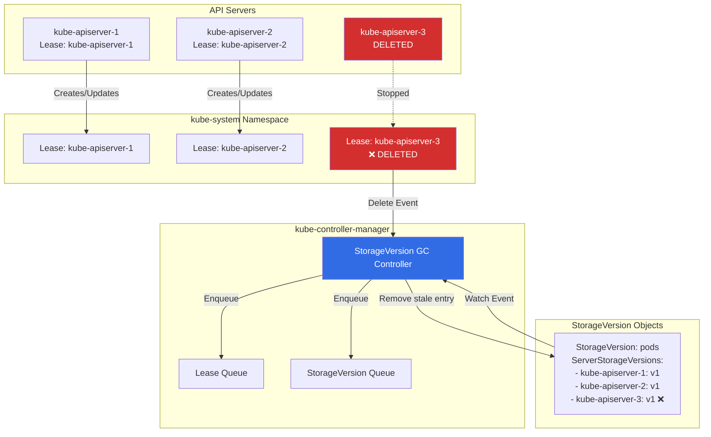

# Storage Version Garbage Collection Controller

## Overview

The **Storage Version GC Controller** cleans up stale `StorageVersion` objects when API servers are decommissioned or restarted. It ensures the `StorageVersion` resource accurately reflects which API servers are running and their storage encodings.

**Primary Location**: `pkg/controller/storageversiongc/gc_controller.go`

**Purpose**: Remove stale server entries from StorageVersion objects when API server leases expire

## Key Responsibilities

1. **Watch API Server Leases**: Monitor `coordination.k8s.io/Lease` objects for API servers
2. **Detect Stale Servers**: Identify when API server leases are deleted (server shutdown)
3. **Clean StorageVersion**: Remove stale server entries from StorageVersion.Status.ServerStorageVersions
4. **Validate StorageVersion**: Remove entries referencing non-existent servers

## Architecture



## Core Data Structures

### Controller Structure

```go
// Location: pkg/controller/storageversiongc/gc_controller.go:46-56

type Controller struct {
    kubeclientset kubernetes.Interface

    leaseLister  coordlisters.LeaseLister
    leasesSynced cache.InformerSynced

    storageVersionSynced cache.InformerSynced

    leaseQueue          workqueue.TypedRateLimitingInterface[string]
    storageVersionQueue workqueue.TypedRateLimitingInterface[string]
}
```

### StorageVersion Resource

```go
// StorageVersion tracks storage encodings per API server
type StorageVersion struct {
    metav1.TypeMeta
    metav1.ObjectMeta

    Spec   StorageVersionSpec
    Status StorageVersionStatus
}

type StorageVersionStatus struct {
    // Storage versions reported by API servers
    StorageVersions []ServerStorageVersion

    // Common version used by all servers
    CommonEncodingVersion *string

    // Conditions
    Conditions []StorageVersionCondition
}

type ServerStorageVersion struct {
    // API server ID (from lease name)
    APIServerID string

    // Encoding version used by this server
    EncodingVersion string

    // Decodable versions (for reads)
    DecodableVersions []string
}
```

**Example StorageVersion**:
```yaml
apiVersion: internal.apiserver.k8s.io/v1alpha1
kind: StorageVersion
metadata:
  name: pods
status:
  storageVersions:
  - apiServerID: kube-apiserver-1
    encodingVersion: v1
    decodableVersions: [v1]
  - apiServerID: kube-apiserver-2
    encodingVersion: v1
    decodableVersions: [v1]
  - apiServerID: kube-apiserver-3  # ❌ STALE (server deleted)
    encodingVersion: v1
    decodableVersions: [v1]
  commonEncodingVersion: v1
  conditions:
  - type: AllEncodingVersionsEqual
    status: "True"
    reason: CommonVersionFound
```

### API Server Lease

```yaml
apiVersion: coordination.k8s.io/v1
kind: Lease
metadata:
  name: kube-apiserver-1
  namespace: kube-system
spec:
  holderIdentity: "kube-apiserver-1_12345"
  leaseDurationSeconds: 15
  renewTime: "2025-10-21T10:00:00Z"
```

## Algorithms

### 1. Lease Deletion Handling

```go
// Location: pkg/controller/storageversiongc/gc_controller.go:75-79

func (c *Controller) onDeleteLease(logger klog.Logger, obj interface{}) {
    lease := obj.(*coordinationv1.Lease)

    // Only care about API server leases (in kube-system namespace)
    if lease.Namespace != metav1.NamespaceSystem {
        return
    }

    // Check if this is an API server identity lease
    if !strings.HasPrefix(lease.Name, "kube-apiserver-") {
        return
    }

    logger.V(4).Info("Observed lease deletion", "lease", lease.Name)

    // Enqueue deleted lease for processing
    c.leaseQueue.Add(lease.Name)
}
```

### 2. Clean StorageVersion Entries

```go
// Location: pkg/controller/storageversiongc/gc_controller.go (processDeletedLease logic)

func (c *Controller) processDeletedLease(ctx context.Context, leaseName string) error {
    logger := klog.FromContext(ctx)

    // List all StorageVersion objects
    storageVersions, err := c.kubeclientset.InternalV1alpha1().StorageVersions().List(ctx, metav1.ListOptions{})
    if err != nil {
        return err
    }

    var errs []error
    for _, sv := range storageVersions.Items {
        // Check if this StorageVersion has an entry for the deleted lease
        needsUpdate := false
        newVersions := []ServerStorageVersion{}

        for _, ssv := range sv.Status.StorageVersions {
            if ssv.APIServerID == leaseName {
                needsUpdate = true
                logger.Info("Removing stale server entry", "storageVersion", sv.Name, "server", leaseName)
                // Skip this entry (remove it)
                continue
            }
            newVersions = append(newVersions, ssv)
        }

        if needsUpdate {
            sv.Status.StorageVersions = newVersions
            _, err := c.kubeclientset.InternalV1alpha1().StorageVersions().UpdateStatus(ctx, &sv, metav1.UpdateOptions{})
            if err != nil {
                errs = append(errs, err)
            }
        }
    }

    return utilerrors.NewAggregate(errs)
}
```

### 3. StorageVersion Validation

```go
// Location: pkg/controller/storageversiongc/gc_controller.go (processStorageVersion logic)

func (c *Controller) processStorageVersion(ctx context.Context, svName string) error {
    logger := klog.FromContext(ctx)

    // Get StorageVersion
    sv, err := c.kubeclientset.InternalV1alpha1().StorageVersions().Get(ctx, svName, metav1.GetOptions{})
    if err != nil {
        if apierrors.IsNotFound(err) {
            return nil
        }
        return err
    }

    // List all current API server leases
    leases, err := c.leaseLister.Leases(metav1.NamespaceSystem).List(labels.Everything())
    if err != nil {
        return err
    }

    // Build set of valid API server IDs
    validServerIDs := sets.NewString()
    for _, lease := range leases {
        if strings.HasPrefix(lease.Name, "kube-apiserver-") {
            validServerIDs.Insert(lease.Name)
        }
    }

    // Remove entries for non-existent servers
    needsUpdate := false
    newVersions := []ServerStorageVersion{}

    for _, ssv := range sv.Status.StorageVersions {
        if !validServerIDs.Has(ssv.APIServerID) {
            needsUpdate = true
            logger.Info("Removing invalid server entry", "storageVersion", sv.Name, "server", ssv.APIServerID)
            continue
        }
        newVersions = append(newVersions, ssv)
    }

    if needsUpdate {
        sv.Status.StorageVersions = newVersions
        _, err = c.kubeclientset.InternalV1alpha1().StorageVersions().UpdateStatus(ctx, sv, metav1.UpdateOptions{})
        return err
    }

    return nil
}
```

## Use Cases

### Use Case 1: API Server Shutdown

**Scenario**: 3-node HA cluster, one API server is shut down

```
Before:
StorageVersion: pods
  - kube-apiserver-1: v1
  - kube-apiserver-2: v1
  - kube-apiserver-3: v1

Action:
  kube-apiserver-3 shuts down
  → Lease kube-apiserver-3 deleted
  → GC controller detects deletion
  → Removes kube-apiserver-3 entry

After:
StorageVersion: pods
  - kube-apiserver-1: v1
  - kube-apiserver-2: v1
```

### Use Case 2: Orphaned Entry Cleanup

**Scenario**: StorageVersion has stale entry (server crashed without cleanup)

```
StorageVersion: deployments
  - kube-apiserver-1: apps/v1
  - kube-apiserver-2: apps/v1
  - old-apiserver-xyz: apps/v1  # ❌ Orphaned (lease doesn't exist)

Action:
  StorageVersion update event
  → GC controller validates entries
  → Checks leases: old-apiserver-xyz not found
  → Removes orphaned entry

After:
StorageVersion: deployments
  - kube-apiserver-1: apps/v1
  - kube-apiserver-2: apps/v1
```

## Why This Controller Exists

### Problem: Stale StorageVersion Entries

**Without GC**:
- API servers come and go (rolling updates, scale down)
- StorageVersion accumulates old entries
- Storage migration decisions based on incorrect data

**With GC**:
- Accurate picture of current API servers
- Correct common encoding version calculation
- Reliable storage migration

### StorageVersion Use Case

**Storage Migration** (KEP-1929):
```
Goal: Migrate all Pods from v1beta1 encoding to v1

StorageVersion status shows:
  - apiserver-1: encodingVersion=v1, decodableVersions=[v1, v1beta1]
  - apiserver-2: encodingVersion=v1, decodableVersions=[v1, v1beta1]
  commonEncodingVersion: v1

Migration controller:
  1. Sees all servers can write v1
  2. Triggers migration: read v1beta1 objects, write as v1
  3. After migration: v1beta1 can be removed from decodableVersions
```

## Configuration

### Controller Parameters

```go
// No explicit configuration flags
// Uses default rate limiter and queue settings
```

### Worker Count

```go
// Two workers (one for each queue)
go wait.UntilWithContext(ctx, c.runLeaseWorker, time.Second)
go wait.UntilWithContext(ctx, c.runStorageVersionWorker, time.Second)
```

## Troubleshooting

### Problem: Stale Entries Not Removed

**Symptoms**:
```bash
$ kubectl get storageversion pods -o yaml
status:
  storageVersions:
  - apiServerID: old-server
    encodingVersion: v1
# old-server no longer exists
```

**Diagnosis**:
```bash
# Check controller logs
kubectl logs -n kube-system kube-controller-manager-xxx | grep "storage version"

# Check leases
kubectl get lease -n kube-system | grep kube-apiserver
```

**Causes**:
1. Controller not running
2. Lease not properly deleted
3. Queue processing error

**Solutions**:
```bash
# Restart controller-manager
kubectl delete pod -n kube-system kube-controller-manager-xxx

# Manual cleanup (if needed)
kubectl edit storageversion pods
# Remove stale entry manually
```

### Problem: StorageVersion Missing

**Symptoms**:
```bash
$ kubectl get storageversion
No resources found
```

**Cause**: StorageVersion API not enabled (Alpha feature)

**Solution**:
```bash
# Enable feature gate on API server
--feature-gates=StorageVersionAPI=true

# Enable API group
--runtime-config=internal.apiserver.k8s.io/v1alpha1=true
```

## Related Controllers

### Storage Version Migrator

**Document**: Not in kube-controller-manager (separate component)

**Relationship**:
- Uses StorageVersion to determine migration strategy
- Reads commonEncodingVersion to know target encoding
- GC ensures accurate StorageVersion data for migration

### API Server

**Relationship**:
- Each API server creates/updates its own Lease
- Each API server reports its storage version to StorageVersion
- GC cleans up when API servers disappear

## Summary

The Storage Version GC Controller maintains clean `StorageVersion` objects by removing stale API server entries:

1. ✅ **Watches API server leases** (coordination.k8s.io/Lease)
2. 🗑️ **Removes stale entries** when leases deleted
3. ✔️ **Validates StorageVersion** objects periodically
4. 🔄 **Enables accurate storage migration** by keeping data current

**Key Points**:
- Lightweight controller (2 workers)
- Alpha feature (StorageVersionAPI feature gate)
- Critical for storage version migration accuracy
- Prevents orphaned entries in StorageVersion

**Key Files**:
- Controller: `pkg/controller/storageversiongc/gc_controller.go`
- API Types: `staging/src/k8s.io/api/apiserverinternal/v1alpha1/types.go`

---

**Next Document**: `41-volume-protection-controllers.md` - PV/PVC deletion protection
