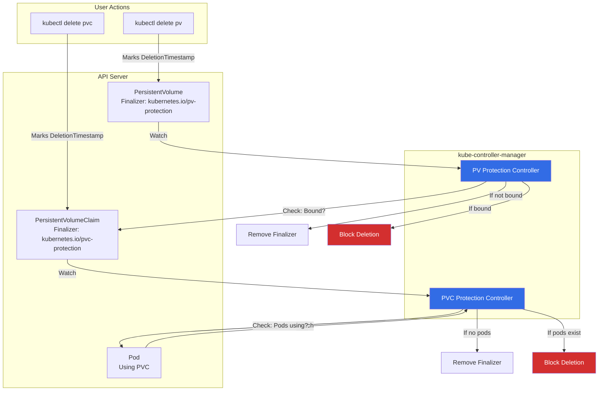
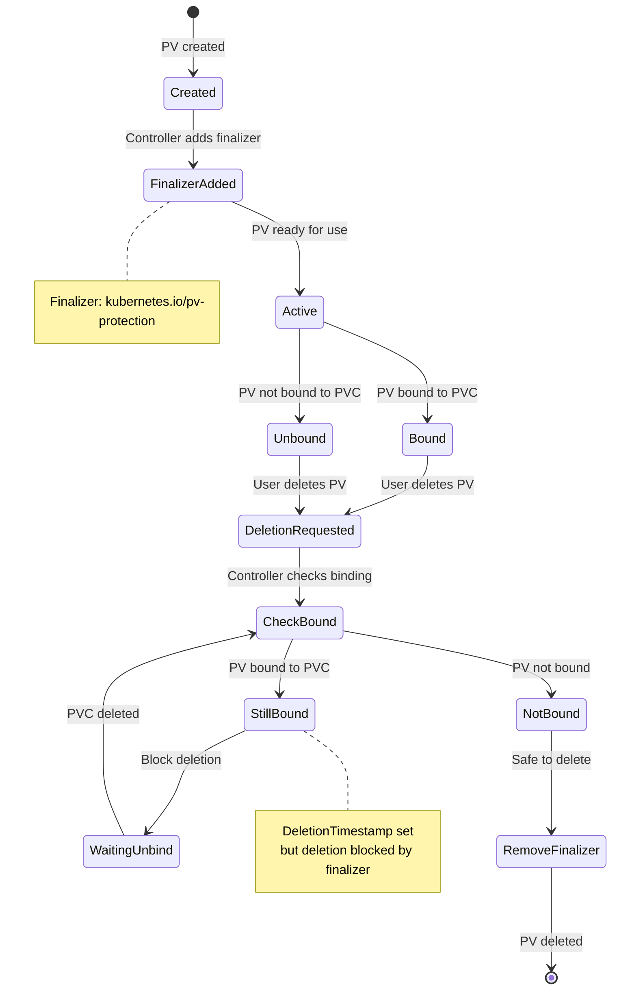
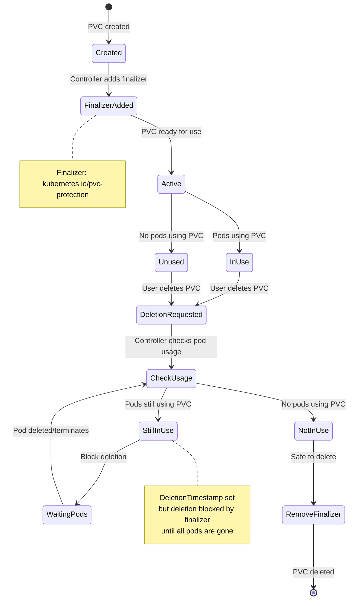

# Volume Protection Controllers - PV/PVC Deletion Protection

## Overview

Volume Protection Controllers prevent accidental deletion of **PersistentVolumes (PVs)** and **PersistentVolumeClaims (PVCs)** that are actively in use. They use **finalizers** to block deletion until it's safe.

**Primary Locations**:
- PV Protection: `pkg/controller/volume/pvprotection/pv_protection_controller.go`
- PVC Protection: `pkg/controller/volume/pvcprotection/pvc_protection_controller.go`

**Purpose**: Prevent data loss by ensuring volumes aren't deleted while bound or in use by pods

## Key Responsibilities

### PV Protection Controller
1. **Add Finalizer**: Add `kubernetes.io/pv-protection` to all PVs
2. **Check Binding**: Ensure PV is not bound to a PVC before allowing deletion
3. **Remove Finalizer**: Remove finalizer when PV is safe to delete

### PVC Protection Controller
1. **Add Finalizer**: Add `kubernetes.io/pvc-protection` to all PVCs
2. **Check Pod Usage**: Ensure no pods are using the PVC before allowing deletion
3. **Handle Ephemeral Volumes**: Special handling for generic ephemeral volumes
4. **Remove Finalizer**: Remove finalizer when PVC is safe to delete

## Architecture



## Core Data Structures

### PV Protection Controller

```go
// Location: pkg/controller/volume/pvprotection/pv_protection_controller.go:42-49

type Controller struct {
    client clientset.Interface

    pvLister       corelisters.PersistentVolumeLister
    pvListerSynced cache.InformerSynced

    queue workqueue.TypedRateLimitingInterface[string]
}
```

### PVC Protection Controller

```go
// Location: pkg/controller/volume/pvcprotection/pvc_protection_controller.go:104-116

type Controller struct {
    client clientset.Interface

    pvcLister       corelisters.PersistentVolumeClaimLister
    pvcListerSynced cache.InformerSynced

    podLister       corelisters.PodLister
    podListerSynced cache.InformerSynced
    podIndexer      cache.Indexer  // Indexed by PVC for fast lookup

    queue              workqueue.TypedRateLimitingInterface[string]
    pvcProcessingStore *pvcProcessingStore  // Batches PVCs by namespace
}
```

### Finalizers

```go
const (
    // PV protection finalizer
    PVProtectionFinalizer = "kubernetes.io/pv-protection"

    // PVC protection finalizer
    PVCProtectionFinalizer = "kubernetes.io/pvc-protection"
)
```

**Example PV with Finalizer**:
```yaml
apiVersion: v1
kind: PersistentVolume
metadata:
  name: pv-example
  finalizers:
  - kubernetes.io/pv-protection  # Blocks deletion
spec:
  capacity:
    storage: 10Gi
  claimRef:
    name: pvc-example
    namespace: default
status:
  phase: Bound
```

**Example PVC with Finalizer**:
```yaml
apiVersion: v1
kind: PersistentVolumeClaim
metadata:
  name: pvc-example
  namespace: default
  finalizers:
  - kubernetes.io/pvc-protection  # Blocks deletion
spec:
  accessModes:
  - ReadWriteOnce
  resources:
    requests:
      storage: 10Gi
status:
  phase: Bound
```

## State Machines

### PV Protection Lifecycle



### PVC Protection Lifecycle



## Algorithms

### 1. PV Protection: Add/Remove Finalizer

```go
// Simplified algorithm from pv_protection_controller.go

func (c *Controller) processPV(ctx context.Context, pvName string) error {
    pv, err := c.pvLister.Get(pvName)
    if err != nil {
        if apierrors.IsNotFound(err) {
            return nil  // Already deleted
        }
        return err
    }

    // Case 1: PV is being deleted
    if pv.DeletionTimestamp != nil {
        // Check if PV is bound
        if pv.Spec.ClaimRef != nil && pv.Status.Phase == v1.VolumeBound {
            // Still bound - don't remove finalizer
            return nil
        }

        // Not bound - safe to remove finalizer
        return c.removePVProtectionFinalizer(ctx, pv)
    }

    // Case 2: PV exists, ensure finalizer is present
    return c.addPVProtectionFinalizer(ctx, pv)
}
```

**Logic**:
- Add finalizer to all PVs
- On deletion: check if bound to PVC
- Remove finalizer only when unbound

### 2. PVC Protection: Check Pod Usage

```go
// Simplified algorithm from pvc_protection_controller.go

func (c *Controller) processPVC(ctx context.Context, pvcKey, pvcName, namespace string) error {
    pvc, err := c.pvcLister.PersistentVolumeClaims(namespace).Get(pvcName)
    if err != nil {
        if apierrors.IsNotFound(err) {
            return nil
        }
        return err
    }

    // Case 1: PVC is being deleted
    if pvc.DeletionTimestamp != nil {
        // Check if pods are using this PVC
        pods, err := c.podIndexer.ByIndex(common.PodPVCIndex, pvcKey)
        if err != nil {
            return err
        }

        // Filter out pods that are terminated
        podsUsingPVC := filterActivePods(pods)

        if len(podsUsingPVC) > 0 {
            // Pods still using PVC - don't remove finalizer
            return nil
        }

        // No pods using PVC - safe to remove finalizer
        return c.removePVCProtectionFinalizer(ctx, pvc)
    }

    // Case 2: PVC exists, ensure finalizer is present
    return c.addPVCProtectionFinalizer(ctx, pvc)
}

func filterActivePods(pods []interface{}) []*v1.Pod {
    var active []*v1.Pod
    for _, obj := range pods {
        pod := obj.(*v1.Pod)
        // Exclude terminated pods
        if pod.Status.Phase == v1.PodSucceeded || pod.Status.Phase == v1.PodFailed {
            continue
        }
        // Exclude pods with deletion timestamp
        if pod.DeletionTimestamp != nil {
            continue
        }
        active = append(active, pod)
    }
    return active
}
```

**Logic**:
- Add finalizer to all PVCs
- On deletion: find all pods using PVC (via indexed lookup)
- Filter out terminated pods
- Remove finalizer only when no active pods remain

### 3. PVC Indexing for Performance

```go
// Location: pkg/controller/volume/common/common.go

const PodPVCIndex = "pod-pvc-index"

// PodPVCIndexFunc returns PVC keys for a given pod
func PodPVCIndexFunc() cache.IndexFunc {
    return func(obj interface{}) ([]string, error) {
        pod := obj.(*v1.Pod)
        keys := sets.NewString()

        for _, volume := range pod.Spec.Volumes {
            if volume.PersistentVolumeClaim != nil {
                pvcKey := fmt.Sprintf("%s/%s", pod.Namespace, volume.PersistentVolumeClaim.ClaimName)
                keys.Insert(pvcKey)
            }
        }

        return keys.List(), nil
    }
}
```

**Benefit**: O(1) lookup of pods using a specific PVC (instead of scanning all pods)

## Use Cases

### Use Case 1: Prevent PVC Deletion While Pod Running

```bash
# Create PVC
kubectl apply -f - <<EOF
apiVersion: v1
kind: PersistentVolumeClaim
metadata:
  name: my-pvc
spec:
  accessModes: [ReadWriteOnce]
  resources:
    requests:
      storage: 1Gi
EOF

# Create pod using PVC
kubectl run nginx --image=nginx --restart=Never \
  --overrides='{"spec":{"volumes":[{"name":"vol","persistentVolumeClaim":{"claimName":"my-pvc"}}],"containers":[{"name":"nginx","image":"nginx","volumeMounts":[{"name":"vol","mountPath":"/data"}]}]}}'

# Try to delete PVC
kubectl delete pvc my-pvc
# PVC stuck in Terminating (blocked by finalizer)

$ kubectl get pvc
NAME     STATUS        VOLUME   CAPACITY   ACCESS MODES   AGE
my-pvc   Terminating   pv-xyz   1Gi        RWO            5m

# Delete pod
kubectl delete pod nginx

# PVC deletion completes (finalizer removed)
$ kubectl get pvc
No resources found
```

### Use Case 2: Prevent PV Deletion While Bound

```bash
# Create PV and PVC
kubectl apply -f pv.yaml
kubectl apply -f pvc.yaml

# PV becomes Bound to PVC
$ kubectl get pv
NAME   CAPACITY   STATUS   CLAIM        STORAGECLASS   AGE
pv-1   10Gi       Bound    default/pvc1                5m

# Try to delete PV
kubectl delete pv pv-1
# Stuck in Terminating

$ kubectl get pv pv-1 -o yaml
metadata:
  deletionTimestamp: "2025-10-21T10:00:00Z"
  finalizers:
  - kubernetes.io/pv-protection
status:
  phase: Bound
  claimRef:
    name: pvc1
    namespace: default

# Delete PVC first
kubectl delete pvc pvc1

# PV deletion completes (finalizer removed)
```

### Use Case 3: Generic Ephemeral Volumes

```yaml
# Pod with generic ephemeral volume
apiVersion: v1
kind: Pod
metadata:
  name: ephemeral-test
spec:
  containers:
  - name: test
    image: busybox
    volumeMounts:
    - name: scratch
      mountPath: /scratch
  volumes:
  - name: scratch
    ephemeral:
      volumeClaimTemplate:
        spec:
          accessModes: [ReadWriteOnce]
          resources:
            requests:
              storage: 1Gi
```

**Behavior**:
- PVC created automatically with pod
- PVC owned by pod (OwnerReference set)
- PVC has protection finalizer
- When pod deleted, PVC deleted (but protected until pod terminates)

## Configuration

### Worker Counts

```go
// PV Protection: 1 worker (light load)
func (c *Controller) Run(ctx context.Context, workers int) {
    for i := 0; i < workers; i++ {
        go wait.UntilWithContext(ctx, c.runWorker, time.Second)
    }
}

// PVC Protection: Variable workers (default 1 main + N namespace workers)
func (c *Controller) Run(ctx context.Context, workers int) {
    go wait.UntilWithContext(ctx, c.runMainWorker, time.Second)
    for i := 0; i < workers; i++ {
        go wait.UntilWithContext(ctx, c.runProcessNamespaceWorker, time.Second)
    }
}
```

### No Configuration Flags

These controllers have no user-configurable options - they always run and protect all PVs/PVCs.

## Troubleshooting

### Problem: PVC Stuck in Terminating

**Symptoms**:
```bash
$ kubectl delete pvc my-pvc
# Hangs...

$ kubectl get pvc my-pvc
NAME     STATUS        VOLUME   AGE
my-pvc   Terminating   pv-xyz   10m

$ kubectl get pvc my-pvc -o yaml
metadata:
  deletionTimestamp: "2025-10-21T10:00:00Z"
  finalizers:
  - kubernetes.io/pvc-protection
```

**Diagnosis**:
```bash
# Find pods using the PVC
kubectl get pods -A -o json | \
  jq '.items[] | select(.spec.volumes[]?.persistentVolumeClaim?.claimName=="my-pvc") | .metadata.name'

# Output: pod-using-pvc
```

**Cause**: Pod still using PVC

**Solution**:
```bash
# Delete the pod first
kubectl delete pod pod-using-pvc

# PVC will be deleted after pod terminates
```

**Force Delete (NOT RECOMMENDED)**:
```bash
# Remove finalizer manually (can cause data loss!)
kubectl patch pvc my-pvc -p '{"metadata":{"finalizers":null}}'

# WARNING: This bypasses protection and can leave orphaned volumes
```

### Problem: PV Stuck in Terminating

**Symptoms**:
```bash
$ kubectl get pv
NAME   CAPACITY   STATUS        CLAIM   AGE
pv-1   10Gi       Terminating   default/pvc1   10m
```

**Diagnosis**:
```bash
$ kubectl get pv pv-1 -o yaml
spec:
  claimRef:
    name: pvc1
    namespace: default
status:
  phase: Bound  # Still bound!
```

**Cause**: PV still bound to PVC

**Solution**:
```bash
# Delete PVC first
kubectl delete pvc pvc1

# Or wait for PVC controller to unbind
# (if PVC already deleted, binding should clear)
```

### Problem: Finalizer Not Added

**Symptoms**:
PV/PVC created but no protection finalizer

**Diagnosis**:
```bash
# Check controller logs
kubectl logs -n kube-system kube-controller-manager-xxx | grep "pv.*protection\|pvc.*protection"
```

**Causes**:
1. Controller not running
2. API errors preventing finalizer addition

**Solution**:
```bash
# Restart controller-manager
kubectl delete pod -n kube-system kube-controller-manager-xxx
```

## Performance

### PVC Protection Optimizations

**Namespace-Based Batching**:
- Groups PVCs by namespace
- Processes all PVCs in namespace together
- Shares pod list across PVCs in same namespace
- Reduces API calls

**Pod Indexing**:
- Creates index: PVC → Pods
- O(1) lookup instead of O(N) scan
- Critical for clusters with many pods

### Scalability

**Tested Limits**:
- PVs: Up to 10,000
- PVCs: Up to 10,000
- Pods: Up to 5,000 per namespace

**Performance**: Finalizer operations are fast (patch requests), minimal overhead

## Related Controllers

### PV Controller

**Document**: `13-volume-controllers.md`

**Relationship**:
- PV controller manages binding
- Protection controller prevents deletion
- Work together to ensure data safety

### Pod GC Controller

**Document**: `12-resource-lifecycle-controllers.md`

**Relationship**:
- Pod GC deletes terminated pods
- PVC protection waits for pod termination
- Coordination ensures proper cleanup order

## Summary

Volume Protection Controllers use **finalizers** to prevent accidental data loss:

1. 🔒 **PV Protection**: Blocks deletion of bound PVs
2. 🔒 **PVC Protection**: Blocks deletion of PVCs in use by pods
3. ✅ **Automatic**: All PVs/PVCs protected automatically
4. 🔄 **Safe Cleanup**: Finalizers removed when safe
5. ⚡ **Optimized**: Indexed lookups, namespace batching

**Key Points**:
- Finalizers: `kubernetes.io/pv-protection`, `kubernetes.io/pvc-protection`
- Cannot be disabled (always active for safety)
- Work with ephemeral volumes (generic ephemeral volume feature)
- Critical for preventing data loss

**Key Files**:
- PV Protection: `pkg/controller/volume/pvprotection/pv_protection_controller.go`
- PVC Protection: `pkg/controller/volume/pvcprotection/pvc_protection_controller.go`
- Common Utils: `pkg/controller/volume/protectionutil/`

---

**Next Document**: `42-ephemeral-volume-controllers.md` - Generic ephemeral volumes
