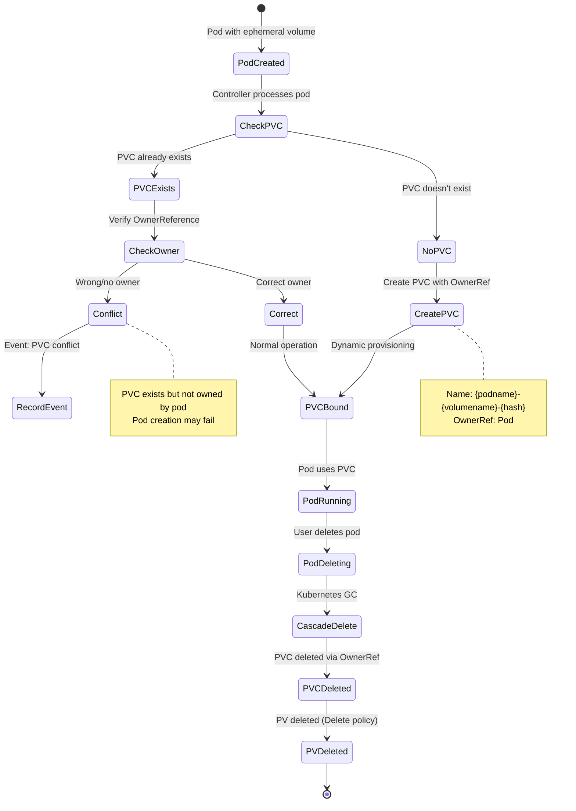

# Ephemeral Volume Controller - Generic Ephemeral Volumes

## Overview

The **Ephemeral Volume Controller** automatically creates and manages PersistentVolumeClaims for **generic ephemeral volumes** defined inline in pod specs. These PVCs are tied to the pod lifecycle and deleted when the pod is removed.

**Primary Location**: `pkg/controller/volume/ephemeral/controller.go`

**Feature**: Generic Ephemeral Volumes (GA in v1.23)

**Purpose**: Enable pod-local storage with PVC semantics (dynamic provisioning, storage classes, size limits) without manual PVC management

## Key Responsibilities

1. **Create PVCs**: Create PVCs from inline volume specifications in pods
2. **Set OwnerReferences**: Link PVCs to pods for automatic cleanup
3. **Conflict Handling**: Detect and handle conflicting PVCs
4. **Cleanup**: Ensure PVCs are deleted when pods are deleted

## Architecture

```mermaid
graph TB
    subgraph "Pod Spec"
        Pod[Pod with Ephemeral Volume<br/>volumes.ephemeral.volumeClaimTemplate]
    end

    subgraph "kube-controller-manager"
        EphCtrl[Ephemeral Volume Controller]
        Queue[Work Queue]
    end

    subgraph "Created Resources"
        PVC[PVC<br/>Name: podname-volumename-xxxxx<br/>OwnerRef: Pod]
        PV[PersistentVolume<br/>Dynamically Provisioned]
    end

    subgraph "Storage"
        Storage[Storage Backend<br/>via CSI/In-Tree]
    end

    Pod -->|Watch| EphCtrl
    EphCtrl -->|Create| PVC
    EphCtrl -->|Set OwnerRef| Pod

    PVC -->|Triggers| Provisioner[Dynamic Provisioner]
    Provisioner -->|Creates| PV
    PV -->|Backed by| Storage

    Pod -.->|Deleted| Cascade[Cascade Delete]
    Cascade -.->|Deletes| PVC
    PVC -.->|Deletes| PV

    style EphCtrl fill:#326ce5,color:#fff
```

## Core Data Structures

### Controller Structure

```go
// Location: pkg/controller/volume/ephemeral/controller.go:50-75

type ephemeralController struct {
    kubeClient clientset.Interface

    pvcLister  corelisters.PersistentVolumeClaimLister
    pvcsSynced cache.InformerSynced

    podLister corelisters.PodLister
    podSynced cache.InformerSynced
    podIndexer cache.Indexer  // Indexed by PVC for fast lookup

    recorder record.EventRecorder
    queue workqueue.TypedRateLimitingInterface[string]
}
```

### Generic Ephemeral Volume Spec

```yaml
apiVersion: v1
kind: Pod
metadata:
  name: my-app
spec:
  containers:
  - name: app
    image: nginx
    volumeMounts:
    - name: scratch-space
      mountPath: /scratch
  volumes:
  - name: scratch-space
    ephemeral:
      volumeClaimTemplate:
        metadata:
          labels:
            type: ephemeral-scratch
        spec:
          accessModes: [ReadWriteOnce]
          storageClassName: fast-ssd
          resources:
            requests:
              storage: 10Gi
```

**Controller creates PVC**:
```yaml
apiVersion: v1
kind: PersistentVolumeClaim
metadata:
  name: my-app-scratch-space-a1b2c  # Generated name
  namespace: default
  labels:
    type: ephemeral-scratch
  ownerReferences:
  - apiVersion: v1
    kind: Pod
    name: my-app
    uid: <pod-uid>
    controller: true
    blockOwnerDeletion: true
spec:
  accessModes: [ReadWriteOnce]
  storageClassName: fast-ssd
  resources:
    requests:
      storage: 10Gi
```

## State Machine



## Algorithms

### 1. Pod Processing - Create PVC

```go
// Simplified from controller.go

func (ec *ephemeralController) syncPod(ctx context.Context, key string) error {
    namespace, name, _ := cache.SplitMetaNamespaceKey(key)

    pod, err := ec.podLister.Pods(namespace).Get(name)
    if err != nil {
        if errors.IsNotFound(err) {
            return nil  // Pod deleted
        }
        return err
    }

    // Process each ephemeral volume in pod
    for _, volume := range pod.Spec.Volumes {
        if volume.Ephemeral == nil {
            continue  // Not an ephemeral volume
        }

        // Generate PVC name
        pvcName := ephemeral.VolumeClaimName(pod, &volume)

        // Check if PVC exists
        pvc, err := ec.pvcLister.PersistentVolumeClaims(pod.Namespace).Get(pvcName)

        if errors.IsNotFound(err) {
            // Create PVC
            pvc := generatePVC(pod, &volume)
            _, err = ec.kubeClient.CoreV1().PersistentVolumeClaims(pod.Namespace).Create(ctx, pvc, metav1.CreateOptions{})
            if err != nil {
                ec.recorder.Eventf(pod, v1.EventTypeWarning, events.FailedBinding,
                    "Failed to create ephemeral PVC: %v", err)
                return err
            }
            ec.recorder.Eventf(pod, v1.EventTypeNormal, events.SuccessfulCreate,
                "Created ephemeral PVC %s", pvcName)
        } else if err == nil {
            // PVC exists - verify ownership
            if !metav1.IsControlledBy(pvc, pod) {
                ec.recorder.Eventf(pod, v1.EventTypeWarning, events.FailedBinding,
                    "PVC %s already exists and is not owned by pod", pvcName)
                // This is a conflict - kubelet will fail to mount
            }
        } else {
            return err  // Other error
        }
    }

    return nil
}

func generatePVC(pod *v1.Pod, volume *v1.Volume) *v1.PersistentVolumeClaim {
    pvcName := ephemeral.VolumeClaimName(pod, volume)

    pvc := &v1.PersistentVolumeClaim{
        ObjectMeta: metav1.ObjectMeta{
            Name:      pvcName,
            Namespace: pod.Namespace,
            Labels:    volume.Ephemeral.VolumeClaimTemplate.Labels,
            Annotations: volume.Ephemeral.VolumeClaimTemplate.Annotations,
            OwnerReferences: []metav1.OwnerReference{
                {
                    APIVersion:         "v1",
                    Kind:               "Pod",
                    Name:               pod.Name,
                    UID:                pod.UID,
                    Controller:         pointer.Bool(true),
                    BlockOwnerDeletion: pointer.Bool(true),
                },
            },
        },
        Spec: volume.Ephemeral.VolumeClaimTemplate.Spec,
    }

    return pvc
}
```

### 2. PVC Naming

```go
// Location: staging/src/k8s.io/component-helpers/storage/ephemeral/volume_claim_name.go

func VolumeClaimName(pod *v1.Pod, volume *v1.Volume) string {
    // Hash pod UID for uniqueness
    hash := sha256.Sum256([]byte(pod.UID))
    hashStr := hex.EncodeToString(hash[:])[:7]

    // Name: <pod-name>-<volume-name>-<hash>
    return fmt.Sprintf("%s-%s-%s", pod.Name, volume.Name, hashStr)
}
```

**Example**:
- Pod: `my-app`, UID: `12345678-abcd-...`
- Volume: `scratch-space`
- Generated PVC name: `my-app-scratch-space-a1b2c3d`

## Use Cases

### Use Case 1: Temporary Scratch Space

```yaml
apiVersion: v1
kind: Pod
metadata:
  name: build-job
spec:
  containers:
  - name: builder
    image: golang:1.21
    command: ["go", "build", "-o", "/output/app", "."]
    volumeMounts:
    - name: build-cache
      mountPath: /go/pkg
    - name: output
      mountPath: /output
  volumes:
  - name: build-cache
    ephemeral:
      volumeClaimTemplate:
        spec:
          accessModes: [ReadWriteOnce]
          resources:
            requests:
              storage: 5Gi
  - name: output
    ephemeral:
      volumeClaimTemplate:
        spec:
          accessModes: [ReadWriteOnce]
          resources:
            requests:
              storage: 1Gi
```

**Behavior**:
- Two PVCs created automatically
- Both deleted when pod completes

### Use Case 2: Per-Pod Database Storage

```yaml
apiVersion: apps/v1
kind: StatefulSet
metadata:
  name: cache
spec:
  serviceName: cache
  replicas: 3
  selector:
    matchLabels:
      app: cache
  template:
    metadata:
      labels:
        app: cache
    spec:
      containers:
      - name: redis
        image: redis:7
        volumeMounts:
        - name: data
          mountPath: /data
      volumes:
      - name: data
        ephemeral:
          volumeClaimTemplate:
            spec:
              accessModes: [ReadWriteOnce]
              storageClassName: fast-ssd
              resources:
                requests:
                  storage: 10Gi
```

**Note**: For StatefulSets, prefer `volumeClaimTemplates` (persistent) over ephemeral volumes

### Use Case 3: Storage Class Selection

```yaml
volumes:
- name: fast-scratch
  ephemeral:
    volumeClaimTemplate:
      spec:
        accessModes: [ReadWriteOnce]
        storageClassName: nvme-ssd  # Use fast storage
        resources:
          requests:
            storage: 20Gi
```

## Comparison with Other Volume Types

| Feature | ephemeral | emptyDir | PVC (manual) |
|---------|-----------|----------|--------------|
| **Storage type** | Persistent (PV) | Node-local | Persistent (PV) |
| **Lifecycle** | Tied to pod | Tied to pod | Independent |
| **Dynamic provisioning** | ✅ Yes | ❌ No | ✅ Yes |
| **Storage class** | ✅ Supported | ❌ N/A | ✅ Supported |
| **Size limit** | ✅ Enforced | ⚠️ Optional | ✅ Enforced |
| **Survives restart** | ✅ Yes | ❌ No | ✅ Yes |
| **Manual PVC** | ❌ Auto-created | ❌ N/A | ✅ Required |
| **Sharing between pods** | ❌ No | ❌ No | ✅ Yes |

**When to use each**:
- **ephemeral**: Need PV features (size, storage class, provisioning) but pod-local lifecycle
- **emptyDir**: Simple temp storage, no persistence across restarts needed
- **manual PVC**: Data must survive pod deletion, sharing between pods

## Configuration

### No Controller Flags

The ephemeral volume controller runs automatically when pods with ephemeral volumes are created.

### Worker Count

```go
// Default: 10 workers
func (ec *ephemeralController) Run(ctx context.Context, workers int) {
    for i := 0; i < workers; i++ {
        go wait.UntilWithContext(ctx, ec.runWorker, time.Second)
    }
}
```

## Troubleshooting

### Problem: PVC Not Created

**Symptoms**:
```bash
$ kubectl describe pod my-app
Events:
  Warning  FailedMount  5s  kubelet  Unable to attach or mount volumes
```

**Diagnosis**:
```bash
# Check controller logs
kubectl logs -n kube-system kube-controller-manager-xxx | grep ephemeral

# Check for PVC
kubectl get pvc | grep my-app
```

**Causes**:
1. Controller not running
2. PVC creation failed (API error)
3. Name conflict

**Solutions**:
```bash
# Restart controller-manager
kubectl delete pod -n kube-system kube-controller-manager-xxx

# Check for conflicting PVC
kubectl get pvc my-app-volumename-xxxxx
# If exists without correct OwnerRef, delete it
kubectl delete pvc my-app-volumename-xxxxx
```

### Problem: PVC Conflict

**Symptoms**:
```bash
$ kubectl describe pod my-app
Events:
  Warning  FailedBinding  10s  ephemeral-volume  PVC my-app-data-a1b2c already exists and is not owned by pod
```

**Cause**: PVC with same name exists but not owned by this pod

**Solutions**:
```bash
# Option 1: Delete conflicting PVC
kubectl delete pvc my-app-data-a1b2c

# Option 2: Delete and recreate pod (new hash)
kubectl delete pod my-app
kubectl apply -f pod.yaml
```

### Problem: PVC Not Deleted After Pod Deletion

**Symptoms**:
PVC remains after pod deleted

**Diagnosis**:
```bash
$ kubectl get pvc my-app-data-a1b2c -o yaml
metadata:
  ownerReferences:
  - apiVersion: v1
    kind: Pod
    name: my-app
    uid: ...
    controller: true
    blockOwnerDeletion: true
```

**Causes**:
1. Kubernetes garbage collection delayed
2. PVC has additional finalizers
3. Volume protection finalizer (normal)

**Normal behavior**: PVC will be deleted by garbage collector after finalizers removed

## Metrics

```prometheus
# Ephemeral volume operations
ephemeral_volume_create_total
ephemeral_volume_create_failures_total
```

## Related Controllers

### PVC Protection Controller

**Document**: `41-volume-protection-controllers.md`

**Relationship**:
- Adds finalizer to ephemeral PVCs
- Blocks PVC deletion while pod using it
- Works together: OwnerRef + finalizer ensures proper cleanup order

### Garbage Collector

**Relationship**:
- Deletes PVCs when owner (pod) deleted
- Respects `blockOwnerDeletion: true` (waits for finalizers)

## Summary

Ephemeral Volume Controller enables **inline PVC definitions** for pod-local storage:

1. ✅ **Auto-creates PVCs** from inline volume specs
2. 🔗 **OwnerReferences** link PVCs to pods
3. 🗑️ **Automatic cleanup** when pod deleted
4. 💾 **PV features**: Dynamic provisioning, storage classes, size limits
5. 🔄 **Survives restarts**: Unlike emptyDir (backed by PV)

**Key Points**:
- GA feature (v1.23+)
- No manual PVC management required
- Ideal for job/batch workloads
- Not for data that outlives pod

**Key Files**:
- Controller: `pkg/controller/volume/ephemeral/controller.go`
- Name generation: `staging/src/k8s.io/component-helpers/storage/ephemeral/`

---

**Storage Section Complete**: Documents 39-42 ✅
**Next Section**: Advanced Workload Controllers (documents 45-48)
