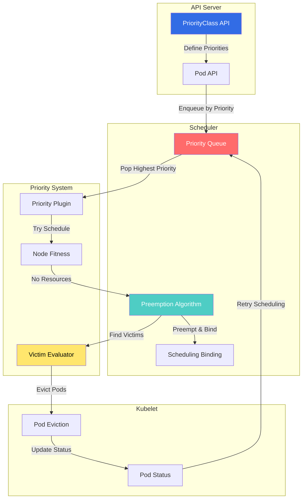
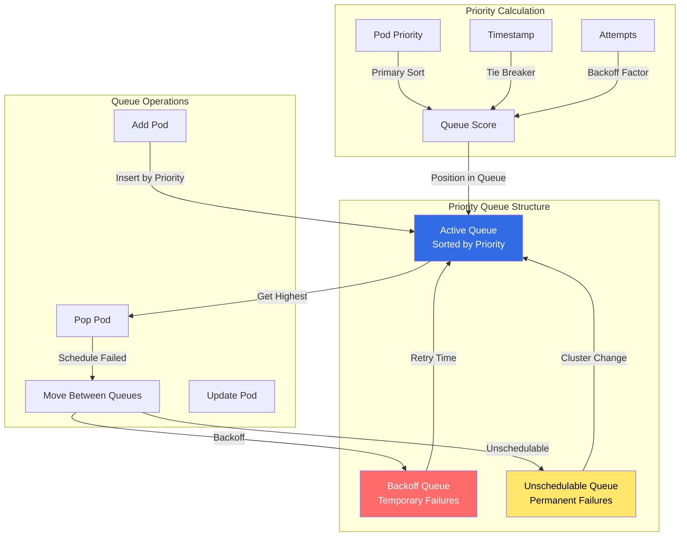
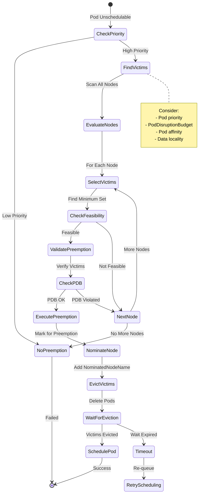
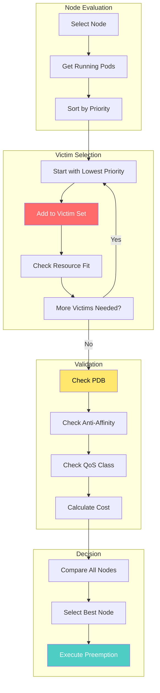
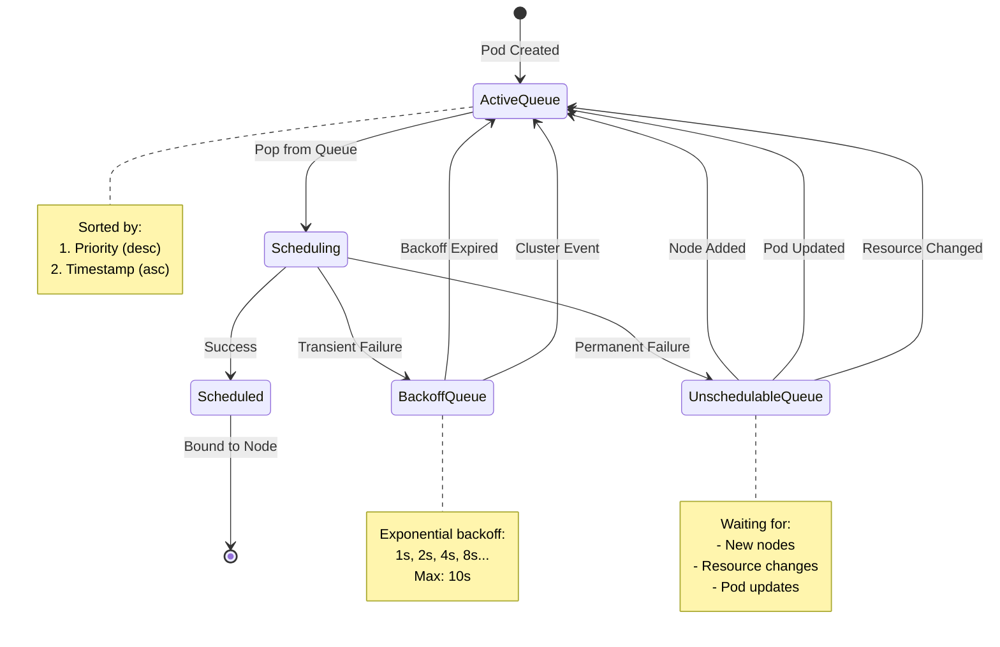
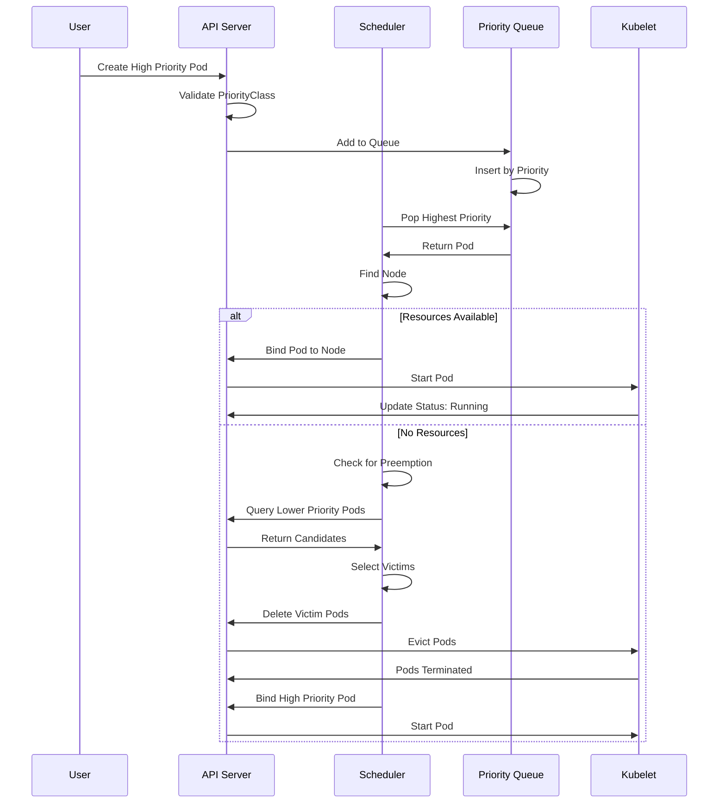
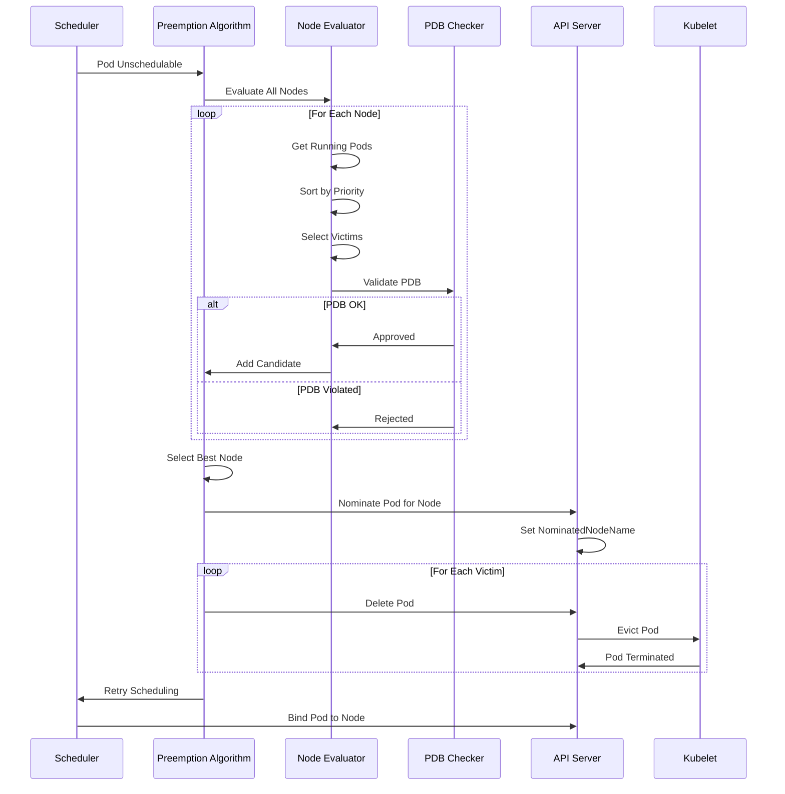

# Priority and Preemption in Kubernetes

## Overview

The Priority and Preemption system in Kubernetes enables pod scheduling based on relative importance, allowing higher-priority pods to preempt (evict) lower-priority pods when resources are scarce. This is critical for multi-tenant clusters and ensuring critical workloads get resources.

**Key Components:**
- **PriorityClass**: API object defining priority values
- **Scheduler Priority Queue**: Priority-based scheduling queue
- **Preemption Algorithm**: Logic for selecting victims for eviction
- **Pod Priority Admission**: Validates and sets pod priority

## Architecture

### Component Interaction



### Priority Queue Architecture



## Preemption Algorithm

### Preemption Flow



### Victim Selection Algorithm



## Source Code References

### Priority Queue Implementation

**File:** `pkg/scheduler/internal/queue/scheduling_queue.go`

```go
// Priority queue implementation
type PriorityQueue struct {
    // activeQ holds pods being scheduled
    activeQ *heap.Heap
    // podBackoffQ holds pods in backoff
    podBackoffQ *heap.Heap
    // unschedulablePods holds permanently unschedulable pods
    unschedulablePods *UnschedulablePods

    // nominatedPods tracks pods nominated for nodes
    nominatedPods *nominatedPodMap

    // Metrics
    metrics *queueMetrics

    lock sync.RWMutex
    cond sync.Cond
}

// Add adds a pod to the active queue
func (p *PriorityQueue) Add(pod *v1.Pod) error {
    p.lock.Lock()
    defer p.lock.Unlock()

    pInfo := p.newPodInfo(pod)
    if err := p.activeQ.Add(pInfo); err != nil {
        return err
    }

    // Update metrics
    p.metrics.addToActiveQ()
    p.cond.Broadcast()
    return nil
}

// Pop removes the highest priority pod
func (p *PriorityQueue) Pop() (*framework.QueuedPodInfo, error) {
    p.lock.Lock()
    defer p.lock.Unlock()

    for p.activeQ.Len() == 0 {
        p.cond.Wait()
    }

    obj, err := p.activeQ.Pop()
    if err != nil {
        return nil, err
    }

    pInfo := obj.(*framework.QueuedPodInfo)
    p.metrics.removeFromActiveQ()
    return pInfo, nil
}
```

**Location:** `pkg/scheduler/internal/queue/scheduling_queue.go:100-200`

### Preemption Algorithm

**File:** `pkg/scheduler/framework/plugins/defaultpreemption/default_preemption.go`

```go
// Preempt finds nodes with pods that can be preempted
func (pl *DefaultPreemption) Preempt(
    ctx context.Context,
    state *framework.CycleState,
    pod *v1.Pod,
    m framework.NodeToStatusMap,
) (*framework.PostFilterResult, *framework.Status) {

    // Get all nodes for evaluation
    allNodes, err := pl.fh.SnapshotSharedLister().NodeInfos().List()
    if err != nil {
        return nil, framework.AsStatus(err)
    }

    // Find potential nodes for preemption
    potentialNodes, err := pl.findCandidates(
        ctx, state, pod, allNodes, m,
    )
    if err != nil {
        return nil, framework.AsStatus(err)
    }

    if len(potentialNodes) == 0 {
        return nil, framework.NewStatus(
            framework.Unschedulable,
            "no nodes available for preemption",
        )
    }

    // Select best node
    node := pl.selectBestNode(ctx, state, pod, potentialNodes)

    return &framework.PostFilterResult{
        NominatedNodeName: node.Name,
    }, framework.NewStatus(framework.Success)
}

// findCandidates finds all nodes where preemption is possible
func (pl *DefaultPreemption) findCandidates(
    ctx context.Context,
    state *framework.CycleState,
    pod *v1.Pod,
    nodes []*framework.NodeInfo,
    m framework.NodeToStatusMap,
) ([]Candidate, error) {

    var candidates []Candidate

    for _, node := range nodes {
        // Check if pod can fit after preemption
        victims, fits := pl.selectVictimsOnNode(
            ctx, state, pod, node, m,
        )

        if !fits {
            continue
        }

        // Validate PodDisruptionBudget
        if !pl.validatePDB(victims) {
            continue
        }

        candidates = append(candidates, Candidate{
            Node:    node,
            Victims: victims,
        })
    }

    return candidates, nil
}

// selectVictimsOnNode selects pods to preempt on a node
func (pl *DefaultPreemption) selectVictimsOnNode(
    ctx context.Context,
    state *framework.CycleState,
    pod *v1.Pod,
    node *framework.NodeInfo,
    m framework.NodeToStatusMap,
) ([]*v1.Pod, bool) {

    podPriority := pod.Spec.Priority

    // Get all pods on node sorted by priority
    pods := node.Pods
    sort.Slice(pods, func(i, j int) bool {
        return *pods[i].Pod.Spec.Priority < *pods[j].Pod.Spec.Priority
    })

    var victims []*v1.Pod
    resourcesReleased := framework.NewResource()

    // Add victims until pod fits
    for _, p := range pods {
        // Skip higher or equal priority pods
        if *p.Pod.Spec.Priority >= *podPriority {
            continue
        }

        victims = append(victims, p.Pod)
        resourcesReleased.Add(p.Pod)

        // Check if pod fits now
        if pl.podFitsAfterPreemption(
            ctx, state, pod, node, victims, resourcesReleased,
        ) {
            return victims, true
        }
    }

    return nil, false
}
```

**Location:** `pkg/scheduler/framework/plugins/defaultpreemption/default_preemption.go:50-250`

### Priority Plugin

**File:** `pkg/scheduler/framework/plugins/podpriority/pod_priority.go`

```go
// PodPriority is a plugin that orders pods by priority
type PodPriority struct{}

// Name returns plugin name
func (pl *PodPriority) Name() string {
    return "PodPriority"
}

// Less compares two pods by priority
func (pl *PodPriority) Less(
    pInfo1, pInfo2 *framework.QueuedPodInfo,
) bool {
    p1 := corev1helpers.PodPriority(pInfo1.Pod)
    p2 := corev1helpers.PodPriority(pInfo2.Pod)

    // Higher priority first
    if p1 != p2 {
        return p1 > p2
    }

    // Same priority: older pod first
    return pInfo1.Timestamp.Before(pInfo2.Timestamp)
}
```

**Location:** `pkg/scheduler/framework/plugins/podpriority/pod_priority.go:30-60`

### PriorityClass Validation

**File:** `pkg/apis/scheduling/validation/validation.go`

```go
// ValidatePriorityClass validates a PriorityClass
func ValidatePriorityClass(pc *scheduling.PriorityClass) field.ErrorList {
    allErrs := field.ErrorList{}

    // Validate name
    allErrs = append(
        allErrs,
        apivalidation.ValidateObjectMeta(
            &pc.ObjectMeta,
            false,
            ValidatePriorityClassName,
            field.NewPath("metadata"),
        )...,
    )

    // Validate value
    if pc.Value < scheduling.LowestUserDefinablePriority ||
       pc.Value > scheduling.HighestUserDefinablePriority {
        allErrs = append(
            allErrs,
            field.Invalid(
                field.NewPath("value"),
                pc.Value,
                fmt.Sprintf(
                    "must be between %d and %d",
                    scheduling.LowestUserDefinablePriority,
                    scheduling.HighestUserDefinablePriority,
                ),
            ),
        )
    }

    return allErrs
}
```

**Location:** `pkg/apis/scheduling/validation/validation.go:40-80`

## Priority Queue State Machine



## Sequence Diagrams

### Pod Scheduling with Priority



### Preemption Sequence



## Configuration Examples

### PriorityClass Definition

```yaml
# High priority for critical system components
apiVersion: scheduling.k8s.io/v1
kind: PriorityClass
metadata:
  name: system-critical
value: 1000000000
globalDefault: false
description: "Critical system components"
---
# Medium priority for production workloads
apiVersion: scheduling.k8s.io/v1
kind: PriorityClass
metadata:
  name: production-high
value: 10000
globalDefault: false
description: "High priority production workloads"
---
# Low priority for batch jobs
apiVersion: scheduling.k8s.io/v1
kind: PriorityClass
metadata:
  name: batch-low
value: 100
globalDefault: false
description: "Low priority batch processing"
preemptionPolicy: Never  # Cannot preempt other pods
---
# Default priority
apiVersion: scheduling.k8s.io/v1
kind: PriorityClass
metadata:
  name: default-priority
value: 0
globalDefault: true
description: "Default priority for pods"
```

### Pod with Priority

```yaml
apiVersion: v1
kind: Pod
metadata:
  name: critical-app
  labels:
    app: critical-service
spec:
  priorityClassName: system-critical

  containers:
  - name: app
    image: critical-service:1.0
    resources:
      requests:
        memory: "2Gi"
        cpu: "1000m"
      limits:
        memory: "4Gi"
        cpu: "2000m"

  # Prevent preemption of this pod
  preemptionPolicy: Never
```

### Deployment with Priority and PDB

```yaml
# Deployment with high priority
apiVersion: apps/v1
kind: Deployment
metadata:
  name: frontend
spec:
  replicas: 3
  selector:
    matchLabels:
      app: frontend
  template:
    metadata:
      labels:
        app: frontend
    spec:
      priorityClassName: production-high

      containers:
      - name: frontend
        image: frontend:1.0
        resources:
          requests:
            memory: "512Mi"
            cpu: "500m"
---
# PodDisruptionBudget to limit preemption
apiVersion: policy/v1
kind: PodDisruptionBudget
metadata:
  name: frontend-pdb
spec:
  minAvailable: 2
  selector:
    matchLabels:
      app: frontend
```

### Scheduler Configuration with Preemption

```yaml
apiVersion: kubescheduler.config.k8s.io/v1
kind: KubeSchedulerConfiguration
profiles:
- schedulerName: default-scheduler
  plugins:
    # Queue sorting plugin
    queueSort:
      enabled:
      - name: PrioritySort

    # Preemption plugin
    postFilter:
      enabled:
      - name: DefaultPreemption
      disabled:
      - name: "*"

  pluginConfig:
  - name: DefaultPreemption
    args:
      # Minimum candidate nodes to consider
      minCandidateNodesPercentage: 10
      minCandidateNodesAbsolute: 100
```

## Monitoring and Metrics

### Key Metrics

```yaml
# Priority queue metrics
scheduler_queue_incoming_pods_total{queue="active"}
scheduler_queue_incoming_pods_total{queue="backoff"}
scheduler_queue_incoming_pods_total{queue="unschedulable"}

# Preemption metrics
scheduler_preemption_attempts_total
scheduler_preemption_victims_total

# Scheduling metrics by priority
scheduler_pod_scheduling_duration_seconds{priority="1000000000"}
scheduler_pod_scheduling_duration_seconds{priority="10000"}
scheduler_pod_scheduling_duration_seconds{priority="0"}

# Queue depth by priority
scheduler_pending_pods{queue="active",priority="high"}
scheduler_pending_pods{queue="active",priority="medium"}
scheduler_pending_pods{queue="active",priority="low"}
```

### Prometheus Queries

```promql
# Preemption rate
rate(scheduler_preemption_attempts_total[5m])

# Average victims per preemption
rate(scheduler_preemption_victims_total[5m]) /
rate(scheduler_preemption_attempts_total[5m])

# Queue depth by priority
sum(scheduler_pending_pods{queue="active"}) by (priority)

# Scheduling latency by priority
histogram_quantile(0.95,
  rate(scheduler_pod_scheduling_duration_seconds_bucket[5m])
) by (priority)

# Preemption impact
sum(rate(pod_evictions_total{reason="Preempted"}[5m]))
```

## Troubleshooting Guide

### Common Issues

#### Issue 1: High Priority Pod Not Preempting

**Symptoms:**
- High priority pod remains pending
- Lower priority pods running on nodes
- No preemption attempts in logs

**Diagnosis:**
```bash
# Check pod priority
kubectl get pod high-priority-pod -o jsonpath='{.spec.priority}'

# Check PriorityClass
kubectl get priorityclass

# Check scheduler logs
kubectl logs -n kube-system kube-scheduler-xxx | grep -i preempt

# Check pod events
kubectl describe pod high-priority-pod
```

**Common Causes:**
1. **PreemptionPolicy set to Never**
   ```yaml
   spec:
     preemptionPolicy: Never  # Cannot preempt
   ```

2. **PodDisruptionBudget blocking preemption**
   ```bash
   # Check PDBs
   kubectl get pdb -A
   kubectl describe pdb frontend-pdb
   ```

3. **No suitable victims**
   - All running pods have higher/equal priority
   - Pod anti-affinity prevents preemption

**Resolution:**
```bash
# Update preemption policy
kubectl patch pod high-priority-pod -p '
{
  "spec": {
    "preemptionPolicy": "PreemptLowerPriority"
  }
}'

# Adjust PDB
kubectl patch pdb frontend-pdb -p '
{
  "spec": {
    "minAvailable": 1
  }
}'
```

#### Issue 2: Excessive Preemption

**Symptoms:**
- Frequent pod evictions
- Unstable workloads
- High scheduling churn

**Diagnosis:**
```bash
# Check preemption rate
kubectl get events -A --field-selector reason=Preempted

# Check evicted pods
kubectl get pods -A --field-selector status.phase=Failed

# Analyze preemption patterns
kubectl get events -A --sort-by='.lastTimestamp' | grep Preempted
```

**Common Causes:**
1. **Too many priority classes**
2. **Insufficient cluster resources**
3. **Missing resource requests**
4. **Priority inversion**

**Resolution:**
```bash
# Consolidate priority classes
kubectl get priorityclass

# Add resource requests
kubectl patch deployment frontend -p '
{
  "spec": {
    "template": {
      "spec": {
        "containers": [{
          "name": "app",
          "resources": {
            "requests": {
              "memory": "512Mi",
              "cpu": "500m"
            }
          }
        }]
      }
    }
  }
}'

# Add PodDisruptionBudget
kubectl apply -f pdb.yaml
```

#### Issue 3: Priority Queue Backup

**Symptoms:**
- Increasing queue depth
- Slow scheduling
- Pods stuck in pending

**Diagnosis:**
```bash
# Check scheduler metrics
kubectl get --raw /metrics | grep scheduler_queue

# Check pending pods
kubectl get pods -A --field-selector status.phase=Pending

# Check scheduler health
kubectl get componentstatus scheduler
```

**Common Causes:**
1. **Scheduler overload**
2. **Too many unschedulable pods**
3. **Node capacity issues**

**Resolution:**
```bash
# Scale up cluster
kubectl scale nodes --replicas=10

# Delete unschedulable pods
kubectl delete pods --field-selector status.phase=Pending \
  --all-namespaces

# Restart scheduler
kubectl delete pod -n kube-system kube-scheduler-xxx
```

### Debug Commands

```bash
# View priority queue state
kubectl get --raw /debug/api_priority_and_fairness/dump_priority_levels

# Check pod scheduling decisions
kubectl get events --sort-by='.lastTimestamp' \
  --field-selector involvedObject.kind=Pod

# Analyze preemption decisions
kubectl logs -n kube-system kube-scheduler-xxx \
  --tail=1000 | grep -A 10 "preemption"

# Check nominated pods
kubectl get pods -A -o json | jq '.items[] |
  select(.status.nominatedNodeName != null) |
  {name: .metadata.name, node: .status.nominatedNodeName}'

# Monitor scheduling latency
kubectl get --raw /metrics | grep scheduler_pod_scheduling_duration
```

## Best Practices

### Priority Class Design

1. **Use System Priorities Sparingly**
   ```yaml
   # Reserve 1B+ for critical system components only
   apiVersion: scheduling.k8s.io/v1
   kind: PriorityClass
   metadata:
     name: system-node-critical
   value: 2000001000
   ```

2. **Create Logical Tiers**
   ```yaml
   # Critical services: 10000
   # Production: 1000
   # Staging: 100
   # Development: 10
   # Batch: 0
   ```

3. **Document Priority Rationale**
   ```yaml
   description: "Frontend services requiring <1s response time"
   ```

### Preemption Guidelines

1. **Protect Critical Workloads with PDB**
   ```yaml
   apiVersion: policy/v1
   kind: PodDisruptionBudget
   metadata:
     name: critical-pdb
   spec:
     maxUnavailable: 1
     selector:
       matchLabels:
         tier: critical
   ```

2. **Use PreemptionPolicy Judiciously**
   ```yaml
   spec:
     priorityClassName: critical
     preemptionPolicy: Never  # For truly critical pods
   ```

3. **Set Appropriate Resource Requests**
   ```yaml
   resources:
     requests:
       memory: "1Gi"  # Realistic request
       cpu: "500m"
   ```

### Queue Management

1. **Monitor Queue Depth**
   - Alert on excessive pending pods
   - Track queue latency metrics

2. **Tune Backoff Parameters**
   ```yaml
   pluginConfig:
   - name: DefaultPreemption
     args:
       podInitialBackoffSeconds: 1
       podMaxBackoffSeconds: 10
   ```

3. **Handle Unschedulable Pods**
   - Delete permanently unschedulable pods
   - Fix cluster capacity issues

## Performance Considerations

### Preemption Cost

**Factors:**
- Number of nodes to evaluate
- Number of pods per node
- PDB validation overhead
- Pod termination time

**Optimization:**
```yaml
# Limit candidate nodes
pluginConfig:
- name: DefaultPreemption
  args:
    minCandidateNodesPercentage: 10  # Evaluate 10% of nodes
    minCandidateNodesAbsolute: 100   # At least 100 nodes
```

### Queue Performance

**Considerations:**
- Priority queue is O(log n) for insert/pop
- Lock contention with high pod churn
- Memory usage with large queue depth

**Tuning:**
```yaml
# Batch processing
--kube-api-qps=100
--kube-api-burst=200

# Scheduling rate
--pods-per-core=10
```

## Related Components

- **Scheduler** (`pkg/scheduler/`): Implements priority queue and preemption
- **PriorityClass API** (`pkg/apis/scheduling/`): Priority class definitions
- **Pod Admission** (`plugin/pkg/admission/priority/`): Priority validation
- **Resource Quota** (`pkg/quota/`): Quota enforcement with priority
- **PodDisruptionBudget** (`pkg/controller/disruption/`): Limits preemption impact

## References

- **KEP-902**: [Pod Priority and Preemption](https://github.com/kubernetes/enhancements/tree/master/keps/sig-scheduling/902-pod-priority-preemption)
- **KEP-1845**: [PreemptionPolicy](https://github.com/kubernetes/enhancements/tree/master/keps/sig-scheduling/1845-preemption-policy)
- **Design Doc**: [Priority and Preemption](https://github.com/kubernetes/design-proposals-archive/blob/main/scheduling/pod-priority-api.md)
- **Source Code**: `pkg/scheduler/framework/plugins/defaultpreemption/`
- **API Reference**: [PriorityClass v1](https://kubernetes.io/docs/reference/kubernetes-api/workload-resources/priority-class-v1/)
