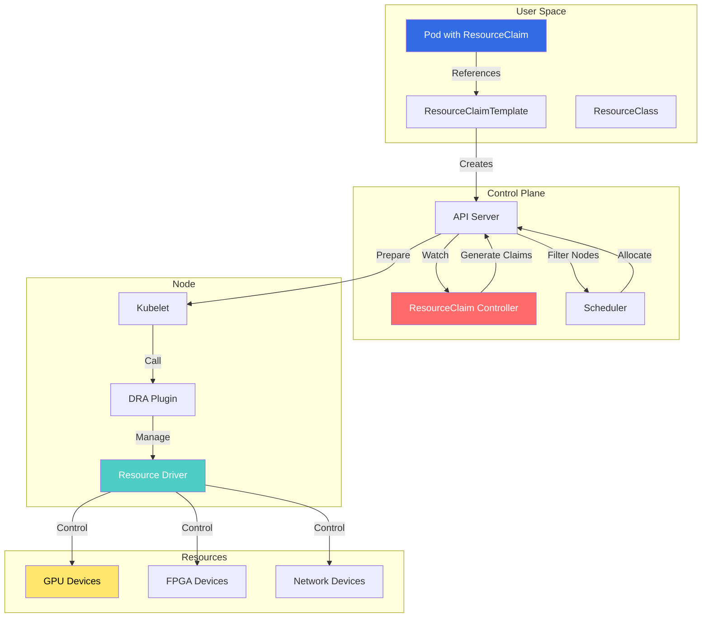
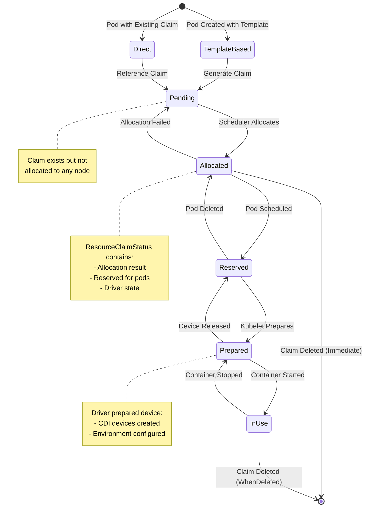
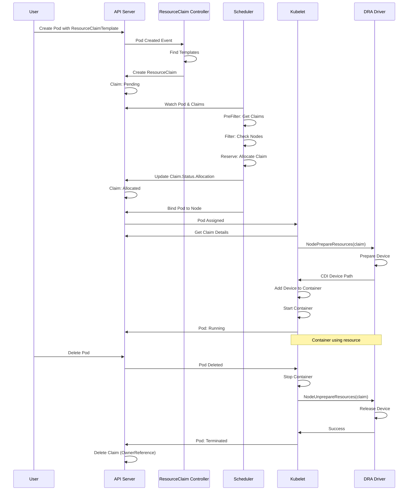
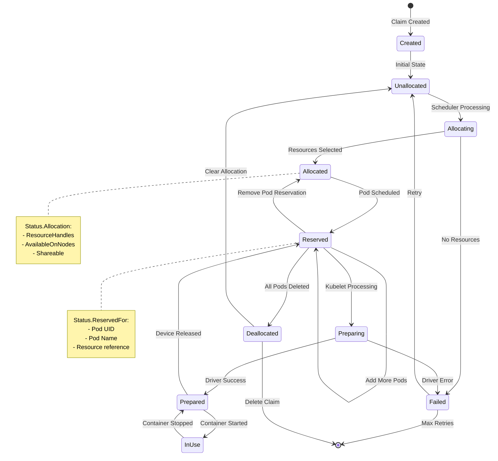

# Resource Claim Controllers (Dynamic Resource Allocation)

## Overview

The Resource Claim Controllers implement **Dynamic Resource Allocation (DRA)**, a framework for managing specialized hardware resources (GPUs, FPGAs, network devices) in Kubernetes. DRA replaces the static Device Plugin model with a flexible, claims-based approach similar to persistent volumes.

**Key Components:**
- **ResourceClaim**: Requests specific resources
- **ResourceClaimTemplate**: Template for generating claims
- **ResourceClass**: Defines resource types and parameters
- **Resource Driver**: Third-party driver managing actual devices

**Introduced in:** Kubernetes 1.26 (Alpha)
**KEP:** [KEP-3063: Dynamic Resource Allocation](https://github.com/kubernetes/enhancements/tree/master/keps/sig-node/3063-dynamic-resource-allocation)

## Architecture

### Component Overview



### ResourceClaim Lifecycle



## Controller Implementation

### ResourceClaim Template Controller

**File:** `pkg/controller/resourceclaim/controller.go`

```go
// Controller generates ResourceClaims from templates
type Controller struct {
    podLister       corelisters.PodLister
    podIndexer      cache.Indexer
    claimLister     resourcelisters.ResourceClaimLister
    claimClient     resourcev1alpha2.ResourceClaimInterface
    templateLister  resourcelisters.ResourceClaimTemplateLister

    queue workqueue.RateLimitingInterface
}

// Run starts the controller
func (c *Controller) Run(ctx context.Context, workers int) {
    defer c.queue.ShutDown()

    for i := 0; i < workers; i++ {
        go wait.UntilWithContext(
            ctx,
            c.worker,
            time.Second,
        )
    }

    <-ctx.Done()
}

// worker processes items from the queue
func (c *Controller) worker(ctx context.Context) {
    for c.processNextWorkItem(ctx) {
    }
}

// syncPod processes a pod and generates claims from templates
func (c *Controller) syncPod(
    ctx context.Context,
    pod *v1.Pod,
) error {
    if pod.DeletionTimestamp != nil {
        return nil
    }

    // Find all ResourceClaimTemplates referenced by pod
    templates := c.findClaimTemplates(pod)
    if len(templates) == 0 {
        return nil
    }

    for _, template := range templates {
        // Check if claim already exists
        claimName := c.getGeneratedClaimName(pod, template.Name)
        _, err := c.claimLister.ResourceClaims(pod.Namespace).
            Get(claimName)

        if err == nil {
            // Claim exists
            continue
        }

        if !apierrors.IsNotFound(err) {
            return err
        }

        // Generate claim from template
        claim := c.generateClaim(pod, template, claimName)

        // Create claim
        _, err = c.claimClient.Create(
            ctx,
            claim,
            metav1.CreateOptions{},
        )
        if err != nil {
            return fmt.Errorf(
                "failed to create claim %s: %v",
                claimName,
                err,
            )
        }

        klog.V(4).InfoS(
            "Generated ResourceClaim from template",
            "pod", klog.KObj(pod),
            "claim", claimName,
            "template", template.Name,
        )
    }

    return nil
}

// generateClaim creates a claim from template
func (c *Controller) generateClaim(
    pod *v1.Pod,
    template *resourcev1alpha2.ResourceClaimTemplate,
    claimName string,
) *resourcev1alpha2.ResourceClaim {
    claim := &resourcev1alpha2.ResourceClaim{
        ObjectMeta: metav1.ObjectMeta{
            Name:      claimName,
            Namespace: pod.Namespace,
            OwnerReferences: []metav1.OwnerReference{
                {
                    APIVersion:         "v1",
                    Kind:               "Pod",
                    Name:               pod.Name,
                    UID:                pod.UID,
                    Controller:         ptr.To(true),
                    BlockOwnerDeletion: ptr.To(true),
                },
            },
        },
        Spec: template.Spec,
    }

    return claim
}

// findClaimTemplates finds all templates referenced by pod
func (c *Controller) findClaimTemplates(
    pod *v1.Pod,
) []*resourcev1alpha2.ResourceClaimTemplate {
    var templates []*resourcev1alpha2.ResourceClaimTemplate

    for _, volume := range pod.Spec.Volumes {
        if volume.Ephemeral == nil ||
           volume.Ephemeral.VolumeClaimTemplate == nil {
            continue
        }

        claimTemplate := volume.Ephemeral.VolumeClaimTemplate
        if claimTemplate.Spec.ResourceClaimTemplateName == nil {
            continue
        }

        templateName := *claimTemplate.Spec.ResourceClaimTemplateName
        template, err := c.templateLister.
            ResourceClaimTemplates(pod.Namespace).
            Get(templateName)

        if err != nil {
            klog.ErrorS(
                err,
                "Failed to get ResourceClaimTemplate",
                "pod", klog.KObj(pod),
                "template", templateName,
            )
            continue
        }

        templates = append(templates, template)
    }

    return templates
}
```

**Location:** `pkg/controller/resourceclaim/controller.go:40-200`

### Scheduler Integration

**File:** `pkg/scheduler/framework/plugins/dynamicresources/dynamicresources.go`

```go
// DynamicResources is a plugin for DRA scheduling
type DynamicResources struct {
    fh              framework.Handle
    claimLister     resourcelisters.ResourceClaimLister
    classLister     resourcelisters.ResourceClassLister
    sliceLister     resourcelisters.ResourceSliceLister
}

// Name returns plugin name
func (d *DynamicResources) Name() string {
    return "DynamicResources"
}

// PreFilter checks if pod has resource claims
func (d *DynamicResources) PreFilter(
    ctx context.Context,
    state *framework.CycleState,
    pod *v1.Pod,
) (*framework.PreFilterResult, *framework.Status) {

    // Get all claims referenced by pod
    claims, err := d.getResourceClaims(pod)
    if err != nil {
        return nil, framework.AsStatus(err)
    }

    if len(claims) == 0 {
        // No claims, skip plugin
        return nil, framework.NewStatus(framework.Skip)
    }

    // Store claims in state
    state.Write(claimsKey, claims)

    // Calculate unallocated claims
    unallocated := 0
    for _, claim := range claims {
        if claim.Status.Allocation == nil {
            unallocated++
        }
    }

    if unallocated > 0 {
        // Need to allocate during scheduling
        return nil, framework.NewStatus(framework.Success)
    }

    // All claims allocated
    return nil, framework.NewStatus(framework.Success)
}

// Filter checks if node can satisfy resource claims
func (d *DynamicResources) Filter(
    ctx context.Context,
    state *framework.CycleState,
    pod *v1.Pod,
    nodeInfo *framework.NodeInfo,
) *framework.Status {

    // Get claims from state
    claims, err := getClaimsFromState(state)
    if err != nil {
        return framework.AsStatus(err)
    }

    // Check each claim
    for _, claim := range claims {
        if claim.Status.Allocation != nil {
            // Already allocated, check reservation
            if !d.isAvailableOnNode(claim, nodeInfo.Node()) {
                return framework.NewStatus(
                    framework.UnschedulableAndUnresolvable,
                    fmt.Sprintf(
                        "claim %s not available on node",
                        claim.Name,
                    ),
                )
            }
            continue
        }

        // Check if node has available resources
        if !d.canAllocateOnNode(claim, nodeInfo) {
            return framework.NewStatus(
                framework.Unschedulable,
                fmt.Sprintf(
                    "node cannot satisfy claim %s",
                    claim.Name,
                ),
            )
        }
    }

    return framework.NewStatus(framework.Success)
}

// Reserve allocates resource claims
func (d *DynamicResources) Reserve(
    ctx context.Context,
    state *framework.CycleState,
    pod *v1.Pod,
    nodeName string,
) *framework.Status {

    claims, err := getClaimsFromState(state)
    if err != nil {
        return framework.AsStatus(err)
    }

    for _, claim := range claims {
        if claim.Status.Allocation != nil {
            // Already allocated, add reservation
            if err := d.addReservation(
                ctx, claim, pod, nodeName,
            ); err != nil {
                return framework.AsStatus(err)
            }
            continue
        }

        // Allocate claim
        if err := d.allocateClaim(
            ctx, claim, pod, nodeName,
        ); err != nil {
            return framework.AsStatus(err)
        }
    }

    return framework.NewStatus(framework.Success)
}

// allocateClaim performs allocation for a claim
func (d *DynamicResources) allocateClaim(
    ctx context.Context,
    claim *resourcev1alpha2.ResourceClaim,
    pod *v1.Pod,
    nodeName string,
) error {

    // Get ResourceClass
    class, err := d.classLister.Get(claim.Spec.ResourceClassName)
    if err != nil {
        return fmt.Errorf("get resource class: %v", err)
    }

    // Get available resource slices on node
    slices, err := d.getResourceSlicesForNode(nodeName, class)
    if err != nil {
        return fmt.Errorf("get resource slices: %v", err)
    }

    // Select devices from slices
    devices, err := d.selectDevices(claim, slices)
    if err != nil {
        return fmt.Errorf("select devices: %v", err)
    }

    // Update claim status with allocation
    claim = claim.DeepCopy()
    claim.Status.Allocation = &resourcev1alpha2.AllocationResult{
        ResourceHandles: devices,
        AvailableOnNodes: &v1.NodeSelector{
            NodeSelectorTerms: []v1.NodeSelectorTerm{
                {
                    MatchFields: []v1.NodeSelectorRequirement{
                        {
                            Key:      "metadata.name",
                            Operator: v1.NodeSelectorOpIn,
                            Values:   []string{nodeName},
                        },
                    },
                },
            },
        },
    }

    // Add reservation for pod
    claim.Status.ReservedFor = append(
        claim.Status.ReservedFor,
        resourcev1alpha2.ResourceClaimConsumerReference{
            Resource: "pods",
            Name:     pod.Name,
            UID:      pod.UID,
        },
    )

    // Update claim
    _, err = d.fh.ClientSet().
        ResourceV1alpha2().
        ResourceClaims(claim.Namespace).
        UpdateStatus(ctx, claim, metav1.UpdateOptions{})

    return err
}
```

**Location:** `pkg/scheduler/framework/plugins/dynamicresources/dynamicresources.go:50-300`

## State Transitions

### Allocation Flow



### Claim Reservation



## Configuration Examples

### ResourceClass Definition

```yaml
# GPU ResourceClass
apiVersion: resource.k8s.io/v1alpha2
kind: ResourceClass
metadata:
  name: gpu.nvidia.com
driverName: gpu.nvidia.com
parametersRef:
  apiGroup: gpu.resource.nvidia.com/v1alpha1
  kind: GpuClaimParameters
  name: default-gpu-config
suitableNodes:
  nodeSelectorTerms:
  - matchExpressions:
    - key: feature.node.kubernetes.io/pci-nvidia.present
      operator: In
      values: ["true"]
---
# FPGA ResourceClass
apiVersion: resource.k8s.io/v1alpha2
kind: ResourceClass
metadata:
  name: fpga.intel.com
driverName: fpga.intel.com
parametersRef:
  apiGroup: fpga.resource.intel.com/v1alpha1
  kind: FpgaClaimParameters
  name: default-fpga-config
```

### ResourceClaimTemplate

```yaml
# Template for GPU claims
apiVersion: resource.k8s.io/v1alpha2
kind: ResourceClaimTemplate
metadata:
  name: gpu-template
  namespace: default
spec:
  spec:
    resourceClassName: gpu.nvidia.com
    parametersRef:
      apiGroup: gpu.resource.nvidia.com/v1alpha1
      kind: GpuClaimParameters
      name: high-memory-gpu
    allocationMode: WaitForFirstConsumer
---
# GPU parameters
apiVersion: gpu.resource.nvidia.com/v1alpha1
kind: GpuClaimParameters
metadata:
  name: high-memory-gpu
  namespace: default
spec:
  count: 1
  memory: "16Gi"
  architecture: "ampere"
```

### Pod with ResourceClaim Template

```yaml
apiVersion: v1
kind: Pod
metadata:
  name: gpu-workload
spec:
  containers:
  - name: ml-training
    image: ml-training:1.0
    resources:
      requests:
        memory: "4Gi"
        cpu: "2"
      limits:
        memory: "8Gi"
        cpu: "4"

    # Reference to resource claim
    volumeMounts:
    - name: gpu-claim
      mountPath: /dev/gpu

  volumes:
  - name: gpu-claim
    ephemeral:
      volumeClaimTemplate:
        spec:
          # Reference to ResourceClaimTemplate
          resourceClaimTemplateName: gpu-template
```

### Pod with Existing ResourceClaim

```yaml
# Pre-created claim
apiVersion: resource.k8s.io/v1alpha2
kind: ResourceClaim
metadata:
  name: shared-gpu
  namespace: default
spec:
  resourceClassName: gpu.nvidia.com
  allocationMode: Immediate
---
# Pod using existing claim
apiVersion: v1
kind: Pod
metadata:
  name: inference-service
spec:
  containers:
  - name: inference
    image: inference:1.0
    volumeMounts:
    - name: gpu
      mountPath: /dev/gpu

  volumes:
  - name: gpu
    resourceClaim:
      claimName: shared-gpu  # Reference existing claim
```

### Shareable ResourceClaim

```yaml
# Shareable GPU for multiple pods
apiVersion: resource.k8s.io/v1alpha2
kind: ResourceClaim
metadata:
  name: shared-inference-gpu
spec:
  resourceClassName: gpu.nvidia.com
  allocationMode: WaitForFirstConsumer

  # Parameters for sharing
  parametersRef:
    apiGroup: gpu.resource.nvidia.com/v1alpha1
    kind: GpuClaimParameters
    name: mig-enabled-gpu

# Status after allocation
status:
  allocation:
    resourceHandles:
    - driverName: gpu.nvidia.com
      data: |
        {
          "uuid": "GPU-12345",
          "mig": true,
          "instances": 7
        }
    shareable: true  # Can be used by multiple pods

  reservedFor:
  - resource: pods
    name: inference-1
    uid: abc-123
  - resource: pods
    name: inference-2
    uid: def-456
```

## Driver Integration

### DRA Plugin Interface

```go
// NodeClient is the kubelet plugin interface
type NodeClient interface {
    // NodePrepareResources prepares resources for pod
    NodePrepareResources(
        ctx context.Context,
        req *drapbv1.NodePrepareResourcesRequest,
    ) (*drapbv1.NodePrepareResourcesResponse, error)

    // NodeUnprepareResources releases resources
    NodeUnprepareResources(
        ctx context.Context,
        req *drapbv1.NodeUnprepareResourcesRequest,
    ) (*drapbv1.NodeUnprepareResourcesResponse, error)
}

// Example GPU driver implementation
type GPUDriver struct {
    devices map[string]*GPUDevice
}

func (d *GPUDriver) NodePrepareResources(
    ctx context.Context,
    req *drapbv1.NodePrepareResourcesRequest,
) (*drapbv1.NodePrepareResourcesResponse, error) {

    results := make(
        []*drapbv1.NodePrepareResourceResponse,
        len(req.Claims),
    )

    for i, claim := range req.Claims {
        // Parse allocation
        var alloc GPUAllocation
        if err := json.Unmarshal(
            []byte(claim.ResourceHandle),
            &alloc,
        ); err != nil {
            results[i] = &drapbv1.NodePrepareResourceResponse{
                Error: err.Error(),
            }
            continue
        }

        // Prepare GPU device
        device := d.devices[alloc.UUID]
        cdiDevices, err := device.Prepare(alloc)
        if err != nil {
            results[i] = &drapbv1.NodePrepareResourceResponse{
                Error: err.Error(),
            }
            continue
        }

        // Return CDI device specs
        results[i] = &drapbv1.NodePrepareResourceResponse{
            CdiDevices: cdiDevices,
        }
    }

    return &drapbv1.NodePrepareResourcesResponse{
        Claims: results,
    }, nil
}
```

## Monitoring and Metrics

### Key Metrics

```yaml
# ResourceClaim metrics
resource_claim_controller_claims_total{operation="create"}
resource_claim_controller_claims_total{operation="delete"}
resource_claim_controller_sync_duration_seconds

# Scheduler metrics
scheduler_plugin_execution_duration_seconds{plugin="DynamicResources",operation="PreFilter"}
scheduler_plugin_execution_duration_seconds{plugin="DynamicResources",operation="Filter"}
scheduler_plugin_execution_duration_seconds{plugin="DynamicResources",operation="Reserve"}

# Driver metrics (custom)
dra_driver_prepare_duration_seconds
dra_driver_unprepare_duration_seconds
dra_driver_devices_allocated
dra_driver_devices_available
```

## Troubleshooting Guide

### Common Issues

#### Issue 1: Claim Not Allocated

**Symptoms:**
- ResourceClaim remains in pending state
- Pod stuck in pending
- No allocation in claim status

**Diagnosis:**
```bash
# Check claim status
kubectl get resourceclaim gpu-claim -o yaml

# Check ResourceClass
kubectl get resourceclass gpu.nvidia.com -o yaml

# Check scheduler logs
kubectl logs -n kube-system kube-scheduler-xxx | grep DynamicResources

# Check events
kubectl describe resourceclaim gpu-claim
```

**Common Causes:**
1. No nodes with suitable resources
2. ResourceClass misconfigured
3. Driver not running

**Resolution:**
```bash
# Check resource availability
kubectl get resourceslice -l driverName=gpu.nvidia.com

# Verify driver pods
kubectl get pods -n kube-system -l app=gpu-driver

# Check node labels
kubectl get nodes --show-labels | grep nvidia
```

#### Issue 2: Driver Preparation Failed

**Symptoms:**
- Pod stuck in ContainerCreating
- Kubelet errors about resource preparation
- Device not available in container

**Diagnosis:**
```bash
# Check kubelet logs
journalctl -u kubelet | grep -i "dynamic resource"

# Check driver logs
kubectl logs -n kube-system gpu-driver-xxx

# Check claim preparation status
kubectl get resourceclaim -o jsonpath='{.status.allocation}'
```

**Resolution:**
```bash
# Restart driver
kubectl delete pod -n kube-system gpu-driver-xxx

# Verify CDI configuration
cat /etc/cdi/nvidia.yaml

# Check device availability
nvidia-smi
```

### Debug Commands

```bash
# List all resource claims
kubectl get resourceclaims -A

# Show claim allocation details
kubectl get resourceclaim gpu-claim -o jsonpath='{.status.allocation}'

# List resource slices
kubectl get resourceslices

# Check driver registration
kubectl get csidriver gpu.nvidia.com

# Monitor claim controller
kubectl logs -n kube-system -l component=resource-claim-controller
```

## Best Practices

1. **Use WaitForFirstConsumer for Locality**
   ```yaml
   spec:
     allocationMode: WaitForFirstConsumer
   ```

2. **Set Appropriate Dealocation Policies**
   ```yaml
   spec:
     deallocationPolicy: WhenUnused  # or RetainUntilDeleted
   ```

3. **Define Resource Quotas**
   ```yaml
   apiVersion: v1
   kind: ResourceQuota
   metadata:
     name: gpu-quota
   spec:
     hard:
       requests.gpu.nvidia.com: "4"
   ```

4. **Monitor Resource Usage**
   - Track claim allocation rate
   - Monitor driver latency
   - Alert on allocation failures

## Related Components

- **Scheduler** (`pkg/scheduler/`): Allocates claims during scheduling
- **Kubelet** (`pkg/kubelet/cm/dra/`): Prepares resources for pods
- **Device Manager** (`pkg/kubelet/cm/devicemanager/`): Legacy device management

## References

- **KEP-3063**: [Dynamic Resource Allocation](https://github.com/kubernetes/enhancements/tree/master/keps/sig-node/3063-dynamic-resource-allocation)
- **KEP-3063-structured-parameters**: [Structured Parameters](https://github.com/kubernetes/enhancements/tree/master/keps/sig-node/4381-dra-structured-parameters)
- **CDI Specification**: [Container Device Interface](https://github.com/cncf-tags/container-device-interface)
- **Source Code**: `pkg/controller/resourceclaim/`
- **API Reference**: [ResourceClaim v1alpha2](https://kubernetes.io/docs/reference/kubernetes-api/workload-resources/resource-claim-v1alpha2/)
