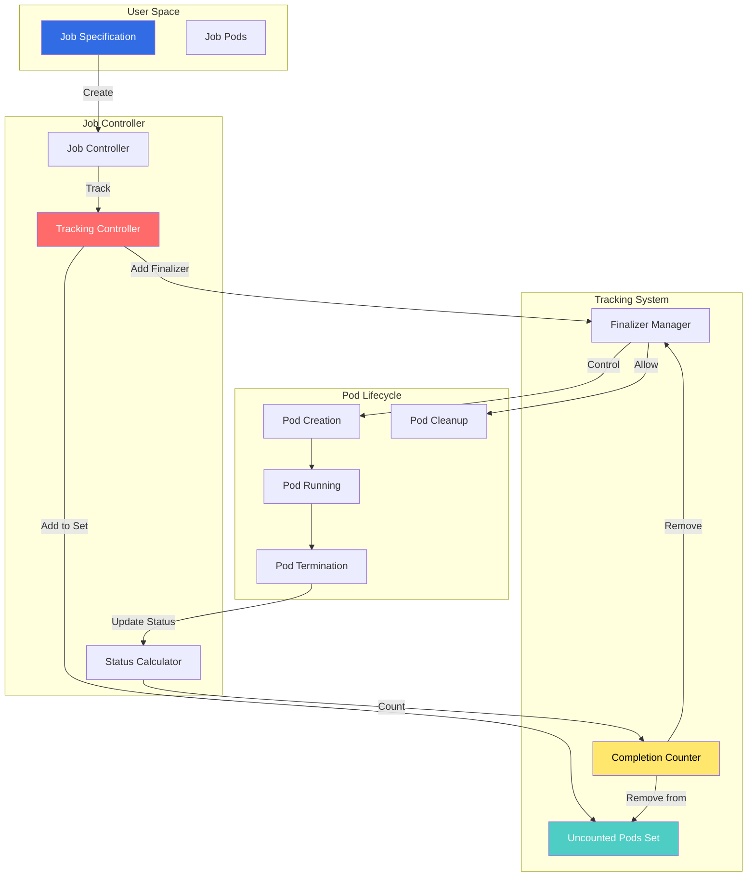
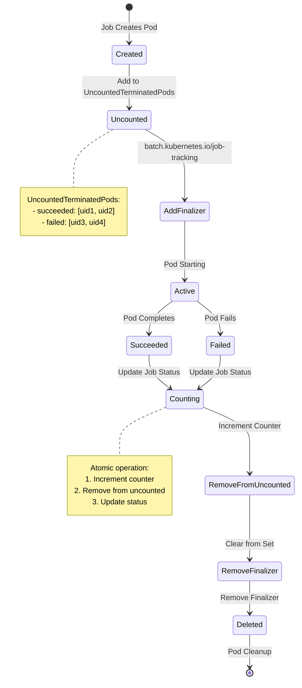
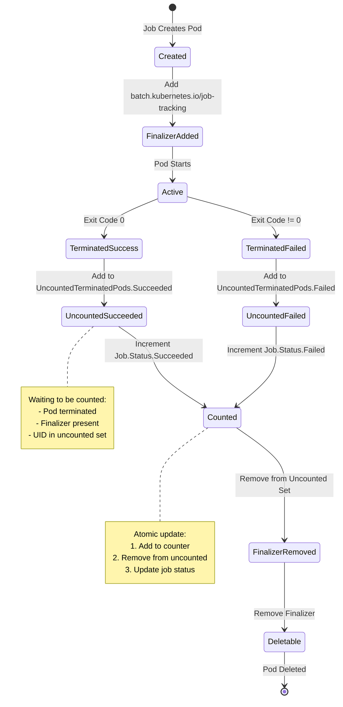
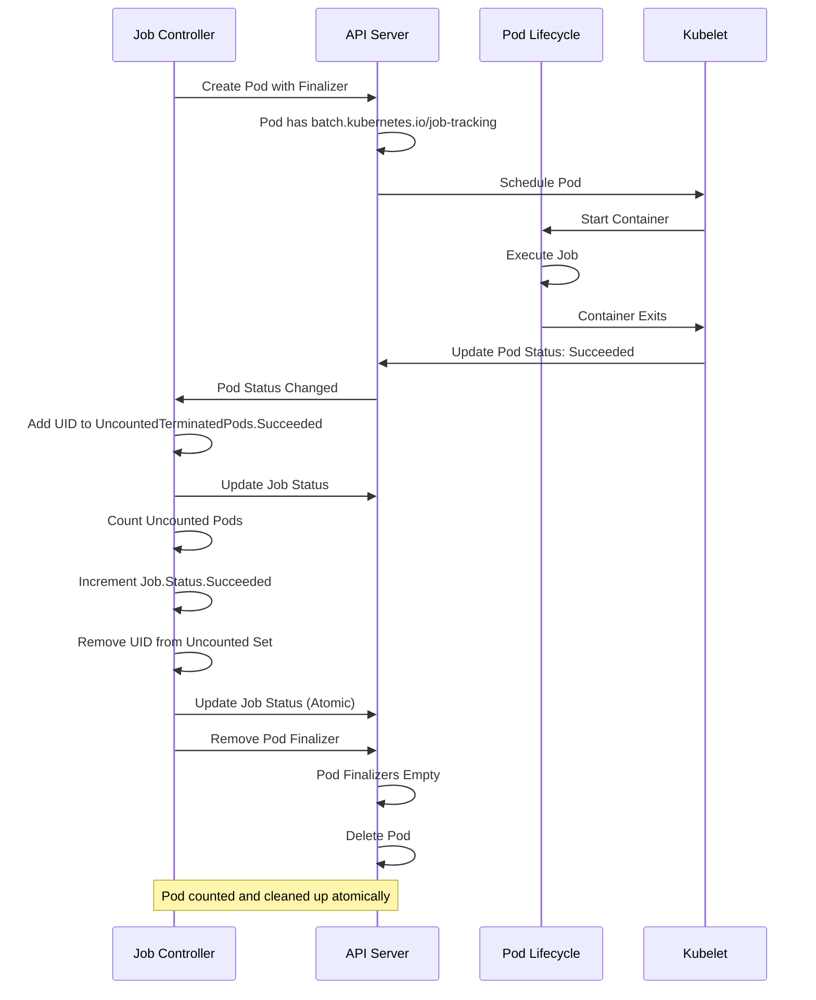

# Job Tracking Controllers

## Overview

The Job Tracking Controllers implement a **finalizer-based mechanism** for accurately tracking Job completion in Kubernetes. This system replaced the legacy pod deletion tracking approach, providing more reliable and efficient job completion counting.

**Key Features:**
- **Finalizer-based tracking**: Uses pod finalizers instead of deletion events
- **Uncounted pods**: Tracks pods not yet counted toward job status
- **Atomic updates**: Prevents race conditions in completion counting
- **Reliable cleanup**: Ensures all pods are accounted for

**Introduced in:** Kubernetes 1.23 (Beta), 1.26 (GA)
**KEP:** [KEP-2307: Job Tracking Without Lingering Pods](https://github.com/kubernetes/enhancements/tree/master/keps/sig-apps/2307-job-tracking-without-lingering-pods)

## Architecture

### Component Overview



### Pod Tracking Flow



## Controller Implementation

### Job Tracking Controller

**File:** `pkg/controller/job/job_controller.go`

```go
// Controller manages Job lifecycle with tracking
type Controller struct {
    kubeClient clientset.Interface
    podControl controller.PodControlInterface

    jobLister batchlisters.JobLister
    jobSynced cache.InformerSynced

    podStore     corelisters.PodLister
    podStoreSynced cache.InformerSynced

    // Queue for job processing
    queue workqueue.RateLimitingInterface

    // Expectations for pod creation/deletion
    expectations controller.ControllerExpectationsInterface
}

// syncJob processes a single job
func (jm *Controller) syncJob(
    ctx context.Context,
    key string,
) (rErr error) {
    namespace, name, err := cache.SplitMetaNamespaceKey(key)
    if err != nil {
        return err
    }

    // Get job
    job, err := jm.jobLister.Jobs(namespace).Get(name)
    if err != nil {
        if apierrors.IsNotFound(err) {
            return nil
        }
        return err
    }

    // Don't process finished jobs
    if isJobFinished(job) {
        return nil
    }

    // Get pods for this job
    pods, err := jm.getPodsForJob(ctx, job)
    if err != nil {
        return err
    }

    // Track pods with finalizers
    if err := jm.trackJobPods(ctx, job, pods); err != nil {
        return err
    }

    // Calculate job status
    status := jm.calculateStatus(job, pods)

    // Update job status if changed
    if !apiequality.Semantic.DeepEqual(
        job.Status,
        status,
    ) {
        job = job.DeepCopy()
        job.Status = status
        if err := jm.updateJobStatus(ctx, job); err != nil {
            return err
        }
    }

    // Manage pods (create/delete)
    if err := jm.manageJob(ctx, job, pods); err != nil {
        return err
    }

    return nil
}

// trackJobPods ensures all pods have tracking finalizer
func (jm *Controller) trackJobPods(
    ctx context.Context,
    job *batchv1.Job,
    pods []*v1.Pod,
) error {
    for _, pod := range pods {
        if !hasJobTrackingFinalizer(pod) {
            // Add finalizer
            if err := jm.addPodFinalizer(ctx, pod); err != nil {
                return err
            }
        }
    }
    return nil
}

// calculateStatus computes job status from pods
func (jm *Controller) calculateStatus(
    job *batchv1.Job,
    pods []*v1.Pod,
) batchv1.JobStatus {
    status := job.Status.DeepCopy()

    // Initialize uncounted pods if needed
    if status.UncountedTerminatedPods == nil {
        status.UncountedTerminatedPods = &batchv1.UncountedTerminatedPods{}
    }

    uncounted := status.UncountedTerminatedPods
    succeeded := int32(0)
    failed := int32(0)
    active := int32(0)

    // Process each pod
    for _, pod := range pods {
        uid := string(pod.UID)

        switch pod.Status.Phase {
        case v1.PodSucceeded:
            // Check if already counted
            if !hasUID(uncounted.Succeeded, uid) &&
               !hasJobTrackingFinalizer(pod) {
                succeeded++
            } else {
                // Add to uncounted if not there
                if !hasUID(uncounted.Succeeded, uid) {
                    uncounted.Succeeded = append(
                        uncounted.Succeeded,
                        types.UID(uid),
                    )
                }
            }

        case v1.PodFailed:
            if !hasUID(uncounted.Failed, uid) &&
               !hasJobTrackingFinalizer(pod) {
                failed++
            } else {
                if !hasUID(uncounted.Failed, uid) {
                    uncounted.Failed = append(
                        uncounted.Failed,
                        types.UID(uid),
                    )
                }
            }

        case v1.PodPending, v1.PodRunning:
            active++
        }
    }

    // Count uncounted pods
    newSucceeded, newFailed := jm.countUncountedPods(
        uncounted,
        pods,
    )

    status.Active = active
    status.Succeeded = status.Succeeded + succeeded + newSucceeded
    status.Failed = status.Failed + failed + newFailed

    // Check completion
    if jobComplete, completionTime := jm.isJobComplete(
        job,
        status,
    ); jobComplete {
        status.CompletionTime = completionTime
        status.Conditions = append(
            status.Conditions,
            newCondition(
                batchv1.JobComplete,
                v1.ConditionTrue,
                "",
                "Job completed successfully",
            ),
        )
    }

    if jobFailed, failureTime := jm.isJobFailed(
        job,
        status,
    ); jobFailed {
        status.CompletionTime = failureTime
        status.Conditions = append(
            status.Conditions,
            newCondition(
                batchv1.JobFailed,
                v1.ConditionTrue,
                "",
                "Job has failed pods",
            ),
        )
    }

    return *status
}

// countUncountedPods counts and removes pods from uncounted set
func (jm *Controller) countUncountedPods(
    uncounted *batchv1.UncountedTerminatedPods,
    pods []*v1.Pod,
) (succeeded, failed int32) {
    // Build map of existing pods
    podsByUID := make(map[types.UID]*v1.Pod)
    for _, pod := range pods {
        podsByUID[pod.UID] = pod
    }

    // Count succeeded pods
    var remainingSucceeded []types.UID
    for _, uid := range uncounted.Succeeded {
        pod := podsByUID[uid]
        if pod == nil {
            // Pod deleted, count it
            succeeded++
        } else if !hasJobTrackingFinalizer(pod) {
            // Finalizer removed, count it
            succeeded++
        } else {
            // Keep in uncounted
            remainingSucceeded = append(remainingSucceeded, uid)
        }
    }
    uncounted.Succeeded = remainingSucceeded

    // Count failed pods
    var remainingFailed []types.UID
    for _, uid := range uncounted.Failed {
        pod := podsByUID[uid]
        if pod == nil {
            failed++
        } else if !hasJobTrackingFinalizer(pod) {
            failed++
        } else {
            remainingFailed = append(remainingFailed, uid)
        }
    }
    uncounted.Failed = remainingFailed

    return succeeded, failed
}

// addPodFinalizer adds job tracking finalizer to pod
func (jm *Controller) addPodFinalizer(
    ctx context.Context,
    pod *v1.Pod,
) error {
    pod = pod.DeepCopy()

    // Add finalizer
    pod.Finalizers = append(
        pod.Finalizers,
        batchv1.JobTrackingFinalizer,
    )

    // Update pod
    _, err := jm.kubeClient.CoreV1().
        Pods(pod.Namespace).
        Update(ctx, pod, metav1.UpdateOptions{})

    return err
}

// removePodFinalizer removes job tracking finalizer
func (jm *Controller) removePodFinalizer(
    ctx context.Context,
    pod *v1.Pod,
) error {
    pod = pod.DeepCopy()

    // Remove finalizer
    var finalizers []string
    for _, f := range pod.Finalizers {
        if f != batchv1.JobTrackingFinalizer {
            finalizers = append(finalizers, f)
        }
    }
    pod.Finalizers = finalizers

    // Update pod
    _, err := jm.kubeClient.CoreV1().
        Pods(pod.Namespace).
        Update(ctx, pod, metav1.UpdateOptions{})

    return err
}

// hasJobTrackingFinalizer checks if pod has finalizer
func hasJobTrackingFinalizer(pod *v1.Pod) bool {
    for _, f := range pod.Finalizers {
        if f == batchv1.JobTrackingFinalizer {
            return true
        }
    }
    return false
}
```

**Location:** `pkg/controller/job/job_controller.go:200-500`

### Finalizer Management

**File:** `pkg/controller/job/tracking_utils.go`

```go
// ensurePodFinalizerRemoved removes finalizer after counting
func (jm *Controller) ensurePodFinalizerRemoved(
    ctx context.Context,
    pod *v1.Pod,
) error {
    if !hasJobTrackingFinalizer(pod) {
        return nil
    }

    patch := []byte(fmt.Sprintf(
        `{"metadata":{"finalizers":%s}}`,
        removeFinalizerPatch(
            pod.Finalizers,
            batchv1.JobTrackingFinalizer,
        ),
    ))

    _, err := jm.kubeClient.CoreV1().
        Pods(pod.Namespace).
        Patch(
            ctx,
            pod.Name,
            types.StrategicMergePatchType,
            patch,
            metav1.PatchOptions{},
        )

    return err
}

// removeJobFinalizersFromPods removes finalizers from all pods
func (jm *Controller) removeJobFinalizersFromPods(
    ctx context.Context,
    job *batchv1.Job,
) error {
    pods, err := jm.getPodsForJob(ctx, job)
    if err != nil {
        return err
    }

    errs := []error{}
    for _, pod := range pods {
        if err := jm.ensurePodFinalizerRemoved(
            ctx,
            pod,
        ); err != nil {
            errs = append(errs, err)
        }
    }

    return utilerrors.NewAggregate(errs)
}

// enqueuePodsForJobSync enqueues job when pods change
func (jm *Controller) enqueuePodsForJobSync(
    obj interface{},
) {
    pod := obj.(*v1.Pod)

    // Get job for pod
    controllerRef := metav1.GetControllerOf(pod)
    if controllerRef == nil {
        return
    }

    if controllerRef.Kind != "Job" {
        return
    }

    job, err := jm.jobLister.Jobs(pod.Namespace).
        Get(controllerRef.Name)
    if err != nil {
        return
    }

    // Enqueue job
    jm.enqueueJob(job)
}
```

**Location:** `pkg/controller/job/tracking_utils.go:30-150`

## State Transitions

### Pod Counting State Machine



### Job Completion Flow



## Configuration Examples

### Job with Tracking

```yaml
# Standard job with automatic tracking
apiVersion: batch/v1
kind: Job
metadata:
  name: data-processor
spec:
  completions: 10
  parallelism: 3

  template:
    spec:
      restartPolicy: Never
      containers:
      - name: processor
        image: data-processor:1.0
        command: ["./process.sh"]

# Job status with uncounted pods
status:
  active: 3
  succeeded: 5
  failed: 1

  # Pods waiting to be counted
  uncountedTerminatedPods:
    succeeded:
    - "pod-abc-123"
    - "pod-def-456"
    failed:
    - "pod-ghi-789"

  # Completion tracking
  startTime: "2025-10-21T10:00:00Z"
  completionTime: null
  conditions:
  - type: Complete
    status: "False"
```

### Pod with Tracking Finalizer

```yaml
# Pod created by job controller
apiVersion: v1
kind: Pod
metadata:
  name: data-processor-abc123
  namespace: default
  ownerReferences:
  - apiVersion: batch/v1
    kind: Job
    name: data-processor
    uid: job-uid-123
    controller: true

  # Tracking finalizer prevents premature deletion
  finalizers:
  - batch.kubernetes.io/job-tracking

spec:
  restartPolicy: Never
  containers:
  - name: processor
    image: data-processor:1.0

# Pod status after completion
status:
  phase: Succeeded
  containerStatuses:
  - name: processor
    state:
      terminated:
        exitCode: 0
        finishedAt: "2025-10-21T10:05:00Z"
```

### Job with Completion Mode

```yaml
# Indexed job with tracking
apiVersion: batch/v1
kind: Job
metadata:
  name: indexed-processor
spec:
  completions: 100
  parallelism: 10
  completionMode: Indexed  # Track by index

  template:
    spec:
      restartPolicy: Never
      containers:
      - name: worker
        image: worker:1.0
        env:
        - name: JOB_COMPLETION_INDEX
          valueFrom:
            fieldRef:
              fieldPath: metadata.annotations['batch.kubernetes.io/job-completion-index']

# Status with index tracking
status:
  succeeded: 50
  failed: 2
  active: 10

  # Track completed indexes
  completedIndexes: "0-49,51"  # Index 50 failed

  uncountedTerminatedPods:
    succeeded:
    - "worker-52"
    - "worker-53"
```

## Monitoring and Metrics

### Key Metrics

```yaml
# Job tracking metrics
job_sync_duration_seconds{result="success"}
job_sync_duration_seconds{result="error"}

# Pod finalizer metrics
job_pods_with_finalizers
job_pods_finalizers_removed_total

# Uncounted pods metrics
job_uncounted_terminated_pods{status="succeeded"}
job_uncounted_terminated_pods{status="failed"}

# Job completion metrics
job_completions_total
job_completion_duration_seconds
```

### Prometheus Queries

```promql
# Jobs with uncounted pods
sum(job_uncounted_terminated_pods) by (namespace, job_name)

# Finalizer removal rate
rate(job_pods_finalizers_removed_total[5m])

# Jobs stuck with uncounted pods
job_uncounted_terminated_pods > 0

# Average job completion time
histogram_quantile(0.95,
  rate(job_completion_duration_seconds_bucket[1h])
)
```

## Troubleshooting Guide

### Common Issues

#### Issue 1: Pods Not Being Counted

**Symptoms:**
- Job stuck in running state
- Pods in succeeded/failed state
- UncountedTerminatedPods growing

**Diagnosis:**
```bash
# Check job status
kubectl get job data-processor -o yaml

# Look for uncounted pods
kubectl get job data-processor -o jsonpath='{.status.uncountedTerminatedPods}'

# Check pod finalizers
kubectl get pods -l job-name=data-processor \
  -o jsonpath='{.items[*].metadata.finalizers}'

# Check controller logs
kubectl logs -n kube-system kube-controller-manager-xxx \
  | grep -i "job-controller"
```

**Common Causes:**
1. Job controller not running
2. API server issues
3. Race condition in status update

**Resolution:**
```bash
# Restart job controller
kubectl delete pod -n kube-system kube-controller-manager-xxx

# Manually trigger reconciliation
kubectl annotate job data-processor \
  force-sync="$(date +%s)"
```

#### Issue 2: Pods Not Being Deleted

**Symptoms:**
- Terminated pods remain
- Finalizers not removed
- Resource exhaustion

**Diagnosis:**
```bash
# Check terminated pods
kubectl get pods --field-selector status.phase=Succeeded

# Check finalizers
kubectl get pod data-processor-abc123 \
  -o jsonpath='{.metadata.finalizers}'

# Check if counted
kubectl get job data-processor \
  -o jsonpath='{.status.uncountedTerminatedPods}' | \
  grep "pod-abc-123"
```

**Common Causes:**
1. Finalizer not removed after counting
2. Job controller crash
3. API server update failure

**Resolution:**
```bash
# Manually remove finalizer
kubectl patch pod data-processor-abc123 -p '
{
  "metadata": {
    "finalizers": []
  }
}'

# Or delete pod forcefully
kubectl delete pod data-processor-abc123 --force --grace-period=0
```

#### Issue 3: Race Conditions in Counting

**Symptoms:**
- Incorrect succeeded/failed counts
- Job completion status incorrect
- Duplicate counting

**Diagnosis:**
```bash
# Compare actual vs reported
ACTUAL=$(kubectl get pods -l job-name=data-processor \
  --field-selector status.phase=Succeeded --no-headers | wc -l)

REPORTED=$(kubectl get job data-processor \
  -o jsonpath='{.status.succeeded}')

echo "Actual: $ACTUAL, Reported: $REPORTED"

# Check for conflicts
kubectl get events --field-selector involvedObject.name=data-processor \
  | grep -i conflict
```

**Resolution:**
```bash
# Delete and recreate job
kubectl delete job data-processor --cascade=orphan
kubectl apply -f job.yaml

# Or wait for reconciliation
kubectl wait --for=condition=Complete job/data-processor \
  --timeout=300s
```

### Debug Commands

```bash
# Show job with uncounted pods
kubectl get jobs -o json | jq '.items[] |
  select(.status.uncountedTerminatedPods != null) |
  {name: .metadata.name, uncounted: .status.uncountedTerminatedPods}'

# List pods with job tracking finalizers
kubectl get pods -A -o json | jq '.items[] |
  select(.metadata.finalizers | contains(["batch.kubernetes.io/job-tracking"])) |
  {name: .metadata.name, namespace: .metadata.namespace, phase: .status.phase}'

# Count pods by status
kubectl get pods -l job-name=data-processor \
  --no-headers | awk '{print $3}' | sort | uniq -c

# Monitor job completion
watch kubectl get job data-processor -o wide
```

## Best Practices

### Job Design

1. **Use Appropriate Completion Modes**
   ```yaml
   spec:
     completionMode: NonIndexed  # or Indexed
   ```

2. **Set Reasonable Timeouts**
   ```yaml
   spec:
     activeDeadlineSeconds: 3600
     backoffLimit: 3
   ```

3. **Handle Pod Failures Gracefully**
   ```yaml
   spec:
     backoffLimit: 6
     podFailurePolicy:
       rules:
       - action: FailJob
         onExitCodes:
           operator: In
           values: [1, 42]
   ```

### Finalizer Management

1. **Don't Remove Finalizers Manually**
   - Let controller manage finalizers
   - Only remove in emergency situations

2. **Monitor Uncounted Pods**
   - Alert on high uncounted pod counts
   - Investigate stuck jobs

3. **Clean Up Completed Jobs**
   ```yaml
   spec:
     ttlSecondsAfterFinished: 3600
   ```

## Performance Considerations

### Scaling

- **Large Jobs**: Tracking overhead is O(n) for n pods
- **High Churn**: Frequent pod creation/deletion increases load
- **API Server Load**: Status updates can be expensive

### Optimization

```yaml
# Use indexed mode for large jobs
spec:
  completions: 10000
  parallelism: 100
  completionMode: Indexed

# Limit backoff retries
spec:
  backoffLimit: 3
  backoffLimitPerIndex: 1  # For indexed jobs
```

## Related Components

- **Job Controller** (`pkg/controller/job/`): Main job management
- **Indexed Job Controller** (`pkg/controller/job/indexed_job_utils.go`): Index tracking
- **TTL Controller** (`pkg/controller/ttlafterfinished/`): Job cleanup
- **CronJob Controller** (`pkg/controller/cronjob/`): Scheduled jobs

## References

- **KEP-2307**: [Job Tracking Without Lingering Pods](https://github.com/kubernetes/enhancements/tree/master/keps/sig-apps/2307-job-tracking-without-lingering-pods)
- **KEP-3850**: [Backoff Limit Per Index](https://github.com/kubernetes/enhancements/tree/master/keps/sig-apps/3850-backoff-limits-per-index-for-indexed-jobs)
- **Design Doc**: [Finalizer-based Job Tracking](https://github.com/kubernetes/enhancements/tree/master/keps/sig-apps/2307-job-tracking-without-lingering-pods#design-details)
- **Source Code**: `pkg/controller/job/job_controller.go`
- **API Reference**: [Job v1](https://kubernetes.io/docs/reference/kubernetes-api/workload-resources/job-v1/)
