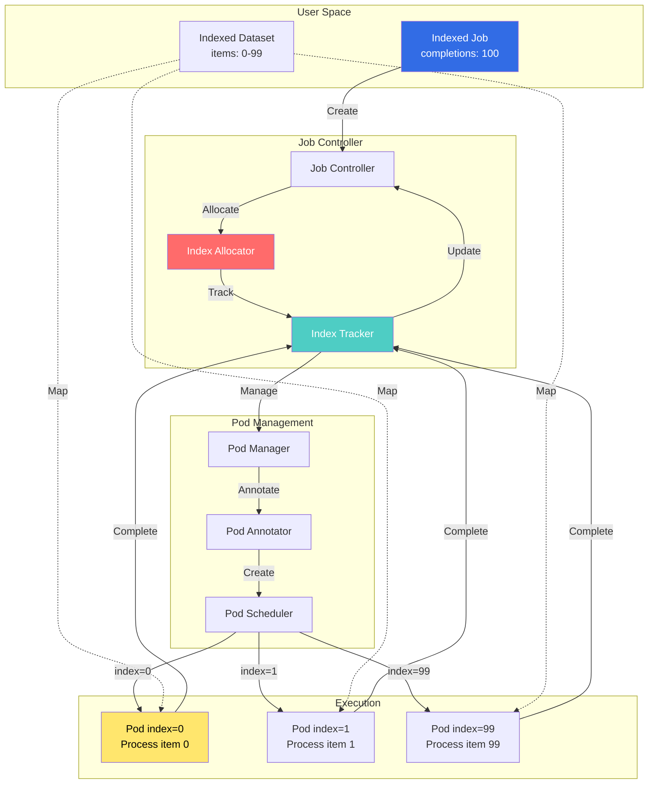
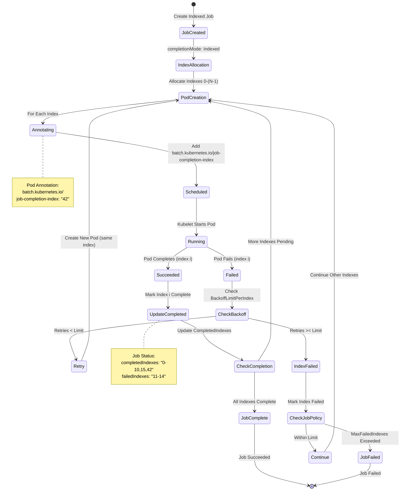
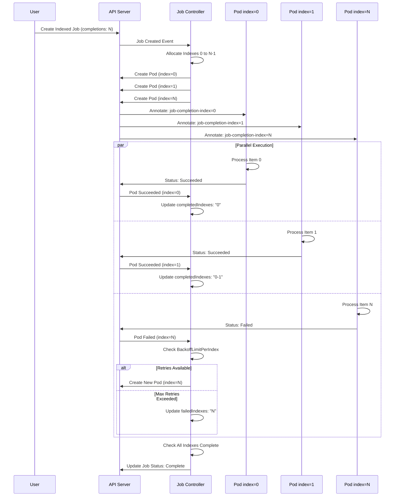
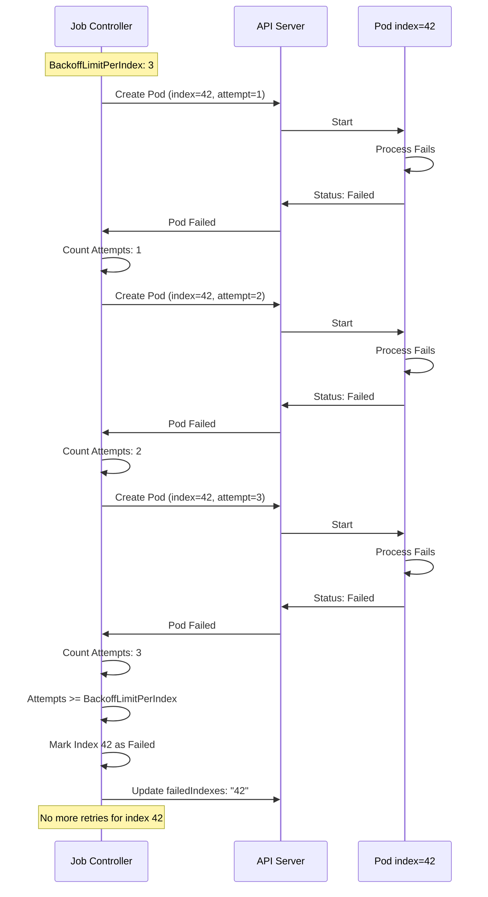

# Indexed Job Controllers

## Overview

The Indexed Job Controllers implement **completion-index-based job execution**, where each pod in a job is assigned a unique completion index. This enables parallel processing of indexed datasets, distributed computing, and deterministic task assignment.

**Key Features:**
- **Unique Indexes**: Each pod gets a unique completion index (0 to completions-1)
- **Index-based Tracking**: Track completion by index rather than pod count
- **Deterministic Assignment**: Same index always processes same data
- **Failure Handling**: Per-index backoff limits and failure policies

**Introduced in:** Kubernetes 1.21 (Alpha), 1.24 (Beta), 1.26 (GA)
**KEP:** [KEP-2214: Indexed Job](https://github.com/kubernetes/enhancements/tree/master/keps/sig-apps/2214-indexed-job)

## Architecture

### Component Overview



### Index Assignment Flow



## Controller Implementation

### Index Allocation

**File:** `pkg/controller/job/indexed_job_utils.go`

```go
// calculateSucceededIndexes determines which indexes have succeeded
func calculateSucceededIndexes(
    job *batchv1.Job,
    pods []*v1.Pod,
) (sets.Set[int], string) {
    // Parse existing completed indexes
    succeeded := parseIndexes(job.Status.CompletedIndexes)

    // Add succeeded pods
    for _, pod := range pods {
        if pod.Status.Phase != v1.PodSucceeded {
            continue
        }

        // Get completion index from annotation
        indexStr, ok := pod.Annotations[
            batchv1.JobCompletionIndexAnnotation,
        ]
        if !ok {
            continue
        }

        index, err := strconv.Atoi(indexStr)
        if err != nil {
            continue
        }

        // Verify index is in valid range
        if index < 0 || index >= int(*job.Spec.Completions) {
            continue
        }

        succeeded.Insert(index)
    }

    // Convert to compressed string format
    return succeeded, formatIndexes(succeeded)
}

// calculateFailedIndexes determines which indexes have failed
func calculateFailedIndexes(
    job *batchv1.Job,
    pods []*v1.Pod,
) (sets.Set[int], string, error) {
    if job.Spec.BackoffLimitPerIndex == nil {
        return nil, "", nil
    }

    backoffLimit := int(*job.Spec.BackoffLimitPerIndex)

    // Track attempts per index
    attemptsPerIndex := make(map[int]int)
    failed := sets.New[int]()

    // Count failed attempts
    for _, pod := range pods {
        if pod.Status.Phase != v1.PodFailed {
            continue
        }

        indexStr, ok := pod.Annotations[
            batchv1.JobCompletionIndexAnnotation,
        ]
        if !ok {
            continue
        }

        index, err := strconv.Atoi(indexStr)
        if err != nil {
            continue
        }

        attemptsPerIndex[index]++

        // Check if index exceeded backoff limit
        if attemptsPerIndex[index] > backoffLimit {
            failed.Insert(index)
        }
    }

    // Add existing failed indexes
    existingFailed := parseIndexes(job.Status.FailedIndexes)
    failed = failed.Union(existingFailed)

    return failed, formatIndexes(failed), nil
}

// parseIndexes parses compressed index string
// Format: "0-5,7,9-10" -> {0,1,2,3,4,5,7,9,10}
func parseIndexes(indexStr string) sets.Set[int] {
    indexes := sets.New[int]()

    if indexStr == "" {
        return indexes
    }

    // Split by comma
    for _, part := range strings.Split(indexStr, ",") {
        // Check for range
        if strings.Contains(part, "-") {
            rangeParts := strings.Split(part, "-")
            if len(rangeParts) != 2 {
                continue
            }

            start, err := strconv.Atoi(rangeParts[0])
            if err != nil {
                continue
            }

            end, err := strconv.Atoi(rangeParts[1])
            if err != nil {
                continue
            }

            // Add all indexes in range
            for i := start; i <= end; i++ {
                indexes.Insert(i)
            }
        } else {
            // Single index
            index, err := strconv.Atoi(part)
            if err != nil {
                continue
            }
            indexes.Insert(index)
        }
    }

    return indexes
}

// formatIndexes converts set to compressed string
// {0,1,2,3,4,5,7,9,10} -> "0-5,7,9-10"
func formatIndexes(indexes sets.Set[int]) string {
    if indexes.Len() == 0 {
        return ""
    }

    // Sort indexes
    sorted := indexes.UnsortedList()
    sort.Ints(sorted)

    var parts []string
    rangeStart := sorted[0]
    rangeEnd := sorted[0]

    for i := 1; i < len(sorted); i++ {
        if sorted[i] == rangeEnd+1 {
            // Extend current range
            rangeEnd = sorted[i]
        } else {
            // End current range, start new one
            parts = append(parts, formatRange(rangeStart, rangeEnd))
            rangeStart = sorted[i]
            rangeEnd = sorted[i]
        }
    }

    // Add final range
    parts = append(parts, formatRange(rangeStart, rangeEnd))

    return strings.Join(parts, ",")
}

// formatRange formats a single range
func formatRange(start, end int) string {
    if start == end {
        return strconv.Itoa(start)
    }
    return fmt.Sprintf("%d-%d", start, end)
}
```

**Location:** `pkg/controller/job/indexed_job_utils.go:30-200`

### Pod Creation with Index

**File:** `pkg/controller/job/job_controller.go`

```go
// createPodsWithControllerRef creates pods with indexes
func (jm *Controller) createPodsWithControllerRef(
    ctx context.Context,
    job *batchv1.Job,
    podTemplate *v1.PodTemplateSpec,
    count int,
) error {
    if isIndexedJob(job) {
        return jm.createIndexedPods(
            ctx,
            job,
            podTemplate,
            count,
        )
    }

    return jm.createNonIndexedPods(
        ctx,
        job,
        podTemplate,
        count,
    )
}

// createIndexedPods creates pods with completion indexes
func (jm *Controller) createIndexedPods(
    ctx context.Context,
    job *batchv1.Job,
    template *v1.PodTemplateSpec,
    count int,
) error {
    // Get already allocated indexes
    allocatedIndexes := jm.getAllocatedIndexes(job)

    // Determine which indexes need pods
    neededIndexes := jm.calculateNeededIndexes(
        job,
        allocatedIndexes,
        count,
    )

    // Create pods for needed indexes
    var errs []error
    for _, index := range neededIndexes {
        pod := jm.buildPodWithIndex(job, template, index)

        if err := jm.createPod(ctx, pod); err != nil {
            errs = append(errs, err)
            continue
        }

        klog.V(4).InfoS(
            "Created pod with index",
            "job", klog.KObj(job),
            "pod", klog.KObj(pod),
            "index", index,
        )
    }

    return utilerrors.NewAggregate(errs)
}

// buildPodWithIndex creates pod with completion index annotation
func (jm *Controller) buildPodWithIndex(
    job *batchv1.Job,
    template *v1.PodTemplateSpec,
    index int,
) *v1.Pod {
    pod := &v1.Pod{
        ObjectMeta: metav1.ObjectMeta{
            GenerateName: fmt.Sprintf("%s-", job.Name),
            Namespace:    job.Namespace,
            Labels:       template.Labels,
            Annotations:  template.Annotations,
        },
        Spec: template.Spec,
    }

    // Add completion index annotation
    if pod.Annotations == nil {
        pod.Annotations = make(map[string]string)
    }
    pod.Annotations[batchv1.JobCompletionIndexAnnotation] =
        strconv.Itoa(index)

    // Add job name label
    if pod.Labels == nil {
        pod.Labels = make(map[string]string)
    }
    pod.Labels[batchv1.JobNameLabel] = job.Name

    // Add batch.kubernetes.io/controller-uid label
    pod.Labels[batchv1.ControllerUidLabel] = string(job.UID)

    // Set owner reference
    pod.OwnerReferences = []metav1.OwnerReference{
        *metav1.NewControllerRef(
            job,
            batchv1.SchemeGroupVersion.WithKind("Job"),
        ),
    }

    // Add job tracking finalizer
    pod.Finalizers = []string{batchv1.JobTrackingFinalizer}

    // Add environment variable for index
    for i := range pod.Spec.Containers {
        pod.Spec.Containers[i].Env = append(
            pod.Spec.Containers[i].Env,
            v1.EnvVar{
                Name:  "JOB_COMPLETION_INDEX",
                Value: strconv.Itoa(index),
            },
        )
    }

    return pod
}

// getAllocatedIndexes gets indexes that already have pods
func (jm *Controller) getAllocatedIndexes(
    job *batchv1.Job,
) sets.Set[int] {
    pods, err := jm.getPodsForJob(context.TODO(), job)
    if err != nil {
        return sets.New[int]()
    }

    indexes := sets.New[int]()
    for _, pod := range pods {
        indexStr, ok := pod.Annotations[
            batchv1.JobCompletionIndexAnnotation,
        ]
        if !ok {
            continue
        }

        index, err := strconv.Atoi(indexStr)
        if err != nil {
            continue
        }

        indexes.Insert(index)
    }

    return indexes
}

// calculateNeededIndexes determines which indexes need new pods
func (jm *Controller) calculateNeededIndexes(
    job *batchv1.Job,
    allocated sets.Set[int],
    count int,
) []int {
    completions := int(*job.Spec.Completions)

    // Get succeeded and failed indexes
    succeeded := parseIndexes(job.Status.CompletedIndexes)
    failed := parseIndexes(job.Status.FailedIndexes)

    var needed []int
    for i := 0; i < completions && len(needed) < count; i++ {
        // Skip if already succeeded or permanently failed
        if succeeded.Has(i) || failed.Has(i) {
            continue
        }

        // Skip if already has active pod
        if allocated.Has(i) {
            continue
        }

        needed = append(needed, i)
    }

    return needed
}

// isIndexedJob checks if job uses indexed completion mode
func isIndexedJob(job *batchv1.Job) bool {
    return job.Spec.CompletionMode != nil &&
        *job.Spec.CompletionMode == batchv1.IndexedCompletion
}
```

**Location:** `pkg/controller/job/job_controller.go:500-750`

### Status Calculation

**File:** `pkg/controller/job/indexed_job_utils.go`

```go
// updateJobStatus updates indexed job status
func (jm *Controller) updateIndexedJobStatus(
    job *batchv1.Job,
    pods []*v1.Pod,
) batchv1.JobStatus {
    status := job.Status.DeepCopy()

    // Calculate succeeded indexes
    succeeded, succeededStr := calculateSucceededIndexes(job, pods)
    status.CompletedIndexes = succeededStr

    // Calculate failed indexes
    failed, failedStr, err := calculateFailedIndexes(job, pods)
    if err != nil {
        klog.ErrorS(
            err,
            "Failed to calculate failed indexes",
            "job", klog.KObj(job),
        )
    }
    if failedStr != "" {
        status.FailedIndexes = &failedStr
    }

    // Count active pods
    active := int32(0)
    for _, pod := range pods {
        if pod.Status.Phase == v1.PodRunning ||
           pod.Status.Phase == v1.PodPending {
            active++
        }
    }
    status.Active = active

    // Update counters
    status.Succeeded = int32(succeeded.Len())
    status.Failed = int32(failed.Len())

    // Check completion
    completions := int(*job.Spec.Completions)
    if succeeded.Len() == completions {
        // All indexes succeeded
        if status.CompletionTime == nil {
            now := metav1.Now()
            status.CompletionTime = &now
        }
        status.Conditions = updateCondition(
            status.Conditions,
            batchv1.JobComplete,
            v1.ConditionTrue,
            "",
            "Job completed successfully",
        )
    }

    // Check failure
    if job.Spec.MaxFailedIndexes != nil {
        maxFailed := int(*job.Spec.MaxFailedIndexes)
        if failed.Len() > maxFailed {
            // Too many failed indexes
            if status.CompletionTime == nil {
                now := metav1.Now()
                status.CompletionTime = &now
            }
            status.Conditions = updateCondition(
                status.Conditions,
                batchv1.JobFailed,
                v1.ConditionTrue,
                "TooManyFailedIndexes",
                fmt.Sprintf(
                    "%d indexes failed (max: %d)",
                    failed.Len(),
                    maxFailed,
                ),
            )
        }
    }

    return *status
}
```

**Location:** `pkg/controller/job/indexed_job_utils.go:200-320`

## Sequence Diagrams

### Indexed Job Execution



### Index Failure Handling



## Configuration Examples

### Basic Indexed Job

```yaml
apiVersion: batch/v1
kind: Job
metadata:
  name: data-processor
spec:
  # Indexed completion mode
  completionMode: Indexed
  completions: 100      # Process items 0-99
  parallelism: 10       # Run 10 pods concurrently

  template:
    spec:
      restartPolicy: Never
      containers:
      - name: processor
        image: data-processor:1.0
        env:
        # Index automatically added by controller
        - name: JOB_COMPLETION_INDEX
          valueFrom:
            fieldRef:
              fieldPath: metadata.annotations['batch.kubernetes.io/job-completion-index']
        command:
        - /bin/sh
        - -c
        - |
          echo "Processing item $JOB_COMPLETION_INDEX"
          # Process item based on index
          ./process.sh --item=$JOB_COMPLETION_INDEX
```

### Indexed Job with Failure Handling

```yaml
apiVersion: batch/v1
kind: Job
metadata:
  name: resilient-processor
spec:
  completionMode: Indexed
  completions: 1000
  parallelism: 50

  # Per-index backoff limit
  backoffLimitPerIndex: 3   # Retry each index up to 3 times

  # Maximum failed indexes before job fails
  maxFailedIndexes: 10      # Tolerate up to 10 failed indexes

  # Overall backoff limit (total pod failures)
  backoffLimit: 100

  template:
    spec:
      restartPolicy: Never
      containers:
      - name: worker
        image: worker:1.0
        env:
        - name: INDEX
          valueFrom:
            fieldRef:
              fieldPath: metadata.annotations['batch.kubernetes.io/job-completion-index']
```

### Indexed Job with Pod Failure Policy

```yaml
apiVersion: batch/v1
kind: Job
metadata:
  name: smart-processor
spec:
  completionMode: Indexed
  completions: 500
  parallelism: 25

  backoffLimitPerIndex: 2
  maxFailedIndexes: 5

  # Pod failure policy for fine-grained control
  podFailurePolicy:
    rules:
    # Retriable errors (temporary failures)
    - action: Count
      onExitCodes:
        operator: In
        values: [1, 2, 3]  # Temporary errors

    # Non-retriable errors (permanent failures)
    - action: FailIndex
      onExitCodes:
        operator: In
        values: [42, 43]   # Data corruption, invalid input

    # Critical errors (fail entire job)
    - action: FailJob
      onExitCodes:
        operator: In
        values: [255]      # System error

    # Resource exhaustion (ignore)
    - action: Ignore
      onPodConditions:
      - type: DisruptionTarget
        status: "True"

  template:
    spec:
      restartPolicy: Never
      containers:
      - name: processor
        image: processor:1.0
```

### Job Status with Completed Indexes

```yaml
# Job status after partial completion
status:
  active: 10
  succeeded: 85
  failed: 3

  # Compressed format for completed indexes
  completedIndexes: "0-50,52-85"    # 0-50 and 52-85 completed (51 failed)

  # Failed indexes (exceeded backoffLimitPerIndex)
  failedIndexes: "51,98,99"

  startTime: "2025-10-21T10:00:00Z"
  conditions:
  - type: Complete
    status: "False"
  - type: FailureTarget
    status: "False"
```

## Monitoring and Metrics

### Key Metrics

```yaml
# Indexed job metrics
job_indexed_completions_total{job_name="processor"}
job_indexed_failures_total{job_name="processor"}

# Per-index metrics (custom)
job_index_completion_duration_seconds{index="42"}
job_index_retry_count{index="42"}

# Failure tracking
job_failed_indexes_total
job_max_failed_indexes_exceeded_total

# Index allocation
job_indexes_allocated
job_indexes_active
job_indexes_completed
```

### Prometheus Queries

```promql
# Indexes completed per minute
rate(job_indexed_completions_total[1m])

# Indexes with failures
count(job_index_retry_count > 0)

# Jobs with too many failed indexes
job_failed_indexes_total > job_max_failed_indexes

# Average index completion time
histogram_quantile(0.95,
  rate(job_index_completion_duration_seconds_bucket[5m])
)

# Failed index rate
rate(job_indexed_failures_total[5m]) /
rate(job_indexed_completions_total[5m])
```

## Troubleshooting Guide

### Common Issues

#### Issue 1: Missing Indexes

**Symptoms:**
- CompletedIndexes has gaps
- Some indexes never start
- Job stuck before completion

**Diagnosis:**
```bash
# Check completed indexes
kubectl get job data-processor -o jsonpath='{.status.completedIndexes}'

# Find missing indexes
COMPLETIONS=$(kubectl get job data-processor -o jsonpath='{.spec.completions}')
COMPLETED=$(kubectl get job data-processor -o jsonpath='{.status.completedIndexes}')
echo "Expected: 0-$((COMPLETIONS-1))"
echo "Completed: $COMPLETED"

# Check for pods with missing indexes
kubectl get pods -l job-name=data-processor \
  -o jsonpath='{.items[*].metadata.annotations.batch\.kubernetes\.io/job-completion-index}' | \
  tr ' ' '\n' | sort -n
```

**Common Causes:**
1. Pods failing silently
2. Index assignment race condition
3. Controller errors

**Resolution:**
```bash
# Check pod status for all indexes
for i in $(seq 0 $((COMPLETIONS-1))); do
  POD=$(kubectl get pods -l job-name=data-processor \
    --field-selector metadata.annotations.batch.kubernetes.io/job-completion-index=$i \
    -o name)
  if [ -z "$POD" ]; then
    echo "Missing pod for index $i"
  fi
done

# Manually create missing pod
kubectl apply -f - <<EOF
apiVersion: v1
kind: Pod
metadata:
  generateName: data-processor-
  annotations:
    batch.kubernetes.io/job-completion-index: "42"
...
EOF
```

#### Issue 2: Index Retry Loops

**Symptoms:**
- Same index failing repeatedly
- BackoffLimitPerIndex not working
- Excessive pod creation

**Diagnosis:**
```bash
# Check failed indexes
kubectl get job data-processor -o jsonpath='{.status.failedIndexes}'

# Count pods for specific index
kubectl get pods -l job-name=data-processor \
  --field-selector metadata.annotations.batch.kubernetes.io/job-completion-index=42 \
  --all-namespaces

# Check pod exit codes
kubectl get pods -l job-name=data-processor \
  -o jsonpath='{.items[*].status.containerStatuses[0].state.terminated.exitCode}'
```

**Common Causes:**
1. BackoffLimitPerIndex not set
2. Exit code handling incorrect
3. Pod failure policy misconfigured

**Resolution:**
```bash
# Update job with backoff limit
kubectl patch job data-processor -p '
{
  "spec": {
    "backoffLimitPerIndex": 3,
    "maxFailedIndexes": 10
  }
}'

# Add pod failure policy
kubectl patch job data-processor -p '
{
  "spec": {
    "podFailurePolicy": {
      "rules": [{
        "action": "FailIndex",
        "onExitCodes": {
          "operator": "In",
          "values": [1]
        }
      }]
    }
  }
}'
```

#### Issue 3: CompletedIndexes Format Issues

**Symptoms:**
- CompletedIndexes string malformed
- Parsing errors in controller logs
- Incorrect completion counting

**Diagnosis:**
```bash
# Check completedIndexes format
kubectl get job data-processor \
  -o jsonpath='{.status.completedIndexes}' | \
  python3 -c "
import sys
s = sys.stdin.read().strip()
print(f'Format: {s}')

# Parse and validate
ranges = s.split(',')
for r in ranges:
    if '-' in r:
        start, end = map(int, r.split('-'))
        print(f'Range: {start} to {end} ({end-start+1} items)')
    else:
        print(f'Single: {r}')
"
```

**Resolution:**
```bash
# If corrupted, can manually fix (emergency only)
kubectl patch job data-processor --type=json -p='[
  {
    "op": "replace",
    "path": "/status/completedIndexes",
    "value": "0-10,12-20"
  }
]'
```

### Debug Commands

```bash
# Show index distribution
kubectl get pods -l job-name=data-processor \
  -o json | jq -r '.items[] |
  .metadata.annotations["batch.kubernetes.io/job-completion-index"] +
  " " + .status.phase' | sort -n

# Count indexes by status
kubectl get pods -l job-name=data-processor \
  -o json | jq -r '.items[] |
  .status.phase' | sort | uniq -c

# Find duplicate index assignments (should be empty)
kubectl get pods -l job-name=data-processor \
  -o json | jq -r '.items[] |
  .metadata.annotations["batch.kubernetes.io/job-completion-index"]' | \
  sort | uniq -d

# Monitor index progress
watch -n 5 'kubectl get job data-processor \
  -o jsonpath="{.status.succeeded}/{.spec.completions} \
  Completed: {.status.completedIndexes}"'
```

## Best Practices

### Job Design

1. **Choose Appropriate Parallelism**
   ```yaml
   spec:
     completions: 1000
     parallelism: 50  # Balance throughput and resource usage
   ```

2. **Use BackoffLimitPerIndex**
   ```yaml
   spec:
     backoffLimitPerIndex: 3    # Retry transient failures
     maxFailedIndexes: 10       # Tolerate some permanent failures
   ```

3. **Implement Idempotent Processing**
   ```bash
   #!/bin/bash
   INDEX=$JOB_COMPLETION_INDEX

   # Check if already processed
   if [ -f "/state/$INDEX.done" ]; then
     exit 0
   fi

   # Process item
   process_item $INDEX

   # Mark complete
   touch "/state/$INDEX.done"
   ```

### Index Handling

1. **Use Index for Deterministic Processing**
   ```python
   import os

   index = int(os.environ['JOB_COMPLETION_INDEX'])

   # Calculate which data to process
   chunk_size = 100
   start = index * chunk_size
   end = start + chunk_size

   process_data_range(start, end)
   ```

2. **Handle Index Boundaries**
   ```go
   index, _ := strconv.Atoi(os.Getenv("JOB_COMPLETION_INDEX"))
   total, _ := strconv.Atoi(os.Getenv("JOB_COMPLETIONS"))

   // Handle last index specially
   if index == total-1 {
       // Process remainder
   }
   ```

## Performance Considerations

### Scaling

- **Large Completions**: Use parallelism to balance completion time
- **Index String Size**: Format is compressed but can grow with gaps
- **API Server Load**: Large parallelism increases pod creation rate

### Optimization

```yaml
# Optimize for large jobs
spec:
  completions: 100000
  parallelism: 1000

  # Suspend initially
  suspend: true

# Resume in batches
# kubectl patch job huge-job -p '{"spec":{"suspend":false}}'
```

## Related Components

- **Job Controller** (`pkg/controller/job/`): Main job management
- **Job Tracking** (`pkg/controller/job/tracking_utils.go`): Finalizer tracking
- **TTL Controller** (`pkg/controller/ttlafterfinished/`): Job cleanup

## References

- **KEP-2214**: [Indexed Job](https://github.com/kubernetes/enhancements/tree/master/keps/sig-apps/2214-indexed-job)
- **KEP-3850**: [Backoff Limit Per Index](https://github.com/kubernetes/enhancements/tree/master/keps/sig-apps/3850-backoff-limits-per-index-for-indexed-jobs)
- **KEP-3329**: [Pod Failure Policy](https://github.com/kubernetes/enhancements/tree/master/keps/sig-apps/3329-retriable-and-non-retriable-failures)
- **Source Code**: `pkg/controller/job/indexed_job_utils.go`
- **API Reference**: [Job v1 - Indexed Completion](https://kubernetes.io/docs/concepts/workloads/controllers/job/#completion-mode)
