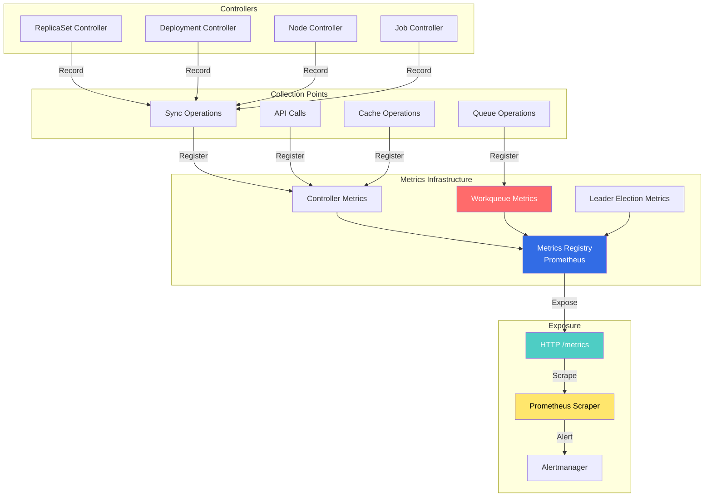
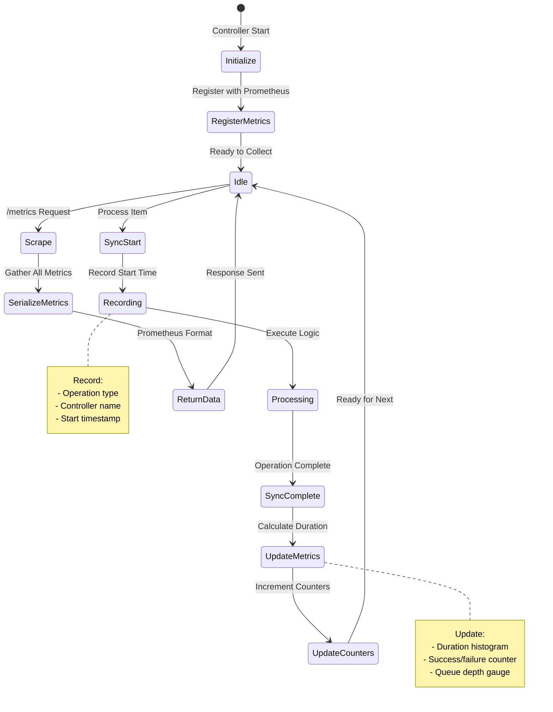

# Metrics Controllers and Observability

## Overview

The Metrics Controllers in kube-controller-manager provide comprehensive observability through Prometheus-style metrics, health checks, and debugging endpoints. These components enable monitoring, alerting, and troubleshooting of controller operations.

**Key Components:**
- **Metrics Registry**: Central metrics collection
- **Controller Metrics**: Per-controller performance metrics
- **Workqueue Metrics**: Queue depth and processing latency
- **Leader Election Metrics**: Leader status and transitions
- **Health Checks**: Liveness and readiness probes

## Architecture

### Metrics System Overview



### Metrics Collection Flow



## Metrics Implementation

### Controller Metrics Registration

**File:** `pkg/controller/metrics/metrics.go`

```go
// Package metrics provides controller metrics
package metrics

import (
    "sync"
    "time"

    "k8s.io/component-base/metrics"
    "k8s.io/component-base/metrics/legacyregistry"
)

var (
    // SyncCounter counts controller sync operations
    SyncCounter = metrics.NewCounterVec(
        &metrics.CounterOpts{
            Subsystem:      "controller_manager",
            Name:           "sync_total",
            Help:           "Total number of sync operations by controller",
            StabilityLevel: metrics.ALPHA,
        },
        []string{"controller", "result"},
    )

    // SyncDuration measures sync operation latency
    SyncDuration = metrics.NewHistogramVec(
        &metrics.HistogramOpts{
            Subsystem:      "controller_manager",
            Name:           "sync_duration_seconds",
            Help:           "Duration of sync operations",
            Buckets:        []float64{0.001, 0.01, 0.1, 1.0, 10.0, 60.0},
            StabilityLevel: metrics.ALPHA,
        },
        []string{"controller"},
    )

    // QueueDepth measures workqueue depth
    QueueDepth = metrics.NewGaugeVec(
        &metrics.GaugeOpts{
            Subsystem:      "controller_manager",
            Name:           "queue_depth",
            Help:           "Current depth of controller workqueue",
            StabilityLevel: metrics.ALPHA,
        },
        []string{"controller"},
    )

    // QueueLatency measures time items spend in queue
    QueueLatency = metrics.NewHistogramVec(
        &metrics.HistogramOpts{
            Subsystem:      "controller_manager",
            Name:           "queue_latency_seconds",
            Help:           "Time items spend waiting in workqueue",
            Buckets:        metrics.ExponentialBuckets(0.001, 2, 15),
            StabilityLevel: metrics.ALPHA,
        },
        []string{"controller"},
    )

    // WorkDuration measures actual work processing time
    WorkDuration = metrics.NewHistogramVec(
        &metrics.HistogramOpts{
            Subsystem:      "controller_manager",
            Name:           "work_duration_seconds",
            Help:           "Duration of work item processing",
            Buckets:        []float64{0.001, 0.01, 0.1, 1.0, 10.0},
            StabilityLevel: metrics.ALPHA,
        },
        []string{"controller"},
    )

    // RetryCounter counts retry operations
    RetryCounter = metrics.NewCounterVec(
        &metrics.CounterOpts{
            Subsystem:      "controller_manager",
            Name:           "retries_total",
            Help:           "Total number of retry operations",
            StabilityLevel: metrics.ALPHA,
        },
        []string{"controller"},
    )

    registerOnce sync.Once
)

// Register registers all controller metrics
func Register() {
    registerOnce.Do(func() {
        legacyregistry.MustRegister(SyncCounter)
        legacyregistry.MustRegister(SyncDuration)
        legacyregistry.MustRegister(QueueDepth)
        legacyregistry.MustRegister(QueueLatency)
        legacyregistry.MustRegister(WorkDuration)
        legacyregistry.MustRegister(RetryCounter)
    })
}

// RecordSync records a sync operation
func RecordSync(controller string, duration time.Duration, err error) {
    result := "success"
    if err != nil {
        result = "error"
    }

    SyncCounter.WithLabelValues(controller, result).Inc()
    SyncDuration.WithLabelValues(controller).Observe(duration.Seconds())
}

// RecordQueueDepth records current queue depth
func RecordQueueDepth(controller string, depth int) {
    QueueDepth.WithLabelValues(controller).Set(float64(depth))
}

// RecordQueueLatency records queue wait time
func RecordQueueLatency(controller string, latency time.Duration) {
    QueueLatency.WithLabelValues(controller).Observe(latency.Seconds())
}

// RecordWorkDuration records work processing time
func RecordWorkDuration(controller string, duration time.Duration) {
    WorkDuration.WithLabelValues(controller).Observe(duration.Seconds())
}

// RecordRetry records a retry operation
func RecordRetry(controller string) {
    RetryCounter.WithLabelValues(controller).Inc()
}
```

**Location:** `pkg/controller/metrics/metrics.go:30-150`

### Workqueue Metrics

**File:** `staging/src/k8s.io/client-go/util/workqueue/metrics.go`

```go
// Package workqueue provides metrics for rate-limited workqueues
package workqueue

import (
    "time"

    "k8s.io/component-base/metrics"
)

// MetricsProvider is an interface for queue metrics
type MetricsProvider interface {
    NewDepthMetric(name string) GaugeMetric
    NewAddsMetric(name string) CounterMetric
    NewLatencyMetric(name string) HistogramMetric
    NewWorkDurationMetric(name string) HistogramMetric
    NewUnfinishedWorkSecondsMetric(name string) SettableGaugeMetric
    NewLongestRunningProcessorSecondsMetric(name string) SettableGaugeMetric
    NewRetriesMetric(name string) CounterMetric
}

// defaultMetricsProvider implements MetricsProvider
type defaultMetricsProvider struct{}

var (
    depth = metrics.NewGaugeVec(
        &metrics.GaugeOpts{
            Subsystem:      "workqueue",
            Name:           "depth",
            Help:           "Current depth of workqueue",
            StabilityLevel: metrics.ALPHA,
        },
        []string{"name"},
    )

    adds = metrics.NewCounterVec(
        &metrics.CounterOpts{
            Subsystem:      "workqueue",
            Name:           "adds_total",
            Help:           "Total number of adds handled by workqueue",
            StabilityLevel: metrics.ALPHA,
        },
        []string{"name"},
    )

    latency = metrics.NewHistogramVec(
        &metrics.HistogramOpts{
            Subsystem:      "workqueue",
            Name:           "queue_duration_seconds",
            Help:           "How long in seconds an item stays in workqueue",
            Buckets:        metrics.ExponentialBuckets(10e-9, 10, 12),
            StabilityLevel: metrics.ALPHA,
        },
        []string{"name"},
    )

    workDuration = metrics.NewHistogramVec(
        &metrics.HistogramOpts{
            Subsystem:      "workqueue",
            Name:           "work_duration_seconds",
            Help:           "How long in seconds processing takes",
            Buckets:        metrics.ExponentialBuckets(10e-9, 10, 12),
            StabilityLevel: metrics.ALPHA,
        },
        []string{"name"},
    )

    unfinished = metrics.NewGaugeVec(
        &metrics.GaugeOpts{
            Subsystem: "workqueue",
            Name:      "unfinished_work_seconds",
            Help: "How many seconds of work has been done that " +
                "is in progress and hasn't been observed by work_duration",
            StabilityLevel: metrics.ALPHA,
        },
        []string{"name"},
    )

    longestRunningProcessor = metrics.NewGaugeVec(
        &metrics.GaugeOpts{
            Subsystem: "workqueue",
            Name:      "longest_running_processor_seconds",
            Help: "How many seconds has the longest running " +
                "processor been running",
            StabilityLevel: metrics.ALPHA,
        },
        []string{"name"},
    )

    retries = metrics.NewCounterVec(
        &metrics.CounterOpts{
            Subsystem:      "workqueue",
            Name:           "retries_total",
            Help:           "Total number of retries handled by workqueue",
            StabilityLevel: metrics.ALPHA,
        },
        []string{"name"},
    )
)

// NewDepthMetric implements MetricsProvider
func (defaultMetricsProvider) NewDepthMetric(name string) GaugeMetric {
    return depth.WithLabelValues(name)
}

// NewAddsMetric implements MetricsProvider
func (defaultMetricsProvider) NewAddsMetric(name string) CounterMetric {
    return adds.WithLabelValues(name)
}

// NewLatencyMetric implements MetricsProvider
func (defaultMetricsProvider) NewLatencyMetric(name string) HistogramMetric {
    return latency.WithLabelValues(name)
}

// NewWorkDurationMetric implements MetricsProvider
func (defaultMetricsProvider) NewWorkDurationMetric(
    name string,
) HistogramMetric {
    return workDuration.WithLabelValues(name)
}

// NewUnfinishedWorkSecondsMetric implements MetricsProvider
func (defaultMetricsProvider) NewUnfinishedWorkSecondsMetric(
    name string,
) SettableGaugeMetric {
    return unfinished.WithLabelValues(name)
}

// NewLongestRunningProcessorSecondsMetric implements MetricsProvider
func (defaultMetricsProvider) NewLongestRunningProcessorSecondsMetric(
    name string,
) SettableGaugeMetric {
    return longestRunningProcessor.WithLabelValues(name)
}

// NewRetriesMetric implements MetricsProvider
func (defaultMetricsProvider) NewRetriesMetric(name string) CounterMetric {
    return retries.WithLabelValues(name)
}
```

**Location:** `staging/src/k8s.io/client-go/util/workqueue/metrics.go:30-200`

### Leader Election Metrics

**File:** `staging/src/k8s.io/client-go/tools/leaderelection/metrics.go`

```go
// Package leaderelection provides metrics for leader election
package leaderelection

import (
    "time"

    "k8s.io/component-base/metrics"
)

var (
    // leaderElection tracks leader election status
    leaderElection = metrics.NewGaugeVec(
        &metrics.GaugeOpts{
            Subsystem:      "leader_election",
            Name:           "master_status",
            Help:           "Gauge of if the reporting system is master",
            StabilityLevel: metrics.ALPHA,
        },
        []string{"name"},
    )

    // slowpathExercised tracks slow path usage
    slowpathExercised = metrics.NewGaugeVec(
        &metrics.GaugeOpts{
            Subsystem: "leader_election",
            Name:      "slowpath_exercised_total",
            Help: "Total number of times that the slow path " +
                "was exercised",
            StabilityLevel: metrics.ALPHA,
        },
        []string{"name"},
    )

    // leaderOn tracks when leadership was acquired
    leaderOn = metrics.NewGaugeVec(
        &metrics.GaugeOpts{
            Subsystem:      "leader_election",
            Name:           "leader_on",
            Help:           "Gauge of last leader election timestamp",
            StabilityLevel: metrics.ALPHA,
        },
        []string{"name"},
    )
)

// RecordLeaderElection records leader election result
func RecordLeaderElection(name string, isLeader bool) {
    value := 0.0
    if isLeader {
        value = 1.0
    }
    leaderElection.WithLabelValues(name).Set(value)
}

// RecordSlowpath records slow path exercised
func RecordSlowpath(name string) {
    slowpathExercised.WithLabelValues(name).Inc()
}

// RecordLeaderOn records when leadership was acquired
func RecordLeaderOn(name string, timestamp time.Time) {
    leaderOn.WithLabelValues(name).Set(float64(timestamp.Unix()))
}
```

**Location:** `staging/src/k8s.io/client-go/tools/leaderelection/metrics.go:30-100`

## Controller-Specific Metrics

### ReplicaSet Controller Metrics

**File:** `pkg/controller/replicaset/replica_set.go`

```go
var (
    // rsControllerSubsystem is the subsystem for RS controller
    rsControllerSubsystem = "replicaset_controller"

    // rsControllerSyncCount counts RS sync operations
    rsControllerSyncCount = metrics.NewCounterVec(
        &metrics.CounterOpts{
            Subsystem:      rsControllerSubsystem,
            Name:           "sync_total",
            Help:           "Total number of ReplicaSet sync operations",
            StabilityLevel: metrics.ALPHA,
        },
        []string{"result"},
    )

    // rsControllerSyncLatency measures sync latency
    rsControllerSyncLatency = metrics.NewHistogram(
        &metrics.HistogramOpts{
            Subsystem:      rsControllerSubsystem,
            Name:           "sync_duration_seconds",
            Help:           "ReplicaSet sync operation duration",
            Buckets:        []float64{0.001, 0.01, 0.1, 1.0, 10.0},
            StabilityLevel: metrics.ALPHA,
        },
    )

    // rsControllerPods tracks pod counts
    rsControllerPods = metrics.NewGaugeVec(
        &metrics.GaugeOpts{
            Subsystem:      rsControllerSubsystem,
            Name:           "pods",
            Help:           "Number of pods owned by ReplicaSets",
            StabilityLevel: metrics.ALPHA,
        },
        []string{"namespace", "replicaset"},
    )
)

// recordSync records a sync operation
func (rsc *ReplicaSetController) recordSync(
    rs *apps.ReplicaSet,
    startTime time.Time,
    err error,
) {
    result := "success"
    if err != nil {
        result = "error"
    }

    rsControllerSyncCount.WithLabelValues(result).Inc()
    rsControllerSyncLatency.Observe(
        time.Since(startTime).Seconds(),
    )

    // Update pod count gauge
    podList, _ := rsc.podLister.Pods(rs.Namespace).List(
        labels.SelectorFromSet(rs.Spec.Selector.MatchLabels),
    )
    rsControllerPods.WithLabelValues(
        rs.Namespace,
        rs.Name,
    ).Set(float64(len(podList)))
}
```

**Location:** `pkg/controller/replicaset/replica_set.go:80-150`

### Deployment Controller Metrics

```go
var (
    deploymentControllerSubsystem = "deployment_controller"

    deploymentSyncCount = metrics.NewCounterVec(
        &metrics.CounterOpts{
            Subsystem:      deploymentControllerSubsystem,
            Name:           "sync_total",
            Help:           "Total deployment sync operations",
            StabilityLevel: metrics.ALPHA,
        },
        []string{"result"},
    )

    deploymentRolloutCount = metrics.NewCounterVec(
        &metrics.CounterOpts{
            Subsystem:      deploymentControllerSubsystem,
            Name:           "rollout_total",
            Help:           "Total deployment rollouts",
            StabilityLevel: metrics.ALPHA,
        },
        []string{"strategy"},
    )

    deploymentConditions = metrics.NewGaugeVec(
        &metrics.GaugeOpts{
            Subsystem:      deploymentControllerSubsystem,
            Name:           "conditions",
            Help:           "Deployment condition status",
            StabilityLevel: metrics.ALPHA,
        },
        []string{"namespace", "deployment", "condition"},
    )
)
```

**Location:** `pkg/controller/deployment/metrics.go:30-80`

## Health Check Endpoints

### Health Check Implementation

**File:** `cmd/kube-controller-manager/app/controllermanager.go`

```go
// AddHealthChecks adds health check endpoints
func AddHealthChecks(
    mux *http.ServeMux,
    checks ...healthz.HealthChecker,
) {
    healthz.InstallHandler(mux, checks...)
    healthz.InstallReadyzHandler(mux, checks...)
    healthz.InstallLivezHandler(mux, checks...)
}

// ControllerManagerHealthChecks returns all health checks
func ControllerManagerHealthChecks() []healthz.HealthChecker {
    return []healthz.HealthChecker{
        healthz.PingHealthz,
        healthz.LogHealthz,
        &leaderElectionHealthCheck{},
        &controllerHealthCheck{},
    }
}

// leaderElectionHealthCheck checks leader election
type leaderElectionHealthCheck struct {
    le *leaderelection.LeaderElector
}

func (c *leaderElectionHealthCheck) Name() string {
    return "leaderelection"
}

func (c *leaderElectionHealthCheck) Check(req *http.Request) error {
    if c.le == nil {
        return fmt.Errorf("leader election not initialized")
    }

    if !c.le.IsLeader() {
        return fmt.Errorf("not currently leader")
    }

    return nil
}

// controllerHealthCheck checks controller status
type controllerHealthCheck struct {
    controllers map[string]bool
    mu          sync.RWMutex
}

func (c *controllerHealthCheck) Name() string {
    return "controllers"
}

func (c *controllerHealthCheck) Check(req *http.Request) error {
    c.mu.RLock()
    defer c.mu.RUnlock()

    unhealthy := []string{}
    for name, healthy := range c.controllers {
        if !healthy {
            unhealthy = append(unhealthy, name)
        }
    }

    if len(unhealthy) > 0 {
        return fmt.Errorf(
            "unhealthy controllers: %v",
            unhealthy,
        )
    }

    return nil
}
```

**Location:** `cmd/kube-controller-manager/app/controllermanager.go:200-300`

## Monitoring and Alerting

### Key Metrics

```yaml
# Controller sync metrics
controller_manager_sync_total{controller="replicaset",result="success"}
controller_manager_sync_total{controller="replicaset",result="error"}
controller_manager_sync_duration_seconds{controller="replicaset"}

# Workqueue metrics
workqueue_depth{name="replicaset"}
workqueue_adds_total{name="replicaset"}
workqueue_queue_duration_seconds{name="replicaset"}
workqueue_work_duration_seconds{name="replicaset"}
workqueue_retries_total{name="replicaset"}
workqueue_unfinished_work_seconds{name="replicaset"}
workqueue_longest_running_processor_seconds{name="replicaset"}

# Leader election metrics
leader_election_master_status{name="kube-controller-manager"}
leader_election_leader_on{name="kube-controller-manager"}
leader_election_slowpath_exercised_total{name="kube-controller-manager"}

# REST client metrics
rest_client_requests_total{code="200",method="GET",verb="LIST"}
rest_client_request_duration_seconds{verb="LIST"}

# Process metrics
process_cpu_seconds_total
process_resident_memory_bytes
process_open_fds
go_goroutines
```

### Prometheus Recording Rules

```yaml
groups:
- name: controller_manager_recording_rules
  interval: 30s
  rules:
  # Sync error rate
  - record: controller_manager:sync_errors:rate5m
    expr: |
      rate(controller_manager_sync_total{result="error"}[5m])

  # Sync success rate
  - record: controller_manager:sync_success:rate5m
    expr: |
      rate(controller_manager_sync_total{result="success"}[5m])

  # Sync error ratio
  - record: controller_manager:sync_error_ratio:rate5m
    expr: |
      rate(controller_manager_sync_total{result="error"}[5m])
      /
      rate(controller_manager_sync_total[5m])

  # Queue depth by controller
  - record: controller_manager:queue_depth:max
    expr: |
      max(workqueue_depth) by (name)

  # Average queue latency
  - record: controller_manager:queue_latency:p95
    expr: |
      histogram_quantile(0.95,
        rate(workqueue_queue_duration_seconds_bucket[5m])
      )

  # Work duration p99
  - record: controller_manager:work_duration:p99
    expr: |
      histogram_quantile(0.99,
        rate(workqueue_work_duration_seconds_bucket[5m])
      )
```

### Alerting Rules

```yaml
groups:
- name: controller_manager_alerts
  rules:
  # High sync error rate
  - alert: ControllerManagerHighSyncErrors
    expr: |
      rate(controller_manager_sync_total{result="error"}[5m]) > 0.1
    for: 5m
    labels:
      severity: warning
    annotations:
      summary: "High controller sync error rate"
      description: |
        Controller {{ $labels.controller }} has error rate of
        {{ $value | humanize }} errors/sec for 5 minutes

  # Controller not syncing
  - alert: ControllerManagerNotSyncing
    expr: |
      rate(controller_manager_sync_total[5m]) == 0
    for: 10m
    labels:
      severity: critical
    annotations:
      summary: "Controller not performing syncs"
      description: |
        Controller {{ $labels.controller }} has not performed
        any syncs in the last 10 minutes

  # High queue depth
  - alert: ControllerManagerHighQueueDepth
    expr: |
      workqueue_depth > 1000
    for: 15m
    labels:
      severity: warning
    annotations:
      summary: "High controller queue depth"
      description: |
        Queue {{ $labels.name }} has {{ $value }} items pending
        for 15 minutes

  # Slow work processing
  - alert: ControllerManagerSlowProcessing
    expr: |
      histogram_quantile(0.99,
        rate(workqueue_work_duration_seconds_bucket[5m])
      ) > 10
    for: 10m
    labels:
      severity: warning
    annotations:
      summary: "Slow controller work processing"
      description: |
        Queue {{ $labels.name }} has p99 work duration of
        {{ $value | humanizeDuration }}

  # Not leader
  - alert: ControllerManagerNotLeader
    expr: |
      leader_election_master_status == 0
    for: 5m
    labels:
      severity: critical
    annotations:
      summary: "Controller manager not leader"
      description: |
        Controller manager {{ $labels.name }} is not the leader

  # High retry rate
  - alert: ControllerManagerHighRetries
    expr: |
      rate(workqueue_retries_total[5m]) > 10
    for: 10m
    labels:
      severity: warning
    annotations:
      summary: "High controller retry rate"
      description: |
        Queue {{ $labels.name }} has retry rate of
        {{ $value | humanize }} retries/sec

  # Memory usage high
  - alert: ControllerManagerHighMemory
    expr: |
      process_resident_memory_bytes > 2e9
    for: 10m
    labels:
      severity: warning
    annotations:
      summary: "Controller manager high memory usage"
      description: |
        Memory usage is {{ $value | humanize1024 }}B

  # Goroutine leak
  - alert: ControllerManagerGoroutineLeak
    expr: |
      rate(go_goroutines[5m]) > 10
    for: 15m
    labels:
      severity: warning
    annotations:
      summary: "Possible goroutine leak"
      description: |
        Goroutine count increasing at {{ $value }}/sec
```

## Grafana Dashboards

### Controller Manager Overview Dashboard

```json
{
  "dashboard": {
    "title": "Kube-Controller-Manager Overview",
    "panels": [
      {
        "title": "Sync Operations Rate",
        "targets": [
          {
            "expr": "rate(controller_manager_sync_total[5m])",
            "legendFormat": "{{controller}} - {{result}}"
          }
        ],
        "type": "graph"
      },
      {
        "title": "Queue Depth",
        "targets": [
          {
            "expr": "workqueue_depth",
            "legendFormat": "{{name}}"
          }
        ],
        "type": "graph"
      },
      {
        "title": "Sync Duration (p95)",
        "targets": [
          {
            "expr": "histogram_quantile(0.95, rate(controller_manager_sync_duration_seconds_bucket[5m]))",
            "legendFormat": "{{controller}}"
          }
        ],
        "type": "graph"
      },
      {
        "title": "Leader Election Status",
        "targets": [
          {
            "expr": "leader_election_master_status",
            "legendFormat": "{{name}}"
          }
        ],
        "type": "singlestat"
      },
      {
        "title": "Work Queue Latency",
        "targets": [
          {
            "expr": "histogram_quantile(0.99, rate(workqueue_queue_duration_seconds_bucket[5m]))",
            "legendFormat": "{{name}}"
          }
        ],
        "type": "graph"
      },
      {
        "title": "Retry Rate",
        "targets": [
          {
            "expr": "rate(workqueue_retries_total[5m])",
            "legendFormat": "{{name}}"
          }
        ],
        "type": "graph"
      }
    ]
  }
}
```

## Configuration Examples

### Metrics Server Configuration

```yaml
# kube-controller-manager flags
apiVersion: v1
kind: Pod
metadata:
  name: kube-controller-manager
  namespace: kube-system
spec:
  containers:
  - name: kube-controller-manager
    image: k8s.gcr.io/kube-controller-manager:v1.28.0
    command:
    - kube-controller-manager

    # Metrics and profiling
    - --bind-address=0.0.0.0
    - --secure-port=10257
    - --port=0  # Disable insecure port

    # Enable profiling
    - --profiling=true

    # Controller-specific flags
    - --concurrent-deployment-syncs=5
    - --concurrent-replicaset-syncs=5
    - --concurrent-service-syncs=1

    ports:
    - containerPort: 10257
      name: https
      protocol: TCP

    livenessProbe:
      httpGet:
        path: /healthz
        port: 10257
        scheme: HTTPS
      initialDelaySeconds: 15
      timeoutSeconds: 15

    readinessProbe:
      httpGet:
        path: /readyz
        port: 10257
        scheme: HTTPS
      initialDelaySeconds: 10
      timeoutSeconds: 15
```

### Prometheus ServiceMonitor

```yaml
apiVersion: monitoring.coreos.com/v1
kind: ServiceMonitor
metadata:
  name: kube-controller-manager
  namespace: kube-system
  labels:
    k8s-app: kube-controller-manager
spec:
  selector:
    matchLabels:
      k8s-app: kube-controller-manager

  endpoints:
  - port: https
    interval: 30s
    scheme: https
    tlsConfig:
      insecureSkipVerify: true
    bearerTokenFile: /var/run/secrets/kubernetes.io/serviceaccount/token

  namespaceSelector:
    matchNames:
    - kube-system
```

### Service for Metrics

```yaml
apiVersion: v1
kind: Service
metadata:
  name: kube-controller-manager
  namespace: kube-system
  labels:
    k8s-app: kube-controller-manager
spec:
  type: ClusterIP
  clusterIP: None
  ports:
  - name: https
    port: 10257
    protocol: TCP
    targetPort: 10257
  selector:
    component: kube-controller-manager
```

## Troubleshooting Guide

### Common Issues

#### Issue 1: Metrics Not Available

**Symptoms:**
- /metrics endpoint returns 404
- Prometheus not scraping metrics
- Empty dashboards

**Diagnosis:**
```bash
# Check if metrics endpoint is accessible
kubectl exec -n kube-system kube-controller-manager-xxx -- \
  curl -k https://localhost:10257/metrics

# Check service configuration
kubectl get svc -n kube-system kube-controller-manager

# Check ServiceMonitor
kubectl get servicemonitor -n kube-system kube-controller-manager -o yaml
```

**Resolution:**
```bash
# Verify secure port is configured
kubectl get pod -n kube-system kube-controller-manager-xxx \
  -o jsonpath='{.spec.containers[0].command}' | grep secure-port

# Test locally
kubectl port-forward -n kube-system \
  kube-controller-manager-xxx 10257:10257

curl -k https://localhost:10257/metrics
```

#### Issue 2: High Queue Depth

**Symptoms:**
- workqueue_depth metric increasing
- Slow reconciliation
- Resource lag

**Diagnosis:**
```bash
# Check queue depth
kubectl get --raw /metrics | grep workqueue_depth

# Check longest running processor
kubectl get --raw /metrics | grep longest_running_processor

# Check unfinished work
kubectl get --raw /metrics | grep unfinished_work
```

**Resolution:**
```bash
# Increase concurrency
kubectl patch pod -n kube-system kube-controller-manager-xxx --type=json -p='[
  {
    "op": "add",
    "path": "/spec/containers/0/command/-",
    "value": "--concurrent-deployment-syncs=10"
  }
]'

# Check for stuck items
kubectl logs -n kube-system kube-controller-manager-xxx | \
  grep -i "processing.*took"
```

## Best Practices

1. **Monitor Key Metrics**
   - Sync error rates
   - Queue depth
   - Work duration
   - Leader election status

2. **Set Up Alerts**
   - High error rates
   - Queue backup
   - Slow processing
   - Leader election failures

3. **Use Grafana Dashboards**
   - Real-time visualization
   - Historical trends
   - Capacity planning

4. **Regular Review**
   - Check metrics weekly
   - Analyze trends
   - Tune controller parameters

## Related Components

- **Prometheus**: Metrics collection
- **Grafana**: Visualization
- **Alertmanager**: Alert routing
- **Component Base**: `k8s.io/component-base/metrics`

## References

- **Metrics Package**: `k8s.io/component-base/metrics`
- **Workqueue Metrics**: `k8s.io/client-go/util/workqueue`
- **Health Checks**: `k8s.io/apiserver/pkg/server/healthz`
- **Prometheus**: https://prometheus.io/docs/
- **Grafana**: https://grafana.com/docs/
