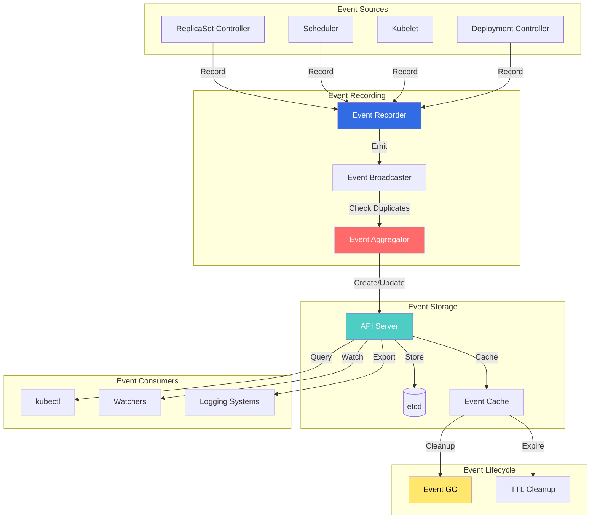
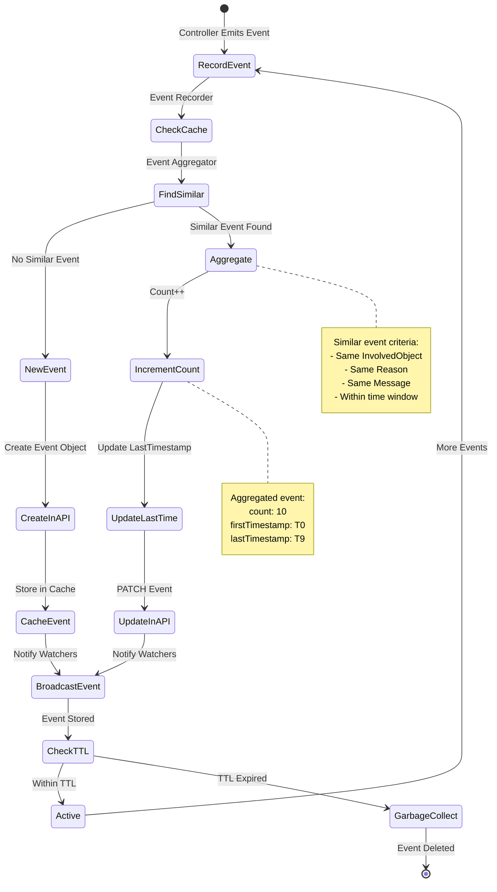

# Event Controllers and Event Management

## Overview

The Event Controllers in Kubernetes manage the creation, aggregation, and lifecycle of Event objects. Events provide audit trails, debugging information, and operational insights into cluster activities. The system includes intelligent aggregation to prevent event storms and API server overload.

**Key Components:**
- **Event Recorder**: Creates and emits events
- **Event Broadcaster**: Distributes events to watchers
- **Event Aggregator**: Deduplicates similar events
- **Event GC**: Garbage collects old events

**Event Types:**
- **Normal**: Informational events (pod started, service created)
- **Warning**: Potential issues (failed scheduling, image pull errors)

## Architecture

### Event System Overview



### Event Aggregation Flow



## Event Recorder Implementation

### Event Recorder

**File:** `staging/src/k8s.io/client-go/tools/record/event.go`

```go
// EventRecorder knows how to record events
type EventRecorder interface {
    // Event constructs an event and records it
    Event(object runtime.Object, eventtype, reason, message string)

    // Eventf constructs an event with formatted message
    Eventf(
        object runtime.Object,
        eventtype, reason, messageFmt string,
        args ...interface{},
    )

    // AnnotatedEventf is like Eventf but with annotations
    AnnotatedEventf(
        object runtime.Object,
        annotations map[string]string,
        eventtype, reason, messageFmt string,
        args ...interface{},
    )
}

// recorderImpl implements EventRecorder
type recorderImpl struct {
    scheme *runtime.Scheme
    source v1.EventSource
    clock  clock.Clock

    // Event sink for broadcasting
    sink EventSink
}

// NewEventRecorder creates a new event recorder
func NewEventRecorder(
    scheme *runtime.Scheme,
    source v1.EventSource,
    broadcaster EventBroadcaster,
) EventRecorder {
    return &recorderImpl{
        scheme: scheme,
        source: source,
        clock:  clock.RealClock{},
        sink:   broadcaster.NewRecorder(scheme, source),
    }
}

// Event records an event
func (r *recorderImpl) Event(
    object runtime.Object,
    eventtype, reason, message string,
) {
    r.generateEvent(object, nil, eventtype, reason, message)
}

// Eventf records an event with formatted message
func (r *recorderImpl) Eventf(
    object runtime.Object,
    eventtype, reason, messageFmt string,
    args ...interface{},
) {
    r.Event(
        object,
        eventtype,
        reason,
        fmt.Sprintf(messageFmt, args...),
    )
}

// generateEvent generates an event from provided information
func (r *recorderImpl) generateEvent(
    object runtime.Object,
    annotations map[string]string,
    eventtype, reason, message string,
) {
    // Get object metadata
    ref, err := ref.GetReference(r.scheme, object)
    if err != nil {
        klog.Errorf("Could not construct reference: %v", err)
        return
    }

    // Build event
    event := &v1.Event{
        ObjectMeta: metav1.ObjectMeta{
            Name:        fmt.Sprintf("%v.%x", ref.Name, r.clock.Now().UnixNano()),
            Namespace:   ref.Namespace,
            Annotations: annotations,
        },
        InvolvedObject: *ref,
        Reason:         reason,
        Message:        message,
        FirstTimestamp: metav1.NewTime(r.clock.Now()),
        LastTimestamp:  metav1.NewTime(r.clock.Now()),
        Count:          1,
        Type:           eventtype,
        Source:         r.source,
    }

    // Send to broadcaster
    r.sink.Create(event)
}
```

**Location:** `staging/src/k8s.io/client-go/tools/record/event.go:50-200`

### Event Broadcaster

**File:** `staging/src/k8s.io/client-go/tools/record/event.go`

```go
// EventBroadcaster knows how to receive events and send them to watchers
type EventBroadcaster interface {
    // StartEventWatcher starts sending events received from broadcaster
    StartEventWatcher(eventHandler func(*v1.Event)) watch.Interface

    // StartRecordingToSink starts sending events to the given sink
    StartRecordingToSink(sink EventSink) watch.Interface

    // StartLogging starts logging events
    StartLogging(logf func(format string, args ...interface{})) watch.Interface

    // NewRecorder creates a new event recorder
    NewRecorder(scheme *runtime.Scheme, source v1.EventSource) EventRecorder

    // Shutdown shuts down the broadcaster
    Shutdown()
}

// eventBroadcasterImpl implements EventBroadcaster
type eventBroadcasterImpl struct {
    broadcaster   *watch.Broadcaster
    sleepDuration time.Duration
}

// NewBroadcaster creates a new event broadcaster
func NewBroadcaster() EventBroadcaster {
    return &eventBroadcasterImpl{
        broadcaster:   watch.NewBroadcaster(maxQueuedEvents, watch.DropIfChannelFull),
        sleepDuration: defaultSleepDuration,
    }
}

// StartRecordingToSink starts sending events to API server
func (e *eventBroadcasterImpl) StartRecordingToSink(
    sink EventSink,
) watch.Interface {
    eventHandler := func(event *v1.Event) {
        // Try to create or update event
        for {
            _, err := sink.Create(event)
            if err == nil {
                break
            }

            // If conflict, try to update
            if apierrors.IsAlreadyExists(err) {
                _, err = sink.Update(event)
                if err == nil {
                    break
                }
            }

            // Backoff and retry
            time.Sleep(e.sleepDuration)
        }
    }

    return e.StartEventWatcher(eventHandler)
}

// StartEventWatcher starts watching events
func (e *eventBroadcasterImpl) StartEventWatcher(
    eventHandler func(*v1.Event),
) watch.Interface {
    watcher := e.broadcaster.Watch()

    go func() {
        defer utilruntime.HandleCrash()
        for event := range watcher.ResultChan() {
            if event.Type == watch.Error {
                continue
            }

            eventHandler(event.Object.(*v1.Event))
        }
    }()

    return watcher
}

// NewRecorder creates a recorder with broadcaster as sink
func (e *eventBroadcasterImpl) NewRecorder(
    scheme *runtime.Scheme,
    source v1.EventSource,
) EventRecorder {
    return &recorderImpl{
        scheme: scheme,
        source: source,
        sink:   &eventBroadcasterAdapterImpl{e.broadcaster},
    }
}
```

**Location:** `staging/src/k8s.io/client-go/tools/record/event.go:200-350`

### Event Aggregation

**File:** `pkg/controller/eventbroadcaster/event_aggregator.go`

```go
// EventAggregator aggregates similar events
type EventAggregator struct {
    // Cache of recent events
    cache *lru.Cache

    // Lock for cache access
    lock sync.RWMutex

    // Configuration
    maxEvents         int
    maxIntervalInSeconds int
}

// NewEventAggregator creates a new aggregator
func NewEventAggregator(
    maxEvents int,
    maxInterval time.Duration,
) *EventAggregator {
    cache, _ := lru.New(maxEvents)
    return &EventAggregator{
        cache:                cache,
        maxEvents:            maxEvents,
        maxIntervalInSeconds: int(maxInterval.Seconds()),
    }
}

// EventAggregate aggregates event information
type EventAggregate struct {
    // First event in aggregate
    FirstEvent *v1.Event

    // Last event in aggregate
    LastEvent *v1.Event

    // Count of aggregated events
    Count int

    // Local key for caching
    LocalKeys sets.String
}

// EventAggregatorMessageFunc is a function that generates a message
type EventAggregatorMessageFunc func(event *v1.Event) string

// aggregateEvent aggregates an event into cache
func (e *EventAggregator) aggregateEvent(
    event *v1.Event,
    messageFunc EventAggregatorMessageFunc,
) (*v1.Event, error) {
    // Compute aggregation key
    aggregateKey := e.getEventKey(event)
    localKey := e.getLocalKey(event)

    e.lock.Lock()
    defer e.lock.Unlock()

    // Check if similar event exists
    value, found := e.cache.Get(aggregateKey)
    if !found {
        // New event, add to cache
        e.cache.Add(aggregateKey, &EventAggregate{
            FirstEvent: event,
            LastEvent:  event,
            Count:      1,
            LocalKeys:  sets.NewString(localKey),
        })
        return event, nil
    }

    // Aggregate with existing event
    aggregate := value.(*EventAggregate)

    // Check if within time window
    interval := event.EventTime.Time.Sub(
        aggregate.LastEvent.EventTime.Time,
    )
    if int(interval.Seconds()) > e.maxIntervalInSeconds {
        // Too old, create new event
        e.cache.Add(aggregateKey, &EventAggregate{
            FirstEvent: event,
            LastEvent:  event,
            Count:      1,
            LocalKeys:  sets.NewString(localKey),
        })
        return event, nil
    }

    // Aggregate the event
    aggregate.Count++
    aggregate.LastEvent = event
    aggregate.LocalKeys.Insert(localKey)

    // Generate aggregated message
    aggregatedEvent := aggregate.FirstEvent.DeepCopy()
    aggregatedEvent.Count = int32(aggregate.Count)
    aggregatedEvent.LastTimestamp = event.LastTimestamp
    aggregatedEvent.Message = messageFunc(event)

    return aggregatedEvent, nil
}

// getEventKey generates a key for event aggregation
func (e *EventAggregator) getEventKey(event *v1.Event) string {
    return fmt.Sprintf(
        "%s/%s/%s/%s/%s",
        event.InvolvedObject.Kind,
        event.InvolvedObject.Namespace,
        event.InvolvedObject.Name,
        event.Reason,
        event.Source.Component,
    )
}

// getLocalKey generates a local key for deduplication
func (e *EventAggregator) getLocalKey(event *v1.Event) string {
    return fmt.Sprintf(
        "%s/%s",
        e.getEventKey(event),
        event.Message,
    )
}
```

**Location:** `pkg/controller/eventbroadcaster/event_aggregator.go:30-200`

## Event Garbage Collection

### Event GC Controller

**File:** `pkg/controller/ttl/ttl_controller.go` (Events use TTL)

```go
// Events are garbage collected using TTL controller
// Default TTL for events is 1 hour

// Event TTL configuration
const (
    // DefaultEventTTL is the default time-to-live for events
    DefaultEventTTL = 1 * time.Hour
)

// Events are automatically deleted by TTL controller when:
// - Event.eventTime + TTL < Now()
// - Or Event.lastTimestamp + TTL < Now()
```

Events in Kubernetes v1.25+ use the TTL-based cleanup mechanism. Older events are cleaned up automatically by the TTL controller.

## Event Usage Examples

### Recording Events in Controllers

**File:** `pkg/controller/replicaset/replica_set.go`

```go
// ReplicaSet controller event recording
func (rsc *ReplicaSetController) syncReplicaSet(
    ctx context.Context,
    key string,
) error {
    namespace, name, err := cache.SplitMetaNamespaceKey(key)
    if err != nil {
        return err
    }

    rs, err := rsc.rsLister.ReplicaSets(namespace).Get(name)
    if err != nil {
        return err
    }

    // Get pod list
    allPods, err := rsc.podLister.Pods(rs.Namespace).List(
        labels.SelectorFromSet(rs.Spec.Selector.MatchLabels),
    )
    if err != nil {
        // Record error event
        rsc.eventRecorder.Eventf(
            rs,
            v1.EventTypeWarning,
            "FailedListPods",
            "Error listing pods: %v",
            err,
        )
        return err
    }

    // Check if scale needed
    diff := len(allPods) - int(*rs.Spec.Replicas)

    if diff < 0 {
        // Need to create pods
        rsc.eventRecorder.Eventf(
            rs,
            v1.EventTypeNormal,
            "SuccessfulCreate",
            "Created %d pod(s)",
            -diff,
        )
    } else if diff > 0 {
        // Need to delete pods
        rsc.eventRecorder.Eventf(
            rs,
            v1.EventTypeNormal,
            "SuccessfulDelete",
            "Deleted %d pod(s)",
            diff,
        )
    }

    return nil
}
```

**Location:** `pkg/controller/replicaset/replica_set.go:400-500`

### Event Recording in Scheduler

```go
// Scheduler event recording
func (sched *Scheduler) scheduleOne(ctx context.Context) {
    podInfo := sched.NextPod()
    pod := podInfo.Pod

    // Try to schedule
    scheduleResult, err := sched.Algorithm.Schedule(ctx, pod)
    if err != nil {
        // Failed to schedule
        sched.recorder.Eventf(
            pod,
            v1.EventTypeWarning,
            "FailedScheduling",
            "Failed to schedule pod: %v",
            err,
        )
        return
    }

    // Successfully scheduled
    sched.recorder.Eventf(
        pod,
        v1.EventTypeNormal,
        "Scheduled",
        "Successfully assigned %s/%s to %s",
        pod.Namespace,
        pod.Name,
        scheduleResult.SuggestedHost,
    )

    // Bind pod to node
    err = sched.bind(ctx, pod, scheduleResult.SuggestedHost)
    if err != nil {
        sched.recorder.Eventf(
            pod,
            v1.EventTypeWarning,
            "FailedBinding",
            "Failed to bind pod to node: %v",
            err,
        )
    }
}
```

## Configuration Examples

### Event Recorder Setup

```go
// Setting up event recorder in controller
func NewController(
    client clientset.Interface,
    informerFactory informers.SharedInformerFactory,
) *Controller {
    // Create event broadcaster
    eventBroadcaster := record.NewBroadcaster()

    // Start logging events
    eventBroadcaster.StartLogging(klog.Infof)

    // Start recording to API server
    eventBroadcaster.StartRecordingToSink(
        &typedcorev1.EventSinkImpl{
            Interface: client.CoreV1().Events(""),
        },
    )

    // Create event recorder
    recorder := eventBroadcaster.NewRecorder(
        scheme.Scheme,
        v1.EventSource{Component: "my-controller"},
    )

    return &Controller{
        client:        client,
        eventRecorder: recorder,
        // ... other fields
    }
}
```

### Event Object Structure

```yaml
# Example Event object
apiVersion: v1
kind: Event
metadata:
  name: nginx-deployment-7d6b7d4f8c.17a1b2c3d4e5f6
  namespace: default
  creationTimestamp: "2025-10-21T10:00:00Z"

# Object that this event is about
involvedObject:
  apiVersion: apps/v1
  kind: ReplicaSet
  name: nginx-deployment-7d6b7d4f8c
  namespace: default
  uid: abc-123-def-456

# Event details
reason: SuccessfulCreate
message: "Created pod: nginx-deployment-7d6b7d4f8c-abcde"
type: Normal

# Event source
source:
  component: replicaset-controller

# Timing and count (for aggregated events)
firstTimestamp: "2025-10-21T10:00:00Z"
lastTimestamp: "2025-10-21T10:05:00Z"
count: 5

# Optional fields
reportingComponent: "k8s.io/kube-controller-manager"
reportingInstance: "kube-controller-manager-node1"
action: "Creating"
```

### Querying Events

```bash
# Get all events
kubectl get events -A

# Get events for specific resource
kubectl get events --field-selector involvedObject.name=nginx-deployment

# Get events by type
kubectl get events --field-selector type=Warning

# Get events sorted by timestamp
kubectl get events --sort-by='.lastTimestamp'

# Watch events in real-time
kubectl get events -w

# Get events for specific namespace
kubectl get events -n kube-system

# Describe shows events for resource
kubectl describe pod nginx-pod
```

## Monitoring and Metrics

### Event Metrics

```yaml
# Event recording rate
event_recorder_events_total{type="Normal",reason="SuccessfulCreate"}
event_recorder_events_total{type="Warning",reason="FailedScheduling"}

# Event aggregation
event_aggregator_aggregations_total
event_aggregator_cache_size

# API server event metrics
apiserver_audit_event_total{type="Event"}
etcd_object_counts{resource="events"}
```

### Prometheus Queries

```promql
# Event creation rate
rate(event_recorder_events_total[5m])

# Warning event rate
rate(event_recorder_events_total{type="Warning"}[5m])

# Events by reason
sum(rate(event_recorder_events_total[5m])) by (reason)

# Event aggregation effectiveness
event_aggregator_aggregations_total / event_recorder_events_total

# Events stored in etcd
etcd_object_counts{resource="events"}
```

## Troubleshooting Guide

### Common Issues

#### Issue 1: Event Storm

**Symptoms:**
- Excessive event creation
- API server overload
- etcd performance degradation

**Diagnosis:**
```bash
# Count events
kubectl get events -A --no-headers | wc -l

# Group by reason
kubectl get events -A -o json | \
  jq -r '.items[].reason' | sort | uniq -c | sort -rn

# Find top event generators
kubectl get events -A -o json | \
  jq -r '.items[] | "\(.source.component) \(.reason)"' | \
  sort | uniq -c | sort -rn | head -20
```

**Common Causes:**
1. Flapping controller
2. Rapid pod churn
3. Misconfigured deployment

**Resolution:**
```bash
# Reduce event TTL (API server flag)
--event-ttl=15m

# Fix flapping controller
# Increase backoff intervals
# Add rate limiting

# Temporary: Delete old events
kubectl delete events --field-selector metadata.creationTimestamp<2025-10-20T00:00:00Z -A
```

#### Issue 2: Missing Events

**Symptoms:**
- Expected events not appearing
- kubectl describe shows no events
- Incomplete audit trail

**Diagnosis:**
```bash
# Check event broadcaster
kubectl logs -n kube-system kube-controller-manager-xxx | \
  grep -i "event.*broadcaster"

# Check API server event endpoint
kubectl get --raw /api/v1/events

# Verify event recorder initialized
kubectl logs -n kube-system kube-controller-manager-xxx | \
  grep -i "event.*recorder"
```

**Resolution:**
```bash
# Restart controller manager
kubectl delete pod -n kube-system kube-controller-manager-xxx

# Check RBAC permissions
kubectl auth can-i create events --as=system:kube-controller-manager

# Verify event broadcaster started
# Should see: "Starting event broadcaster"
```

### Debug Commands

```bash
# Get recent events
kubectl get events --sort-by='.lastTimestamp' | tail -20

# Filter by involved object
kubectl get events --field-selector involvedObject.name=my-pod

# Get event details
kubectl get event my-event -o yaml

# Watch events for debugging
kubectl get events -w --field-selector type=Warning

# Count events by type
kubectl get events -A -o json | \
  jq '.items | group_by(.type) | map({type: .[0].type, count: length})'

# Find aggregated events (count > 1)
kubectl get events -A -o json | \
  jq '.items[] | select(.count > 1) | {name: .metadata.name, count: .count, reason: .reason}'
```

## Best Practices

### Event Recording

1. **Use Descriptive Reasons**
   ```go
   recorder.Event(obj, v1.EventTypeNormal, "SuccessfulCreate", msg)
   // NOT: "Success" or "OK"
   ```

2. **Include Context in Messages**
   ```go
   recorder.Eventf(
       pod,
       v1.EventTypeWarning,
       "FailedScheduling",
       "0/5 nodes available: 3 Insufficient cpu, 2 node(s) had taint",
   )
   ```

3. **Use Appropriate Event Types**
   - `Normal`: Successful operations, state changes
   - `Warning`: Errors, failures, issues

4. **Avoid Event Spam**
   ```go
   // Use rate limiting
   if !rateLimiter.Allow() {
       return
   }
   recorder.Event(obj, eventType, reason, msg)
   ```

### Event Monitoring

1. **Set Up Alerts**
   - High warning event rate
   - Specific error patterns
   - Event storm detection

2. **Export Events**
   - Send to logging system
   - Long-term storage
   - Analysis and reporting

3. **Regular Review**
   - Check warning events
   - Identify patterns
   - Fix recurring issues

## Performance Considerations

### Event Aggregation

- **Reduces API calls**: Aggregates similar events
- **Prevents storms**: Limits event creation rate
- **Improves performance**: Less etcd writes

### Event TTL

- **Default**: 1 hour
- **Tuning**: Adjust based on cluster size
- **Trade-off**: Storage vs. audit trail

## Related Components

- **API Server**: Event storage and retrieval
- **etcd**: Event persistence
- **Event Exporters**: Logging and monitoring integration
- **kubectl**: Event querying

## References

- **Event API**: `k8s.io/api/core/v1/event.go`
- **Event Recorder**: `k8s.io/client-go/tools/record`
- **Event Broadcaster**: `k8s.io/client-go/tools/record`
- **Design Doc**: [Events API](https://github.com/kubernetes/design-proposals-archive/blob/main/instrumentation/events.md)
- **KEP-1440**: [Event Series API](https://github.com/kubernetes/enhancements/tree/master/keps/sig-instrumentation/1440-events-redesign)
