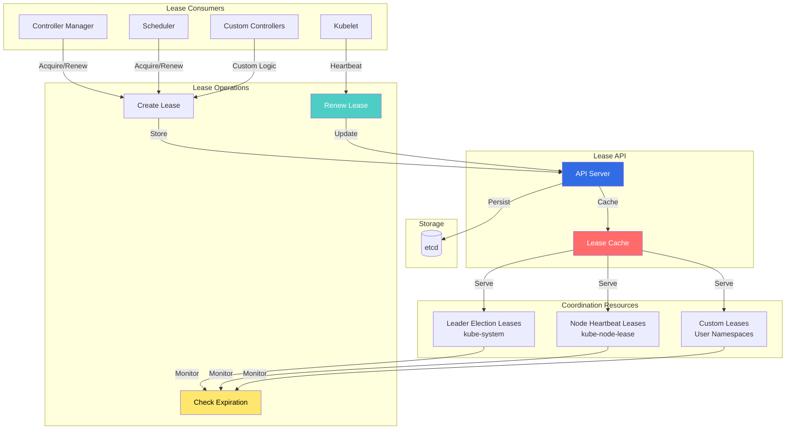
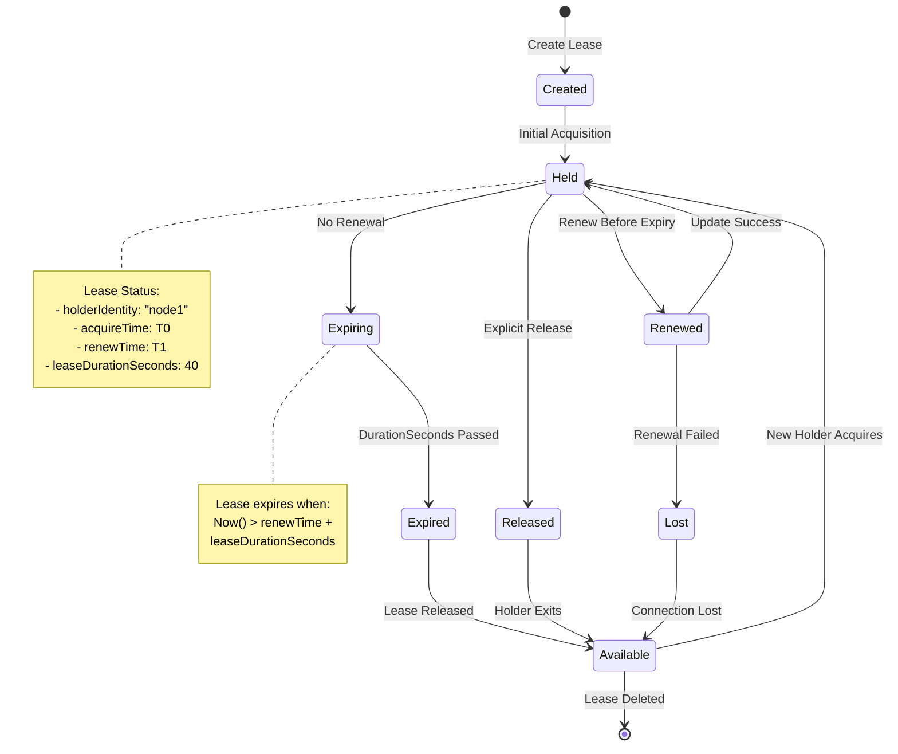

# Lease Controllers and Coordination

## Overview

The Lease Controllers manage `coordination.k8s.io/v1` Lease objects, which provide lightweight, efficient coordination mechanisms in Kubernetes. Leases are used for leader election, node heartbeats, and component liveness tracking with significantly lower overhead than ConfigMap or Endpoint-based approaches.

**Key Use Cases:**
- **Leader Election**: Controller manager and scheduler leader election
- **Node Heartbeats**: Kubelet node status updates
- **Component Liveness**: API server and other component health tracking
- **Custom Coordination**: User-defined coordination primitives

**Introduced in:** Kubernetes 1.14 (Beta), 1.17 (GA)
**KEP:** [KEP-1753: Node Heartbeat Improvement](https://github.com/kubernetes/enhancements/tree/master/keps/sig-node/1753-node-heartbeat-improvement)

## Architecture

### Lease System Overview



### Lease Lifecycle



## Lease Implementation

### Lease API Object

**File:** `staging/src/k8s.io/api/coordination/v1/types.go`

```go
// Lease defines a lease concept
type Lease struct {
    metav1.TypeMeta   `json:",inline"`
    metav1.ObjectMeta `json:"metadata,omitempty"`

    // Spec contains lease specification
    Spec LeaseSpec `json:"spec,omitempty"`
}

// LeaseSpec is specification of a Lease
type LeaseSpec struct {
    // HolderIdentity contains the identity of the holder
    HolderIdentity *string `json:"holderIdentity,omitempty"`

    // LeaseDurationSeconds is the duration in seconds
    LeaseDurationSeconds *int32 `json:"leaseDurationSeconds,omitempty"`

    // AcquireTime is when holder acquired the lease
    AcquireTime *metav1.MicroTime `json:"acquireTime,omitempty"`

    // RenewTime is when holder last renewed the lease
    RenewTime *metav1.MicroTime `json:"renewTime,omitempty"`

    // LeaseTransitions is the number of transitions
    LeaseTransitions *int32 `json:"leaseTransitions,omitempty"`
}
```

**Location:** `staging/src/k8s.io/api/coordination/v1/types.go:30-80`

### Leader Election with Leases

**File:** `staging/src/k8s.io/client-go/tools/leaderelection/leaderelection.go`

```go
// LeaderElector manages leader election using leases
type LeaderElector struct {
    config LeaderElectionConfig

    // observed holds the last observed record
    observedRecord rl.LeaderElectionRecord
    observedTime   time.Time

    // name is the name of the lease
    name string

    // metrics for observability
    metrics leaderMetrics
}

// LeaderElectionConfig configures leader election
type LeaderElectionConfig struct {
    // Lock is the resource lock
    Lock rl.Interface

    // LeaseDuration is the duration that non-leader candidates
    // will wait to force acquire leadership
    LeaseDuration time.Duration

    // RenewDeadline is the duration leader will retry
    // refreshing leadership before giving up
    RenewDeadline time.Duration

    // RetryPeriod is the duration clients should wait
    // between tries of actions
    RetryPeriod time.Duration

    // Callbacks are optional callbacks
    Callbacks LeaderCallbacks

    // Name is the name of the resource lock
    Name string
}

// LeaderCallbacks are callbacks for leader election
type LeaderCallbacks struct {
    // OnStartedLeading is called when node starts leading
    OnStartedLeading func(context.Context)

    // OnStoppedLeading is called when node stops leading
    OnStoppedLeading func()

    // OnNewLeader is called when a new leader is elected
    OnNewLeader func(identity string)
}

// Run starts the leader election loop
func (le *LeaderElector) Run(ctx context.Context) {
    defer func() {
        if le.config.Callbacks.OnStoppedLeading != nil {
            le.config.Callbacks.OnStoppedLeading()
        }
    }()

    if !le.acquire(ctx) {
        return
    }

    ctx, cancel := context.WithCancel(ctx)
    defer cancel()

    go le.config.Callbacks.OnStartedLeading(ctx)

    le.renew(ctx)
}

// acquire tries to acquire the lease
func (le *LeaderElector) acquire(ctx context.Context) bool {
    ctx, cancel := context.WithCancel(ctx)
    defer cancel()

    succeeded := false
    desc := le.config.Lock.Describe()

    klog.Infof("Attempting to acquire leader lease %v", desc)

    wait.JitterUntil(func() {
        succeeded = le.tryAcquireOrRenew(ctx)
        if !succeeded {
            klog.V(4).Infof("Failed to acquire lease %v", desc)
            return
        }

        le.config.Lock.RecordEvent("became leader")
        klog.Infof("Successfully acquired lease %v", desc)

        // Call new leader callback
        if le.config.Callbacks.OnNewLeader != nil {
            le.config.Callbacks.OnNewLeader(
                le.config.Lock.Identity(),
            )
        }

        cancel()
    }, le.config.RetryPeriod, JitterFactor, true, ctx.Done())

    return succeeded
}

// renew continuously renews the lease
func (le *LeaderElector) renew(ctx context.Context) {
    ctx, cancel := context.WithCancel(ctx)
    defer cancel()

    wait.Until(func() {
        timeoutCtx, timeoutCancel := context.WithTimeout(
            ctx,
            le.config.RenewDeadline,
        )
        defer timeoutCancel()

        err := wait.PollImmediateUntil(
            le.config.RetryPeriod,
            func() (bool, error) {
                return le.tryAcquireOrRenew(timeoutCtx), nil
            },
            timeoutCtx.Done(),
        )

        if err != nil {
            klog.Errorf("Failed to renew lease: %v", err)
            le.config.Lock.RecordEvent("stopped leading")
            cancel()
            return
        }

        klog.V(5).Infof("Successfully renewed lease")
    }, le.config.RetryPeriod, ctx.Done())
}

// tryAcquireOrRenew tries to acquire or renew the lease
func (le *LeaderElector) tryAcquireOrRenew(
    ctx context.Context,
) bool {
    now := metav1.NewTime(le.config.Clock.Now())

    // Get current lease record
    oldLeaderElectionRecord, _, err := le.config.Lock.Get(ctx)
    if err != nil {
        if !errors.IsNotFound(err) {
            klog.Errorf("Error getting lease: %v", err)
            return false
        }

        // Lease doesn't exist, create it
        return le.create(ctx, now)
    }

    // Check if we are the leader
    if !bytes.Equal(
        []byte(oldLeaderElectionRecord.HolderIdentity),
        []byte(le.config.Lock.Identity()),
    ) {
        // We are not the leader, check if lease expired
        if oldLeaderElectionRecord.RenewTime.Add(
            le.config.LeaseDuration,
        ).After(now.Time) {
            // Lease still valid
            klog.V(4).Infof(
                "Lock held by %v, not yet expired",
                oldLeaderElectionRecord.HolderIdentity,
            )
            return false
        }

        // Lease expired, we can take it
        klog.Infof(
            "Lock held by %v expired, acquiring",
            oldLeaderElectionRecord.HolderIdentity,
        )
    }

    // We are leader or lease expired, update it
    return le.update(ctx, oldLeaderElectionRecord, now)
}

// create creates a new lease
func (le *LeaderElector) create(
    ctx context.Context,
    now metav1.Time,
) bool {
    leaderElectionRecord := rl.LeaderElectionRecord{
        HolderIdentity:       le.config.Lock.Identity(),
        LeaseDurationSeconds: int(le.config.LeaseDuration.Seconds()),
        AcquireTime:          now,
        RenewTime:            now,
        LeaderTransitions:    0,
    }

    err := le.config.Lock.Create(ctx, leaderElectionRecord)
    if err != nil {
        klog.Errorf("Error creating lease: %v", err)
        return false
    }

    le.observedRecord = leaderElectionRecord
    le.observedTime = now.Time

    return true
}

// update updates an existing lease
func (le *LeaderElector) update(
    ctx context.Context,
    oldRecord rl.LeaderElectionRecord,
    now metav1.Time,
) bool {
    leaderElectionRecord := rl.LeaderElectionRecord{
        HolderIdentity:       le.config.Lock.Identity(),
        LeaseDurationSeconds: int(le.config.LeaseDuration.Seconds()),
        RenewTime:            now,
        AcquireTime:          oldRecord.AcquireTime,
        LeaderTransitions:    oldRecord.LeaderTransitions,
    }

    // Increment transitions if leader changed
    if oldRecord.HolderIdentity != le.config.Lock.Identity() {
        leaderElectionRecord.LeaderTransitions++
        leaderElectionRecord.AcquireTime = now
    }

    err := le.config.Lock.Update(ctx, leaderElectionRecord)
    if err != nil {
        klog.Errorf("Error updating lease: %v", err)
        return false
    }

    le.observedRecord = leaderElectionRecord
    le.observedTime = now.Time

    return true
}
```

**Location:** `staging/src/k8s.io/client-go/tools/leaderelection/leaderelection.go:50-400`

### Lease Resource Lock

**File:** `staging/src/k8s.io/client-go/tools/leaderelection/resourcelock/leaselock.go`

```go
// LeaseLock implements lock using Lease resource
type LeaseLock struct {
    // LeaseMeta contains lease metadata
    LeaseMeta  metav1.ObjectMeta
    Client     coordinationv1client.LeasesGetter
    LockConfig ResourceLockConfig
    lease      *coordinationv1.Lease
}

// Get returns the lease record
func (ll *LeaseLock) Get(ctx context.Context) (
    *LeaderElectionRecord,
    []byte,
    error,
) {
    lease, err := ll.Client.Leases(ll.LeaseMeta.Namespace).
        Get(ctx, ll.LeaseMeta.Name, metav1.GetOptions{})
    if err != nil {
        return nil, nil, err
    }

    ll.lease = lease
    record := LeaseSpecToLeaderElectionRecord(&lease.Spec)

    recordByte, err := json.Marshal(record)
    if err != nil {
        return nil, nil, err
    }

    return record, recordByte, nil
}

// Create creates a lease
func (ll *LeaseLock) Create(
    ctx context.Context,
    ler LeaderElectionRecord,
) error {
    lease := &coordinationv1.Lease{
        ObjectMeta: metav1.ObjectMeta{
            Name:      ll.LeaseMeta.Name,
            Namespace: ll.LeaseMeta.Namespace,
        },
        Spec: LeaderElectionRecordToLeaseSpec(&ler),
    }

    _, err := ll.Client.Leases(ll.LeaseMeta.Namespace).
        Create(ctx, lease, metav1.CreateOptions{})
    return err
}

// Update updates the lease
func (ll *LeaseLock) Update(
    ctx context.Context,
    ler LeaderElectionRecord,
) error {
    if ll.lease == nil {
        return errors.New("lease not initialized")
    }

    lease := ll.lease.DeepCopy()
    lease.Spec = LeaderElectionRecordToLeaseSpec(&ler)

    _, err := ll.Client.Leases(ll.LeaseMeta.Namespace).
        Update(ctx, lease, metav1.UpdateOptions{})
    return err
}

// Identity returns the holder identity
func (ll *LeaseLock) Identity() string {
    return ll.LockConfig.Identity
}

// Describe returns description of the lock
func (ll *LeaseLock) Describe() string {
    return fmt.Sprintf(
        "%v/%v",
        ll.LeaseMeta.Namespace,
        ll.LeaseMeta.Name,
    )
}

// LeaderElectionRecordToLeaseSpec converts record to spec
func LeaderElectionRecordToLeaseSpec(
    ler *LeaderElectionRecord,
) coordinationv1.LeaseSpec {
    leaseDurationSeconds := int32(ler.LeaseDurationSeconds)
    leaseTransitions := int32(ler.LeaderTransitions)

    return coordinationv1.LeaseSpec{
        HolderIdentity:       &ler.HolderIdentity,
        LeaseDurationSeconds: &leaseDurationSeconds,
        AcquireTime:          &ler.AcquireTime,
        RenewTime:            &ler.RenewTime,
        LeaseTransitions:     &leaseTransitions,
    }
}

// LeaseSpecToLeaderElectionRecord converts spec to record
func LeaseSpecToLeaderElectionRecord(
    spec *coordinationv1.LeaseSpec,
) *LeaderElectionRecord {
    var holderIdentity string
    if spec.HolderIdentity != nil {
        holderIdentity = *spec.HolderIdentity
    }

    var leaseDurationSeconds int
    if spec.LeaseDurationSeconds != nil {
        leaseDurationSeconds = int(*spec.LeaseDurationSeconds)
    }

    var leaderTransitions int
    if spec.LeaseTransitions != nil {
        leaderTransitions = int(*spec.LeaseTransitions)
    }

    return &LeaderElectionRecord{
        HolderIdentity:       holderIdentity,
        LeaseDurationSeconds: leaseDurationSeconds,
        AcquireTime:          *spec.AcquireTime,
        RenewTime:            *spec.RenewTime,
        LeaderTransitions:    leaderTransitions,
    }
}
```

**Location:** `staging/src/k8s.io/client-go/tools/leaderelection/resourcelock/leaselock.go:30-200`

## Node Heartbeat Leases

### Kubelet Lease Management

**File:** `pkg/kubelet/nodelease/controller.go`

```go
// Controller manages node heartbeat leases
type Controller struct {
    client                     clientset.Interface
    leaseClient                coordclientset.LeaseInterface
    holderIdentity             string
    leaseDurationSeconds       int32
    renewInterval              time.Duration
    latestLease                *coordv1.Lease
    clock                      clock.Clock
}

// NewController creates a new node lease controller
func NewController(
    client clientset.Interface,
    holderIdentity string,
    leaseDurationSeconds int32,
) *Controller {
    return &Controller{
        client:               client,
        leaseClient:          client.CoordinationV1().Leases(v1.NamespaceNodeLease),
        holderIdentity:       holderIdentity,
        leaseDurationSeconds: leaseDurationSeconds,
        renewInterval:        time.Duration(leaseDurationSeconds) * time.Second / 4,
        clock:                clock.RealClock{},
    }
}

// Run starts the controller loop
func (c *Controller) Run(stopCh <-chan struct{}) {
    wait.Until(c.sync, c.renewInterval, stopCh)
}

// sync ensures the lease exists and is up-to-date
func (c *Controller) sync() {
    lease, created := c.backoffEnsureLease()
    if lease == nil {
        klog.Errorf("Failed to ensure lease exists")
        return
    }

    // Update lease if created or outdated
    if created || c.shouldUpdate(lease) {
        c.retryUpdateLease(lease)
    }
}

// backoffEnsureLease ensures lease exists with backoff
func (c *Controller) backoffEnsureLease() (*coordv1.Lease, bool) {
    var (
        lease   *coordv1.Lease
        created bool
        err     error
    )

    backoff := wait.Backoff{
        Duration: 100 * time.Millisecond,
        Factor:   2.0,
        Steps:    5,
    }

    err = wait.ExponentialBackoff(backoff, func() (bool, error) {
        lease, created, err = c.ensureLease()
        if err != nil {
            klog.ErrorS(err, "Failed to ensure lease exists")
            return false, nil
        }
        return true, nil
    })

    if err != nil {
        return nil, false
    }

    return lease, created
}

// ensureLease creates lease if it doesn't exist
func (c *Controller) ensureLease() (*coordv1.Lease, bool, error) {
    lease, err := c.leaseClient.Get(
        context.TODO(),
        c.holderIdentity,
        metav1.GetOptions{},
    )

    if err == nil {
        return lease, false, nil
    }

    if !apierrors.IsNotFound(err) {
        return nil, false, err
    }

    // Create new lease
    lease, err = c.leaseClient.Create(
        context.TODO(),
        c.newLease(nil),
        metav1.CreateOptions{},
    )
    if err != nil {
        return nil, false, err
    }

    return lease, true, nil
}

// shouldUpdate checks if lease should be updated
func (c *Controller) shouldUpdate(lease *coordv1.Lease) bool {
    // Update if renew time is old
    if lease.Spec.RenewTime == nil {
        return true
    }

    renewTime := lease.Spec.RenewTime.Time
    grace := time.Duration(c.leaseDurationSeconds) * time.Second / 4

    return c.clock.Now().After(renewTime.Add(grace))
}

// retryUpdateLease updates lease with retries
func (c *Controller) retryUpdateLease(base *coordv1.Lease) {
    backoff := wait.Backoff{
        Duration: 100 * time.Millisecond,
        Factor:   2.0,
        Steps:    5,
    }

    wait.ExponentialBackoff(backoff, func() (bool, error) {
        lease := c.newLease(base)
        updated, err := c.leaseClient.Update(
            context.TODO(),
            lease,
            metav1.UpdateOptions{},
        )

        if err == nil {
            c.latestLease = updated
            return true, nil
        }

        klog.ErrorS(err, "Failed to update lease")

        // Get latest version and retry
        base, _ = c.leaseClient.Get(
            context.TODO(),
            c.holderIdentity,
            metav1.GetOptions{},
        )

        return false, nil
    })
}

// newLease creates a new lease object
func (c *Controller) newLease(base *coordv1.Lease) *coordv1.Lease {
    lease := &coordv1.Lease{
        ObjectMeta: metav1.ObjectMeta{
            Name:      c.holderIdentity,
            Namespace: v1.NamespaceNodeLease,
        },
        Spec: coordv1.LeaseSpec{
            HolderIdentity:       &c.holderIdentity,
            LeaseDurationSeconds: &c.leaseDurationSeconds,
            RenewTime:            &metav1.MicroTime{Time: c.clock.Now()},
        },
    }

    // Copy fields from base if provided
    if base != nil {
        lease.OwnerReferences = base.OwnerReferences
        lease.ResourceVersion = base.ResourceVersion
        lease.Spec.AcquireTime = base.Spec.AcquireTime
        lease.Spec.LeaseTransitions = base.Spec.LeaseTransitions
    } else {
        lease.Spec.AcquireTime = &metav1.MicroTime{Time: c.clock.Now()}
        zero := int32(0)
        lease.Spec.LeaseTransitions = &zero
    }

    return lease
}
```

**Location:** `pkg/kubelet/nodelease/controller.go:40-300`

## Configuration Examples

### Leader Election Lease

```yaml
# Controller Manager leader election lease
apiVersion: coordination.k8s.io/v1
kind: Lease
metadata:
  name: kube-controller-manager
  namespace: kube-system
spec:
  holderIdentity: "kube-controller-manager-node1_abc-123"
  leaseDurationSeconds: 15
  acquireTime: "2025-10-21T10:00:00.000000Z"
  renewTime: "2025-10-21T10:05:30.123456Z"
  leaseTransitions: 3
```

### Node Heartbeat Lease

```yaml
# Node heartbeat lease
apiVersion: coordination.k8s.io/v1
kind: Lease
metadata:
  name: node1
  namespace: kube-node-lease
  ownerReferences:
  - apiVersion: v1
    kind: Node
    name: node1
    uid: node-uid-123
spec:
  holderIdentity: "node1"
  leaseDurationSeconds: 40
  acquireTime: "2025-10-21T09:00:00.000000Z"
  renewTime: "2025-10-21T10:05:45.678901Z"
  leaseTransitions: 0
```

### Custom Coordination Lease

```yaml
# Custom application coordination
apiVersion: coordination.k8s.io/v1
kind: Lease
metadata:
  name: my-app-leader
  namespace: default
spec:
  holderIdentity: "my-app-pod-abc123"
  leaseDurationSeconds: 30
  acquireTime: "2025-10-21T10:00:00.000000Z"
  renewTime: "2025-10-21T10:05:20.000000Z"
  leaseTransitions: 1
```

### Leader Election Code Example

```go
// Setting up leader election with leases
import (
    "context"
    "time"

    metav1 "k8s.io/apimachinery/pkg/apis/meta/v1"
    "k8s.io/client-go/kubernetes"
    "k8s.io/client-go/tools/leaderelection"
    "k8s.io/client-go/tools/leaderelection/resourcelock"
)

func runWithLeaderElection(
    ctx context.Context,
    client kubernetes.Interface,
    id string,
) error {
    // Create lease lock
    lock := &resourcelock.LeaseLock{
        LeaseMeta: metav1.ObjectMeta{
            Name:      "my-controller",
            Namespace: "kube-system",
        },
        Client: client.CoordinationV1(),
        LockConfig: resourcelock.ResourceLockConfig{
            Identity: id,
        },
    }

    // Configure leader election
    leaderelection.RunOrDie(ctx, leaderelection.LeaderElectionConfig{
        Lock:          lock,
        LeaseDuration: 15 * time.Second,
        RenewDeadline: 10 * time.Second,
        RetryPeriod:   2 * time.Second,
        Callbacks: leaderelection.LeaderCallbacks{
            OnStartedLeading: func(ctx context.Context) {
                // Run controller logic
                run(ctx)
            },
            OnStoppedLeading: func() {
                // Cleanup
                klog.Info("Lost leadership")
            },
            OnNewLeader: func(identity string) {
                klog.Infof("New leader elected: %s", identity)
            },
        },
    })

    return nil
}
```

## Monitoring and Metrics

### Lease Metrics

```yaml
# Leader election metrics
leader_election_master_status{name="kube-controller-manager"}
leader_election_leader_on{name="kube-controller-manager"}
leader_election_slowpath_exercised_total{name="kube-controller-manager"}

# Lease API metrics
apiserver_requested_deprecated_apis{resource="leases"}
etcd_object_counts{resource="leases.coordination.k8s.io"}

# Node lease metrics (custom)
node_lease_renew_duration_seconds
node_lease_renew_errors_total
```

### Prometheus Queries

```promql
# Current leader
leader_election_master_status == 1

# Leader transitions
rate(leader_election_slowpath_exercised_total[5m])

# Lease count by namespace
count(kube_lease_info) by (namespace)

# Node leases not renewed (stale nodes)
time() - kube_lease_renew_time > 120
```

## Troubleshooting Guide

### Common Issues

#### Issue 1: Split Brain (Multiple Leaders)

**Symptoms:**
- Multiple instances think they are leader
- Conflicting operations
- Data corruption

**Diagnosis:**
```bash
# Check lease
kubectl get lease -n kube-system kube-controller-manager -o yaml

# Check who thinks they're leader
kubectl logs -n kube-system -l component=kube-controller-manager | \
  grep -i "became leader"
```

**Common Causes:**
1. Clock skew
2. Network partition
3. API server issues

**Resolution:**
```bash
# Verify system clocks synchronized
chronyc tracking

# Check network connectivity
# Restart non-leader instances
kubectl delete pod -n kube-system kube-controller-manager-node2
```

#### Issue 2: No Leader Elected

**Symptoms:**
- Controllers not running
- No active leader
- Lease exists but no holder

**Diagnosis:**
```bash
# Check lease status
kubectl get lease -n kube-system kube-controller-manager -o yaml

# Check logs
kubectl logs -n kube-system kube-controller-manager-xxx | \
  grep -i "leader"
```

**Resolution:**
```bash
# Delete stale lease
kubectl delete lease -n kube-system kube-controller-manager

# Restart controller manager
kubectl delete pod -n kube-system kube-controller-manager-xxx
```

### Debug Commands

```bash
# List all leases
kubectl get leases -A

# Check leader election leases
kubectl get leases -n kube-system

# Check node heartbeat leases
kubectl get leases -n kube-node-lease

# Get lease details
kubectl get lease -n kube-system kube-controller-manager -o yaml

# Watch lease updates
kubectl get lease -n kube-system kube-controller-manager -w

# Check lease age
kubectl get leases -A -o jsonpath='{range .items[*]}{.metadata.name}{"\t"}{.spec.renewTime}{"\n"}{end}'
```

## Best Practices

1. **Use Appropriate Lease Duration**
   - Leader election: 15-30 seconds
   - Node heartbeats: 40 seconds
   - Custom: Based on requirement

2. **Set Proper Renew/Retry Periods**
   ```go
   LeaseDuration: 15 * time.Second,
   RenewDeadline: 10 * time.Second,
   RetryPeriod:   2 * time.Second,
   ```

3. **Monitor Lease Health**
   - Alert on stale leases
   - Track leader transitions
   - Monitor renew failures

4. **Handle Leadership Loss Gracefully**
   - Clean up resources
   - Stop ongoing operations
   - Don't assume always leader

## Performance Considerations

### Lease vs. ConfigMap/Endpoints

**Lease Advantages:**
- **Lower overhead**: Smaller objects
- **Better caching**: Dedicated namespace
- **Optimized**: Purpose-built for coordination

**Performance Impact:**
- Node leases: ~1 UPDATE/40s per node
- Leader election: ~1 UPDATE/10s
- Minimal etcd impact

## Related Components

- **Leader Election**: `k8s.io/client-go/tools/leaderelection`
- **Resource Lock**: `k8s.io/client-go/tools/leaderelection/resourcelock`
- **Node Lease**: `pkg/kubelet/nodelease`
- **API Server**: Lease storage and caching

## References

- **KEP-1753**: [Node Heartbeat Improvement](https://github.com/kubernetes/enhancements/tree/master/keps/sig-node/1753-node-heartbeat-improvement)
- **KEP-2009**: [Lease Improvements](https://github.com/kubernetes/enhancements/tree/master/keps/sig-api-machinery/2009-coordinated-leader-election)
- **API Reference**: [Lease v1](https://kubernetes.io/docs/reference/kubernetes-api/cluster-resources/lease-v1/)
- **Source Code**: `staging/src/k8s.io/api/coordination/v1/`
- **Leader Election**: `staging/src/k8s.io/client-go/tools/leaderelection/`
