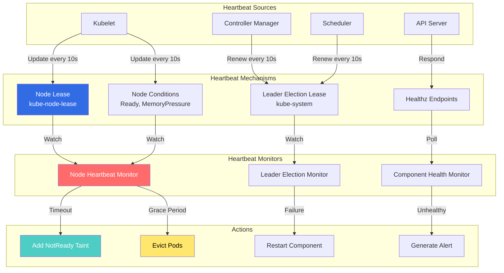
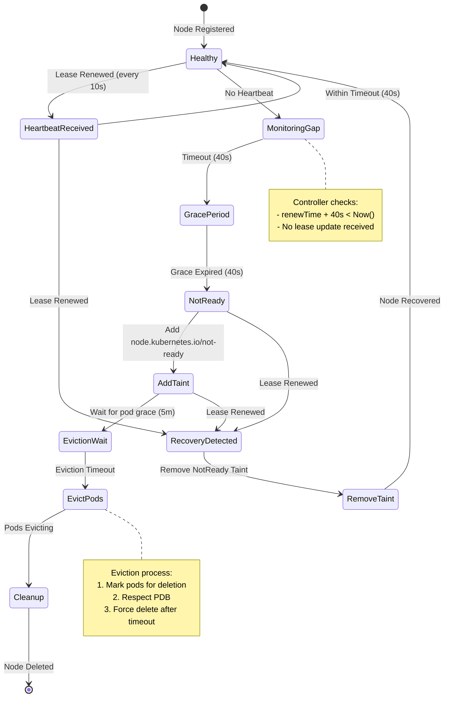

# Heartbeat Controllers

## Overview

Heartbeat Controllers ensure continuous health monitoring and liveness tracking of Kubernetes components and nodes. These controllers use various mechanisms (leases, conditions, timestamps) to detect failures, trigger remediation, and maintain cluster health.

**Key Components:**
- **Node Heartbeat Controller**: Monitors node liveness via leases
- **Controller Manager Heartbeat**: Leader election and health tracking
- **Component Health Monitors**: Tracks API server, etcd, scheduler health
- **Timeout Watchers**: Detects stale heartbeats and triggers actions

**Primary Functions:**
- Detect node failures
- Trigger pod eviction on unhealthy nodes
- Maintain leader election
- Monitor component health

## Architecture

### Heartbeat System Overview



### Node Heartbeat Flow



## Node Heartbeat Implementation

### Node Lifecycle Controller (Heartbeat Monitoring)

**File:** `pkg/controller/nodelifecycle/node_lifecycle_controller.go`

```go
// Controller monitors node heartbeats and manages taints
type Controller struct {
    taintManager *scheduler.NoExecuteTaintManager

    // Lease client for node heartbeats
    leaseInformer coordlisters.LeaseLister
    leaseSynced   cache.InformerSynced

    // Node informer
    nodeInformer coreinformers.NodeInformer
    nodeLister   corelisters.NodeLister

    // Monitoring configuration
    nodeMonitorPeriod       time.Duration
    nodeMonitorGracePeriod  time.Duration
    evictionLimiterQPS      float32
    podEvictionTimeout      time.Duration

    // Rate limiters
    evictionLimiterBurst int
}

// NewNodeLifecycleController creates a new controller
func NewNodeLifecycleController(
    leaseInformer coordinformers.LeaseInformer,
    nodeInformer coreinformers.NodeInformer,
    monitorPeriod time.Duration,
    gracePeriod time.Duration,
    evictionTimeout time.Duration,
) *Controller {
    nc := &Controller{
        leaseInformer:          leaseInformer.Lister(),
        leaseSynced:            leaseInformer.Informer().HasSynced,
        nodeInformer:           nodeInformer,
        nodeLister:             nodeInformer.Lister(),
        nodeMonitorPeriod:      monitorPeriod,
        nodeMonitorGracePeriod: gracePeriod,
        podEvictionTimeout:     evictionTimeout,
    }

    return nc
}

// Run starts the controller
func (nc *Controller) Run(ctx context.Context) {
    defer utilruntime.HandleCrash()

    // Wait for caches to sync
    if !cache.WaitForNamedCacheSync(
        "node_lifecycle_controller",
        ctx.Done(),
        nc.leaseSynced,
    ) {
        return
    }

    // Start monitoring loop
    go wait.UntilWithContext(
        ctx,
        nc.monitorNodeHealth,
        nc.nodeMonitorPeriod,
    )

    <-ctx.Done()
}

// monitorNodeHealth checks node heartbeats
func (nc *Controller) monitorNodeHealth(ctx context.Context) {
    nodes, err := nc.nodeLister.List(labels.Everything())
    if err != nil {
        klog.Errorf("Error listing nodes: %v", err)
        return
    }

    now := nc.now()

    for _, node := range nodes {
        // Check node heartbeat via lease
        if !nc.isNodeHealthy(node, now) {
            nc.handleUnhealthyNode(ctx, node, now)
        } else {
            nc.handleHealthyNode(ctx, node)
        }
    }
}

// isNodeHealthy checks if node heartbeat is current
func (nc *Controller) isNodeHealthy(
    node *v1.Node,
    now time.Time,
) bool {
    // Get node lease
    lease, err := nc.leaseInformer.Leases(v1.NamespaceNodeLease).
        Get(node.Name)
    if err != nil {
        klog.V(4).Infof(
            "Failed to get lease for node %s: %v",
            node.Name,
            err,
        )
        // Fall back to node conditions
        return nc.isNodeReadyByCondition(node, now)
    }

    // Check lease renew time
    if lease.Spec.RenewTime == nil {
        return false
    }

    renewTime := lease.Spec.RenewTime.Time
    leaseDuration := time.Duration(
        *lease.Spec.LeaseDurationSeconds,
    ) * time.Second

    // Node is healthy if lease was renewed recently
    return now.Before(renewTime.Add(leaseDuration))
}

// isNodeReadyByCondition checks node Ready condition
func (nc *Controller) isNodeReadyByCondition(
    node *v1.Node,
    now time.Time,
) bool {
    for _, condition := range node.Status.Conditions {
        if condition.Type != v1.NodeReady {
            continue
        }

        // Check if condition is recent
        lastTransition := condition.LastHeartbeatTime.Time
        if now.After(lastTransition.Add(nc.nodeMonitorGracePeriod)) {
            return false
        }

        return condition.Status == v1.ConditionTrue
    }

    return false
}

// handleUnhealthyNode processes an unhealthy node
func (nc *Controller) handleUnhealthyNode(
    ctx context.Context,
    node *v1.Node,
    now time.Time,
) {
    klog.V(2).Infof("Node %s is unhealthy", node.Name)

    // Add NotReady taint
    if err := nc.addNotReadyTaint(ctx, node); err != nil {
        klog.Errorf(
            "Failed to add NotReady taint to node %s: %v",
            node.Name,
            err,
        )
        return
    }

    // Check if eviction timeout reached
    notReadySince := nc.getNotReadyTime(node)
    if now.After(notReadySince.Add(nc.podEvictionTimeout)) {
        // Trigger pod eviction
        nc.evictPodsFromNode(ctx, node)
    }
}

// handleHealthyNode processes a healthy node
func (nc *Controller) handleHealthyNode(
    ctx context.Context,
    node *v1.Node,
) {
    // Remove NotReady taint if present
    nc.removeNotReadyTaint(ctx, node)
}

// addNotReadyTaint adds NotReady taint to node
func (nc *Controller) addNotReadyTaint(
    ctx context.Context,
    node *v1.Node,
) error {
    taint := &v1.Taint{
        Key:    v1.TaintNodeNotReady,
        Effect: v1.TaintEffectNoExecute,
    }

    // Check if taint already exists
    for _, t := range node.Spec.Taints {
        if t.Key == taint.Key && t.Effect == taint.Effect {
            return nil
        }
    }

    // Add taint
    node = node.DeepCopy()
    node.Spec.Taints = append(node.Spec.Taints, *taint)

    _, err := nc.kubeClient.CoreV1().Nodes().Update(
        ctx,
        node,
        metav1.UpdateOptions{},
    )

    return err
}

// removeNotReadyTaint removes NotReady taint from node
func (nc *Controller) removeNotReadyTaint(
    ctx context.Context,
    node *v1.Node,
) error {
    var newTaints []v1.Taint
    removed := false

    for _, taint := range node.Spec.Taints {
        if taint.Key == v1.TaintNodeNotReady &&
           taint.Effect == v1.TaintEffectNoExecute {
            removed = true
            continue
        }
        newTaints = append(newTaints, taint)
    }

    if !removed {
        return nil
    }

    // Update node
    node = node.DeepCopy()
    node.Spec.Taints = newTaints

    _, err := nc.kubeClient.CoreV1().Nodes().Update(
        ctx,
        node,
        metav1.UpdateOptions{},
    )

    return err
}

// evictPodsFromNode triggers pod eviction
func (nc *Controller) evictPodsFromNode(
    ctx context.Context,
    node *v1.Node,
) {
    klog.V(2).Infof("Evicting pods from node %s", node.Name)

    // Handled by taint manager
    // Pods with NoExecute toleration will be evicted
    // Respects PodDisruptionBudget
}

// getNotReadyTime returns when node became NotReady
func (nc *Controller) getNotReadyTime(node *v1.Node) time.Time {
    for _, condition := range node.Status.Conditions {
        if condition.Type == v1.NodeReady {
            if condition.Status != v1.ConditionTrue {
                return condition.LastTransitionTime.Time
            }
        }
    }
    return nc.now()
}

// now returns current time (mockable for testing)
func (nc *Controller) now() time.Time {
    return time.Now()
}
```

**Location:** `pkg/controller/nodelifecycle/node_lifecycle_controller.go:100-500`

### Kubelet Node Lease Update

**File:** `pkg/kubelet/kubelet_node_status.go`

```go
// updateNodeStatus updates node status and lease
func (kl *Kubelet) updateNodeStatus(ctx context.Context) error {
    // Update node lease (heartbeat)
    if kl.nodeLeaseController != nil {
        if err := kl.nodeLeaseController.Sync(); err != nil {
            klog.ErrorS(err, "Failed to sync node lease")
        }
    }

    // Update node conditions
    node, err := kl.getNode()
    if err != nil {
        return err
    }

    // Set node conditions
    kl.setNodeStatus(node)

    // Update node
    _, err = kl.kubeClient.CoreV1().Nodes().UpdateStatus(
        ctx,
        node,
        metav1.UpdateOptions{},
    )

    return err
}

// setNodeStatus sets node status conditions
func (kl *Kubelet) setNodeStatus(node *v1.Node) {
    // Set Ready condition
    readyCondition := kl.getNodeReadyCondition()
    conditions := node.Status.Conditions

    // Update or append Ready condition
    updated := false
    for i := range conditions {
        if conditions[i].Type == v1.NodeReady {
            conditions[i] = readyCondition
            updated = true
            break
        }
    }

    if !updated {
        conditions = append(conditions, readyCondition)
    }

    node.Status.Conditions = conditions
}

// getNodeReadyCondition returns node Ready condition
func (kl *Kubelet) getNodeReadyCondition() v1.NodeCondition {
    // Check runtime status
    runtimeReady := kl.containerRuntime.Status() == nil

    // Check network status
    networkReady := kl.networkPlugin.Status() == nil

    // Determine condition
    ready := v1.ConditionTrue
    reason := "KubeletReady"
    message := "kubelet is posting ready status"

    if !runtimeReady {
        ready = v1.ConditionFalse
        reason = "ContainerRuntimeNotReady"
        message = "container runtime is not ready"
    } else if !networkReady {
        ready = v1.ConditionFalse
        reason = "NetworkPluginNotReady"
        message = "network plugin is not ready"
    }

    return v1.NodeCondition{
        Type:               v1.NodeReady,
        Status:             ready,
        Reason:             reason,
        Message:            message,
        LastHeartbeatTime:  metav1.Now(),
        LastTransitionTime: metav1.Now(),
    }
}
```

**Location:** `pkg/kubelet/kubelet_node_status.go:100-250`

## Component Heartbeat Monitoring

### Health Check Monitoring

```go
// Health check monitor for components
type HealthChecker struct {
    checks map[string]HealthCheck
    mu     sync.RWMutex
}

// HealthCheck represents a component health check
type HealthCheck struct {
    Name         string
    CheckFunc    func() error
    LastCheck    time.Time
    LastSuccess  time.Time
    Consecutive  int
    MaxFailures  int
}

// RunHealthChecks continuously monitors component health
func (hc *HealthChecker) RunHealthChecks(ctx context.Context) {
    ticker := time.NewTicker(10 * time.Second)
    defer ticker.Stop()

    for {
        select {
        case <-ctx.Done():
            return
        case <-ticker.C:
            hc.checkAll()
        }
    }
}

// checkAll runs all health checks
func (hc *HealthChecker) checkAll() {
    hc.mu.Lock()
    defer hc.mu.Unlock()

    for name, check := range hc.checks {
        err := check.CheckFunc()
        check.LastCheck = time.Now()

        if err == nil {
            check.LastSuccess = time.Now()
            check.Consecutive = 0
        } else {
            check.Consecutive++

            if check.Consecutive >= check.MaxFailures {
                klog.Errorf(
                    "Component %s failed %d consecutive checks",
                    name,
                    check.Consecutive,
                )
                // Trigger alert or remediation
            }
        }

        hc.checks[name] = check
    }
}
```

## Configuration Examples

### Node Heartbeat Configuration

```yaml
# Kubelet configuration
apiVersion: kubelet.config.k8s.io/v1beta1
kind: KubeletConfiguration

# Node status update frequency
nodeStatusUpdateFrequency: 10s

# Node lease configuration (default values)
# Lease duration: 40s
# Renew interval: 10s (leaseDuration / 4)
```

### Controller Manager Heartbeat Configuration

```yaml
# Controller manager flags
apiVersion: v1
kind: Pod
metadata:
  name: kube-controller-manager
  namespace: kube-system
spec:
  containers:
  - name: kube-controller-manager
    command:
    - kube-controller-manager

    # Node monitoring
    - --node-monitor-period=5s
    - --node-monitor-grace-period=40s

    # Pod eviction
    - --pod-eviction-timeout=5m

    # Leader election (heartbeat)
    - --leader-elect=true
    - --leader-elect-lease-duration=15s
    - --leader-elect-renew-deadline=10s
    - --leader-elect-retry-period=2s
```

### Node Conditions and Taints

```yaml
# Node with heartbeat information
apiVersion: v1
kind: Node
metadata:
  name: node1
spec:
  # Taints applied when unhealthy
  taints:
  - key: node.kubernetes.io/not-ready
    effect: NoExecute
  - key: node.kubernetes.io/unreachable
    effect: NoExecute

status:
  # Conditions updated by kubelet
  conditions:
  - type: Ready
    status: "True"
    reason: KubeletReady
    message: kubelet is posting ready status
    lastHeartbeatTime: "2025-10-21T10:05:45Z"
    lastTransitionTime: "2025-10-21T09:00:00Z"

  - type: MemoryPressure
    status: "False"
    reason: KubeletHasSufficientMemory
    lastHeartbeatTime: "2025-10-21T10:05:45Z"

  - type: DiskPressure
    status: "False"
    reason: KubeletHasNoDiskPressure
    lastHeartbeatTime: "2025-10-21T10:05:45Z"

  - type: PIDPressure
    status: "False"
    reason: KubeletHasSufficientPID
    lastHeartbeatTime: "2025-10-21T10:05:45Z"
```

## Monitoring and Metrics

### Heartbeat Metrics

```yaml
# Node lease metrics
node_lease_renew_duration_seconds
node_lease_renew_errors_total
node_lease_last_renew_timestamp

# Node condition metrics
kube_node_status_condition{condition="Ready",status="true"}
kube_node_status_condition{condition="MemoryPressure",status="false"}

# Controller heartbeat
leader_election_master_status
apiserver_storage_objects{resource="leases.coordination.k8s.io"}
```

### Prometheus Queries

```promql
# Nodes not ready
kube_node_status_condition{condition="Ready",status!="true"}

# Nodes with stale leases (>60s)
time() - node_lease_last_renew_timestamp > 60

# Leader election status
leader_election_master_status == 0

# Heartbeat error rate
rate(node_lease_renew_errors_total[5m])
```

### Alert Rules

```yaml
groups:
- name: heartbeat_alerts
  rules:
  # Node heartbeat stopped
  - alert: NodeHeartbeatStopped
    expr: |
      time() - node_lease_last_renew_timestamp > 120
    for: 5m
    labels:
      severity: critical
    annotations:
      summary: "Node {{ $labels.node }} heartbeat stopped"
      description: |
        Node {{ $labels.node }} has not renewed lease
        for over 2 minutes

  # Node not ready
  - alert: NodeNotReady
    expr: |
      kube_node_status_condition{condition="Ready",status="true"} == 0
    for: 5m
    labels:
      severity: warning
    annotations:
      summary: "Node {{ $labels.node }} not ready"

  # Leader election failed
  - alert: LeaderElectionFailed
    expr: |
      leader_election_master_status == 0
    for: 2m
    labels:
      severity: critical
    annotations:
      summary: "Component {{ $labels.name }} not leader"
```

## Troubleshooting Guide

### Common Issues

#### Issue 1: Node Heartbeat Timeout

**Symptoms:**
- Node marked NotReady
- Pods evicted from node
- Node lease not updated

**Diagnosis:**
```bash
# Check node status
kubectl get node node1 -o yaml

# Check node lease
kubectl get lease -n kube-node-lease node1 -o yaml

# Check kubelet logs
journalctl -u kubelet -n 100

# Check kubelet heartbeat errors
journalctl -u kubelet | grep -i "lease\|heartbeat"
```

**Common Causes:**
1. Kubelet crashed/stopped
2. API server unreachable
3. Network issues
4. High system load

**Resolution:**
```bash
# Restart kubelet
systemctl restart kubelet

# Check connectivity to API server
curl -k https://api-server:6443/healthz

# Check system resources
top
df -h
```

#### Issue 2: Premature Node NotReady

**Symptoms:**
- Node marked NotReady despite being healthy
- Temporary network blips cause eviction
- False positives

**Diagnosis:**
```bash
# Check grace period
kubectl get pod -n kube-system kube-controller-manager-xxx \
  -o jsonpath='{.spec.containers[0].command}' | \
  grep node-monitor-grace-period

# Check lease timing
kubectl get lease -n kube-node-lease node1 \
  -o jsonpath='{.spec.renewTime}'

# Compare with current time
date -u +"%Y-%m-%dT%H:%M:%SZ"
```

**Resolution:**
```bash
# Increase grace period (controller manager)
--node-monitor-grace-period=60s

# Increase lease duration (kubelet)
--node-lease-duration-seconds=60
```

### Debug Commands

```bash
# Get all node leases
kubectl get leases -n kube-node-lease

# Check lease renewal time
kubectl get lease -n kube-node-lease node1 \
  -o jsonpath='{.spec.renewTime}{"\n"}'

# Calculate lease age
RENEW=$(kubectl get lease -n kube-node-lease node1 -o jsonpath='{.spec.renewTime}')
echo "Renewed: $RENEW"
echo "Current: $(date -u +"%Y-%m-%dT%H:%M:%SZ")"

# Check node conditions
kubectl get node node1 -o json | \
  jq '.status.conditions[] | select(.type=="Ready")'

# Monitor lease updates
kubectl get lease -n kube-node-lease node1 -w

# Check controller manager leader lease
kubectl get lease -n kube-system kube-controller-manager -o yaml
```

## Best Practices

1. **Configure Appropriate Timeouts**
   ```yaml
   # Kubelet
   nodeStatusUpdateFrequency: 10s

   # Controller Manager
   --node-monitor-period=5s
   --node-monitor-grace-period=40s
   --pod-eviction-timeout=5m
   ```

2. **Monitor Heartbeat Health**
   - Alert on stale leases
   - Track heartbeat errors
   - Monitor node conditions

3. **Handle Transient Failures**
   - Set reasonable grace periods
   - Avoid premature eviction
   - Consider network latency

4. **Test Failure Scenarios**
   - Node failure
   - Network partition
   - Kubelet crash
   - API server unavailability

## Performance Considerations

### Heartbeat Overhead

- **Node leases**: 1 UPDATE per 10s per node
- **Leader election**: 1 UPDATE per 10s per replica
- **API server load**: Minimal with caching

### Optimization

```yaml
# Reduce heartbeat frequency for large clusters
--node-status-update-frequency=30s
--node-monitor-period=10s
```

## Related Components

- **Node Lease Controller** (`pkg/kubelet/nodelease/`)
- **Node Lifecycle Controller** (`pkg/controller/nodelifecycle/`)
- **Leader Election** (`k8s.io/client-go/tools/leaderelection/`)
- **Taint Manager** (`pkg/controller/nodelifecycle/scheduler/`)

## References

- **KEP-1753**: [Node Heartbeat Improvement](https://github.com/kubernetes/enhancements/tree/master/keps/sig-node/1753-node-heartbeat-improvement)
- **Node Lifecycle**: `pkg/controller/nodelifecycle/`
- **Kubelet**: `pkg/kubelet/kubelet_node_status.go`
- **Lease API**: `staging/src/k8s.io/api/coordination/v1/`
