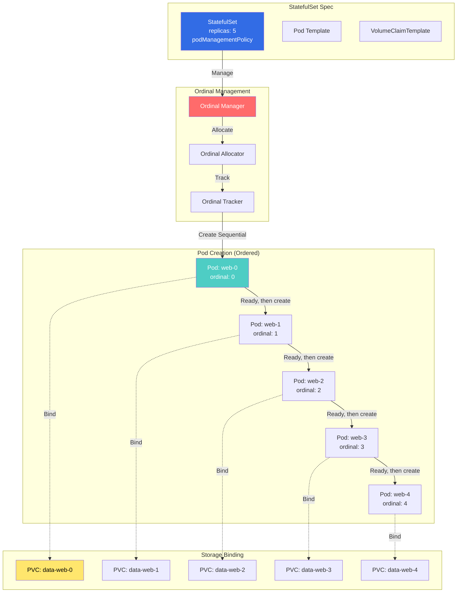
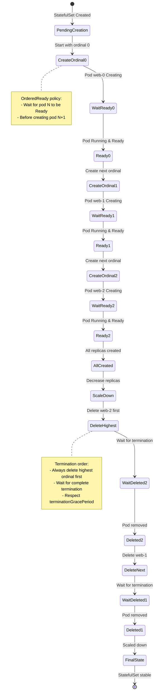
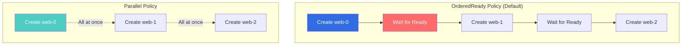

# StatefulSet Ordinal Controllers

## Overview

The StatefulSet Ordinal Controllers manage ordered, sequential pod creation and deletion for StatefulSets. Each pod receives a unique, stable ordinal index (0, 1, 2, ..., N-1) that persists across rescheduling, providing predictable identity and ordering guarantees essential for stateful applications.

**Key Features:**
- **Ordered Deployment**: Pods created sequentially (0→1→2→...)
- **Ordered Termination**: Pods deleted in reverse order (N-1→N-2→...→0)
- **Stable Identity**: Pod names include ordinal (web-0, web-1, web-2)
- **Persistent Storage**: PVCs bound to specific ordinals
- **Parallel Scaling**: Optional parallel pod management

**Introduced in:** Kubernetes 1.5 (Beta), 1.9 (GA)

## Architecture

### StatefulSet Ordinal System



### Pod Lifecycle with Ordinals



## Controller Implementation

### StatefulSet Controller with Ordinal Management

**File:** `pkg/controller/statefulset/stateful_set.go`

```go
// StatefulSetController manages StatefulSets
type StatefulSetController struct {
    kubeClient clientset.Interface
    control    StatefulSetControlInterface

    // Informers
    setLister  appslisters.StatefulSetLister
    podLister  corelisters.PodLister
    pvcLister  corelisters.PersistentVolumeClaimLister

    // Queue for StatefulSets
    queue workqueue.RateLimitingInterface
}

// sync processes a StatefulSet
func (ssc *StatefulSetController) sync(
    ctx context.Context,
    key string,
) error {
    namespace, name, err := cache.SplitMetaNamespaceKey(key)
    if err != nil {
        return err
    }

    // Get StatefulSet
    set, err := ssc.setLister.StatefulSets(namespace).Get(name)
    if err != nil {
        if errors.IsNotFound(err) {
            return nil
        }
        return err
    }

    // Get selector
    selector, err := metav1.LabelSelectorAsSelector(set.Spec.Selector)
    if err != nil {
        return err
    }

    // Get pods
    pods, err := ssc.podLister.Pods(set.Namespace).List(selector)
    if err != nil {
        return err
    }

    // Get PVCs
    pvcs, err := ssc.pvcLister.PersistentVolumeClaims(set.Namespace).
        List(selector)
    if err != nil {
        return err
    }

    // Update StatefulSet
    return ssc.control.UpdateStatefulSet(ctx, set, pods, pvcs)
}
```

**Location:** `pkg/controller/statefulset/stateful_set.go:100-200`

### Ordinal Pod Management

**File:** `pkg/controller/statefulset/stateful_set_control.go`

```go
// UpdateStatefulSet performs update logic for StatefulSet
func (ssc *defaultStatefulSetControl) UpdateStatefulSet(
    ctx context.Context,
    set *apps.StatefulSet,
    pods []*v1.Pod,
    pvcs []*v1.PersistentVolumeClaim,
) error {
    // Get current and update revisions
    currentRevision, updateRevision, err := ssc.getStatefulSetRevisions(
        set,
        pods,
    )
    if err != nil {
        return err
    }

    // Perform update based on strategy
    status, err := ssc.updateStatefulSet(
        ctx,
        set,
        currentRevision,
        updateRevision,
        pods,
        pvcs,
    )
    if err != nil {
        return err
    }

    // Update status
    return ssc.updateStatefulSetStatus(ctx, set, status)
}

// updateStatefulSet manages pod ordinals
func (ssc *defaultStatefulSetControl) updateStatefulSet(
    ctx context.Context,
    set *apps.StatefulSet,
    currentRevision *apps.ControllerRevision,
    updateRevision *apps.ControllerRevision,
    pods []*v1.Pod,
    pvcs []*v1.PersistentVolumeClaim,
) (*apps.StatefulSetStatus, error) {

    // Get ordinal range
    replicaCount := int(*set.Spec.Replicas)

    // Sort pods by ordinal
    sort.Sort(statefulPodsByOrdinal(pods))

    // Build ordinal → pod map
    replicas := make([]*v1.Pod, replicaCount)
    for _, pod := range pods {
        ordinal := getOrdinal(pod)
        if ordinal < 0 || ordinal >= replicaCount {
            // Pod outside current range, will be deleted
            continue
        }
        replicas[ordinal] = pod
    }

    // Determine pods to create, update, or delete
    for i := 0; i < replicaCount; i++ {
        // Check if pod exists for this ordinal
        if replicas[i] == nil {
            // Need to create pod
            if err := ssc.createPodForOrdinal(
                ctx,
                set,
                i,
                currentRevision,
                updateRevision,
            ); err != nil {
                return nil, err
            }

            // In OrderedReady mode, wait for this pod to be ready
            if isOrderedReady(set) {
                break
            }
        } else {
            // Pod exists, check if it needs update
            if !isHealthy(replicas[i]) {
                // Pod not healthy, wait before proceeding
                if isOrderedReady(set) {
                    break
                }
            }

            // Check if pod needs update
            if !isUpdated(replicas[i], updateRevision) {
                if err := ssc.updatePod(
                    ctx,
                    set,
                    replicas[i],
                    updateRevision,
                ); err != nil {
                    return nil, err
                }

                // In OrderedReady mode, wait for update to complete
                if isOrderedReady(set) {
                    break
                }
            }
        }
    }

    // Delete pods with ordinals >= replicaCount
    for i := len(pods) - 1; i >= replicaCount; i-- {
        if pods[i] == nil {
            continue
        }

        ordinal := getOrdinal(pods[i])
        if ordinal >= replicaCount {
            if err := ssc.deletePod(ctx, set, pods[i]); err != nil {
                return nil, err
            }

            // In OrderedReady mode, wait for deletion to complete
            if isOrderedReady(set) {
                break
            }
        }
    }

    // Calculate status
    status := ssc.calculateStatus(set, pods, currentRevision, updateRevision)
    return status, nil
}

// createPodForOrdinal creates a pod with specific ordinal
func (ssc *defaultStatefulSetControl) createPodForOrdinal(
    ctx context.Context,
    set *apps.StatefulSet,
    ordinal int,
    currentRevision *apps.ControllerRevision,
    updateRevision *apps.ControllerRevision,
) error {
    // Determine which revision to use
    revision := currentRevision
    if ordinal >= int(*set.Status.CurrentReplicas) {
        revision = updateRevision
    }

    // Create PVCs first
    if err := ssc.createPVCsForOrdinal(ctx, set, ordinal); err != nil {
        return err
    }

    // Build pod
    pod := newPodForOrdinal(set, ordinal, revision)

    // Create pod
    _, err := ssc.kubeClient.CoreV1().Pods(set.Namespace).Create(
        ctx,
        pod,
        metav1.CreateOptions{},
    )

    if err != nil && !errors.IsAlreadyExists(err) {
        return err
    }

    klog.V(4).Infof(
        "Created pod %s/%s for StatefulSet %s/%s with ordinal %d",
        pod.Namespace,
        pod.Name,
        set.Namespace,
        set.Name,
        ordinal,
    )

    return nil
}

// newPodForOrdinal creates pod object with ordinal
func newPodForOrdinal(
    set *apps.StatefulSet,
    ordinal int,
    revision *apps.ControllerRevision,
) *v1.Pod {
    // Pod name includes ordinal
    podName := fmt.Sprintf("%s-%d", set.Name, ordinal)

    pod := &v1.Pod{
        ObjectMeta: metav1.ObjectMeta{
            Name:      podName,
            Namespace: set.Namespace,
            Labels:    set.Spec.Template.Labels,
            Annotations: map[string]string{
                apps.StatefulSetRevisionAnnotation: revision.Name,
            },
        },
        Spec: *set.Spec.Template.Spec.DeepCopy(),
    }

    // Add ordinal label
    if pod.Labels == nil {
        pod.Labels = make(map[string]string)
    }
    pod.Labels[apps.StatefulSetPodNameLabel] = podName
    pod.Labels[apps.ControllerRevisionHashLabelKey] = revision.Name

    // Set hostname to pod name (for stable network identity)
    pod.Spec.Hostname = podName

    // Set subdomain for headless service
    if set.Spec.ServiceName != "" {
        pod.Spec.Subdomain = set.Spec.ServiceName
    }

    // Update volume claim templates
    for i := range pod.Spec.Volumes {
        if pvc := pod.Spec.Volumes[i].PersistentVolumeClaim; pvc != nil {
            // Replace claim name with ordinal-specific name
            claimName := getPVCNameForOrdinal(
                set.Spec.VolumeClaimTemplates[i].Name,
                set.Name,
                ordinal,
            )
            pvc.ClaimName = claimName
        }
    }

    // Set owner reference
    pod.OwnerReferences = []metav1.OwnerReference{
        *metav1.NewControllerRef(
            set,
            apps.SchemeGroupVersion.WithKind("StatefulSet"),
        ),
    }

    return pod
}

// getOrdinal extracts ordinal from pod name
func getOrdinal(pod *v1.Pod) int {
    // Pod name format: <statefulset-name>-<ordinal>
    parts := strings.Split(pod.Name, "-")
    if len(parts) < 2 {
        return -1
    }

    ordinal, err := strconv.Atoi(parts[len(parts)-1])
    if err != nil {
        return -1
    }

    return ordinal
}

// isOrderedReady checks if StatefulSet uses OrderedReady policy
func isOrderedReady(set *apps.StatefulSet) bool {
    if set.Spec.PodManagementPolicy == nil {
        return true
    }
    return *set.Spec.PodManagementPolicy == apps.OrderedReadyPodManagement
}

// isHealthy checks if pod is running and ready
func isHealthy(pod *v1.Pod) bool {
    if pod.Status.Phase != v1.PodRunning {
        return false
    }

    for _, condition := range pod.Status.Conditions {
        if condition.Type == v1.PodReady {
            return condition.Status == v1.ConditionTrue
        }
    }

    return false
}

// getPVCNameForOrdinal generates PVC name for ordinal
func getPVCNameForOrdinal(
    claimName string,
    setName string,
    ordinal int,
) string {
    return fmt.Sprintf("%s-%s-%d", claimName, setName, ordinal)
}
```

**Location:** `pkg/controller/statefulset/stateful_set_control.go:100-500`

### PVC Management for Ordinals

**File:** `pkg/controller/statefulset/stateful_set_utils.go`

```go
// createPVCsForOrdinal creates PVCs for a specific ordinal
func (ssc *defaultStatefulSetControl) createPVCsForOrdinal(
    ctx context.Context,
    set *apps.StatefulSet,
    ordinal int,
) error {
    for _, template := range set.Spec.VolumeClaimTemplates {
        pvc := newPVCForOrdinal(set, &template, ordinal)

        // Check if PVC already exists
        _, err := ssc.kubeClient.CoreV1().
            PersistentVolumeClaims(set.Namespace).
            Get(ctx, pvc.Name, metav1.GetOptions{})

        if err == nil {
            // PVC exists
            continue
        }

        if !errors.IsNotFound(err) {
            return err
        }

        // Create PVC
        _, err = ssc.kubeClient.CoreV1().
            PersistentVolumeClaims(set.Namespace).
            Create(ctx, pvc, metav1.CreateOptions{})

        if err != nil && !errors.IsAlreadyExists(err) {
            return err
        }

        klog.V(4).Infof(
            "Created PVC %s/%s for StatefulSet %s with ordinal %d",
            pvc.Namespace,
            pvc.Name,
            set.Name,
            ordinal,
        )
    }

    return nil
}

// newPVCForOrdinal creates PVC for specific ordinal
func newPVCForOrdinal(
    set *apps.StatefulSet,
    template *v1.PersistentVolumeClaim,
    ordinal int,
) *v1.PersistentVolumeClaim {
    pvc := template.DeepCopy()

    // Set name with ordinal
    pvc.Name = getPVCNameForOrdinal(
        template.Name,
        set.Name,
        ordinal,
    )
    pvc.Namespace = set.Namespace

    // Set labels
    if pvc.Labels == nil {
        pvc.Labels = make(map[string]string)
    }
    for k, v := range set.Spec.Template.Labels {
        pvc.Labels[k] = v
    }
    pvc.Labels[apps.StatefulSetPodNameLabel] = fmt.Sprintf(
        "%s-%d",
        set.Name,
        ordinal,
    )

    // Set owner reference
    pvc.OwnerReferences = []metav1.OwnerReference{
        *metav1.NewControllerRef(
            set,
            apps.SchemeGroupVersion.WithKind("StatefulSet"),
        ),
    }

    return pvc
}
```

**Location:** `pkg/controller/statefulset/stateful_set_utils.go:200-300`

## Pod Management Policies

### OrderedReady vs Parallel



## Configuration Examples

### Basic StatefulSet with Ordinals

```yaml
apiVersion: apps/v1
kind: StatefulSet
metadata:
  name: web
spec:
  # Service for stable network identity
  serviceName: "web"

  # Number of replicas (creates ordinals 0-4)
  replicas: 5

  # Pod management policy
  podManagementPolicy: OrderedReady  # Default, can be "Parallel"

  selector:
    matchLabels:
      app: nginx

  template:
    metadata:
      labels:
        app: nginx
    spec:
      containers:
      - name: nginx
        image: nginx:1.21
        ports:
        - containerPort: 80
          name: web

        # Volume mount using ordinal-specific PVC
        volumeMounts:
        - name: www
          mountPath: /usr/share/nginx/html

  # Volume claim templates (one PVC per ordinal)
  volumeClaimTemplates:
  - metadata:
      name: www
    spec:
      accessModes: ["ReadWriteOnce"]
      storageClassName: "standard"
      resources:
        requests:
          storage: 1Gi

# Results in:
# Pods: web-0, web-1, web-2, web-3, web-4
# PVCs: www-web-0, www-web-1, www-web-2, www-web-3, www-web-4
```

### Headless Service for Stable Network Identity

```yaml
apiVersion: v1
kind: Service
metadata:
  name: web
  labels:
    app: nginx
spec:
  # Headless service (clusterIP: None)
  clusterIP: None

  # Selector matches StatefulSet pods
  selector:
    app: nginx

  ports:
  - port: 80
    name: web

# DNS entries created:
# web-0.web.default.svc.cluster.local
# web-1.web.default.svc.cluster.local
# web-2.web.default.svc.cluster.local
# web-3.web.default.svc.cluster.local
# web-4.web.default.svc.cluster.local
```

### Parallel Pod Management

```yaml
apiVersion: apps/v1
kind: StatefulSet
metadata:
  name: web-parallel
spec:
  serviceName: "web"
  replicas: 10

  # Parallel pod management (no ordering)
  podManagementPolicy: Parallel

  selector:
    matchLabels:
      app: nginx

  template:
    metadata:
      labels:
        app: nginx
    spec:
      containers:
      - name: nginx
        image: nginx:1.21

  volumeClaimTemplates:
  - metadata:
      name: www
    spec:
      accessModes: ["ReadWriteOnce"]
      resources:
        requests:
          storage: 1Gi

# All 10 pods created simultaneously (web-0 through web-9)
# No waiting for pod readiness between creates
```

### Rolling Update Strategy

```yaml
apiVersion: apps/v1
kind: StatefulSet
metadata:
  name: web
spec:
  serviceName: "web"
  replicas: 5

  # Update strategy
  updateStrategy:
    type: RollingUpdate
    rollingUpdate:
      # Partition controls which pods get updated
      partition: 3

  selector:
    matchLabels:
      app: nginx

  template:
    metadata:
      labels:
        app: nginx
    spec:
      containers:
      - name: nginx
        image: nginx:1.22  # New version

# With partition: 3
# - Pods web-4 and web-3 will be updated to nginx:1.22
# - Pods web-2, web-1, web-0 remain on old version
# - Allows gradual rollout and canary testing
```

## Monitoring and Metrics

### StatefulSet Metrics

```yaml
# StatefulSet metrics
kube_statefulset_status_replicas{statefulset="web"}
kube_statefulset_status_replicas_ready{statefulset="web"}
kube_statefulset_status_replicas_current{statefulset="web"}
kube_statefulset_status_replicas_updated{statefulset="web"}

# Pod metrics by ordinal
kube_pod_info{pod="web-0",statefulset="web"}
kube_pod_status_phase{pod="web-0",phase="Running"}

# PVC metrics by ordinal
kube_persistentvolumeclaim_info{persistentvolumeclaim="www-web-0"}
```

### Prometheus Queries

```promql
# StatefulSet replica status
kube_statefulset_status_replicas_ready / kube_statefulset_status_replicas

# Pods not ready by ordinal
kube_pod_status_ready{condition="false"} *
on(pod) group_left(statefulset) kube_pod_labels{statefulset="web"}

# PVC bind status by ordinal
kube_persistentvolumeclaim_status_phase{phase!="Bound"} *
on(persistentvolumeclaim) group_left() kube_persistentvolumeclaim_labels{statefulset="web"}

# Ordinal-specific queries
kube_pod_info{pod=~"web-[0-4]"}
```

## Troubleshooting Guide

### Common Issues

#### Issue 1: Pod Stuck in Pending (Ordinal blocked)

**Symptoms:**
- Pod web-1 not created
- web-0 exists but not Ready
- Entire StatefulSet stuck

**Diagnosis:**
```bash
# Check pod status
kubectl get pods -l app=nginx

# Check events for pod
kubectl describe pod web-0

# Check if blocking ordinal
kubectl get statefulset web -o jsonpath='{.status}'
```

**Common Causes:**
1. Lower ordinal pod not Ready (OrderedReady)
2. PVC not bound
3. Insufficient resources

**Resolution:**
```bash
# Check PVC status
kubectl get pvc -l app=nginx

# Check pod logs
kubectl logs web-0

# Switch to Parallel if ordering not needed
kubectl patch statefulset web -p '
{
  "spec": {
    "podManagementPolicy": "Parallel"
  }
}'
```

#### Issue 2: Wrong PVC Bound to Pod

**Symptoms:**
- Pod using incorrect PVC
- Data from wrong ordinal
- PVC name mismatch

**Diagnosis:**
```bash
# Check PVC bindings
kubectl get pods -l app=nginx \
  -o jsonpath='{range .items[*]}{.metadata.name}{"\t"}{.spec.volumes[?(@.persistentVolumeClaim)].persistentVolumeClaim.claimName}{"\n"}{end}'

# Expected pattern:
# web-0 → www-web-0
# web-1 → www-web-1
```

**Resolution:**
```bash
# Delete pod to force rebind
kubectl delete pod web-1

# Check VolumeClaimTemplate
kubectl get statefulset web -o yaml | grep -A 10 volumeClaimTemplates
```

### Debug Commands

```bash
# List pods by ordinal
kubectl get pods -l app=nginx --sort-by=.metadata.name

# Check ordinal readiness
kubectl get pods -l app=nginx \
  -o jsonpath='{range .items[*]}{.metadata.name}{"\t"}{.status.conditions[?(@.type=="Ready")].status}{"\n"}{end}'

# Verify PVC per ordinal
kubectl get pvc -l app=nginx --sort-by=.metadata.name

# Check StatefulSet status
kubectl get statefulset web -o jsonpath='{.status}' | jq

# Scale StatefulSet
kubectl scale statefulset web --replicas=3

# Watch ordinal creation
kubectl get pods -l app=nginx -w

# Delete specific ordinal
kubectl delete pod web-2

# Check DNS resolution
kubectl run -it --rm debug --image=busybox --restart=Never -- \
  nslookup web-0.web.default.svc.cluster.local
```

## Best Practices

1. **Use Headless Service**
   ```yaml
   # Required for stable DNS
   clusterIP: None
   ```

2. **Set Appropriate Grace Period**
   ```yaml
   spec:
     template:
       spec:
         terminationGracePeriodSeconds: 30
   ```

3. **Use Partition for Canary**
   ```yaml
   updateStrategy:
     rollingUpdate:
       partition: N  # Only update pods >= N
   ```

4. **Monitor Ordinal Health**
   - Alert on pods not Ready
   - Track PVC binding
   - Monitor creation order

## Performance Considerations

### Scaling

- **OrderedReady**: O(N) time, sequential
- **Parallel**: O(1) time, concurrent
- **Recommendation**: Use Parallel if ordering not required

### Storage

- One PVC per ordinal per volume claim template
- PVCs persist even after StatefulSet deletion
- Manual PVC cleanup required

## Related Components

- **StatefulSet Controller** (`pkg/controller/statefulset/`)
- **Pod Controller** (creates/deletes pods)
- **PVC Controller** (binds volumes)
- **Service Controller** (DNS entries)

## References

- **KEP-1847**: [StatefulSet Ordinal Management](https://github.com/kubernetes/enhancements/tree/master/keps/sig-apps/1847-autodelete-statefulset-pvcs)
- **KEP-3335**: [StatefulSet Slice](https://github.com/kubernetes/enhancements/tree/master/keps/sig-apps/3335-statefulset-slice)
- **Source Code**: `pkg/controller/statefulset/`
- **API Reference**: [StatefulSet v1](https://kubernetes.io/docs/reference/kubernetes-api/workload-resources/stateful-set-v1/)
