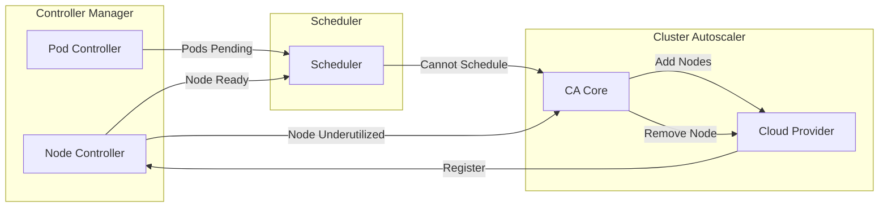

# Advanced Topics Summary

## Overview

This document provides a consolidated reference for advanced controller-manager topics, including VPA, cluster autoscaler integration, topology spread, scheduling gates, webhooks, custom controllers, and future directions.

## Vertical Pod Autoscaler (VPA)

### Architecture Overview

**Note:** VPA is **not** part of kube-controller-manager. It's a separate component with its own controllers.

**VPA Components:**
- **VPA Recommender**: Analyzes resource usage and generates recommendations
- **VPA Updater**: Evicts pods that need resource updates
- **VPA Admission Controller**: Modifies pod resource requests at creation time

**Repository:** https://github.com/kubernetes/autoscaler/tree/master/vertical-pod-autoscaler

### VPA Resource Example

```yaml
apiVersion: autoscaling.k8s.io/v1
kind: VerticalPodAutoscaler
metadata:
  name: my-app-vpa
spec:
  targetRef:
    apiVersion: apps/v1
    kind: Deployment
    name: my-app

  # Update mode
  updatePolicy:
    updateMode: "Auto"  # or "Off", "Initial", "Recreate"

  # Resource policy
  resourcePolicy:
    containerPolicies:
    - containerName: "*"
      minAllowed:
        cpu: 100m
        memory: 50Mi
      maxAllowed:
        cpu: 1
        memory: 500Mi
      controlledResources: ["cpu", "memory"]
```

**Key Features:**
- Recommendation engine based on historical usage
- Automatic pod recreation with new resource requests
- Integration with HPA (some limitations)

## Cluster Autoscaler Integration

### Overview

**Note:** Cluster Autoscaler (CA) is external to kube-controller-manager.

**CA Responsibilities:**
- Scale cluster nodes up when pods are unschedulable
- Scale nodes down when underutilized
- Respects PodDisruptionBudgets

### Integration Points with Controller-Manager



### CA Annotations

```yaml
# Prevent node from being scaled down
apiVersion: v1
kind: Node
metadata:
  name: node-1
  annotations:
    cluster-autoscaler.kubernetes.io/scale-down-disabled: "true"

---
# Safe to evict pod (for CA scale-down)
apiVersion: v1
kind: Pod
metadata:
  name: my-pod
  annotations:
    cluster-autoscaler.kubernetes.io/safe-to-evict: "true"
```

**Repository:** https://github.com/kubernetes/autoscaler/tree/master/cluster-autoscaler

## Pod Topology Spread Constraints

### Overview

Topology spread is implemented in the **scheduler**, not controller-manager. However, controllers create pods with topology spread constraints.

### Pod Example with Topology Spread

```yaml
apiVersion: v1
kind: Pod
metadata:
  name: example-pod
  labels:
    app: myapp
spec:
  topologySpreadConstraints:
  - maxSkew: 1
    topologyKey: topology.kubernetes.io/zone
    whenUnsatisfiable: DoNotSchedule
    labelSelector:
      matchLabels:
        app: myapp

  - maxSkew: 2
    topologyKey: kubernetes.io/hostname
    whenUnsatisfiable: ScheduleAnyway
    labelSelector:
      matchLabels:
        app: myapp

  containers:
  - name: app
    image: myapp:1.0
```

**Key Parameters:**
- **maxSkew**: Maximum allowed difference in pod count
- **topologyKey**: Node label key (zone, hostname, etc.)
- **whenUnsatisfiable**: DoNotSchedule or ScheduleAnyway
- **labelSelector**: Pods to consider for spreading

### Integration with Deployments

```yaml
apiVersion: apps/v1
kind: Deployment
metadata:
  name: web
spec:
  replicas: 6
  selector:
    matchLabels:
      app: web
  template:
    metadata:
      labels:
        app: web
    spec:
      # Spread across zones
      topologySpreadConstraints:
      - maxSkew: 1
        topologyKey: topology.kubernetes.io/zone
        whenUnsatisfiable: DoNotSchedule
        labelSelector:
          matchLabels:
            app: web

      containers:
      - name: web
        image: nginx:1.21
```

**Result:** Pods distributed evenly across availability zones.

## Scheduling Gates

### Overview

Scheduling gates allow controllers to **block pod scheduling** until specific conditions are met. This is implemented via the scheduler, but controllers interact with gates.

**Introduced in:** Kubernetes 1.26 (Alpha), 1.27 (Beta)

### Scheduling Gate Example

```yaml
apiVersion: v1
kind: Pod
metadata:
  name: gated-pod
spec:
  schedulingGates:
  - name: example.com/my-custom-gate
  - name: example.com/another-gate

  containers:
  - name: app
    image: myapp:1.0

# Pod will NOT be scheduled until gates are removed
```

### Controller Removing Gates

```go
func (c *Controller) removeGate(pod *v1.Pod, gateName string) error {
    pod = pod.DeepCopy()

    // Remove specific gate
    var newGates []v1.PodSchedulingGate
    for _, gate := range pod.Spec.SchedulingGates {
        if gate.Name != gateName {
            newGates = append(newGates, gate)
        }
    }

    pod.Spec.SchedulingGates = newGates

    _, err := c.client.CoreV1().Pods(pod.Namespace).Update(
        ctx,
        pod,
        metav1.UpdateOptions{},
    )
    return err
}
```

**Use Cases:**
- Wait for external resource allocation (DRA)
- Quota enforcement
- Custom admission logic
- Coordination between components

## Webhook Integration

### Admission Webhooks and Controllers

Controllers often interact with admission webhooks:

**Validating Webhooks:** Validate resources before persistence
**Mutating Webhooks:** Modify resources before persistence

### Example: Resource Quota Webhook

```yaml
apiVersion: admissionregistration.k8s.io/v1
kind: ValidatingWebhookConfiguration
metadata:
  name: quota-validator
webhooks:
- name: quota.example.com
  clientConfig:
    service:
      name: quota-webhook
      namespace: default
      path: /validate
  rules:
  - operations: ["CREATE", "UPDATE"]
    apiGroups: [""]
    apiVersions: ["v1"]
    resources: ["pods"]
  admissionReviewVersions: ["v1"]
  sideEffects: None
```

### Controller Coordination with Webhooks

```go
// Controller sets annotation for webhook to validate
func (c *Controller) createPod(pod *v1.Pod) error {
    if pod.Annotations == nil {
        pod.Annotations = make(map[string]string)
    }

    // Webhook will validate this
    pod.Annotations["quota-validated"] = "pending"

    _, err := c.client.CoreV1().Pods(pod.Namespace).Create(
        ctx,
        pod,
        metav1.CreateOptions{},
    )
    return err
}
```

## Custom Controllers and Operators

### Custom Resource Definitions (CRDs)

```yaml
apiVersion: apiextensions.k8s.io/v1
kind: CustomResourceDefinition
metadata:
  name: applications.example.com
spec:
  group: example.com
  versions:
  - name: v1
    served: true
    storage: true
    schema:
      openAPIV3Schema:
        type: object
        properties:
          spec:
            type: object
            properties:
              replicas:
                type: integer
              image:
                type: string
  scope: Namespaced
  names:
    plural: applications
    singular: application
    kind: Application
```

### Custom Controller Pattern

```go
import (
    "k8s.io/client-go/tools/cache"
    "k8s.io/client-go/util/workqueue"
)

type ApplicationController struct {
    client    clientset.Interface
    appLister appslisters.ApplicationLister
    queue     workqueue.RateLimitingInterface
}

func (c *ApplicationController) Run(ctx context.Context) {
    defer c.queue.ShutDown()

    // Start informer
    go c.appInformer.Run(ctx.Done())

    // Wait for cache sync
    if !cache.WaitForCacheSync(
        ctx.Done(),
        c.appInformer.HasSynced,
    ) {
        return
    }

    // Start workers
    for i := 0; i < 5; i++ {
        go wait.UntilWithContext(ctx, c.worker, time.Second)
    }

    <-ctx.Done()
}

func (c *ApplicationController) sync(
    ctx context.Context,
    key string,
) error {
    namespace, name, _ := cache.SplitMetaNamespaceKey(key)

    app, err := c.appLister.Applications(namespace).Get(name)
    if err != nil {
        return err
    }

    // Reconcile application
    return c.reconcile(ctx, app)
}
```

### Controller-Runtime (Kubebuilder/Operator SDK)

**Modern approach using controller-runtime:**

```go
import (
    ctrl "sigs.k8s.io/controller-runtime"
)

type ApplicationReconciler struct {
    client.Client
    Scheme *runtime.Scheme
}

func (r *ApplicationReconciler) Reconcile(
    ctx context.Context,
    req ctrl.Request,
) (ctrl.Result, error) {
    var app examplev1.Application
    if err := r.Get(ctx, req.NamespacedName, &app); err != nil {
        return ctrl.Result{}, client.IgnoreNotFound(err)
    }

    // Reconciliation logic
    return ctrl.Result{}, nil
}

func (r *ApplicationReconciler) SetupWithManager(
    mgr ctrl.Manager,
) error {
    return ctrl.NewControllerManagedBy(mgr).
        For(&examplev1.Application{}).
        Owns(&appsv1.Deployment{}).
        Complete(r)
}
```

**Benefits:**
- Simplified controller scaffolding
- Built-in leader election
- Predicate filtering
- Event source management

## Migration Strategies

### In-Place Controller Updates

**Strategy:** Rolling update of controller-manager

```bash
# 1. Update controller-manager binary
# 2. Rolling restart

kubectl delete pod -n kube-system kube-controller-manager-node1
# Wait for new version to become leader
kubectl delete pod -n kube-system kube-controller-manager-node2
```

### Feature Gate Migration

```yaml
# Enable new controller via feature gate
--feature-gates=NewController=true

# Old behavior (disabled)
--feature-gates=NewController=false
```

### API Version Migration

```go
// Support multiple API versions
func (c *Controller) sync(ctx context.Context, obj interface{}) error {
    switch v := obj.(type) {
    case *appsv1.Deployment:
        return c.syncV1(ctx, v)
    case *appsv1beta2.Deployment:
        return c.syncV1Beta2(ctx, v)
    default:
        return fmt.Errorf("unsupported version: %T", obj)
    }
}
```

## Future Directions

### 1. Declarative Controllers

Move towards more declarative controller patterns:
- Declarative configuration
- Policy-driven reconciliation
- Standardized controller interfaces

### 2. Enhanced Observability

- Structured event streams
- Trace correlation across controllers
- Better debugging tools

### 3. Multi-Cluster Controllers

- Federation v2 (KubeFed)
- Cross-cluster resource management
- Distributed control planes

### 4. AI/ML Integration

- Predictive autoscaling
- Anomaly detection
- Intelligent remediation

### 5. Policy Engines

Integration with policy frameworks:
- OPA (Open Policy Agent)
- Kyverno
- Policy-as-code

### 6. Edge Computing

Controllers optimized for edge scenarios:
- Reduced resource footprint
- Disconnected operation
- Edge-specific controllers

## Key Takeaways

### Controller Design Principles

1. **Reconciliation Loop**: Always work towards desired state
2. **Level Triggering**: Don't rely on edge events
3. **Idempotency**: Safe to retry operations
4. **Error Handling**: Categorize and handle appropriately
5. **Observability**: Comprehensive metrics and logs

### Best Practices Summary

1. **Use Informers**: Never poll the API server
2. **Queue Everything**: Decouple watching from processing
3. **Handle Errors**: Retry transient errors, log permanent ones
4. **Rate Limit**: Protect API server and downstream systems
5. **Test Thoroughly**: Unit, integration, and e2e tests
6. **Monitor Everything**: Metrics, logs, events, traces

### Common Pitfalls

1. ❌ Modifying cached objects
2. ❌ Blocking in event handlers
3. ❌ Ignoring errors
4. ❌ Missing owner references
5. ❌ Polling instead of watching
6. ❌ Insufficient rate limiting
7. ❌ Poor error categorization

## Additional Resources

### Official Documentation
- [Kubernetes Controllers](https://kubernetes.io/docs/concepts/architecture/controller/)
- [Custom Resources](https://kubernetes.io/docs/concepts/extend-kubernetes/api-extension/custom-resources/)
- [Operator Pattern](https://kubernetes.io/docs/concepts/extend-kubernetes/operator/)

### Open Source Projects
- [controller-runtime](https://github.com/kubernetes-sigs/controller-runtime)
- [kubebuilder](https://github.com/kubernetes-sigs/kubebuilder)
- [operator-sdk](https://github.com/operator-framework/operator-sdk)
- [cluster-autoscaler](https://github.com/kubernetes/autoscaler)

### KEPs (Kubernetes Enhancement Proposals)
- [KEP-2053: Topology Aware Hints](https://github.com/kubernetes/enhancements/tree/master/keps/sig-network/2433-topology-aware-hints)
- [KEP-3521: Pod Scheduling Readiness](https://github.com/kubernetes/enhancements/tree/master/keps/sig-scheduling/3521-pod-scheduling-readiness)
- [KEP-1610: Container Resource Based Pod Autoscaling](https://github.com/kubernetes/enhancements/tree/master/keps/sig-autoscaling/1610-container-resource-autoscaling)

### Community
- [SIG Apps](https://github.com/kubernetes/community/tree/master/sig-apps)
- [SIG Autoscaling](https://github.com/kubernetes/community/tree/master/sig-autoscaling)
- [SIG Node](https://github.com/kubernetes/community/tree/master/sig-node)

## Conclusion

The kube-controller-manager ecosystem continues to evolve with:
- More sophisticated autoscaling
- Better integration with external systems
- Enhanced observability
- Improved extensibility

Understanding these patterns and principles enables building robust, scalable controllers that integrate seamlessly with Kubernetes.

---

**End of Advanced Topics Summary**
