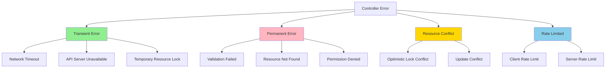
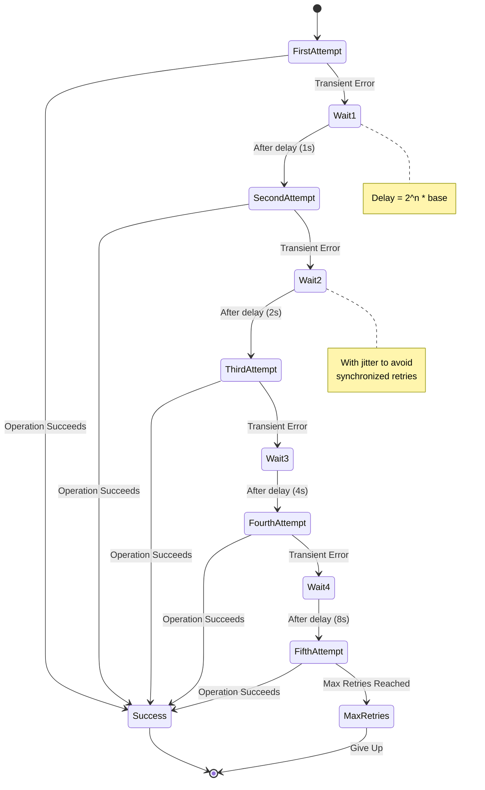
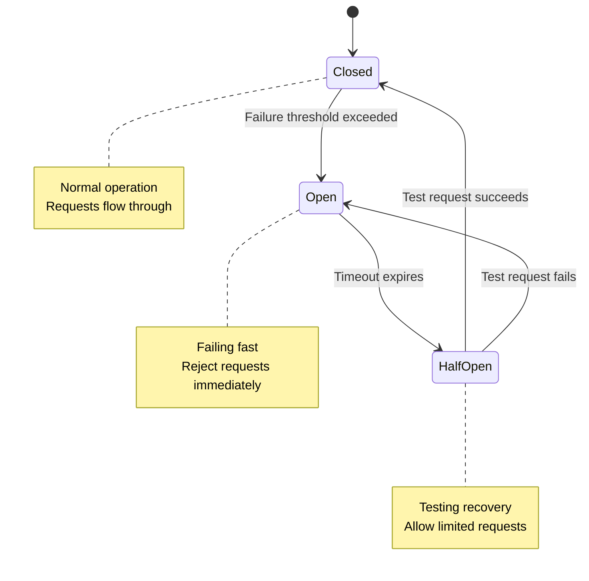
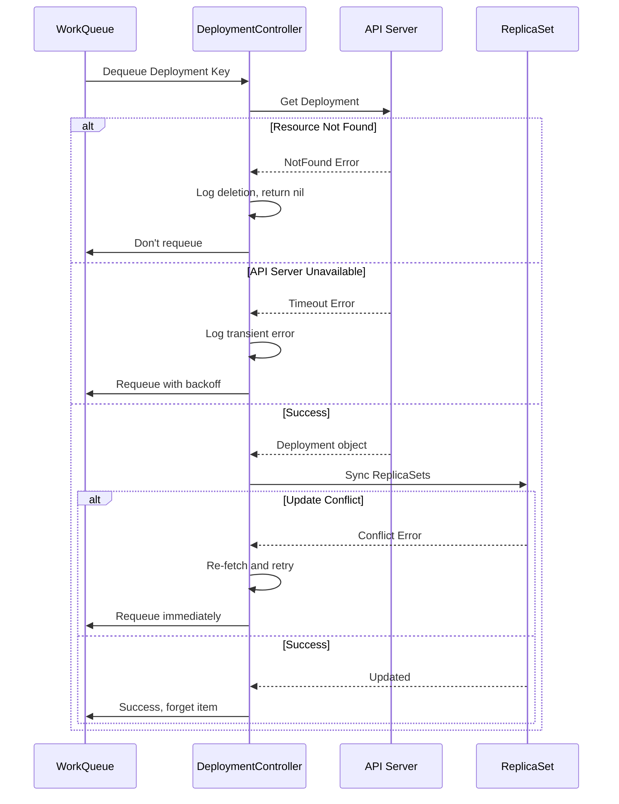

# Error Handling Strategies in Kubernetes Controllers

**Document**: 56-error-handling-strategies.md
**Status**: Course Module - Error Handling & Resilience Patterns
**Audience**: Software Engineers, Controller Developers
**Prerequisites**: Basic understanding of Kubernetes controllers and Go programming

---

## **Overview**

Error handling is critical for building resilient, production-grade Kubernetes controllers. This document provides a comprehensive deep dive into error handling strategies, patterns, and anti-patterns used throughout kube-controller-manager.

### **Learning Objectives**

After studying this document, you will understand:
1. Error categorization and classification strategies
2. Retry mechanisms and exponential backoff algorithms
3. Circuit breaker patterns for fault isolation
4. Error propagation and context preservation
5. Observability patterns for error tracking
6. Real-world implementations in Kubernetes controllers

---

## **1. Error Classification & Categorization**

### **1.1 Error Taxonomy**

Kubernetes controllers classify errors into distinct categories to determine appropriate handling strategies:



### **1.2 Error Type Definitions**

```go
// Source: staging/src/k8s.io/apimachinery/pkg/api/errors/errors.go

// IsRetryable determines if an error should trigger a retry
func IsRetryable(err error) bool {
    if err == nil {
        return false
    }

    // Transient errors - retry with backoff
    if IsTimeout(err) || IsServerTimeout(err) {
        return true
    }

    if IsServiceUnavailable(err) || IsTooManyRequests(err) {
        return true
    }

    // Conflict errors - retry with re-fetch
    if IsConflict(err) {
        return true
    }

    // Permanent errors - don't retry
    if IsNotFound(err) || IsInvalid(err) || IsForbidden(err) {
        return false
    }

    return false
}

// Error categories
func IsTransient(err error) bool {
    return IsTimeout(err) ||
           IsServerTimeout(err) ||
           IsServiceUnavailable(err) ||
           IsTooManyRequests(err)
}

func IsPermanent(err error) bool {
    return IsNotFound(err) ||
           IsInvalid(err) ||
           IsForbidden(err) ||
           IsUnauthorized(err)
}

func IsConflictError(err error) bool {
    return IsConflict(err) || IsResourceExpired(err)
}
```

**Source References**:
- `staging/src/k8s.io/apimachinery/pkg/api/errors/errors.go:30-200` - Error type definitions
- `staging/src/k8s.io/client-go/util/retry/util.go:30-80` - Retry helpers

---

## **2. Exponential Backoff Algorithms**

### **2.1 Backoff Strategy**

Exponential backoff prevents thundering herd problems and reduces load on the API server during failures.



### **2.2 Exponential Backoff Implementation**

```go
// Source: staging/src/k8s.io/client-go/util/retry/util.go

// Backoff holds parameters applied to a Backoff function.
type Backoff struct {
    // Duration is the base duration for backoff
    Duration time.Duration

    // Factor is multiplied by the backoff after each failed retry
    Factor float64

    // Jitter adds random variation to backoff
    Jitter float64

    // Steps is the number of attempts before giving up
    Steps int

    // Cap is the maximum backoff duration
    Cap time.Duration
}

// DefaultBackoff returns a backoff with reasonable defaults
func DefaultBackoff() *Backoff {
    return &Backoff{
        Duration: 500 * time.Millisecond,  // Start at 500ms
        Factor:   2.0,                      // Double each time
        Jitter:   0.1,                      // 10% jitter
        Steps:    5,                        // Try 5 times
        Cap:      60 * time.Second,         // Max 60s
    }
}

// Step returns the next backoff duration
func (b *Backoff) Step() time.Duration {
    if b.Steps < 1 {
        if b.Jitter > 0 {
            return jitter(b.Duration, b.Jitter)
        }
        return b.Duration
    }

    b.Steps--
    duration := b.Duration

    // Apply exponential factor
    b.Duration = time.Duration(float64(b.Duration) * b.Factor)

    // Cap at maximum
    if b.Cap > 0 && b.Duration > b.Cap {
        b.Duration = b.Cap
    }

    // Add jitter to prevent thundering herd
    if b.Jitter > 0 {
        duration = jitter(duration, b.Jitter)
    }

    return duration
}

// jitter adds random variation to duration
func jitter(duration time.Duration, maxFactor float64) time.Duration {
    if maxFactor <= 0.0 {
        maxFactor = 1.0
    }
    wait := duration + time.Duration(rand.Float64()*maxFactor*float64(duration))
    return wait
}
```

**Real Example from ReplicaSet Controller**:

```go
// Source: pkg/controller/replicaset/replica_set.go:450-480

func (rsc *ReplicaSetController) updateReplicaSet(ctx context.Context, rs *apps.ReplicaSet) error {
    // Use retry.RetryOnConflict for optimistic lock conflicts
    return retry.RetryOnConflict(retry.DefaultBackoff, func() error {
        // Re-fetch the latest version
        latest, err := rsc.kubeClient.AppsV1().ReplicaSets(rs.Namespace).Get(
            ctx, rs.Name, metav1.GetOptions{})
        if err != nil {
            return err
        }

        // Apply changes to latest version
        latest.Status.Replicas = calculateReplicas(latest)

        // Update status
        _, updateErr := rsc.kubeClient.AppsV1().ReplicaSets(rs.Namespace).UpdateStatus(
            ctx, latest, metav1.UpdateOptions{})
        return updateErr
    })
}
```

### **2.3 Workqueue Rate Limiting**

Controllers use workqueues with built-in rate limiting:

```go
// Source: staging/src/k8s.io/client-go/util/workqueue/default_rate_limiters.go

// RateLimiter interface
type RateLimiter interface {
    // When gets called when an item is added to the queue
    When(item interface{}) time.Duration

    // Forget indicates that an item is finished being retried
    Forget(item interface{})

    // NumRequeues returns back how many failures the item has had
    NumRequeues(item interface{}) int
}

// DefaultControllerRateLimiter is a combination of rate limiters
func DefaultControllerRateLimiter() RateLimiter {
    return NewMaxOfRateLimiter(
        // Exponential backoff: 5ms * 2^(failures)
        NewItemExponentialFailureRateLimiter(5*time.Millisecond, 1000*time.Second),

        // Token bucket: 10 requests per second, burst of 100
        &BucketRateLimiter{Limiter: rate.NewLimiter(rate.Limit(10), 100)},
    )
}

// ItemExponentialFailureRateLimiter does exponential backoff
type ItemExponentialFailureRateLimiter struct {
    failuresLock sync.Mutex
    failures     map[interface{}]int

    baseDelay time.Duration
    maxDelay  time.Duration
}

func (r *ItemExponentialFailureRateLimiter) When(item interface{}) time.Duration {
    r.failuresLock.Lock()
    defer r.failuresLock.Unlock()

    exp := r.failures[item]
    r.failures[item] = r.failures[item] + 1

    // Calculate backoff: baseDelay * 2^exp
    backoff := float64(r.baseDelay.Nanoseconds()) * math.Pow(2, float64(exp))

    // Cap at maxDelay
    calculated := time.Duration(backoff)
    if calculated > r.maxDelay {
        return r.maxDelay
    }

    return calculated
}

func (r *ItemExponentialFailureRateLimiter) NumRequeues(item interface{}) int {
    r.failuresLock.Lock()
    defer r.failuresLock.Unlock()

    return r.failures[item]
}

func (r *ItemExponentialFailureRateLimiter) Forget(item interface{}) {
    r.failuresLock.Lock()
    defer r.failuresLock.Unlock()

    delete(r.failures, item)
}
```

---

## **3. Circuit Breaker Pattern**

### **3.1 Circuit Breaker States**

Circuit breakers protect controllers from cascading failures:



### **3.2 Circuit Breaker Implementation**

```go
// Circuit breaker for controller operations
type CircuitBreaker struct {
    mu           sync.Mutex
    state        CircuitState
    failures     int
    lastFailTime time.Time

    // Configuration
    maxFailures     int           // Failures before opening
    timeout         time.Duration // Time before half-open
    resetThreshold  int           // Successes to close
}

type CircuitState int

const (
    StateClosed CircuitState = iota
    StateOpen
    StateHalfOpen
)

func NewCircuitBreaker(maxFailures int, timeout time.Duration) *CircuitBreaker {
    return &CircuitBreaker{
        state:          StateClosed,
        maxFailures:    maxFailures,
        timeout:        timeout,
        resetThreshold: 1,
    }
}

func (cb *CircuitBreaker) Call(fn func() error) error {
    cb.mu.Lock()

    // Check current state
    switch cb.state {
    case StateOpen:
        // Check if timeout has passed
        if time.Since(cb.lastFailTime) > cb.timeout {
            cb.state = StateHalfOpen
            cb.mu.Unlock()
        } else {
            cb.mu.Unlock()
            return fmt.Errorf("circuit breaker is open")
        }

    case StateHalfOpen:
        cb.mu.Unlock()

    case StateClosed:
        cb.mu.Unlock()
    }

    // Execute function
    err := fn()

    cb.mu.Lock()
    defer cb.mu.Unlock()

    if err != nil {
        cb.onFailure()
        return err
    }

    cb.onSuccess()
    return nil
}

func (cb *CircuitBreaker) onFailure() {
    cb.failures++
    cb.lastFailTime = time.Now()

    if cb.failures >= cb.maxFailures {
        cb.state = StateOpen
    }
}

func (cb *CircuitBreaker) onSuccess() {
    if cb.state == StateHalfOpen {
        cb.state = StateClosed
        cb.failures = 0
    }
}
```

**Usage in Controllers**:

```go
// Example: Using circuit breaker for external API calls
type CloudProviderController struct {
    cloudAPI       CloudAPI
    circuitBreaker *CircuitBreaker
}

func (c *CloudProviderController) syncNode(node *v1.Node) error {
    // Use circuit breaker for cloud API calls
    err := c.circuitBreaker.Call(func() error {
        return c.cloudAPI.UpdateNodeMetadata(node)
    })

    if err != nil {
        if err.Error() == "circuit breaker is open" {
            // Fast fail - don't overload failing service
            klog.V(4).Infof("Circuit breaker open for cloud API, skipping")
            return nil // Don't requeue
        }
        // Transient error - requeue
        return err
    }

    return nil
}
```

---

## **4. Error Propagation & Context**

### **4.1 Error Wrapping with Context**

Modern Go error handling preserves context:

```go
// Source: Inspired by Kubernetes error handling patterns

import (
    "fmt"
    "errors"
)

// Wrap error with context
func (c *DeploymentController) syncDeployment(
    ctx context.Context,
    key string,
) error {
    namespace, name, err := cache.SplitMetaNamespaceKey(key)
    if err != nil {
        // Non-retryable error
        return fmt.Errorf("invalid resource key: %w", err)
    }

    deployment, err := c.deploymentsLister.Deployments(namespace).Get(name)
    if err != nil {
        if apierrors.IsNotFound(err) {
            // Resource deleted - don't retry
            klog.V(4).Infof("Deployment %s has been deleted", key)
            return nil
        }
        // Wrap with context for debugging
        return fmt.Errorf("failed to get deployment %s: %w", key, err)
    }

    // Sync replicas
    if err := c.syncReplicaSets(ctx, deployment); err != nil {
        // Add operation context
        return fmt.Errorf("failed to sync ReplicaSets for deployment %s: %w",
            key, err)
    }

    return nil
}

// Extract root cause
func getRootCause(err error) error {
    for {
        unwrapped := errors.Unwrap(err)
        if unwrapped == nil {
            return err
        }
        err = unwrapped
    }
}
```

### **4.2 Structured Error Information**

```go
// Detailed error with metadata
type ControllerError struct {
    Operation  string                 // What operation failed
    Resource   string                 // Which resource
    Cause      error                  // Underlying error
    Retryable  bool                   // Should retry?
    Metadata   map[string]interface{} // Additional context
}

func (e *ControllerError) Error() string {
    return fmt.Sprintf("controller operation '%s' failed for resource '%s': %v",
        e.Operation, e.Resource, e.Cause)
}

func (e *ControllerError) Unwrap() error {
    return e.Cause
}

// Usage
func (c *Controller) processItem(key string) error {
    obj, err := c.getObject(key)
    if err != nil {
        return &ControllerError{
            Operation: "get",
            Resource:  key,
            Cause:     err,
            Retryable: isRetryable(err),
            Metadata: map[string]interface{}{
                "controller": c.name,
                "timestamp":  time.Now(),
            },
        }
    }

    // ... process object
    return nil
}
```

---

## **5. Error Handling Patterns by Controller**

### **5.1 Deployment Controller Error Handling**



### **5.2 Real Implementation Pattern**

```go
// Source: pkg/controller/deployment/deployment_controller.go:500-600

func (dc *DeploymentController) syncDeployment(
    ctx context.Context,
    key string,
) error {
    startTime := time.Now()
    defer func() {
        klog.V(4).Infof("Finished syncing deployment %q (%v)",
            key, time.Since(startTime))
    }()

    namespace, name, err := cache.SplitMetaNamespaceKey(key)
    if err != nil {
        return err // Invalid key - don't retry
    }

    deployment, err := dc.dLister.Deployments(namespace).Get(name)
    if err != nil {
        if errors.IsNotFound(err) {
            klog.V(2).Infof("Deployment %v has been deleted", key)
            dc.expectations.DeleteExpectations(key)
            return nil // Deleted - don't retry
        }
        // Transient error - retry with backoff
        return err
    }

    // Deep-copy to avoid modifying cache
    d := deployment.DeepCopy()

    everything := metav1.LabelSelector{}
    if reflect.DeepEqual(d.Spec.Selector, &everything) {
        // Invalid selector - permanent error
        dc.eventRecorder.Eventf(d, v1.EventTypeWarning, "SelectingAll",
            "This deployment is selecting all pods")
        return nil // Don't retry permanent errors
    }

    // Get ReplicaSets
    rsList, err := dc.getReplicaSetsForDeployment(ctx, d)
    if err != nil {
        // Transient - retry
        return err
    }

    // Sync deployment
    if err = dc.sync(ctx, d, rsList); err != nil {
        // Check if it's a conflict error
        if errors.IsConflict(err) {
            // Optimistic lock failed - retry immediately
            return err
        }
        // Other errors - retry with backoff
        return err
    }

    return nil
}
```

---

## **6. Observability & Error Tracking**

### **6.1 Structured Logging**

```go
// Source: Kubernetes logging patterns with klog

import (
    "k8s.io/klog/v2"
)

func (c *Controller) handleError(err error, key string) {
    if err == nil {
        // Success - forget the item
        c.queue.Forget(key)
        return
    }

    // Log with context
    if apierrors.IsNotFound(err) {
        klog.V(2).InfoS("Resource not found, assuming deleted",
            "resource", key,
            "controller", c.name)
        c.queue.Forget(key)
        return
    }

    // Check retry count
    if c.queue.NumRequeues(key) < 5 {
        klog.V(2).InfoS("Error syncing resource, retrying",
            "resource", key,
            "controller", c.name,
            "error", err,
            "retries", c.queue.NumRequeues(key))

        // Requeue with rate limiting
        c.queue.AddRateLimited(key)
        return
    }

    // Max retries exceeded
    klog.ErrorS(err, "Dropping resource after max retries",
        "resource", key,
        "controller", c.name,
        "retries", c.queue.NumRequeues(key))

    c.queue.Forget(key)
    utilruntime.HandleError(err)
}
```

### **6.2 Metrics for Error Tracking**

```go
// Source: pkg/controller/deployment/metrics/metrics.go

import (
    "k8s.io/component-base/metrics"
    "k8s.io/component-base/metrics/prometheus/ratelimiter"
)

var (
    // Error counter by type
    errorCounter = metrics.NewCounterVec(
        &metrics.CounterOpts{
            Name: "controller_errors_total",
            Help: "Total number of errors by type and controller",
        },
        []string{"controller", "error_type"},
    )

    // Retry histogram
    retryHistogram = metrics.NewHistogramVec(
        &metrics.HistogramOpts{
            Name:    "controller_retries",
            Help:    "Number of retries before success",
            Buckets: []float64{0, 1, 2, 3, 5, 10, 20},
        },
        []string{"controller"},
    )
)

func recordError(controller, errorType string) {
    errorCounter.WithLabelValues(controller, errorType).Inc()
}

func recordRetries(controller string, retries int) {
    retryHistogram.WithLabelValues(controller).Observe(float64(retries))
}

// Usage in controller
func (c *Controller) processItem(key string) error {
    retries := c.queue.NumRequeues(key)

    err := c.syncHandler(key)
    if err != nil {
        errorType := classifyError(err)
        recordError(c.name, errorType)
        return err
    }

    // Success - record retries
    recordRetries(c.name, retries)
    return nil
}

func classifyError(err error) string {
    if apierrors.IsNotFound(err) {
        return "not_found"
    }
    if apierrors.IsConflict(err) {
        return "conflict"
    }
    if apierrors.IsTimeout(err) {
        return "timeout"
    }
    if apierrors.IsForbidden(err) {
        return "forbidden"
    }
    return "unknown"
}
```

---

## **7. Common Error Handling Anti-Patterns**

### **❌ Anti-Pattern 1: Ignoring Error Classification**

```go
// BAD: Treating all errors the same
func (c *Controller) sync(key string) error {
    obj, err := c.lister.Get(key)
    if err != nil {
        // Always retry - even for permanent errors!
        return err
    }
    // ...
}

// GOOD: Classify and handle appropriately
func (c *Controller) sync(key string) error {
    obj, err := c.lister.Get(key)
    if err != nil {
        if apierrors.IsNotFound(err) {
            // Permanent - don't retry
            return nil
        }
        // Transient - retry
        return err
    }
    // ...
}
```

### **❌ Anti-Pattern 2: No Retry Limits**

```go
// BAD: Infinite retries
func (c *Controller) handleError(err error, key string) {
    if err != nil {
        // Will retry forever!
        c.queue.AddRateLimited(key)
    }
}

// GOOD: Limit retries
func (c *Controller) handleError(err error, key string) {
    if err != nil {
        if c.queue.NumRequeues(key) < maxRetries {
            c.queue.AddRateLimited(key)
        } else {
            klog.Errorf("Dropping item after %d retries", maxRetries)
            c.queue.Forget(key)
        }
    }
}
```

### **❌ Anti-Pattern 3: Swallowing Errors**

```go
// BAD: Hiding errors
func (c *Controller) updateStatus(obj *v1.Pod) {
    _, err := c.client.UpdateStatus(obj)
    if err != nil {
        // Silently ignore - no one knows it failed!
        return
    }
}

// GOOD: Log and propagate
func (c *Controller) updateStatus(obj *v1.Pod) error {
    _, err := c.client.UpdateStatus(obj)
    if err != nil {
        klog.ErrorS(err, "Failed to update status", "pod", obj.Name)
        return fmt.Errorf("failed to update status: %w", err)
    }
    return nil
}
```

---

## **8. Best Practices Summary**

### **✅ Do's**

1. **Classify errors** into transient, permanent, and conflict categories
2. **Use exponential backoff** with jitter for retries
3. **Limit maximum retries** to prevent infinite loops
4. **Preserve error context** with error wrapping
5. **Log with structured data** for debugging
6. **Emit metrics** for error rates and retry counts
7. **Implement circuit breakers** for external dependencies
8. **Test error paths** as thoroughly as happy paths

### **❌ Don'ts**

1. **Don't treat all errors equally** - classify and handle appropriately
2. **Don't retry permanent errors** - waste of resources
3. **Don't swallow errors silently** - always log and track
4. **Don't retry synchronously** - use workqueue rate limiting
5. **Don't retry without backoff** - causes thundering herd
6. **Don't ignore update conflicts** - use optimistic locking patterns

---

## **9. Source Code References**

| Component | File Path | Lines | Description |
|-----------|-----------|-------|-------------|
| Error types | `staging/src/k8s.io/apimachinery/pkg/api/errors/errors.go` | 30-200 | Error classification |
| Retry utils | `staging/src/k8s.io/client-go/util/retry/util.go` | 30-150 | Retry and backoff helpers |
| Rate limiters | `staging/src/k8s.io/client-go/util/workqueue/default_rate_limiters.go` | 20-200 | Workqueue rate limiting |
| Deployment sync | `pkg/controller/deployment/deployment_controller.go` | 500-600 | Real error handling |
| Metrics | `pkg/controller/deployment/metrics/metrics.go` | 20-100 | Error metrics |

---

## **10. Further Reading**

- **KEP-1693**: Warning mechanism for deprecated API usage
- **KEP-2340**: Coordinated leader election
- **Kubernetes API Conventions**: Error handling patterns
- **Go Error Handling Blog**: Best practices for error wrapping
- **SRE Book - Chapter 21**: Handling overload with exponential backoff

---

## **Summary**

Effective error handling in Kubernetes controllers requires:
- **Classification**: Identify transient vs. permanent errors
- **Retry Strategy**: Exponential backoff with jitter
- **Rate Limiting**: Prevent thundering herd
- **Circuit Breaking**: Protect from cascading failures
- **Observability**: Log, metric, and trace errors
- **Testing**: Validate error paths thoroughly

This resilience foundation enables controllers to handle failures gracefully and maintain system stability under adverse conditions.
