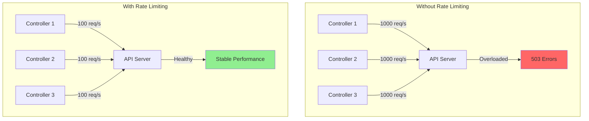

# Rate Limiting Patterns in Kubernetes Controllers

**Document**: 57-rate-limiting-patterns.md
**Status**: Course Module - Scalability & Resource Management
**Audience**: Software Engineers, SRE Teams
**Prerequisites**: Understanding of controllers, workqueues, and concurrency

---

## **Overview**

Rate limiting is essential for building scalable, well-behaved controllers that don't overwhelm the API server or external services. This document explores rate limiting algorithms, implementations, and patterns used throughout kube-controller-manager.

### **Learning Objectives**

After studying this document, you will understand:
1. Token bucket and leaky bucket algorithms
2. Workqueue rate limiting implementation
3. Client-side rate limiting strategies
4. Per-resource and global rate limiting
5. Adaptive rate limiting patterns
6. Integration with Kubernetes client-go

---

## **1. Rate Limiting Fundamentals**

### **1.1 Why Rate Limiting?**



**Key Goals**:
1. **Protect API server** from overload
2. **Prevent thundering herd** during failures
3. **Fair resource sharing** among controllers
4. **Gradual retry** for failed operations
5. **Bounded queue growth**

---

## **2. Token Bucket Algorithm**

### **2.1 Token Bucket Concept**

The token bucket is the most common rate limiting algorithm in Kubernetes.

```mermaid
stateDiagram-v2
    [*] --> BucketFull: Initialize with burst tokens

    BucketFull --> ProcessRequest: Request arrives
    ProcessRequest --> ConsumeToken: Token available
    ConsumeToken --> BucketPartial: Token consumed

    BucketPartial --> ProcessRequest: Request arrives
    ProcessRequest --> Wait: No tokens available
    Wait --> BucketPartial: Refill (time-based)

    BucketPartial --> BucketFull: Refill to capacity

    note right of BucketFull: Burst capacity:<br/>Allow sudden spikes
    note right of Wait: Rate limit:<br/>Requests queued
```

### **2.2 Token Bucket Data Structure**

```go
// Source: golang.org/x/time/rate (used by Kubernetes)

// Limiter controls the rate of events
type Limiter struct {
    mu     sync.Mutex
    limit  Limit  // Tokens per second
    burst  int    // Maximum burst size
    tokens float64
    last   time.Time  // Last token update
    lastEvent time.Time
}

// Limit is the rate (tokens per second)
type Limit float64

// NewLimiter creates a new rate limiter
// rate: tokens added per second
// burst: maximum tokens that can accumulate
func NewLimiter(r Limit, b int) *Limiter {
    return &Limiter{
        limit:  r,
        burst:  b,
        tokens: float64(b),  // Start with full bucket
        last:   time.Now(),
    }
}

// Allow reports whether an event may happen now
func (lim *Limiter) Allow() bool {
    return lim.AllowN(time.Now(), 1)
}

// AllowN reports whether n events may happen at time now
func (lim *Limiter) AllowN(now time.Time, n int) bool {
    lim.mu.Lock()
    defer lim.mu.Unlock()

    // Calculate tokens to add since last event
    elapsed := now.Sub(lim.last)
    tokensToAdd := elapsed.Seconds() * float64(lim.limit)

    // Add tokens (capped at burst)
    lim.tokens += tokensToAdd
    if lim.tokens > float64(lim.burst) {
        lim.tokens = float64(lim.burst)
    }
    lim.last = now

    // Check if we have enough tokens
    if lim.tokens >= float64(n) {
        lim.tokens -= float64(n)
        lim.lastEvent = now
        return true
    }

    return false
}

// Wait waits until the limiter permits an event
func (lim *Limiter) Wait(ctx context.Context) error {
    return lim.WaitN(ctx, 1)
}

// Reserve returns a Reservation indicating how long to wait
func (lim *Limiter) Reserve() *Reservation {
    return lim.ReserveN(time.Now(), 1)
}
```

**Example Usage**:

```go
// Create limiter: 10 requests/sec, burst of 100
limiter := rate.NewLimiter(10, 100)

// Non-blocking check
if limiter.Allow() {
    // Process request immediately
    processRequest()
} else {
    // Rate limited - queue or reject
    queueRequest()
}

// Blocking wait
ctx := context.Background()
if err := limiter.Wait(ctx); err != nil {
    // Context cancelled
    return err
}
processRequest()
```

---

## **3. Workqueue Rate Limiting**

### **3.1 Workqueue Rate Limiter Interface**

Kubernetes workqueues use pluggable rate limiters:

```go
// Source: staging/src/k8s.io/client-go/util/workqueue/rate_limiting_queue.go

type RateLimitingInterface interface {
    DelayingInterface

    // AddRateLimited adds an item to the workqueue after rate limiting
    AddRateLimited(item interface{})

    // Forget indicates successful processing, reset rate limit
    Forget(item interface{})

    // NumRequeues returns number of times item has been requeued
    NumRequeues(item interface{}) int
}

// RateLimiter determines when an item can be dequeued
type RateLimiter interface {
    // When returns how long to wait before processing item
    When(item interface{}) time.Duration

    // Forget clears rate limiting state for item
    Forget(item interface{})

    // NumRequeues returns number of failures
    NumRequeues(item interface{}) int
}
```

### **3.2 Composite Rate Limiters**

Kubernetes combines multiple rate limiting strategies:

```go
// Source: staging/src/k8s.io/client-go/util/workqueue/default_rate_limiters.go

// DefaultControllerRateLimiter combines rate limiters
func DefaultControllerRateLimiter() RateLimiter {
    return NewMaxOfRateLimiter(
        // 1. Exponential backoff: 5ms to 1000s
        NewItemExponentialFailureRateLimiter(5*time.Millisecond, 1000*time.Second),

        // 2. Token bucket: 10 QPS, burst 100
        &BucketRateLimiter{Limiter: rate.NewLimiter(rate.Limit(10), 100)},
    )
}

// MaxOfRateLimiter uses maximum delay from multiple limiters
type MaxOfRateLimiter struct {
    limiters []RateLimiter
}

func (m *MaxOfRateLimiter) When(item interface{}) time.Duration {
    ret := time.Duration(0)
    for _, limiter := range m.limiters {
        curr := limiter.When(item)
        if curr > ret {
            ret = curr
        }
    }
    return ret
}
```

### **3.3 Exponential Backoff Rate Limiter**

Per-item exponential backoff for failed operations:

```go
// ItemExponentialFailureRateLimiter increases delay exponentially
type ItemExponentialFailureRateLimiter struct {
    failuresLock sync.Mutex
    failures     map[interface{}]int  // Track failures per item

    baseDelay time.Duration  // Initial delay
    maxDelay  time.Duration  // Maximum delay
}

func NewItemExponentialFailureRateLimiter(
    baseDelay, maxDelay time.Duration,
) RateLimiter {
    return &ItemExponentialFailureRateLimiter{
        failures:  make(map[interface{}]int),
        baseDelay: baseDelay,
        maxDelay:  maxDelay,
    }
}

func (r *ItemExponentialFailureRateLimiter) When(item interface{}) time.Duration {
    r.failuresLock.Lock()
    defer r.failuresLock.Unlock()

    exp := r.failures[item]
    r.failures[item]++

    // Calculate: baseDelay * 2^exp
    backoff := float64(r.baseDelay.Nanoseconds()) * math.Pow(2, float64(exp))
    calculated := time.Duration(backoff)

    // Cap at maxDelay
    if calculated > r.maxDelay {
        return r.maxDelay
    }

    return calculated
}

func (r *ItemExponentialFailureRateLimiter) Forget(item interface{}) {
    r.failuresLock.Lock()
    defer r.failuresLock.Unlock()

    delete(r.failures, item)
}

func (r *ItemExponentialFailureRateLimiter) NumRequeues(item interface{}) int {
    r.failuresLock.Lock()
    defer r.failuresLock.Unlock()

    return r.failures[item]
}
```

**Delay Progression Example**:

| Attempt | Calculation | Delay | Cumulative |
|---------|-------------|-------|------------|
| 1 | 5ms × 2^0 | 5ms | 5ms |
| 2 | 5ms × 2^1 | 10ms | 15ms |
| 3 | 5ms × 2^2 | 20ms | 35ms |
| 4 | 5ms × 2^3 | 40ms | 75ms |
| 5 | 5ms × 2^4 | 80ms | 155ms |
| 10 | 5ms × 2^9 | 2.56s | ~5s |
| 15 | 5ms × 2^14 | 81.92s | ~3min |

---

## **4. Client-Side Rate Limiting**

### **4.1 Client QPS Configuration**

```go
// Source: staging/src/k8s.io/client-go/rest/config.go

type Config struct {
    // ... other fields

    // QPS indicates maximum queries per second
    QPS float32

    // Burst allows burst queries while still respecting QPS
    Burst int

    // RateLimiter is used for rate limiting (optional override)
    RateLimiter flowcontrol.RateLimiter
}

// Default client configuration
func DefaultClientConfig() *Config {
    return &Config{
        QPS:   5.0,    // 5 queries per second
        Burst: 10,     // Allow burst of 10
    }
}

// High-throughput configuration for controllers
func ControllerClientConfig() *Config {
    return &Config{
        QPS:   100.0,  // 100 queries per second
        Burst: 200,    // Allow burst of 200
    }
}
```

### **4.2 Per-Client Rate Limiting**

```go
// Source: staging/src/k8s.io/client-go/util/flowcontrol/throttle.go

type RateLimiter interface {
    // TryAccept returns true if a request can be accepted
    TryAccept() bool

    // Accept waits until a request can be accepted
    Accept()

    // Stop ends the rate limiter
    Stop()

    // QPS returns configured queries per second
    QPS() float32

    // Wait returns how long to wait for next request
    Wait(ctx context.Context) error
}

// tokenBucketRateLimiter implements RateLimiter using token bucket
type tokenBucketRateLimiter struct {
    limiter *rate.Limiter
    qps     float32
    burst   int
    clock   Clock
}

func NewTokenBucketRateLimiter(qps float32, burst int) RateLimiter {
    limiter := rate.NewLimiter(rate.Limit(qps), burst)
    return &tokenBucketRateLimiter{
        limiter: limiter,
        qps:     qps,
        burst:   burst,
        clock:   RealClock{},
    }
}

func (t *tokenBucketRateLimiter) TryAccept() bool {
    return t.limiter.Allow()
}

func (t *tokenBucketRateLimiter) Accept() {
    now := t.clock.Now()
    t.limiter.Wait(context.Background())
}

func (t *tokenBucketRateLimiter) Wait(ctx context.Context) error {
    return t.limiter.Wait(ctx)
}

func (t *tokenBucketRateLimiter) QPS() float32 {
    return t.qps
}
```

---

## **5. Advanced Rate Limiting Patterns**

### **5.1 Adaptive Rate Limiting**

Adjust rate limits based on server response:

```go
// Adaptive rate limiter that responds to server load
type AdaptiveRateLimiter struct {
    mu              sync.RWMutex
    currentQPS      float64
    minQPS          float64
    maxQPS          float64
    limiter         *rate.Limiter

    successCount    int
    errorCount      int
    checkInterval   time.Duration
    lastAdjustment  time.Time
}

func NewAdaptiveRateLimiter(minQPS, maxQPS float64) *AdaptiveRateLimiter {
    initialQPS := (minQPS + maxQPS) / 2
    return &AdaptiveRateLimiter{
        currentQPS:     initialQPS,
        minQPS:         minQPS,
        maxQPS:         maxQPS,
        limiter:        rate.NewLimiter(rate.Limit(initialQPS), int(initialQPS*2)),
        checkInterval:  10 * time.Second,
        lastAdjustment: time.Now(),
    }
}

func (a *AdaptiveRateLimiter) Allow() bool {
    a.mu.RLock()
    allowed := a.limiter.Allow()
    a.mu.RUnlock()

    a.maybeAdjust()
    return allowed
}

func (a *AdaptiveRateLimiter) RecordSuccess() {
    a.mu.Lock()
    a.successCount++
    a.mu.Unlock()
}

func (a *AdaptiveRateLimiter) RecordError(err error) {
    a.mu.Lock()

    // Check if error indicates server overload
    if isServerOverloaded(err) {
        a.errorCount++
    }

    a.mu.Unlock()
}

func (a *AdaptiveRateLimiter) maybeAdjust() {
    a.mu.Lock()
    defer a.mu.Unlock()

    // Check if adjustment interval has passed
    if time.Since(a.lastAdjustment) < a.checkInterval {
        return
    }

    totalRequests := a.successCount + a.errorCount
    if totalRequests == 0 {
        return
    }

    errorRate := float64(a.errorCount) / float64(totalRequests)

    // Adjust QPS based on error rate
    if errorRate > 0.1 {
        // More than 10% errors - decrease QPS
        a.currentQPS *= 0.9
        if a.currentQPS < a.minQPS {
            a.currentQPS = a.minQPS
        }
    } else if errorRate < 0.01 {
        // Less than 1% errors - increase QPS
        a.currentQPS *= 1.1
        if a.currentQPS > a.maxQPS {
            a.currentQPS = a.maxQPS
        }
    }

    // Update limiter
    a.limiter.SetLimit(rate.Limit(a.currentQPS))
    a.limiter.SetBurst(int(a.currentQPS * 2))

    // Reset counters
    a.successCount = 0
    a.errorCount = 0
    a.lastAdjustment = time.Now()

    klog.V(4).Infof("Adjusted rate limit to %.2f QPS (error rate: %.2f%%)",
        a.currentQPS, errorRate*100)
}

func isServerOverloaded(err error) bool {
    return apierrors.IsTooManyRequests(err) ||
           apierrors.IsServerTimeout(err) ||
           apierrors.IsServiceUnavailable(err)
}
```

### **5.2 Per-Resource Rate Limiting**

Different rate limits for different resource types:

```go
// ResourceAwareRateLimiter applies different limits per resource type
type ResourceAwareRateLimiter struct {
    limiters map[string]*rate.Limiter
    mu       sync.RWMutex

    // Default limits
    defaultQPS   float64
    defaultBurst int
}

func NewResourceAwareRateLimiter(defaultQPS float64, defaultBurst int) *ResourceAwareRateLimiter {
    return &ResourceAwareRateLimiter{
        limiters:     make(map[string]*rate.Limiter),
        defaultQPS:   defaultQPS,
        defaultBurst: defaultBurst,
    }
}

// SetResourceLimit configures specific limits for a resource type
func (r *ResourceAwareRateLimiter) SetResourceLimit(
    resource string,
    qps float64,
    burst int,
) {
    r.mu.Lock()
    defer r.mu.Unlock()

    r.limiters[resource] = rate.NewLimiter(rate.Limit(qps), burst)
}

// Allow checks if request for resource type is allowed
func (r *ResourceAwareRateLimiter) Allow(resource string) bool {
    r.mu.RLock()
    limiter, exists := r.limiters[resource]
    r.mu.RUnlock()

    if !exists {
        // Create default limiter for this resource
        r.mu.Lock()
        limiter = rate.NewLimiter(
            rate.Limit(r.defaultQPS),
            r.defaultBurst,
        )
        r.limiters[resource] = limiter
        r.mu.Unlock()
    }

    return limiter.Allow()
}

// Example usage
func (c *Controller) syncResource(resource string, obj interface{}) error {
    // Check resource-specific rate limit
    if !c.rateLimiter.Allow(resource) {
        klog.V(5).Infof("Rate limited for resource type: %s", resource)
        return fmt.Errorf("rate limited")
    }

    // Process resource
    return c.processResource(obj)
}

// Configuration example
func setupRateLimiter() *ResourceAwareRateLimiter {
    limiter := NewResourceAwareRateLimiter(10.0, 20) // Default: 10 QPS, burst 20

    // Higher limits for lightweight resources
    limiter.SetResourceLimit("configmaps", 50.0, 100)
    limiter.SetResourceLimit("secrets", 50.0, 100)

    // Lower limits for heavyweight resources
    limiter.SetResourceLimit("pods", 20.0, 40)
    limiter.SetResourceLimit("nodes", 5.0, 10)

    return limiter
}
```

---

## **6. Integration with Kubernetes Controllers**

### **6.1 Complete Controller Rate Limiting**

```go
// Full example: Controller with comprehensive rate limiting

type RateLimitedController struct {
    // Workqueue with rate limiting
    queue workqueue.RateLimitingInterface

    // Client with rate limiting
    client kubernetes.Interface

    // Additional adaptive limiter for external calls
    externalLimiter *AdaptiveRateLimiter

    // Per-resource limits
    resourceLimiter *ResourceAwareRateLimiter
}

func NewRateLimitedController() *RateLimitedController {
    // Create client with rate limiting
    config := &rest.Config{
        QPS:   100.0,  // 100 queries per second
        Burst: 200,    // Burst of 200
    }
    client := kubernetes.NewForConfigOrDie(config)

    // Create workqueue with rate limiting
    rateLimiter := workqueue.NewMaxOfRateLimiter(
        // Exponential backoff: 1ms to 1000s
        workqueue.NewItemExponentialFailureRateLimiter(1*time.Millisecond, 1000*time.Second),
        // Token bucket: 10 QPS, burst 100
        &workqueue.BucketRateLimiter{Limiter: rate.NewLimiter(rate.Limit(10), 100)},
    )
    queue := workqueue.NewRateLimitingQueue(rateLimiter)

    return &RateLimitedController{
        queue:           queue,
        client:          client,
        externalLimiter: NewAdaptiveRateLimiter(1.0, 100.0),
        resourceLimiter: setupRateLimiter(),
    }
}

func (c *RateLimitedController) processItem(key string) error {
    // Get resource type
    namespace, name, _ := cache.SplitMetaNamespaceKey(key)

    // Check per-resource rate limit
    if !c.resourceLimiter.Allow("pods") {
        return fmt.Errorf("rate limited for pods")
    }

    // Fetch object (client rate limited automatically)
    pod, err := c.client.CoreV1().Pods(namespace).Get(
        context.Background(),
        name,
        metav1.GetOptions{},
    )
    if err != nil {
        return err
    }

    // External API call with adaptive rate limiting
    if !c.externalLimiter.Allow() {
        return fmt.Errorf("rate limited for external API")
    }

    err = c.callExternalAPI(pod)
    if err != nil {
        c.externalLimiter.RecordError(err)
        return err
    }
    c.externalLimiter.RecordSuccess()

    return nil
}

func (c *RateLimitedController) handleError(err error, key interface{}) {
    if err == nil {
        // Success - reset rate limit
        c.queue.Forget(key)
        return
    }

    // Add with rate limiting (exponential backoff)
    c.queue.AddRateLimited(key)

    klog.V(2).Infof("Error processing %v (retries: %d): %v",
        key, c.queue.NumRequeues(key), err)
}
```

---

## **7. Monitoring Rate Limiting**

### **7.1 Rate Limiting Metrics**

```go
// Metrics for rate limiting observability
var (
    rateLimitMetric = prometheus.NewCounterVec(
        prometheus.CounterOpts{
            Name: "controller_rate_limit_total",
            Help: "Total number of rate limited requests",
        },
        []string{"controller", "resource"},
    )

    queueDelayHistogram = prometheus.NewHistogramVec(
        prometheus.HistogramOpts{
            Name:    "workqueue_rate_limit_delay_seconds",
            Help:    "Time spent waiting due to rate limiting",
            Buckets: prometheus.ExponentialBuckets(0.001, 2, 15),
        },
        []string{"controller"},
    )

    currentQPSGauge = prometheus.NewGaugeVec(
        prometheus.GaugeOpts{
            Name: "controller_current_qps",
            Help: "Current queries per second limit",
        },
        []string{"controller"},
    )
)

func (c *Controller) recordRateLimit(resource string, delay time.Duration) {
    rateLimitMetric.WithLabelValues(c.name, resource).Inc()
    queueDelayHistogram.WithLabelValues(c.name).Observe(delay.Seconds())
}
```

---

## **8. Best Practices**

### **✅ Do's**

1. **Use workqueue rate limiting** for retry logic
2. **Configure appropriate client QPS** based on controller needs
3. **Implement backoff for failures** to avoid thundering herd
4. **Monitor rate limiting metrics** to detect bottlenecks
5. **Use per-resource limits** for heterogeneous workloads
6. **Combine multiple strategies** (exponential + token bucket)
7. **Test under load** to validate rate limits

### **❌ Don'ts**

1. **Don't set QPS too high** - overwhelms API server
2. **Don't disable rate limiting** - causes cascading failures
3. **Don't use same limits for all resources** - one size doesn't fit all
4. **Don't ignore retry storms** - monitor queue depth
5. **Don't retry immediately** - always use backoff
6. **Don't forget burst capacity** - handle traffic spikes

---

## **9. Source Code References**

| Component | File Path | Description |
|-----------|-----------|-------------|
| Rate limiters | `staging/src/k8s.io/client-go/util/workqueue/default_rate_limiters.go` | Workqueue rate limiting |
| Token bucket | `golang.org/x/time/rate/rate.go` | Token bucket implementation |
| Client config | `staging/src/k8s.io/client-go/rest/config.go` | Client QPS configuration |
| Flow control | `staging/src/k8s.io/client-go/util/flowcontrol/throttle.go` | Client-side throttling |

---

## **10. Summary**

Effective rate limiting requires:
- **Token bucket algorithm** for smooth rate control
- **Exponential backoff** for failed retries
- **Client-side limits** to protect API server
- **Per-resource limits** for fairness
- **Adaptive strategies** for dynamic load
- **Comprehensive monitoring** for observability

Proper rate limiting ensures controllers scale gracefully and maintain cluster stability.
