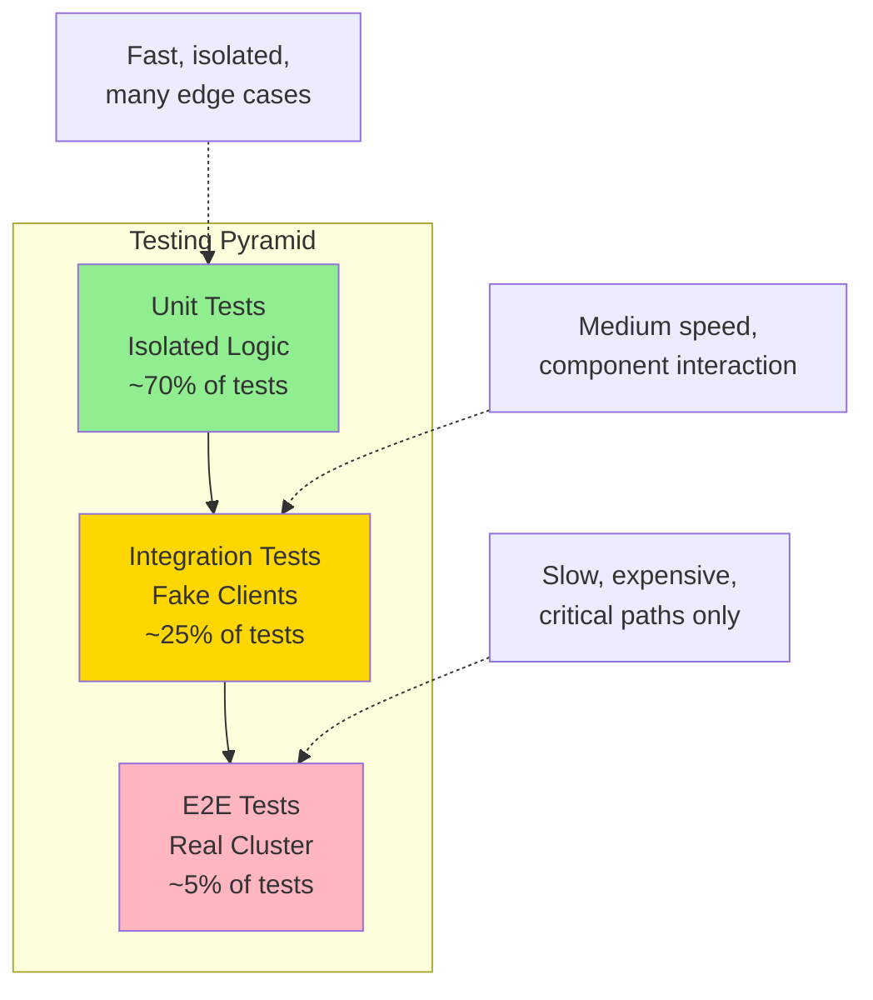

# Testing Strategies for Kubernetes Controllers

**Document**: 59-testing-strategies.md
**Status**: Course Module - Testing & Quality Assurance
**Audience**: Software Engineers, QA Engineers, Controller Developers
**Prerequisites**: Go testing, Kubernetes basics, controller patterns

---

## **Overview**

Comprehensive testing is critical for building reliable, production-grade Kubernetes controllers. This document covers testing strategies, frameworks, and best practices used in Kubernetes development.

### **Learning Objectives**

After studying this document, you will understand:
1. Unit testing strategies for controller logic
2. Integration testing with fake clients
3. End-to-end testing in real clusters
4. Table-driven test patterns
5. Mocking and stubbing techniques
6. Test coverage and quality metrics
7. Real testing examples from Kubernetes

---

## **1. Testing Pyramid for Controllers**

### **1.1 Test Layers**



**Test Distribution**:
- **Unit Tests (70%)**: Fast, isolated, cover edge cases
- **Integration Tests (25%)**: Component interactions, fake API server
- **E2E Tests (5%)**: Real cluster, critical user journeys

---

## **2. Unit Testing**

### **2.1 Unit Test Structure**

```go
// Source: Kubernetes testing patterns

package controller

import (
    "testing"
    "time"

    v1 "k8s.io/api/core/v1"
    metav1 "k8s.io/apimachinery/pkg/apis/meta/v1"
    "k8s.io/client-go/kubernetes/fake"
    "k8s.io/client-go/tools/cache"
)

// Test fixture setup
type fixture struct {
    t *testing.T

    // Fake client
    client *fake.Clientset

    // Objects to pre-populate
    podsLister   []*v1.Pod
    nodesLister  []*v1.Node

    // Expected actions
    actions []string

    // Objects from tracker
    objects []runtime.Object
}

func newFixture(t *testing.T) *fixture {
    return &fixture{
        t:       t,
        objects: []runtime.Object{},
    }
}

// TestPodCreation tests pod creation logic
func TestPodCreation(t *testing.T) {
    f := newFixture(t)

    // Setup: Create a pod object
    pod := &v1.Pod{
        ObjectMeta: metav1.ObjectMeta{
            Name:      "test-pod",
            Namespace: "default",
            UID:       "12345",
        },
        Spec: v1.PodSpec{
            Containers: []v1.Container{
                {
                    Name:  "nginx",
                    Image: "nginx:latest",
                },
            },
        },
    }

    // Add to fake client
    f.podsLister = append(f.podsLister, pod)
    f.objects = append(f.objects, pod)

    // Create controller with fake client
    c := f.newController()

    // Execute: Sync the pod
    err := c.syncPod("default/test-pod")

    // Verify: Check results
    if err != nil {
        t.Errorf("syncPod() error = %v", err)
    }

    // Verify actions taken
    actions := f.client.Actions()
    if len(actions) != 1 {
        t.Errorf("expected 1 action, got %d", len(actions))
    }

    // Verify action type
    if !actions[0].Matches("update", "pods") {
        t.Errorf("expected update action, got %v", actions[0])
    }
}

func (f *fixture) newController() *Controller {
    f.client = fake.NewSimpleClientset(f.objects...)

    informerFactory := informers.NewSharedInformerFactory(f.client, 0)
    podInformer := informerFactory.Core().V1().Pods()

    c := NewController(f.client, podInformer)

    // Populate informer cache
    for _, pod := range f.podsLister {
        podInformer.Informer().GetIndexer().Add(pod)
    }

    return c
}
```

### **2.2 Table-Driven Tests**

The preferred pattern in Kubernetes for testing multiple scenarios:

```go
// Source: pkg/controller/replicaset/replica_set_test.go

func TestSyncReplicaSet(t *testing.T) {
    tests := []struct {
        name                string
        replicas            int32
        currentPods         int
        expectedCreations   int
        expectedDeletions   int
        expectedError       bool
    }{
        {
            name:              "scale up from 0 to 3",
            replicas:          3,
            currentPods:       0,
            expectedCreations: 3,
            expectedDeletions: 0,
            expectedError:     false,
        },
        {
            name:              "scale down from 5 to 2",
            replicas:          2,
            currentPods:       5,
            expectedCreations: 0,
            expectedDeletions: 3,
            expectedError:     false,
        },
        {
            name:              "no change - already at desired",
            replicas:          3,
            currentPods:       3,
            expectedCreations: 0,
            expectedDeletions: 0,
            expectedError:     false,
        },
        {
            name:              "handle pod creation failures",
            replicas:          5,
            currentPods:       0,
            expectedCreations: 5,
            expectedDeletions: 0,
            expectedError:     true,
        },
    }

    for _, tt := range tests {
        t.Run(tt.name, func(t *testing.T) {
            // Setup
            f := newFixture(t)
            rs := newReplicaSet(tt.replicas)

            // Add existing pods
            for i := 0; i < tt.currentPods; i++ {
                pod := newPod(rs, i)
                f.podsLister = append(f.podsLister, pod)
                f.objects = append(f.objects, pod)
            }

            f.objects = append(f.objects, rs)
            c := f.newController()

            // Execute
            err := c.syncReplicaSet(getKey(rs, t))

            // Verify error expectation
            if (err != nil) != tt.expectedError {
                t.Errorf("syncReplicaSet() error = %v, expectedError %v",
                    err, tt.expectedError)
            }

            // Verify actions
            actions := filterActions(f.client.Actions())

            creations := countCreations(actions)
            if creations != tt.expectedCreations {
                t.Errorf("expected %d pod creations, got %d",
                    tt.expectedCreations, creations)
            }

            deletions := countDeletions(actions)
            if deletions != tt.expectedDeletions {
                t.Errorf("expected %d pod deletions, got %d",
                    tt.expectedDeletions, deletions)
            }
        })
    }
}

// Helper functions
func newReplicaSet(replicas int32) *apps.ReplicaSet {
    return &apps.ReplicaSet{
        ObjectMeta: metav1.ObjectMeta{
            Name:      "test-rs",
            Namespace: "default",
            UID:       "rs-12345",
        },
        Spec: apps.ReplicaSetSpec{
            Replicas: &replicas,
            Selector: &metav1.LabelSelector{
                MatchLabels: map[string]string{"app": "test"},
            },
            Template: v1.PodTemplateSpec{
                ObjectMeta: metav1.ObjectMeta{
                    Labels: map[string]string{"app": "test"},
                },
                Spec: v1.PodSpec{
                    Containers: []v1.Container{
                        {Name: "nginx", Image: "nginx"},
                    },
                },
            },
        },
    }
}

func newPod(rs *apps.ReplicaSet, index int) *v1.Pod {
    return &v1.Pod{
        ObjectMeta: metav1.ObjectMeta{
            Name:      fmt.Sprintf("test-pod-%d", index),
            Namespace: rs.Namespace,
            Labels:    rs.Spec.Template.Labels,
            OwnerReferences: []metav1.OwnerReference{
                *metav1.NewControllerRef(rs, apps.SchemeGroupVersion.WithKind("ReplicaSet")),
            },
        },
        Spec: rs.Spec.Template.Spec,
    }
}
```

---

## **3. Integration Testing**

### **3.1 Integration Test with Fake Client**

```go
// Source: test/integration patterns

func TestDeploymentControllerIntegration(t *testing.T) {
    // Create fake client
    client := fake.NewSimpleClientset()

    // Create informer factory
    informerFactory := informers.NewSharedInformerFactory(client, 0)

    // Create controller
    controller := deployment.NewDeploymentController(
        informerFactory.Apps().V1().Deployments(),
        informerFactory.Apps().V1().ReplicaSets(),
        informerFactory.Core().V1().Pods(),
        client,
    )

    // Start informers
    stopCh := make(chan struct{})
    defer close(stopCh)
    informerFactory.Start(stopCh)

    // Wait for caches to sync
    informerFactory.WaitForCacheSync(stopCh)

    // Start controller
    go controller.Run(1, stopCh)

    // Create deployment
    deployment := &apps.Deployment{
        ObjectMeta: metav1.ObjectMeta{
            Name:      "test-deployment",
            Namespace: "default",
        },
        Spec: apps.DeploymentSpec{
            Replicas: pointer.Int32(3),
            Selector: &metav1.LabelSelector{
                MatchLabels: map[string]string{"app": "nginx"},
            },
            Template: v1.PodTemplateSpec{
                ObjectMeta: metav1.ObjectMeta{
                    Labels: map[string]string{"app": "nginx"},
                },
                Spec: v1.PodSpec{
                    Containers: []v1.Container{
                        {Name: "nginx", Image: "nginx:1.14"},
                    },
                },
            },
        },
    }

    _, err := client.AppsV1().Deployments("default").Create(
        context.TODO(),
        deployment,
        metav1.CreateOptions{},
    )
    if err != nil {
        t.Fatalf("Failed to create deployment: %v", err)
    }

    // Wait for ReplicaSet to be created
    err = wait.PollImmediate(100*time.Millisecond, 10*time.Second, func() (bool, error) {
        rsList, err := client.AppsV1().ReplicaSets("default").List(
            context.TODO(),
            metav1.ListOptions{},
        )
        if err != nil {
            return false, err
        }
        return len(rsList.Items) > 0, nil
    })
    if err != nil {
        t.Fatalf("ReplicaSet was not created: %v", err)
    }

    // Verify ReplicaSet has correct replica count
    rsList, _ := client.AppsV1().ReplicaSets("default").List(
        context.TODO(),
        metav1.ListOptions{},
    )

    if len(rsList.Items) != 1 {
        t.Errorf("Expected 1 ReplicaSet, got %d", len(rsList.Items))
    }

    rs := rsList.Items[0]
    if *rs.Spec.Replicas != 3 {
        t.Errorf("Expected 3 replicas, got %d", *rs.Spec.Replicas)
    }
}
```

### **3.2 Using FakeInformer for Testing**

```go
// Custom fake informer for controlled testing
type FakePodInformer struct {
    indexer  cache.Indexer
    handlers []cache.ResourceEventHandler
}

func NewFakePodInformer() *FakePodInformer {
    return &FakePodInformer{
        indexer:  cache.NewIndexer(cache.MetaNamespaceKeyFunc, cache.Indexers{}),
        handlers: []cache.ResourceEventHandler{},
    }
}

func (f *FakePodInformer) Add(obj *v1.Pod) {
    f.indexer.Add(obj)
    for _, handler := range f.handlers {
        handler.OnAdd(obj, false)
    }
}

func (f *FakePodInformer) Update(old, new *v1.Pod) {
    f.indexer.Update(new)
    for _, handler := range f.handlers {
        handler.OnUpdate(old, new)
    }
}

func (f *FakePodInformer) Delete(obj *v1.Pod) {
    f.indexer.Delete(obj)
    for _, handler := range f.handlers {
        handler.OnDelete(obj)
    }
}

func (f *FakePodInformer) AddEventHandler(handler cache.ResourceEventHandler) {
    f.handlers = append(f.handlers, handler)
}

// Test with controlled event firing
func TestControllerWithFakeInformer(t *testing.T) {
    fakeInformer := NewFakePodInformer()
    controller := NewController(fakeInformer)

    // Simulate pod creation
    pod := &v1.Pod{
        ObjectMeta: metav1.ObjectMeta{
            Name:      "test-pod",
            Namespace: "default",
        },
    }

    fakeInformer.Add(pod)

    // Verify controller processed the add event
    // ... assertions
}
```

---

## **4. End-to-End Testing**

### **4.1 E2E Test Structure**

```go
// Source: test/e2e/apps/deployment.go

var _ = framework.KubeDescribe("Deployment", func() {
    f := framework.NewDefaultFramework("deployment")

    ginkgo.It("should create and scale a deployment", func() {
        // Setup
        deploymentName := "test-deployment"
        ns := f.Namespace.Name

        // Create deployment
        deployment := &apps.Deployment{
            ObjectMeta: metav1.ObjectMeta{
                Name: deploymentName,
            },
            Spec: apps.DeploymentSpec{
                Replicas: pointer.Int32(2),
                Selector: &metav1.LabelSelector{
                    MatchLabels: map[string]string{"app": "nginx"},
                },
                Template: v1.PodTemplateSpec{
                    ObjectMeta: metav1.ObjectMeta{
                        Labels: map[string]string{"app": "nginx"},
                    },
                    Spec: v1.PodSpec{
                        Containers: []v1.Container{
                            {
                                Name:  "nginx",
                                Image: framework.ServeHostnameImage,
                            },
                        },
                    },
                },
            },
        }

        // Create deployment in cluster
        _, err := f.ClientSet.AppsV1().Deployments(ns).Create(
            context.TODO(),
            deployment,
            metav1.CreateOptions{},
        )
        framework.ExpectNoError(err)

        // Wait for deployment to be ready
        err = e2edeployment.WaitForDeploymentComplete(
            f.ClientSet,
            deployment,
            framework.Poll,
            framework.PollShortTimeout,
        )
        framework.ExpectNoError(err, "deployment should be ready")

        // Verify pods are running
        pods, err := e2edeployment.GetPodsForDeployment(f.ClientSet, deployment)
        framework.ExpectNoError(err)
        gomega.Expect(len(pods.Items)).To(gomega.Equal(2), "should have 2 pods")

        // Scale deployment
        deployment.Spec.Replicas = pointer.Int32(4)
        _, err = f.ClientSet.AppsV1().Deployments(ns).Update(
            context.TODO(),
            deployment,
            metav1.UpdateOptions{},
        )
        framework.ExpectNoError(err)

        // Wait for scale to complete
        err = e2edeployment.WaitForDeploymentComplete(
            f.ClientSet,
            deployment,
            framework.Poll,
            framework.PollShortTimeout,
        )
        framework.ExpectNoError(err)

        // Verify scaled pods
        pods, err = e2edeployment.GetPodsForDeployment(f.ClientSet, deployment)
        framework.ExpectNoError(err)
        gomega.Expect(len(pods.Items)).To(gomega.Equal(4), "should have 4 pods after scaling")
    })
})
```

### **4.2 E2E Test Helpers**

```go
// Waiting utilities for E2E tests
func WaitForDeploymentComplete(
    c clientset.Interface,
    deployment *apps.Deployment,
    pollInterval, timeout time.Duration,
) error {
    return wait.PollImmediate(pollInterval, timeout, func() (bool, error) {
        d, err := c.AppsV1().Deployments(deployment.Namespace).Get(
            context.TODO(),
            deployment.Name,
            metav1.GetOptions{},
        )
        if err != nil {
            return false, err
        }

        // Check if deployment is complete
        return d.Status.UpdatedReplicas == *d.Spec.Replicas &&
               d.Status.Replicas == *d.Spec.Replicas &&
               d.Status.AvailableReplicas == *d.Spec.Replicas &&
               d.Status.ObservedGeneration >= d.Generation, nil
    })
}

func GetPodsForDeployment(
    c clientset.Interface,
    deployment *apps.Deployment,
) (*v1.PodList, error) {
    replicaSets, err := c.AppsV1().ReplicaSets(deployment.Namespace).List(
        context.TODO(),
        metav1.ListOptions{
            LabelSelector: labels.Set(deployment.Spec.Selector.MatchLabels).String(),
        },
    )
    if err != nil {
        return nil, err
    }

    for _, rs := range replicaSets.Items {
        if metav1.IsControlledBy(&rs, deployment) {
            return c.CoreV1().Pods(deployment.Namespace).List(
                context.TODO(),
                metav1.ListOptions{
                    LabelSelector: labels.Set(rs.Spec.Selector.MatchLabels).String(),
                },
            )
        }
    }

    return &v1.PodList{}, nil
}
```

---

## **5. Mocking & Stubbing**

### **5.1 Interface-Based Mocking**

```go
// Define interfaces for dependencies
type CloudProvider interface {
    GetNodeResources(nodeName string) (*Resources, error)
    CreateLoadBalancer(service *v1.Service) (*LoadBalancer, error)
}

// Mock implementation for testing
type MockCloudProvider struct {
    GetNodeResourcesFunc      func(string) (*Resources, error)
    CreateLoadBalancerFunc    func(*v1.Service) (*LoadBalancer, error)

    // Call tracking
    GetNodeResourcesCalls     []string
    CreateLoadBalancerCalls   []*v1.Service
}

func (m *MockCloudProvider) GetNodeResources(nodeName string) (*Resources, error) {
    m.GetNodeResourcesCalls = append(m.GetNodeResourcesCalls, nodeName)

    if m.GetNodeResourcesFunc != nil {
        return m.GetNodeResourcesFunc(nodeName)
    }

    // Default behavior
    return &Resources{CPU: "4", Memory: "8Gi"}, nil
}

func (m *MockCloudProvider) CreateLoadBalancer(service *v1.Service) (*LoadBalancer, error) {
    m.CreateLoadBalancerCalls = append(m.CreateLoadBalancerCalls, service)

    if m.CreateLoadBalancerFunc != nil {
        return m.CreateLoadBalancerFunc(service)
    }

    // Default behavior
    return &LoadBalancer{IP: "1.2.3.4"}, nil
}

// Test using mock
func TestCloudNodeController(t *testing.T) {
    mock := &MockCloudProvider{
        GetNodeResourcesFunc: func(name string) (*Resources, error) {
            if name == "failing-node" {
                return nil, errors.New("node not found")
            }
            return &Resources{CPU: "8", Memory: "16Gi"}, nil
        },
    }

    controller := NewCloudNodeController(mock)

    // Test successful case
    err := controller.SyncNode("normal-node")
    if err != nil {
        t.Errorf("unexpected error: %v", err)
    }

    // Verify mock was called
    if len(mock.GetNodeResourcesCalls) != 1 {
        t.Errorf("expected 1 call, got %d", len(mock.GetNodeResourcesCalls))
    }

    // Test error case
    err = controller.SyncNode("failing-node")
    if err == nil {
        t.Error("expected error for failing node")
    }
}
```

### **5.2 Generated Mocks with gomock**

```go
// Generate mocks: mockgen -source=interface.go -destination=mock_interface.go

// Using gomock
import (
    "testing"
    "github.com/golang/mock/gomock"
)

func TestWithGomock(t *testing.T) {
    ctrl := gomock.NewController(t)
    defer ctrl.Finish()

    // Create mock
    mockCloud := NewMockCloudProvider(ctrl)

    // Set expectations
    mockCloud.EXPECT().
        GetNodeResources("test-node").
        Return(&Resources{CPU: "4", Memory: "8Gi"}, nil).
        Times(1)

    // Use mock
    controller := NewController(mockCloud)
    err := controller.SyncNode("test-node")

    if err != nil {
        t.Errorf("unexpected error: %v", err)
    }

    // gomock automatically verifies expectations
}
```

---

## **6. Test Coverage & Quality**

### **6.1 Measuring Coverage**

```bash
# Run tests with coverage
go test ./pkg/controller/... -coverprofile=coverage.out

# View coverage report
go tool cover -html=coverage.out

# Coverage summary
go tool cover -func=coverage.out

# Example output:
# pkg/controller/deployment/deployment.go:100:  syncDeployment     95.2%
# pkg/controller/deployment/deployment.go:200:  scaleReplicaSet    88.7%
# pkg/controller/deployment/deployment.go:300:  cleanupOldRS       100.0%
# total:                                         (statements)       92.3%
```

### **6.2 Coverage Requirements**

```go
// Coverage goals for different code types
const (
    // Core logic: 90%+ coverage
    CoreLogicCoverageTarget = 90.0

    // Edge case handling: 80%+ coverage
    EdgeCaseCoverageTarget = 80.0

    // Error paths: 70%+ coverage
    ErrorPathCoverageTarget = 70.0
)

// CI check for coverage
func CheckCoverage(t *testing.T, coverageFile string) {
    profiles, err := cover.ParseProfiles(coverageFile)
    if err != nil {
        t.Fatalf("Failed to parse coverage: %v", err)
    }

    totalStatements := 0
    coveredStatements := 0

    for _, profile := range profiles {
        for _, block := range profile.Blocks {
            totalStatements += block.NumStmt
            if block.Count > 0 {
                coveredStatements += block.NumStmt
            }
        }
    }

    coverage := float64(coveredStatements) / float64(totalStatements) * 100

    if coverage < CoreLogicCoverageTarget {
        t.Errorf("Coverage %.2f%% is below target %.2f%%",
            coverage, CoreLogicCoverageTarget)
    }
}
```

---

## **7. Advanced Testing Patterns**

### **7.1 Race Detection**

```bash
# Run tests with race detector
go test -race ./pkg/controller/...

# Example race condition
type Counter struct {
    value int  // Not thread-safe!
}

func (c *Counter) Increment() {
    c.value++  // Race!
}

// Fixed with mutex
type SafeCounter struct {
    mu    sync.Mutex
    value int
}

func (c *SafeCounter) Increment() {
    c.mu.Lock()
    defer c.mu.Unlock()
    c.value++
}
```

### **7.2 Fuzz Testing**

```go
// Fuzz test for input validation
func FuzzValidatePodSpec(f *testing.F) {
    // Seed corpus
    f.Add("valid-name", "nginx:latest", int32(1))
    f.Add("", "nginx", int32(0))
    f.Add("invalid name!", "", int32(-1))

    f.Fuzz(func(t *testing.T, name, image string, replicas int32) {
        pod := &v1.Pod{
            ObjectMeta: metav1.ObjectMeta{
                Name: name,
            },
            Spec: v1.PodSpec{
                Containers: []v1.Container{
                    {
                        Name:  "test",
                        Image: image,
                    },
                },
            },
        }

        // Should not panic
        _ = ValidatePodSpec(pod)
    })
}
```

### **7.3 Benchmark Tests**

```go
// Benchmark controller sync performance
func BenchmarkSyncDeployment(b *testing.B) {
    // Setup
    f := newFixture(b)
    deployment := newDeployment(100) // 100 replicas
    c := f.newController()

    b.ResetTimer()

    for i := 0; i < b.N; i++ {
        _ = c.syncDeployment(getKey(deployment, b))
    }
}

// Benchmark with different replica counts
func BenchmarkSyncDeploymentScaling(b *testing.B) {
    replicaCounts := []int32{10, 50, 100, 500, 1000}

    for _, replicas := range replicaCounts {
        b.Run(fmt.Sprintf("replicas=%d", replicas), func(b *testing.B) {
            f := newFixture(b)
            deployment := newDeployment(replicas)
            c := f.newController()

            b.ResetTimer()

            for i := 0; i < b.N; i++ {
                _ = c.syncDeployment(getKey(deployment, b))
            }
        })
    }
}

// Results:
// BenchmarkSyncDeploymentScaling/replicas=10-8      50000    25000 ns/op
// BenchmarkSyncDeploymentScaling/replicas=50-8      20000    60000 ns/op
// BenchmarkSyncDeploymentScaling/replicas=100-8     10000   120000 ns/op
// BenchmarkSyncDeploymentScaling/replicas=500-8      2000   600000 ns/op
// BenchmarkSyncDeploymentScaling/replicas=1000-8     1000  1200000 ns/op
```

---

## **8. CI/CD Integration**

### **8.1 Test Automation**

```yaml
# .github/workflows/tests.yml
name: Tests

on: [push, pull_request]

jobs:
  unit-tests:
    runs-on: ubuntu-latest
    steps:
      - uses: actions/checkout@v2

      - name: Set up Go
        uses: actions/setup-go@v2
        with:
          go-version: 1.21

      - name: Run unit tests
        run: |
          go test ./pkg/controller/... \
            -race \
            -coverprofile=coverage.out \
            -covermode=atomic

      - name: Upload coverage
        uses: codecov/codecov-action@v2
        with:
          files: ./coverage.out

  integration-tests:
    runs-on: ubuntu-latest
    steps:
      - uses: actions/checkout@v2

      - name: Run integration tests
        run: |
          go test ./test/integration/... \
            -timeout=30m

  e2e-tests:
    runs-on: ubuntu-latest
    steps:
      - uses: actions/checkout@v2

      - name: Create kind cluster
        uses: helm/kind-action@v1

      - name: Run E2E tests
        run: |
          go test ./test/e2e/... \
            -timeout=60m \
            -ginkgo.v
```

---

## **9. Best Practices Summary**

### **✅ Testing Checklist**

1. **Use table-driven tests** for multiple scenarios
2. **Test error paths** as thoroughly as success paths
3. **Mock external dependencies** for isolation
4. **Measure and maintain coverage** (>80% for core logic)
5. **Run race detector** to catch concurrency bugs
6. **Benchmark performance** for critical paths
7. **Use fake clients** for integration tests
8. **E2E tests for critical flows** only (expensive)
9. **Automate in CI/CD** for continuous validation
10. **Review test failures** immediately - don't ignore flakes

---

## **10. Source Code References**

| Component | File Path | Description |
|-----------|-----------|-------------|
| Unit tests | `pkg/controller/replicaset/replica_set_test.go` | ReplicaSet unit tests |
| Integration tests | `test/integration/replicaset/replicaset_test.go` | Integration test examples |
| E2E tests | `test/e2e/apps/deployment.go` | E2E test patterns |
| Fake clients | `staging/src/k8s.io/client-go/kubernetes/fake/clientset.go` | Fake client implementation |
| Test framework | `test/e2e/framework/framework.go` | E2E test framework |

---

## **Summary**

Comprehensive testing requires:
- **Unit tests (70%)** - Fast, isolated, edge cases
- **Integration tests (25%)** - Component interactions
- **E2E tests (5%)** - Critical user journeys
- **Table-driven patterns** - Multiple scenarios efficiently
- **Mocking** - Isolate dependencies
- **Coverage metrics** - Measure quality
- **CI/CD automation** - Continuous validation

Well-tested controllers are reliable, maintainable, and production-ready.
