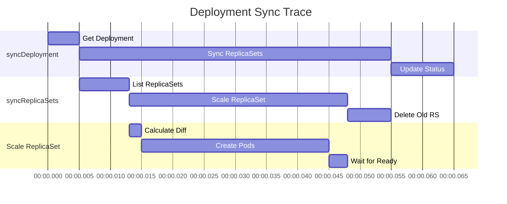

# Debugging Kubernetes Controllers

**Document**: 60-debugging-controllers.md
**Status**: Course Module - Debugging & Troubleshooting
**Audience**: Software Engineers, SRE Teams, DevOps Engineers
**Prerequisites**: Go debugging, Kubernetes basics, controller patterns

---

## **Overview**

Debugging controllers requires specialized tools and techniques beyond standard application debugging. This document covers profiling, tracing, logging, and troubleshooting strategies for Kubernetes controllers.

### **Learning Objectives**

After studying this document, you will understand:
1. Using Delve for interactive debugging
2. CPU and memory profiling with pprof
3. Distributed tracing patterns
4. Structured logging best practices
5. Metrics-based debugging
6. Common controller issues and solutions
7. Production debugging techniques

---

## **1. Interactive Debugging with Delve**

### **1.1 Delve Setup**

```bash
# Install Delve
go install github.com/go-delve/delve/cmd/dlv@latest

# Debug a controller
dlv debug ./cmd/kube-controller-manager -- \
  --kubeconfig=/path/to/kubeconfig \
  --leader-elect=false \
  --controllers=deployment,replicaset

# Common Delve commands
(dlv) break pkg/controller/deployment/deployment.go:450
(dlv) continue
(dlv) print deployment
(dlv) step
(dlv) next
(dlv) locals
(dlv) goroutines
(dlv) stack
```

### **1.2 Conditional Breakpoints**

```go
// Set breakpoint only when specific condition is met
// In Delve:
(dlv) break pkg/controller/deployment/deployment.go:450
(dlv) condition 1 deployment.Name == "problematic-deployment"

// Or use runtime breakpoints in code for development
func (dc *DeploymentController) syncDeployment(key string) error {
    deployment, err := dc.dLister.Deployments(namespace).Get(name)
    if err != nil {
        return err
    }

    // Debug specific deployment
    if deployment.Name == "debug-me" && os.Getenv("DEBUG") == "true" {
        runtime.Breakpoint() // Triggers debugger
    }

    // ... rest of sync logic
}
```

### **1.3 Remote Debugging**

```yaml
# Dockerfile with Delve
FROM golang:1.21 AS builder
WORKDIR /workspace
COPY . .
RUN go install github.com/go-delve/delve/cmd/dlv@latest
RUN CGO_ENABLED=0 go build -gcflags="all=-N -l" -o controller-manager cmd/kube-controller-manager/main.go

FROM gcr.io/distroless/base
COPY --from=builder /go/bin/dlv /
COPY --from=builder /workspace/controller-manager /
EXPOSE 40000
ENTRYPOINT ["/dlv", "--listen=:40000", "--headless=true", "--api-version=2", "exec", "/controller-manager", "--"]
```

```bash
# Port forward to debugging pod
kubectl port-forward pod/kube-controller-manager-debug 40000:40000

# Connect from local machine
dlv connect localhost:40000
```

---

## **2. CPU & Memory Profiling**

### **2.1 pprof Integration**

```go
// Enable pprof in controller
import (
    _ "net/http/pprof"
    "net/http"
)

func main() {
    // Start pprof server
    go func() {
        klog.Info("Starting pprof server on :6060")
        if err := http.ListenAndServe("localhost:6060", nil); err != nil {
            klog.Fatalf("pprof server failed: %v", err)
        }
    }()

    // Run controller
    runController()
}
```

### **2.2 CPU Profiling**

```bash
# Collect 30-second CPU profile
curl http://localhost:6060/debug/pprof/profile?seconds=30 > cpu.prof

# Analyze with pprof
go tool pprof cpu.prof

# Interactive pprof commands
(pprof) top10              # Top 10 CPU consumers
(pprof) list syncDeployment # Source code with CPU time
(pprof) web                # Open graphical view
(pprof) pdf > cpu.pdf      # Export to PDF

# Example output:
# Showing nodes accounting for 2.5s, 83.33% of 3s total
# Showing top 10 nodes out of 89
#       flat  flat%   sum%        cum   cum%
#      0.8s 26.67% 26.67%      1.2s 40.00%  k8s.io/client-go/tools/cache.(*Indexer).ByIndex
#      0.6s 20.00% 46.67%      0.9s 30.00%  encoding/json.Marshal
#      0.3s 10.00% 56.67%      0.5s 16.67%  k8s.io/apimachinery/pkg/runtime.Convert
#      0.2s  6.67% 63.33%      0.4s 13.33%  reflect.Value.Call
```

### **2.3 Memory Profiling**

```bash
# Collect heap profile
curl http://localhost:6060/debug/pprof/heap > heap.prof

# Analyze memory usage
go tool pprof heap.prof

(pprof) top10 -cum         # Cumulative memory allocation
(pprof) list newDeployment # Memory allocations in function
(pprof) png > heap.png     # Visual graph

# Memory leak detection
# Take heap snapshot before
curl http://localhost:6060/debug/pprof/heap > heap-before.prof

# Run workload, wait some time
sleep 300

# Take heap snapshot after
curl http://localhost:6060/debug/pprof/heap > heap-after.prof

# Compare snapshots
go tool pprof -base=heap-before.prof heap-after.prof
```

### **2.4 Goroutine Profiling**

```bash
# Check for goroutine leaks
curl http://localhost:6060/debug/pprof/goroutine > goroutine.prof

go tool pprof goroutine.prof

(pprof) top10

# Example output showing leak:
#       flat  flat%   sum%        cum   cum%
#      1500  75.00% 75.00%     1500  75.00%  runtime.gopark  # Too many parked goroutines!
#       300  15.00% 90.00%      300  15.00%  time.Sleep
#       200  10.00% 100.00%     200  10.00%  net.(*netFD).Read

# Investigate specific goroutine
(pprof) list runtime.gopark

# View all goroutines
curl http://localhost:6060/debug/pprof/goroutine?debug=2
```

---

## **3. Distributed Tracing**

### **3.1 OpenTelemetry Integration**

```go
import (
    "go.opentelemetry.io/otel"
    "go.opentelemetry.io/otel/trace"
    "go.opentelemetry.io/otel/attribute"
)

// Initialize tracer
var tracer trace.Tracer

func initTracing() {
    // Setup OpenTelemetry exporter (Jaeger, Zipkin, etc.)
    exporter, err := jaeger.New(jaeger.WithCollectorEndpoint())
    if err != nil {
        klog.Fatal(err)
    }

    tp := tracesdk.NewTracerProvider(
        tracesdk.WithBatcher(exporter),
        tracesdk.WithResource(resource.NewWithAttributes(
            semconv.SchemaURL,
            semconv.ServiceNameKey.String("kube-controller-manager"),
        )),
    )

    otel.SetTracerProvider(tp)
    tracer = tp.Tracer("deployment-controller")
}

// Traced controller sync
func (dc *DeploymentController) syncDeployment(ctx context.Context, key string) error {
    // Start span
    ctx, span := tracer.Start(ctx, "syncDeployment",
        trace.WithAttributes(
            attribute.String("deployment.key", key),
        ))
    defer span.End()

    namespace, name, err := cache.SplitMetaNamespaceKey(key)
    if err != nil {
        span.RecordError(err)
        span.SetStatus(codes.Error, "invalid key")
        return err
    }

    // Nested span for get operation
    ctx, getSpan := tracer.Start(ctx, "getDeployment")
    deployment, err := dc.dLister.Deployments(namespace).Get(name)
    getSpan.End()

    if err != nil {
        span.RecordError(err)
        return err
    }

    // Add deployment details to span
    span.SetAttributes(
        attribute.String("deployment.name", deployment.Name),
        attribute.String("deployment.namespace", deployment.Namespace),
        attribute.Int("deployment.replicas", int(*deployment.Spec.Replicas)),
    )

    // Sync ReplicaSets with tracing
    if err := dc.syncReplicaSets(ctx, deployment); err != nil {
        span.RecordError(err)
        span.SetStatus(codes.Error, "failed to sync replicasets")
        return err
    }

    span.SetStatus(codes.Ok, "success")
    return nil
}
```

### **3.2 Trace Visualization**



---

## **4. Structured Logging**

### **4.1 klog Best Practices**

```go
import (
    "k8s.io/klog/v2"
)

// Structured logging with klog
func (dc *DeploymentController) syncDeployment(key string) error {
    // Info level (V=2) for normal operations
    klog.V(2).InfoS("Syncing deployment",
        "deployment", key,
        "controller", "deployment",
    )

    namespace, name, err := cache.SplitMetaNamespaceKey(key)
    if err != nil {
        // Error level for failures
        klog.ErrorS(err, "Failed to parse deployment key",
            "key", key,
        )
        return err
    }

    deployment, err := dc.dLister.Deployments(namespace).Get(name)
    if err != nil {
        if apierrors.IsNotFound(err) {
            // V=4 for detailed debug info
            klog.V(4).InfoS("Deployment not found, assuming deleted",
                "deployment", key,
            )
            return nil
        }
        klog.ErrorS(err, "Failed to get deployment",
            "namespace", namespace,
            "name", name,
        )
        return err
    }

    // V=5 for very verbose debugging
    klog.V(5).InfoS("Deployment details",
        "deployment", key,
        "replicas", *deployment.Spec.Replicas,
        "strategy", deployment.Spec.Strategy.Type,
        "generation", deployment.Generation,
    )

    // ... sync logic

    klog.V(2).InfoS("Successfully synced deployment",
        "deployment", key,
        "duration", time.Since(startTime),
    )

    return nil
}

// Logging verbosity levels:
// V(0) - Always logged (errors, warnings)
// V(2) - Important operations (sync start/end)
// V(4) - Detailed debugging (cache hits/misses)
// V(5) - Very verbose (object dumps)
```

### **4.2 Log Aggregation Queries**

```bash
# kubectl logs filtering
kubectl logs kube-controller-manager-xyz -n kube-system \
  | grep "deployment" \
  | jq 'select(.deployment == "problematic-deployment")'

# Example structured log output (JSON):
# {
#   "ts": "2025-01-05T10:30:15.123Z",
#   "level": "info",
#   "msg": "Syncing deployment",
#   "deployment": "default/my-deployment",
#   "controller": "deployment",
#   "replicas": 3
# }

# Grafana Loki query
{app="kube-controller-manager"}
  | json
  | deployment="default/my-deployment"
  | level="error"
```

---

## **5. Metrics-Based Debugging**

### **5.1 Controller Metrics**

```go
import (
    "github.com/prometheus/client_golang/prometheus"
)

var (
    syncDuration = prometheus.NewHistogramVec(
        prometheus.HistogramOpts{
            Name:    "controller_sync_duration_seconds",
            Help:    "Time taken to sync a resource",
            Buckets: prometheus.ExponentialBuckets(0.001, 2, 15),
        },
        []string{"controller", "result"},
    )

    syncErrors = prometheus.NewCounterVec(
        prometheus.CounterOpts{
            Name: "controller_sync_errors_total",
            Help: "Total sync errors by controller and type",
        },
        []string{"controller", "error_type"},
    )

    queueDepth = prometheus.NewGaugeVec(
        prometheus.GaugeOpts{
            Name: "controller_queue_depth",
            Help: "Current depth of controller workqueue",
        },
        []string{"controller"},
    )

    workerUtilization = prometheus.NewGaugeVec(
        prometheus.GaugeOpts{
            Name: "controller_worker_utilization",
            Help: "Percentage of time workers are busy",
        },
        []string{"controller"},
    )
)

func (dc *DeploymentController) syncWithMetrics(key string) error {
    start := time.Now()
    result := "success"

    err := dc.syncDeployment(key)

    if err != nil {
        result = "error"
        errorType := classifyError(err)
        syncErrors.WithLabelValues("deployment", errorType).Inc()
    }

    duration := time.Since(start)
    syncDuration.WithLabelValues("deployment", result).Observe(duration.Seconds())

    return err
}

// Monitor queue depth
func (dc *DeploymentController) updateQueueMetrics() {
    ticker := time.NewTicker(10 * time.Second)
    defer ticker.Stop()

    for range ticker.C {
        depth := dc.queue.Len()
        queueDepth.WithLabelValues("deployment").Set(float64(depth))
    }
}
```

### **5.2 Debugging with Prometheus Queries**

```promql
# High sync latency
histogram_quantile(0.99,
  rate(controller_sync_duration_seconds_bucket{controller="deployment"}[5m])
) > 1

# Error rate spike
rate(controller_sync_errors_total{controller="deployment"}[5m]) > 0.1

# Queue backing up
controller_queue_depth{controller="deployment"} > 1000

# Worker saturation
controller_worker_utilization{controller="deployment"} > 0.9

# Alert on sustained errors
ALERT ControllerHighErrorRate
  IF rate(controller_sync_errors_total[5m]) > 0.05
  FOR 10m
  ANNOTATIONS {
    summary = "Controller {{ $labels.controller }} error rate > 5%",
    description = "Error rate: {{ $value }}"
  }
```

---

## **6. Common Issues & Solutions**

### **6.1 Issue: Controller Not Processing Items**

**Symptoms**:
- Queue depth increasing
- Resources not being updated
- No errors in logs

**Debugging Steps**:

```bash
# 1. Check if controller is running
kubectl get pods -n kube-system | grep controller-manager

# 2. Check leader election
kubectl get lease -n kube-system kube-controller-manager

# 3. Check logs for errors
kubectl logs kube-controller-manager-xyz -n kube-system --tail=100

# 4. Check metrics
curl http://localhost:6060/metrics | grep queue_depth

# 5. Check for goroutine leak
curl http://localhost:6060/debug/pprof/goroutine?debug=2 | grep -c "goroutine"
```

**Common Causes**:
1. **Leader election lost** - Another instance took over
2. **Informer cache not synced** - Waiting for initial sync
3. **Worker pool blocked** - All workers stuck on slow operation
4. **Rate limiter blocking** - Too many retries, exponential backoff

**Solutions**:

```go
// Check if caches are synced
if !cache.WaitForCacheSync(stopCh, dc.deploymentsSynced, dc.replicaSetsSynced) {
    klog.Error("Failed to sync caches")
    return
}

// Check leader election
if !dc.isLeader() {
    klog.V(4).Info("Not leader, skipping")
    return
}

// Add timeout to prevent worker blocking
ctx, cancel := context.WithTimeout(context.Background(), 30*time.Second)
defer cancel()

err := dc.syncWithTimeout(ctx, key)
```

### **6.2 Issue: High Memory Usage**

**Debugging**:

```bash
# Memory profile
curl http://localhost:6060/debug/pprof/heap > heap.prof
go tool pprof -http=:8080 heap.prof

# Check for specific leaks
go tool pprof -alloc_objects heap.prof
(pprof) top10
```

**Common Causes**:
1. **Large informer caches** - Too many objects cached
2. **Memory leaks in goroutines** - Goroutines not being cleaned up
3. **Deep copying too frequently** - Unnecessary DeepCopy() calls
4. **Large objects in workqueue** - Storing entire objects instead of keys

**Solutions**:

```go
// Use object pools
var podPool = sync.Pool{
    New: func() interface{} {
        return &v1.Pod{}
    },
}

// Minimize deep copies
func (dc *DeploymentController) processObject(obj interface{}) error {
    // Read-only access - no copy needed
    deployment := obj.(*apps.Deployment)
    klog.InfoS("Processing", "deployment", deployment.Name)

    // Only copy when modifying
    if needsUpdate(deployment) {
        deploymentCopy := deployment.DeepCopy()
        return dc.updateDeployment(deploymentCopy)
    }

    return nil
}

// Use field selectors to reduce cache size
fieldSelector := fields.OneTermEqualSelector("status.phase", "Running")
```

### **6.3 Issue: Reconciliation Loops**

**Symptoms**:
- Same resource being synced repeatedly
- High CPU usage
- Logs showing continuous sync attempts

**Debugging**:

```go
// Add tracking to detect loops
type SyncTracker struct {
    mu        sync.Mutex
    lastSyncs map[string]time.Time
}

func (t *SyncTracker) RecordSync(key string) bool {
    t.mu.Lock()
    defer t.mu.Unlock()

    last, exists := t.lastSyncs[key]
    if exists && time.Since(last) < 100*time.Millisecond {
        klog.WarningS("Rapid re-sync detected - possible loop",
            "key", key,
            "lastSync", last,
        )
        return false // Potential loop
    }

    t.lastSyncs[key] = time.Now()
    return true
}
```

**Common Causes**:
1. **Status updates triggering re-sync** - Update events looping back
2. **Expectations not being tracked** - Controller creates pods repeatedly
3. **Selector mismatch** - Controller adopts/releases pods in loop

**Solutions**:

```go
// Use GenerationObserved to prevent status update loops
if deployment.Status.ObservedGeneration >= deployment.Generation {
    // Already processed this version
    return nil
}

// Track expectations
dc.expectations.SetExpectations(key, creates, deletes)

// Only update status if changed
if !reflect.DeepEqual(oldStatus, newStatus) {
    deployment.Status = newStatus
    dc.updateStatus(deployment)
}
```

---

## **7. Production Debugging Techniques**

### **7.1 Live Debugging Without Restart**

```bash
# Increase log verbosity temporarily
kubectl exec -it kube-controller-manager-xyz -n kube-system -- \
  kill -USR1 $(pidof kube-controller-manager)

# Or use dynamic log level (if supported)
curl -X PUT http://localhost:6060/debug/flags/v -d "5"
```

### **7.2 Network Tracing**

```bash
# Capture API server traffic
kubectl exec -it kube-controller-manager-xyz -n kube-system -- \
  tcpdump -i any -w /tmp/api-traffic.pcap port 443

# Analyze with Wireshark
wireshark /tmp/api-traffic.pcap
```

### **7.3 Core Dumps**

```bash
# Enable core dumps
ulimit -c unlimited

# Analyze core dump
dlv core ./kube-controller-manager ./core.12345

(dlv) goroutines
(dlv) goroutine 100
(dlv) stack
(dlv) locals
```

---

## **8. Debugging Checklist**

### **✅ Before Debugging**

1. ☐ Collect recent logs (last 1000 lines)
2. ☐ Check metrics dashboard
3. ☐ Verify leader election status
4. ☐ Check resource quotas and limits
5. ☐ Review recent changes (deployments, config)

### **✅ During Debugging**

1. ☐ Reproduce issue consistently
2. ☐ Isolate to specific component
3. ☐ Enable verbose logging
4. ☐ Collect profiles (CPU, memory, goroutine)
5. ☐ Check for race conditions
6. ☐ Review distributed traces

### **✅ After Debugging**

1. ☐ Document root cause
2. ☐ Add tests to prevent regression
3. ☐ Update monitoring/alerts
4. ☐ Share learnings with team
5. ☐ Restore normal logging levels

---

## **9. Tools Reference**

| Tool | Purpose | Command |
|------|---------|---------|
| Delve | Interactive debugging | `dlv debug ./cmd/...` |
| pprof | CPU/memory profiling | `go tool pprof http://localhost:6060/debug/pprof/profile` |
| trace | Execution tracing | `curl http://localhost:6060/debug/pprof/trace?seconds=5 > trace.out` |
| klog | Structured logging | `klog.V(2).InfoS(...)` |
| Prometheus | Metrics collection | `curl http://localhost:6060/metrics` |
| Jaeger | Distributed tracing | OpenTelemetry integration |

---

## **10. Source Code References**

| Component | File Path | Description |
|-----------|-----------|-------------|
| pprof setup | `cmd/kube-controller-manager/app/controllermanager.go` | Profiling integration |
| Metrics | `pkg/controller/deployment/metrics/metrics.go` | Controller metrics |
| Logging | Throughout codebase | klog usage patterns |

---

## **Summary**

Effective debugging requires:
- **Interactive debugging** with Delve for step-through analysis
- **Profiling** for performance bottlenecks (CPU, memory, goroutines)
- **Distributed tracing** for understanding request flows
- **Structured logging** for searchable, analyzable logs
- **Metrics** for quantitative health monitoring
- **Systematic approach** to isolate and resolve issues

Master these tools to quickly diagnose and fix controller issues in production.
