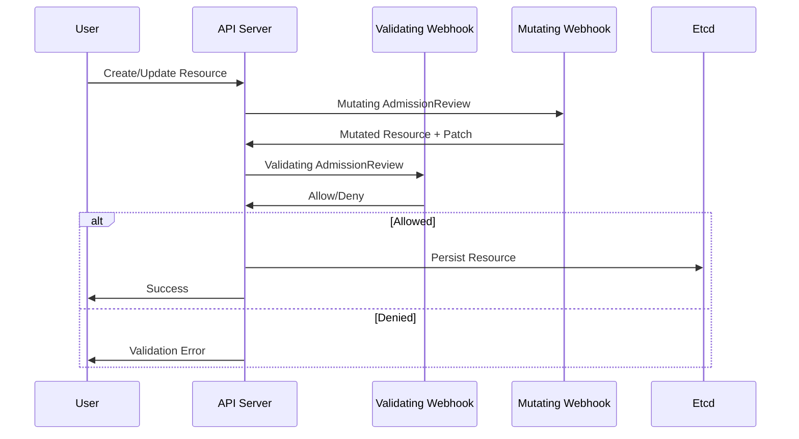

# Webhook Integration with Controllers

**Document**: 62-webhook-integration.md
**Status**: Course Module - Advanced Integration Patterns
**Audience**: Platform Engineers, Controller Developers
**Prerequisites**: Controller basics, HTTP servers, TLS/certificates

---

## **Overview**

Admission webhooks allow controllers to validate and mutate Kubernetes resources before they're persisted. This document covers webhook patterns, implementation, and integration with controllers.

### **Learning Objectives**

1. Validating and mutating webhook patterns
2. Webhook server implementation
3. Certificate management for webhooks
4. Integration with controller lifecycle
5. Testing webhook logic
6. Production deployment considerations

---

## **1. Webhook Types**

### **1.1 Architecture**



---

## **2. Validating Webhook**

### **2.1 Implementation**

```go
// Validating webhook for Pod security
package webhook

import (
    "context"
    "encoding/json"
    "net/http"

    admissionv1 "k8s.io/api/admission/v1"
    corev1 "k8s.io/api/core/v1"
    metav1 "k8s.io/apimachinery/pkg/apis/meta/v1"
)

type PodValidator struct{}

func (v *PodValidator) ServeHTTP(w http.ResponseWriter, r *http.Request) {
    // Parse AdmissionReview
    var admissionReview admissionv1.AdmissionReview
    if err := json.NewDecoder(r.Body).Decode(&admissionReview); err != nil {
        http.Error(w, err.Error(), http.StatusBadRequest)
        return
    }

    // Validate the pod
    response := v.validate(admissionReview.Request)

    // Send response
    admissionReview.Response = response
    json.NewEncoder(w).Encode(admissionReview)
}

func (v *PodValidator) validate(req *admissionv1.AdmissionRequest) *admissionv1.AdmissionResponse {
    // Decode pod
    var pod corev1.Pod
    if err := json.Unmarshal(req.Object.Raw, &pod); err != nil {
        return &admissionv1.AdmissionResponse{
            UID:     req.UID,
            Allowed: false,
            Result: &metav1.Status{
                Message: fmt.Sprintf("failed to decode pod: %v", err),
            },
        }
    }

    // Validation logic
    if pod.Spec.HostNetwork && !v.isPrivileged(pod) {
        return &admissionv1.AdmissionResponse{
            UID:     req.UID,
            Allowed: false,
            Result: &metav1.Status{
                Message: "hostNetwork requires privileged service account",
                Code:    http.StatusForbidden,
            },
        }
    }

    // Validation passed
    return &admissionv1.AdmissionResponse{
        UID:     req.UID,
        Allowed: true,
    }
}
```

---

## **3. Mutating Webhook**

### **3.1 JSON Patch Implementation**

```go
// Mutating webhook that injects sidecars
type SidecarInjector struct{}

func (m *SidecarInjector) mutate(req *admissionv1.AdmissionRequest) *admissionv1.AdmissionResponse {
    var pod corev1.Pod
    json.Unmarshal(req.Object.Raw, &pod)

    // Check if injection is needed
    if pod.Annotations["sidecar.example.com/inject"] != "true" {
        return &admissionv1.AdmissionResponse{
            UID:     req.UID,
            Allowed: true,
        }
    }

    // Create JSON patches
    patches := []map[string]interface{}{
        {
            "op":    "add",
            "path":  "/spec/containers/-",
            "value": m.getSidecarContainer(),
        },
        {
            "op":    "add",
            "path":  "/metadata/labels/sidecar-injected",
            "value": "true",
        },
    }

    patchBytes, _ := json.Marshal(patches)

    return &admissionv1.AdmissionResponse{
        UID:     req.UID,
        Allowed: true,
        Patch:   patchBytes,
        PatchType: func() *admissionv1.PatchType {
            pt := admissionv1.PatchTypeJSONPatch
            return &pt
        }(),
    }
}

func (m *SidecarInjector) getSidecarContainer() corev1.Container {
    return corev1.Container{
        Name:  "sidecar",
        Image: "sidecar:v1.0",
        Ports: []corev1.ContainerPort{
            {ContainerPort: 8080},
        },
    }
}
```

---

## **4. Webhook Server**

### **4.1 Complete Server Implementation**

```go
package main

import (
    "context"
    "crypto/tls"
    "net/http"
    "os"
    "os/signal"
    "syscall"
    "time"

    "k8s.io/klog/v2"
)

func main() {
    // Load TLS certificates
    cert, err := tls.LoadX509KeyPair(
        "/etc/webhook/certs/tls.crt",
        "/etc/webhook/certs/tls.key",
    )
    if err != nil {
        klog.Fatalf("Failed to load certificates: %v", err)
    }

    // Create webhook handlers
    mux := http.NewServeMux()
    mux.Handle("/validate", &PodValidator{})
    mux.Handle("/mutate", &SidecarInjector{})
    mux.HandleFunc("/healthz", healthCheck)

    // Configure TLS
    server := &http.Server{
        Addr:    ":8443",
        Handler: mux,
        TLSConfig: &tls.Config{
            Certificates: []tls.Certificate{cert},
            MinVersion:   tls.VersionTLS12,
        },
    }

    // Graceful shutdown
    stop := make(chan os.Signal, 1)
    signal.Notify(stop, syscall.SIGTERM, syscall.SIGINT)

    go func() {
        klog.Info("Starting webhook server on :8443")
        if err := server.ListenAndServeTLS("", ""); err != nil && err != http.ErrServerClosed {
            klog.Fatalf("Server failed: %v", err)
        }
    }()

    <-stop
    klog.Info("Shutting down webhook server")

    ctx, cancel := context.WithTimeout(context.Background(), 5*time.Second)
    defer cancel()

    server.Shutdown(ctx)
}

func healthCheck(w http.ResponseWriter, r *http.Request) {
    w.WriteHeader(http.StatusOK)
    w.Write([]byte("ok"))
}
```

---

## **5. Webhook Configuration**

### **5.1 ValidatingWebhookConfiguration**

```yaml
apiVersion: admissionregistration.k8s.io/v1
kind: ValidatingWebhookConfiguration
metadata:
  name: pod-validator
webhooks:
  - name: validate.pods.example.com
    clientConfig:
      service:
        name: webhook-service
        namespace: webhook-system
        path: /validate
      caBundle: <base64-encoded-ca-cert>
    rules:
      - operations: ["CREATE", "UPDATE"]
        apiGroups: [""]
        apiVersions: ["v1"]
        resources: ["pods"]
    admissionReviewVersions: ["v1"]
    sideEffects: None
    timeoutSeconds: 10
    failurePolicy: Fail  # Reject if webhook unavailable
```

### **5.2 MutatingWebhookConfiguration**

```yaml
apiVersion: admissionregistration.k8s.io/v1
kind: MutatingWebhookConfiguration
metadata:
  name: sidecar-injector
webhooks:
  - name: mutate.pods.example.com
    clientConfig:
      service:
        name: webhook-service
        namespace: webhook-system
        path: /mutate
      caBundle: <base64-encoded-ca-cert>
    rules:
      - operations: ["CREATE"]
        apiGroups: [""]
        apiVersions: ["v1"]
        resources: ["pods"]
    admissionReviewVersions: ["v1"]
    sideEffects: None
    reinvocationPolicy: Never
```

---

## **6. Certificate Management**

### **6.1 cert-manager Integration**

```yaml
# Certificate resource
apiVersion: cert-manager.io/v1
kind: Certificate
metadata:
  name: webhook-cert
  namespace: webhook-system
spec:
  secretName: webhook-tls
  dnsNames:
    - webhook-service.webhook-system.svc
    - webhook-service.webhook-system.svc.cluster.local
  issuerRef:
    name: selfsigned-issuer
    kind: Issuer
---
apiVersion: cert-manager.io/v1
kind: Issuer
metadata:
  name: selfsigned-issuer
  namespace: webhook-system
spec:
  selfSigned: {}
```

### **6.2 Auto-inject CA Bundle**

```go
// Controller to inject CA bundle into webhook configurations
func (c *WebhookController) injectCABundle() error {
    // Get CA certificate
    secret, err := c.client.CoreV1().Secrets("webhook-system").Get(
        context.TODO(),
        "webhook-tls",
        metav1.GetOptions{},
    )
    if err != nil {
        return err
    }

    caBundle := secret.Data["ca.crt"]

    // Update ValidatingWebhookConfiguration
    vwc, err := c.client.AdmissionregistrationV1().ValidatingWebhookConfigurations().Get(
        context.TODO(),
        "pod-validator",
        metav1.GetOptions{},
    )
    if err != nil {
        return err
    }

    for i := range vwc.Webhooks {
        vwc.Webhooks[i].ClientConfig.CABundle = caBundle
    }

    _, err = c.client.AdmissionregistrationV1().ValidatingWebhookConfigurations().Update(
        context.TODO(),
        vwc,
        metav1.UpdateOptions{},
    )

    return err
}
```

---

## **7. Testing Webhooks**

### **7.1 Unit Tests**

```go
func TestPodValidator(t *testing.T) {
    tests := []struct {
        name        string
        pod         *corev1.Pod
        shouldAllow bool
        message     string
    }{
        {
            name: "valid pod",
            pod: &corev1.Pod{
                Spec: corev1.PodSpec{
                    Containers: []corev1.Container{{Name: "nginx", Image: "nginx"}},
                },
            },
            shouldAllow: true,
        },
        {
            name: "hostNetwork without privilege",
            pod: &corev1.Pod{
                Spec: corev1.PodSpec{
                    HostNetwork: true,
                    Containers:  []corev1.Container{{Name: "nginx", Image: "nginx"}},
                },
            },
            shouldAllow: false,
            message:     "hostNetwork requires privileged",
        },
    }

    validator := &PodValidator{}

    for _, tt := range tests {
        t.Run(tt.name, func(t *testing.T) {
            podBytes, _ := json.Marshal(tt.pod)

            req := &admissionv1.AdmissionRequest{
                UID: "test-uid",
                Object: runtime.RawExtension{
                    Raw: podBytes,
                },
            }

            resp := validator.validate(req)

            if resp.Allowed != tt.shouldAllow {
                t.Errorf("expected allowed=%v, got %v", tt.shouldAllow, resp.Allowed)
            }

            if !tt.shouldAllow && !strings.Contains(resp.Result.Message, tt.message) {
                t.Errorf("expected message containing %q, got %q", tt.message, resp.Result.Message)
            }
        })
    }
}
```

---

## **8. Production Considerations**

### **8.1 High Availability**

```yaml
# Deployment with multiple replicas
apiVersion: apps/v1
kind: Deployment
metadata:
  name: webhook
  namespace: webhook-system
spec:
  replicas: 3  # HA setup
  selector:
    matchLabels:
      app: webhook
  template:
    metadata:
      labels:
        app: webhook
    spec:
      affinity:
        podAntiAffinity:
          preferredDuringSchedulingIgnoredDuringExecution:
            - weight: 100
              podAffinityTerm:
                labelSelector:
                  matchLabels:
                    app: webhook
                topologyKey: kubernetes.io/hostname
      containers:
        - name: webhook
          image: webhook:v1.0
          ports:
            - containerPort: 8443
          resources:
            requests:
              cpu: 100m
              memory: 128Mi
            limits:
              cpu: 500m
              memory: 512Mi
```

### **8.2 Monitoring**

```go
var (
    webhookRequests = prometheus.NewCounterVec(
        prometheus.CounterOpts{
            Name: "webhook_admission_requests_total",
            Help: "Total admission webhook requests",
        },
        []string{"webhook", "operation", "result"},
    )

    webhookDuration = prometheus.NewHistogramVec(
        prometheus.HistogramOpts{
            Name:    "webhook_admission_duration_seconds",
            Help:    "Webhook admission request duration",
            Buckets: prometheus.ExponentialBuckets(0.001, 2, 10),
        },
        []string{"webhook"},
    )
)

func (v *PodValidator) ServeHTTP(w http.ResponseWriter, r *http.Request) {
    start := time.Now()

    // ... handle request ...

    duration := time.Since(start)
    webhookDuration.WithLabelValues("pod-validator").Observe(duration.Seconds())
    webhookRequests.WithLabelValues("pod-validator", "CREATE", "allowed").Inc()
}
```

---

## **9. Best Practices**

### **✅ Do's**

1. **Use timeouts** - Set `timeoutSeconds` in webhook config
2. **Handle errors gracefully** - Return clear error messages
3. **Monitor latency** - Webhooks block API requests
4. **Test thoroughly** - Unit + integration tests
5. **Use namespaceSelector** - Limit scope to reduce load
6. **Implement health checks** - For reliable deployments
7. **Version webhooks** - Allow gradual rollouts
8. **Set resource limits** - Prevent webhook pod OOM

### **❌ Don'ts**

1. **Don't call external services** - High latency blocks API
2. **Don't use `failurePolicy: Ignore`** - Bypasses validation
3. **Don't modify unrelated fields** - Surprising mutations
4. **Don't skip TLS** - Security requirement
5. **Don't forget reinvocationPolicy** - Avoid loops

---

## **10. Source Code References**

| Component | Example | Description |
|-----------|---------|-------------|
| Webhook server | `test/images/agnhost/webhook/` | Reference webhook implementation |
| Certificate controller | `staging/src/k8s.io/apiserver/pkg/server/dynamiccertificates/` | Cert watching |

---

## **Summary**

Webhook integration enables:
- **Validation** - Enforce policies before persistence
- **Mutation** - Auto-inject sidecars, labels, defaults
- **Extension** - Custom admission logic without forking Kubernetes

Key requirements:
- TLS certificates properly configured
- Fast response times (<1s)
- Thorough testing of edge cases
- Monitoring and alerting
- High availability deployment

Webhooks are powerful but add latency - use judiciously!
