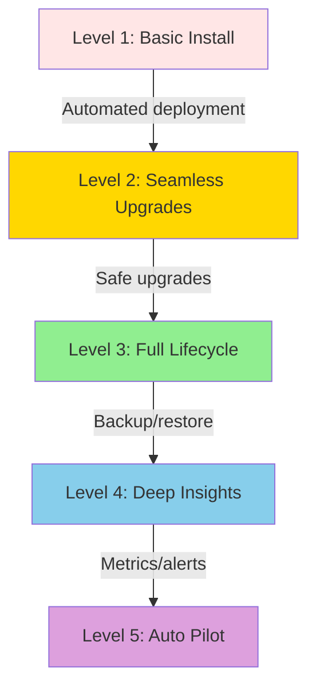

# Kubernetes Operator Patterns

**Document**: 64-operator-patterns.md
**Status**: Course Module - Advanced Controller Patterns
**Audience**: Platform Engineers, SRE Teams, Advanced Developers
**Prerequisites**: Custom controllers, CRDs, stateful applications

---

## **Overview**

Operators extend Kubernetes to manage complex, stateful applications using domain-specific knowledge. This document covers operator patterns, the Operator Framework, and production implementations.

### **Learning Objectives**

1. Understand the Operator maturity model
2. Implement advanced reconciliation patterns
3. Handle stateful application lifecycles
4. Use Operator SDK and Helm operators
5. Manage backups, upgrades, and recovery
6. Build production-grade operators

---

## **1. Operator Maturity Model**

### **1.1 Capability Levels**



**Level 1: Basic Install**
- Automated installation via Custom Resource
- Deployment of application components
- Basic configuration

**Level 2: Seamless Upgrades**
- Rolling updates with zero downtime
- Version migrations
- Configuration updates

**Level 3: Full Lifecycle**
- Backup and restore
- Failure recovery
- Scaling operations

**Level 4: Deep Insights**
- Application-specific metrics
- Logging and tracing
- Custom alerting rules

**Level 5: Auto Pilot**
- Anomaly detection
- Auto-scaling based on metrics
- Self-healing with minimal intervention

---

## **2. Database Operator Example**

### **2.1 PostgreSQL Operator CRD**

```go
// PostgresCluster custom resource
type PostgresCluster struct {
    metav1.TypeMeta   `json:",inline"`
    metav1.ObjectMeta `json:"metadata,omitempty"`

    Spec   PostgresClusterSpec   `json:"spec,omitempty"`
    Status PostgresClusterStatus `json:"status,omitempty"`
}

type PostgresClusterSpec struct {
    // PostgreSQL version
    Version string `json:"version"`

    // Number of instances (primary + replicas)
    Instances int32 `json:"instances"`

    // Storage configuration
    Storage StorageSpec `json:"storage"`

    // Backup schedule (cron format)
    BackupSchedule string `json:"backupSchedule,omitempty"`

    // High availability configuration
    HA HASpec `json:"ha,omitempty"`
}

type StorageSpec struct {
    StorageClass string `json:"storageClass"`
    Size         string `json:"size"` // e.g., "10Gi"
}

type HASpec struct {
    Enabled            bool   `json:"enabled"`
    SynchronousCommit  bool   `json:"synchronousCommit"`
    MaxStandbyLag      string `json:"maxStandbyLag,omitempty"`
}

type PostgresClusterStatus struct {
    // Current phase
    Phase ClusterPhase `json:"phase"`

    // Primary instance
    Primary string `json:"primary,omitempty"`

    // Replica instances
    Replicas []string `json:"replicas,omitempty"`

    // Last backup time
    LastBackup *metav1.Time `json:"lastBackup,omitempty"`

    // Conditions
    Conditions []metav1.Condition `json:"conditions,omitempty"`
}

type ClusterPhase string

const (
    PhaseCreating   ClusterPhase = "Creating"
    PhaseRunning    ClusterPhase = "Running"
    PhaseUpgrading  ClusterPhase = "Upgrading"
    PhaseFailing    ClusterPhase = "Failing"
)
```

### **2.2 Operator Reconciliation**

```go
func (r *PostgresClusterReconciler) Reconcile(ctx context.Context, req ctrl.Request) (ctrl.Result, error) {
    log := log.FromContext(ctx)

    // Fetch cluster
    cluster := &databasev1.PostgresCluster{}
    if err := r.Get(ctx, req.NamespacedName, cluster); err != nil {
        return ctrl.Result{}, client.IgnoreNotFound(err)
    }

    // Phase 1: Reconcile Storage (PVCs)
    if err := r.reconcileStorage(ctx, cluster); err != nil {
        return ctrl.Result{}, err
    }

    // Phase 2: Reconcile Primary Instance
    if err := r.reconcilePrimary(ctx, cluster); err != nil {
        return ctrl.Result{}, err
    }

    // Phase 3: Reconcile Replica Instances
    if err := r.reconcileReplicas(ctx, cluster); err != nil {
        return ctrl.Result{}, err
    }

    // Phase 4: Configure Replication
    if err := r.configureReplication(ctx, cluster); err != nil {
        return ctrl.Result{}, err
    }

    // Phase 5: Reconcile Backup Schedule
    if err := r.reconcileBackups(ctx, cluster); err != nil {
        return ctrl.Result{}, err
    }

    // Phase 6: Update Status
    if err := r.updateStatus(ctx, cluster); err != nil {
        return ctrl.Result{}, err
    }

    // Requeue for periodic checks
    return ctrl.Result{RequeueAfter: 5 * time.Minute}, nil
}
```

---

## **3. Advanced Patterns**

### **3.1 Leader Election for HA**

```go
// Implement leader election for database cluster
func (r *PostgresClusterReconciler) electLeader(ctx context.Context, cluster *databasev1.PostgresCluster) error {
    pods, err := r.getClusterPods(ctx, cluster)
    if err != nil {
        return err
    }

    // Find healthy pods
    healthyPods := []corev1.Pod{}
    for _, pod := range pods {
        if r.isPodHealthy(pod) {
            healthyPods = append(healthyPods, pod)
        }
    }

    if len(healthyPods) == 0 {
        return fmt.Errorf("no healthy pods available")
    }

    // Check if current primary is healthy
    currentPrimary := cluster.Status.Primary
    primaryHealthy := false
    for _, pod := range healthyPods {
        if pod.Name == currentPrimary {
            primaryHealthy = true
            break
        }
    }

    if !primaryHealthy {
        // Promote new primary
        newPrimary := healthyPods[0]
        log.Info("Promoting new primary",
            "old", currentPrimary,
            "new", newPrimary.Name)

        if err := r.promoteReplica(ctx, &newPrimary); err != nil {
            return err
        }

        cluster.Status.Primary = newPrimary.Name
    }

    return nil
}

func (r *PostgresClusterReconciler) promoteReplica(ctx context.Context, pod *corev1.Pod) error {
    // Execute promotion command in pod
    command := []string{
        "pg_ctl",
        "promote",
        "-D",
        "/var/lib/postgresql/data",
    }

    stdout, stderr, err := r.execInPod(ctx, pod, command)
    if err != nil {
        return fmt.Errorf("failed to promote replica: %v, stdout: %s, stderr: %s",
            err, stdout, stderr)
    }

    return nil
}
```

### **3.2 Backup and Restore**

```go
// Backup custom resource
type PostgresBackup struct {
    metav1.TypeMeta   `json:",inline"`
    metav1.ObjectMeta `json:"metadata,omitempty"`

    Spec   PostgresBackupSpec   `json:"spec"`
    Status PostgresBackupStatus `json:"status,omitempty"`
}

type PostgresBackupSpec struct {
    // Reference to cluster
    ClusterRef string `json:"clusterRef"`

    // Backup type
    Type BackupType `json:"type"` // Full, Incremental

    // Storage location
    Storage BackupStorage `json:"storage"`
}

type BackupStorage struct {
    Type BackupStorageType `json:"type"` // S3, GCS, etc.
    Bucket string `json:"bucket"`
    Path   string `json:"path"`
}

// Backup reconciler
func (r *PostgresBackupReconciler) executeBackup(ctx context.Context, backup *databasev1.PostgresBackup) error {
    // Get cluster
    cluster := &databasev1.PostgresCluster{}
    if err := r.Get(ctx, client.ObjectKey{
        Namespace: backup.Namespace,
        Name:      backup.Spec.ClusterRef,
    }, cluster); err != nil {
        return err
    }

    // Get primary pod
    primaryPod, err := r.getPrimaryPod(ctx, cluster)
    if err != nil {
        return err
    }

    // Execute pg_basebackup
    command := []string{
        "pg_basebackup",
        "-h", "localhost",
        "-D", "/tmp/backup",
        "-Ft",  // tar format
        "-z",   // compress
        "-P",   // progress
    }

    if _, _, err := r.execInPod(ctx, primaryPod, command); err != nil {
        return err
    }

    // Upload to storage
    if err := r.uploadBackup(ctx, backup, "/tmp/backup"); err != nil {
        return err
    }

    // Update status
    backup.Status.Phase = "Completed"
    backup.Status.CompletionTime = &metav1.Time{Time: time.Now()}
    backup.Status.Size = "1.5Gi" // Calculate actual size

    return r.Status().Update(ctx, backup)
}
```

### **3.3 Version Upgrades**

```go
// Upgrade strategy
func (r *PostgresClusterReconciler) upgradeCluster(
    ctx context.Context,
    cluster *databasev1.PostgresCluster,
    newVersion string,
) error {
    log := log.FromContext(ctx)

    // Set upgrading status
    cluster.Status.Phase = PhaseUpgrading
    r.Status().Update(ctx, cluster)

    // Step 1: Backup before upgrade
    log.Info("Creating backup before upgrade")
    backup := r.createBackup(ctx, cluster)
    if err := r.waitForBackupCompletion(ctx, backup); err != nil {
        return err
    }

    // Step 2: Upgrade replicas first
    log.Info("Upgrading replica instances")
    for _, replica := range cluster.Status.Replicas {
        if err := r.upgradeInstance(ctx, cluster, replica, newVersion); err != nil {
            return err
        }
    }

    // Step 3: Failover to upgraded replica
    log.Info("Failing over to upgraded replica")
    newPrimary := cluster.Status.Replicas[0]
    if err := r.promoteReplica(ctx, newPrimary); err != nil {
        return err
    }

    // Step 4: Upgrade old primary (now replica)
    log.Info("Upgrading old primary")
    oldPrimary := cluster.Status.Primary
    if err := r.upgradeInstance(ctx, cluster, oldPrimary, newVersion); err != nil {
        return err
    }

    // Step 5: Update status
    cluster.Status.Phase = PhaseRunning
    cluster.Spec.Version = newVersion
    return r.Update(ctx, cluster)
}

func (r *PostgresClusterReconciler) upgradeInstance(
    ctx context.Context,
    cluster *databasev1.PostgresCluster,
    instanceName string,
    newVersion string,
) error {
    // Get pod
    pod := &corev1.Pod{}
    if err := r.Get(ctx, client.ObjectKey{
        Namespace: cluster.Namespace,
        Name:      instanceName,
    }, pod); err != nil {
        return err
    }

    // Update pod with new image
    pod.Spec.Containers[0].Image = fmt.Sprintf("postgres:%s", newVersion)

    // Delete pod (StatefulSet will recreate with new version)
    if err := r.Delete(ctx, pod); err != nil {
        return err
    }

    // Wait for pod to be ready
    return r.waitForPodReady(ctx, cluster.Namespace, instanceName, 5*time.Minute)
}
```

---

## **4. Operator SDK**

### **4.1 Generate Operator with SDK**

```bash
# Install Operator SDK
brew install operator-sdk

# Create operator project
operator-sdk init \
  --domain example.com \
  --repo github.com/myorg/postgres-operator

# Create API
operator-sdk create api \
  --group database \
  --version v1alpha1 \
  --kind PostgresCluster \
  --resource \
  --controller

# Add webhook
operator-sdk create webhook \
  --group database \
  --version v1alpha1 \
  --kind PostgresCluster \
  --defaulting \
  --programmatic-validation
```

### **4.2 Helm Operator**

```bash
# Create Helm-based operator
operator-sdk init --plugins=helm

# Create API from existing Helm chart
operator-sdk create api \
  --group database \
  --version v1alpha1 \
  --kind PostgresCluster \
  --helm-chart=path/to/postgres-chart
```

---

## **5. Production Considerations**

### **5.1 Monitoring**

```go
// Add operator-specific metrics
var (
    clusterCount = prometheus.NewGaugeVec(
        prometheus.GaugeOpts{
            Name: "postgres_clusters_total",
            Help: "Total number of PostgreSQL clusters",
        },
        []string{"namespace", "version"},
    )

    backupDuration = prometheus.NewHistogramVec(
        prometheus.HistogramOpts{
            Name: "postgres_backup_duration_seconds",
            Help: "Backup duration in seconds",
        },
        []string{"cluster", "type"},
    )

    failoverCount = prometheus.NewCounterVec(
        prometheus.CounterOpts{
            Name: "postgres_failover_total",
            Help: "Total number of failovers",
        },
        []string{"cluster", "reason"},
    )
)
```

### **5.2 Alerts**

```yaml
# Prometheus alerts for operator
groups:
  - name: postgres-operator
    rules:
      - alert: PostgresClusterDown
        expr: postgres_cluster_status{phase="Failing"} == 1
        for: 5m
        annotations:
          summary: "Postgres cluster {{ $labels.cluster }} is down"

      - alert: BackupFailed
        expr: rate(postgres_backup_failures_total[5m]) > 0
        annotations:
          summary: "Backup failed for cluster {{ $labels.cluster }}"

      - alert: ReplicationLag
        expr: postgres_replication_lag_seconds > 300
        for: 5m
        annotations:
          summary: "Replication lag > 5min for {{ $labels.replica }}"
```

---

## **6. Testing Operators**

### **6.1 Integration Tests**

```go
// Integration test using envtest
var _ = Describe("PostgresCluster Controller", func() {
    Context("When creating a cluster", func() {
        It("Should create primary and replicas", func() {
            ctx := context.Background()

            cluster := &databasev1.PostgresCluster{
                ObjectMeta: metav1.ObjectMeta{
                    Name:      "test-cluster",
                    Namespace: "default",
                },
                Spec: databasev1.PostgresClusterSpec{
                    Version:   "14.5",
                    Instances: 3,
                    Storage: databasev1.StorageSpec{
                        Size: "10Gi",
                    },
                },
            }

            Expect(k8sClient.Create(ctx, cluster)).To(Succeed())

            // Wait for primary
            Eventually(func() bool {
                updated := &databasev1.PostgresCluster{}
                k8sClient.Get(ctx, client.ObjectKeyFromObject(cluster), updated)
                return updated.Status.Primary != ""
            }, timeout, interval).Should(BeTrue())

            // Verify replicas
            Eventually(func() int {
                updated := &databasev1.PostgresCluster{}
                k8sClient.Get(ctx, client.ObjectKeyFromObject(cluster), updated)
                return len(updated.Status.Replicas)
            }, timeout, interval).Should(Equal(2))
        })
    })
})
```

---

## **7. Real-World Operators**

### **Successful Open Source Operators**

| Operator | Application | Features |
|----------|-------------|----------|
| etcd-operator | etcd | Automated deploy, upgrade, backup |
| prometheus-operator | Prometheus | Service discovery, config management |
| postgres-operator (Zalando) | PostgreSQL | HA, backups, connection pooling |
| mongodb-operator | MongoDB | Sharding, backup/restore |
| vault-operator | Vault | Auto-unseal, backup, HA |
| redis-operator | Redis | Sentinel, cluster mode |

---

## **8. Best Practices**

### **✅ Do's**

1. **Implement idempotent reconciliation** - Handle restarts gracefully
2. **Use finalizers** for cleanup of external resources
3. **Validate CRs** with admission webhooks
4. **Monitor operator health** with metrics
5. **Test failure scenarios** - Network issues, pod failures
6. **Document operational procedures** - Upgrades, recovery
7. **Version your CRDs** properly (v1alpha1 → v1beta1 → v1)
8. **Use status conditions** for detailed state reporting

### **❌ Don'ts**

1. **Don't manage state in operator** - Use CRs and cluster state
2. **Don't skip backup/restore** testing
3. **Don't ignore RBAC** - Principle of least privilege
4. **Don't hardcode** - Use ConfigMaps/Secrets
5. **Don't forget upgrades** - Plan migration paths

---

## **9. References**

- **Operator Framework**: operatorframework.io
- **Operator SDK Docs**: sdk.operatorframework.io
- **Best Operators**: operatorhub.io
- **Kubernetes SIG**: sig-api-machinery

---

## **Summary**

Operators enable:
- **Application-specific automation** beyond generic controllers
- **Complex lifecycle management** (install, upgrade, backup, restore)
- **Domain expertise** encoded in code
- **Self-healing** stateful applications

Key patterns:
- Leader election for HA
- Backup and restore automation
- Safe upgrades with rollback
- Deep health monitoring
- Auto-scaling based on application metrics

Build operators to reduce operational burden and improve reliability!
