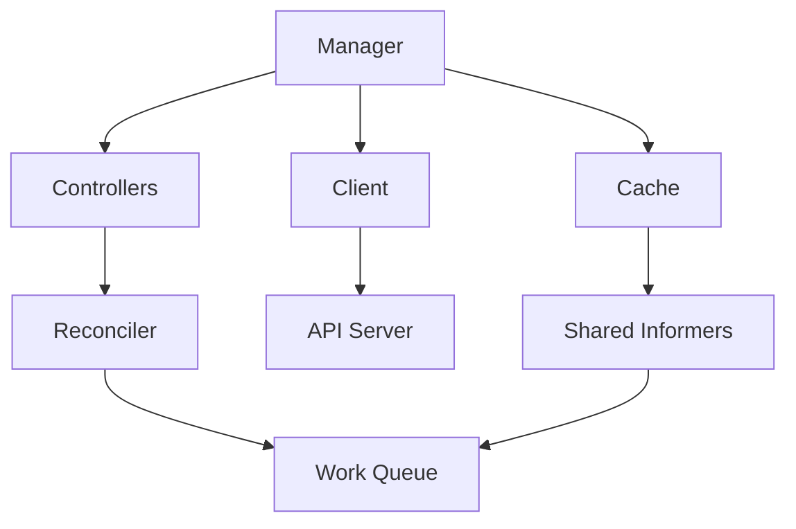

# Controller-Runtime Framework Guide

**Document**: 65-controller-runtime-guide.md
**Status**: Course Module - Framework Deep Dive
**Audience**: Controller Developers
**Prerequisites**: Go, Kubernetes, controller patterns

---

## **Overview**

Controller-runtime is the foundational library used by Kubebuilder and Operator SDK. Understanding it enables building sophisticated controllers efficiently.

### **Key Components**



---

## **1. Manager**

Central component that orchestrates controllers:

```go
import (
    ctrl "sigs.k8s.io/controller-runtime"
    "sigs.k8s.io/controller-runtime/pkg/manager"
)

func main() {
    // Create manager
    mgr, err := ctrl.NewManager(ctrl.GetConfigOrDie(), ctrl.Options{
        Scheme:                 scheme,
        MetricsBindAddress:     ":8080",
        HealthProbeBindAddress: ":8081",
        LeaderElection:         true,
        LeaderElectionID:       "my-controller-lock",
        Namespace:              "", // Watch all namespaces
    })
    if err != nil {
        panic(err)
    }

    // Start manager
    if err := mgr.Start(ctrl.SetupSignalHandler()); err != nil {
        panic(err)
    }
}
```

---

## **2. Client**

Split client architecture for reads and writes:

```go
import "sigs.k8s.io/controller-runtime/pkg/client"

func (r *Reconciler) Reconcile(ctx context.Context, req ctrl.Request) (ctrl.Result, error) {
    // Read from cache (fast)
    pod := &corev1.Pod{}
    if err := r.Get(ctx, req.NamespacedName, pod); err != nil {
        return ctrl.Result{}, client.IgnoreNotFound(err)
    }

    // List with label selector
    podList := &corev1.PodList{}
    if err := r.List(ctx, podList,
        client.InNamespace("default"),
        client.MatchingLabels{"app": "myapp"},
    ); err != nil {
        return ctrl.Result{}, err
    }

    // Write to API server
    pod.Labels["processed"] = "true"
    if err := r.Update(ctx, pod); err != nil {
        return ctrl.Result{}, err
    }

    // Status update (subresource)
    pod.Status.Phase = corev1.PodRunning
    if err := r.Status().Update(ctx, pod); err != nil {
        return ctrl.Result{}, err
    }

    return ctrl.Result{}, nil
}
```

---

## **3. Predicates**

Filter events before reconciliation:

```go
import (
    "sigs.k8s.io/controller-runtime/pkg/predicate"
    "sigs.k8s.io/controller-runtime/pkg/event"
)

// Custom predicate
type AnnotationPredicate struct {
    predicate.Funcs
}

func (p AnnotationPredicate) Create(e event.CreateEvent) bool {
    return e.Object.GetAnnotations()["reconcile"] == "true"
}

func (p AnnotationPredicate) Update(e event.UpdateEvent) bool {
    // Only reconcile if generation changed (spec changed)
    return e.ObjectNew.GetGeneration() != e.ObjectOld.GetGeneration()
}

// Use in controller setup
func (r *MyReconciler) SetupWithManager(mgr ctrl.Manager) error {
    return ctrl.NewControllerManagedBy(mgr).
        For(&myv1.MyResource{}).
        WithEventFilter(AnnotationPredicate{}).
        Complete(r)
}
```

---

## **4. Watches**

Watch multiple resources:

```go
func (r *DeploymentReconciler) SetupWithManager(mgr ctrl.Manager) error {
    return ctrl.NewControllerManagedBy(mgr).
        For(&appsv1.Deployment{}). // Primary resource
        Owns(&appsv1.ReplicaSet{}). // Owned resources
        Watches(
            &source.Kind{Type: &corev1.ConfigMap{}},
            handler.EnqueueRequestsFromMapFunc(r.findDeploymentsForConfigMap),
        ).
        Complete(r)
}

// Map ConfigMap to Deployments
func (r *DeploymentReconciler) findDeploymentsForConfigMap(obj client.Object) []reconcile.Request {
    cm := obj.(*corev1.ConfigMap)

    // Find deployments referencing this ConfigMap
    deployments := &appsv1.DeploymentList{}
    r.List(context.Background(), deployments,
        client.InNamespace(cm.Namespace),
        client.MatchingFields{"spec.configMapRef": cm.Name},
    )

    requests := make([]reconcile.Request, len(deployments.Items))
    for i, dep := range deployments.Items {
        requests[i] = reconcile.Request{
            NamespacedName: client.ObjectKeyFromObject(&dep),
        }
    }
    return requests
}
```

---

## **5. Indexing**

Add custom indexes for fast lookups:

```go
func (r *PodReconciler) SetupWithManager(mgr ctrl.Manager) error {
    // Add index on pod nodeName
    if err := mgr.GetFieldIndexer().IndexField(
        context.Background(),
        &corev1.Pod{},
        "spec.nodeName",
        func(obj client.Object) []string {
            pod := obj.(*corev1.Pod)
            return []string{pod.Spec.NodeName}
        },
    ); err != nil {
        return err
    }

    return ctrl.NewControllerManagedBy(mgr).
        For(&corev1.Pod{}).
        Complete(r)
}

// Use index in reconcile
func (r *PodReconciler) getPodsOnNode(ctx context.Context, nodeName string) ([]corev1.Pod, error) {
    podList := &corev1.PodList{}
    if err := r.List(ctx, podList,
        client.MatchingFields{"spec.nodeName": nodeName},
    ); err != nil {
        return nil, err
    }
    return podList.Items, nil
}
```

---

## **6. Reconcile Patterns**

### **Idempotent Reconciliation**

```go
func (r *Reconciler) Reconcile(ctx context.Context, req ctrl.Request) (ctrl.Result, error) {
    // 1. Fetch resource
    obj := &myv1.MyResource{}
    if err := r.Get(ctx, req.NamespacedName, obj); err != nil {
        return ctrl.Result{}, client.IgnoreNotFound(err)
    }

    // 2. Check if being deleted
    if !obj.DeletionTimestamp.IsZero() {
        return r.handleDeletion(ctx, obj)
    }

    // 3. Add finalizer if missing
    if !controllerutil.ContainsFinalizer(obj, myFinalizer) {
        controllerutil.AddFinalizer(obj, myFinalizer)
        return ctrl.Result{}, r.Update(ctx, obj)
    }

    // 4. Reconcile owned resources
    if err := r.reconcileDeployment(ctx, obj); err != nil {
        return ctrl.Result{}, err
    }

    // 5. Update status
    return ctrl.Result{}, r.updateStatus(ctx, obj)
}
```

### **Requeue Strategies**

```go
func (r *Reconciler) Reconcile(ctx context.Context, req ctrl.Request) (ctrl.Result, error) {
    // Requeue after duration
    return ctrl.Result{RequeueAfter: 5 * time.Minute}, nil

    // Requeue immediately
    return ctrl.Result{Requeue: true}, nil

    // Don't requeue (wait for watch events)
    return ctrl.Result{}, nil

    // Requeue on error (with exponential backoff)
    return ctrl.Result{}, fmt.Errorf("transient error")
}
```

---

## **7. Advanced Features**

### **Leader Election**

```go
mgr, err := ctrl.NewManager(cfg, ctrl.Options{
    LeaderElection:          true,
    LeaderElectionNamespace: "kube-system",
    LeaderElectionID:        "my-controller-lock",
    LeaseDuration:           &leaseDuration,
    RenewDeadline:           &renewDeadline,
    RetryPeriod:             &retryPeriod,
})
```

### **Webhooks**

```go
import "sigs.k8s.io/controller-runtime/pkg/webhook"

// Add webhook server to manager
hookServer := mgr.GetWebhookServer()
hookServer.Register("/mutate", &webhook.Admission{
    Handler: &myMutatingHandler{},
})

hookServer.Register("/validate", &webhook.Admission{
    Handler: &myValidatingHandler{},
})
```

---

## **8. Testing**

### **Using envtest**

```go
import (
    "sigs.k8s.io/controller-runtime/pkg/envtest"
)

var (
    testEnv *envtest.Environment
    k8sClient client.Client
)

func TestMain(m *testing.M) {
    testEnv = &envtest.Environment{
        CRDDirectoryPaths: []string{"config/crd/bases"},
    }

    cfg, err := testEnv.Start()
    if err != nil {
        panic(err)
    }

    k8sClient, err = client.New(cfg, client.Options{Scheme: scheme})
    if err != nil {
        panic(err)
    }

    code := m.Run()
    testEnv.Stop()
    os.Exit(code)
}
```

---

## **9. Best Practices**

**✅ Do's**:
1. Use `client.IgnoreNotFound()` for Get operations
2. Set owner references with `controllerutil.SetControllerReference()`
3. Use predicates to filter unnecessary reconciliations
4. Add indexes for frequently queried fields
5. Implement proper finalizer handling

**❌ Don'ts**:
1. Don't create new clients - use manager's client
2. Don't hold locks during reconciliation
3. Don't update status and spec together
4. Don't ignore context cancellation
5. Don't skip error handling

---

## **Summary**

Controller-runtime provides:
- **Manager**: Lifecycle management
- **Client**: Cached reads, direct writes
- **Cache**: Shared informers
- **Predicates**: Event filtering
- **Indexes**: Fast lookups
- **Webhooks**: Admission control

Master controller-runtime for production-grade controllers!
