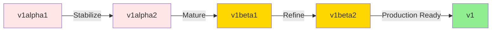

# API Versioning in Kubernetes

**Document**: 68-api-versioning.md
**Status**: Course Module - API Design
**Audience**: API Designers, Platform Engineers
**Prerequisites**: Kubernetes APIs, CRDs, versioning concepts

---

## **Overview**

Kubernetes uses a sophisticated API versioning strategy to evolve APIs while maintaining backward compatibility. Understanding this is critical for custom resource design.

### **Version Progression**



---

## **1. Version Levels**

### **1.1 Alpha (v1alpha1, v1alpha2, ...)**

**Characteristics**:
- May be buggy
- No backward compatibility guarantees
- May be removed without notice
- Disabled by default
- Not recommended for production

**Naming**: `v1alpha1`, `v1alpha2`, `v2alpha1`

**Example**:
```yaml
apiVersion: apps.example.com/v1alpha1
kind: MyResource
```

### **1.2 Beta (v1beta1, v1beta2, ...)**

**Characteristics**:
- Well tested
- Backward compatible within beta
- Enabled by default
- Will be supported for multiple releases
- Production use with caution

**Naming**: `v1beta1`, `v1beta2`, `v2beta1`

**Example**:
```yaml
apiVersion: apps.example.com/v1beta1
kind: MyResource
```

### **1.3 Stable (v1, v2, ...)**

**Characteristics**:
- Production ready
- Backward compatible
- Long-term support
- May introduce new fields (backward compatible)

**Naming**: `v1`, `v2`, `v3`

**Example**:
```yaml
apiVersion: apps.example.com/v1
kind: MyResource
```

---

## **2. API Compatibility Rules**

### **2.1 What Can Change**

**✅ Allowed (Backward Compatible)**:
- Add new API versions
- Add new fields (optional)
- Add new resources
- Add validation for new fields
- Deprecate (but continue serving) old versions

**Example**:
```go
// v1beta1
type PodSpec struct {
    Containers []Container `json:"containers"`
}

// v1beta2 - Added optional field
type PodSpec struct {
    Containers []Container `json:"containers"`
    InitContainers []Container `json:"initContainers,omitempty"` // NEW: Optional
}
```

### **2.2 What Cannot Change**

**❌ Not Allowed (Breaking)**:
- Remove or rename existing fields
- Change field types
- Change field semantics
- Add required fields
- Change validation of existing fields (stricter)

**Bad Example**:
```go
// v1beta1
type PodSpec struct {
    Containers []Container `json:"containers"`
    HostNetwork bool `json:"hostNetwork"` // Was boolean
}

// v1beta2 - BREAKING CHANGE!
type PodSpec struct {
    Containers []Container `json:"containers"`
    HostNetwork *NetworkConfig `json:"hostNetwork"` // Changed type - BREAKS COMPATIBILITY!
}
```

---

## **3. Multi-Version CRDs**

### **3.1 Serving Multiple Versions**

```yaml
apiVersion: apiextensions.k8s.io/v1
kind: CustomResourceDefinition
metadata:
  name: myresources.example.com
spec:
  group: example.com
  names:
    kind: MyResource
    plural: myresources
  scope: Namespaced

  # Serve multiple versions
  versions:
    # Stable version
    - name: v1
      served: true
      storage: true
      schema:
        openAPIV3Schema:
          type: object
          properties:
            spec:
              type: object
              properties:
                image: {type: string}
                replicas: {type: integer}

    # Beta version (deprecated)
    - name: v1beta1
      served: true
      storage: false
      deprecated: true
      deprecationWarning: "v1beta1 is deprecated, migrate to v1"
      schema:
        openAPIV3Schema:
          type: object
          properties:
            spec:
              type: object
              properties:
                image: {type: string}
                count: {type: integer}  # Different field name

    # Alpha version (sunset)
    - name: v1alpha1
      served: false  # No longer served
      storage: false
```

---

## **4. Version Conversion**

### **4.1 Hub-Spoke Pattern**

```go
// v1 is the "hub" - storage version
type MyResourceV1 struct {
    Spec MyResourceSpecV1 `json:"spec"`
}

type MyResourceSpecV1 struct {
    Image    string `json:"image"`
    Replicas int32  `json:"replicas"`
}

// v1beta1 is a "spoke"
type MyResourceV1Beta1 struct {
    Spec MyResourceSpecV1Beta1 `json:"spec"`
}

type MyResourceSpecV1Beta1 struct {
    Image string `json:"image"`
    Count int32  `json:"count"` // Was called "count" in beta
}

// Conversion: v1beta1 → v1 (hub)
func (src *MyResourceV1Beta1) ConvertTo(dstRaw conversion.Hub) error {
    dst := dstRaw.(*MyResourceV1)

    dst.Spec.Image = src.Spec.Image
    dst.Spec.Replicas = src.Spec.Count // count → replicas

    return nil
}

// Conversion: v1 (hub) → v1beta1
func (dst *MyResourceV1Beta1) ConvertFrom(srcRaw conversion.Hub) error {
    src := srcRaw.(*MyResourceV1)

    dst.Spec.Image = src.Spec.Image
    dst.Spec.Count = src.Spec.Replicas // replicas → count

    return nil
}
```

---

## **5. Deprecation Policy**

### **5.1 Kubernetes Deprecation Timeline**

**Rule**: API versions supported for minimum period after deprecation announcement:
- **GA**: 12 months or 3 releases (whichever longer)
- **Beta**: 9 months or 3 releases
- **Alpha**: 0 releases (can be removed immediately)

**Example Timeline**:
```
v1.20: apps/v1beta1 Deployment deprecated
       ↓
v1.21: Still supported
       ↓
v1.22: Still supported
       ↓
v1.23: Still supported (3 releases)
       ↓
v1.24: apps/v1beta1 removed
```

### **5.2 Deprecation Warnings**

```go
// Add deprecation warning to CRD
versions:
  - name: v1beta1
    deprecated: true
    deprecationWarning: "apps.example.com/v1beta1 MyResource is deprecated; use apps.example.com/v1 MyResource"
```

```yaml
# Users see warning when using deprecated version
$ kubectl apply -f myresource-v1beta1.yaml
Warning: apps.example.com/v1beta1 MyResource is deprecated; use apps.example.com/v1 MyResource
myresource.apps.example.com/my-app created
```

---

## **6. Version Priority**

### **6.1 Preferred Version**

```yaml
apiVersion: apiextensions.k8s.io/v1
kind: CustomResourceDefinition
spec:
  versions:
    - name: v1
      served: true
      storage: true
      # Highest priority (served first in discovery)

    - name: v1beta1
      served: true
      storage: false
      # Lower priority
```

**Discovery Response**:
```json
{
  "versions": [
    {"version": "v1", "preferred": true},
    {"version": "v1beta1", "preferred": false}
  ]
}
```

**Client behavior**:
```bash
# kubectl uses preferred version by default
kubectl get myresources  # Uses v1

# Can explicitly request specific version
kubectl get myresources.v1beta1.example.com
```

---

## **7. Testing Multi-Version APIs**

### **7.1 Conversion Tests**

```go
func TestAPIConversion(t *testing.T) {
    // Create v1beta1 resource
    v1beta1Obj := &v1beta1.MyResource{
        Spec: v1beta1.MyResourceSpec{
            Count: 5,
        },
    }

    // Convert to v1 (hub)
    v1Obj := &v1.MyResource{}
    if err := v1beta1Obj.ConvertTo(v1Obj); err != nil {
        t.Fatalf("ConvertTo failed: %v", err)
    }

    // Verify conversion
    if v1Obj.Spec.Replicas != 5 {
        t.Errorf("Expected replicas=5, got %d", v1Obj.Spec.Replicas)
    }

    // Round-trip conversion
    roundtrip := &v1beta1.MyResource{}
    if err := roundtrip.ConvertFrom(v1Obj); err != nil {
        t.Fatalf("ConvertFrom failed: %v", err)
    }

    // Verify no data loss
    if !reflect.DeepEqual(v1beta1Obj.Spec, roundtrip.Spec) {
        t.Error("Round-trip conversion lost data")
    }
}
```

---

## **8. Common Patterns**

### **8.1 Field Rename**

```go
// v1beta1
type Spec struct {
    NodeName string `json:"nodeName"`
}

// v1 - Renamed field
type Spec struct {
    Host string `json:"host"` // Was nodeName
}

// Conversion preserves data
func (src *v1beta1Spec) ConvertTo(dst *v1Spec) error {
    dst.Host = src.NodeName // nodeName → host
    return nil
}
```

### **8.2 Field Split**

```go
// v1beta1
type Spec struct {
    Endpoint string `json:"endpoint"` // "http://host:port"
}

// v1 - Split into separate fields
type Spec struct {
    Protocol string `json:"protocol"` // "http"
    Host     string `json:"host"`     // "host"
    Port     int32  `json:"port"`     // port
}

// Conversion parses combined field
func (src *v1beta1Spec) ConvertTo(dst *v1Spec) error {
    u, _ := url.Parse(src.Endpoint)
    dst.Protocol = u.Scheme
    dst.Host = u.Hostname()
    port, _ := strconv.Atoi(u.Port())
    dst.Port = int32(port)
    return nil
}
```

### **8.3 Field Combine**

```go
// v1beta1
type Spec struct {
    CPU    string `json:"cpu"`
    Memory string `json:"memory"`
}

// v1 - Combined into resources
type Spec struct {
    Resources ResourceRequirements `json:"resources"`
}

// Conversion combines fields
func (src *v1beta1Spec) ConvertTo(dst *v1Spec) error {
    dst.Resources.CPU = src.CPU
    dst.Resources.Memory = src.Memory
    return nil
}
```

---

## **9. Best Practices**

**✅ Do's**:
1. Start with v1alpha1
2. Plan field names carefully (hard to change later)
3. Make new fields optional when possible
4. Test conversions thoroughly
5. Document deprecations clearly
6. Maintain multiple versions during transition
7. Use storage version for internal logic

**❌ Don'ts**:
1. Don't remove fields in same version
2. Don't change field types
3. Don't make existing fields required
4. Don't rush to v1 (hard to change later)
5. Don't skip beta stage
6. Don't remove deprecated versions too quickly

---

## **Summary**

API versioning enables:
- **Evolution** - APIs improve over time
- **Compatibility** - Old clients continue working
- **Stability** - Production APIs don't break
- **Flexibility** - Experiment safely with alpha/beta

**Key principles**:
- Alpha (v1alpha*): Experimental
- Beta (v1beta*): Pre-production
- Stable (v1): Production-ready
- Conversion webhooks bridge versions
- Deprecation policy protects users
- Storage version is source of truth

Plan versioning strategy before releasing APIs!
