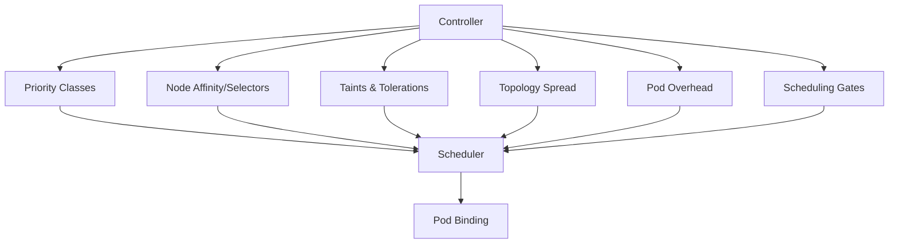

# Scheduler Extensions and Controller Integration

**Document**: 69-scheduler-extensions.md
**Status**: Course Module - Scheduler Integration
**Audience**: Platform Engineers, Scheduler Developers
**Prerequisites**: Kubernetes scheduler, controller patterns

---

## **Overview**

Controllers often need to influence scheduling decisions. This document covers how controllers integrate with the scheduler through various extension points.

### **Integration Points**



---

## **1. Priority and Preemption**

### **1.1 PriorityClass Controller**

Controllers create priority classes for workload tiers:

```go
func (c *Controller) createPriorityClasses(ctx context.Context) error {
    priorities := []struct {
        name   string
        value  int32
        desc   string
    }{
        {"system-critical", 2000000000, "System critical pods"},
        {"production-high", 1000000, "High priority production"},
        {"production-normal", 100000, "Normal production"},
        {"batch", 0, "Batch workloads"},
    }

    for _, p := range priorities {
        pc := &schedulingv1.PriorityClass{
            ObjectMeta: metav1.ObjectMeta{
                Name: p.name,
            },
            Value:         p.value,
            GlobalDefault: false,
            Description:   p.desc,
        }

        _, err := c.client.SchedulingV1().PriorityClasses().Create(ctx, pc, metav1.CreateOptions{})
        if err != nil && !errors.IsAlreadyExists(err) {
            return err
        }
    }

    return nil
}
```

**Usage in Controller**:
```go
func (c *DeploymentController) createPod(deployment *appsv1.Deployment) *corev1.Pod {
    pod := &corev1.Pod{
        Spec: corev1.PodSpec{
            // Set priority based on deployment tier
            PriorityClassName: c.determinePriority(deployment),
            Containers: deployment.Spec.Template.Spec.Containers,
        },
    }
    return pod
}

func (c *DeploymentController) determinePriority(dep *appsv1.Deployment) string {
    if dep.Labels["tier"] == "critical" {
        return "system-critical"
    }
    if dep.Labels["env"] == "production" {
        return "production-high"
    }
    return "production-normal"
}
```

---

## **2. Node Affinity & Selection**

### **2.1 Controller-Managed Node Selection**

```go
func (c *WorkloadController) assignNodeAffinity(pod *corev1.Pod, workload *Workload) {
    // Add node affinity based on workload requirements
    if workload.Spec.RequiresGPU {
        pod.Spec.Affinity = &corev1.Affinity{
            NodeAffinity: &corev1.NodeAffinity{
                RequiredDuringSchedulingIgnoredDuringExecution: &corev1.NodeSelector{
                    NodeSelectorTerms: []corev1.NodeSelectorTerm{
                        {
                            MatchExpressions: []corev1.NodeSelectorRequirement{
                                {
                                    Key:      "accelerator",
                                    Operator: corev1.NodeSelectorOpIn,
                                    Values:   []string{"nvidia-tesla-v100", "nvidia-a100"},
                                },
                            },
                        },
                    },
                },
            },
        }
    }

    // Add pod anti-affinity for HA
    if workload.Spec.HighAvailability {
        pod.Spec.Affinity.PodAntiAffinity = &corev1.PodAntiAffinity{
            PreferredDuringSchedulingIgnoredDuringExecution: []corev1.WeightedPodAffinityTerm{
                {
                    Weight: 100,
                    PodAffinityTerm: corev1.PodAffinityTerm{
                        LabelSelector: &metav1.LabelSelector{
                            MatchLabels: workload.Labels,
                        },
                        TopologyKey: "kubernetes.io/hostname",
                    },
                },
            },
        }
    }
}
```

---

## **3. Taints and Tolerations**

### **3.1 Node Lifecycle Controller Integration**

Node controller adds taints, pods need tolerations:

```go
// Node lifecycle controller adds taints
func (c *NodeController) taintNode(node *corev1.Node, taint corev1.Taint) error {
    node.Spec.Taints = append(node.Spec.Taints, taint)
    _, err := c.client.CoreV1().Nodes().Update(context.TODO(), node, metav1.UpdateOptions{})
    return err
}

// Example taints added by node controller:
// - node.kubernetes.io/not-ready
// - node.kubernetes.io/unreachable
// - node.kubernetes.io/out-of-disk
// - node.kubernetes.io/memory-pressure
// - node.kubernetes.io/disk-pressure

// DaemonSet controller adds tolerations
func (c *DaemonSetController) addDaemonSetTolerations(pod *corev1.Pod) {
    // DaemonSets tolerate all node conditions
    tolerations := []corev1.Toleration{
        {
            Key:      "node.kubernetes.io/not-ready",
            Operator: corev1.TolerationOpExists,
            Effect:   corev1.TaintEffectNoExecute,
        },
        {
            Key:      "node.kubernetes.io/unreachable",
            Operator: corev1.TolerationOpExists,
            Effect:   corev1.TaintEffectNoExecute,
        },
        {
            Key:      "node.kubernetes.io/disk-pressure",
            Operator: corev1.TolerationOpExists,
            Effect:   corev1.TaintEffectNoSchedule,
        },
    }

    pod.Spec.Tolerations = append(pod.Spec.Tolerations, tolerations...)
}
```

---

## **4. Topology Spread Constraints**

### **4.1 Controller-Managed Spread**

```go
func (c *DeploymentController) addTopologySpread(pod *corev1.Pod, deployment *appsv1.Deployment) {
    if deployment.Annotations["spread"] == "true" {
        pod.Spec.TopologySpreadConstraints = []corev1.TopologySpreadConstraint{
            {
                MaxSkew:           1,
                TopologyKey:       "topology.kubernetes.io/zone",
                WhenUnsatisfiable: corev1.DoNotSchedule,
                LabelSelector: &metav1.LabelSelector{
                    MatchLabels: deployment.Spec.Selector.MatchLabels,
                },
            },
            {
                MaxSkew:           1,
                TopologyKey:       "kubernetes.io/hostname",
                WhenUnsatisfiable: corev1.ScheduleAnyway,
                LabelSelector: &metav1.LabelSelector{
                    MatchLabels: deployment.Spec.Selector.MatchLabels,
                },
            },
        }
    }
}
```

---

## **5. Scheduling Gates (KEP-3521)**

### **5.1 Gate-Based Scheduling**

Controllers can block scheduling until conditions are met:

```go
// Add scheduling gate
func (c *Controller) addSchedulingGate(pod *corev1.Pod) {
    pod.Spec.SchedulingGates = []corev1.PodSchedulingGate{
        {
            Name: "example.com/wait-for-approval",
        },
    }
}

// Controller watches for approval
func (c *Controller) Reconcile(ctx context.Context, req ctrl.Request) (ctrl.Result, error) {
    pod := &corev1.Pod{}
    if err := c.Get(ctx, req.NamespacedName, pod); err != nil {
        return ctrl.Result{}, err
    }

    // Check if pod needs approval
    if pod.Annotations["approved"] == "true" {
        // Remove scheduling gate
        gates := []corev1.PodSchedulingGate{}
        for _, gate := range pod.Spec.SchedulingGates {
            if gate.Name != "example.com/wait-for-approval" {
                gates = append(gates, gate)
            }
        }
        pod.Spec.SchedulingGates = gates

        return ctrl.Result{}, c.Update(ctx, pod)
    }

    return ctrl.Result{RequeueAfter: 10 * time.Second}, nil
}
```

---

## **6. Pod Overhead**

### **6.1 RuntimeClass Overhead**

Controllers consider overhead when sizing pods:

```go
func (c *PodController) calculateResources(pod *corev1.Pod) {
    // Get RuntimeClass
    if pod.Spec.RuntimeClassName != nil {
        rc, err := c.runtimeClassLister.Get(*pod.Spec.RuntimeClassName)
        if err == nil && rc.Overhead != nil {
            // Add overhead to resource requests
            for i := range pod.Spec.Containers {
                container := &pod.Spec.Containers[i]

                if container.Resources.Requests == nil {
                    container.Resources.Requests = corev1.ResourceList{}
                }

                // Add runtime overhead
                for resource, quantity := range rc.Overhead.PodFixed {
                    existing := container.Resources.Requests[resource]
                    existing.Add(quantity)
                    container.Resources.Requests[resource] = existing
                }
            }
        }
    }
}
```

---

## **7. Custom Schedulers**

### **7.1 Controller Directing to Custom Scheduler**

```go
func (c *WorkloadController) assignScheduler(pod *corev1.Pod, workload *Workload) {
    // Route to appropriate scheduler
    switch workload.Spec.Type {
    case "batch":
        pod.Spec.SchedulerName = "batch-scheduler"
    case "ml-training":
        pod.Spec.SchedulerName = "gpu-scheduler"
    case "realtime":
        pod.Spec.SchedulerName = "realtime-scheduler"
    default:
        pod.Spec.SchedulerName = "default-scheduler"
    }
}
```

---

## **8. Scheduler Framework Extensions**

### **8.1 Plugin Integration**

Controllers can influence scheduler through custom plugins:

```yaml
# Scheduler configuration with custom plugin
apiVersion: kubescheduler.config.k8s.io/v1
kind: KubeSchedulerConfiguration
profiles:
  - schedulerName: custom-scheduler
    plugins:
      preFilter:
        enabled:
          - name: WorkloadAwareScheduling
      filter:
        enabled:
          - name: NodeResourcesFit
          - name: CustomNodeFilter
      score:
        enabled:
          - name: CustomScoring
            weight: 5
```

**Custom Plugin**:
```go
type CustomScoringPlugin struct{}

func (p *CustomScoringPlugin) Score(ctx context.Context, state *framework.CycleState, pod *v1.Pod, nodeName string) (int64, *framework.Status) {
    // Custom scoring logic based on controller-set annotations
    score := int64(0)

    if pod.Annotations["preferred-zone"] == getNodeZone(nodeName) {
        score += 100
    }

    if pod.Annotations["workload-type"] == "latency-sensitive" {
        // Prefer nodes with low utilization
        utilization := getNodeUtilization(nodeName)
        score += int64((1.0 - utilization) * 50)
    }

    return score, nil
}
```

---

## **9. Monitoring Scheduler Integration**

```go
var (
    schedulingDelayHistogram = prometheus.NewHistogramVec(
        prometheus.HistogramOpts{
            Name:    "pod_scheduling_delay_seconds",
            Help:    "Time from pod creation to scheduled",
            Buckets: prometheus.ExponentialBuckets(0.1, 2, 10),
        },
        []string{"namespace", "priority"},
    )

    preemptionsTotal = prometheus.NewCounterVec(
        prometheus.CounterOpts{
            Name: "pod_preemptions_total",
            Help: "Total number of pod preemptions",
        },
        []string{"namespace", "priority"},
    )
)

func (c *Controller) recordSchedulingMetrics(pod *corev1.Pod) {
    if pod.Spec.NodeName != "" {
        // Pod was scheduled
        creationTime := pod.CreationTimestamp.Time
        scheduledTime := getScheduledTime(pod)
        delay := scheduledTime.Sub(creationTime)

        schedulingDelayHistogram.WithLabelValues(
            pod.Namespace,
            pod.Spec.PriorityClassName,
        ).Observe(delay.Seconds())
    }
}
```

---

## **Summary**

Controllers influence scheduling through:
- **Priority Classes** - Workload importance
- **Node Affinity** - Node selection
- **Taints/Tolerations** - Node restrictions
- **Topology Spread** - Distribution across zones/nodes
- **Scheduling Gates** - Conditional scheduling
- **Custom Schedulers** - Specialized scheduling logic

Integration patterns:
- Controllers set pod spec fields
- Scheduler reads and acts on them
- Metrics track scheduling outcomes
- Custom plugins extend scheduler behavior

Design workload controllers with scheduler integration in mind!
