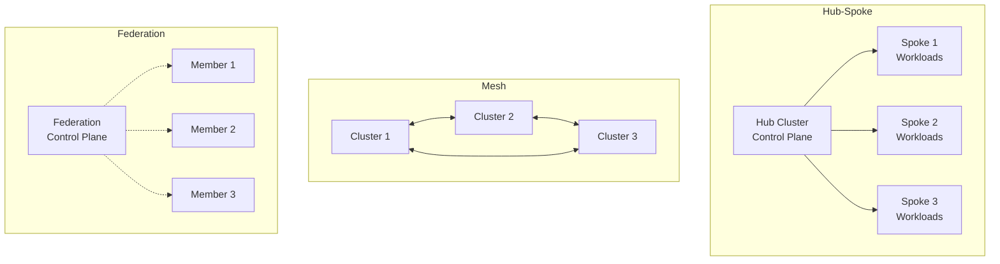

# Multi-Cluster Controller Patterns

**Document**: 70-multi-cluster-patterns.md
**Status**: Course Module - Distributed Systems
**Audience**: Platform Engineers, Multi-Cluster Operators
**Prerequisites**: Controllers, distributed systems, Kubernetes networking

---

## **Overview**

Managing resources across multiple Kubernetes clusters requires specialized controller patterns. This document covers multi-cluster architectures and implementations.

### **Use Cases**

1. **High Availability** - Survive cluster failures
2. **Geographic Distribution** - Low latency worldwide
3. **Hybrid Cloud** - Span on-prem and cloud
4. **Isolation** - Separate environments (dev/staging/prod)
5. **Scalability** - Beyond single cluster limits

---

## **1. Multi-Cluster Architectures**

### **1.1 Topology Patterns**



---

## **2. Hub-Spoke Pattern**

### **2.1 Central Controller**

```go
type MultiClusterController struct {
    // Hub cluster client
    hubClient client.Client

    // Spoke cluster clients
    spokeClients map[string]client.Client

    // Resource replicator
    replicator *ResourceReplicator
}

func (c *MultiClusterController) Reconcile(ctx context.Context, req ctrl.Request) (ctrl.Result, error) {
    // Get resource from hub cluster
    resource := &appsv1.Deployment{}
    if err := c.hubClient.Get(ctx, req.NamespacedName, resource); err != nil {
        return ctrl.Result{}, client.IgnoreNotFound(err)
    }

    // Determine target clusters from labels
    targetClusters := c.getTargetClusters(resource)

    // Replicate to spoke clusters
    for _, clusterName := range targetClusters {
        spokeClient := c.spokeClients[clusterName]
        if err := c.replicateToCluster(ctx, resource, spokeClient); err != nil {
            log.Error(err, "Failed to replicate", "cluster", clusterName)
            continue
        }
    }

    // Aggregate status from spokes
    if err := c.aggregateStatus(ctx, resource, targetClusters); err != nil {
        return ctrl.Result{}, err
    }

    return ctrl.Result{RequeueAfter: 30 * time.Second}, nil
}

func (c *MultiClusterController) getTargetClusters(resource client.Object) []string {
    // Read placement from annotation
    placement := resource.GetAnnotations()["multicluster.example.com/placement"]

    switch placement {
    case "all":
        return c.getAllClusters()
    case "region-us":
        return c.getClustersInRegion("us")
    case "region-eu":
        return c.getClustersInRegion("eu")
    default:
        // Parse comma-separated list
        return strings.Split(placement, ",")
    }
}

func (c *MultiClusterController) replicateToCluster(
    ctx context.Context,
    resource client.Object,
    targetClient client.Client,
) error {
    // Create copy for target cluster
    targetResource := resource.DeepCopyObject().(client.Object)

    // Remove hub-specific metadata
    targetResource.SetResourceVersion("")
    targetResource.SetUID("")

    // Add cluster context
    annotations := targetResource.GetAnnotations()
    if annotations == nil {
        annotations = make(map[string]string)
    }
    annotations["origin.cluster"] = "hub"
    targetResource.SetAnnotations(annotations)

    // Create or update in target cluster
    err := targetClient.Get(ctx, client.ObjectKeyFromObject(resource), targetResource)
    if errors.IsNotFound(err) {
        return targetClient.Create(ctx, targetResource)
    } else if err != nil {
        return err
    }

    return targetClient.Update(ctx, targetResource)
}
```

---

## **3. Cluster API Integration**

### **3.1 Managing Workload Clusters**

```go
import (
    clusterv1 "sigs.k8s.io/cluster-api/api/v1beta1"
)

type ClusterProvisioner struct {
    client client.Client
}

func (p *ClusterProvisioner) ProvisionCluster(ctx context.Context, name, region string) error {
    cluster := &clusterv1.Cluster{
        ObjectMeta: metav1.ObjectMeta{
            Name:      name,
            Namespace: "clusters",
        },
        Spec: clusterv1.ClusterSpec{
            ClusterNetwork: &clusterv1.ClusterNetwork{
                Pods: &clusterv1.NetworkRanges{
                    CIDRBlocks: []string{"10.240.0.0/16"},
                },
                Services: &clusterv1.NetworkRanges{
                    CIDRBlocks: []string{"10.0.0.0/16"},
                },
            },
            InfrastructureRef: &corev1.ObjectReference{
                APIVersion: "infrastructure.cluster.x-k8s.io/v1beta1",
                Kind:       "AWSCluster",
                Name:       name,
            },
        },
    }

    return p.client.Create(ctx, cluster)
}

func (p *ClusterProvisioner) WaitForCluster(ctx context.Context, name string) error {
    return wait.PollImmediate(10*time.Second, 30*time.Minute, func() (bool, error) {
        cluster := &clusterv1.Cluster{}
        if err := p.client.Get(ctx, client.ObjectKey{
            Namespace: "clusters",
            Name:      name,
        }, cluster); err != nil {
            return false, err
        }

        return cluster.Status.Phase == string(clusterv1.ClusterPhaseProvisioned), nil
    })
}
```

---

## **4. Service Mesh Integration**

### **4.1 Multi-Cluster Service Discovery**

```go
type MultiClusterServiceController struct {
    localClient   client.Client
    remoteClients map[string]client.Client
}

func (c *MultiClusterServiceController) Reconcile(ctx context.Context, req ctrl.Request) (ctrl.Result, error) {
    // Get service from local cluster
    svc := &corev1.Service{}
    if err := c.localClient.Get(ctx, req.NamespacedName, svc); err != nil {
        return ctrl.Result{}, client.IgnoreNotFound(err)
    }

    // Check if service should be exported
    if svc.Annotations["multicluster.export"] != "true" {
        return ctrl.Result{}, nil
    }

    // Create ServiceExport resource for service mesh
    export := &mcsv1alpha1.ServiceExport{
        ObjectMeta: metav1.ObjectMeta{
            Name:      svc.Name,
            Namespace: svc.Namespace,
        },
    }

    if err := c.localClient.Create(ctx, export); err != nil && !errors.IsAlreadyExists(err) {
        return ctrl.Result{}, err
    }

    // Import service in remote clusters
    for clusterName, remoteClient := range c.remoteClients {
        importSvc := &corev1.Service{
            ObjectMeta: metav1.ObjectMeta{
                Name:      svc.Name,
                Namespace: svc.Namespace,
                Annotations: map[string]string{
                    "multicluster.origin": clusterName,
                },
            },
            Spec: corev1.ServiceSpec{
                Type:         corev1.ServiceTypeExternalName,
                ExternalName: fmt.Sprintf("%s.%s.svc.clusterset.local", svc.Name, svc.Namespace),
            },
        }

        if err := remoteClient.Create(ctx, importSvc); err != nil && !errors.IsAlreadyExists(err) {
            log.Error(err, "Failed to import service", "cluster", clusterName)
        }
    }

    return ctrl.Result{}, nil
}
```

---

## **5. Data Replication Patterns**

### **5.1 ConfigMap/Secret Replication**

```go
type ConfigReplicator struct {
    sourceClient client.Client
    targetClients map[string]client.Client
}

func (r *ConfigReplicator) ReplicateConfigMap(ctx context.Context, cm *corev1.ConfigMap) error {
    // Check replication annotation
    if cm.Annotations["replicate-to"] == "" {
        return nil
    }

    targetClusters := strings.Split(cm.Annotations["replicate-to"], ",")

    for _, clusterName := range targetClusters {
        targetClient, ok := r.targetClients[clusterName]
        if !ok {
            continue
        }

        // Create replica
        replica := &corev1.ConfigMap{
            ObjectMeta: metav1.ObjectMeta{
                Name:      cm.Name,
                Namespace: cm.Namespace,
                Labels:    cm.Labels,
                Annotations: map[string]string{
                    "replicated-from": "source-cluster",
                },
            },
            Data: cm.Data,
        }

        // Create or update
        existing := &corev1.ConfigMap{}
        err := targetClient.Get(ctx, client.ObjectKeyFromObject(replica), existing)
        if errors.IsNotFound(err) {
            if err := targetClient.Create(ctx, replica); err != nil {
                return err
            }
        } else if err != nil {
            return err
        } else {
            existing.Data = replica.Data
            if err := targetClient.Update(ctx, existing); err != nil {
                return err
            }
        }
    }

    return nil
}
```

---

## **6. Failover and DR**

### **6.1 Automatic Failover**

```go
type FailoverController struct {
    primaryClient   client.Client
    secondaryClient client.Client
    healthChecker   *HealthChecker
}

func (c *FailoverController) Reconcile(ctx context.Context, req ctrl.Request) (ctrl.Result, error) {
    // Check primary cluster health
    healthy, err := c.healthChecker.CheckCluster(c.primaryClient)
    if err != nil || !healthy {
        log.Info("Primary cluster unhealthy, initiating failover")
        if err := c.initiateFailover(ctx); err != nil {
            return ctrl.Result{}, err
        }
        return ctrl.Result{RequeueAfter: 1 * time.Minute}, nil
    }

    // Primary is healthy, ensure resources are synced
    return ctrl.Result{RequeueAfter: 30 * time.Second}, nil
}

func (c *FailoverController) initiateFailover(ctx context.Context) error {
    // 1. Update DNS to point to secondary cluster
    if err := c.updateDNS("secondary"); err != nil {
        return err
    }

    // 2. Scale up secondary cluster deployments
    deployments := &appsv1.DeploymentList{}
    if err := c.secondaryClient.List(ctx, deployments); err != nil {
        return err
    }

    for _, dep := range deployments.Items {
        if dep.Spec.Replicas != nil && *dep.Spec.Replicas == 0 {
            // Scale up from 0
            replicas := int32(3)
            dep.Spec.Replicas = &replicas
            if err := c.secondaryClient.Update(ctx, &dep); err != nil {
                return err
            }
        }
    }

    // 3. Update status
    return c.recordFailoverEvent()
}
```

---

## **7. Testing Multi-Cluster**

### **7.1 Test Setup**

```go
func TestMultiClusterReplication(t *testing.T) {
    // Create test clusters using envtest
    hubEnv := &envtest.Environment{}
    spokeEnv := &envtest.Environment{}

    hubCfg, _ := hubEnv.Start()
    spokeCfg, _ := spokeEnv.Start()

    defer hubEnv.Stop()
    defer spokeEnv.Stop()

    // Create clients
    hubClient, _ := client.New(hubCfg, client.Options{Scheme: scheme})
    spokeClient, _ := client.New(spokeCfg, client.Options{Scheme: scheme})

    // Create controller
    controller := &MultiClusterController{
        hubClient: hubClient,
        spokeClients: map[string]client.Client{
            "spoke-1": spokeClient,
        },
    }

    // Test replication
    deployment := &appsv1.Deployment{
        ObjectMeta: metav1.ObjectMeta{
            Name:      "test",
            Namespace: "default",
            Annotations: map[string]string{
                "multicluster.example.com/placement": "spoke-1",
            },
        },
        Spec: appsv1.DeploymentSpec{
            Replicas: pointer.Int32(3),
        },
    }

    // Create in hub
    hubClient.Create(context.Background(), deployment)

    // Trigger reconcile
    controller.Reconcile(context.Background(), ctrl.Request{
        NamespacedName: client.ObjectKeyFromObject(deployment),
    })

    // Verify replicated to spoke
    replicated := &appsv1.Deployment{}
    err := spokeClient.Get(context.Background(),
        client.ObjectKeyFromObject(deployment),
        replicated)

    if err != nil {
        t.Fatalf("Deployment not replicated: %v", err)
    }
}
```

---

## **8. Best Practices**

**✅ Do's**:
1. Use eventual consistency model
2. Implement conflict resolution
3. Monitor cross-cluster latency
4. Handle network partitions gracefully
5. Implement circuit breakers
6. Use mTLS for inter-cluster communication
7. Version control placement policies

**❌ Don'ts**:
1. Don't assume synchronous replication
2. Don't ignore cluster isolation
3. Don't forget about network costs
4. Don't overlook security boundaries
5. Don't ignore data sovereignty
6. Don't create circular dependencies

---

## **9. Tools & Frameworks**

| Tool | Purpose | Use Case |
|------|---------|----------|
| Cluster API | Cluster lifecycle | Provision/manage clusters |
| KubeFed | Federation | Replicate resources |
| Submariner | Networking | Cross-cluster connectivity |
| Istio | Service mesh | Multi-cluster services |
| Cilium Cluster Mesh | Networking | Pod-to-pod across clusters |

---

## **Summary**

Multi-cluster patterns enable:
- **High availability** - Survive cluster failures
- **Geographic distribution** - Global presence
- **Scalability** - Beyond single cluster limits
- **Isolation** - Environment separation

Key patterns:
- Hub-spoke for centralized control
- Mesh for peer-to-peer coordination
- Federation for resource distribution
- Service mesh for cross-cluster communication

Design for eventual consistency and network partitions!
