# **CSI Architecture - Complete Overview**

━━━━━━━━━━━━━━━━━━━━━━━━━━━━━━━━━━━━━━━━━━━━━━━━━━━━━━━━━━━━━━━━━━━━━━━━━━━━━━

## **📋 Table of Contents**

1. [Introduction](#introduction)
2. [CSI Architecture Overview](#csi-architecture-overview)
3. [Component Interaction](#component-interaction)
4. [Volume Lifecycle End-to-End](#volume-lifecycle-end-to-end)
5. [CSI Spec Overview](#csi-spec-overview)
6. [Dynamic Provisioning Workflow](#dynamic-provisioning-workflow)
7. [Static Provisioning Workflow](#static-provisioning-workflow)
8. [Volume Snapshot Architecture](#volume-snapshot-architecture)
9. [Topology and Volume Scheduling](#topology-and-volume-scheduling)
10. [Key File Locations](#key-file-locations)
11. [Troubleshooting Guide](#troubleshooting-guide)

━━━━━━━━━━━━━━━━━━━━━━━━━━━━━━━━━━━━━━━━━━━━━━━━━━━━━━━━━━━━━━━━━━━━━━━━━━━━━━

## **🎯 Introduction**

### **Purpose**

The Container Storage Interface (CSI) is a standardized interface for exposing storage systems to container orchestration platforms like Kubernetes. This document provides a comprehensive architectural overview of how CSI integrates with Kubernetes, covering all components, workflows, and interactions.

### **What is CSI?**

CSI is an industry-standard API specification that allows storage vendors to develop plugins that work across multiple container orchestration systems without needing to understand the internals of each platform.

**Key Benefits:**
- **Vendor Independence**: Storage vendors can write one driver that works everywhere
- **Innovation**: New storage features can be added without modifying Kubernetes core
- **Stability**: In-tree volume plugins are being deprecated in favor of CSI
- **Flexibility**: Supports block and filesystem volumes, snapshots, cloning, expansion

### **CSI in Kubernetes Context**

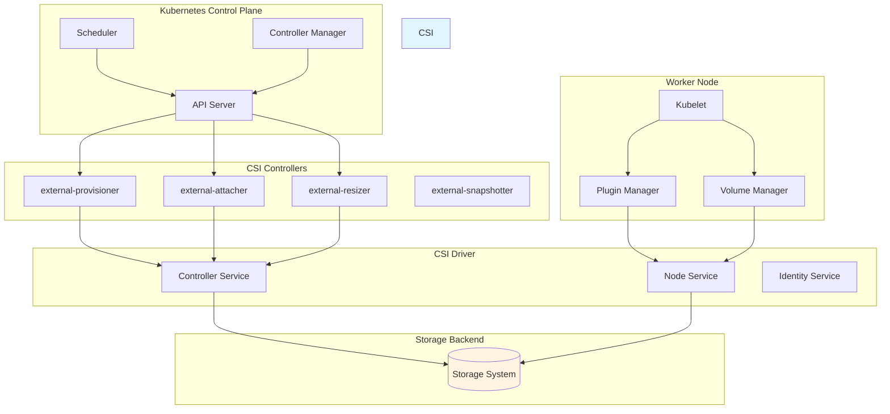

━━━━━━━━━━━━━━━━━━━━━━━━━━━━━━━━━━━━━━━━━━━━━━━━━━━━━━━━━━━━━━━━━━━━━━━━━━━━━━

## **🏗️ CSI Architecture Overview**

### **Three-Tier Architecture**

CSI in Kubernetes follows a three-tier architecture:

1. **Kubernetes Components** - API server, scheduler, controller-manager, kubelet
2. **CSI Sidecar Containers** - External controllers that watch Kubernetes API
3. **CSI Driver** - Vendor-specific implementation of the CSI specification

```mermaid
graph TB
    subgraph "Tier 1: Kubernetes Native"
        PVC[PersistentVolumeClaim]
        PV[PersistentVolume]
        SC[StorageClass]
        VA[VolumeAttachment]
        CSIDriver[CSIDriver Resource]
        CSINode[CSINode Resource]
        Pod[Pod with Volume]
    end

    subgraph "Tier 2: CSI Sidecars"
        Provisioner[external-provisioner<br/>Watches PVC]
        Attacher[external-attacher<br/>Watches VolumeAttachment]
        Resizer[external-resizer<br/>Watches PVC resize]
        Snapshotter[external-snapshotter<br/>Watches VolumeSnapshot]
        Registrar[node-driver-registrar<br/>Registers with kubelet]
    end

    subgraph "Tier 3: CSI Driver Plugin"
        Identity[Identity Service<br/>Plugin Info]
        Controller[Controller Service<br/>Volume Lifecycle]
        Node[Node Service<br/>Mount/Unmount]
    end

    subgraph "Storage Backend"
        Backend[(Storage<br/>System)]
    end

    PVC --> Provisioner
    VA --> Attacher
    PVC --> Resizer

    Provisioner --> Controller
    Attacher --> Controller
    Resizer --> Controller
    Snapshotter --> Controller

    Registrar --> Identity
    Registrar --> Node

    Pod --> Node

    Controller --> Backend
    Node --> Backend

    style "Tier 1: Kubernetes Native" fill:#e3f2fd
    style "Tier 2: CSI Sidecars" fill:#fff3e0
    style "Tier 3: CSI Driver Plugin" fill:#f3e5f5
```

### **Component Responsibilities**

#### **Kubernetes Components**

| Component | Responsibility | CSI Interaction |
|-----------|---------------|-----------------|
| **API Server** | Stores all resources (PV, PVC, StorageClass, VolumeAttachment) | Validates and persists CSI-related resources |
| **Scheduler** | Places pods on nodes considering volume constraints | Uses CSINode info for volume limits and topology |
| **PV Controller** | Binds PVs to PVCs | Triggers dynamic provisioning via StorageClass |
| **Attach/Detach Controller** | Manages volume attachment to nodes | Creates/deletes VolumeAttachment resources |
| **Kubelet** | Manages pod lifecycle and volumes | Mounts volumes via CSI node plugin |
| **Plugin Manager** | Discovers CSI drivers on node | Communicates with node-driver-registrar |

#### **CSI Sidecar Containers**

| Sidecar | Purpose | Key Operations |
|---------|---------|----------------|
| **external-provisioner** | Dynamic volume provisioning | Watches PVC → Calls CreateVolume → Creates PV |
| **external-attacher** | Volume attachment/detachment | Watches VolumeAttachment → Calls ControllerPublishVolume |
| **external-resizer** | Volume expansion | Watches PVC resize → Calls ControllerExpandVolume |
| **external-snapshotter** | Volume snapshots | Watches VolumeSnapshot → Calls CreateSnapshot |
| **external-health-monitor** | Volume health monitoring | Monitors volume health → Updates conditions |
| **node-driver-registrar** | Driver registration | Registers CSI driver with kubelet plugin manager |
| **livenessprobe** | Driver health checks | Probes driver → Updates health status |

#### **CSI Driver Services**

| Service | RPCs | Purpose |
|---------|------|---------|
| **Identity** | GetPluginInfo, GetPluginCapabilities, Probe | Plugin identification and capabilities |
| **Controller** | CreateVolume, DeleteVolume, ControllerPublishVolume, ControllerUnpublishVolume, ValidateVolumeCapabilities, ListVolumes, GetCapacity, ControllerExpandVolume, CreateSnapshot, DeleteSnapshot | Volume lifecycle management at storage backend |
| **Node** | NodeStageVolume, NodeUnstageVolume, NodePublishVolume, NodeUnpublishVolume, NodeGetVolumeStats, NodeExpandVolume, NodeGetCapabilities, NodeGetInfo | Volume operations on the node |

### **Deployment Models**

#### **Controller Plugin Deployment**

The controller plugin typically runs as a Deployment or StatefulSet on the control plane:

```yaml
apiVersion: apps/v1
kind: Deployment
metadata:
  name: csi-controller-plugin
  namespace: kube-system
spec:
  replicas: 2
  selector:
    matchLabels:
      app: csi-controller
  template:
    metadata:
      labels:
        app: csi-controller
    spec:
      serviceAccountName: csi-controller-sa
      containers:
      # CSI Driver Controller
      - name: csi-driver
        image: storage-vendor/csi-driver:v1.0
        args:
          - --endpoint=unix:///var/lib/csi/sockets/pluginproxy/csi.sock
          - --mode=controller
        volumeMounts:
        - name: socket-dir
          mountPath: /var/lib/csi/sockets/pluginproxy/

      # external-provisioner sidecar
      - name: csi-provisioner
        image: registry.k8s.io/sig-storage/csi-provisioner:v3.5.0
        args:
          - --csi-address=$(ADDRESS)
          - --v=5
          - --timeout=120s
          - --enable-capacity
          - --extra-create-metadata
        env:
        - name: ADDRESS
          value: /var/lib/csi/sockets/pluginproxy/csi.sock
        volumeMounts:
        - name: socket-dir
          mountPath: /var/lib/csi/sockets/pluginproxy/

      # external-attacher sidecar
      - name: csi-attacher
        image: registry.k8s.io/sig-storage/csi-attacher:v4.3.0
        args:
          - --csi-address=$(ADDRESS)
          - --v=5
          - --timeout=120s
        env:
        - name: ADDRESS
          value: /var/lib/csi/sockets/pluginproxy/csi.sock
        volumeMounts:
        - name: socket-dir
          mountPath: /var/lib/csi/sockets/pluginproxy/

      # external-resizer sidecar
      - name: csi-resizer
        image: registry.k8s.io/sig-storage/csi-resizer:v1.8.0
        args:
          - --csi-address=$(ADDRESS)
          - --v=5
          - --timeout=120s
        env:
        - name: ADDRESS
          value: /var/lib/csi/sockets/pluginproxy/csi.sock
        volumeMounts:
        - name: socket-dir
          mountPath: /var/lib/csi/sockets/pluginproxy/

      # external-snapshotter sidecar
      - name: csi-snapshotter
        image: registry.k8s.io/sig-storage/csi-snapshotter:v6.2.2
        args:
          - --csi-address=$(ADDRESS)
          - --v=5
        env:
        - name: ADDRESS
          value: /var/lib/csi/sockets/pluginproxy/csi.sock
        volumeMounts:
        - name: socket-dir
          mountPath: /var/lib/csi/sockets/pluginproxy/

      volumes:
      - name: socket-dir
        emptyDir: {}
```

#### **Node Plugin Deployment**

The node plugin runs as a DaemonSet on every node:

```yaml
apiVersion: apps/v1
kind: DaemonSet
metadata:
  name: csi-node-plugin
  namespace: kube-system
spec:
  selector:
    matchLabels:
      app: csi-node
  template:
    metadata:
      labels:
        app: csi-node
    spec:
      serviceAccountName: csi-node-sa
      hostNetwork: true
      containers:
      # CSI Driver Node Plugin
      - name: csi-driver
        image: storage-vendor/csi-driver:v1.0
        args:
          - --endpoint=unix:///csi/csi.sock
          - --mode=node
        securityContext:
          privileged: true
        volumeMounts:
        - name: plugin-dir
          mountPath: /csi
        - name: pods-mount-dir
          mountPath: /var/lib/kubelet/pods
          mountPropagation: Bidirectional
        - name: device-dir
          mountPath: /dev

      # node-driver-registrar sidecar
      - name: node-driver-registrar
        image: registry.k8s.io/sig-storage/csi-node-driver-registrar:v2.8.0
        args:
          - --csi-address=/csi/csi.sock
          - --kubelet-registration-path=/var/lib/kubelet/plugins/csi-driver/csi.sock
        volumeMounts:
        - name: plugin-dir
          mountPath: /csi
        - name: registration-dir
          mountPath: /registration

      # livenessprobe sidecar
      - name: liveness-probe
        image: registry.k8s.io/sig-storage/livenessprobe:v2.10.0
        args:
          - --csi-address=/csi/csi.sock
          - --health-port=9808
        volumeMounts:
        - name: plugin-dir
          mountPath: /csi

      volumes:
      - name: plugin-dir
        hostPath:
          path: /var/lib/kubelet/plugins/csi-driver
          type: DirectoryOrCreate
      - name: registration-dir
        hostPath:
          path: /var/lib/kubelet/plugins_registry
          type: Directory
      - name: pods-mount-dir
        hostPath:
          path: /var/lib/kubelet/pods
          type: Directory
      - name: device-dir
        hostPath:
          path: /dev
          type: Directory
```

### **Communication Patterns**

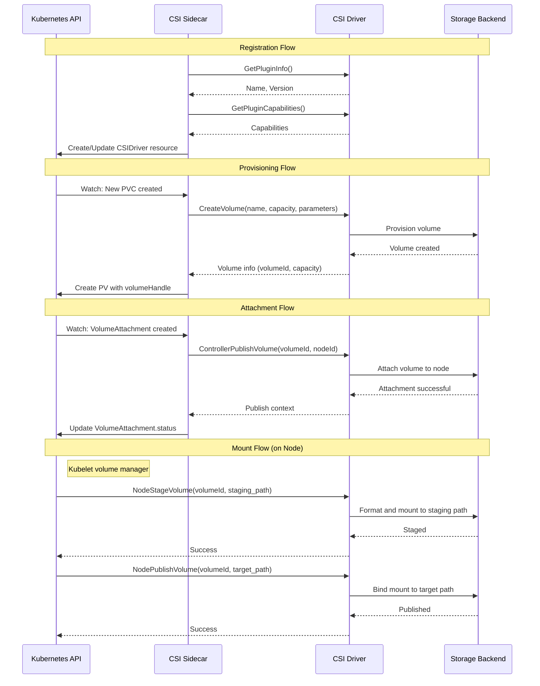

━━━━━━━━━━━━━━━━━━━━━━━━━━━━━━━━━━━━━━━━━━━━━━━━━━━━━━━━━━━━━━━━━━━━━━━━━━━━━━

## **🔄 Component Interaction**

### **Control Plane Interactions**

```mermaid
graph TB
    subgraph "API Server"
        PVC[PersistentVolumeClaim]
        PV[PersistentVolume]
        VA[VolumeAttachment]
        SC[StorageClass]
        Pod[Pod]
    end

    subgraph "Controller Manager"
        PVController[PV Controller]
        ADController[Attach/Detach Controller]
        ExpandController[Expand Controller]
    end

    subgraph "Scheduler"
        VolumeBinding[Volume Binding Plugin]
        VolumeLimits[Node Volume Limits]
    end

    subgraph "External CSI Controllers"
        Provisioner[external-provisioner]
        Attacher[external-attacher]
        Resizer[external-resizer]
    end

    subgraph "CSI Driver Controller"
        ControllerSvc[Controller Service]
    end

    PVC --> PVController
    PVC --> Provisioner
    PVC --> ExpandController
    PVC --> Resizer

    PVController --> PV
    PVController --> SC

    ADController --> VA
    VA --> Attacher

    Pod --> VolumeBinding
    VolumeBinding --> PV

    Provisioner --> ControllerSvc
    Attacher --> ControllerSvc
    Resizer --> ControllerSvc

    style "API Server" fill:#e3f2fd
    style "Controller Manager" fill:#fff3e0
    style "Scheduler" fill:#f3e5f5
    style "External CSI Controllers" fill:#e8f5e9
```

### **Node-Level Interactions**

```mermaid
graph TB
    subgraph "Kubelet"
        PodManager[Pod Manager]
        VolManager[Volume Manager]
        PluginManager[Plugin Manager]
    end

    subgraph "Volume Manager Components"
        DesiredState[Desired State<br/>of World]
        ActualState[Actual State<br/>of World]
        Reconciler[Reconciler Loop]
        OperationExecutor[Operation Executor]
    end

    subgraph "Plugin Manager Components"
        PluginWatcher[Plugin Watcher<br/>inotify on /var/lib/kubelet/plugins_registry/]
        RegistrationHandler[Registration Handler]
    end

    subgraph "CSI Node Components"
        NodeRegistrar[node-driver-registrar]
        CSIDriver[CSI Driver Node Service]
    end

    subgraph "Filesystem"
        PluginSocket[/var/lib/kubelet/plugins/csi-driver/csi.sock]
        RegistrySocket[/var/lib/kubelet/plugins_registry/csi-driver-reg.sock]
        MountPoint[/var/lib/kubelet/pods/POD_ID/volumes/...]
    end

    PodManager --> VolManager
    VolManager --> DesiredState
    VolManager --> ActualState
    VolManager --> Reconciler
    Reconciler --> OperationExecutor

    PluginManager --> PluginWatcher
    PluginWatcher --> RegistrationHandler

    NodeRegistrar --> RegistrySocket
    RegistrySocket --> PluginWatcher
    RegistrationHandler --> PluginSocket

    OperationExecutor --> PluginSocket
    PluginSocket --> CSIDriver

    CSIDriver --> MountPoint

    style Kubelet fill:#e3f2fd
    style "Volume Manager Components" fill:#fff3e0
    style "Plugin Manager Components" fill:#f3e5f5
```

### **Data Flow: Pod with CSI Volume**

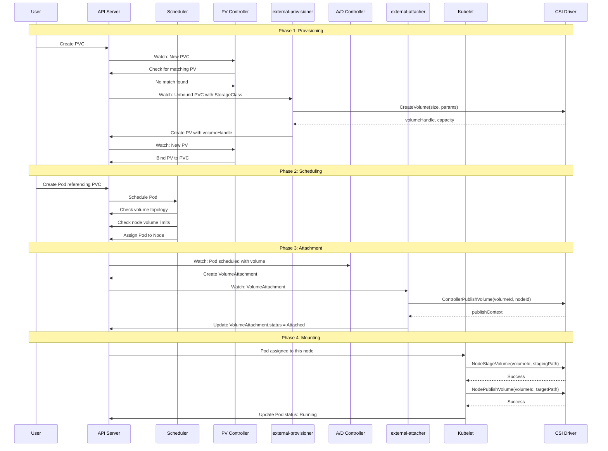

━━━━━━━━━━━━━━━━━━━━━━━━━━━━━━━━━━━━━━━━━━━━━━━━━━━━━━━━━━━━━━━━━━━━━━━━━━━━━━

## **🔄 Volume Lifecycle End-to-End**

### **Complete Lifecycle States**

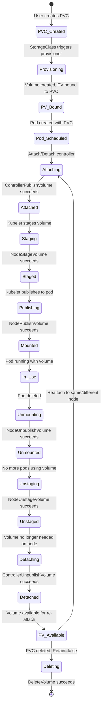

### **Detailed Phase Breakdown**

#### **Phase 1: Provisioning**

**Key File**: `/Users/sureshscribnar/Documents/Projects/opensource/kubernetes/pkg/controller/volume/persistentvolume/pv_controller.go`

```go
// From pv_controller.go:syncClaim
func (ctrl *PersistentVolumeController) syncClaim(ctx context.Context, claim *v1.PersistentVolumeClaim) error {
    // Check if claim is bound
    if claim.Spec.VolumeName == "" {
        // Try to find a matching PV
        volume, err := ctrl.volumes.findBestMatchForClaim(claim, delayBinding)
        if err != nil {
            // No matching volume, check if dynamic provisioning is enabled
            if storagehelpers.GetPersistentVolumeClaimClass(claim) != "" {
                // Dynamic provisioning will handle this
                return nil
            }
        }
        // Bind the claim to the volume
        return ctrl.bind(claim, volume)
    }
    return nil
}
```

**Dynamic Provisioning Flow**:

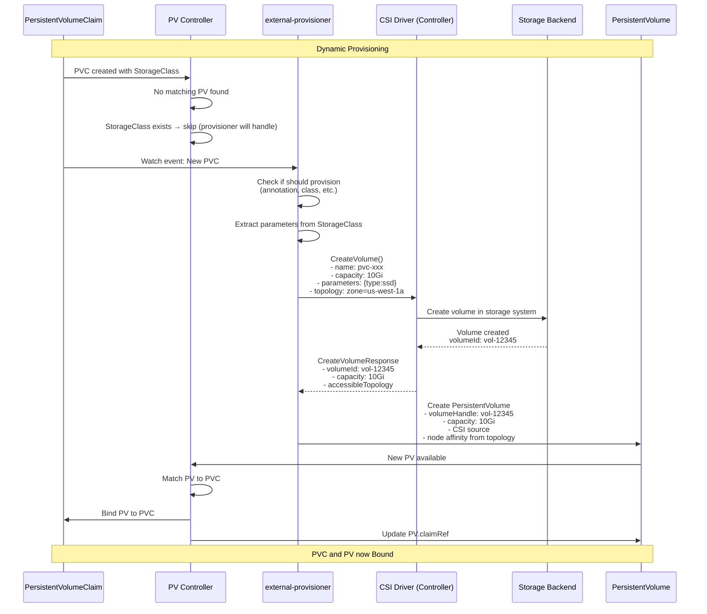

**Code Reference** - external-provisioner:
```go
// From external-provisioner: controller.go
func (p *ProvisionController) provisionClaimOperation(ctx context.Context, claim *v1.PersistentVolumeClaim) error {
    // Call CSI CreateVolume
    req := &csi.CreateVolumeRequest{
        Name:               pvName,
        CapacityRange:      &csi.CapacityRange{RequiredBytes: capacity},
        VolumeCapabilities: volumeCapabilities,
        Parameters:         parameters,
        Secrets:            secrets,
        AccessibilityRequirements: &csi.TopologyRequirement{
            Requisite: requisiteTopologies,
            Preferred: preferredTopologies,
        },
    }

    rsp, err := p.csiClient.CreateVolume(ctx, req)
    if err != nil {
        return err
    }

    // Create PV object
    pv := &v1.PersistentVolume{
        ObjectMeta: metav1.ObjectMeta{
            Name: pvName,
        },
        Spec: v1.PersistentVolumeSpec{
            Capacity: v1.ResourceList{
                v1.ResourceStorage: *resource.NewQuantity(rsp.Volume.CapacityBytes, resource.BinarySI),
            },
            PersistentVolumeSource: v1.PersistentVolumeSource{
                CSI: &v1.CSIPersistentVolumeSource{
                    Driver:       driverName,
                    VolumeHandle: rsp.Volume.VolumeId,
                    VolumeAttributes: rsp.Volume.VolumeContext,
                },
            },
            AccessModes: claim.Spec.AccessModes,
            ClaimRef: &v1.ObjectReference{
                Namespace: claim.Namespace,
                Name:      claim.Name,
                UID:       claim.UID,
            },
        },
    }

    // Create PV in API server
    _, err = p.client.CoreV1().PersistentVolumes().Create(ctx, pv, metav1.CreateOptions{})
    return err
}
```

#### **Phase 2: Scheduling**

**Key File**: `/Users/sureshscribnar/Documents/Projects/opensource/kubernetes/pkg/scheduler/framework/plugins/volumebinding/volume_binding.go`

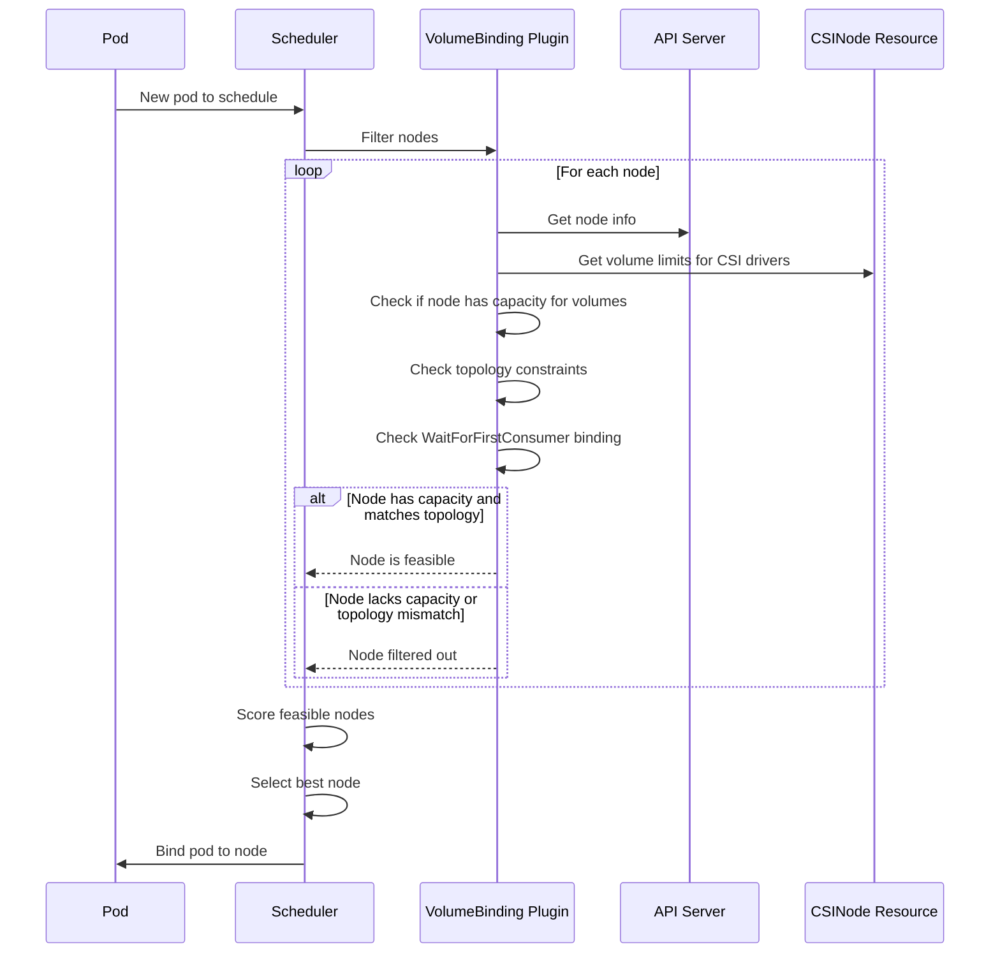

**Code Reference**:
```go
// From volume_binding.go:Filter
func (pl *VolumeBinding) Filter(ctx context.Context, cs *framework.CycleState, pod *v1.Pod, nodeInfo *framework.NodeInfo) *framework.Status {
    node := nodeInfo.Node()

    // Get state from pre-filter
    state, err := getStateData(cs)
    if err != nil {
        return framework.AsStatus(err)
    }

    // Check volume limits
    if err := pl.binder.checkVolumeLimits(node, state.podVolumesByNode[node.Name]); err != nil {
        return framework.NewStatus(framework.Unschedulable, err.Error())
    }

    // Check topology
    if !pl.binder.checkTopology(pod, node) {
        return framework.NewStatus(framework.Unschedulable, "node topology doesn't match volume requirements")
    }

    // For WaitForFirstConsumer volumes, check if binding can happen
    if state.hasWaitForFirstConsumer {
        reasons, err := pl.binder.findPodVolumes(pod, node)
        if err != nil {
            return framework.AsStatus(err)
        }
        if len(reasons) > 0 {
            return framework.NewStatus(framework.Unschedulable, reasons...)
        }
    }

    return nil
}
```

#### **Phase 3: Attachment**

**Key File**: `/Users/sureshscribnar/Documents/Projects/opensource/kubernetes/pkg/controller/volume/attachdetach/attach_detach_controller.go`

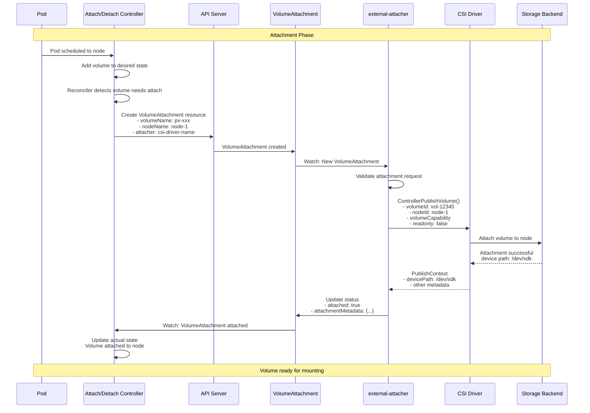

**Code Reference** - Attach/Detach Controller:
```go
// From attach_detach_controller.go:syncNode
func (adc *attachDetachController) reconcile() {
    // Get desired state
    desiredStateOfWorld := adc.desiredStateOfWorld

    // Get actual state
    actualStateOfWorld := adc.actualStateOfWorld

    // Attach volumes that should be attached but aren't
    for _, volumeToAttach := range desiredStateOfWorld.GetVolumesToAttach() {
        if !actualStateOfWorld.IsVolumeAttached(volumeToAttach.VolumeName, volumeToAttach.NodeName) {
            // Trigger attach operation
            err := adc.attacherDetacher.AttachVolume(volumeToAttach, actualStateOfWorld)
            if err != nil {
                klog.ErrorS(err, "Failed to attach volume")
            }
        }
    }

    // Detach volumes that shouldn't be attached but are
    for _, attachedVolume := range actualStateOfWorld.GetAttachedVolumes() {
        if !desiredStateOfWorld.VolumeExists(attachedVolume.VolumeName, attachedVolume.NodeName) {
            // Trigger detach operation
            err := adc.attacherDetacher.DetachVolume(attachedVolume, actualStateOfWorld)
            if err != nil {
                klog.ErrorS(err, "Failed to detach volume")
            }
        }
    }
}
```

**Code Reference** - external-attacher:
```go
// From external-attacher: controller.go
func (h *handler) syncAttach(va *storage.VolumeAttachment) error {
    // Call CSI ControllerPublishVolume
    publishContext, err := h.csiConnection.Attach(
        va.Spec.Source.PersistentVolumeName,
        readOnly,
        va.Spec.NodeName,
        volumeCapabilities,
        volumeContext,
        secrets,
    )
    if err != nil {
        return err
    }

    // Update VolumeAttachment status
    va.Status.Attached = true
    va.Status.AttachmentMetadata = publishContext
    _, err = h.client.StorageV1().VolumeAttachments().UpdateStatus(ctx, va, metav1.UpdateOptions{})
    return err
}
```

#### **Phase 4: Staging (Node-level)**

**Key File**: `/Users/sureshscribnar/Documents/Projects/opensource/kubernetes/pkg/kubelet/volumemanager/volume_manager.go`

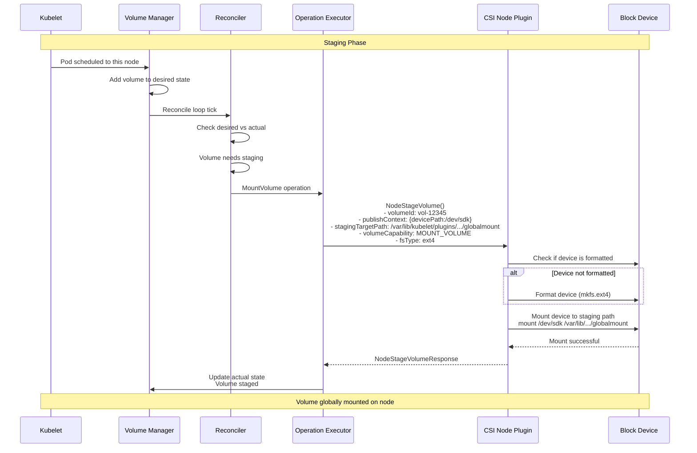

**Code Reference**:
```go
// From pkg/volume/csi/csi_mounter.go:SetUp (staging)
func (c *csiMountMgr) SetUp(mounterArgs volume.MounterArgs) error {
    // Check if already mounted
    if c.volumeManager.IsVolumeMountedOnNode(c.volumeID) {
        return nil
    }

    // Get staging path
    stagingPath := c.getStagingPath()

    // Call NodeStageVolume
    ctx, cancel := context.WithTimeout(context.Background(), csiTimeout)
    defer cancel()

    nodeStageReq := &csipb.NodeStageVolumeRequest{
        VolumeId:          c.volumeID,
        PublishContext:    c.publishContext,
        StagingTargetPath: stagingPath,
        VolumeCapability:  c.volumeCapability,
        VolumeContext:     c.volumeAttributes,
    }

    _, err := c.csiClient.NodeStageVolume(ctx, nodeStageReq)
    if err != nil {
        return fmt.Errorf("node stage volume failed: %v", err)
    }

    // Mark as staged
    c.volumeManager.MarkVolumeAsStaged(c.volumeID, stagingPath)
    return nil
}
```

#### **Phase 5: Publishing (Pod-level)**

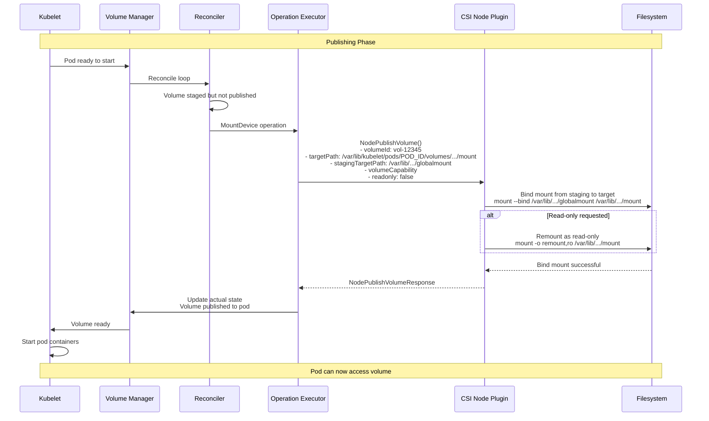

**Code Reference**:
```go
// From pkg/volume/csi/csi_mounter.go:SetUpAt (publishing)
func (c *csiMountMgr) SetUpAt(dir string, mounterArgs volume.MounterArgs) error {
    // Get staging path
    stagingPath := c.getStagingPath()

    // Call NodePublishVolume
    ctx, cancel := context.WithTimeout(context.Background(), csiTimeout)
    defer cancel()

    nodePublishReq := &csipb.NodePublishVolumeRequest{
        VolumeId:          c.volumeID,
        StagingTargetPath: stagingPath,
        TargetPath:        dir,
        VolumeCapability:  c.volumeCapability,
        Readonly:          c.readOnly,
        VolumeContext:     c.volumeAttributes,
    }

    _, err := c.csiClient.NodePublishVolume(ctx, nodePublishReq)
    if err != nil {
        return fmt.Errorf("node publish volume failed: %v", err)
    }

    return nil
}
```

#### **Phase 6: Unmount/Cleanup**

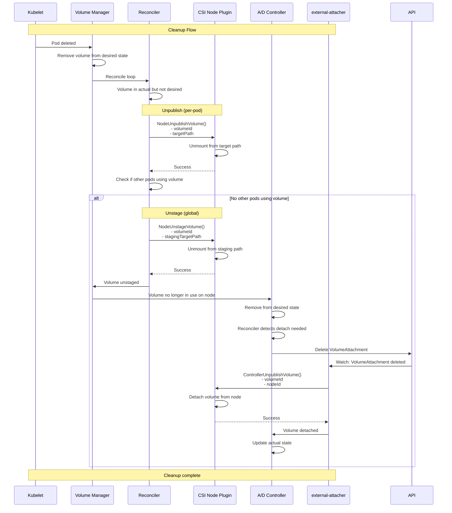

━━━━━━━━━━━━━━━━━━━━━━━━━━━━━━━━━━━━━━━━━━━━━━━━━━━━━━━━━━━━━━━━━━━━━━━━━━━━━━

## **📡 CSI Spec Overview**

### **CSI Services**

The CSI specification defines three gRPC services:

```mermaid
graph TB
    subgraph "CSI Driver"
        Identity[Identity Service<br/>REQUIRED]
        Controller[Controller Service<br/>OPTIONAL]
        Node[Node Service<br/>REQUIRED for node plugins]
    end

    subgraph "Identity Service RPCs"
        GetPluginInfo[GetPluginInfo<br/>Returns name and version]
        GetPluginCapabilities[GetPluginCapabilities<br/>Returns capabilities]
        Probe[Probe<br/>Health check]
    end

    subgraph "Controller Service RPCs"
        CreateVolume[CreateVolume]
        DeleteVolume[DeleteVolume]
        ControllerPublish[ControllerPublishVolume]
        ControllerUnpublish[ControllerUnpublishVolume]
        ValidateCapabilities[ValidateVolumeCapabilities]
        ListVolumes[ListVolumes]
        GetCapacity[GetCapacity]
        ControllerExpand[ControllerExpandVolume]
        CreateSnapshot[CreateSnapshot]
        DeleteSnapshot[DeleteSnapshot]
        ListSnapshots[ListSnapshots]
    end

    subgraph "Node Service RPCs"
        NodeStage[NodeStageVolume]
        NodeUnstage[NodeUnstageVolume]
        NodePublish[NodePublishVolume]
        NodeUnpublish[NodeUnpublishVolume]
        NodeGetInfo[NodeGetInfo]
        NodeGetCapabilities[NodeGetCapabilities]
        NodeGetVolumeStats[NodeGetVolumeStats]
        NodeExpand[NodeExpandVolume]
    end

    Identity --> GetPluginInfo
    Identity --> GetPluginCapabilities
    Identity --> Probe

    Controller --> CreateVolume
    Controller --> DeleteVolume
    Controller --> ControllerPublish
    Controller --> ControllerUnpublish
    Controller --> ValidateCapabilities
    Controller --> ListVolumes
    Controller --> GetCapacity
    Controller --> ControllerExpand
    Controller --> CreateSnapshot
    Controller --> DeleteSnapshot
    Controller --> ListSnapshots

    Node --> NodeStage
    Node --> NodeUnstage
    Node --> NodePublish
    Node --> NodeUnpublish
    Node --> NodeGetInfo
    Node --> NodeGetCapabilities
    Node --> NodeGetVolumeStats
    Node --> NodeExpand
```

### **Identity Service**

The Identity service is required and provides plugin information.

**GetPluginInfo**:
```protobuf
message GetPluginInfoRequest {
  // Intentionally empty
}

message GetPluginInfoResponse {
  // Name of the plugin
  string name = 1;

  // Version of the plugin
  string vendor_version = 2;

  // Optional manifest
  map<string, string> manifest = 3;
}
```

**GetPluginCapabilities**:
```protobuf
message GetPluginCapabilitiesRequest {
  // Intentionally empty
}

message GetPluginCapabilitiesResponse {
  repeated PluginCapability capabilities = 1;
}

message PluginCapability {
  oneof type {
    Service service = 1;
    VolumeExpansion volume_expansion = 2;
  }

  message Service {
    enum Type {
      UNKNOWN = 0;
      CONTROLLER_SERVICE = 1;
      VOLUME_ACCESSIBILITY_CONSTRAINTS = 2;
    }
    Type type = 1;
  }

  message VolumeExpansion {
    enum Type {
      UNKNOWN = 0;
      ONLINE = 1;
      OFFLINE = 2;
    }
    Type type = 1;
  }
}
```

**Probe**:
```protobuf
message ProbeRequest {
  // Intentionally empty
}

message ProbeResponse {
  // Ready indicates that the plugin is ready to serve requests
  google.protobuf.BoolValue ready = 1;
}
```

### **Controller Service**

The Controller service manages volume lifecycle at the storage backend.

**CreateVolume**:
```protobuf
message CreateVolumeRequest {
  // Name of the volume
  string name = 1;

  // Volume capabilities
  repeated VolumeCapability volume_capabilities = 2;

  // Capacity range
  CapacityRange capacity_range = 3;

  // Parameters from StorageClass
  map<string, string> parameters = 4;

  // Secrets for authentication
  map<string, string> secrets = 5;

  // Volume content source (clone or snapshot)
  VolumeContentSource volume_content_source = 6;

  // Topology requirements
  TopologyRequirement accessibility_requirements = 7;
}

message CreateVolumeResponse {
  Volume volume = 1;
}

message Volume {
  // Unique volume ID
  string volume_id = 1;

  // Capacity in bytes
  int64 capacity_bytes = 2;

  // Volume context
  map<string, string> volume_context = 3;

  // Content source used
  VolumeContentSource content_source = 4;

  // Accessible topology
  repeated Topology accessible_topology = 5;
}
```

**ControllerPublishVolume** (Attach):
```protobuf
message ControllerPublishVolumeRequest {
  // Volume ID
  string volume_id = 1;

  // Node ID where volume should be published
  string node_id = 2;

  // Volume capability
  VolumeCapability volume_capability = 3;

  // Read-only flag
  bool readonly = 4;

  // Secrets
  map<string, string> secrets = 5;

  // Volume context
  map<string, string> volume_context = 6;
}

message ControllerPublishVolumeResponse {
  // Publish context (e.g., device path)
  map<string, string> publish_context = 1;
}
```

**ControllerExpandVolume**:
```protobuf
message ControllerExpandVolumeRequest {
  // Volume ID
  string volume_id = 1;

  // New capacity range
  CapacityRange capacity_range = 2;

  // Secrets
  map<string, string> secrets = 3;

  // Volume capability
  VolumeCapability volume_capability = 4;
}

message ControllerExpandVolumeResponse {
  // New capacity in bytes
  int64 capacity_bytes = 1;

  // Whether node expansion is required
  bool node_expansion_required = 2;
}
```

### **Node Service**

The Node service manages volume operations on the node.

**NodeStageVolume**:
```protobuf
message NodeStageVolumeRequest {
  // Volume ID
  string volume_id = 1;

  // Publish context from ControllerPublishVolume
  map<string, string> publish_context = 2;

  // Staging target path (global mount point)
  string staging_target_path = 3;

  // Volume capability
  VolumeCapability volume_capability = 4;

  // Secrets
  map<string, string> secrets = 5;

  // Volume context
  map<string, string> volume_context = 6;
}

message NodeStageVolumeResponse {
  // Intentionally empty
}
```

**NodePublishVolume**:
```protobuf
message NodePublishVolumeRequest {
  // Volume ID
  string volume_id = 1;

  // Publish context
  map<string, string> publish_context = 2;

  // Staging target path
  string staging_target_path = 3;

  // Target path for pod (bind mount destination)
  string target_path = 4;

  // Volume capability
  VolumeCapability volume_capability = 5;

  // Read-only flag
  bool readonly = 6;

  // Secrets
  map<string, string> secrets = 7;

  // Volume context
  map<string, string> volume_context = 8;
}

message NodePublishVolumeResponse {
  // Intentionally empty
}
```

**NodeGetInfo**:
```protobuf
message NodeGetInfoRequest {
  // Intentionally empty
}

message NodeGetInfoResponse {
  // Node ID (unique identifier for this node)
  string node_id = 1;

  // Maximum volumes that can be attached to this node
  int64 max_volumes_per_node = 2;

  // Accessible topology for this node
  Topology accessible_topology = 3;
}
```

**NodeExpandVolume**:
```protobuf
message NodeExpandVolumeRequest {
  // Volume ID
  string volume_id = 1;

  // Volume path
  string volume_path = 2;

  // New capacity range
  CapacityRange capacity_range = 3;

  // Staging target path
  string staging_target_path = 4;

  // Volume capability
  VolumeCapability volume_capability = 5;
}

message NodeExpandVolumeResponse {
  // New capacity in bytes
  int64 capacity_bytes = 1;
}
```

### **Volume Capabilities**

```protobuf
message VolumeCapability {
  oneof access_type {
    // Mount volume
    MountVolume mount = 1;

    // Block volume
    BlockVolume block = 2;
  }

  // Access mode
  AccessMode access_mode = 3;

  message MountVolume {
    // Filesystem type (ext4, xfs, etc.)
    string fs_type = 1;

    // Mount flags
    repeated string mount_flags = 2;
  }

  message BlockVolume {
    // Intentionally empty
  }

  message AccessMode {
    enum Mode {
      UNKNOWN = 0;
      SINGLE_NODE_WRITER = 1;      // ReadWriteOnce
      SINGLE_NODE_READER_ONLY = 2; // ReadOnlyMany (single node)
      MULTI_NODE_READER_ONLY = 3;  // ReadOnlyMany
      MULTI_NODE_SINGLE_WRITER = 4; // ReadWriteMany (one writer)
      MULTI_NODE_MULTI_WRITER = 5;  // ReadWriteMany
      SINGLE_NODE_SINGLE_WRITER = 6; // ReadWriteOncePod
    }
    Mode mode = 1;
  }
}
```

### **Topology**

```protobuf
message Topology {
  // Topology segments (zone, region, rack, etc.)
  map<string, string> segments = 1;
}

message TopologyRequirement {
  // Requisite topologies (volume MUST be accessible from one of these)
  repeated Topology requisite = 1;

  // Preferred topologies (preference order)
  repeated Topology preferred = 2;
}
```

━━━━━━━━━━━━━━━━━━━━━━━━━━━━━━━━━━━━━━━━━━━━━━━━━━━━━━━━━━━━━━━━━━━━━━━━━━━━━━

## **⚡ Dynamic Provisioning Workflow**

### **Complete Flow**

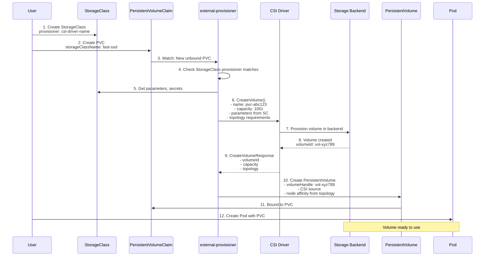

### **Example: AWS EBS CSI Driver**

**StorageClass**:
```yaml
apiVersion: storage.k8s.io/v1
kind: StorageClass
metadata:
  name: ebs-sc
provisioner: ebs.csi.aws.com
parameters:
  type: gp3
  iops: "3000"
  throughput: "125"
  encrypted: "true"
  kmsKeyId: "arn:aws:kms:us-west-2:111122223333:key/1234abcd-12ab-34cd-56ef-1234567890ab"
volumeBindingMode: WaitForFirstConsumer
allowVolumeExpansion: true
reclaimPolicy: Delete
```

**PVC**:
```yaml
apiVersion: v1
kind: PersistentVolumeClaim
metadata:
  name: my-pvc
spec:
  accessModes:
    - ReadWriteOnce
  storageClassName: ebs-sc
  resources:
    requests:
      storage: 10Gi
```

**Provisioning Code Flow**:

```go
// external-provisioner watching for new PVCs
func (p *ProvisionController) shouldProvision(claim *v1.PersistentVolumeClaim) bool {
    // Check if PVC is already bound
    if claim.Spec.VolumeName != "" {
        return false
    }

    // Check if StorageClass exists and matches our provisioner
    class, err := p.getStorageClass(claim.Spec.StorageClassName)
    if err != nil {
        return false
    }

    if class.Provisioner != p.provisionerName {
        return false
    }

    return true
}

func (p *ProvisionController) provisionVolume(claim *v1.PersistentVolumeClaim) (*v1.PersistentVolume, error) {
    // Get StorageClass
    class, err := p.getStorageClass(claim.Spec.StorageClassName)
    if err != nil {
        return nil, err
    }

    // Extract parameters
    parameters := class.Parameters

    // Build CreateVolume request
    capacity := claim.Spec.Resources.Requests[v1.ResourceStorage]
    req := &csi.CreateVolumeRequest{
        Name: fmt.Sprintf("pvc-%s", claim.UID),
        CapacityRange: &csi.CapacityRange{
            RequiredBytes: capacity.Value(),
        },
        VolumeCapabilities: getVolumeCapabilities(claim),
        Parameters:         parameters,
        Secrets:            getSecrets(class),
        AccessibilityRequirements: getTopologyRequirements(claim),
    }

    // Call CSI CreateVolume
    resp, err := p.csiClient.CreateVolume(context.Background(), req)
    if err != nil {
        return nil, err
    }

    // Create PersistentVolume
    pv := &v1.PersistentVolume{
        ObjectMeta: metav1.ObjectMeta{
            Name: fmt.Sprintf("pvc-%s", claim.UID),
            Annotations: map[string]string{
                "pv.kubernetes.io/provisioned-by": p.provisionerName,
            },
        },
        Spec: v1.PersistentVolumeSpec{
            Capacity: v1.ResourceList{
                v1.ResourceStorage: *resource.NewQuantity(resp.Volume.CapacityBytes, resource.BinarySI),
            },
            PersistentVolumeSource: v1.PersistentVolumeSource{
                CSI: &v1.CSIPersistentVolumeSource{
                    Driver:           p.driverName,
                    VolumeHandle:     resp.Volume.VolumeId,
                    VolumeAttributes: resp.Volume.VolumeContext,
                    FSType:           getFSType(class),
                },
            },
            AccessModes:                   claim.Spec.AccessModes,
            PersistentVolumeReclaimPolicy: *class.ReclaimPolicy,
            StorageClassName:              class.Name,
            NodeAffinity:                  getNodeAffinity(resp.Volume.AccessibleTopology),
            ClaimRef: &v1.ObjectReference{
                Namespace: claim.Namespace,
                Name:      claim.Name,
                UID:       claim.UID,
            },
        },
    }

    return p.client.CoreV1().PersistentVolumes().Create(context.Background(), pv, metav1.CreateOptions{})
}
```

### **Parameters and Secrets**

**Parameters Flow**:
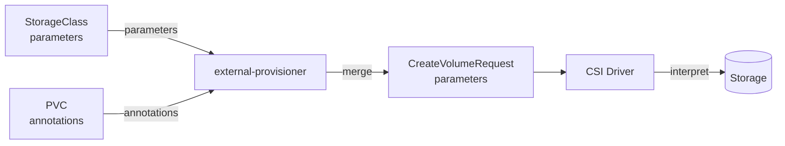

**Secrets Flow**:
```yaml
apiVersion: storage.k8s.io/v1
kind: StorageClass
metadata:
  name: secure-storage
provisioner: csi-driver-name
parameters:
  type: premium
  # Reference to secret for provisioning
  csi.storage.k8s.io/provisioner-secret-name: csi-secrets
  csi.storage.k8s.io/provisioner-secret-namespace: kube-system
  # Reference to secret for attaching
  csi.storage.k8s.io/controller-publish-secret-name: csi-secrets
  csi.storage.k8s.io/controller-publish-secret-namespace: kube-system
  # Reference to secret for node operations
  csi.storage.k8s.io/node-stage-secret-name: csi-secrets
  csi.storage.k8s.io/node-stage-secret-namespace: kube-system
  csi.storage.k8s.io/node-publish-secret-name: csi-secrets
  csi.storage.k8s.io/node-publish-secret-namespace: kube-system
```

━━━━━━━━━━━━━━━━━━━━━━━━━━━━━━━━━━━━━━━━━━━━━━━━━━━━━━━━━━━━━━━━━━━━━━━━━━━━━━

## **📦 Static Provisioning Workflow**

### **Manual Volume Creation**

Static provisioning involves manually creating a volume in the storage backend, then creating a PV that references it.

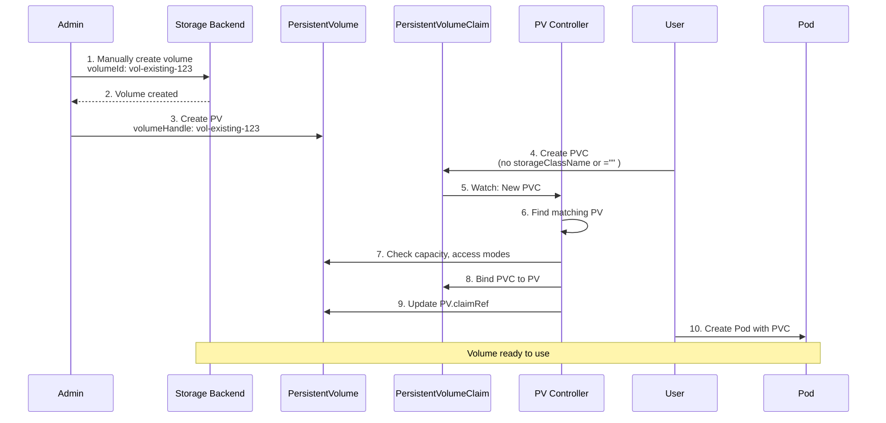

### **Static PV Example**

**Manually create volume** (example with AWS EBS):
```bash
# Create EBS volume manually
aws ec2 create-volume \
  --availability-zone us-west-2a \
  --size 10 \
  --volume-type gp3 \
  --tag-specifications 'ResourceType=volume,Tags=[{Key=Name,Value=my-static-volume}]'

# Output: vol-0abcd1234efgh5678
```

**Create PersistentVolume**:
```yaml
apiVersion: v1
kind: PersistentVolume
metadata:
  name: static-pv
spec:
  capacity:
    storage: 10Gi
  volumeMode: Filesystem
  accessModes:
    - ReadWriteOnce
  persistentVolumeReclaimPolicy: Retain
  csi:
    driver: ebs.csi.aws.com
    volumeHandle: vol-0abcd1234efgh5678
    fsType: ext4
  nodeAffinity:
    required:
      nodeSelectorTerms:
      - matchExpressions:
        - key: topology.ebs.csi.aws.com/zone
          operator: In
          values:
          - us-west-2a
```

**Create PersistentVolumeClaim**:
```yaml
apiVersion: v1
kind: PersistentVolumeClaim
metadata:
  name: static-pvc
spec:
  accessModes:
    - ReadWriteOnce
  resources:
    requests:
      storage: 10Gi
  volumeName: static-pv  # Explicitly bind to this PV
  storageClassName: ""   # Empty string to prevent dynamic provisioning
```

### **Binding Logic**

**Code Reference**: `/Users/sureshscribnar/Documents/Projects/opensource/kubernetes/pkg/controller/volume/persistentvolume/pv_controller.go`

```go
// From pv_controller.go:syncClaim
func (ctrl *PersistentVolumeController) syncClaim(ctx context.Context, claim *v1.PersistentVolumeClaim) error {
    // Check if PVC specifies a volume name
    if claim.Spec.VolumeName != "" {
        // Pre-bound PVC
        volume, err := ctrl.volumes.find(claim.Spec.VolumeName)
        if err != nil {
            return err
        }

        // Verify the volume matches the claim requirements
        if err := checkVolumeMatch(claim, volume); err != nil {
            return err
        }

        // Bind them
        return ctrl.bind(claim, volume)
    }

    // Find a matching volume
    volume, err := ctrl.volumes.findBestMatchForClaim(claim, delayBinding)
    if err != nil {
        return err
    }

    if volume == nil {
        // No matching volume found
        // Check if dynamic provisioning is possible
        if storagehelpers.GetPersistentVolumeClaimClass(claim) == "" {
            // No StorageClass, static provisioning only
            return fmt.Errorf("no matching volume found for claim")
        }
        // Dynamic provisioning will handle this
        return nil
    }

    // Bind claim to found volume
    return ctrl.bind(claim, volume)
}

func (ctrl *PersistentVolumeController) findBestMatchForClaim(claim *v1.PersistentVolumeClaim, delayBinding bool) (*v1.PersistentVolume, error) {
    // Get all available volumes
    volumes, err := ctrl.volumes.listAvailableVolumes()
    if err != nil {
        return nil, err
    }

    var bestMatch *v1.PersistentVolume
    var bestMatchSize int64 = math.MaxInt64

    for _, volume := range volumes {
        // Check if volume matches claim requirements
        if !checkVolumeMatch(claim, volume) {
            continue
        }

        // Find smallest volume that satisfies the claim
        volumeSize := volume.Spec.Capacity[v1.ResourceStorage]
        if volumeSize.Cmp(claim.Spec.Resources.Requests[v1.ResourceStorage]) >= 0 {
            if volumeSize.Value() < bestMatchSize {
                bestMatch = volume
                bestMatchSize = volumeSize.Value()
            }
        }
    }

    return bestMatch, nil
}

func checkVolumeMatch(claim *v1.PersistentVolumeClaim, volume *v1.PersistentVolume) bool {
    // Check access modes
    if !hasMatchingAccessMode(claim.Spec.AccessModes, volume.Spec.AccessModes) {
        return false
    }

    // Check capacity
    requestedSize := claim.Spec.Resources.Requests[v1.ResourceStorage]
    volumeSize := volume.Spec.Capacity[v1.ResourceStorage]
    if volumeSize.Cmp(requestedSize) < 0 {
        return false
    }

    // Check storage class
    if claim.Spec.StorageClassName != nil && volume.Spec.StorageClassName != *claim.Spec.StorageClassName {
        return false
    }

    // Check selector
    if claim.Spec.Selector != nil {
        if !volume.MatchesSelector(claim.Spec.Selector) {
            return false
        }
    }

    return true
}
```

━━━━━━━━━━━━━━━━━━━━━━━━━━━━━━━━━━━━━━━━━━━━━━━━━━━━━━━━━━━━━━━━━━━━━━━━━━━━━━

## **📸 Volume Snapshot Architecture**

### **Snapshot Components**

```mermaid
graph TB
    subgraph "Snapshot API Resources"
        VSC[VolumeSnapshotClass]
        VS[VolumeSnapshot]
        VSC_Content[VolumeSnapshotContent]
    end

    subgraph "Controllers"
        SnapCtrl[snapshot-controller]
        ExtSnap[external-snapshotter]
    end

    subgraph "CSI Driver"
        Controller[Controller Service<br/>CreateSnapshot<br/>DeleteSnapshot]
    end

    subgraph "Storage Backend"
        Storage[(Storage with<br/>Snapshot Support)]
    end

    VS --> SnapCtrl
    SnapCtrl --> VSC_Content
    VSC_Content --> ExtSnap
    ExtSnap --> Controller
    Controller --> Storage

    VSC --> VS
    VSC_Content --> VS

    style "Snapshot API Resources" fill:#e3f2fd
    style Controllers fill:#fff3e0
```

### **Snapshot Workflow**

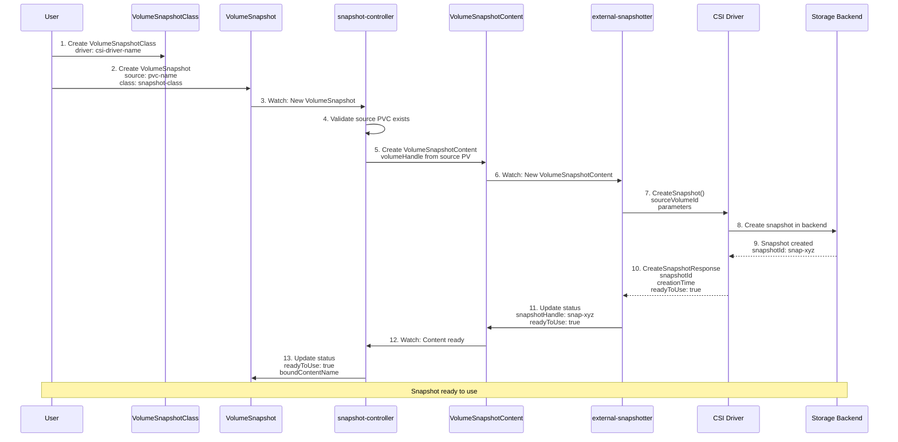

### **Snapshot API Resources**

**VolumeSnapshotClass**:
```yaml
apiVersion: snapshot.storage.k8s.io/v1
kind: VolumeSnapshotClass
metadata:
  name: csi-snapclass
driver: ebs.csi.aws.com
deletionPolicy: Delete
parameters:
  # Driver-specific parameters
  tagSpecification_1: "snapshot={{ .VolumeSnapshotName }}"
  tagSpecification_2: "namespace={{ .VolumeSnapshotNamespace }}"
```

**VolumeSnapshot**:
```yaml
apiVersion: snapshot.storage.k8s.io/v1
kind: VolumeSnapshot
metadata:
  name: my-snapshot
spec:
  volumeSnapshotClassName: csi-snapclass
  source:
    persistentVolumeClaimName: my-pvc
```

**VolumeSnapshotContent** (created automatically):
```yaml
apiVersion: snapshot.storage.k8s.io/v1
kind: VolumeSnapshotContent
metadata:
  name: snapcontent-1234
spec:
  deletionPolicy: Delete
  driver: ebs.csi.aws.com
  source:
    volumeHandle: vol-0abcd1234efgh5678
  volumeSnapshotRef:
    name: my-snapshot
    namespace: default
status:
  snapshotHandle: snap-xyz789
  creationTime: 1609459200000000000
  readyToUse: true
  restoreSize: 10737418240
```

### **Restore from Snapshot**

```yaml
apiVersion: v1
kind: PersistentVolumeClaim
metadata:
  name: restored-pvc
spec:
  storageClassName: ebs-sc
  dataSource:
    name: my-snapshot
    kind: VolumeSnapshot
    apiGroup: snapshot.storage.k8s.io
  accessModes:
    - ReadWriteOnce
  resources:
    requests:
      storage: 10Gi
```

**Restore Flow**:
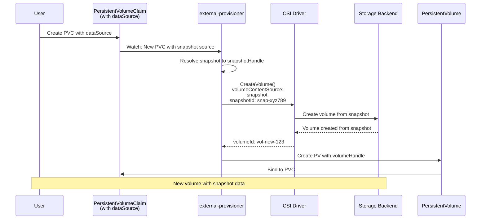

### **Snapshot Controller Code**

**Key File**: External snapshot-controller (separate repository)

```go
// Snapshot controller watching VolumeSnapshots
func (ctrl *csiSnapshotCommonController) syncSnapshot(snapshot *crdv1.VolumeSnapshot) error {
    // Check if snapshot is already bound
    if snapshot.Status != nil && snapshot.Status.BoundVolumeSnapshotContentName != nil {
        return ctrl.updateSnapshotStatus(snapshot)
    }

    // Get source PVC
    pvc, err := ctrl.client.CoreV1().PersistentVolumeClaims(snapshot.Namespace).Get(
        context.Background(),
        *snapshot.Spec.Source.PersistentVolumeClaimName,
        metav1.GetOptions{},
    )
    if err != nil {
        return err
    }

    // Get PV
    pv, err := ctrl.client.CoreV1().PersistentVolumes().Get(
        context.Background(),
        pvc.Spec.VolumeName,
        metav1.GetOptions{},
    )
    if err != nil {
        return err
    }

    // Create VolumeSnapshotContent
    content := &crdv1.VolumeSnapshotContent{
        ObjectMeta: metav1.ObjectMeta{
            Name: fmt.Sprintf("snapcontent-%s", snapshot.UID),
        },
        Spec: crdv1.VolumeSnapshotContentSpec{
            VolumeSnapshotRef: v1.ObjectReference{
                Name:      snapshot.Name,
                Namespace: snapshot.Namespace,
                UID:       snapshot.UID,
            },
            Source: crdv1.VolumeSnapshotContentSource{
                VolumeHandle: &pv.Spec.CSI.VolumeHandle,
            },
            VolumeSnapshotClassName: snapshot.Spec.VolumeSnapshotClassName,
            DeletionPolicy:          getDeletionPolicy(snapshot),
            Driver:                  pv.Spec.CSI.Driver,
        },
    }

    _, err = ctrl.clientset.SnapshotV1().VolumeSnapshotContents().Create(
        context.Background(),
        content,
        metav1.CreateOptions{},
    )
    return err
}
```

━━━━━━━━━━━━━━━━━━━━━━━━━━━━━━━━━━━━━━━━━━━━━━━━━━━━━━━━━━━━━━━━━━━━━━━━━━━━━━

## **🗺️ Topology and Volume Scheduling**

### **Topology-Aware Scheduling**

Topology allows volumes to be provisioned in specific zones, regions, or racks, and pods to be scheduled on nodes where volumes are accessible.

```mermaid
graph TB
    subgraph "Topology Levels"
        Region[region=us-west-2]
        Zone1[zone=us-west-2a]
        Zone2[zone=us-west-2b]
        Zone3[zone=us-west-2c]

        Region --> Zone1
        Region --> Zone2
        Region --> Zone3
    end

    subgraph "Nodes"
        Node1[Node1<br/>zone=us-west-2a]
        Node2[Node2<br/>zone=us-west-2b]
        Node3[Node3<br/>zone=us-west-2c]
    end

    subgraph "Volumes"
        Vol1[Volume1<br/>zone=us-west-2a]
        Vol2[Volume2<br/>zone=us-west-2b]
    end

    Zone1 --> Node1
    Zone2 --> Node2
    Zone3 --> Node3

    Zone1 --> Vol1
    Zone2 --> Vol2

    Node1 -.->|Can attach| Vol1
    Node2 -.->|Can attach| Vol2
    Node1 -.x|Cannot attach| Vol2
    Node2 -.x|Cannot attach| Vol1
```

### **Topology Flow**

```mermaid
sequenceDiagram
    participant Driver as CSI Node Plugin
    participant Kubelet
    participant CSINode as CSINode Resource
    participant Scheduler
    participant Prov as external-provisioner
    participant CSI as CSI Controller

    Note over Driver,CSI: Node Registration
    Driver->>Driver: NodeGetInfo()<br/>Get node topology
    Driver->>Kubelet: Register with topology keys
    Kubelet->>CSINode: Update CSINode resource<br/>topologyKeys: [zone, region]

    Note over Driver,CSI: Volume Provisioning
    Scheduler->>Scheduler: Pod needs volume
    Scheduler->>CSINode: Get topology of candidate nodes
    Scheduler->>Scheduler: Determine allowed topologies

    Prov->>Prov: Watch new PVC
    Prov->>Scheduler: Get selected node topology<br/>(WaitForFirstConsumer)

    Prov->>CSI: CreateVolume()<br/>accessibilityRequirements:<br/>  requisite: [{zone: us-west-2a}]<br/>  preferred: [{zone: us-west-2a}]

    CSI->>CSI: Provision in specified topology
    CSI-->>Prov: Volume accessible in zone=us-west-2a

    Prov->>Prov: Create PV with nodeAffinity
```

### **CSINode Resource**

The CSINode resource contains per-node information about CSI drivers.

```yaml
apiVersion: storage.k8s.io/v1
kind: CSINode
metadata:
  name: node-1
spec:
  drivers:
  - name: ebs.csi.aws.com
    nodeID: i-0abcd1234efgh5678
    topologyKeys:
    - topology.ebs.csi.aws.com/zone
    allocatable:
      count: 39  # Maximum volumes attachable to this node
```

**Code Reference**: `/Users/sureshscribnar/Documents/Projects/opensource/kubernetes/pkg/volume/csi/nodeinfomanager/nodeinfomanager.go`

```go
// NodeInfoManager manages CSINode objects
type nodeInfoManager struct {
    nodeName         string
    volumeHost       volume.VolumeHost
    updateMutex      sync.Mutex
}

func (nim *nodeInfoManager) InstallCSIDriver(driverName string, driverNodeID string, maxVolumePerNode int64, topology map[string]string) error {
    nim.updateMutex.Lock()
    defer nim.updateMutex.Unlock()

    // Get or create CSINode
    csiNode, err := nim.getCSINode()
    if err != nil {
        csiNode = &storagev1.CSINode{
            ObjectMeta: metav1.ObjectMeta{
                Name: nim.nodeName,
            },
            Spec: storagev1.CSINodeSpec{
                Drivers: []storagev1.CSINodeDriver{},
            },
        }
    }

    // Find or add driver entry
    var driverFound bool
    for i, driver := range csiNode.Spec.Drivers {
        if driver.Name == driverName {
            // Update existing driver
            csiNode.Spec.Drivers[i].NodeID = driverNodeID
            if maxVolumePerNode > 0 {
                csiNode.Spec.Drivers[i].Allocatable = &storagev1.VolumeNodeResources{
                    Count: &maxVolumePerNode,
                }
            }
            csiNode.Spec.Drivers[i].TopologyKeys = getTopologyKeys(topology)
            driverFound = true
            break
        }
    }

    if !driverFound {
        // Add new driver
        newDriver := storagev1.CSINodeDriver{
            Name:   driverName,
            NodeID: driverNodeID,
        }
        if maxVolumePerNode > 0 {
            newDriver.Allocatable = &storagev1.VolumeNodeResources{
                Count: &maxVolumePerNode,
            }
        }
        newDriver.TopologyKeys = getTopologyKeys(topology)
        csiNode.Spec.Drivers = append(csiNode.Spec.Drivers, newDriver)
    }

    // Update CSINode
    _, err = nim.volumeHost.GetKubeClient().StorageV1().CSINodes().Update(
        context.Background(),
        csiNode,
        metav1.UpdateOptions{},
    )
    return err
}
```

### **WaitForFirstConsumer Binding**

This binding mode delays volume provisioning until a pod is scheduled.

```yaml
apiVersion: storage.k8s.io/v1
kind: StorageClass
metadata:
  name: topology-aware-sc
provisioner: ebs.csi.aws.com
volumeBindingMode: WaitForFirstConsumer  # Delay binding until pod is scheduled
allowedTopologies:
- matchLabelExpressions:
  - key: topology.ebs.csi.aws.com/zone
    values:
    - us-west-2a
    - us-west-2b
```

**Flow**:
```mermaid
sequenceDiagram
    participant User
    participant PVC
    participant Sched as Scheduler
    participant Prov as external-provisioner
    participant Driver as CSI Driver
    participant PV

    User->>PVC: Create PVC with WaitForFirstConsumer StorageClass
    Note over PVC: PVC remains Pending

    User->>User: Create Pod with PVC
    User->>Sched: Schedule Pod

    Sched->>Sched: Filter nodes by:<br/>- Resources<br/>- Taints/Tolerations<br/>- Affinity

    Sched->>Sched: For each candidate node,<br/>check volume topology

    Sched->>Sched: Select node: node-1<br/>zone=us-west-2a

    Sched->>PVC: Add selected-node annotation

    PVC->>Prov: Watch: PVC with selected-node
    Prov->>Driver: CreateVolume()<br/>accessibilityRequirements:<br/>  requisite: [{zone: us-west-2a}]

    Driver-->>Prov: Volume in zone=us-west-2a
    Prov->>PV: Create PV with nodeAffinity

    Note over PV: nodeAffinity:<br/>  zone: us-west-2a

    PV->>PVC: Bind

    Note over User: Pod starts on node-1
```

### **Topology Keys**

Common topology keys used by CSI drivers:

| Driver | Topology Keys |
|--------|---------------|
| **AWS EBS** | `topology.ebs.csi.aws.com/zone` |
| **GCE PD** | `topology.gke.io/zone` |
| **Azure Disk** | `topology.disk.csi.azure.com/zone` |
| **vSphere** | `topology.csi.vmware.com/zone`, `topology.csi.vmware.com/region` |
| **Ceph RBD** | `topology.rbd.csi.ceph.com/pool` |

### **CSIStorageCapacity**

Used for tracking available storage capacity per topology segment.

```yaml
apiVersion: storage.k8s.io/v1
kind: CSIStorageCapacity
metadata:
  name: ebs-us-west-2a
  namespace: kube-system
storageClassName: ebs-sc
nodeTopology:
  matchLabels:
    topology.ebs.csi.aws.com/zone: us-west-2a
capacity: 1000Gi  # Available capacity in this zone
maximumVolumeSize: 16Ti
```

**Scheduler Use**:
```go
// Scheduler checks capacity before scheduling
func (pl *VolumeBinding) checkCapacity(pod *v1.Pod, node *framework.NodeInfo, storageClass *storagev1.StorageClass) bool {
    // Get CSIStorageCapacity for this node's topology
    capacities := pl.getCapacitiesForNode(node, storageClass)

    // Check if enough capacity is available
    requiredCapacity := getTotalVolumeCapacity(pod)
    for _, capacity := range capacities {
        if capacity.Capacity.Cmp(*requiredCapacity) >= 0 {
            return true
        }
    }

    return false
}
```

━━━━━━━━━━━━━━━━━━━━━━━━━━━━━━━━━━━━━━━━━━━━━━━━━━━━━━━━━━━━━━━━━━━━━━━━━━━━━━

## **📁 Key File Locations**

### **Kubernetes Core CSI Code**

```
/Users/sureshscribnar/Documents/Projects/opensource/kubernetes/
│
├── pkg/volume/csi/                          # Main CSI volume plugin
│   ├── csi_plugin.go                        # Plugin registration and factory
│   ├── csi_client.go                        # gRPC client for CSI driver
│   ├── csi_mounter.go                       # Mount/unmount operations
│   ├── csi_attacher.go                      # Attach/detach operations
│   ├── csi_block.go                         # Block volume support
│   ├── expander.go                          # Volume expansion
│   ├── csi_drivers_store.go                 # Driver registry
│   ├── csi_util.go                          # Utility functions
│   ├── csi_metrics.go                       # Metrics collection
│   └── nodeinfomanager/
│       └── nodeinfomanager.go               # CSINode resource management
│
├── pkg/kubelet/volumemanager/               # Kubelet volume manager
│   ├── volume_manager.go                    # Main volume manager
│   ├── reconciler/
│   │   ├── reconciler.go                    # Reconciliation loop
│   │   └── reconstruct.go                   # State reconstruction
│   ├── populator/
│   │   └── desired_state_of_world_populator.go
│   └── cache/
│       ├── desired_state_of_world.go        # Desired state cache
│       └── actual_state_of_world.go         # Actual state cache
│
├── pkg/kubelet/pluginmanager/               # Plugin discovery and registration
│   ├── plugin_manager.go                    # Main plugin manager
│   ├── pluginwatcher/
│   │   └── plugin_watcher.go                # Socket-based plugin discovery
│   ├── reconciler/
│   │   └── reconciler.go                    # Plugin reconciliation
│   └── cache/
│       ├── desired_state_of_world.go
│       └── actual_state_of_world.go
│
├── pkg/controller/volume/                   # Volume controllers
│   ├── attachdetach/
│   │   ├── attach_detach_controller.go      # Main A/D controller
│   │   ├── reconciler/
│   │   │   └── reconciler.go                # A/D reconciler
│   │   ├── populator/
│   │   │   └── desired_state_of_world_populator.go
│   │   └── cache/
│   │       ├── desired_state_of_world.go
│   │       └── actual_state_of_world.go
│   │
│   ├── persistentvolume/
│   │   ├── pv_controller.go                 # PV/PVC controller
│   │   └── pv_controller_base.go
│   │
│   └── expand/
│       └── expand_controller.go             # Volume expansion controller
│
├── pkg/scheduler/framework/plugins/         # Scheduler plugins
│   ├── volumebinding/
│   │   └── volume_binding.go                # Volume binding logic
│   └── nodevolumelimits/
│       └── csi.go                           # CSI volume limits
│
├── staging/src/k8s.io/                      # Staged APIs
│   ├── csi-translation-lib/                 # In-tree to CSI translation
│   │   ├── translate.go
│   │   ├── plugins/
│   │   │   ├── aws_ebs.go
│   │   │   ├── gce_pd.go
│   │   │   ├── azure_disk.go
│   │   │   └── vsphere_volume.go
│   └── api/core/v1/
│       └── types.go                         # PV, PVC, Pod types
│
└── vendor/github.com/container-storage-interface/spec/
    └── lib/go/csi/
        └── csi.pb.go                        # CSI protobuf definitions
```

### **External CSI Components**

These are separate repositories but essential for CSI:

```
# external-provisioner
https://github.com/kubernetes-csi/external-provisioner
├── cmd/csi-provisioner/
└── pkg/controller/
    └── controller.go                        # Provisioning logic

# external-attacher
https://github.com/kubernetes-csi/external-attacher
├── cmd/csi-attacher/
└── pkg/controller/
    └── controller.go                        # Attachment logic

# external-resizer
https://github.com/kubernetes-csi/external-resizer
├── cmd/csi-resizer/
└── pkg/controller/
    └── controller.go                        # Resize logic

# external-snapshotter
https://github.com/kubernetes-csi/external-snapshotter
├── cmd/
│   ├── csi-snapshotter/                     # Sidecar
│   └── snapshot-controller/                 # Controller
└── pkg/

# node-driver-registrar
https://github.com/kubernetes-csi/node-driver-registrar
└── cmd/csi-node-driver-registrar/
    └── main.go                              # Registration logic

# livenessprobe
https://github.com/kubernetes-csi/livenessprobe
└── cmd/livenessprobe/
    └── main.go                              # Health probe
```

### **CSI Specification**

```
https://github.com/container-storage-interface/spec
├── spec.md                                  # CSI specification
├── csi.proto                                # Protocol buffer definition
└── lib/go/csi/
    └── csi.pb.go                            # Generated Go code
```

━━━━━━━━━━━━━━━━━━━━━━━━━━━━━━━━━━━━━━━━━━━━━━━━━━━━━━━━━━━━━━━━━━━━━━━━━━━━━━

## **🔧 Troubleshooting Guide**

### **Common Issues and Solutions**

#### **Issue 1: Volume Not Attaching**

**Symptoms**:
- Pod stuck in `ContainerCreating`
- Event: `AttachVolume.Attach failed`
- VolumeAttachment shows `attached: false`

**Debugging**:
```bash
# Check VolumeAttachment status
kubectl get volumeattachment -o yaml

# Check external-attacher logs
kubectl logs -n kube-system <external-attacher-pod> -c csi-attacher

# Check CSI driver controller logs
kubectl logs -n kube-system <csi-controller-pod> -c csi-driver

# Check attach/detach controller logs (on control plane)
journalctl -u kube-controller-manager | grep attach
```

**Common Causes**:
- Node not registered with driver (check CSINode)
- Volume limit exceeded on node
- Network connectivity to storage backend
- Credentials/secrets missing or incorrect
- Volume already attached to different node

**Solutions**:
```bash
# Check CSINode registration
kubectl get csinode <node-name> -o yaml

# Check node volume limits
kubectl describe csinode <node-name>

# Verify secrets exist
kubectl get secret <secret-name> -n <namespace>

# Force detach if stuck (use cautiously!)
kubectl delete volumeattachment <va-name>
```

#### **Issue 2: Volume Not Mounting**

**Symptoms**:
- Pod stuck in `ContainerCreating`
- Event: `MountVolume.MountDevice failed` or `MountVolume.SetUp failed`
- VolumeAttachment shows `attached: true` but pod not starting

**Debugging**:
```bash
# Check kubelet logs on the node
journalctl -u kubelet | grep -i csi

# Check CSI node driver logs
kubectl logs -n kube-system <csi-node-pod> -c csi-driver

# Check mount points on node
ssh <node>
mount | grep <volume-id>
ls -la /var/lib/kubelet/pods/<pod-id>/volumes/

# Check for filesystem errors
dmesg | tail -50
```

**Common Causes**:
- NodeStageVolume failed (device not formatted, mount error)
- NodePublishVolume failed (bind mount error)
- Insufficient permissions (SELinux, AppArmor)
- Device path incorrect in publishContext
- Filesystem corruption

**Solutions**:
```bash
# Check device on node
lsblk
fdisk -l

# Check SELinux/AppArmor
getenforce  # Should be Permissive or Disabled for troubleshooting
aa-status

# Manually test mount
mount /dev/<device> /mnt/test
```

#### **Issue 3: Dynamic Provisioning Not Working**

**Symptoms**:
- PVC stuck in `Pending`
- Event: `waiting for a volume to be created`
- No PV created

**Debugging**:
```bash
# Check PVC status
kubectl describe pvc <pvc-name>

# Check StorageClass
kubectl get storageclass <class-name> -o yaml

# Check external-provisioner logs
kubectl logs -n kube-system <external-provisioner-pod> -c csi-provisioner

# Check CSI driver controller logs
kubectl logs -n kube-system <csi-controller-pod> -c csi-driver
```

**Common Causes**:
- StorageClass provisioner doesn't match driver name
- Provisioner not running or watching wrong StorageClass
- CreateVolume RPC failing (quota, credentials, backend error)
- Topology constraints cannot be satisfied
- WaitForFirstConsumer but no pod created yet

**Solutions**:
```bash
# Verify provisioner matches
kubectl get storageclass <class-name> -o jsonpath='{.provisioner}'
# Should match CSIDriver name

# Check CSIDriver exists
kubectl get csidriver

# Verify provisioner is running
kubectl get pods -n kube-system -l app=csi-provisioner

# Check backend quota/limits
# (cloud provider specific)

# For WaitForFirstConsumer, create pod
kubectl apply -f pod.yaml
```

#### **Issue 4: Volume Expansion Failing**

**Symptoms**:
- PVC shows requested size but actual size unchanged
- Event: `ExpandVolume failed`
- Filesystem size not increased

**Debugging**:
```bash
# Check PVC status
kubectl describe pvc <pvc-name>

# Check external-resizer logs
kubectl logs -n kube-system <external-resizer-pod> -c csi-resizer

# Check if expansion is allowed
kubectl get storageclass <class-name> -o jsonpath='{.allowVolumeExpansion}'

# Check CSIDriver capabilities
kubectl get csidriver <driver-name> -o yaml
```

**Common Causes**:
- `allowVolumeExpansion: false` in StorageClass
- Driver doesn't support expansion
- ControllerExpandVolume failing
- NodeExpandVolume failing (filesystem resize)
- Pod not restarted after expansion (for offline expansion)

**Solutions**:
```bash
# Enable expansion in StorageClass
kubectl patch storageclass <class-name> -p '{"allowVolumeExpansion":true}'

# Check driver capabilities
kubectl get csidriver <driver-name> -o jsonpath='{.spec.volumeLifecycleModes}'

# For offline expansion, delete and recreate pod
kubectl delete pod <pod-name>

# Manually verify expansion on node
ssh <node>
df -h /var/lib/kubelet/pods/<pod-id>/volumes/.../mount
```

#### **Issue 5: Plugin Not Registering**

**Symptoms**:
- CSIDriver exists but CSINode not updated
- Kubelet logs show plugin registration errors
- Pods can't use volumes from this driver

**Debugging**:
```bash
# Check CSINode
kubectl get csinode <node-name> -o yaml

# Check kubelet plugin manager logs
journalctl -u kubelet | grep pluginmanager

# Check node-driver-registrar logs
kubectl logs -n kube-system <csi-node-pod> -c node-driver-registrar

# Check plugin sockets
ssh <node>
ls -la /var/lib/kubelet/plugins_registry/
ls -la /var/lib/kubelet/plugins/
```

**Common Causes**:
- node-driver-registrar not running
- Socket path incorrect
- Permissions on socket directory
- CSI driver not implementing NodeGetInfo correctly
- Kubelet plugin watcher not watching correct directory

**Solutions**:
```bash
# Verify socket paths
# Registration socket: /var/lib/kubelet/plugins_registry/<driver>-reg.sock
# Plugin socket: /var/lib/kubelet/plugins/<driver>/csi.sock

# Check permissions
ls -la /var/lib/kubelet/plugins_registry/
ls -la /var/lib/kubelet/plugins/<driver>/

# Restart CSI node pod
kubectl delete pod -n kube-system <csi-node-pod>

# Restart kubelet
systemctl restart kubelet
```

### **Diagnostic Commands**

```bash
# CSI Resources
kubectl get csidriver
kubectl get csinode
kubectl get volumeattachment
kubectl get csistoragecapacity --all-namespaces

# Volumes and Claims
kubectl get pv
kubectl get pvc --all-namespaces
kubectl describe pv <pv-name>
kubectl describe pvc <pvc-name>

# StorageClasses
kubectl get storageclass
kubectl describe storageclass <class-name>

# Snapshots (if enabled)
kubectl get volumesnapshotclass
kubectl get volumesnapshot --all-namespaces
kubectl get volumesnapshotcontent

# CSI Pods
kubectl get pods -n kube-system -l app=csi-controller
kubectl get pods -n kube-system -l app=csi-node

# Logs
kubectl logs -n kube-system <pod-name> -c <container-name> --tail=100 -f

# Events
kubectl get events --all-namespaces --sort-by='.lastTimestamp' | grep -i volume

# Node-level debugging (SSH to node)
journalctl -u kubelet -f | grep -i csi
ls -la /var/lib/kubelet/pods/
mount | grep kubelet
lsblk
dmesg | tail
```

### **Metrics and Monitoring**

**CSI Metrics** (exposed by sidecars and kubelet):

```bash
# Provisioner metrics
curl http://<external-provisioner-pod>:8080/metrics | grep csi

# Attacher metrics
curl http://<external-attacher-pod>:8080/metrics | grep csi

# Kubelet CSI metrics
curl -k https://<node>:10250/metrics | grep volume_manager
curl -k https://<node>:10250/metrics | grep csi
```

**Key Metrics**:
- `csi_operations_seconds` - Duration of CSI operations
- `volume_manager_total_volumes` - Total volumes managed
- `storage_operation_duration_seconds` - Storage operation latency
- `storage_operation_errors_total` - Storage operation errors

### **Debug Logging**

Enable verbose logging for CSI components:

**Kubelet**:
```bash
# /var/lib/kubelet/config.yaml or kubelet flags
--v=5  # Increase verbosity
```

**External Sidecars**:
```yaml
# In deployment, add flag
containers:
- name: csi-provisioner
  args:
    - --csi-address=$(ADDRESS)
    - --v=5  # Verbose logging
```

**CSI Driver**:
```yaml
# Driver-specific, usually via env var or flag
containers:
- name: csi-driver
  env:
  - name: LOG_LEVEL
    value: "debug"
```

━━━━━━━━━━━━━━━━━━━━━━━━━━━━━━━━━━━━━━━━━━━━━━━━━━━━━━━━━━━━━━━━━━━━━━━━━━━━━━

## **📚 Summary**

This document provided a comprehensive overview of the CSI architecture in Kubernetes:

1. **Architecture**: Three-tier model with Kubernetes components, CSI sidecars, and CSI driver plugins
2. **Component Interaction**: How API server, scheduler, controller-manager, kubelet, and CSI components work together
3. **Volume Lifecycle**: Complete flow from provisioning through mounting to cleanup
4. **CSI Specification**: Identity, Controller, and Node services with their RPCs
5. **Dynamic Provisioning**: Automated volume creation via external-provisioner
6. **Static Provisioning**: Manual volume creation and binding
7. **Snapshots**: Volume snapshot creation and restoration
8. **Topology**: Topology-aware scheduling and volume placement
9. **File Locations**: Key source files in kubernetes/kubernetes repository
10. **Troubleshooting**: Common issues, debugging steps, and diagnostic commands

**Next Documents**:
- `high-level/02-api-resources.md` - Deep dive into CSI API resources
- `high-level/03-driver-deployment.md` - CSI driver deployment patterns and examples
- `middle-level/01-volume-lifecycle.md` - Detailed volume lifecycle in kubelet
- `low-level/01-plugin-registration.md` - Plugin discovery and registration mechanics

**Cross-References**:
- See `/Users/sureshscribnar/Documents/Projects/opensource/kubernetes/docs/architecture/claude/kubelet/` for kubelet architecture
- See `/Users/sureshscribnar/Documents/Projects/opensource/kubernetes/docs/architecture/claude/controller-manager/` for controller details
- See `/Users/sureshscribnar/Documents/Projects/opensource/kubernetes/docs/architecture/claude/common/` for shared patterns

━━━━━━━━━━━━━━━━━━━━━━━━━━━━━━━━━━━━━━━━━━━━━━━━━━━━━━━━━━━━━━━━━━━━━━━━━━━━━━
