# **CSI Driver Deployment Architecture**

━━━━━━━━━━━━━━━━━━━━━━━━━━━━━━━━━━━━━━━━━━━━━━━━━━━━━━━━━━━━━━━━━━━━━━━━━━━━━

## **📋 Document Overview**

**Purpose**: Comprehensive guide to CSI driver deployment patterns, sidecar containers, RBAC requirements, and production deployment strategies.

**Scope**:
- CSI driver deployment models (Node + Controller)
- Sidecar container architecture and responsibilities
- Socket-based communication patterns
- RBAC and security requirements
- Real-world deployment examples
- Troubleshooting deployment issues

**Target Audience**: Platform engineers, SREs, storage administrators deploying CSI drivers

━━━━━━━━━━━━━━━━━━━━━━━━━━━━━━━━━━━━━━━━━━━━━━━━━━━━━━━━━━━━━━━━━━━━━━━━━━━━━

## **🎯 CSI Driver Deployment Model**

### **Dual-Component Architecture**

CSI drivers are deployed as two distinct components to separate cluster-level operations from node-local operations:

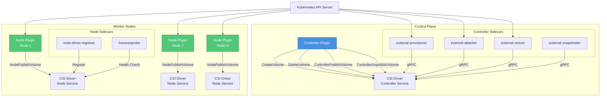

### **Component Separation Rationale**

**File**: `/staging/src/k8s.io/csi-api/pkg/csi/csi.proto:89-156`

```protobuf
service Controller {
  rpc CreateVolume (CreateVolumeRequest)
    returns (CreateVolumeResponse) {}

  rpc DeleteVolume (DeleteVolumeRequest)
    returns (DeleteVolumeResponse) {}

  rpc ControllerPublishVolume (ControllerPublishVolumeRequest)
    returns (ControllerPublishVolumeResponse) {}

  rpc ControllerUnpublishVolume (ControllerUnpublishVolumeRequest)
    returns (ControllerUnpublishVolumeResponse) {}

  rpc ValidateVolumeCapabilities (ValidateVolumeCapabilitiesRequest)
    returns (ValidateVolumeCapabilitiesResponse) {}

  rpc ListVolumes (ListVolumesRequest)
    returns (ListVolumesResponse) {}

  rpc GetCapacity (GetCapacityRequest)
    returns (GetCapacityResponse) {}

  rpc ControllerGetCapabilities (ControllerGetCapabilitiesRequest)
    returns (ControllerGetCapabilitiesResponse) {}

  rpc CreateSnapshot (CreateSnapshotRequest)
    returns (CreateSnapshotResponse) {}

  rpc DeleteSnapshot (DeleteSnapshotRequest)
    returns (DeleteSnapshotResponse) {}

  rpc ListSnapshots (ListSnapshotsRequest)
    returns (ListSnapshotsResponse) {}

  rpc ControllerExpandVolume (ControllerExpandVolumeRequest)
    returns (ControllerExpandVolumeResponse) {}

  rpc ControllerGetVolume (ControllerGetVolumeRequest)
    returns (ControllerGetVolumeResponse) {}
}

service Node {
  rpc NodeStageVolume (NodeStageVolumeRequest)
    returns (NodeStageVolumeResponse) {}

  rpc NodeUnstageVolume (NodeUnstageVolumeRequest)
    returns (NodeUnstageVolumeResponse) {}

  rpc NodePublishVolume (NodePublishVolumeRequest)
    returns (NodePublishVolumeResponse) {}

  rpc NodeUnpublishVolume (NodeUnpublishVolumeRequest)
    returns (NodeUnpublishVolumeResponse) {}

  rpc NodeGetVolumeStats (NodeGetVolumeStatsRequest)
    returns (NodeGetVolumeStatsResponse) {}

  rpc NodeExpandVolume (NodeExpandVolumeRequest)
    returns (NodeExpandVolumeResponse) {}

  rpc NodeGetCapabilities (NodeGetCapabilitiesRequest)
    returns (NodeGetCapabilitiesResponse) {}

  rpc NodeGetInfo (NodeGetInfoRequest)
    returns (NodeGetInfoResponse) {}
}
```

**Separation Benefits**:
1. **Security**: Controller operations don't require node-level privileges
2. **Scalability**: Single controller serves entire cluster
3. **Resource efficiency**: Heavy operations on dedicated controller pods
4. **Fault isolation**: Node plugin failures don't affect cluster-wide operations

━━━━━━━━━━━━━━━━━━━━━━━━━━━━━━━━━━━━━━━━━━━━━━━━━━━━━━━━━━━━━━━━━━━━━━━━━━━━━

## **🚀 Controller Plugin Deployment**

### **Deployment Architecture**

The controller plugin handles cluster-scoped volume operations and is typically deployed as a Deployment or StatefulSet.

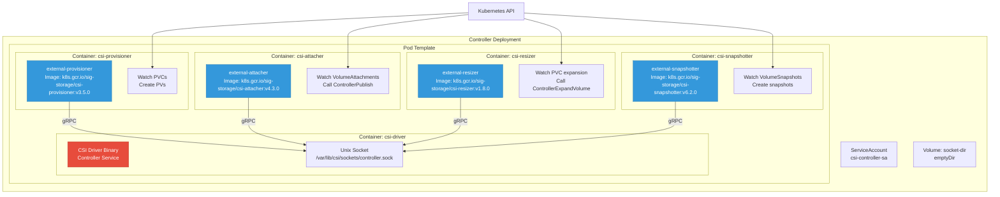

### **Example Controller Deployment**

**AWS EBS CSI Driver Controller**

```yaml
# File: examples/kubernetes/dynamic-provisioning/manifests/controller.yaml
apiVersion: apps/v1
kind: Deployment
metadata:
  name: ebs-csi-controller
  namespace: kube-system
spec:
  replicas: 2
  selector:
    matchLabels:
      app: ebs-csi-controller
  template:
    metadata:
      labels:
        app: ebs-csi-controller
    spec:
      serviceAccount: ebs-csi-controller-sa
      priorityClassName: system-cluster-critical
      tolerations:
        - key: CriticalAddonsOnly
          operator: Exists
      nodeSelector:
        kubernetes.io/os: linux
      containers:
        # CSI Driver Container
        - name: ebs-plugin
          image: k8s.gcr.io/provider-aws/aws-ebs-csi-driver:v1.19.0
          args:
            - controller
            - --endpoint=$(CSI_ENDPOINT)
            - --logtostderr
            - --v=2
          env:
            - name: CSI_ENDPOINT
              value: unix:///var/lib/csi/sockets/pluginproxy/csi.sock
            - name: AWS_ACCESS_KEY_ID
              valueFrom:
                secretKeyRef:
                  name: aws-secret
                  key: key_id
                  optional: true
            - name: AWS_SECRET_ACCESS_KEY
              valueFrom:
                secretKeyRef:
                  name: aws-secret
                  key: access_key
                  optional: true
            - name: AWS_REGION
              value: us-west-2
          volumeMounts:
            - name: socket-dir
              mountPath: /var/lib/csi/sockets/pluginproxy/
          ports:
            - name: healthz
              containerPort: 9808
              protocol: TCP
          livenessProbe:
            httpGet:
              path: /healthz
              port: healthz
            initialDelaySeconds: 10
            timeoutSeconds: 3
            periodSeconds: 10
            failureThreshold: 5

        # External Provisioner
        - name: csi-provisioner
          image: k8s.gcr.io/sig-storage/csi-provisioner:v3.5.0
          args:
            - --csi-address=$(ADDRESS)
            - --v=2
            - --feature-gates=Topology=true
            - --extra-create-metadata
            - --leader-election=true
            - --default-fstype=ext4
          env:
            - name: ADDRESS
              value: /var/lib/csi/sockets/pluginproxy/csi.sock
          volumeMounts:
            - name: socket-dir
              mountPath: /var/lib/csi/sockets/pluginproxy/

        # External Attacher
        - name: csi-attacher
          image: k8s.gcr.io/sig-storage/csi-attacher:v4.3.0
          args:
            - --csi-address=$(ADDRESS)
            - --v=2
            - --leader-election=true
          env:
            - name: ADDRESS
              value: /var/lib/csi/sockets/pluginproxy/csi.sock
          volumeMounts:
            - name: socket-dir
              mountPath: /var/lib/csi/sockets/pluginproxy/

        # External Resizer
        - name: csi-resizer
          image: k8s.gcr.io/sig-storage/csi-resizer:v1.8.0
          args:
            - --csi-address=$(ADDRESS)
            - --v=2
            - --leader-election=true
            - --handle-volume-inuse-error=false
          env:
            - name: ADDRESS
              value: /var/lib/csi/sockets/pluginproxy/csi.sock
          volumeMounts:
            - name: socket-dir
              mountPath: /var/lib/csi/sockets/pluginproxy/

        # External Snapshotter
        - name: csi-snapshotter
          image: k8s.gcr.io/sig-storage/csi-snapshotter:v6.2.0
          args:
            - --csi-address=$(ADDRESS)
            - --v=2
            - --leader-election=true
          env:
            - name: ADDRESS
              value: /var/lib/csi/sockets/pluginproxy/csi.sock
          volumeMounts:
            - name: socket-dir
              mountPath: /var/lib/csi/sockets/pluginproxy/

        # Liveness Probe
        - name: liveness-probe
          image: k8s.gcr.io/sig-storage/livenessprobe:v2.10.0
          args:
            - --csi-address=$(ADDRESS)
            - --health-port=9808
          env:
            - name: ADDRESS
              value: /var/lib/csi/sockets/pluginproxy/csi.sock
          volumeMounts:
            - name: socket-dir
              mountPath: /var/lib/csi/sockets/pluginproxy/

      volumes:
        - name: socket-dir
          emptyDir: {}
```

### **Controller Sidecar Communication**

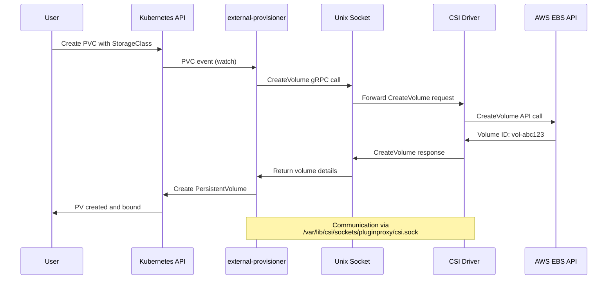

### **Leader Election for High Availability**

**File**: `/staging/src/k8s.io/client-go/tools/leaderelection/leaderelection.go:85-120`

```go
// LeaderElectionConfig defines the configuration for leader election
type LeaderElectionConfig struct {
    // Lock is the resource that will be used for locking
    Lock rl.Interface

    // LeaseDuration is the duration that non-leader candidates will
    // wait to force acquire leadership
    LeaseDuration time.Duration

    // RenewDeadline is the duration that the acting master will retry
    // refreshing leadership before giving up
    RenewDeadline time.Duration

    // RetryPeriod is the duration the LeaderElector clients should wait
    // between tries of actions
    RetryPeriod time.Duration

    // Callbacks are callbacks that are triggered during certain lifecycle
    // events of the LeaderElector
    Callbacks LeaderCallbacks

    // WatchDog is the associated health checker
    WatchDog *HealthzAdaptor

    // ReleaseOnCancel should be set true if the lock should be released
    // when the run context is cancelled
    ReleaseOnCancel bool

    // Name is the name of the resource lock for debugging
    Name string
}
```

**Provisioner Leader Election Configuration**:

```go
// File: external-provisioner/cmd/csi-provisioner/csi-provisioner.go
leaderElectionConfig := leaderelection.LeaderElectionConfig{
    Lock: &resourcelock.LeaseLock{
        LeaseMeta: metav1.ObjectMeta{
            Name:      "external-provisioner-leader",
            Namespace: namespace,
        },
        Client: clientset.CoordinationV1(),
        LockConfig: resourcelock.ResourceLockConfig{
            Identity: identity,
        },
    },
    LeaseDuration: 15 * time.Second,
    RenewDeadline: 10 * time.Second,
    RetryPeriod:   2 * time.Second,
    Callbacks: leaderelection.LeaderCallbacks{
        OnStartedLeading: func(ctx context.Context) {
            // Start the provisioner logic
            run(ctx)
        },
        OnStoppedLeading: func() {
            klog.Fatal("leader election lost")
        },
    },
}
```

━━━━━━━━━━━━━━━━━━━━━━━━━━━━━━━━━━━━━━━━━━━━━━━━━━━━━━━━━━━━━━━━━━━━━━━━━━━━━

## **🖥️ Node Plugin Deployment**

### **DaemonSet Architecture**

Node plugins run on every node to handle node-local volume operations.

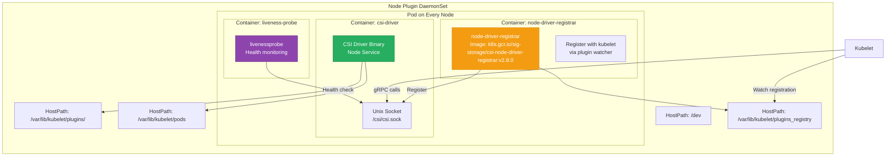

### **Example Node Plugin DaemonSet**

**AWS EBS CSI Driver Node Plugin**

```yaml
# File: examples/kubernetes/dynamic-provisioning/manifests/node.yaml
apiVersion: apps/v1
kind: DaemonSet
metadata:
  name: ebs-csi-node
  namespace: kube-system
spec:
  selector:
    matchLabels:
      app: ebs-csi-node
  template:
    metadata:
      labels:
        app: ebs-csi-node
    spec:
      serviceAccount: ebs-csi-node-sa
      priorityClassName: system-node-critical
      hostNetwork: true
      tolerations:
        - operator: Exists
      nodeSelector:
        kubernetes.io/os: linux
      containers:
        # CSI Node Driver
        - name: ebs-plugin
          image: k8s.gcr.io/provider-aws/aws-ebs-csi-driver:v1.19.0
          args:
            - node
            - --endpoint=$(CSI_ENDPOINT)
            - --logtostderr
            - --v=2
          env:
            - name: CSI_ENDPOINT
              value: unix:/csi/csi.sock
            - name: CSI_NODE_NAME
              valueFrom:
                fieldRef:
                  fieldPath: spec.nodeName
          securityContext:
            privileged: true
          volumeMounts:
            - name: kubelet-dir
              mountPath: /var/lib/kubelet
              mountPropagation: Bidirectional
            - name: plugin-dir
              mountPath: /csi
            - name: device-dir
              mountPath: /dev
          ports:
            - name: healthz
              containerPort: 9808
              protocol: TCP
          livenessProbe:
            httpGet:
              path: /healthz
              port: healthz
            initialDelaySeconds: 10
            timeoutSeconds: 3
            periodSeconds: 10
            failureThreshold: 5

        # Node Driver Registrar
        - name: node-driver-registrar
          image: k8s.gcr.io/sig-storage/csi-node-driver-registrar:v2.8.0
          args:
            - --csi-address=$(ADDRESS)
            - --kubelet-registration-path=$(DRIVER_REG_SOCK_PATH)
            - --v=2
          env:
            - name: ADDRESS
              value: /csi/csi.sock
            - name: DRIVER_REG_SOCK_PATH
              value: /var/lib/kubelet/plugins/ebs.csi.aws.com/csi.sock
          volumeMounts:
            - name: plugin-dir
              mountPath: /csi
            - name: registration-dir
              mountPath: /registration

        # Liveness Probe
        - name: liveness-probe
          image: k8s.gcr.io/sig-storage/livenessprobe:v2.10.0
          args:
            - --csi-address=/csi/csi.sock
            - --health-port=9808
          volumeMounts:
            - name: plugin-dir
              mountPath: /csi

      volumes:
        # Kubelet root directory (for mounting volumes)
        - name: kubelet-dir
          hostPath:
            path: /var/lib/kubelet
            type: Directory

        # Plugin socket directory
        - name: plugin-dir
          hostPath:
            path: /var/lib/kubelet/plugins/ebs.csi.aws.com/
            type: DirectoryOrCreate

        # Registration directory (plugin watcher)
        - name: registration-dir
          hostPath:
            path: /var/lib/kubelet/plugins_registry/
            type: Directory

        # Device directory (for block devices)
        - name: device-dir
          hostPath:
            path: /dev
            type: Directory
```

### **Node Registration Process**

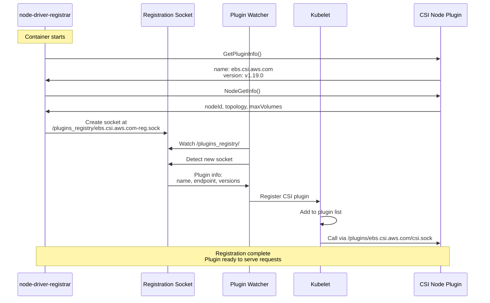

**File**: `/pkg/kubelet/pluginmanager/pluginwatcher/plugin_watcher.go:100-140`

```go
// Start starts the plugin watcher
func (w *Watcher) Start(stopCh <-chan struct{}) error {
    klog.V(2).InfoS("Starting plugin watcher", "path", w.path)

    // Creating the directory to be watched if it doesn't exist yet,
    // and walks through the directory to discover the existing plugins.
    if err := w.init(); err != nil {
        return err
    }

    // Start the fsnotify watcher
    go func() {
        for {
            select {
            case event := <-w.fsWatcher.Events:
                if event.Op&fsnotify.Create == fsnotify.Create {
                    // A new plugin socket was created
                    if err := w.handleCreateEvent(event); err != nil {
                        klog.ErrorS(err, "Error handling create event", "event", event)
                    }
                } else if event.Op&fsnotify.Remove == fsnotify.Remove {
                    // A plugin socket was removed
                    w.handleDeleteEvent(event)
                }

            case err := <-w.fsWatcher.Errors:
                klog.ErrorS(err, "fsnotify error")

            case <-stopCh:
                w.fsWatcher.Close()
                return
            }
        }
    }()

    return nil
}

// handleCreateEvent handles create events for the plugin watcher
func (w *Watcher) handleCreateEvent(event fsnotify.Event) error {
    klog.V(6).InfoS("Handling create event", "event", event)

    socketPath := event.Name

    // Wait for the socket file to be ready
    if err := w.waitForSocketReady(socketPath); err != nil {
        return fmt.Errorf("error waiting for socket %s: %v", socketPath, err)
    }

    // Get plugin info from the socket
    pluginInfo, err := w.getPluginInfo(socketPath)
    if err != nil {
        return fmt.Errorf("error getting plugin info from %s: %v", socketPath, err)
    }

    // Register the plugin
    if err := w.desiredStateOfWorldPopulator.AddOrUpdatePlugin(pluginInfo); err != nil {
        return fmt.Errorf("error adding plugin %s: %v", pluginInfo.Name, err)
    }

    return nil
}
```

### **Privileged Mode Requirement**

Node plugins require privileged mode to perform mount operations:

**File**: `/pkg/volume/csi/csi_mounter.go:150-180`

```go
// SetUpAt performs the mount operation for a CSI volume
func (c *csiMountMgr) SetUpAt(dir string, mounterArgs volume.MounterArgs) error {
    klog.V(4).InfoS("CSI driver staging volume", "volumeID", c.volumeID)

    // Get the CSI client
    csi, err := c.csiClientGetter.Get()
    if err != nil {
        return errors.New(log("mounter.SetUpAt failed to get CSI client: %v", err))
    }

    // Call NodeStageVolume (requires privileged for mount operations)
    ctx, cancel := context.WithTimeout(context.Background(), csiTimeout)
    defer cancel()

    _, err = csi.NodeStageVolume(ctx,
        c.volumeID,
        c.publishContext,
        stagingTargetPath,
        fsType,
        accessMode,
        c.readOnly,
        secrets,
        volumeContext,
        mountOptions,
        fsGroup,
    )

    if err != nil {
        return errors.New(log("mounter.SetUpAt failed: %v", err))
    }

    klog.V(4).InfoS("CSI driver staging volume succeeded", "volumeID", c.volumeID)
    return nil
}
```

**Security Context Requirements**:
```yaml
securityContext:
  privileged: true  # Required for mount operations
  capabilities:
    add:
      - SYS_ADMIN  # Required for mount/umount syscalls
  allowPrivilegeEscalation: true
  seLinuxOptions:
    type: spc_t  # Super Privileged Container (for SELinux)
```

━━━━━━━━━━━━━━━━━━━━━━━━━━━━━━━━━━━━━━━━━━━━━━━━━━━━━━━━━━━━━━━━━━━━━━━━━━━━━

## **🔌 Sidecar Container Deep Dive**

### **external-provisioner**

The external-provisioner sidecar handles dynamic volume provisioning.

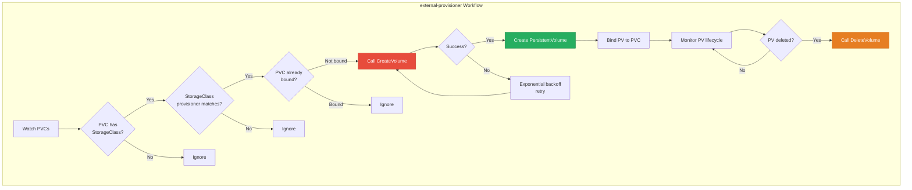

**File**: `external-provisioner/pkg/controller/controller.go:200-280`

```go
// provisionVolume provisions a volume for a PVC
func (ctrl *ProvisionController) provisionVolume(ctx context.Context, claim *v1.PersistentVolumeClaim) error {
    // Get the StorageClass
    storageClass, err := ctrl.classLister.Get(*claim.Spec.StorageClassName)
    if err != nil {
        return fmt.Errorf("error getting StorageClass %q: %v", *claim.Spec.StorageClassName, err)
    }

    // Check if we should provision this PVC
    if storageClass.Provisioner != ctrl.provisionerName {
        klog.V(4).InfoS("Ignoring PVC - provisioner mismatch",
            "pvc", klog.KObj(claim),
            "provisioner", storageClass.Provisioner,
            "expected", ctrl.provisionerName)
        return nil
    }

    // Build volume options from PVC and StorageClass
    options := VolumeOptions{
        PVCName:              claim.Name,
        PVCNamespace:         claim.Namespace,
        PVName:               "", // Will be generated
        VolumeName:           "", // CSI driver will provide
        VolumeMode:           claim.Spec.VolumeMode,
        PVC:                  claim,
        StorageClass:         storageClass,
        Parameters:           storageClass.Parameters,
        MountOptions:         storageClass.MountOptions,
        VolumeContentSource:  claim.Spec.DataSource,
    }

    // Get requested capacity
    capacity, exists := claim.Spec.Resources.Requests[v1.ResourceStorage]
    if !exists {
        return fmt.Errorf("PVC %s has no storage capacity request", klog.KObj(claim))
    }
    options.Capacity = capacity.Value()

    // Get topology requirements
    selectedNode, err := ctrl.getSelectedNode(claim)
    if err != nil {
        return fmt.Errorf("error getting selected node: %v", err)
    }

    if selectedNode != nil {
        node, err := ctrl.nodeLister.Get(selectedNode.Name)
        if err != nil {
            return fmt.Errorf("error getting node %q: %v", selectedNode.Name, err)
        }
        options.SelectedNode = node
        options.AllowedTopologies = getNodeTopology(node)
    } else if storageClass.AllowedTopologies != nil {
        options.AllowedTopologies = storageClass.AllowedTopologies
    }

    // Call the CSI driver CreateVolume
    klog.V(4).InfoS("Provisioning volume", "pvc", klog.KObj(claim), "options", options)

    volume, err := ctrl.provisioner.Provision(ctx, options)
    if err != nil {
        return fmt.Errorf("failed to provision volume: %v", err)
    }

    // Create the PersistentVolume
    pv := &v1.PersistentVolume{
        ObjectMeta: metav1.ObjectMeta{
            Name: volume.Name,
            Annotations: map[string]string{
                "pv.kubernetes.io/provisioned-by": ctrl.provisionerName,
            },
        },
        Spec: v1.PersistentVolumeSpec{
            Capacity: v1.ResourceList{
                v1.ResourceStorage: *resource.NewQuantity(options.Capacity, resource.BinarySI),
            },
            PersistentVolumeSource: v1.PersistentVolumeSource{
                CSI: &v1.CSIPersistentVolumeSource{
                    Driver:                    ctrl.provisionerName,
                    VolumeHandle:              volume.VolumeID,
                    FSType:                    volume.FSType,
                    VolumeAttributes:          volume.VolumeContext,
                    ControllerPublishSecretRef: volume.ControllerPublishSecretRef,
                    NodeStageSecretRef:        volume.NodeStageSecretRef,
                    NodePublishSecretRef:      volume.NodePublishSecretRef,
                },
            },
            AccessModes:       claim.Spec.AccessModes,
            ClaimRef:          claimRefForClaim(claim),
            MountOptions:      storageClass.MountOptions,
            StorageClassName:  claim.Spec.StorageClassName,
            NodeAffinity:      volume.NodeAffinity,
            VolumeMode:        claim.Spec.VolumeMode,
        },
    }

    // Set reclaim policy
    if storageClass.ReclaimPolicy != nil {
        pv.Spec.PersistentVolumeReclaimPolicy = *storageClass.ReclaimPolicy
    } else {
        pv.Spec.PersistentVolumeReclaimPolicy = v1.PersistentVolumeReclaimDelete
    }

    // Create the PV
    _, err = ctrl.kubeClient.CoreV1().PersistentVolumes().Create(ctx, pv, metav1.CreateOptions{})
    if err != nil {
        // Try to delete the volume on the storage backend
        deleteErr := ctrl.provisioner.Delete(ctx, volume)
        if deleteErr != nil {
            klog.ErrorS(deleteErr, "Failed to delete volume after PV creation failed",
                "volumeID", volume.VolumeID)
        }
        return fmt.Errorf("failed to create PV: %v", err)
    }

    klog.InfoS("Successfully provisioned volume", "pvc", klog.KObj(claim), "pv", pv.Name)
    return nil
}
```

**Provisioner Arguments**:
```yaml
args:
  - --csi-address=/var/lib/csi/sockets/pluginproxy/csi.sock
  - --feature-gates=Topology=true
  - --extra-create-metadata  # Add PVC metadata to volume
  - --strict-topology        # Enforce strict topology
  - --immediate-topology=false  # Support WaitForFirstConsumer
  - --timeout=60s            # CreateVolume timeout
  - --retry-interval-start=1s
  - --retry-interval-max=5m
  - --leader-election=true
  - --leader-election-namespace=kube-system
  - --worker-threads=100     # Concurrent provisioning operations
```

### **external-attacher**

The external-attacher handles attach/detach operations via VolumeAttachment resources.

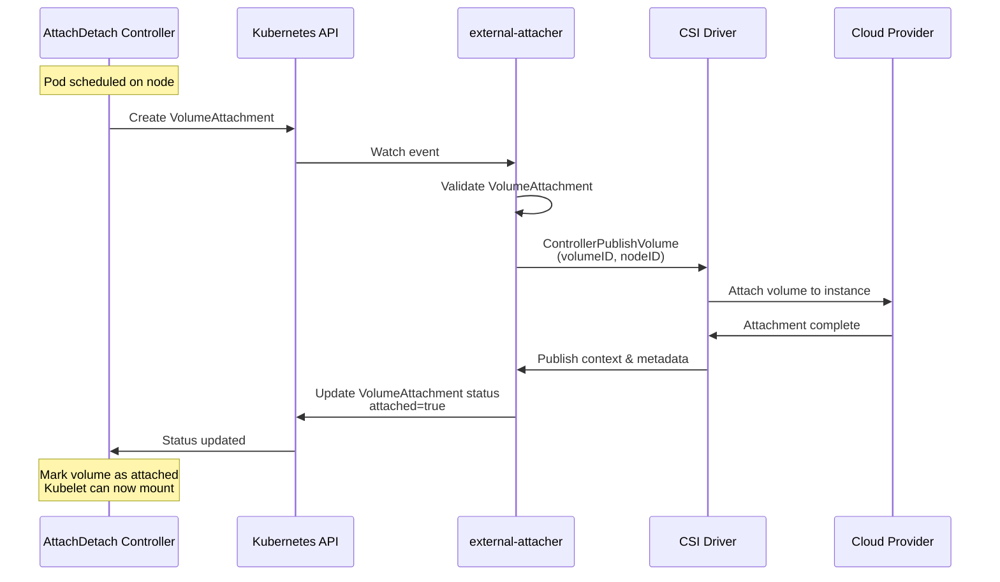

**File**: `external-attacher/pkg/controller/controller.go:150-220`

```go
// syncAttach processes a VolumeAttachment and attaches the volume
func (ctrl *CSIAttachController) syncAttach(ctx context.Context, va *storagev1.VolumeAttachment) error {
    klog.V(4).InfoS("Starting syncAttach", "volumeAttachment", klog.KObj(va))

    // Check if already attached
    if va.Status.Attached {
        klog.V(4).InfoS("VolumeAttachment already attached", "volumeAttachment", klog.KObj(va))
        return nil
    }

    // Get PV
    pvName := va.Spec.Source.PersistentVolumeName
    if pvName == nil {
        return fmt.Errorf("PersistentVolumeName is nil")
    }

    pv, err := ctrl.pvLister.Get(*pvName)
    if err != nil {
        return fmt.Errorf("error getting PV %q: %v", *pvName, err)
    }

    // Verify it's a CSI volume
    if pv.Spec.CSI == nil {
        return fmt.Errorf("PV %q is not a CSI volume", pv.Name)
    }

    // Verify driver name matches
    if pv.Spec.CSI.Driver != ctrl.driverName {
        klog.V(4).InfoS("Ignoring PV - driver mismatch",
            "pv", pv.Name,
            "driver", pv.Spec.CSI.Driver,
            "expected", ctrl.driverName)
        return nil
    }

    // Get node info
    node, err := ctrl.nodeLister.Get(va.Spec.NodeName)
    if err != nil {
        return fmt.Errorf("error getting node %q: %v", va.Spec.NodeName, err)
    }

    // Get CSI node ID
    nodeID, err := getCSINodeID(node, ctrl.driverName)
    if err != nil {
        return fmt.Errorf("error getting CSI node ID: %v", err)
    }

    // Build ControllerPublishVolume request
    volumeID := pv.Spec.CSI.VolumeHandle
    volumeCapability := getVolumeCapability(pv)
    volumeContext := pv.Spec.CSI.VolumeAttributes
    secrets := ctrl.getCredentials(pv.Spec.CSI.ControllerPublishSecretRef)

    // Check if volume supports attach
    caps, err := ctrl.csiClient.ControllerGetCapabilities(ctx)
    if err != nil {
        return fmt.Errorf("error getting controller capabilities: %v", err)
    }

    if !hasAttachCapability(caps) {
        // Driver doesn't support attach - mark as attached immediately
        klog.V(4).InfoS("Driver doesn't support attach, marking as attached",
            "volumeAttachment", klog.KObj(va))
        return ctrl.markAsAttached(ctx, va, nil)
    }

    // Call ControllerPublishVolume
    klog.V(4).InfoS("Calling ControllerPublishVolume",
        "volumeID", volumeID,
        "nodeID", nodeID)

    publishContext, err := ctrl.csiClient.ControllerPublishVolume(
        ctx,
        volumeID,
        nodeID,
        volumeCapability,
        va.Spec.ReadOnly,
        secrets,
        volumeContext,
    )

    if err != nil {
        return fmt.Errorf("ControllerPublishVolume failed: %v", err)
    }

    // Update VolumeAttachment status
    return ctrl.markAsAttached(ctx, va, publishContext)
}

// markAsAttached updates the VolumeAttachment status to attached
func (ctrl *CSIAttachController) markAsAttached(
    ctx context.Context,
    va *storagev1.VolumeAttachment,
    publishContext map[string]string,
) error {
    va = va.DeepCopy()
    va.Status.Attached = true
    va.Status.AttachmentMetadata = publishContext
    va.Status.AttachError = nil

    _, err := ctrl.kubeClient.StorageV1().VolumeAttachments().UpdateStatus(
        ctx, va, metav1.UpdateOptions{})
    if err != nil {
        return fmt.Errorf("failed to update VolumeAttachment status: %v", err)
    }

    klog.InfoS("Successfully attached volume",
        "volumeAttachment", klog.KObj(va),
        "volumeID", va.Spec.Source.PersistentVolumeName)

    return nil
}
```

### **external-resizer**

The external-resizer handles volume expansion operations.

```mermaid
graph TB
    subgraph "Volume Expansion Flow"
        User[User edits PVC<br/>requests.storage: 20Gi → 50Gi]
        User --> API[API Server]

        API --> Resizer[external-resizer<br/>watches PVC]

        Resizer --> Validate{Can expand?}
        Validate --> |allowVolumeExpansion: true| CheckFS{FileSystem<br/>expansion needed?}
        Validate --> |No| Reject[Reject expansion]

        CheckFS --> |Yes| ControllerExpand[Call ControllerExpandVolume]
        CheckFS --> |No| SkipController[Skip controller expand]

        ControllerExpand --> UpdatePVC1[Update PVC status<br/>conditions: Resizing]
        SkipController --> UpdatePVC1

        UpdatePVC1 --> NodeExpand{Node expansion<br/>required?}

        NodeExpand --> |Yes| WaitPod[Wait for pod using volume]
        NodeExpand --> |No| Complete1[Mark expansion complete]

        WaitPod --> Kubelet[Kubelet calls NodeExpandVolume]
        Kubelet --> FSResize[Filesystem resize<br/>resize2fs/xfs_growfs]

        FSResize --> Complete2[Update PVC status<br/>expansion complete]
    end

    style ControllerExpand fill:#e74c3c,stroke:#c0392b,color:#fff
    style FSResize fill:#27ae60,stroke:#1e8449,color:#fff
    style Complete2 fill:#3498db,stroke:#2980b9,color:#fff
```

**File**: `external-resizer/pkg/controller/controller.go:180-260`

```go
// syncPVC processes a PVC expansion request
func (ctrl *ResizeController) syncPVC(ctx context.Context, pvc *v1.PersistentVolumeClaim) error {
    // Check if PVC needs expansion
    if !needsExpansion(pvc) {
        return nil
    }

    // Get the PV
    pv, err := ctrl.pvLister.Get(pvc.Spec.VolumeName)
    if err != nil {
        return fmt.Errorf("error getting PV: %v", err)
    }

    // Verify it's a CSI volume for this driver
    if pv.Spec.CSI == nil || pv.Spec.CSI.Driver != ctrl.driverName {
        return nil
    }

    // Get the StorageClass
    storageClass, err := ctrl.classLister.Get(*pvc.Spec.StorageClassName)
    if err != nil {
        return fmt.Errorf("error getting StorageClass: %v", err)
    }

    // Check if expansion is allowed
    if storageClass.AllowVolumeExpansion == nil || !*storageClass.AllowVolumeExpansion {
        return fmt.Errorf("StorageClass %q doesn't allow volume expansion", storageClass.Name)
    }

    // Get requested size
    requestedSize := pvc.Spec.Resources.Requests[v1.ResourceStorage]
    currentSize := pv.Spec.Capacity[v1.ResourceStorage]

    if requestedSize.Cmp(currentSize) <= 0 {
        return nil // Not an expansion
    }

    klog.InfoS("Expanding volume",
        "pvc", klog.KObj(pvc),
        "currentSize", currentSize.String(),
        "requestedSize", requestedSize.String())

    // Check if controller expansion is needed
    supportsControllerExpansion, err := ctrl.supportsControllerExpansion()
    if err != nil {
        return fmt.Errorf("error checking controller expansion support: %v", err)
    }

    if supportsControllerExpansion {
        // Call ControllerExpandVolume
        newSize, err := ctrl.expandVolume(ctx, pv, requestedSize.Value())
        if err != nil {
            return ctrl.markExpansionFailed(ctx, pvc, err)
        }

        // Update PV capacity
        pv = pv.DeepCopy()
        pv.Spec.Capacity[v1.ResourceStorage] = *resource.NewQuantity(newSize, resource.BinarySI)

        _, err = ctrl.kubeClient.CoreV1().PersistentVolumes().Update(ctx, pv, metav1.UpdateOptions{})
        if err != nil {
            return fmt.Errorf("failed to update PV capacity: %v", err)
        }
    }

    // Update PVC status
    return ctrl.markControllerExpansionComplete(ctx, pvc)
}

// expandVolume calls the CSI driver to expand the volume
func (ctrl *ResizeController) expandVolume(
    ctx context.Context,
    pv *v1.PersistentVolume,
    requestedSize int64,
) (int64, error) {
    volumeID := pv.Spec.CSI.VolumeHandle
    volumeCapability := getVolumeCapability(pv)
    secrets := ctrl.getCredentials(pv.Spec.CSI.ControllerExpandSecretRef)

    klog.V(4).InfoS("Calling ControllerExpandVolume",
        "volumeID", volumeID,
        "requestedSize", requestedSize)

    newSize, nodeExpansionRequired, err := ctrl.csiClient.ControllerExpandVolume(
        ctx,
        volumeID,
        requestedSize,
        volumeCapability,
        secrets,
    )

    if err != nil {
        return 0, fmt.Errorf("ControllerExpandVolume failed: %v", err)
    }

    klog.InfoS("ControllerExpandVolume succeeded",
        "volumeID", volumeID,
        "newSize", newSize,
        "nodeExpansionRequired", nodeExpansionRequired)

    return newSize, nil
}

// markControllerExpansionComplete updates PVC with expansion in progress
func (ctrl *ResizeController) markControllerExpansionComplete(
    ctx context.Context,
    pvc *v1.PersistentVolumeClaim,
) error {
    pvc = pvc.DeepCopy()

    // Update conditions
    setCondition := func(condType v1.PersistentVolumeClaimConditionType, status v1.ConditionStatus) {
        for i := range pvc.Status.Conditions {
            if pvc.Status.Conditions[i].Type == condType {
                pvc.Status.Conditions[i].Status = status
                pvc.Status.Conditions[i].LastTransitionTime = metav1.Now()
                return
            }
        }
        pvc.Status.Conditions = append(pvc.Status.Conditions,
            v1.PersistentVolumeClaimCondition{
                Type:               condType,
                Status:             status,
                LastTransitionTime: metav1.Now(),
            })
    }

    setCondition(v1.PersistentVolumeClaimResizing, v1.ConditionTrue)

    _, err := ctrl.kubeClient.CoreV1().PersistentVolumeClaims(pvc.Namespace).UpdateStatus(
        ctx, pvc, metav1.UpdateOptions{})

    return err
}
```

### **external-snapshotter**

The external-snapshotter manages volume snapshots.

```mermaid
graph TB
    subgraph "Snapshot Creation Flow"
        User[User creates VolumeSnapshot]
        User --> API[API Server]

        API --> Snap[external-snapshotter<br/>watches VolumeSnapshot]

        Snap --> Validate{Valid snapshot<br/>request?}
        Validate --> |Yes| GetPVC[Get source PVC]
        Validate --> |No| Error[Set error status]

        GetPVC --> GetPV[Get PV from PVC]
        GetPV --> Create[Call CreateSnapshot]

        Create --> Success{Success?}
        Success --> |Yes| CreateContent[Create VolumeSnapshotContent]
        Success --> |No| Retry[Retry with backoff]

        CreateContent --> Bind[Bind Snapshot to Content]
        Bind --> Ready[Mark snapshot Ready]

        Retry --> Create
    end

    subgraph "Snapshot Restore Flow"
        User2[User creates PVC<br/>with dataSource: snapshot]
        User2 --> Prov[external-provisioner]

        Prov --> RestoreSnap[Call CreateVolume<br/>with snapshot source]
        RestoreSnap --> NewPV[Create PV from snapshot]
    end

    style Create fill:#e74c3c,stroke:#c0392b,color:#fff
    style Ready fill:#27ae60,stroke:#1e8449,color:#fff
    style RestoreSnap fill:#9b59b6,stroke:#7d3c98,color:#fff
```

**File**: `external-snapshotter/pkg/common-controller/snapshot_controller.go:200-280`

```go
// syncSnapshot processes a VolumeSnapshot
func (ctrl *SnapshotController) syncSnapshot(
    ctx context.Context,
    snapshot *volumesnapshotv1.VolumeSnapshot,
) error {
    klog.V(4).InfoS("Synchronizing snapshot", "snapshot", klog.KObj(snapshot))

    // Check if snapshot is already bound
    if snapshot.Status != nil && snapshot.Status.BoundVolumeSnapshotContentName != nil {
        return ctrl.syncBoundSnapshot(ctx, snapshot)
    }

    // Get the snapshot class
    className := snapshot.Spec.VolumeSnapshotClassName
    if className == nil {
        return fmt.Errorf("snapshot class name is nil")
    }

    snapClass, err := ctrl.classLister.Get(*className)
    if err != nil {
        return fmt.Errorf("error getting snapshot class %q: %v", *className, err)
    }

    // Verify driver matches
    if snapClass.Driver != ctrl.driverName {
        klog.V(4).InfoS("Ignoring snapshot - driver mismatch",
            "snapshot", klog.KObj(snapshot),
            "driver", snapClass.Driver,
            "expected", ctrl.driverName)
        return nil
    }

    // Get source PVC
    if snapshot.Spec.Source.PersistentVolumeClaimName == nil {
        return fmt.Errorf("PVC name is nil")
    }

    pvcName := *snapshot.Spec.Source.PersistentVolumeClaimName
    pvc, err := ctrl.pvcLister.PersistentVolumeClaims(snapshot.Namespace).Get(pvcName)
    if err != nil {
        return fmt.Errorf("error getting PVC %q: %v", pvcName, err)
    }

    // Get the PV
    if pvc.Spec.VolumeName == "" {
        return fmt.Errorf("PVC %q is not bound to a PV", pvcName)
    }

    pv, err := ctrl.pvLister.Get(pvc.Spec.VolumeName)
    if err != nil {
        return fmt.Errorf("error getting PV %q: %v", pvc.Spec.VolumeName, err)
    }

    // Verify it's a CSI volume
    if pv.Spec.CSI == nil || pv.Spec.CSI.Driver != ctrl.driverName {
        return fmt.Errorf("PV %q is not a CSI volume for driver %q", pv.Name, ctrl.driverName)
    }

    // Call CreateSnapshot
    volumeID := pv.Spec.CSI.VolumeHandle
    secrets := ctrl.getCredentials(snapClass.DeletionPolicy, snapshot.Namespace)

    klog.InfoS("Creating snapshot",
        "snapshot", klog.KObj(snapshot),
        "volumeID", volumeID)

    snapshotID, timestamp, size, readyToUse, err := ctrl.csiClient.CreateSnapshot(
        ctx,
        volumeID,
        snapClass.Parameters,
        secrets,
    )

    if err != nil {
        return ctrl.setSnapshotError(ctx, snapshot, err)
    }

    // Create VolumeSnapshotContent
    content := &volumesnapshotv1.VolumeSnapshotContent{
        ObjectMeta: metav1.ObjectMeta{
            Name: fmt.Sprintf("snapcontent-%s", snapshot.UID),
        },
        Spec: volumesnapshotv1.VolumeSnapshotContentSpec{
            VolumeSnapshotRef: v1.ObjectReference{
                Kind:       "VolumeSnapshot",
                APIVersion: volumesnapshotv1.SchemeGroupVersion.String(),
                Name:       snapshot.Name,
                Namespace:  snapshot.Namespace,
                UID:        snapshot.UID,
            },
            Source: volumesnapshotv1.VolumeSnapshotContentSource{
                SnapshotHandle: &snapshotID,
            },
            Driver:         ctrl.driverName,
            DeletionPolicy: snapClass.DeletionPolicy,
            VolumeSnapshotClassName: className,
        },
    }

    _, err = ctrl.kubeClient.SnapshotV1().VolumeSnapshotContents().Create(
        ctx, content, metav1.CreateOptions{})
    if err != nil {
        // Try to delete the snapshot on the backend
        deleteErr := ctrl.csiClient.DeleteSnapshot(ctx, snapshotID, secrets)
        if deleteErr != nil {
            klog.ErrorS(deleteErr, "Failed to delete snapshot after content creation failed",
                "snapshotID", snapshotID)
        }
        return fmt.Errorf("failed to create VolumeSnapshotContent: %v", err)
    }

    // Update snapshot status
    return ctrl.updateSnapshotStatus(ctx, snapshot, content.Name, readyToUse, timestamp, size)
}
```

### **node-driver-registrar**

The node-driver-registrar registers the CSI driver with kubelet.

**File**: `node-driver-registrar/pkg/node_register.go:80-150`

```go
// Run registers the CSI driver with kubelet
func (nr *NodeRegister) Run(stopCh <-chan struct{}) error {
    klog.InfoS("Starting registration")

    // Connect to the CSI driver socket
    conn, err := nr.connectToDriver()
    if err != nil {
        return fmt.Errorf("failed to connect to CSI driver: %v", err)
    }
    defer conn.Close()

    // Get plugin info
    info, err := nr.getPluginInfo(conn)
    if err != nil {
        return fmt.Errorf("failed to get plugin info: %v", err)
    }

    klog.InfoS("Retrieved plugin info",
        "name", info.Name,
        "version", info.Version)

    // Get node info
    nodeInfo, err := nr.getNodeInfo(conn)
    if err != nil {
        return fmt.Errorf("failed to get node info: %v", err)
    }

    klog.InfoS("Retrieved node info",
        "nodeID", nodeInfo.NodeID,
        "maxVolumes", nodeInfo.MaxVolumesPerNode,
        "topology", nodeInfo.AccessibleTopology)

    // Create registration socket
    regSocketPath := filepath.Join(nr.kubeletPluginRegistrationPath,
        fmt.Sprintf("%s-reg.sock", info.Name))

    // Remove old socket if exists
    if err := os.Remove(regSocketPath); err != nil && !os.IsNotExist(err) {
        return fmt.Errorf("failed to remove old registration socket: %v", err)
    }

    // Create listener
    listener, err := net.Listen("unix", regSocketPath)
    if err != nil {
        return fmt.Errorf("failed to create registration socket: %v", err)
    }
    defer listener.Close()

    klog.InfoS("Created registration socket", "path", regSocketPath)

    // Create gRPC server
    grpcServer := grpc.NewServer()
    registerapi.RegisterRegistrationServer(grpcServer, nr)

    // Start serving
    go func() {
        if err := grpcServer.Serve(listener); err != nil {
            klog.ErrorS(err, "Registration server error")
        }
    }()

    // Wait for stop signal
    <-stopCh
    grpcServer.GracefulStop()

    return nil
}

// GetInfo returns plugin info to kubelet
func (nr *NodeRegister) GetInfo(
    ctx context.Context,
    req *registerapi.InfoRequest,
) (*registerapi.PluginInfo, error) {
    return &registerapi.PluginInfo{
        Type:              registerapi.CSIPlugin,
        Name:              nr.pluginName,
        Endpoint:          nr.endpoint,
        SupportedVersions: []string{"1.0.0"},
    }, nil
}

// NotifyRegistrationStatus is called by kubelet after registration
func (nr *NodeRegister) NotifyRegistrationStatus(
    ctx context.Context,
    status *registerapi.RegistrationStatus,
) (*registerapi.RegistrationStatusResponse, error) {
    if status.PluginRegistered {
        klog.InfoS("Plugin registered successfully", "plugin", nr.pluginName)
    } else {
        klog.ErrorS(nil, "Plugin registration failed",
            "plugin", nr.pluginName,
            "error", status.Error)
    }

    return &registerapi.RegistrationStatusResponse{}, nil
}
```

### **livenessprobe**

The livenessprobe monitors CSI driver health.

```mermaid
graph LR
    subgraph "Liveness Probe Flow"
        Probe[livenessprobe<br/>HTTP server :9808]
        Probe --> |Periodic| Call[Call CSI Probe()]

        Call --> Socket[Unix Socket]
        Socket --> Driver[CSI Driver]

        Driver --> |Response| Healthy{Healthy?}
        Healthy --> |Yes| Return200[HTTP 200 OK]
        Healthy --> |No| Return503[HTTP 503 Error]

        Return200 --> Kubelet[Kubelet liveness check]
        Return503 --> Restart[Restart container]
    end

    style Healthy fill:#27ae60,stroke:#1e8449,color:#fff
    style Return503 fill:#e74c3c,stroke:#c0392b,color:#fff
```

**File**: `livenessprobe/pkg/server/server.go:60-120`

```go
// Serve starts the HTTP server for liveness probes
func (s *Server) Serve(ctx context.Context) error {
    klog.InfoS("Starting liveness probe", "address", s.address, "port", s.port)

    // Create HTTP server
    mux := http.NewServeMux()
    mux.HandleFunc("/healthz", s.healthzHandler)

    server := &http.Server{
        Addr:    fmt.Sprintf("%s:%d", s.address, s.port),
        Handler: mux,
    }

    // Start server
    go func() {
        if err := server.ListenAndServe(); err != nil && err != http.ErrServerClosed {
            klog.ErrorS(err, "HTTP server error")
        }
    }()

    // Wait for shutdown
    <-ctx.Done()
    return server.Shutdown(context.Background())
}

// healthzHandler handles liveness probe requests
func (s *Server) healthzHandler(w http.ResponseWriter, r *http.Request) {
    ctx, cancel := context.WithTimeout(r.Context(), s.probeTimeout)
    defer cancel()

    // Connect to CSI driver
    conn, err := s.connectToDriver(ctx)
    if err != nil {
        klog.ErrorS(err, "Failed to connect to CSI driver")
        w.WriteHeader(http.StatusServiceUnavailable)
        w.Write([]byte(fmt.Sprintf("Connection failed: %v", err)))
        return
    }
    defer conn.Close()

    // Call Probe
    client := csi.NewIdentityClient(conn)
    resp, err := client.Probe(ctx, &csi.ProbeRequest{})

    if err != nil {
        klog.ErrorS(err, "Probe failed")
        w.WriteHeader(http.StatusServiceUnavailable)
        w.Write([]byte(fmt.Sprintf("Probe failed: %v", err)))
        return
    }

    // Check ready status
    if resp.Ready != nil && !resp.Ready.Value {
        klog.V(4).InfoS("Driver not ready")
        w.WriteHeader(http.StatusServiceUnavailable)
        w.Write([]byte("Driver not ready"))
        return
    }

    // Success
    w.WriteHeader(http.StatusOK)
    w.Write([]byte("ok"))
}

// connectToDriver establishes connection to CSI driver socket
func (s *Server) connectToDriver(ctx context.Context) (*grpc.ClientConn, error) {
    return grpc.DialContext(
        ctx,
        s.csiAddress,
        grpc.WithInsecure(),
        grpc.WithContextDialer(func(ctx context.Context, addr string) (net.Conn, error) {
            return (&net.Dialer{}).DialContext(ctx, "unix", addr)
        }),
    )
}
```

━━━━━━━━━━━━━━━━━━━━━━━━━━━━━━━━━━━━━━━━━━━━━━━━━━━━━━━━━━━━━━━━━━━━━━━━━━━━━

## **🔐 RBAC Requirements**

### **Controller Service Account**

```yaml
# ServiceAccount for controller plugin
apiVersion: v1
kind: ServiceAccount
metadata:
  name: ebs-csi-controller-sa
  namespace: kube-system

---
# ClusterRole for provisioner sidecar
apiVersion: rbac.authorization.k8s.io/v1
kind: ClusterRole
metadata:
  name: external-provisioner-runner
rules:
  # Required to watch PVCs
  - apiGroups: [""]
    resources: ["persistentvolumes"]
    verbs: ["get", "list", "watch", "create", "delete", "patch"]

  - apiGroups: [""]
    resources: ["persistentvolumeclaims"]
    verbs: ["get", "list", "watch", "update"]

  - apiGroups: [""]
    resources: ["persistentvolumeclaims/status"]
    verbs: ["update", "patch"]

  # Required to read StorageClasses
  - apiGroups: ["storage.k8s.io"]
    resources: ["storageclasses"]
    verbs: ["get", "list", "watch"]

  # Required for topology-aware provisioning
  - apiGroups: [""]
    resources: ["nodes"]
    verbs: ["get", "list", "watch"]

  # Required for CSIStorageCapacity
  - apiGroups: ["storage.k8s.io"]
    resources: ["csinodes"]
    verbs: ["get", "list", "watch"]

  - apiGroups: ["storage.k8s.io"]
    resources: ["csistoragecapacities"]
    verbs: ["get", "list", "watch", "create", "update", "patch", "delete"]

  # Required for events
  - apiGroups: [""]
    resources: ["events"]
    verbs: ["create", "patch", "update"]

  # Required for snapshots
  - apiGroups: ["snapshot.storage.k8s.io"]
    resources: ["volumesnapshots"]
    verbs: ["get", "list"]

  - apiGroups: ["snapshot.storage.k8s.io"]
    resources: ["volumesnapshotcontents"]
    verbs: ["get", "list"]

  # Required for leader election
  - apiGroups: ["coordination.k8s.io"]
    resources: ["leases"]
    verbs: ["get", "watch", "list", "delete", "update", "create"]

---
# ClusterRole for attacher sidecar
apiVersion: rbac.authorization.k8s.io/v1
kind: ClusterRole
metadata:
  name: external-attacher-runner
rules:
  - apiGroups: [""]
    resources: ["persistentvolumes"]
    verbs: ["get", "list", "watch", "patch"]

  - apiGroups: [""]
    resources: ["nodes"]
    verbs: ["get", "list", "watch"]

  - apiGroups: ["storage.k8s.io"]
    resources: ["csinodes"]
    verbs: ["get", "list", "watch"]

  # VolumeAttachment is the main resource
  - apiGroups: ["storage.k8s.io"]
    resources: ["volumeattachments"]
    verbs: ["get", "list", "watch", "patch"]

  - apiGroups: ["storage.k8s.io"]
    resources: ["volumeattachments/status"]
    verbs: ["patch"]

  # Leader election
  - apiGroups: ["coordination.k8s.io"]
    resources: ["leases"]
    verbs: ["get", "watch", "list", "delete", "update", "create"]

---
# ClusterRole for resizer sidecar
apiVersion: rbac.authorization.k8s.io/v1
kind: ClusterRole
metadata:
  name: external-resizer-runner
rules:
  - apiGroups: [""]
    resources: ["persistentvolumes"]
    verbs: ["get", "list", "watch", "patch"]

  - apiGroups: [""]
    resources: ["persistentvolumeclaims"]
    verbs: ["get", "list", "watch"]

  - apiGroups: [""]
    resources: ["persistentvolumeclaims/status"]
    verbs: ["patch"]

  - apiGroups: [""]
    resources: ["events"]
    verbs: ["create", "patch", "update"]

  - apiGroups: [""]
    resources: ["pods"]
    verbs: ["get", "list", "watch"]

  # Leader election
  - apiGroups: ["coordination.k8s.io"]
    resources: ["leases"]
    verbs: ["get", "watch", "list", "delete", "update", "create"]

---
# ClusterRole for snapshotter sidecar
apiVersion: rbac.authorization.k8s.io/v1
kind: ClusterRole
metadata:
  name: external-snapshotter-runner
rules:
  - apiGroups: [""]
    resources: ["events"]
    verbs: ["list", "watch", "create", "update", "patch"]

  - apiGroups: ["snapshot.storage.k8s.io"]
    resources: ["volumesnapshotclasses"]
    verbs: ["get", "list", "watch"]

  - apiGroups: ["snapshot.storage.k8s.io"]
    resources: ["volumesnapshotcontents"]
    verbs: ["get", "list", "watch", "create", "update", "patch", "delete"]

  - apiGroups: ["snapshot.storage.k8s.io"]
    resources: ["volumesnapshotcontents/status"]
    verbs: ["update", "patch"]

  - apiGroups: ["snapshot.storage.k8s.io"]
    resources: ["volumesnapshots"]
    verbs: ["get", "list", "watch", "update", "patch"]

  - apiGroups: ["snapshot.storage.k8s.io"]
    resources: ["volumesnapshots/status"]
    verbs: ["update", "patch"]

  # Leader election
  - apiGroups: ["coordination.k8s.io"]
    resources: ["leases"]
    verbs: ["get", "watch", "list", "delete", "update", "create"]

---
# Bind all controller roles to the service account
apiVersion: rbac.authorization.k8s.io/v1
kind: ClusterRoleBinding
metadata:
  name: ebs-csi-provisioner-binding
roleRef:
  apiGroup: rbac.authorization.k8s.io
  kind: ClusterRole
  name: external-provisioner-runner
subjects:
  - kind: ServiceAccount
    name: ebs-csi-controller-sa
    namespace: kube-system

---
apiVersion: rbac.authorization.k8s.io/v1
kind: ClusterRoleBinding
metadata:
  name: ebs-csi-attacher-binding
roleRef:
  apiGroup: rbac.authorization.k8s.io
  kind: ClusterRole
  name: external-attacher-runner
subjects:
  - kind: ServiceAccount
    name: ebs-csi-controller-sa
    namespace: kube-system

---
apiVersion: rbac.authorization.k8s.io/v1
kind: ClusterRoleBinding
metadata:
  name: ebs-csi-resizer-binding
roleRef:
  apiGroup: rbac.authorization.k8s.io
  kind: ClusterRole
  name: external-resizer-runner
subjects:
  - kind: ServiceAccount
    name: ebs-csi-controller-sa
    namespace: kube-system

---
apiVersion: rbac.authorization.k8s.io/v1
kind: ClusterRoleBinding
metadata:
  name: ebs-csi-snapshotter-binding
roleRef:
  apiGroup: rbac.authorization.k8s.io
  kind: ClusterRole
  name: external-snapshotter-runner
subjects:
  - kind: ServiceAccount
    name: ebs-csi-controller-sa
    namespace: kube-system
```

### **Node Service Account**

```yaml
# ServiceAccount for node plugin
apiVersion: v1
kind: ServiceAccount
metadata:
  name: ebs-csi-node-sa
  namespace: kube-system

---
# ClusterRole for node plugin
apiVersion: rbac.authorization.k8s.io/v1
kind: ClusterRole
metadata:
  name: ebs-csi-node-runner
rules:
  # Required to get node info
  - apiGroups: [""]
    resources: ["nodes"]
    verbs: ["get"]

  # Required to publish volume topology
  - apiGroups: ["storage.k8s.io"]
    resources: ["csinodes"]
    verbs: ["get", "list", "watch", "create", "update", "patch"]

  # Required for volume stats
  - apiGroups: ["storage.k8s.io"]
    resources: ["volumeattachments"]
    verbs: ["get", "list", "watch"]

---
# ClusterRoleBinding for node plugin
apiVersion: rbac.authorization.k8s.io/v1
kind: ClusterRoleBinding
metadata:
  name: ebs-csi-node-binding
roleRef:
  apiGroup: rbac.authorization.k8s.io
  kind: ClusterRole
  name: ebs-csi-node-runner
subjects:
  - kind: ServiceAccount
    name: ebs-csi-node-sa
    namespace: kube-system
```

━━━━━━━━━━━━━━━━━━━━━━━━━━━━━━━━━━━━━━━━━━━━━━━━━━━━━━━━━━━━━━━━━━━━━━━━━━━━━

## **📂 Socket Communication**

### **Directory Structure**

```
/var/lib/kubelet/
├── plugins/                           # CSI driver plugins
│   ├── ebs.csi.aws.com/
│   │   └── csi.sock                  # Node plugin socket
│   ├── pd.csi.storage.gke.io/
│   │   └── csi.sock
│   └── nfs.csi.k8s.io/
│       └── csi.sock
│
├── plugins_registry/                  # Plugin registration sockets
│   ├── ebs.csi.aws.com-reg.sock      # Registration socket
│   ├── pd.csi.storage.gke.io-reg.sock
│   └── nfs.csi.k8s.io-reg.sock
│
└── pods/                              # Pod volumes
    ├── <pod-uid>/
    │   └── volumes/
    │       └── kubernetes.io~csi/
    │           └── <volume-name>/
    │               ├── mount/         # Published volume path
    │               └── vol_data.json  # Volume metadata
    └── <pod-uid>/
        └── volumes/
            └── kubernetes.io~csi/
```

### **Socket Communication Flow**

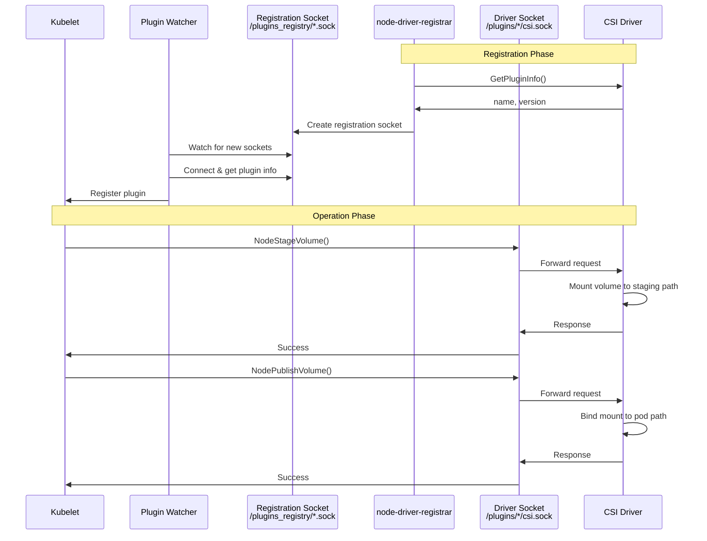

### **Socket Implementation**

**File**: `/pkg/volume/csi/csi_client.go:80-140`

```go
// csiDriverClient encapsulates gRPC communication with CSI driver
type csiDriverClient struct {
    driverName      string
    addr            csiAddr
    conn            *grpc.ClientConn
    idClient        csipbv1.IdentityClient
    nodeClient      csipbv1.NodeClient
    ctrlClient      csipbv1.ControllerClient
}

// newGrpcConn creates a gRPC connection to the CSI driver socket
func newGrpcConn(addr csiAddr, metrics *MetricsManager) (*grpc.ClientConn, error) {
    network := "unix"
    klog.V(4).InfoS("Creating gRPC connection", "address", addr, "network", network)

    // Create dialer for Unix socket
    dialOptions := []grpc.DialOption{
        grpc.WithInsecure(),
        grpc.WithContextDialer(func(ctx context.Context, target string) (net.Conn, error) {
            return (&net.Dialer{}).DialContext(ctx, network, target)
        }),
        grpc.WithDefaultCallOptions(
            grpc.MaxCallRecvMsgSize(1024 * 1024 * 16), // 16 MiB
            grpc.MaxCallSendMsgSize(1024 * 1024 * 16),
        ),
    }

    // Add interceptors for metrics and logging
    if metrics != nil {
        dialOptions = append(dialOptions,
            grpc.WithUnaryInterceptor(metrics.RecordMetricsInterceptor))
    }

    // Establish connection
    conn, err := grpc.Dial(string(addr), dialOptions...)
    if err != nil {
        return nil, fmt.Errorf("failed to dial %s: %v", addr, err)
    }

    return conn, nil
}

// NodeStageVolume calls the CSI driver's NodeStageVolume RPC
func (c *csiDriverClient) NodeStageVolume(
    ctx context.Context,
    volumeID string,
    publishContext map[string]string,
    stagingTargetPath string,
    fsType string,
    accessMode api.PersistentVolumeAccessMode,
    readOnly bool,
    secrets map[string]string,
    volumeContext map[string]string,
    mountOptions []string,
    fsGroup *int64,
) error {
    klog.V(4).InfoS("Calling NodeStageVolume",
        "volumeID", volumeID,
        "stagingTargetPath", stagingTargetPath)

    // Build volume capability
    capability := &csipbv1.VolumeCapability{
        AccessMode: &csipbv1.VolumeCapability_AccessMode{
            Mode: asCSIAccessMode(accessMode),
        },
    }

    if fsType != "" {
        capability.AccessType = &csipbv1.VolumeCapability_Mount{
            Mount: &csipbv1.VolumeCapability_MountVolume{
                FsType:     fsType,
                MountFlags: mountOptions,
            },
        }
    } else {
        capability.AccessType = &csipbv1.VolumeCapability_Block{
            Block: &csipbv1.VolumeCapability_BlockVolume{},
        }
    }

    // Build request
    req := &csipbv1.NodeStageVolumeRequest{
        VolumeId:          volumeID,
        PublishContext:    publishContext,
        StagingTargetPath: stagingTargetPath,
        VolumeCapability:  capability,
        Secrets:           secrets,
        VolumeContext:     volumeContext,
    }

    // Call the driver
    _, err := c.nodeClient.NodeStageVolume(ctx, req)
    if err != nil {
        return fmt.Errorf("NodeStageVolume failed: %v", err)
    }

    klog.V(4).InfoS("NodeStageVolume succeeded", "volumeID", volumeID)
    return nil
}
```

━━━━━━━━━━━━━━━━━━━━━━━━━━━━━━━━━━━━━━━━━━━━━━━━━━━━━━━━━━━━━━━━━━━━━━━━━━━━━

## **🌐 Real-World Deployment Examples**

### **AWS EBS CSI Driver**

Complete deployment for AWS EBS CSI driver.

```yaml
# StorageClass for AWS EBS gp3 volumes
apiVersion: storage.k8s.io/v1
kind: StorageClass
metadata:
  name: ebs-gp3
provisioner: ebs.csi.aws.com
parameters:
  type: gp3
  iops: "3000"
  throughput: "125"
  encrypted: "true"
  kmsKeyId: "arn:aws:kms:us-west-2:111122223333:key/1234abcd-12ab-34cd-56ef-1234567890ab"
volumeBindingMode: WaitForFirstConsumer
allowVolumeExpansion: true
reclaimPolicy: Delete

---
# CSIDriver resource
apiVersion: storage.k8s.io/v1
kind: CSIDriver
metadata:
  name: ebs.csi.aws.com
spec:
  attachRequired: true
  podInfoOnMount: false
  volumeLifecycleModes:
    - Persistent
    - Ephemeral
  fsGroupPolicy: File
  tokenRequests:
    - audience: "sts.amazonaws.com"
  requiresRepublish: false

---
# VolumeSnapshotClass
apiVersion: snapshot.storage.k8s.io/v1
kind: VolumeSnapshotClass
metadata:
  name: ebs-snapshot-class
driver: ebs.csi.aws.com
deletionPolicy: Delete
parameters:
  tagSpecification_1: "Name=my-snapshot,Environment=production"
```

**Sample PVC**:
```yaml
apiVersion: v1
kind: PersistentVolumeClaim
metadata:
  name: ebs-claim
spec:
  accessModes:
    - ReadWriteOnce
  storageClassName: ebs-gp3
  resources:
    requests:
      storage: 100Gi
```

### **GCE Persistent Disk CSI Driver**

```yaml
# StorageClass for GCE PD SSD
apiVersion: storage.k8s.io/v1
kind: StorageClass
metadata:
  name: pd-ssd
provisioner: pd.csi.storage.gke.io
parameters:
  type: pd-ssd
  replication-type: regional-pd
  disk-encryption-kms-key: projects/my-project/locations/us-central1/keyRings/my-keyring/cryptoKeys/my-key
volumeBindingMode: WaitForFirstConsumer
allowVolumeExpansion: true
allowedTopologies:
  - matchLabelExpressions:
      - key: topology.gke.io/zone
        values:
          - us-central1-a
          - us-central1-b

---
# CSIDriver
apiVersion: storage.k8s.io/v1
kind: CSIDriver
metadata:
  name: pd.csi.storage.gke.io
spec:
  attachRequired: true
  podInfoOnMount: false

---
# Controller Deployment
apiVersion: apps/v1
kind: Deployment
metadata:
  name: csi-gce-pd-controller
  namespace: kube-system
spec:
  replicas: 1
  selector:
    matchLabels:
      app: gcp-compute-persistent-disk-csi-driver
  template:
    metadata:
      labels:
        app: gcp-compute-persistent-disk-csi-driver
    spec:
      serviceAccountName: csi-gce-pd-controller-sa
      containers:
        - name: csi-provisioner
          image: k8s.gcr.io/sig-storage/csi-provisioner:v3.5.0
          args:
            - --v=5
            - --csi-address=/csi/csi.sock
            - --feature-gates=Topology=true
            - --http-endpoint=:22011
            - --leader-election-namespace=$(PDCSI_NAMESPACE)
            - --timeout=250s
            - --extra-create-metadata
          volumeMounts:
            - name: socket-dir
              mountPath: /csi

        - name: csi-attacher
          image: k8s.gcr.io/sig-storage/csi-attacher:v4.3.0
          args:
            - --v=5
            - --csi-address=/csi/csi.sock
            - --http-endpoint=:22012
            - --leader-election
            - --leader-election-namespace=$(PDCSI_NAMESPACE)
            - --timeout=250s
          volumeMounts:
            - name: socket-dir
              mountPath: /csi

        - name: csi-resizer
          image: k8s.gcr.io/sig-storage/csi-resizer:v1.8.0
          args:
            - --v=5
            - --csi-address=/csi/csi.sock
            - --http-endpoint=:22013
            - --leader-election
            - --leader-election-namespace=$(PDCSI_NAMESPACE)
            - --handle-volume-inuse-error=false
          volumeMounts:
            - name: socket-dir
              mountPath: /csi

        - name: gce-pd-driver
          image: k8s.gcr.io/cloud-provider-gcp/gcp-compute-persistent-disk-csi-driver:v1.11.0
          args:
            - --v=5
            - --endpoint=unix:/csi/csi.sock
          volumeMounts:
            - name: socket-dir
              mountPath: /csi

      volumes:
        - name: socket-dir
          emptyDir: {}
```

### **NFS CSI Driver**

```yaml
# StorageClass for NFS
apiVersion: storage.k8s.io/v1
kind: StorageClass
metadata:
  name: nfs-csi
provisioner: nfs.csi.k8s.io
parameters:
  server: nfs-server.example.com
  share: /exported/path
  subDir: ${pvc.metadata.namespace}/${pvc.metadata.name}
mountOptions:
  - nfsvers=4.1
  - nolock
  - hard
reclaimPolicy: Delete
volumeBindingMode: Immediate

---
# CSIDriver
apiVersion: storage.k8s.io/v1
kind: CSIDriver
metadata:
  name: nfs.csi.k8s.io
spec:
  attachRequired: false  # NFS doesn't require attach
  podInfoOnMount: true
  volumeLifecycleModes:
    - Persistent

---
# Controller Deployment
apiVersion: apps/v1
kind: Deployment
metadata:
  name: csi-nfs-controller
  namespace: kube-system
spec:
  replicas: 1
  selector:
    matchLabels:
      app: csi-nfs-controller
  template:
    metadata:
      labels:
        app: csi-nfs-controller
    spec:
      serviceAccountName: csi-nfs-controller-sa
      containers:
        - name: csi-provisioner
          image: k8s.gcr.io/sig-storage/csi-provisioner:v3.5.0
          args:
            - -v=5
            - --csi-address=/csi/csi.sock
            - --leader-election
          volumeMounts:
            - name: socket-dir
              mountPath: /csi

        - name: nfs
          image: k8s.gcr.io/sig-storage/nfsplugin:v4.1.0
          args:
            - --v=5
            - --nodeid=$(NODE_ID)
            - --endpoint=unix:///csi/csi.sock
          env:
            - name: NODE_ID
              valueFrom:
                fieldRef:
                  fieldPath: spec.nodeName
          volumeMounts:
            - name: socket-dir
              mountPath: /csi

      volumes:
        - name: socket-dir
          emptyDir: {}

---
# Node DaemonSet (no attach required for NFS)
apiVersion: apps/v1
kind: DaemonSet
metadata:
  name: csi-nfs-node
  namespace: kube-system
spec:
  selector:
    matchLabels:
      app: csi-nfs-node
  template:
    metadata:
      labels:
        app: csi-nfs-node
    spec:
      hostNetwork: true
      containers:
        - name: node-driver-registrar
          image: k8s.gcr.io/sig-storage/csi-node-driver-registrar:v2.8.0
          args:
            - --v=5
            - --csi-address=/csi/csi.sock
            - --kubelet-registration-path=/var/lib/kubelet/plugins/csi-nfsplugin/csi.sock
          volumeMounts:
            - name: plugin-dir
              mountPath: /csi
            - name: registration-dir
              mountPath: /registration

        - name: nfs
          image: k8s.gcr.io/sig-storage/nfsplugin:v4.1.0
          securityContext:
            privileged: true
          args:
            - --v=5
            - --nodeid=$(NODE_ID)
            - --endpoint=unix:///csi/csi.sock
          env:
            - name: NODE_ID
              valueFrom:
                fieldRef:
                  fieldPath: spec.nodeName
          volumeMounts:
            - name: plugin-dir
              mountPath: /csi
            - name: pods-mount-dir
              mountPath: /var/lib/kubelet/pods
              mountPropagation: Bidirectional

      volumes:
        - name: plugin-dir
          hostPath:
            path: /var/lib/kubelet/plugins/csi-nfsplugin
            type: DirectoryOrCreate
        - name: registration-dir
          hostPath:
            path: /var/lib/kubelet/plugins_registry
            type: Directory
        - name: pods-mount-dir
          hostPath:
            path: /var/lib/kubelet/pods
            type: Directory
```

━━━━━━━━━━━━━━━━━━━━━━━━━━━━━━━━━━━━━━━━━━━━━━━━━━━━━━━━━━━━━━━━━━━━━━━━━━━━━

## **🔧 Troubleshooting Deployment Issues**

### **Common Issues and Resolutions**

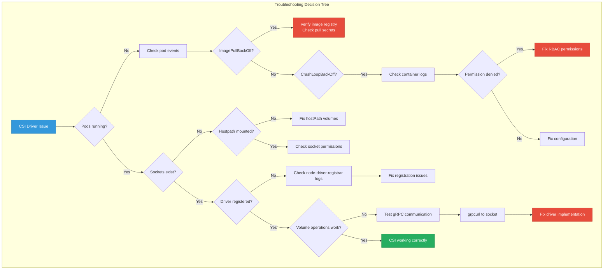

### **Issue 1: Driver Not Registered**

**Symptoms**:
```bash
$ kubectl describe csinode <node-name>
# Driver not listed in spec.drivers[]
```

**Diagnosis**:
```bash
# Check node-driver-registrar logs
kubectl logs -n kube-system <node-pod> -c node-driver-registrar

# Check plugin watcher logs (in kubelet)
journalctl -u kubelet | grep "plugin.*watcher"

# Verify registration socket
ls -la /var/lib/kubelet/plugins_registry/
```

**Resolution**:
```yaml
# Ensure correct paths in DaemonSet
env:
  - name: DRIVER_REG_SOCK_PATH
    value: /var/lib/kubelet/plugins/ebs.csi.aws.com/csi.sock  # Must match actual socket

volumeMounts:
  - name: registration-dir
    mountPath: /registration
  - name: plugin-dir
    mountPath: /csi

volumes:
  - name: registration-dir
    hostPath:
      path: /var/lib/kubelet/plugins_registry/
      type: Directory
  - name: plugin-dir
    hostPath:
      path: /var/lib/kubelet/plugins/ebs.csi.aws.com/
      type: DirectoryOrCreate
```

### **Issue 2: Volume Provisioning Fails**

**Symptoms**:
```bash
$ kubectl describe pvc my-pvc
Events:
  Warning  ProvisioningFailed  Failed to provision volume: rpc error
```

**Diagnosis**:
```bash
# Check external-provisioner logs
kubectl logs -n kube-system <controller-pod> -c csi-provisioner

# Check driver logs
kubectl logs -n kube-system <controller-pod> -c <driver-container>

# Verify StorageClass
kubectl get storageclass <class-name> -o yaml
```

**Common Causes**:

1. **Wrong provisioner name**:
```yaml
# StorageClass provisioner must match CSIDriver name
kind: StorageClass
provisioner: ebs.csi.aws.com  # Must match exactly
```

2. **Missing credentials**:
```yaml
# Ensure secrets are available
env:
  - name: AWS_ACCESS_KEY_ID
    valueFrom:
      secretKeyRef:
        name: aws-secret
        key: key_id
```

3. **Insufficient permissions**:
```bash
# Test AWS permissions
aws ec2 create-volume --size 10 --availability-zone us-west-2a

# Check RBAC
kubectl auth can-i create persistentvolumes \
  --as=system:serviceaccount:kube-system:ebs-csi-controller-sa
```

### **Issue 3: Volume Attach Fails**

**Symptoms**:
```bash
$ kubectl describe pod my-pod
Events:
  Warning  FailedAttachVolume  AttachVolume.Attach failed: rpc error
```

**Diagnosis**:
```bash
# Check VolumeAttachment resource
kubectl get volumeattachment
kubectl describe volumeattachment <va-name>

# Check external-attacher logs
kubectl logs -n kube-system <controller-pod> -c csi-attacher

# Check driver controller logs
kubectl logs -n kube-system <controller-pod> -c <driver-container>
```

**Resolution**:
```bash
# Verify node exists in cloud provider
aws ec2 describe-instances --instance-ids <instance-id>

# Check CSINode resource
kubectl describe csinode <node-name>

# Verify driver supports attach
kubectl get csidriver <driver-name> -o yaml
# spec.attachRequired should be true
```

### **Issue 4: Volume Mount Fails**

**Symptoms**:
```bash
$ kubectl describe pod my-pod
Events:
  Warning  FailedMount  MountVolume.MountDevice failed: rpc error
```

**Diagnosis**:
```bash
# Check node plugin logs
kubectl logs -n kube-system <node-pod> -c <driver-container>

# Check kubelet logs
journalctl -u kubelet -f | grep csi

# Verify volume attached
lsblk
# or for network volumes
mount | grep <volume-name>

# Check staging path
ls -la /var/lib/kubelet/plugins/kubernetes.io/csi/
```

**Common Causes**:

1. **Device not attached**:
```bash
# Wait for attach to complete
kubectl get volumeattachment -w
```

2. **Filesystem errors**:
```bash
# Check device
sudo fsck /dev/<device>

# Check driver logs for mkfs errors
kubectl logs -n kube-system <node-pod> -c <driver-container> | grep mkfs
```

3. **Mount propagation issues**:
```yaml
# Ensure bidirectional mount propagation
volumeMounts:
  - name: kubelet-dir
    mountPath: /var/lib/kubelet
    mountPropagation: Bidirectional  # Required!
```

### **Issue 5: Expansion Fails**

**Symptoms**:
```bash
$ kubectl describe pvc my-pvc
Conditions:
  Type                      Status
  ----                      ------
  FileSystemResizePending   True
```

**Diagnosis**:
```bash
# Check external-resizer logs
kubectl logs -n kube-system <controller-pod> -c csi-resizer

# Verify StorageClass allows expansion
kubectl get storageclass <class-name> -o jsonpath='{.allowVolumeExpansion}'
# Should return: true

# Check CSIDriver capabilities
kubectl get csidriver <driver-name> -o yaml
```

**Resolution**:
```bash
# For stuck expansion, check if pod is running
kubectl get pod -l app=<app-using-pvc>

# Node expansion requires pod restart in some cases
kubectl delete pod <pod-name>

# Check node plugin logs
kubectl logs -n kube-system <node-pod> -c <driver-container>
```

### **Debugging Tools**

**1. Test Socket Communication**:
```bash
# Install grpcurl
go install github.com/fullstorydev/grpcurl/cmd/grpcurl@latest

# Test node plugin socket
grpcurl -unix -plaintext \
  /var/lib/kubelet/plugins/ebs.csi.aws.com/csi.sock \
  csi.v1.Identity/GetPluginInfo

# Test controller socket
kubectl exec -n kube-system <controller-pod> -- \
  grpcurl -unix -plaintext \
  /var/lib/csi/sockets/pluginproxy/csi.sock \
  csi.v1.Controller/ControllerGetCapabilities
```

**2. Enable Debug Logging**:
```yaml
# Add debug flags to sidecars
args:
  - --v=5  # Increase verbosity (0-5)
  - --csi-address=/csi/csi.sock

# For driver container
args:
  - --logtostderr
  - --v=5
```

**3. Check Metrics**:
```bash
# External-provisioner metrics
kubectl port-forward -n kube-system <controller-pod> 8080:8080
curl http://localhost:8080/metrics

# Look for:
# - csi_sidecar_operations_seconds (operation latency)
# - csi_sidecar_operations_total (operation count)
# - storage_operation_duration_seconds (Kubernetes storage metrics)
```

**4. Validate Configuration**:
```bash
# Check all CSI resources
kubectl get csidriver
kubectl get csistoragecapacity
kubectl get volumeattachment
kubectl get volumesnapshot
kubectl get volumesnapshotcontent

# Validate YAML
kubectl apply --dry-run=server -f deployment.yaml
```

━━━━━━━━━━━━━━━━━━━━━━━━━━━━━━━━━━━━━━━━━━━━━━━━━━━━━━━━━━━━━━━━━━━━━━━━━━━━━

## **📊 Metrics and Monitoring**

### **Sidecar Metrics**

All sidecars expose Prometheus metrics on port 8080 by default.

```yaml
# ServiceMonitor for Prometheus Operator
apiVersion: monitoring.coreos.com/v1
kind: ServiceMonitor
metadata:
  name: csi-driver-metrics
  namespace: kube-system
spec:
  selector:
    matchLabels:
      app: ebs-csi-controller
  endpoints:
    - port: metrics
      interval: 30s
      path: /metrics

---
# Service exposing metrics
apiVersion: v1
kind: Service
metadata:
  name: ebs-csi-controller-metrics
  namespace: kube-system
  labels:
    app: ebs-csi-controller
spec:
  selector:
    app: ebs-csi-controller
  ports:
    - name: metrics
      port: 8080
      targetPort: 8080
```

**Key Metrics**:
```promql
# Operation latency (provisioner)
histogram_quantile(0.99,
  rate(csi_sidecar_operations_seconds_bucket{
    driver_name="ebs.csi.aws.com",
    method_name="CreateVolume"
  }[5m])
)

# Operation error rate (attacher)
rate(csi_sidecar_operations_total{
  driver_name="ebs.csi.aws.com",
  method_name="ControllerPublishVolume",
  grpc_status_code!="OK"
}[5m])

# Volume provisioning rate
rate(csi_sidecar_operations_total{
  driver_name="ebs.csi.aws.com",
  method_name="CreateVolume",
  grpc_status_code="OK"
}[5m])

# Leader election status
max(leader_election_master_status{
  name="external-provisioner-leader"
})
```

### **Grafana Dashboard Example**

```json
{
  "dashboard": {
    "title": "CSI Driver Metrics",
    "panels": [
      {
        "title": "Provisioning Operations",
        "targets": [
          {
            "expr": "sum(rate(csi_sidecar_operations_total{method_name=\"CreateVolume\"}[5m])) by (grpc_status_code)"
          }
        ],
        "type": "graph"
      },
      {
        "title": "Attach/Detach Operations",
        "targets": [
          {
            "expr": "sum(rate(csi_sidecar_operations_total{method_name=~\"ControllerPublish.*\"}[5m])) by (method_name)"
          }
        ],
        "type": "graph"
      }
    ]
  }
}
```

━━━━━━━━━━━━━━━━━━━━━━━━━━━━━━━━━━━━━━━━━━━━━━━━━━━━━━━━━━━━━━━━━━━━━━━━━━━━━

## **✅ Best Practices**

### **1. High Availability**

```yaml
# Run multiple controller replicas
spec:
  replicas: 2

  # Use pod anti-affinity
  affinity:
    podAntiAffinity:
      preferredDuringSchedulingIgnoredDuringExecution:
        - weight: 100
          podAffinityTerm:
            labelSelector:
              matchLabels:
                app: ebs-csi-controller
            topologyKey: kubernetes.io/hostname

  # Enable leader election (enabled by default)
  containers:
    - name: csi-provisioner
      args:
        - --leader-election=true
        - --leader-election-namespace=kube-system
```

### **2. Resource Management**

```yaml
# Set appropriate resource requests/limits
containers:
  - name: csi-provisioner
    resources:
      requests:
        cpu: 10m
        memory: 40Mi
      limits:
        cpu: 100m
        memory: 200Mi

  - name: csi-driver
    resources:
      requests:
        cpu: 50m
        memory: 100Mi
      limits:
        cpu: 500m
        memory: 500Mi
```

### **3. Security Hardening**

```yaml
# Use least privilege for controller
securityContext:
  runAsNonRoot: true
  runAsUser: 65534
  fsGroup: 65534
  seccompProfile:
    type: RuntimeDefault

# Node plugin needs privileged but restrict what you can
securityContext:
  privileged: true
  capabilities:
    drop:
      - ALL
    add:
      - SYS_ADMIN  # Only what's needed
  seLinuxOptions:
    type: spc_t
```

### **4. Version Pinning**

```yaml
# Pin sidecar versions for stability
containers:
  - name: csi-provisioner
    image: k8s.gcr.io/sig-storage/csi-provisioner:v3.5.0  # Specific version

  - name: csi-attacher
    image: k8s.gcr.io/sig-storage/csi-attacher:v4.3.0
```

### **5. Logging and Debugging**

```yaml
# Structured logging
containers:
  - name: csi-driver
    args:
      - --logtostderr
      - --v=2  # Production: 2, Debug: 5
    env:
      - name: CSI_LOG_FORMAT
        value: json  # Structured logs for better parsing
```

━━━━━━━━━━━━━━━━━━━━━━━━━━━━━━━━━━━━━━━━━━━━━━━━━━━━━━━━━━━━━━━━━━━━━━━━━━━━━

## **🔗 Cross-References**

### **Related CSI Documentation**
- `00-README.md` - CSI overview and introduction
- `STATUS.md` - Current documentation status
- `high-level/01-csi-architecture.md` - CSI architecture fundamentals
- `high-level/02-api-resources.md` - CSI API resources
- `middle-level/01-volume-lifecycle.md` - Volume lifecycle management
- `middle-level/02-attach-detach-controller.md` - Attach/detach operations
- `middle-level/03-expansion-controller.md` - Volume expansion
- `middle-level/04-pv-controller-integration.md` - PV controller integration
- `middle-level/05-scheduler-integration.md` - Scheduler integration
- `middle-level/06-migration-framework.md` - In-tree to CSI migration

### **Related Component Documentation**
- `/docs/architecture/claude/controller-manager/` - Controller manager internals
- `/docs/architecture/claude/kubectl/` - kubectl command implementation
- `/docs/architecture/claude/common/` - Common Kubernetes patterns

### **External Resources**
- [CSI Spec](https://github.com/container-storage-interface/spec)
- [Kubernetes CSI Documentation](https://kubernetes-csi.github.io/)
- [CSI Sidecar Containers](https://kubernetes-csi.github.io/docs/sidecar-containers.html)
- [AWS EBS CSI Driver](https://github.com/kubernetes-sigs/aws-ebs-csi-driver)
- [GCE PD CSI Driver](https://github.com/kubernetes-sigs/gcp-compute-persistent-disk-csi-driver)

━━━━━━━━━━━━━━━━━━━━━━━━━━━━━━━━━━━━━━━━━━━━━━━━━━━━━━━━━━━━━━━━━━━━━━━━━━━━━

## **📝 Summary**

This document covered the complete CSI driver deployment architecture:

1. **Dual-Component Model**: Separation of controller and node plugins
2. **Sidecar Containers**: Detailed coverage of all sidecar responsibilities
3. **RBAC Requirements**: Complete permission sets for all components
4. **Socket Communication**: Unix socket-based gRPC communication
5. **Real-World Examples**: Production-ready deployments for AWS, GCE, NFS
6. **Troubleshooting**: Common issues and resolution strategies
7. **Best Practices**: HA, security, resource management

**Key Takeaways**:
- CSI drivers deploy as controller (cluster-scoped) and node (per-node) plugins
- Sidecar containers handle Kubernetes integration (provisioner, attacher, resizer, snapshotter)
- Communication happens via Unix sockets (/var/lib/kubelet/plugins/)
- Proper RBAC is critical for sidecar functionality
- Monitoring and observability are essential for production deployments

**Next Steps**: See `middle-level/01-volume-lifecycle.md` for detailed volume operation workflows.
