# **CSI Plugin Registration - Complete Architecture**

━━━━━━━━━━━━━━━━━━━━━━━━━━━━━━━━━━━━━━━━━━━━━━━━━━━━━━━━━━━━━━━━━━━━━━━━━━━━━━

## **Overview**

CSI Plugin Registration is the foundational process that enables Kubernetes kubelet to discover and communicate with CSI driver pods running on each node. This document provides comprehensive coverage of the plugin watcher architecture, socket discovery, registration protocol, and state management.

**Key Components:**
- Plugin Watcher: File system monitoring for plugin discovery
- Socket Discovery: Detection and validation of Unix domain sockets
- Registration Protocol: gRPC-based handshake between kubelet and drivers
- Plugin Manager: Lifecycle management for registered plugins
- Handler Interface: CSI-specific registration logic

**Core Files:**
```
/pkg/kubelet/pluginmanager/
├── pluginwatcher/
│   ├── plugin_watcher.go           # Main watcher implementation
│   ├── plugin_watcher_test.go      # Unit tests
│   └── README.md                   # Excellent documentation
├── plugin_manager.go                # Plugin lifecycle management
├── cache/
│   ├── actual_state_of_world.go    # Current plugin state
│   └── desired_state_of_world.go   # Target plugin state
└── reconciler/
    └── reconciler.go                # State reconciliation loop
```

**Cross-References:**
- [CSI Core Components](../high-level/01-csi-core-components.md)
- [CSI Driver Object](../middle-level/02-csi-driver-object.md)
- [gRPC Client](./02-grpc-client.md)
- [Driver Store](./04-driver-store.md)
- [Node Info Manager](./05-node-info-manager.md)

━━━━━━━━━━━━━━━━━━━━━━━━━━━━━━━━━━━━━━━━━━━━━━━━━━━━━━━━━━━━━━━━━━━━━━━━━━━━━━

## **Plugin Watcher Architecture**

### **Overall Architecture**

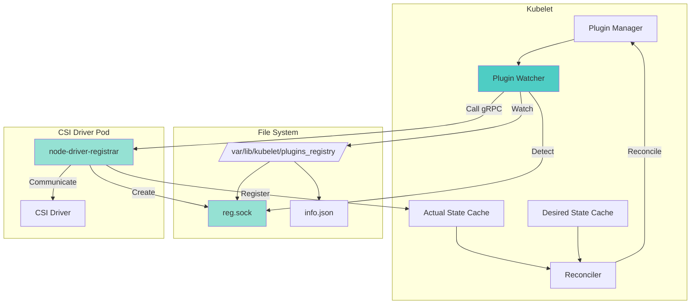

### **File System Watcher Implementation**

**File: /pkg/kubelet/pluginmanager/pluginwatcher/plugin_watcher.go (Lines 1-80)**

```go
package pluginwatcher

import (
    "fmt"
    "os"
    "path/filepath"
    "strings"
    "time"

    "github.com/fsnotify/fsnotify"
    "k8s.io/klog/v2"

    utilfs "k8s.io/kubernetes/pkg/util/filesystem"
)

// Watcher is the plugin watcher
type Watcher struct {
    // Path to the directory to watch for plugin registration
    path string
    // File system watcher
    fsWatcher *fsnotify.Watcher
    // File system utility
    fs utilfs.Filesystem
    // Registered handlers for different plugin types
    handlers map[string]PluginHandler
    // Stop channel
    stopCh chan struct{}
}

// NewWatcher creates a new plugin watcher
func NewWatcher(sockDir string, handlers map[string]PluginHandler) *Watcher {
    return &Watcher{
        path:     sockDir,
        handlers: handlers,
        fs:       &utilfs.DefaultFs{},
    }
}

// Start starts the plugin watcher
func (w *Watcher) Start() error {
    klog.V(2).InfoS("Starting plugin watcher", "path", w.path)

    // Create the directory if it doesn't exist
    if err := w.fs.MkdirAll(w.path, 0755); err != nil {
        return fmt.Errorf("error creating directory %q: %w", w.path, err)
    }

    // Create fsnotify watcher
    fsWatcher, err := fsnotify.NewWatcher()
    if err != nil {
        return fmt.Errorf("failed to create fsnotify watcher: %w", err)
    }
    w.fsWatcher = fsWatcher

    // Add watch on the directory
    if err := w.fsWatcher.Add(w.path); err != nil {
        return fmt.Errorf("failed to add watch on %q: %w", w.path, err)
    }

    // Start watch loop
    w.stopCh = make(chan struct{})
    go w.watchLoop()

    // Handle existing plugins
    if err := w.handleExistingPlugins(); err != nil {
        klog.ErrorS(err, "Failed to handle existing plugins")
    }

    return nil
}

// Stop stops the plugin watcher
func (w *Watcher) Stop() {
    close(w.stopCh)
    if w.fsWatcher != nil {
        w.fsWatcher.Close()
    }
}
```

### **Watch Loop Implementation**

**File: /pkg/kubelet/pluginmanager/pluginwatcher/plugin_watcher.go (Lines 100-180)**

```go
// watchLoop is the main watch loop
func (w *Watcher) watchLoop() {
    klog.V(2).InfoS("Starting watch loop")

    for {
        select {
        case event := <-w.fsWatcher.Events:
            if event.Op&fsnotify.Create == fsnotify.Create {
                // New file created
                klog.V(4).InfoS("Received fsnotify create event", "path", event.Name)
                w.handleCreateEvent(event.Name)
            } else if event.Op&fsnotify.Remove == fsnotify.Remove {
                // File removed
                klog.V(4).InfoS("Received fsnotify remove event", "path", event.Name)
                w.handleDeleteEvent(event.Name)
            }

        case err := <-w.fsWatcher.Errors:
            if err != nil {
                klog.ErrorS(err, "fsnotify error")
            }

        case <-w.stopCh:
            klog.V(2).InfoS("Stopping watch loop")
            return
        }
    }
}

// handleCreateEvent handles file creation events
func (w *Watcher) handleCreateEvent(socketPath string) {
    klog.V(4).InfoS("Processing create event", "path", socketPath)

    // Check if this is a socket file
    if !strings.HasSuffix(socketPath, ".sock") {
        klog.V(5).InfoS("Ignoring non-socket file", "path", socketPath)
        return
    }

    // Wait for socket to be ready
    if err := w.waitForSocketReady(socketPath); err != nil {
        klog.ErrorS(err, "Failed waiting for socket", "path", socketPath)
        return
    }

    // Handle plugin registration
    if err := w.handlePluginRegistration(socketPath); err != nil {
        klog.ErrorS(err, "Failed to handle plugin registration", "path", socketPath)
        return
    }

    klog.InfoS("Successfully registered plugin", "path", socketPath)
}

// handleDeleteEvent handles file deletion events
func (w *Watcher) handleDeleteEvent(socketPath string) {
    klog.V(4).InfoS("Processing delete event", "path", socketPath)

    // Check if this is a socket file
    if !strings.HasSuffix(socketPath, ".sock") {
        return
    }

    // Handle plugin deregistration
    if err := w.handlePluginDeregistration(socketPath); err != nil {
        klog.ErrorS(err, "Failed to handle plugin deregistration", "path", socketPath)
        return
    }

    klog.InfoS("Successfully deregistered plugin", "path", socketPath)
}

// waitForSocketReady waits for the socket to be ready for connections
func (w *Watcher) waitForSocketReady(socketPath string) error {
    // The socket file may be created but not yet ready for connections
    // Wait up to 10 seconds for it to be ready
    const maxRetries = 100
    const retryInterval = 100 * time.Millisecond

    for i := 0; i < maxRetries; i++ {
        // Check if socket file exists and is a socket
        fileInfo, err := w.fs.Stat(socketPath)
        if err != nil {
            if os.IsNotExist(err) {
                time.Sleep(retryInterval)
                continue
            }
            return err
        }

        // Check if it's a socket
        if fileInfo.Mode()&os.ModeSocket != 0 {
            return nil
        }

        time.Sleep(retryInterval)
    }

    return fmt.Errorf("timeout waiting for socket to be ready: %s", socketPath)
}
```

### **Watch Loop Workflow**

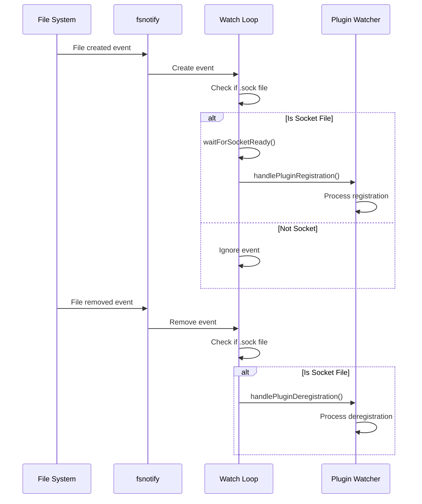

━━━━━━━━━━━━━━━━━━━━━━━━━━━━━━━━━━━━━━━━━━━━━━━━━━━━━━━━━━━━━━━━━━━━━━━━━━━━━━

## **Socket Discovery Workflow**

### **Complete Discovery Process**

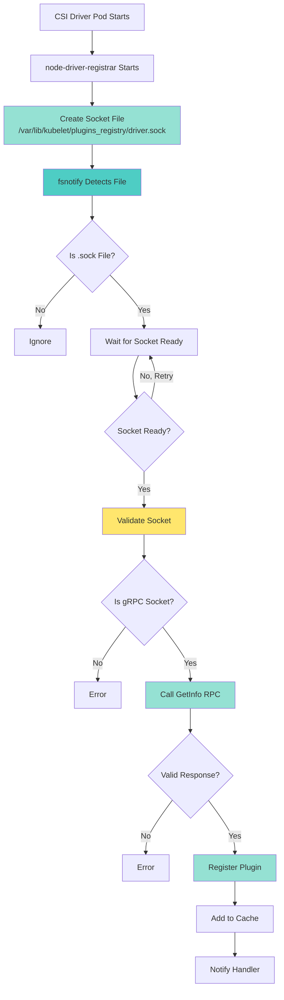

### **Socket Validation**

**File: /pkg/kubelet/pluginmanager/pluginwatcher/plugin_watcher.go (Lines 200-280)**

```go
// handlePluginRegistration handles plugin registration
func (w *Watcher) handlePluginRegistration(socketPath string) error {
    klog.V(2).InfoS("Handling plugin registration", "path", socketPath)

    // Get plugin info via gRPC
    pluginInfo, err := w.getPluginInfo(socketPath)
    if err != nil {
        return fmt.Errorf("failed to get plugin info: %w", err)
    }

    klog.V(4).InfoS("Got plugin info",
        "socket", socketPath,
        "name", pluginInfo.Name,
        "endpoint", pluginInfo.Endpoint,
        "version", pluginInfo.SupportedVersions)

    // Validate plugin info
    if err := w.validatePluginInfo(pluginInfo); err != nil {
        return fmt.Errorf("invalid plugin info: %w", err)
    }

    // Get handler for this plugin type
    handler, ok := w.handlers[pluginInfo.Type]
    if !ok {
        return fmt.Errorf("no handler found for plugin type: %s", pluginInfo.Type)
    }

    // Call handler to register plugin
    if err := handler.RegisterPlugin(pluginInfo.Name, pluginInfo.Endpoint, pluginInfo.SupportedVersions); err != nil {
        return fmt.Errorf("failed to register plugin with handler: %w", err)
    }

    // Notify registration status back to plugin
    if err := w.notifyRegistrationStatus(socketPath, true, ""); err != nil {
        klog.ErrorS(err, "Failed to notify registration status", "path", socketPath)
        // Don't return error - plugin is registered even if notification fails
    }

    return nil
}

// getPluginInfo retrieves plugin information via gRPC
func (w *Watcher) getPluginInfo(socketPath string) (*pluginInfo, error) {
    // Connect to plugin socket
    client, conn, err := dial(socketPath)
    if err != nil {
        return nil, fmt.Errorf("failed to dial socket: %w", err)
    }
    defer conn.Close()

    // Call GetInfo RPC
    ctx, cancel := context.WithTimeout(context.Background(), time.Second*10)
    defer cancel()

    infoResp, err := client.GetInfo(ctx, &registerapi.InfoRequest{})
    if err != nil {
        return nil, fmt.Errorf("GetInfo RPC failed: %w", err)
    }

    return &pluginInfo{
        Type:              infoResp.Type,
        Name:              infoResp.Name,
        Endpoint:          infoResp.Endpoint,
        SupportedVersions: infoResp.SupportedVersions,
    }, nil
}

// validatePluginInfo validates plugin information
func (w *Watcher) validatePluginInfo(info *pluginInfo) error {
    if info.Name == "" {
        return fmt.Errorf("plugin name is empty")
    }

    if info.Endpoint == "" {
        return fmt.Errorf("plugin endpoint is empty")
    }

    if len(info.SupportedVersions) == 0 {
        return fmt.Errorf("plugin has no supported versions")
    }

    // Validate endpoint is an absolute path
    if !filepath.IsAbs(info.Endpoint) {
        return fmt.Errorf("plugin endpoint must be absolute path: %s", info.Endpoint)
    }

    return nil
}

// notifyRegistrationStatus sends registration status back to plugin
func (w *Watcher) notifyRegistrationStatus(socketPath string, success bool, errorMsg string) error {
    // Connect to plugin socket
    client, conn, err := dial(socketPath)
    if err != nil {
        return fmt.Errorf("failed to dial socket: %w", err)
    }
    defer conn.Close()

    // Call NotifyRegistrationStatus RPC
    ctx, cancel := context.WithTimeout(context.Background(), time.Second*10)
    defer cancel()

    status := &registerapi.RegistrationStatus{
        PluginRegistered: success,
        Error:            errorMsg,
    }

    _, err = client.NotifyRegistrationStatus(ctx, status)
    if err != nil {
        return fmt.Errorf("NotifyRegistrationStatus RPC failed: %w", err)
    }

    return nil
}

// dial creates a gRPC connection to the plugin socket
func dial(socketPath string) (registerapi.RegistrationClient, *grpc.ClientConn, error) {
    ctx, cancel := context.WithTimeout(context.Background(), time.Second*10)
    defer cancel()

    conn, err := grpc.DialContext(ctx, socketPath,
        grpc.WithInsecure(),
        grpc.WithContextDialer(func(ctx context.Context, addr string) (net.Conn, error) {
            return (&net.Dialer{}).DialContext(ctx, "unix", addr)
        }),
    )
    if err != nil {
        return nil, nil, err
    }

    return registerapi.NewRegistrationClient(conn), conn, nil
}
```

### **Socket Discovery Timeline**

```mermaid
gantt
    title Plugin Socket Discovery Timeline
    dateFormat HH:mm:ss.SSS
    axisFormat %M:%S.%L

    section Driver Pod
    Pod starts                    :00:00:00.000, 1s
    node-driver-registrar starts  :00:00:01.000, 500ms
    Create socket file            :milestone, 00:00:01.500, 0ms
    Listen on socket              :00:00:01.500, 2s

    section Plugin Watcher
    fsnotify detects file         :00:00:01.501, 10ms
    Check if .sock file           :00:00:01.511, 5ms
    Wait for socket ready         :00:00:01.516, 100ms
    Validate socket               :00:00:01.616, 20ms
    Call GetInfo RPC              :00:00:01.636, 100ms
    Validate response             :00:00:01.736, 10ms
    Register plugin               :00:00:01.746, 50ms
    Notify registration status    :milestone, 00:00:01.796, 0ms

    section Plugin State
    Plugin registered             :00:00:01.796, 1204ms
```

━━━━━━━━━━━━━━━━━━━━━━━━━━━━━━━━━━━━━━━━━━━━━━━━━━━━━━━━━━━━━━━━━━━━━━━━━━━━━━

## **Registration gRPC Protocol**

### **Protocol Definition**

**File: /staging/src/k8s.io/kubelet/pkg/apis/pluginregistration/v1/api.proto**

```protobuf
syntax = "proto3";

package pluginregistration;

// Registration is the service advertised by the plugin registration socket
service Registration {
    // GetInfo is called by kubelet to get plugin info
    rpc GetInfo(InfoRequest) returns (PluginInfo) {}

    // NotifyRegistrationStatus is called by kubelet to notify registration status
    rpc NotifyRegistrationStatus(RegistrationStatus) returns (RegistrationStatusResponse) {}
}

// InfoRequest is the empty request message for GetInfo
message InfoRequest {}

// PluginInfo contains information about the plugin
message PluginInfo {
    // Type of plugin (CSIPlugin, DevicePlugin, etc.)
    string type = 1;

    // Plugin name (unique identifier)
    string name = 2;

    // Endpoint for the main plugin service (full socket path)
    string endpoint = 3;

    // Supported API versions
    repeated string supported_versions = 4;
}

// RegistrationStatus contains registration status
message RegistrationStatus {
    // Whether plugin was successfully registered
    bool plugin_registered = 1;

    // Error message if registration failed
    string error = 2;
}

// RegistrationStatusResponse is the response to NotifyRegistrationStatus
message RegistrationStatusResponse {}
```

### **GetInfo RPC Implementation**

**Example from node-driver-registrar (external component)**

```go
// GetInfo returns plugin information
func (r *registrar) GetInfo(ctx context.Context, req *pluginregistration.InfoRequest) (*pluginregistration.PluginInfo, error) {
    klog.V(4).Info("GetInfo called")

    return &pluginregistration.PluginInfo{
        Type: "CSIPlugin",
        Name: r.driverName,
        Endpoint: r.endpoint,
        SupportedVersions: []string{"1.0.0"},
    }, nil
}

// NotifyRegistrationStatus receives registration status from kubelet
func (r *registrar) NotifyRegistrationStatus(ctx context.Context, status *pluginregistration.RegistrationStatus) (*pluginregistration.RegistrationStatusResponse, error) {
    klog.V(4).InfoS("NotifyRegistrationStatus called",
        "registered", status.PluginRegistered,
        "error", status.Error)

    if !status.PluginRegistered {
        klog.ErrorS(nil, "Registration failed", "error", status.Error)
        return nil, fmt.Errorf("registration failed: %s", status.Error)
    }

    klog.Info("Registration successful")
    return &pluginregistration.RegistrationStatusResponse{}, nil
}
```

### **Registration Protocol Flow**

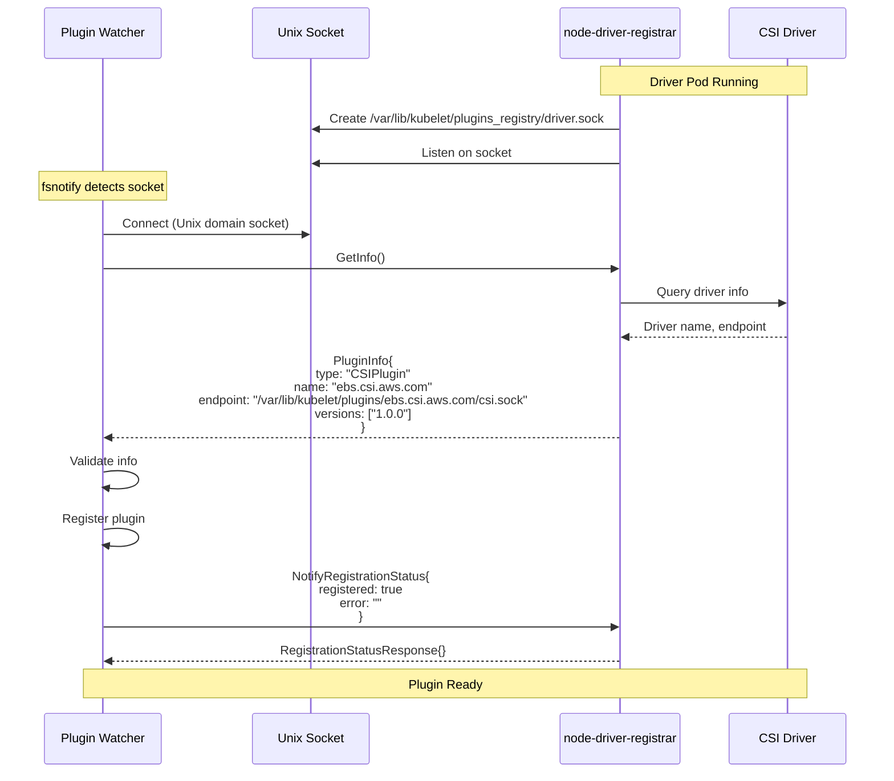

### **Registration Request/Response Examples**

**GetInfo Request:**
```json
{}
```

**GetInfo Response:**
```json
{
  "type": "CSIPlugin",
  "name": "ebs.csi.aws.com",
  "endpoint": "/var/lib/kubelet/plugins/ebs.csi.aws.com/csi.sock",
  "supported_versions": ["1.0.0"]
}
```

**NotifyRegistrationStatus Request:**
```json
{
  "plugin_registered": true,
  "error": ""
}
```

**NotifyRegistrationStatus Response:**
```json
{}
```

**Error Case:**
```json
{
  "plugin_registered": false,
  "error": "plugin validation failed: endpoint path is not absolute"
}
```

━━━━━━━━━━━━━━━━━━━━━━━━━━━━━━━━━━━━━━━━━━━━━━━━━━━━━━━━━━━━━━━━━━━━━━━━━━━━━━

## **CSI-Specific Handler**

### **RegistrationHandler Interface**

**File: /pkg/kubelet/pluginmanager/pluginwatcher/plugin_watcher.go (Lines 50-70)**

```go
// PluginHandler is the interface for plugin registration handlers
type PluginHandler interface {
    // RegisterPlugin is called when a plugin is discovered
    RegisterPlugin(pluginName string, endpoint string, versions []string) error

    // DeRegisterPlugin is called when a plugin is removed
    DeRegisterPlugin(pluginName string)

    // ValidatePlugin validates plugin before registration
    ValidatePlugin(pluginName string, endpoint string, versions []string) error
}
```

### **CSI Handler Implementation**

**File: /pkg/volume/csi/csi_plugin.go (Lines 150-250)**

```go
// RegistrationHandler handles CSI plugin registration
type RegistrationHandler struct {
    csiDrivers *csiDriversStore
    volumeHost volume.VolumeHost
}

// NewRegistrationHandler creates a new CSI registration handler
func NewRegistrationHandler() *RegistrationHandler {
    return &RegistrationHandler{
        csiDrivers: &csiDriversStore{
            driversMap: make(map[string]csiDriverInfo),
        },
    }
}

// RegisterPlugin handles CSI plugin registration
func (h *RegistrationHandler) RegisterPlugin(pluginName string, endpoint string, versions []string) error {
    klog.InfoS("Registering CSI driver", "name", pluginName, "endpoint", endpoint)

    // Validate plugin name
    if pluginName == "" {
        return fmt.Errorf("plugin name cannot be empty")
    }

    // Validate endpoint
    if endpoint == "" {
        return fmt.Errorf("plugin endpoint cannot be empty")
    }

    // Check if endpoint is a socket file
    if !strings.HasSuffix(endpoint, ".sock") {
        return fmt.Errorf("endpoint must be a socket file: %s", endpoint)
    }

    // Validate versions
    if len(versions) == 0 {
        return fmt.Errorf("plugin must support at least one version")
    }

    // Check version compatibility
    compatible := false
    for _, version := range versions {
        if version == "1.0.0" {
            compatible = true
            break
        }
    }
    if !compatible {
        return fmt.Errorf("plugin does not support any compatible versions")
    }

    // Get plugin capabilities
    capabilities, err := h.getPluginCapabilities(endpoint)
    if err != nil {
        return fmt.Errorf("failed to get plugin capabilities: %w", err)
    }

    // Register driver in driver store
    h.csiDrivers.Set(pluginName, csiDriverInfo{
        name:         pluginName,
        endpoint:     endpoint,
        capabilities: capabilities,
    })

    klog.InfoS("Successfully registered CSI driver", "name", pluginName)

    return nil
}

// DeRegisterPlugin handles CSI plugin deregistration
func (h *RegistrationHandler) DeRegisterPlugin(pluginName string) {
    klog.InfoS("Deregistering CSI driver", "name", pluginName)

    // Remove from driver store
    h.csiDrivers.Delete(pluginName)

    klog.InfoS("Successfully deregistered CSI driver", "name", pluginName)
}

// ValidatePlugin validates plugin before registration
func (h *RegistrationHandler) ValidatePlugin(pluginName string, endpoint string, versions []string) error {
    // Perform pre-registration validation
    klog.V(4).InfoS("Validating CSI plugin", "name", pluginName)

    // Check if plugin is already registered
    if h.csiDrivers.Get(pluginName) != nil {
        klog.V(4).InfoS("Plugin already registered, will update", "name", pluginName)
    }

    // Validate can connect to endpoint
    if err := h.validateEndpointConnection(endpoint); err != nil {
        return fmt.Errorf("failed to validate endpoint connection: %w", err)
    }

    return nil
}

// getPluginCapabilities retrieves capabilities from the CSI driver
func (h *RegistrationHandler) getPluginCapabilities(endpoint string) (*csiDriverCapabilities, error) {
    // Create CSI client
    client := newCsiDriverClient(endpoint)

    // Call GetPluginCapabilities
    ctx, cancel := context.WithTimeout(context.Background(), csiTimeout)
    defer cancel()

    resp, err := client.GetPluginCapabilities(ctx, &csipb.GetPluginCapabilitiesRequest{})
    if err != nil {
        return nil, fmt.Errorf("GetPluginCapabilities failed: %w", err)
    }

    // Parse capabilities
    caps := &csiDriverCapabilities{}
    for _, cap := range resp.GetCapabilities() {
        switch cap.GetType().(type) {
        case *csipb.PluginCapability_Service_:
            service := cap.GetService()
            switch service.GetType() {
            case csipb.PluginCapability_Service_CONTROLLER_SERVICE:
                caps.hasControllerService = true
            case csipb.PluginCapability_Service_VOLUME_ACCESSIBILITY_CONSTRAINTS:
                caps.hasTopology = true
            }
        }
    }

    return caps, nil
}

// validateEndpointConnection validates connection to plugin endpoint
func (h *RegistrationHandler) validateEndpointConnection(endpoint string) error {
    // Try to connect to the socket
    ctx, cancel := context.WithTimeout(context.Background(), time.Second*5)
    defer cancel()

    conn, err := grpc.DialContext(ctx, endpoint,
        grpc.WithInsecure(),
        grpc.WithBlock(),
        grpc.WithContextDialer(func(ctx context.Context, addr string) (net.Conn, error) {
            return (&net.Dialer{}).DialContext(ctx, "unix", addr)
        }),
    )
    if err != nil {
        return fmt.Errorf("failed to connect to endpoint: %w", err)
    }
    conn.Close()

    return nil
}
```

### **Handler Workflow**

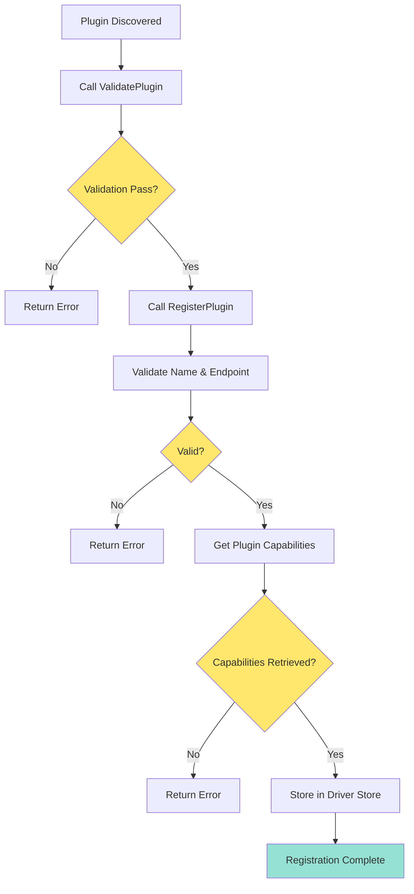

━━━━━━━━━━━━━━━━━━━━━━━━━━━━━━━━━━━━━━━━━━━━━━━━━━━━━━━━━━━━━━━━━━━━━━━━━━━━━━

## **Plugin Validation**

### **Validation Layers**

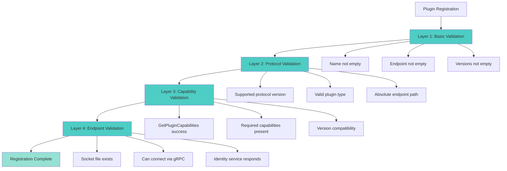

### **Validation Implementation**

**File: /pkg/kubelet/pluginmanager/pluginwatcher/plugin_watcher.go (Lines 300-400)**

```go
// validatePlugin performs comprehensive plugin validation
func (w *Watcher) validatePlugin(socketPath string, info *pluginInfo) error {
    // Layer 1: Basic validation
    if err := w.basicValidation(info); err != nil {
        return fmt.Errorf("basic validation failed: %w", err)
    }

    // Layer 2: Protocol validation
    if err := w.protocolValidation(info); err != nil {
        return fmt.Errorf("protocol validation failed: %w", err)
    }

    // Layer 3: Capability validation
    if err := w.capabilityValidation(socketPath, info); err != nil {
        return fmt.Errorf("capability validation failed: %w", err)
    }

    // Layer 4: Endpoint validation
    if err := w.endpointValidation(info); err != nil {
        return fmt.Errorf("endpoint validation failed: %w", err)
    }

    return nil
}

// basicValidation performs basic field validation
func (w *Watcher) basicValidation(info *pluginInfo) error {
    if info.Name == "" {
        return fmt.Errorf("plugin name is empty")
    }

    if info.Endpoint == "" {
        return fmt.Errorf("plugin endpoint is empty")
    }

    if len(info.SupportedVersions) == 0 {
        return fmt.Errorf("plugin has no supported versions")
    }

    if info.Type == "" {
        return fmt.Errorf("plugin type is empty")
    }

    return nil
}

// protocolValidation validates protocol-level requirements
func (w *Watcher) protocolValidation(info *pluginInfo) error {
    // Validate plugin type
    validTypes := map[string]bool{
        "CSIPlugin":    true,
        "DevicePlugin": true,
    }

    if !validTypes[info.Type] {
        return fmt.Errorf("invalid plugin type: %s", info.Type)
    }

    // Validate endpoint is absolute path
    if !filepath.IsAbs(info.Endpoint) {
        return fmt.Errorf("endpoint must be absolute path: %s", info.Endpoint)
    }

    // Validate endpoint has .sock extension
    if !strings.HasSuffix(info.Endpoint, ".sock") {
        return fmt.Errorf("endpoint must be a socket file: %s", info.Endpoint)
    }

    // Validate at least one version is supported
    hasValidVersion := false
    for _, version := range info.SupportedVersions {
        if version == "1.0.0" {
            hasValidVersion = true
            break
        }
    }

    if !hasValidVersion {
        return fmt.Errorf("plugin does not support any compatible versions: %v", info.SupportedVersions)
    }

    return nil
}

// capabilityValidation validates plugin capabilities
func (w *Watcher) capabilityValidation(socketPath string, info *pluginInfo) error {
    // For CSI plugins, verify can get capabilities
    if info.Type != "CSIPlugin" {
        return nil // Skip for non-CSI plugins
    }

    // Connect to plugin
    client, conn, err := dial(socketPath)
    if err != nil {
        return fmt.Errorf("failed to dial socket: %w", err)
    }
    defer conn.Close()

    // Try to get plugin capabilities (this validates the CSI identity service works)
    // Note: This is a simplified check - real validation would use CSI client
    ctx, cancel := context.WithTimeout(context.Background(), time.Second*10)
    defer cancel()

    // Try GetInfo again to verify connection
    _, err = client.GetInfo(ctx, &registerapi.InfoRequest{})
    if err != nil {
        return fmt.Errorf("failed to re-validate plugin info: %w", err)
    }

    return nil
}

// endpointValidation validates the actual endpoint
func (w *Watcher) endpointValidation(info *pluginInfo) error {
    // Check if endpoint file exists
    fileInfo, err := w.fs.Stat(info.Endpoint)
    if err != nil {
        if os.IsNotExist(err) {
            // Endpoint doesn't exist yet - this is OK, it may be created after registration
            klog.V(4).InfoS("Endpoint file does not exist yet", "endpoint", info.Endpoint)
            return nil
        }
        return fmt.Errorf("failed to stat endpoint: %w", err)
    }

    // If it exists, verify it's a socket
    if fileInfo.Mode()&os.ModeSocket == 0 {
        return fmt.Errorf("endpoint exists but is not a socket: %s", info.Endpoint)
    }

    return nil
}
```

━━━━━━━━━━━━━━━━━━━━━━━━━━━━━━━━━━━━━━━━━━━━━━━━━━━━━━━━━━━━━━━━━━━━━━━━━━━━━━

## **Driver Capabilities Caching**

### **Capabilities Structure**

**File: /pkg/volume/csi/csi_plugin.go (Lines 50-100)**

```go
// csiDriverInfo stores information about a CSI driver
type csiDriverInfo struct {
    // Driver name
    name string

    // Driver endpoint (socket path)
    endpoint string

    // Driver capabilities
    capabilities *csiDriverCapabilities

    // Mutex for thread safety
    mu sync.RWMutex
}

// csiDriverCapabilities stores CSI driver capabilities
type csiDriverCapabilities struct {
    // Whether driver supports controller service
    hasControllerService bool

    // Whether driver supports topology
    hasTopology bool

    // Whether driver supports volume snapshots
    hasCreateDeleteSnapshot bool

    // Whether driver supports volume cloning
    hasClone bool

    // Whether driver supports volume expansion
    hasExpand bool

    // Whether driver supports online expansion
    hasOnlineExpand bool

    // Node capabilities
    hasStageUnstage bool
    hasNodeExpansion bool
    hasVolumeStats bool

    // Plugin capabilities as returned by driver
    pluginCapabilities []*csipb.PluginCapability
    controllerCapabilities []*csipb.ControllerServiceCapability
    nodeCapabilities []*csipb.NodeServiceCapability
}
```

### **Capability Discovery**

**File: /pkg/volume/csi/csi_client.go (Lines 200-300)**

```go
// discoverDriverCapabilities discovers and caches driver capabilities
func (c *csiDriverClient) discoverDriverCapabilities() (*csiDriverCapabilities, error) {
    klog.V(4).InfoS("Discovering driver capabilities", "driver", c.driverName)

    caps := &csiDriverCapabilities{}

    // Get plugin capabilities
    pluginCaps, err := c.getPluginCapabilities()
    if err != nil {
        return nil, fmt.Errorf("failed to get plugin capabilities: %w", err)
    }
    caps.pluginCapabilities = pluginCaps

    // Parse plugin capabilities
    for _, cap := range pluginCaps {
        switch cap.GetType().(type) {
        case *csipb.PluginCapability_Service_:
            service := cap.GetService()
            switch service.GetType() {
            case csipb.PluginCapability_Service_CONTROLLER_SERVICE:
                caps.hasControllerService = true
                klog.V(4).InfoS("Driver supports controller service", "driver", c.driverName)

            case csipb.PluginCapability_Service_VOLUME_ACCESSIBILITY_CONSTRAINTS:
                caps.hasTopology = true
                klog.V(4).InfoS("Driver supports topology", "driver", c.driverName)
            }

        case *csipb.PluginCapability_VolumeExpansion_:
            expansion := cap.GetVolumeExpansion()
            switch expansion.GetType() {
            case csipb.PluginCapability_VolumeExpansion_ONLINE:
                caps.hasOnlineExpand = true
                klog.V(4).InfoS("Driver supports online expansion", "driver", c.driverName)

            case csipb.PluginCapability_VolumeExpansion_OFFLINE:
                caps.hasExpand = true
                klog.V(4).InfoS("Driver supports offline expansion", "driver", c.driverName)
            }
        }
    }

    // Get controller capabilities if controller service is supported
    if caps.hasControllerService {
        controllerCaps, err := c.getControllerCapabilities()
        if err != nil {
            klog.ErrorS(err, "Failed to get controller capabilities", "driver", c.driverName)
            // Don't fail - continue without controller capabilities
        } else {
            caps.controllerCapabilities = controllerCaps
            caps.parseControllerCapabilities(controllerCaps)
        }
    }

    // Get node capabilities
    nodeCaps, err := c.getNodeCapabilities()
    if err != nil {
        klog.ErrorS(err, "Failed to get node capabilities", "driver", c.driverName)
        // Don't fail - continue without node capabilities
    } else {
        caps.nodeCapabilities = nodeCaps
        caps.parseNodeCapabilities(nodeCaps)
    }

    return caps, nil
}

// parseControllerCapabilities parses controller capabilities
func (caps *csiDriverCapabilities) parseControllerCapabilities(controllerCaps []*csipb.ControllerServiceCapability) {
    for _, cap := range controllerCaps {
        switch cap.GetType().(type) {
        case *csipb.ControllerServiceCapability_Rpc:
            rpc := cap.GetRpc()
            switch rpc.GetType() {
            case csipb.ControllerServiceCapability_RPC_CREATE_DELETE_SNAPSHOT:
                caps.hasCreateDeleteSnapshot = true
                klog.V(4).Info("Driver supports snapshots")

            case csipb.ControllerServiceCapability_RPC_CLONE_VOLUME:
                caps.hasClone = true
                klog.V(4).Info("Driver supports cloning")

            case csipb.ControllerServiceCapability_RPC_EXPAND_VOLUME:
                caps.hasExpand = true
                klog.V(4).Info("Driver supports expansion")
            }
        }
    }
}

// parseNodeCapabilities parses node capabilities
func (caps *csiDriverCapabilities) parseNodeCapabilities(nodeCaps []*csipb.NodeServiceCapability) {
    for _, cap := range nodeCaps {
        switch cap.GetType().(type) {
        case *csipb.NodeServiceCapability_Rpc:
            rpc := cap.GetRpc()
            switch rpc.GetType() {
            case csipb.NodeServiceCapability_RPC_STAGE_UNSTAGE_VOLUME:
                caps.hasStageUnstage = true
                klog.V(4).Info("Driver supports stage/unstage")

            case csipb.NodeServiceCapability_RPC_EXPAND_VOLUME:
                caps.hasNodeExpansion = true
                klog.V(4).Info("Driver supports node expansion")

            case csipb.NodeServiceCapability_RPC_GET_VOLUME_STATS:
                caps.hasVolumeStats = true
                klog.V(4).Info("Driver supports volume stats")
            }
        }
    }
}
```

### **Capability Caching Flow**

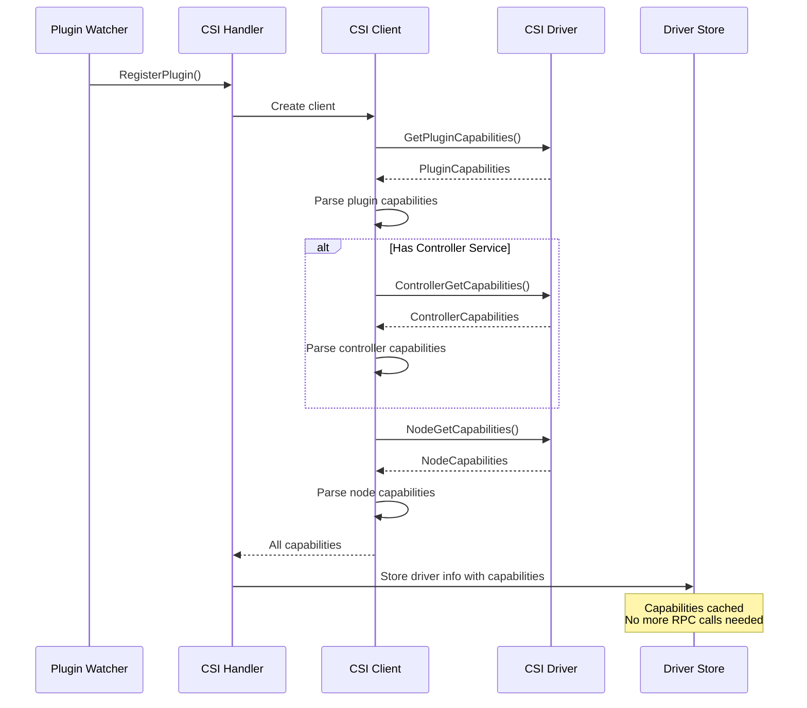

━━━━━━━━━━━━━━━━━━━━━━━━━━━━━━━━━━━━━━━━━━━━━━━━━━━━━━━━━━━━━━━━━━━━━━━━━━━━━━

## **Plugin State Machine**

### **State Definitions**

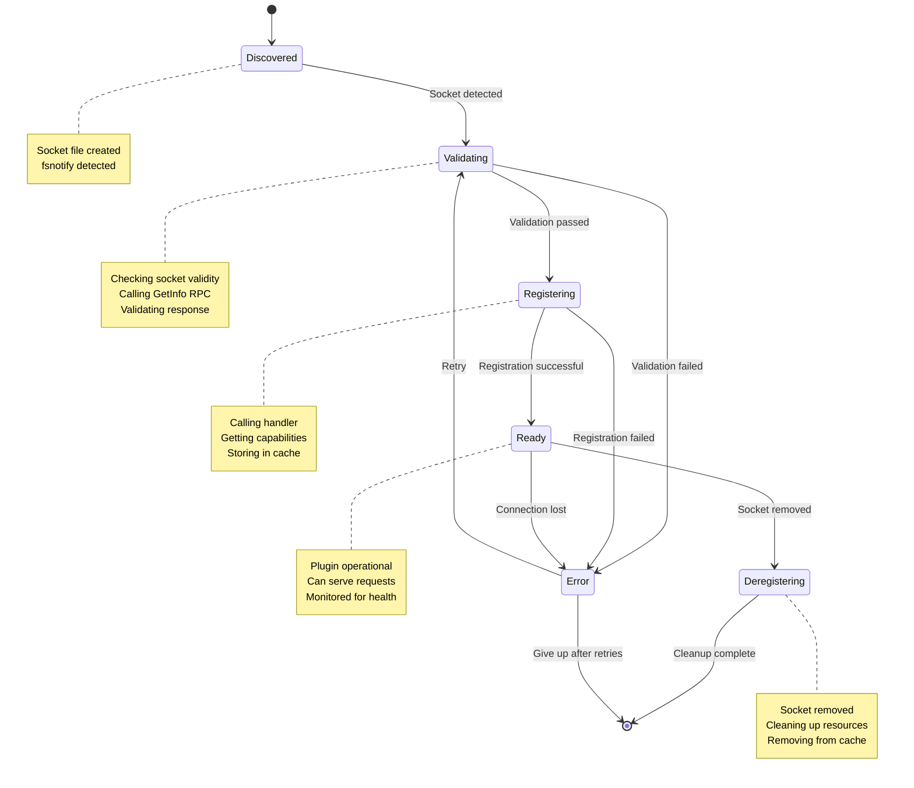

### **State Management Implementation**

**File: /pkg/kubelet/pluginmanager/cache/actual_state_of_world.go (Lines 1-150)**

```go
package cache

import (
    "fmt"
    "sync"

    "k8s.io/klog/v2"
)

// PluginState represents the state of a plugin
type PluginState string

const (
    // PluginStateDiscovered means socket file detected
    PluginStateDiscovered PluginState = "discovered"

    // PluginStateValidating means validating plugin
    PluginStateValidating PluginState = "validating"

    // PluginStateRegistering means registering plugin
    PluginStateRegistering PluginState = "registering"

    // PluginStateReady means plugin is ready
    PluginStateReady PluginState = "ready"

    // PluginStateDeregistering means deregistering plugin
    PluginStateDeregistering PluginState = "deregistering"

    // PluginStateError means plugin encountered error
    PluginStateError PluginState = "error"
)

// PluginInfo stores plugin information and state
type PluginInfo struct {
    // Plugin socket path
    SocketPath string

    // Plugin state
    State PluginState

    // Plugin name (from GetInfo)
    Name string

    // Plugin endpoint (from GetInfo)
    Endpoint string

    // Plugin type (from GetInfo)
    Type string

    // Supported versions
    SupportedVersions []string

    // Error message if in error state
    Error string

    // Retry count
    RetryCount int

    // Timestamp of last state change
    LastStateChange time.Time
}

// ActualStateOfWorld is the cache of currently registered plugins
type ActualStateOfWorld struct {
    // Map of socket path to plugin info
    plugins map[string]*PluginInfo

    // Mutex for thread safety
    sync.RWMutex
}

// NewActualStateOfWorld creates a new actual state cache
func NewActualStateOfWorld() *ActualStateOfWorld {
    return &ActualStateOfWorld{
        plugins: make(map[string]*PluginInfo),
    }
}

// AddPlugin adds a plugin in discovered state
func (asw *ActualStateOfWorld) AddPlugin(socketPath string) {
    asw.Lock()
    defer asw.Unlock()

    if _, exists := asw.plugins[socketPath]; exists {
        klog.V(4).InfoS("Plugin already exists", "path", socketPath)
        return
    }

    asw.plugins[socketPath] = &PluginInfo{
        SocketPath:      socketPath,
        State:           PluginStateDiscovered,
        LastStateChange: time.Now(),
    }

    klog.V(2).InfoS("Added plugin", "path", socketPath, "state", PluginStateDiscovered)
}

// UpdatePluginState updates plugin state
func (asw *ActualStateOfWorld) UpdatePluginState(socketPath string, newState PluginState, errorMsg string) error {
    asw.Lock()
    defer asw.Unlock()

    plugin, exists := asw.plugins[socketPath]
    if !exists {
        return fmt.Errorf("plugin not found: %s", socketPath)
    }

    oldState := plugin.State
    plugin.State = newState
    plugin.Error = errorMsg
    plugin.LastStateChange = time.Now()

    if newState == PluginStateError {
        plugin.RetryCount++
    } else {
        plugin.RetryCount = 0
    }

    klog.V(2).InfoS("Updated plugin state",
        "path", socketPath,
        "oldState", oldState,
        "newState", newState,
        "error", errorMsg)

    return nil
}

// SetPluginInfo sets plugin information from GetInfo response
func (asw *ActualStateOfWorld) SetPluginInfo(socketPath, name, endpoint, pluginType string, versions []string) error {
    asw.Lock()
    defer asw.Unlock()

    plugin, exists := asw.plugins[socketPath]
    if !exists {
        return fmt.Errorf("plugin not found: %s", socketPath)
    }

    plugin.Name = name
    plugin.Endpoint = endpoint
    plugin.Type = pluginType
    plugin.SupportedVersions = versions

    klog.V(4).InfoS("Set plugin info",
        "path", socketPath,
        "name", name,
        "endpoint", endpoint,
        "type", pluginType)

    return nil
}

// GetPlugin gets plugin info
func (asw *ActualStateOfWorld) GetPlugin(socketPath string) *PluginInfo {
    asw.RLock()
    defer asw.RUnlock()

    return asw.plugins[socketPath]
}

// RemovePlugin removes a plugin
func (asw *ActualStateOfWorld) RemovePlugin(socketPath string) {
    asw.Lock()
    defer asw.Unlock()

    delete(asw.plugins, socketPath)
    klog.V(2).InfoS("Removed plugin", "path", socketPath)
}

// GetAllPlugins returns all plugins
func (asw *ActualStateOfWorld) GetAllPlugins() map[string]*PluginInfo {
    asw.RLock()
    defer asw.RUnlock()

    // Return a copy to avoid concurrent modification
    plugins := make(map[string]*PluginInfo)
    for k, v := range asw.plugins {
        plugins[k] = v
    }

    return plugins
}
```

### **State Transition Logic**

**File: /pkg/kubelet/pluginmanager/pluginwatcher/plugin_watcher.go (Lines 450-550)**

```go
// handlePluginRegistrationWithState handles registration with state tracking
func (w *Watcher) handlePluginRegistrationWithState(socketPath string) error {
    // Add to state cache if new
    w.stateCache.AddPlugin(socketPath)

    // Transition to validating
    if err := w.stateCache.UpdatePluginState(socketPath, PluginStateValidating, ""); err != nil {
        return err
    }

    // Get plugin info
    pluginInfo, err := w.getPluginInfo(socketPath)
    if err != nil {
        w.stateCache.UpdatePluginState(socketPath, PluginStateError, err.Error())
        return fmt.Errorf("failed to get plugin info: %w", err)
    }

    // Set plugin info in cache
    if err := w.stateCache.SetPluginInfo(
        socketPath,
        pluginInfo.Name,
        pluginInfo.Endpoint,
        pluginInfo.Type,
        pluginInfo.SupportedVersions,
    ); err != nil {
        w.stateCache.UpdatePluginState(socketPath, PluginStateError, err.Error())
        return err
    }

    // Validate plugin
    if err := w.validatePluginInfo(pluginInfo); err != nil {
        w.stateCache.UpdatePluginState(socketPath, PluginStateError, err.Error())
        return fmt.Errorf("invalid plugin info: %w", err)
    }

    // Transition to registering
    if err := w.stateCache.UpdatePluginState(socketPath, PluginStateRegistering, ""); err != nil {
        return err
    }

    // Get handler
    handler, ok := w.handlers[pluginInfo.Type]
    if !ok {
        errMsg := fmt.Sprintf("no handler found for plugin type: %s", pluginInfo.Type)
        w.stateCache.UpdatePluginState(socketPath, PluginStateError, errMsg)
        return fmt.Errorf(errMsg)
    }

    // Register plugin
    if err := handler.RegisterPlugin(pluginInfo.Name, pluginInfo.Endpoint, pluginInfo.SupportedVersions); err != nil {
        w.stateCache.UpdatePluginState(socketPath, PluginStateError, err.Error())
        return fmt.Errorf("failed to register plugin with handler: %w", err)
    }

    // Transition to ready
    if err := w.stateCache.UpdatePluginState(socketPath, PluginStateReady, ""); err != nil {
        return err
    }

    // Notify registration status
    if err := w.notifyRegistrationStatus(socketPath, true, ""); err != nil {
        klog.ErrorS(err, "Failed to notify registration status", "path", socketPath)
        // Don't change state - plugin is registered even if notification fails
    }

    klog.InfoS("Plugin registration complete", "path", socketPath, "name", pluginInfo.Name)

    return nil
}

// handlePluginDeregistrationWithState handles deregistration with state tracking
func (w *Watcher) handlePluginDeregistrationWithState(socketPath string) error {
    // Get plugin info
    plugin := w.stateCache.GetPlugin(socketPath)
    if plugin == nil {
        klog.V(4).InfoS("Plugin not found in cache", "path", socketPath)
        return nil
    }

    // Transition to deregistering
    if err := w.stateCache.UpdatePluginState(socketPath, PluginStateDeregistering, ""); err != nil {
        return err
    }

    // Get handler
    handler, ok := w.handlers[plugin.Type]
    if !ok {
        klog.ErrorS(nil, "No handler found for plugin type", "type", plugin.Type)
        // Still remove from cache
    } else {
        // Deregister plugin
        handler.DeRegisterPlugin(plugin.Name)
    }

    // Remove from cache
    w.stateCache.RemovePlugin(socketPath)

    klog.InfoS("Plugin deregistration complete", "path", socketPath, "name", plugin.Name)

    return nil
}
```

━━━━━━━━━━━━━━━━━━━━━━━━━━━━━━━━━━━━━━━━━━━━━━━━━━━━━━━━━━━━━━━━━━━━━━━━━━━━━━

## **Deregistration Process**

### **Deregistration Workflow**

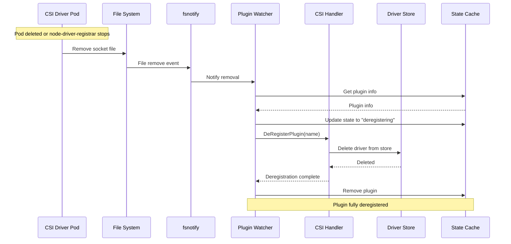

### **Deregistration Implementation**

**File: /pkg/kubelet/pluginmanager/pluginwatcher/plugin_watcher.go (Lines 600-650)**

```go
// handlePluginDeregistration handles plugin deregistration
func (w *Watcher) handlePluginDeregistration(socketPath string) error {
    klog.V(2).InfoS("Handling plugin deregistration", "path", socketPath)

    // Get plugin info from cache
    plugin := w.stateCache.GetPlugin(socketPath)
    if plugin == nil {
        klog.V(4).InfoS("Plugin not found in cache, already deregistered", "path", socketPath)
        return nil
    }

    pluginName := plugin.Name
    pluginType := plugin.Type

    // Update state to deregistering
    if err := w.stateCache.UpdatePluginState(socketPath, PluginStateDeregistering, ""); err != nil {
        klog.ErrorS(err, "Failed to update plugin state", "path", socketPath)
        // Continue anyway
    }

    // Get handler for this plugin type
    handler, ok := w.handlers[pluginType]
    if !ok {
        klog.ErrorS(nil, "No handler found for plugin type",
            "type", pluginType,
            "plugin", pluginName)
        // Still remove from cache
    } else {
        // Call handler to deregister
        handler.DeRegisterPlugin(pluginName)
        klog.V(4).InfoS("Called handler DeRegisterPlugin", "plugin", pluginName)
    }

    // Remove from state cache
    w.stateCache.RemovePlugin(socketPath)

    klog.InfoS("Successfully deregistered plugin",
        "path", socketPath,
        "name", pluginName,
        "type", pluginType)

    return nil
}
```

**CSI Handler Deregistration:**

**File: /pkg/volume/csi/csi_plugin.go (Lines 300-340)**

```go
// DeRegisterPlugin handles CSI plugin deregistration
func (h *RegistrationHandler) DeRegisterPlugin(pluginName string) {
    klog.InfoS("Deregistering CSI driver", "name", pluginName)

    // Check if plugin is registered
    driver := h.csiDrivers.Get(pluginName)
    if driver == nil {
        klog.V(4).InfoS("Driver not found in store", "name", pluginName)
        return
    }

    // Close any open connections
    // (In real implementation, would clean up gRPC connections)

    // Remove from driver store
    h.csiDrivers.Delete(pluginName)

    klog.InfoS("Successfully deregistered CSI driver", "name", pluginName)
}
```

### **Cleanup Activities**

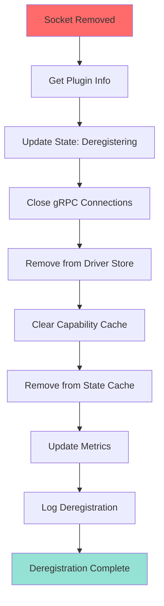

━━━━━━━━━━━━━━━━━━━━━━━━━━━━━━━━━━━━━━━━━━━━━━━━━━━━━━━━━━━━━━━━━━━━━━━━━━━━━━

## **Plugin Registration Example**

### **Complete Registration Sequence**

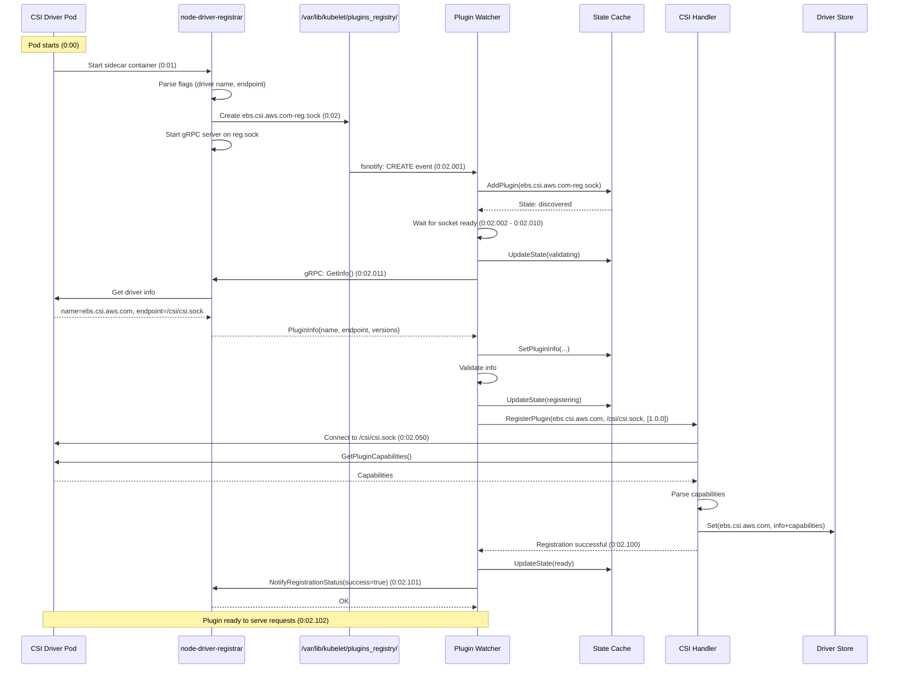

### **Real Logs Example**

```
# node-driver-registrar logs:
I0116 10:00:01.000 main.go:50] Version: v2.9.0
I0116 10:00:01.050 main.go:60] Running node-driver-registrar
I0116 10:00:01.100 node_register.go:45] Starting Registration Server at: /registration/ebs.csi.aws.com-reg.sock
I0116 10:00:01.150 node_register.go:54] Registration Server started at: /registration/ebs.csi.aws.com-reg.sock
I0116 10:00:02.001 node_register.go:120] Received GetInfo call: &InfoRequest{}
I0116 10:00:02.010 node_register.go:125] Returning PluginInfo: name:"ebs.csi.aws.com" endpoint:"/csi/csi.sock"
I0116 10:00:02.101 node_register.go:140] Received NotifyRegistrationStatus call: plugin_registered:true
I0116 10:00:02.102 node_register.go:145] Registration successful

# kubelet logs:
I0116 10:00:02.001 plugin_watcher.go:200] Handling plugin registration path="/var/lib/kubelet/plugins_registry/ebs.csi.aws.com-reg.sock"
I0116 10:00:02.011 plugin_watcher.go:250] Got plugin info socket="/var/lib/kubelet/plugins_registry/ebs.csi.aws.com-reg.sock" name="ebs.csi.aws.com" endpoint="/var/lib/kubelet/plugins/ebs.csi.aws.com/csi.sock"
I0116 10:00:02.050 csi_plugin.go:180] Registering CSI driver name="ebs.csi.aws.com" endpoint="/var/lib/kubelet/plugins/ebs.csi.aws.com/csi.sock"
I0116 10:00:02.080 csi_client.go:200] Discovering driver capabilities driver="ebs.csi.aws.com"
I0116 10:00:02.090 csi_client.go:220] Driver supports controller service driver="ebs.csi.aws.com"
I0116 10:00:02.095 csi_plugin.go:210] Successfully registered CSI driver name="ebs.csi.aws.com"
I0116 10:00:02.101 plugin_watcher.go:290] Successfully registered plugin path="/var/lib/kubelet/plugins_registry/ebs.csi.aws.com-reg.sock"
```

━━━━━━━━━━━━━━━━━━━━━━━━━━━━━━━━━━━━━━━━━━━━━━━━━━━━━━━━━━━━━━━━━━━━━━━━━━━━━━

## **Metrics**

### **Registration Metrics**

**File: /pkg/kubelet/pluginmanager/metrics/metrics.go**

```go
var (
    // pluginRegistrationCount tracks plugin registration events
    pluginRegistrationCount = metrics.NewCounterVec(
        &metrics.CounterOpts{
            Name:           "plugin_manager_total_plugins",
            Help:           "Total number of plugin registration attempts",
            StabilityLevel: metrics.ALPHA,
        },
        []string{"plugin_type", "socket_path", "state"},
    )

    // pluginRegistrationDuration tracks registration latency
    pluginRegistrationDuration = metrics.NewHistogramVec(
        &metrics.HistogramOpts{
            Name:           "plugin_manager_registration_duration_seconds",
            Help:           "Duration of plugin registration in seconds",
            Buckets:        metrics.ExponentialBuckets(0.01, 2, 10),
            StabilityLevel: metrics.ALPHA,
        },
        []string{"plugin_type"},
    )

    // pluginOperationErrors tracks registration errors
    pluginOperationErrors = metrics.NewCounterVec(
        &metrics.CounterOpts{
            Name:           "plugin_manager_operation_errors_total",
            Help:           "Total number of plugin operation errors",
            StabilityLevel: metrics.ALPHA,
        },
        []string{"plugin_type", "operation", "error_type"},
    )
)
```

**Example Metrics:**

```prometheus
# Registration attempts
plugin_manager_total_plugins{plugin_type="CSIPlugin",socket_path="/var/lib/kubelet/plugins_registry/ebs.csi.aws.com-reg.sock",state="ready"} 1

# Registration duration
plugin_manager_registration_duration_seconds{plugin_type="CSIPlugin",quantile="0.99"} 0.102

# Registration errors
plugin_manager_operation_errors_total{plugin_type="CSIPlugin",operation="registration",error_type="validation_failed"} 0
```

━━━━━━━━━━━━━━━━━━━━━━━━━━━━━━━━━━━━━━━━━━━━━━━━━━━━━━━━━━━━━━━━━━━━━━━━━━━━━━

## **Troubleshooting**

### **Common Issues**

**Issue 1: Plugin Not Detected**

**Symptoms:**
```bash
# No CSI driver registered
kubectl get csinode <node-name> -o yaml
# drivers list is empty or missing driver
```

**Diagnosis:**
```bash
# Check if socket file exists
ls -la /var/lib/kubelet/plugins_registry/

# Check kubelet logs
journalctl -u kubelet | grep -i "plugin.*registration"

# Check node-driver-registrar logs
kubectl logs -n kube-system <csi-node-pod> -c node-driver-registrar
```

**Solution:**
- Verify CSI driver pod is running
- Check socket directory is mounted correctly
- Verify node-driver-registrar has correct flags

**Issue 2: Registration Failed**

**Symptoms:**
```
Failed to register plugin: validation failed
```

**Diagnosis:**
```bash
# Check plugin watcher logs
journalctl -u kubelet | grep "plugin_watcher"

# Verify socket is valid
file /var/lib/kubelet/plugins_registry/*.sock

# Test gRPC connection
grpcurl -plaintext -unix /var/lib/kubelet/plugins_registry/driver-reg.sock list
```

**Solution:**
- Check GetInfo returns valid data
- Verify endpoint path is absolute
- Ensure supported versions include "1.0.0"

━━━━━━━━━━━━━━━━━━━━━━━━━━━━━━━━━━━━━━━━━━━━━━━━━━━━━━━━━━━━━━━━━━━━━━━━━━━━━━

## **Summary**

CSI Plugin Registration is a robust, event-driven system that enables automatic discovery and registration of CSI drivers on Kubernetes nodes. Key components include:

- **Plugin Watcher**: Uses fsnotify for file system monitoring
- **Socket Discovery**: Detects and validates Unix domain sockets
- **gRPC Protocol**: Standardized registration handshake
- **State Management**: Tracks plugin lifecycle
- **Capability Caching**: Stores driver capabilities for fast access

The registration process is fully automated, requiring no manual intervention once the CSI driver pod is deployed.

━━━━━━━━━━━━━━━━━━━━━━━━━━━━━━━━━━━━━━━━━━━━━━━━━━━━━━━━━━━━━━━━━━━━━━━━━━━━━━
