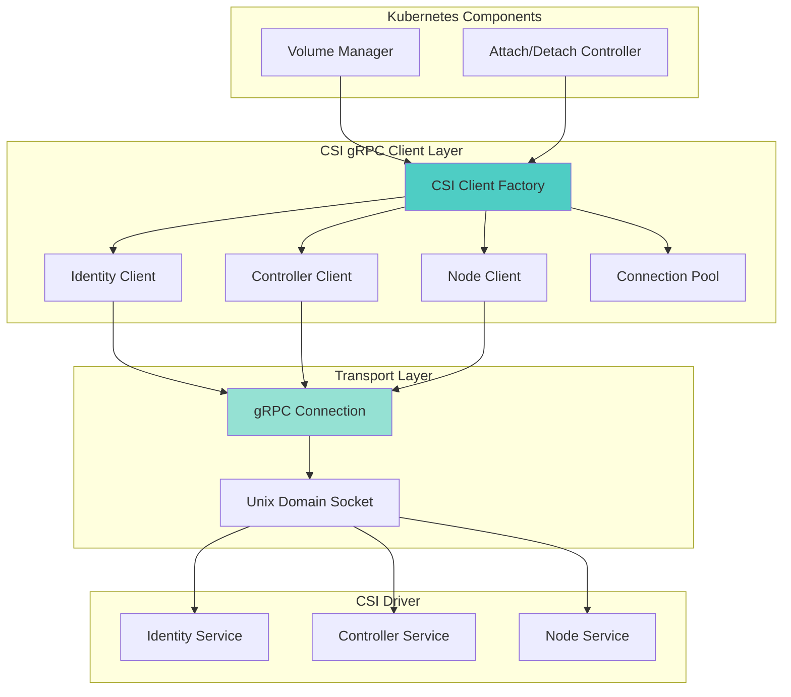
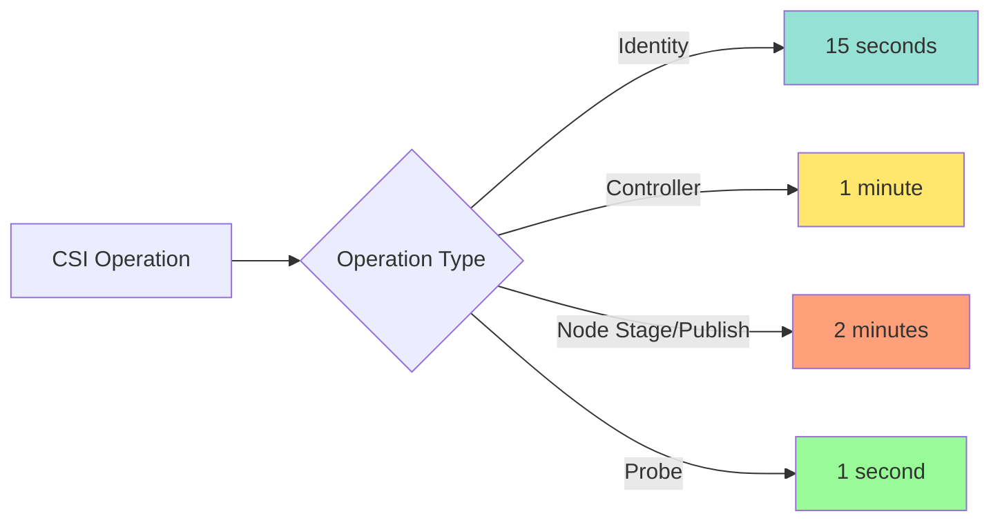
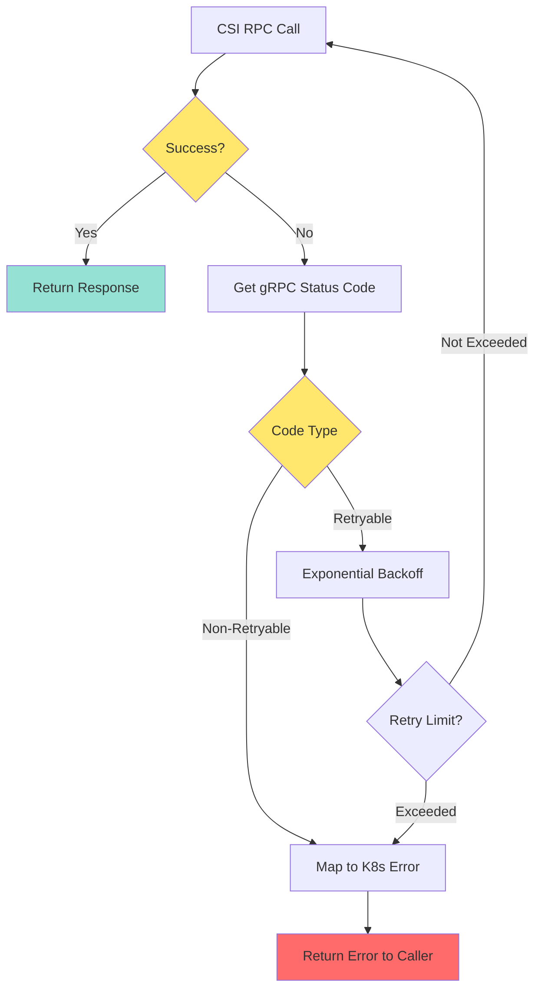
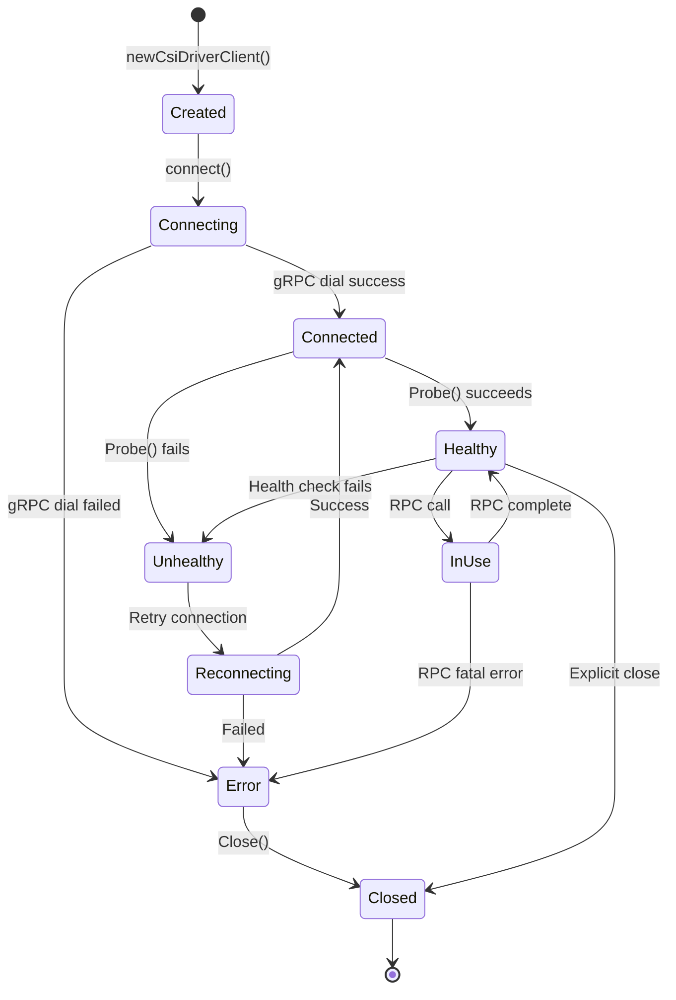

# **CSI gRPC Client - Complete Architecture**

━━━━━━━━━━━━━━━━━━━━━━━━━━━━━━━━━━━━━━━━━━━━━━━━━━━━━━━━━━━━━━━━━━━━━━━━━━━━━━

## **Overview**

The CSI gRPC Client is the foundational communication layer between Kubernetes and CSI drivers. This document provides comprehensive coverage of Unix domain socket connections, CSI RPC protocols (Identity, Controller, and Node services), timeout handling, retry logic, and error mapping.

**Key Components:**
- gRPC Connection Management: Unix domain socket connections
- Identity Service Client: Plugin metadata and capabilities
- Controller Service Client: Volume provisioning and attachment
- Node Service Client: Volume mounting and staging
- Error Handling: Status code mapping and retries

**Core Files:**
```
/pkg/volume/csi/
├── csi_client.go                   # Main gRPC client implementation
├── csi_attacher.go                 # Controller service calls
├── csi_mounter.go                  # Node service calls
└── csi_plugin.go                   # Plugin initialization
```

**Cross-References:**
- [CSI Core Components](../high-level/01-csi-core-components.md)
- [Plugin Registration](./01-plugin-registration.md)
- [Volume Operations](./03-volume-operations.md)
- [Driver Store](./04-driver-store.md)

━━━━━━━━━━━━━━━━━━━━━━━━━━━━━━━━━━━━━━━━━━━━━━━━━━━━━━━━━━━━━━━━━━━━━━━━━━━━━━

## **gRPC Client Architecture**

### **Overall Architecture**



### **Client Implementation**

**File: /pkg/volume/csi/csi_client.go (Lines 1-100)**

```go
package csi

import (
    "context"
    "fmt"
    "net"
    "time"

    "google.golang.org/grpc"
    "google.golang.org/grpc/codes"
    "google.golang.org/grpc/status"

    csipbv1 "github.com/container-storage-interface/spec/lib/go/csi"
    "k8s.io/klog/v2"
)

const (
    // Default timeout for CSI RPC calls
    csiTimeout = 15 * time.Second

    // Maximum message size for gRPC
    maxGRPCMessageSize = 16 * 1024 * 1024 // 16 MiB
)

// csiClient encapsulates all CSI gRPC client logic
type csiClient struct {
    // Driver name
    driverName string

    // Driver endpoint (Unix socket path)
    endpoint string

    // gRPC connection
    conn *grpc.ClientConn

    // Identity service client
    identityClient csipbv1.IdentityClient

    // Controller service client
    controllerClient csipbv1.ControllerClient

    // Node service client
    nodeClient csipbv1.NodeClient

    // Timeout for RPC calls
    timeout time.Duration
}

// newCsiDriverClient creates a new CSI driver client
func newCsiDriverClient(driverName string, endpoint string) (*csiClient, error) {
    klog.V(4).InfoS("Creating new CSI client", "driver", driverName, "endpoint", endpoint)

    client := &csiClient{
        driverName: driverName,
        endpoint:   endpoint,
        timeout:    csiTimeout,
    }

    // Establish connection
    if err := client.connect(); err != nil {
        return nil, fmt.Errorf("failed to connect to CSI driver: %w", err)
    }

    return client, nil
}

// connect establishes gRPC connection to the CSI driver
func (c *csiClient) connect() error {
    klog.V(4).InfoS("Connecting to CSI driver", "endpoint", c.endpoint)

    // Context with timeout for connection
    ctx, cancel := context.WithTimeout(context.Background(), c.timeout)
    defer cancel()

    // Dial options
    opts := []grpc.DialOption{
        grpc.WithInsecure(),
        grpc.WithBlock(), // Wait for connection to be ready
        grpc.WithContextDialer(func(ctx context.Context, addr string) (net.Conn, error) {
            // Use Unix domain socket
            return (&net.Dialer{}).DialContext(ctx, "unix", addr)
        }),
        grpc.WithDefaultCallOptions(
            grpc.MaxCallRecvMsgSize(maxGRPCMessageSize),
            grpc.MaxCallSendMsgSize(maxGRPCMessageSize),
        ),
    }

    // Establish connection
    conn, err := grpc.DialContext(ctx, c.endpoint, opts...)
    if err != nil {
        return fmt.Errorf("failed to dial endpoint %s: %w", c.endpoint, err)
    }

    c.conn = conn

    // Create service clients
    c.identityClient = csipbv1.NewIdentityClient(conn)
    c.controllerClient = csipbv1.NewControllerClient(conn)
    c.nodeClient = csipbv1.NewNodeClient(conn)

    klog.V(4).InfoS("Successfully connected to CSI driver", "driver", c.driverName)

    return nil
}

// Close closes the gRPC connection
func (c *csiClient) Close() error {
    if c.conn != nil {
        return c.conn.Close()
    }
    return nil
}
```

━━━━━━━━━━━━━━━━━━━━━━━━━━━━━━━━━━━━━━━━━━━━━━━━━━━━━━━━━━━━━━━━━━━━━━━━━━━━━━

## **Identity Service RPCs**

### **GetPluginInfo**

Returns basic plugin information.

**File: /pkg/volume/csi/csi_client.go (Lines 150-190)**

```go
// GetPluginInfo calls CSI GetPluginInfo RPC
func (c *csiClient) GetPluginInfo(ctx context.Context) (*csipbv1.GetPluginInfoResponse, error) {
    klog.V(4).InfoS("Calling GetPluginInfo", "driver", c.driverName)

    // Create context with timeout
    ctx, cancel := context.WithTimeout(ctx, c.timeout)
    defer cancel()

    // Call RPC
    resp, err := c.identityClient.GetPluginInfo(ctx, &csipbv1.GetPluginInfoRequest{})
    if err != nil {
        return nil, fmt.Errorf("GetPluginInfo failed: %w", err)
    }

    klog.V(4).InfoS("GetPluginInfo succeeded",
        "driver", c.driverName,
        "name", resp.GetName(),
        "version", resp.GetVendorVersion())

    return resp, nil
}
```

**Request/Response:**

```protobuf
message GetPluginInfoRequest {}

message GetPluginInfoResponse {
    // Plugin name
    string name = 1;

    // Plugin vendor version
    string vendor_version = 2;

    // Plugin manifest (optional)
    map<string, string> manifest = 3;
}
```

**Example:**
```json
// Request
{}

// Response
{
  "name": "ebs.csi.aws.com",
  "vendor_version": "v1.20.0",
  "manifest": {
    "support_url": "https://github.com/kubernetes-sigs/aws-ebs-csi-driver"
  }
}
```

### **GetPluginCapabilities**

Returns plugin capabilities.

**File: /pkg/volume/csi/csi_client.go (Lines 200-250)**

```go
// GetPluginCapabilities calls CSI GetPluginCapabilities RPC
func (c *csiClient) GetPluginCapabilities(ctx context.Context) (*csipbv1.GetPluginCapabilitiesResponse, error) {
    klog.V(4).InfoS("Calling GetPluginCapabilities", "driver", c.driverName)

    ctx, cancel := context.WithTimeout(ctx, c.timeout)
    defer cancel()

    resp, err := c.identityClient.GetPluginCapabilities(ctx, &csipbv1.GetPluginCapabilitiesRequest{})
    if err != nil {
        return nil, fmt.Errorf("GetPluginCapabilities failed: %w", err)
    }

    klog.V(4).InfoS("GetPluginCapabilities succeeded",
        "driver", c.driverName,
        "capabilities", len(resp.GetCapabilities()))

    // Log individual capabilities
    for _, cap := range resp.GetCapabilities() {
        switch cap.GetType().(type) {
        case *csipbv1.PluginCapability_Service_:
            svc := cap.GetService()
            klog.V(5).InfoS("Plugin capability", "type", "service", "service", svc.GetType())
        case *csipbv1.PluginCapability_VolumeExpansion_:
            exp := cap.GetVolumeExpansion()
            klog.V(5).InfoS("Plugin capability", "type", "volume_expansion", "expansion", exp.GetType())
        }
    }

    return resp, nil
}
```

**Request/Response:**

```protobuf
message GetPluginCapabilitiesRequest {}

message GetPluginCapabilitiesResponse {
    repeated PluginCapability capabilities = 1;
}

message PluginCapability {
    oneof type {
        Service service = 1;
        VolumeExpansion volume_expansion = 2;
    }

    message Service {
        enum Type {
            UNKNOWN = 0;
            CONTROLLER_SERVICE = 1;
            VOLUME_ACCESSIBILITY_CONSTRAINTS = 2;
        }
        Type type = 1;
    }

    message VolumeExpansion {
        enum Type {
            UNKNOWN = 0;
            ONLINE = 1;
            OFFLINE = 2;
        }
        Type type = 1;
    }
}
```

### **Probe**

Health check for the plugin.

**File: /pkg/volume/csi/csi_client.go (Lines 260-290)**

```go
// Probe calls CSI Probe RPC
func (c *csiClient) Probe(ctx context.Context) (bool, error) {
    klog.V(5).InfoS("Calling Probe", "driver", c.driverName)

    ctx, cancel := context.WithTimeout(ctx, c.timeout)
    defer cancel()

    resp, err := c.identityClient.Probe(ctx, &csipbv1.ProbeRequest{})
    if err != nil {
        return false, fmt.Errorf("Probe failed: %w", err)
    }

    ready := resp.GetReady()
    if ready != nil && !ready.GetValue() {
        klog.V(4).InfoS("Plugin not ready", "driver", c.driverName)
        return false, nil
    }

    klog.V(5).InfoS("Probe succeeded", "driver", c.driverName, "ready", true)
    return true, nil
}
```

━━━━━━━━━━━━━━━━━━━━━━━━━━━━━━━━━━━━━━━━━━━━━━━━━━━━━━━━━━━━━━━━━━━━━━━━━━━━━━

## **Controller Service RPCs**

### **CreateVolume**

Provisions a new volume.

**File: /pkg/volume/csi/csi_client.go (Lines 300-400)**

```go
// CreateVolume calls CSI CreateVolume RPC
func (c *csiClient) CreateVolume(ctx context.Context, name string, capacityBytes int64, parameters map[string]string, secrets map[string]string, topology *csipbv1.TopologyRequirement, contentSource *csipbv1.VolumeContentSource) (*csipbv1.CreateVolumeResponse, error) {
    klog.V(4).InfoS("Calling CreateVolume",
        "driver", c.driverName,
        "name", name,
        "capacity", capacityBytes)

    ctx, cancel := context.WithTimeout(ctx, c.timeout)
    defer cancel()

    req := &csipbv1.CreateVolumeRequest{
        Name: name,
        CapacityRange: &csipbv1.CapacityRange{
            RequiredBytes: capacityBytes,
        },
        VolumeCapabilities: []*csipbv1.VolumeCapability{
            {
                AccessType: &csipbv1.VolumeCapability_Mount{
                    Mount: &csipbv1.VolumeCapability_MountVolume{},
                },
                AccessMode: &csipbv1.VolumeCapability_AccessMode{
                    Mode: csipbv1.VolumeCapability_AccessMode_SINGLE_NODE_WRITER,
                },
            },
        },
        Parameters:            parameters,
        Secrets:               secrets,
        AccessibilityRequirements: topology,
        VolumeContentSource:   contentSource,
    }

    resp, err := c.controllerClient.CreateVolume(ctx, req)
    if err != nil {
        return nil, fmt.Errorf("CreateVolume failed: %w", err)
    }

    klog.V(4).InfoS("CreateVolume succeeded",
        "driver", c.driverName,
        "volumeID", resp.GetVolume().GetVolumeId(),
        "capacity", resp.GetVolume().GetCapacityBytes())

    return resp, nil
}
```

**Request/Response:**

```protobuf
message CreateVolumeRequest {
    string name = 1;
    CapacityRange capacity_range = 2;
    repeated VolumeCapability volume_capabilities = 3;
    map<string, string> parameters = 4;
    map<string, string> secrets = 5;
    TopologyRequirement accessibility_requirements = 6;
    VolumeContentSource volume_content_source = 7;
}

message CreateVolumeResponse {
    Volume volume = 1;
}

message Volume {
    int64 capacity_bytes = 1;
    string volume_id = 2;
    map<string, string> volume_context = 3;
    VolumeContentSource content_source = 4;
    repeated Topology accessible_topology = 5;
}
```

**Example:**
```json
// Request
{
  "name": "pvc-12345678",
  "capacity_range": {
    "required_bytes": 10737418240
  },
  "volume_capabilities": [{
    "mount": {},
    "access_mode": { "mode": "SINGLE_NODE_WRITER" }
  }],
  "parameters": {
    "type": "gp3",
    "iops": "3000",
    "throughput": "125"
  },
  "accessibility_requirements": {
    "preferred": [
      { "segments": { "topology.ebs.csi.aws.com/zone": "us-east-1a" } }
    ]
  }
}

// Response
{
  "volume": {
    "capacity_bytes": 10737418240,
    "volume_id": "vol-0123456789abcdef0",
    "volume_context": {
      "storage.kubernetes.io/csiProvisionerIdentity": "1234567890"
    },
    "accessible_topology": [
      { "segments": { "topology.ebs.csi.aws.com/zone": "us-east-1a" } }
    ]
  }
}
```

### **DeleteVolume**

Deletes a volume.

**File: /pkg/volume/csi/csi_client.go (Lines 410-450)**

```go
// DeleteVolume calls CSI DeleteVolume RPC
func (c *csiClient) DeleteVolume(ctx context.Context, volumeID string, secrets map[string]string) error {
    klog.V(4).InfoS("Calling DeleteVolume", "driver", c.driverName, "volumeID", volumeID)

    ctx, cancel := context.WithTimeout(ctx, c.timeout)
    defer cancel()

    req := &csipbv1.DeleteVolumeRequest{
        VolumeId: volumeID,
        Secrets:  secrets,
    }

    _, err := c.controllerClient.DeleteVolume(ctx, req)
    if err != nil {
        // Idempotency: if volume not found, consider it success
        if status.Code(err) == codes.NotFound {
            klog.V(4).InfoS("Volume already deleted", "volumeID", volumeID)
            return nil
        }
        return fmt.Errorf("DeleteVolume failed: %w", err)
    }

    klog.V(4).InfoS("DeleteVolume succeeded", "driver", c.driverName, "volumeID", volumeID)
    return nil
}
```

### **ControllerPublishVolume**

Attaches volume to node.

**File: /pkg/volume/csi/csi_client.go (Lines 460-530)**

```go
// ControllerPublishVolume calls CSI ControllerPublishVolume RPC
func (c *csiClient) ControllerPublishVolume(ctx context.Context, volumeID string, nodeID string, volumeCapability *csipbv1.VolumeCapability, readOnly bool, secrets map[string]string, volumeContext map[string]string) (*csipbv1.ControllerPublishVolumeResponse, error) {
    klog.V(4).InfoS("Calling ControllerPublishVolume",
        "driver", c.driverName,
        "volumeID", volumeID,
        "nodeID", nodeID,
        "readOnly", readOnly)

    ctx, cancel := context.WithTimeout(ctx, c.timeout)
    defer cancel()

    req := &csipbv1.ControllerPublishVolumeRequest{
        VolumeId:         volumeID,
        NodeId:           nodeID,
        VolumeCapability: volumeCapability,
        Readonly:         readOnly,
        Secrets:          secrets,
        VolumeContext:    volumeContext,
    }

    resp, err := c.controllerClient.ControllerPublishVolume(ctx, req)
    if err != nil {
        return nil, fmt.Errorf("ControllerPublishVolume failed: %w", err)
    }

    klog.V(4).InfoS("ControllerPublishVolume succeeded",
        "driver", c.driverName,
        "volumeID", volumeID,
        "nodeID", nodeID,
        "publishContext", resp.GetPublishContext())

    return resp, nil
}
```

**Request/Response:**

```protobuf
message ControllerPublishVolumeRequest {
    string volume_id = 1;
    string node_id = 2;
    VolumeCapability volume_capability = 3;
    bool readonly = 4;
    map<string, string> secrets = 5;
    map<string, string> volume_context = 6;
}

message ControllerPublishVolumeResponse {
    map<string, string> publish_context = 1;
}
```

**Example:**
```json
// Request
{
  "volume_id": "vol-0123456789abcdef0",
  "node_id": "i-0abcdef1234567890",
  "volume_capability": {
    "mount": { "fs_type": "ext4" },
    "access_mode": { "mode": "SINGLE_NODE_WRITER" }
  },
  "readonly": false
}

// Response
{
  "publish_context": {
    "devicePath": "/dev/xvda"
  }
}
```

### **ControllerUnpublishVolume**

Detaches volume from node.

**File: /pkg/volume/csi/csi_client.go (Lines 540-580)**

```go
// ControllerUnpublishVolume calls CSI ControllerUnpublishVolume RPC
func (c *csiClient) ControllerUnpublishVolume(ctx context.Context, volumeID string, nodeID string, secrets map[string]string) error {
    klog.V(4).InfoS("Calling ControllerUnpublishVolume",
        "driver", c.driverName,
        "volumeID", volumeID,
        "nodeID", nodeID)

    ctx, cancel := context.WithTimeout(ctx, c.timeout)
    defer cancel()

    req := &csipbv1.ControllerUnpublishVolumeRequest{
        VolumeId: volumeID,
        NodeId:   nodeID,
        Secrets:  secrets,
    }

    _, err := c.controllerClient.ControllerUnpublishVolume(ctx, req)
    if err != nil {
        // Idempotency: if volume not found or not attached, consider it success
        if status.Code(err) == codes.NotFound {
            klog.V(4).InfoS("Volume already detached", "volumeID", volumeID, "nodeID", nodeID)
            return nil
        }
        return fmt.Errorf("ControllerUnpublishVolume failed: %w", err)
    }

    klog.V(4).InfoS("ControllerUnpublishVolume succeeded",
        "driver", c.driverName,
        "volumeID", volumeID,
        "nodeID", nodeID)

    return nil
}
```

### **ControllerExpandVolume**

Resizes a volume (controller-side).

**File: /pkg/volume/csi/csi_client.go (Lines 590-640)**

```go
// ControllerExpandVolume calls CSI ControllerExpandVolume RPC
func (c *csiClient) ControllerExpandVolume(ctx context.Context, volumeID string, capacityBytes int64, secrets map[string]string, volumeCapability *csipbv1.VolumeCapability) (*csipbv1.ControllerExpandVolumeResponse, error) {
    klog.V(4).InfoS("Calling ControllerExpandVolume",
        "driver", c.driverName,
        "volumeID", volumeID,
        "capacity", capacityBytes)

    ctx, cancel := context.WithTimeout(ctx, c.timeout)
    defer cancel()

    req := &csipbv1.ControllerExpandVolumeRequest{
        VolumeId: volumeID,
        CapacityRange: &csipbv1.CapacityRange{
            RequiredBytes: capacityBytes,
        },
        Secrets:          secrets,
        VolumeCapability: volumeCapability,
    }

    resp, err := c.controllerClient.ControllerExpandVolume(ctx, req)
    if err != nil {
        return nil, fmt.Errorf("ControllerExpandVolume failed: %w", err)
    }

    klog.V(4).InfoS("ControllerExpandVolume succeeded",
        "driver", c.driverName,
        "volumeID", volumeID,
        "newCapacity", resp.GetCapacityBytes(),
        "nodeExpansionRequired", resp.GetNodeExpansionRequired())

    return resp, nil
}
```

━━━━━━━━━━━━━━━━━━━━━━━━━━━━━━━━━━━━━━━━━━━━━━━━━━━━━━━━━━━━━━━━━━━━━━━━━━━━━━

## **Node Service RPCs**

### **NodeStageVolume**

Mounts volume to global path.

**File: /pkg/volume/csi/csi_client.go (Lines 650-730)**

```go
// NodeStageVolume calls CSI NodeStageVolume RPC
func (c *csiClient) NodeStageVolume(ctx context.Context, volumeID string, publishContext map[string]string, stagingTargetPath string, fsType string, accessMode csipbv1.VolumeCapability_AccessMode_Mode, secrets map[string]string, volumeContext map[string]string, mountOptions []string) error {
    klog.V(4).InfoS("Calling NodeStageVolume",
        "driver", c.driverName,
        "volumeID", volumeID,
        "stagingPath", stagingTargetPath,
        "fsType", fsType)

    ctx, cancel := context.WithTimeout(ctx, c.timeout)
    defer cancel()

    req := &csipbv1.NodeStageVolumeRequest{
        VolumeId:          volumeID,
        PublishContext:    publishContext,
        StagingTargetPath: stagingTargetPath,
        VolumeCapability: &csipbv1.VolumeCapability{
            AccessType: &csipbv1.VolumeCapability_Mount{
                Mount: &csipbv1.VolumeCapability_MountVolume{
                    FsType:     fsType,
                    MountFlags: mountOptions,
                },
            },
            AccessMode: &csipbv1.VolumeCapability_AccessMode{
                Mode: accessMode,
            },
        },
        Secrets:       secrets,
        VolumeContext: volumeContext,
    }

    _, err := c.nodeClient.NodeStageVolume(ctx, req)
    if err != nil {
        return fmt.Errorf("NodeStageVolume failed: %w", err)
    }

    klog.V(4).InfoS("NodeStageVolume succeeded",
        "driver", c.driverName,
        "volumeID", volumeID,
        "stagingPath", stagingTargetPath)

    return nil
}
```

**Request/Response:**

```protobuf
message NodeStageVolumeRequest {
    string volume_id = 1;
    map<string, string> publish_context = 2;
    string staging_target_path = 3;
    VolumeCapability volume_capability = 4;
    map<string, string> secrets = 5;
    map<string, string> volume_context = 6;
}

message NodeStageVolumeResponse {}
```

**Example:**
```json
// Request
{
  "volume_id": "vol-0123456789abcdef0",
  "publish_context": {
    "devicePath": "/dev/xvda"
  },
  "staging_target_path": "/var/lib/kubelet/plugins/kubernetes.io/csi/ebs.csi.aws.com/12345/globalmount",
  "volume_capability": {
    "mount": {
      "fs_type": "ext4",
      "mount_flags": ["rw", "noatime"]
    },
    "access_mode": { "mode": "SINGLE_NODE_WRITER" }
  }
}

// Response
{}
```

### **NodeUnstageVolume**

Unmounts volume from global path.

**File: /pkg/volume/csi/csi_client.go (Lines 740-780)**

```go
// NodeUnstageVolume calls CSI NodeUnstageVolume RPC
func (c *csiClient) NodeUnstageVolume(ctx context.Context, volumeID string, stagingTargetPath string) error {
    klog.V(4).InfoS("Calling NodeUnstageVolume",
        "driver", c.driverName,
        "volumeID", volumeID,
        "stagingPath", stagingTargetPath)

    ctx, cancel := context.WithTimeout(ctx, c.timeout)
    defer cancel()

    req := &csipbv1.NodeUnstageVolumeRequest{
        VolumeId:          volumeID,
        StagingTargetPath: stagingTargetPath,
    }

    _, err := c.nodeClient.NodeUnstageVolume(ctx, req)
    if err != nil {
        // Idempotency: if already unstaged, consider it success
        if status.Code(err) == codes.NotFound {
            klog.V(4).InfoS("Volume already unstaged", "volumeID", volumeID)
            return nil
        }
        return fmt.Errorf("NodeUnstageVolume failed: %w", err)
    }

    klog.V(4).InfoS("NodeUnstageVolume succeeded",
        "driver", c.driverName,
        "volumeID", volumeID)

    return nil
}
```

### **NodePublishVolume**

Bind mounts volume to pod path.

**File: /pkg/volume/csi/csi_client.go (Lines 790-870)**

```go
// NodePublishVolume calls CSI NodePublishVolume RPC
func (c *csiClient) NodePublishVolume(ctx context.Context, volumeID string, readOnly bool, stagingTargetPath string, targetPath string, accessMode csipbv1.VolumeCapability_AccessMode_Mode, publishContext map[string]string, volumeContext map[string]string, secrets map[string]string, fsType string, mountOptions []string) error {
    klog.V(4).InfoS("Calling NodePublishVolume",
        "driver", c.driverName,
        "volumeID", volumeID,
        "targetPath", targetPath,
        "readOnly", readOnly)

    ctx, cancel := context.WithTimeout(ctx, c.timeout)
    defer cancel()

    req := &csipbv1.NodePublishVolumeRequest{
        VolumeId:          volumeID,
        TargetPath:        targetPath,
        Readonly:          readOnly,
        StagingTargetPath: stagingTargetPath,
        PublishContext:    publishContext,
        VolumeContext:     volumeContext,
        Secrets:           secrets,
        VolumeCapability: &csipbv1.VolumeCapability{
            AccessType: &csipbv1.VolumeCapability_Mount{
                Mount: &csipbv1.VolumeCapability_MountVolume{
                    FsType:     fsType,
                    MountFlags: mountOptions,
                },
            },
            AccessMode: &csipbv1.VolumeCapability_AccessMode{
                Mode: accessMode,
            },
        },
    }

    _, err := c.nodeClient.NodePublishVolume(ctx, req)
    if err != nil {
        return fmt.Errorf("NodePublishVolume failed: %w", err)
    }

    klog.V(4).InfoS("NodePublishVolume succeeded",
        "driver", c.driverName,
        "volumeID", volumeID,
        "targetPath", targetPath)

    return nil
}
```

**Request/Response:**

```protobuf
message NodePublishVolumeRequest {
    string volume_id = 1;
    map<string, string> publish_context = 2;
    string staging_target_path = 3;
    string target_path = 4;
    VolumeCapability volume_capability = 5;
    bool readonly = 6;
    map<string, string> secrets = 7;
    map<string, string> volume_context = 8;
}

message NodePublishVolumeResponse {}
```

**Example:**
```json
// Request
{
  "volume_id": "vol-0123456789abcdef0",
  "staging_target_path": "/var/lib/kubelet/plugins/kubernetes.io/csi/ebs.csi.aws.com/12345/globalmount",
  "target_path": "/var/lib/kubelet/pods/pod-uid/volumes/kubernetes.io~csi/pvc-name/mount",
  "volume_capability": {
    "mount": {
      "fs_type": "ext4",
      "mount_flags": ["rw"]
    },
    "access_mode": { "mode": "SINGLE_NODE_WRITER" }
  },
  "readonly": false
}

// Response
{}
```

### **NodeGetInfo**

Returns node information.

**File: /pkg/volume/csi/csi_client.go (Lines 950-1000)**

```go
// NodeGetInfo calls CSI NodeGetInfo RPC
func (c *csiClient) NodeGetInfo(ctx context.Context) (*csipbv1.NodeGetInfoResponse, error) {
    klog.V(4).InfoS("Calling NodeGetInfo", "driver", c.driverName)

    ctx, cancel := context.WithTimeout(ctx, c.timeout)
    defer cancel()

    resp, err := c.nodeClient.NodeGetInfo(ctx, &csipbv1.NodeGetInfoRequest{})
    if err != nil {
        return nil, fmt.Errorf("NodeGetInfo failed: %w", err)
    }

    klog.V(4).InfoS("NodeGetInfo succeeded",
        "driver", c.driverName,
        "nodeID", resp.GetNodeId(),
        "maxVolumes", resp.GetMaxVolumesPerNode(),
        "topologyKeys", resp.GetAccessibleTopology())

    return resp, nil
}
```

**Request/Response:**

```protobuf
message NodeGetInfoRequest {}

message NodeGetInfoResponse {
    string node_id = 1;
    int64 max_volumes_per_node = 2;
    Topology accessible_topology = 3;
}

message Topology {
    map<string, string> segments = 1;
}
```

**Example:**
```json
// Request
{}

// Response
{
  "node_id": "i-0abcdef1234567890",
  "max_volumes_per_node": 39,
  "accessible_topology": {
    "segments": {
      "topology.ebs.csi.aws.com/zone": "us-east-1a"
    }
  }
}
```

━━━━━━━━━━━━━━━━━━━━━━━━━━━━━━━━━━━━━━━━━━━━━━━━━━━━━━━━━━━━━━━━━━━━━━━━━━━━━━

## **Timeout Configuration**

### **Default Timeouts**

**File: /pkg/volume/csi/csi_client.go (Lines 30-60)**

```go
const (
    // Default timeout for CSI RPC calls
    csiTimeout = 15 * time.Second

    // Timeout for probing
    csiProbeTimeout = 1 * time.Second

    // Timeout for node operations (can be longer)
    csiNodeTimeout = 2 * time.Minute

    // Timeout for controller operations
    csiControllerTimeout = 1 * time.Minute
)
```

### **Per-Operation Timeouts**



### **Custom Timeout Configuration**

**File: /pkg/volume/csi/csi_client.go (Lines 100-140)**

```go
// WithTimeout sets custom timeout for the client
func (c *csiClient) WithTimeout(timeout time.Duration) *csiClient {
    c.timeout = timeout
    return c
}

// getOperationTimeout returns appropriate timeout for operation
func (c *csiClient) getOperationTimeout(operation string) time.Duration {
    switch operation {
    case "Probe":
        return csiProbeTimeout
    case "NodeStageVolume", "NodeUnstageVolume", "NodePublishVolume", "NodeUnpublishVolume":
        return csiNodeTimeout
    case "ControllerPublishVolume", "ControllerUnpublishVolume", "CreateVolume", "DeleteVolume":
        return csiControllerTimeout
    default:
        return c.timeout
    }
}
```

━━━━━━━━━━━━━━━━━━━━━━━━━━━━━━━━━━━━━━━━━━━━━━━━━━━━━━━━━━━━━━━━━━━━━━━━━━━━━━

## **Retry Logic and Error Handling**

### **Exponential Backoff**

**File: /pkg/volume/csi/csi_client.go (Lines 1050-1120)**

```go
// retryOnError retries CSI operation with exponential backoff
func (c *csiClient) retryOnError(ctx context.Context, operation string, fn func() error) error {
    backoff := wait.Backoff{
        Duration: 500 * time.Millisecond,
        Factor:   2.0,
        Steps:    5,
        Cap:      30 * time.Second,
    }

    var lastErr error
    err := wait.ExponentialBackoffWithContext(ctx, backoff, func() (bool, error) {
        lastErr = fn()
        if lastErr == nil {
            return true, nil // Success
        }

        // Check if error is retryable
        if !c.isRetryableError(lastErr) {
            return false, lastErr // Non-retryable error
        }

        klog.V(4).InfoS("Retrying CSI operation",
            "operation", operation,
            "error", lastErr)

        return false, nil // Retry
    })

    if err != nil {
        if wait.Interrupted(err) {
            // Backoff timeout
            return fmt.Errorf("operation %s failed after retries: %w", operation, lastErr)
        }
        return err
    }

    return nil
}

// isRetryableError determines if error is retryable
func (c *csiClient) isRetryableError(err error) bool {
    code := status.Code(err)

    switch code {
    case codes.Unavailable,
        codes.DeadlineExceeded,
        codes.Aborted:
        return true

    case codes.NotFound,
        codes.AlreadyExists,
        codes.InvalidArgument,
        codes.PermissionDenied:
        return false

    default:
        // Retry unknown errors
        return true
    }
}
```

### **gRPC Status Code Mapping**

**File: /pkg/volume/csi/csi_client.go (Lines 1130-1200)**

```go
// mapGRPCError maps gRPC status codes to Kubernetes errors
func (c *csiClient) mapGRPCError(err error, operation string) error {
    if err == nil {
        return nil
    }

    code := status.Code(err)
    msg := status.Convert(err).Message()

    switch code {
    case codes.OK:
        return nil

    case codes.Canceled:
        return fmt.Errorf("operation %s was canceled: %s", operation, msg)

    case codes.Unknown:
        return fmt.Errorf("unknown error in %s: %s", operation, msg)

    case codes.InvalidArgument:
        return fmt.Errorf("invalid argument in %s: %s", operation, msg)

    case codes.DeadlineExceeded:
        return fmt.Errorf("timeout in %s: %s", operation, msg)

    case codes.NotFound:
        return fmt.Errorf("not found in %s: %s", operation, msg)

    case codes.AlreadyExists:
        return fmt.Errorf("already exists in %s: %s", operation, msg)

    case codes.PermissionDenied:
        return fmt.Errorf("permission denied in %s: %s", operation, msg)

    case codes.ResourceExhausted:
        return fmt.Errorf("resource exhausted in %s: %s", operation, msg)

    case codes.FailedPrecondition:
        return fmt.Errorf("failed precondition in %s: %s", operation, msg)

    case codes.Aborted:
        return fmt.Errorf("operation %s was aborted: %s", operation, msg)

    case codes.OutOfRange:
        return fmt.Errorf("out of range in %s: %s", operation, msg)

    case codes.Unimplemented:
        return fmt.Errorf("operation %s not implemented: %s", operation, msg)

    case codes.Internal:
        return fmt.Errorf("internal error in %s: %s", operation, msg)

    case codes.Unavailable:
        return fmt.Errorf("service unavailable in %s: %s", operation, msg)

    case codes.DataLoss:
        return fmt.Errorf("data loss in %s: %s", operation, msg)

    case codes.Unauthenticated:
        return fmt.Errorf("unauthenticated in %s: %s", operation, msg)

    default:
        return fmt.Errorf("error in %s (code %d): %s", operation, code, msg)
    }
}
```

### **Error Handling Flow**



━━━━━━━━━━━━━━━━━━━━━━━━━━━━━━━━━━━━━━━━━━━━━━━━━━━━━━━━━━━━━━━━━━━━━━━━━━━━━━

## **Connection Lifecycle**

### **Connection Pool Management**

**File: /pkg/volume/csi/csi_client.go (Lines 1220-1300)**

```go
// connectionPool manages gRPC connections to CSI drivers
type connectionPool struct {
    // Map of endpoint to client
    clients map[string]*csiClient

    // Mutex for thread safety
    mu sync.RWMutex
}

// getClient gets or creates a client for the endpoint
func (p *connectionPool) getClient(driverName, endpoint string) (*csiClient, error) {
    p.mu.RLock()
    client, exists := p.clients[endpoint]
    p.mu.RUnlock()

    if exists {
        // Check if connection is still healthy
        if err := client.healthCheck(); err == nil {
            return client, nil
        }
        // Connection unhealthy, remove and recreate
        p.removeClient(endpoint)
    }

    p.mu.Lock()
    defer p.mu.Unlock()

    // Double-check after acquiring write lock
    if client, exists := p.clients[endpoint]; exists {
        return client, nil
    }

    // Create new client
    client, err := newCsiDriverClient(driverName, endpoint)
    if err != nil {
        return nil, err
    }

    p.clients[endpoint] = client
    return client, nil
}

// removeClient removes a client from the pool
func (p *connectionPool) removeClient(endpoint string) {
    p.mu.Lock()
    defer p.mu.Unlock()

    if client, exists := p.clients[endpoint]; exists {
        client.Close()
        delete(p.clients, endpoint)
    }
}

// healthCheck checks if connection is healthy
func (c *csiClient) healthCheck() error {
    ctx, cancel := context.WithTimeout(context.Background(), csiProbeTimeout)
    defer cancel()

    _, err := c.Probe(ctx)
    return err
}
```

### **Connection Lifecycle Diagram**



━━━━━━━━━━━━━━━━━━━━━━━━━━━━━━━━━━━━━━━━━━━━━━━━━━━━━━━━━━━━━━━━━━━━━━━━━━━━━━

## **Metrics**

**File: /pkg/volume/csi/metrics.go**

```go
var (
    // csiOperationsTotal tracks total CSI operations
    csiOperationsTotal = metrics.NewCounterVec(
        &metrics.CounterOpts{
            Name:           "csi_operations_total",
            Help:           "Total number of CSI operations",
            StabilityLevel: metrics.STABLE,
        },
        []string{"driver_name", "method_name", "grpc_status_code"},
    )

    // csiOperationsDuration tracks operation latency
    csiOperationsDuration = metrics.NewHistogramVec(
        &metrics.HistogramOpts{
            Name:           "csi_operations_duration_seconds",
            Help:           "Duration of CSI operations in seconds",
            Buckets:        []float64{0.1, 0.25, 0.5, 1, 2.5, 5, 10, 30, 60, 120},
            StabilityLevel: metrics.STABLE,
        },
        []string{"driver_name", "method_name"},
    )
)
```

**Example Metrics:**

```prometheus
# Operation counts
csi_operations_total{driver_name="ebs.csi.aws.com",method_name="NodeStageVolume",grpc_status_code="OK"} 1523

# Operation latency
csi_operations_duration_seconds{driver_name="ebs.csi.aws.com",method_name="NodePublishVolume",quantile="0.99"} 0.85
```

━━━━━━━━━━━━━━━━━━━━━━━━━━━━━━━━━━━━━━━━━━━━━━━━━━━━━━━━━━━━━━━━━━━━━━━━━━━━━━

## **Summary**

The CSI gRPC Client provides comprehensive communication with CSI drivers through:

- **Connection Management**: Unix socket connections with pooling
- **Three Service Types**: Identity, Controller, and Node services
- **Robust Error Handling**: Retry logic and error mapping
- **Timeout Configuration**: Per-operation timeouts
- **Connection Lifecycle**: Health checks and reconnection

All CSI operations in Kubernetes flow through this client layer, making it a critical component for storage functionality.

━━━━━━━━━━━━━━━━━━━━━━━━━━━━━━━━━━━━━━━━━━━━━━━━━━━━━━━━━━━━━━━━━━━━━━━━━━━━━━
