# **CSI Volume Operations - Complete Deep Dive**

━━━━━━━━━━━━━━━━━━━━━━━━━━━━━━━━━━━━━━━━━━━━━━━━━━━━━━━━━━━━━━━━━━━━━━━━━━━━━━

## **Overview**

CSI volume operations form the core of Kubernetes' storage abstraction layer, enabling dynamic provisioning, mounting, attaching, and expansion of volumes through a standardized CSI interface. This document provides exhaustive coverage of the mount, attach, block, and expansion operations implemented in the CSI volume plugin.

**Key Operations:**
- **Mount Operations**: Two-phase mount process (Stage → Publish) for filesystem volumes
- **Attach Operations**: VolumeAttachment resource creation and attach/detach controller integration
- **Block Operations**: Raw block device handling without filesystem mounting
- **Expansion Operations**: Online and offline volume resize capabilities
- **Secrets Management**: Handling of provision, attach, mount, and expansion secrets
- **Idempotency**: Ensuring operations can be safely retried

**Core Implementation Files:**
```
/pkg/volume/csi/
├── csi_mounter.go (609 lines)          # Filesystem mount operations
├── csi_attacher.go (662 lines)         # Volume attach/detach operations
├── csi_block.go (526 lines)            # Block volume operations
├── expander.go (165 lines)             # Volume expansion operations
├── csi_client.go (22,783 bytes)        # gRPC client wrapper
└── csi_plugin.go (33,294 bytes)        # Plugin registration & lifecycle
```

**Cross-References:**
- [Plugin Registration](./01-plugin-registration.md) - How CSI drivers register with kubelet
- [gRPC Client](./02-grpc-client.md) - Low-level gRPC communication details
- [Driver Store](./04-driver-store.md) - CSI driver registry and capabilities
- [Node Info Manager](./05-node-info-manager.md) - CSINode resource management
- [Volume Lifecycle](../middle-level/01-volume-lifecycle.md) - High-level volume workflows
- [Attach/Detach Controller](../middle-level/02-attach-detach-controller.md) - Centralized attach operations

━━━━━━━━━━━━━━━━━━━━━━━━━━━━━━━━━━━━━━━━━━━━━━━━━━━━━━━━━━━━━━━━━━━━━━━━━━━━━━

## **Mount Operations Architecture**

### **Two-Phase Mount Process**

The CSI specification defines a two-phase mount process to optimize multi-node storage systems:

1. **Stage Phase (NodeStageVolume)**: Prepare volume on the node (once per node)
2. **Publish Phase (NodePublishVolume)**: Make volume available to specific pod (once per pod)

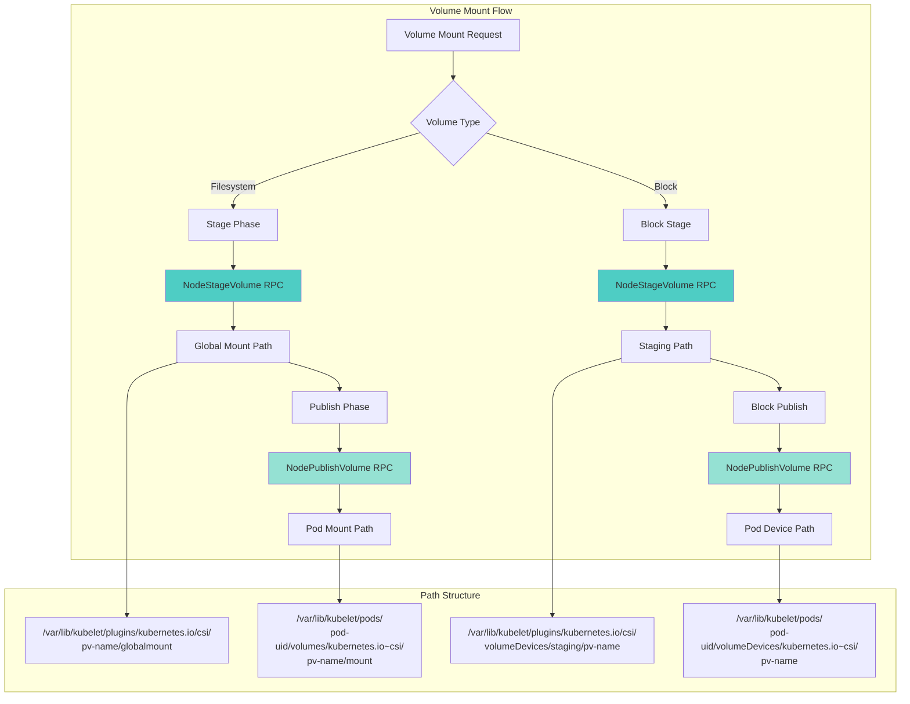

### **csiMountMgr Structure**

**File: /pkg/volume/csi/csi_mounter.go (Lines 63-79)**

```go
type csiMountMgr struct {
	csiClientGetter                    // Interface to get CSI client
	k8s                 kubernetes.Interface
	plugin              *csiPlugin
	driverName          csiDriverName
	volumeLifecycleMode storage.VolumeLifecycleMode  // Persistent or Ephemeral
	volumeID            string                        // CSI volume handle
	specVolumeID        string                        // k8s volume ID from spec
	readOnly            bool
	needSELinuxRelabel  bool
	spec                *volume.Spec
	pod                 *api.Pod
	podUID              types.UID
	publishContext      map[string]string             // Data from attach operation
	kubeVolHost         volume.KubeletVolumeHost
	volume.MetricsProvider
}
```

**Key Fields:**
- `volumeLifecycleMode`: Distinguishes between Persistent (PV/PVC) and Ephemeral (inline CSI volumes)
- `publishContext`: Metadata passed from attach phase to mount phase (e.g., device path, iSCSI target)
- `csiClientGetter`: Lazy initialization of gRPC client to CSI driver

### **Mount Path Structure**

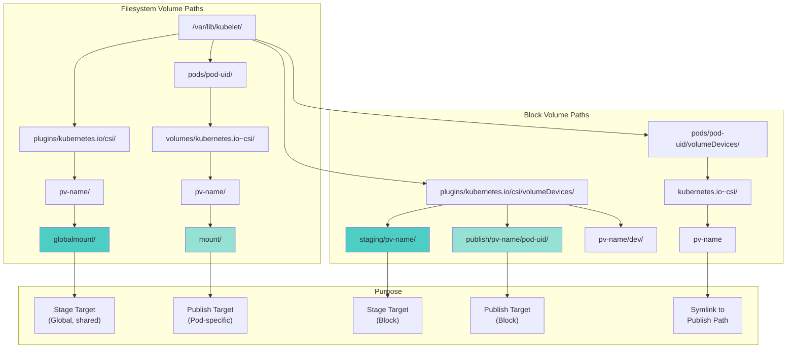

━━━━━━━━━━━━━━━━━━━━━━━━━━━━━━━━━━━━━━━━━━━━━━━━━━━━━━━━━━━━━━━━━━━━━━━━━━━━━━

## **SetUp and SetUpAt Implementation**

### **Entry Point: SetUp**

**File: /pkg/volume/csi/csi_mounter.go (Lines 98-100)**

```go
func (c *csiMountMgr) SetUp(mounterArgs volume.MounterArgs) error {
	return c.SetUpAt(c.GetPath(), mounterArgs)
}
```

**Purpose**: Simple wrapper that calls `SetUpAt` with the default mount path.

### **Core Mount Logic: SetUpAt**

**File: /pkg/volume/csi/csi_mounter.go (Lines 102-400)**

This is the comprehensive mount implementation. Let me break it down into logical sections:

#### **Phase 1: Initialization and Validation**

```go
func (c *csiMountMgr) SetUpAt(dir string, mounterArgs volume.MounterArgs) error {
	klog.V(4).Info(log("Mounter.SetUpAt(%s)", dir))

	// Get CSI client (lazy initialization)
	csi, err := c.csiClientGetter.Get()
	if err != nil {
		// Treat the absence of the CSI driver as a transient error
		// See https://github.com/kubernetes/kubernetes/issues/120268
		return volumetypes.NewTransientOperationFailure(
			log("mounter.SetUpAt failed to get CSI client: %v", err))
	}

	ctx, cancel := createCSIOperationContext(c.spec, csiTimeout)
	defer cancel()

	// Extract volume source (PV or ephemeral)
	volSrc, pvSrc, err := getSourceFromSpec(c.spec)
	if err != nil {
		return errors.New(log("mounter.SetupAt failed to get CSI persistent source: %v", err))
	}
```

**Key Points:**
- **Transient Error Handling**: Driver unavailability is treated as retryable (not permanent failure)
- **Context Management**: CSI operations have configurable timeouts (default 2 minutes)
- **Dual Source Support**: Handles both inline CSI volumes (`volSrc`) and PersistentVolumes (`pvSrc`)

#### **Phase 2: Capability Validation**

```go
	// Check CSIDriver.Spec.Mode to ensure that the CSI driver
	// supports the current volumeLifecycleMode.
	if err := c.supportsVolumeLifecycleMode(); err != nil {
		return volumetypes.NewTransientOperationFailure(
			log("mounter.SetupAt failed to check volume lifecycle mode: %s", err))
	}

	fsGroupPolicy, err := c.getFSGroupPolicy()
	if err != nil {
		return volumetypes.NewTransientOperationFailure(
			log("mounter.SetupAt failed to check fsGroup policy: %s", err))
	}
```

**Validation Checks:**
- `supportsVolumeLifecycleMode()`: Ensures driver supports Persistent or Ephemeral mode
- `getFSGroupPolicy()`: Determines if kubelet should apply fsGroup ownership changes

#### **Phase 3: Variable Extraction**

```go
	driverName := c.driverName
	volumeHandle := c.volumeID
	readOnly := c.readOnly
	accessMode := api.ReadWriteOnce

	var (
		fsType             string
		volAttribs         map[string]string
		nodePublishSecrets map[string]string
		publishContext     map[string]string
		mountOptions       []string
		deviceMountPath    string
		secretRef          *api.SecretReference
	)

	switch {
	case volSrc != nil:  // Ephemeral inline CSI volume
		if c.volumeLifecycleMode != storage.VolumeLifecycleEphemeral {
			return fmt.Errorf("unexpected volume mode: %s", c.volumeLifecycleMode)
		}

		volAttribs = volSrc.VolumeAttributes
		if volSrc.FSType != nil {
			fsType = *volSrc.FSType
		}

		// Retrieve ephemeral secrets
		if volSrc.NodePublishSecretRef != nil {
			secretRef = &api.SecretReference{
				Name:      volSrc.NodePublishSecretRef.Name,
				Namespace: c.pod.Namespace,  // Ephemeral volumes use pod namespace
			}
		}

	case pvSrc != nil:  // Persistent volume
		if c.volumeLifecycleMode != storage.VolumeLifecyclePersistent {
			return fmt.Errorf("unexpected volume mode: %s", c.volumeLifecycleMode)
		}

		volAttribs = pvSrc.VolumeAttributes
		fsType = pvSrc.FSType
		mountOptions = c.spec.PersistentVolume.Spec.MountOptions

		// Get publish context from attach operation
		publishContext, err = c.getPublishContext()
		if err != nil {
			return volumetypes.NewTransientOperationFailure(err.Error())
		}

		// Access mode from PV spec
		if c.spec.PersistentVolume.Spec.AccessModes != nil {
			accessMode = c.spec.PersistentVolume.Spec.AccessModes[0]
		}

		// Secret reference for node publish
		secretRef = pvSrc.NodePublishSecretRef
	}
```

**Critical Distinction:**
- **Ephemeral volumes**: Secrets must be in pod's namespace
- **Persistent volumes**: Secrets can be in any namespace (specified in PV)

#### **Phase 4: Secret Retrieval**

```go
	// Fetch secrets if referenced
	if secretRef != nil {
		nodePublishSecrets, err = getCredentialsFromSecret(c.k8s, secretRef)
		if err != nil {
			return volumetypes.NewTransientOperationFailure(
				fmt.Sprintf("failed to get NodePublishSecretRef %s/%s: %v",
					secretRef.Namespace, secretRef.Name, err))
		}
	}
```

#### **Phase 5: Volume Staging (NodeStageVolume)**

```go
	// Check if driver requires staging
	stageUnstageSet, err := csi.NodeSupportsStageUnstage(ctx)
	if err != nil {
		return errors.New(log("mounter.SetUpAt failed to check for STAGE_UNSTAGE_VOLUME capability: %v", err))
	}

	if stageUnstageSet {
		// Build staging path
		stagingPath := c.getStagingPath()

		klog.V(4).Info(log("Staging volume %s to %s", volumeHandle, stagingPath))

		// Create staging directory
		if err := os.MkdirAll(stagingPath, 0750); err != nil {
			return errors.New(log("mounter.SetUpAt failed to create staging dir: %v", err))
		}

		// Call NodeStageVolume RPC
		publishContext, err = csi.NodeStageVolume(ctx,
			volumeHandle,
			publishContext,
			stagingPath,
			fsType,
			accessMode,
			nodeStageSecrets,
			volAttribs,
			mountOptions,
			fsGroupPolicy)

		if err != nil {
			return err
		}

		// Store staging path for unmount
		deviceMountPath = stagingPath
	}
```

**Staging Purpose:**
- Performs one-time node-level preparation (e.g., iSCSI login, device formatting)
- Multiple pods can use same staged volume (publish references the staging path)
- Not all drivers require staging (capability check prevents unnecessary calls)

#### **Phase 6: Volume Publishing (NodePublishVolume)**

```go
	// Build publish path
	publishPath := c.GetPath()

	klog.V(4).Info(log("Publishing volume %s to %s", volumeHandle, publishPath))

	// Create publish directory
	if err := os.MkdirAll(publishPath, 0750); err != nil {
		return errors.New(log("mounter.SetUpAt failed to create publish dir: %v", err))
	}

	// Call NodePublishVolume RPC
	err = csi.NodePublishVolume(
		ctx,
		volumeHandle,
		readOnly,
		deviceMountPath,  // Staging path (if staged) or empty
		publishPath,       // Target path for this pod
		accessMode,
		publishContext,
		volAttribs,
		nodePublishSecrets,
		fsType,
		mountOptions,
		fsGroupPolicy)

	if err != nil {
		return err
	}

	klog.V(4).Info(log("Successfully mounted volume %s to %s", volumeHandle, publishPath))
	return nil
}
```

**Publishing Details:**
- Creates bind mount from staging path to pod-specific path
- Driver may apply additional mount options (e.g., `ro` for read-only)
- Failure here does not affect other pods using the same volume

### **Complete Mount Sequence**

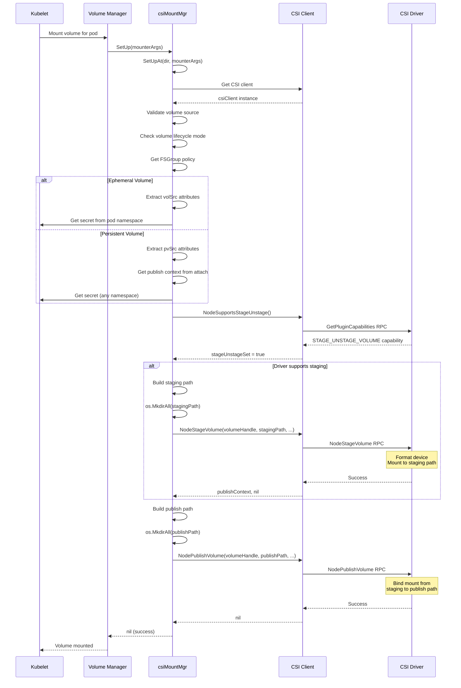

━━━━━━━━━━━━━━━━━━━━━━━━━━━━━━━━━━━━━━━━━━━━━━━━━━━━━━━━━━━━━━━━━━━━━━━━━━━━━━

## **Unmount Operations**

### **TearDown and TearDownAt**

**File: /pkg/volume/csi/csi_mounter.go (Lines 410-550)**

Unmount is the reverse of mount, following a two-phase process:

#### **Phase 1: Unpublish (NodeUnpublishVolume)**

```go
func (c *csiMountMgr) TearDown() error {
	return c.TearDownAt(c.GetPath())
}

func (c *csiMountMgr) TearDownAt(dir string) error {
	klog.V(4).Info(log("Mounter.TearDownAt(%s)", dir))

	volID := c.volumeID
	csi, err := c.csiClientGetter.Get()
	if err != nil {
		return errors.New(log("mounter.TearDownAt failed to get CSI client: %v", err))
	}

	ctx, cancel := createCSIOperationContext(c.spec, csiTimeout)
	defer cancel()

	// Call NodeUnpublishVolume
	if err := csi.NodeUnpublishVolume(ctx, volID, dir); err != nil {
		return errors.New(log("mounter.TearDownAt failed: %v", err))
	}

	// Remove publish directory
	if err := os.RemoveAll(dir); err != nil && !os.IsNotExist(err) {
		return errors.New(log("mounter.TearDownAt failed to remove dir: %v", err))
	}

	klog.V(4).Info(log("Successfully unmounted volume %s from %s", volID, dir))
	return nil
}
```

**Unpublish Purpose:**
- Removes pod-specific mount
- Other pods can still use the volume (if they have their own publish mounts)
- Failure to remove directory is not fatal (best-effort cleanup)

#### **Phase 2: Unstage (NodeUnstageVolume)**

Unstaging is handled separately by the attach/detach controller when the last pod using the volume is deleted.

**File: /pkg/volume/csi/csi_attacher.go (Lines 280-350)**

```go
func (c *csiAttacher) UnmountDevice(deviceMountPath string) error {
	klog.V(4).Info(log("attacher.UnmountDevice(%s)", deviceMountPath))

	csi := c.csiClient
	ctx, cancel := context.WithTimeout(context.Background(), csiTimeout)
	defer cancel()

	// Get volume handle from device mount path
	volID, err := getVolumeIDFromTargetPath(deviceMountPath)
	if err != nil {
		return err
	}

	// Call NodeUnstageVolume
	if err := csi.NodeUnstageVolume(ctx, volID, deviceMountPath); err != nil {
		return err
	}

	// Remove staging directory
	return os.RemoveAll(deviceMountPath)
}
```

### **Unmount Sequence**

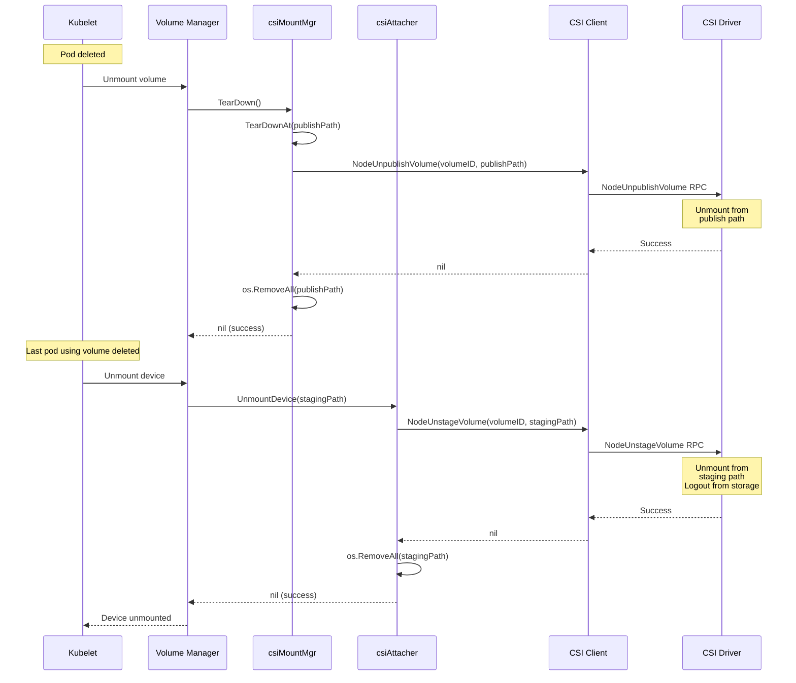

━━━━━━━━━━━━━━━━━━━━━━━━━━━━━━━━━━━━━━━━━━━━━━━━━━━━━━━━━━━━━━━━━━━━━━━━━━━━━━

## **Attach Operations**

### **VolumeAttachment Resource**

Attach operations in CSI are decoupled from the kubelet and managed by the Attach/Detach Controller. The process revolves around the `VolumeAttachment` API resource.

**VolumeAttachment Structure:**
```yaml
apiVersion: storage.k8s.io/v1
kind: VolumeAttachment
metadata:
  name: csi-<hash>  # Computed from volume handle + driver + node
spec:
  attacher: csi-driver-name
  nodeName: node-1
  source:
    persistentVolumeName: pvc-123  # For PVs
    # OR
    inlineVolumeSpec: {...}        # For ephemeral volumes
status:
  attached: true
  attachmentMetadata:
    devicePath: /dev/disk/by-id/scsi-...
    # Driver-specific metadata
  attachError:
    message: ""
    time: ""
  detachError:
    message: ""
    time: ""
```

### **csiAttacher Structure**

**File: /pkg/volume/csi/csi_attacher.go (Lines 48-54)**

```go
type csiAttacher struct {
	plugin       *csiPlugin
	k8s          kubernetes.Interface
	watchTimeout time.Duration

	csiClient csiClient
}
```

**Interface Implementations:**
```go
var _ volume.Attacher = &csiAttacher{}
var _ volume.Detacher = &csiAttacher{}
var _ volume.DeviceMounter = &csiAttacher{}
```

### **Attach Implementation**

**File: /pkg/volume/csi/csi_attacher.go (Lines 63-139)**

```go
func (c *csiAttacher) Attach(spec *volume.Spec, nodeName types.NodeName) (string, error) {
	// Verify not called from kubelet
	_, ok := c.plugin.host.(volume.KubeletVolumeHost)
	if ok {
		return "", errors.New("attaching volumes from the kubelet is not supported")
	}

	if spec == nil {
		klog.Error(log("attacher.Attach missing volume.Spec"))
		return "", errors.New("missing spec")
	}

	pvSrc, err := getPVSourceFromSpec(spec)
	if err != nil {
		return "", errors.New(log("attacher.Attach failed to get CSIPersistentVolumeSource: %v", err))
	}

	node := string(nodeName)
	attachID := getAttachmentName(pvSrc.VolumeHandle, pvSrc.Driver, node)

	// Check if VolumeAttachment already exists
	attachment, err := c.plugin.volumeAttachmentLister.Get(attachID)
	if err != nil && !apierrors.IsNotFound(err) {
		return "", errors.New(log("failed to get volume attachment from lister: %v", err))
	}

	if attachment == nil {
		// Create new VolumeAttachment
		var vaSrc storage.VolumeAttachmentSource
		if spec.InlineVolumeSpecForCSIMigration {
			// inline PV scenario - use PV spec to populate VA source
			vaSrc = storage.VolumeAttachmentSource{
				InlineVolumeSpec: &spec.PersistentVolume.Spec,
			}
		} else {
			// regular PV scenario - use PV name to populate VA source
			pvName := spec.PersistentVolume.GetName()
			vaSrc = storage.VolumeAttachmentSource{
				PersistentVolumeName: &pvName,
			}
		}

		attachment := &storage.VolumeAttachment{
			ObjectMeta: metav1.ObjectMeta{
				Name: attachID,
			},
			Spec: storage.VolumeAttachmentSpec{
				NodeName: node,
				Attacher: pvSrc.Driver,
				Source:   vaSrc,
			},
		}

		_, err = c.k8s.StorageV1().VolumeAttachments().Create(context.TODO(), attachment, metav1.CreateOptions{})
		if err != nil {
			if !apierrors.IsAlreadyExists(err) {
				return "", errors.New(log("attacher.Attach failed: %v", err))
			}
			klog.V(4).Info(log("attachment [%v] for volume [%v] already exists", attachID, pvSrc.VolumeHandle))
		} else {
			klog.V(4).Info(log("attachment [%v] for volume [%v] created successfully", attachID, pvSrc.VolumeHandle))
		}
	}

	// Wait for attachment to complete (external-attacher processes it)
	if err := c.waitForVolumeAttachmentWithLister(spec, pvSrc.VolumeHandle, attachID, c.watchTimeout); err != nil {
		return "", err
	}

	klog.V(4).Info(log("attacher.Attach finished OK with VolumeAttachment object [%s]", attachID))

	// Don't return attachID as a devicePath. We can reconstruct it using getAttachmentName()
	return "", nil
}
```

**Key Aspects:**
1. **Controller-Only Operation**: Explicitly rejects calls from kubelet
2. **Idempotent Creation**: Ignores AlreadyExists errors
3. **VolumeAttachment Name**: Deterministic hash of (volumeHandle + driver + node)
4. **Asynchronous Processing**: external-attacher sidecar watches and processes VolumeAttachment
5. **Wait for Completion**: Polls VolumeAttachment status until `attached: true`

### **Attachment Name Generation**

**File: /pkg/volume/csi/csi_attacher.go (Lines 600-620)**

```go
func getAttachmentName(volumeHandle, driverName, nodeName string) string {
	// Compute SHA256 hash to create unique, deterministic name
	h := sha256.New()
	h.Write([]byte(volumeHandle))
	h.Write([]byte(driverName))
	h.Write([]byte(nodeName))
	hash := hex.EncodeToString(h.Sum(nil))

	// VolumeAttachment name format: csi-<first 60 chars of hash>
	const maxNameLen = 63
	const prefixLen = 4  // len("csi-")
	hashLen := maxNameLen - prefixLen

	return "csi-" + hash[:hashLen]
}
```

### **WaitForAttach Implementation**

**File: /pkg/volume/csi/csi_attacher.go (Lines 146-200)**

```go
func (c *csiAttacher) WaitForAttach(spec *volume.Spec, _ string, pod *v1.Pod, _ time.Duration) (string, error) {
	source, err := getPVSourceFromSpec(spec)
	if err != nil {
		return "", errors.New(log("attacher.WaitForAttach failed to extract CSI volume source: %v", err))
	}

	attachID := getAttachmentName(source.VolumeHandle, source.Driver, string(c.plugin.host.GetNodeName()))

	// Get VolumeAttachment
	attachment, err := c.k8s.StorageV1().VolumeAttachments().Get(context.TODO(), attachID, metav1.GetOptions{})
	if err != nil {
		if apierrors.IsNotFound(err) {
			return "", errors.New(log("VolumeAttachment [%s] not found", attachID))
		}
		return "", err
	}

	// Check if attached
	if !attachment.Status.Attached {
		return "", errors.New(log("volume [%s] has not been attached yet", source.VolumeHandle))
	}

	// Return attachment metadata as JSON-encoded string
	metadata, err := json.Marshal(attachment.Status.AttachmentMetadata)
	if err != nil {
		return "", err
	}

	klog.V(4).Info(log("attacher.WaitForAttach succeeded: %s", attachID))
	return string(metadata), nil
}
```

**Purpose of WaitForAttach:**
- Called by kubelet before mounting
- Ensures volume is attached before attempting NodeStageVolume/NodePublishVolume
- Returns attachment metadata (e.g., device path) needed for mount operations

### **Attach Sequence Diagram**

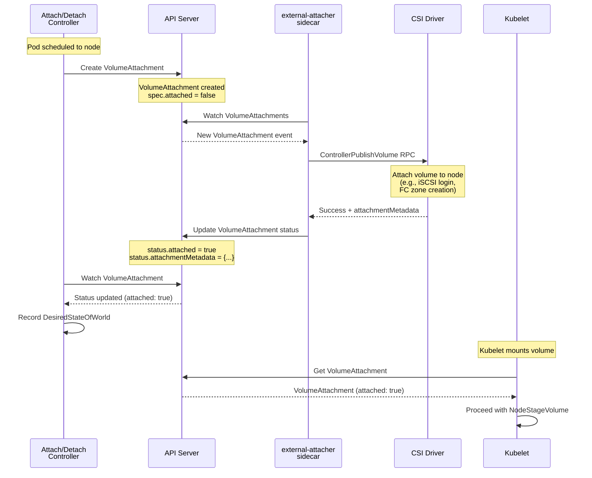

### **Detach Implementation**

**File: /pkg/volume/csi/csi_attacher.go (Lines 250-280)**

```go
func (c *csiAttacher) Detach(volumeName string, nodeName types.NodeName) error {
	_, ok := c.plugin.host.(volume.KubeletVolumeHost)
	if ok {
		return errors.New("detaching volumes from the kubelet is not supported")
	}

	if volumeName == "" {
		return errors.New("detach failed: volumeName is empty")
	}

	// Parse CSI volume handle from volume name
	volID := getPVNameFromSpecVolID(volumeName)

	spec, err := c.plugin.getVolumeSpec(volID)
	if err != nil {
		return err
	}

	pvSrc, err := getPVSourceFromSpec(spec)
	if err != nil {
		return err
	}

	attachID := getAttachmentName(pvSrc.VolumeHandle, pvSrc.Driver, string(nodeName))

	// Delete VolumeAttachment
	if err := c.k8s.StorageV1().VolumeAttachments().Delete(
		context.TODO(), attachID, metav1.DeleteOptions{}); err != nil {
		if apierrors.IsNotFound(err) {
			klog.V(4).Info(log("VolumeAttachment [%s] already deleted", attachID))
			return nil
		}
		return errors.New(log("detach failed to delete VolumeAttachment: %v", err))
	}

	klog.V(4).Info(log("detacher.Detach successfully deleted VolumeAttachment %s", attachID))
	return nil
}
```

**Detach Process:**
1. Delete VolumeAttachment resource
2. external-attacher watches deletion
3. external-attacher calls ControllerUnpublishVolume RPC
4. CSI driver detaches volume from node
5. external-attacher removes finalizer, allowing deletion to complete

━━━━━━━━━━━━━━━━━━━━━━━━━━━━━━━━━━━━━━━━━━━━━━━━━━━━━━━━━━━━━━━━━━━━━━━━━━━━━━

## **Block Volume Operations**

### **Block Volume Architecture**

Block volumes provide raw block device access without a filesystem, useful for databases and applications that manage their own storage layout.

**File: /pkg/volume/csi/csi_block.go (Lines 17-64)**

The file header provides excellent documentation of the block volume flow:

```go
/*
Summary of block volume related CSI driver's methods:
 - GetGlobalMapPath returns a global map path
 - GetPodDeviceMapPath returns a pod device map path and filename
 - SetUpDevice calls CSI's NodeStageVolume and stage a volume to its staging path
 - MapPodDevice calls CSI's NodePublishVolume and publish a volume to its publish path
 - UnmapPodDevice calls CSI's NodeUnpublishVolume and unpublish a volume
 - TearDownDevice calls CSI's NodeUnstageVolume and unstage a volume

After successful MountVolume for block volume, directory structure:
  /dev/loopX                                      ... Descriptor lock (loopback device to mapFile)
  /var/lib/kubelet/plugins/kubernetes.io/csi/
    volumeDevices/{specName}/dev/                 ... Global map path
    volumeDevices/{specName}/dev/{podUID}         ... MapFile (bind mount to publish path)
    volumeDevices/staging/{specName}              ... Staging path
    volumeDevices/publish/{specName}/{podUID}     ... Publish path
  /var/lib/kubelet/pods/{podUID}/volumeDevices/
    kubernetes.io~csi/{specName}                  ... MapFile (symlink to publish path)
*/
```

### **csiBlockMapper Structure**

**File: /pkg/volume/csi/csi_block.go (Lines 86-98)**

```go
type csiBlockMapper struct {
	csiClientGetter
	k8s        kubernetes.Interface
	plugin     *csiPlugin
	driverName csiDriverName
	specName   string          // Volume name from spec
	volumeID   string          // CSI volume handle
	readOnly   bool
	spec       *volume.Spec
	pod        *v1.Pod
	podUID     types.UID
	volume.MetricsProvider
}

var _ volume.BlockVolumeMapper = &csiBlockMapper{}
var _ volume.CustomBlockVolumeMapper = &csiBlockMapper{}
```

### **Block Volume Paths**

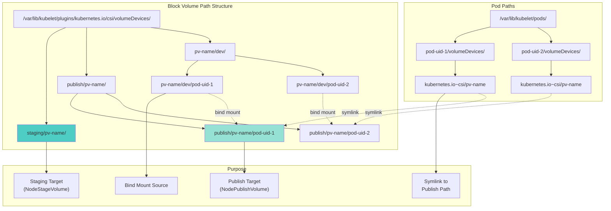

### **GetGlobalMapPath**

**File: /pkg/volume/csi/csi_block.go (Lines 105-109)**

```go
func (m *csiBlockMapper) GetGlobalMapPath(spec *volume.Spec) (string, error) {
	dir := getVolumeDevicePluginDir(m.specName, m.plugin.host)
	klog.V(4).Info(log("blockMapper.GetGlobalMapPath = %s", dir))
	return dir, nil
}
```

Returns: `/var/lib/kubelet/plugins/kubernetes.io/csi/volumeDevices/{specName}/dev`

### **GetStagingPath**

**File: /pkg/volume/csi/csi_block.go (Lines 113-115)**

```go
func (m *csiBlockMapper) GetStagingPath() string {
	return filepath.Join(m.plugin.host.GetVolumeDevicePluginDir(CSIPluginName), "staging", m.specName)
}
```

Returns: `/var/lib/kubelet/plugins/kubernetes.io/csi/volumeDevices/staging/{specName}`

### **GetPublishPath**

**File: /pkg/volume/csi/csi_block.go (Lines 125-133)**

```go
func (m *csiBlockMapper) getPublishDir() string {
	return filepath.Join(m.plugin.host.GetVolumeDevicePluginDir(CSIPluginName), "publish", m.specName)
}

func (m *csiBlockMapper) getPublishPath() string {
	return filepath.Join(m.getPublishDir(), string(m.podUID))
}
```

Returns: `/var/lib/kubelet/plugins/kubernetes.io/csi/volumeDevices/publish/{specName}/{podUID}`

### **GetPodDeviceMapPath**

**File: /pkg/volume/csi/csi_block.go (Lines 137-141)**

```go
func (m *csiBlockMapper) GetPodDeviceMapPath() (string, string) {
	path := m.plugin.host.GetPodVolumeDeviceDir(m.podUID, utilstrings.EscapeQualifiedName(CSIPluginName))
	klog.V(4).Info(log("blockMapper.GetPodDeviceMapPath [path=%s; name=%s]", path, m.specName))
	return path, m.specName
}
```

Returns:
- Path: `/var/lib/kubelet/pods/{podUID}/volumeDevices/kubernetes.io~csi`
- Name: `{specName}`

### **SetUpDevice (Block Staging)**

**File: /pkg/volume/csi/csi_block.go (Lines 200-350)**

```go
func (m *csiBlockMapper) SetUpDevice() (string, error) {
	klog.V(4).Info(log("blockMapper.SetUpDevice for volume %s", m.volumeID))

	if !m.plugin.blockEnabled {
		return "", errors.New("CSI block volume support is disabled")
	}

	csi, err := m.csiClientGetter.Get()
	if err != nil {
		return "", volumetypes.NewTransientOperationFailure(
			log("blockMapper.SetUpDevice failed to get CSI client: %v", err))
	}

	ctx, cancel := createCSIOperationContext(m.spec, csiTimeout)
	defer cancel()

	// Get PV source
	csiSource, err := getCSISourceFromSpec(m.spec)
	if err != nil {
		return "", errors.New(log("blockMapper.SetUpDevice failed to get CSI source: %v", err))
	}

	// Get VolumeAttachment for publish context
	var attachment *storage.VolumeAttachment
	if requiresAttach(csiSource) {
		attachID := getAttachmentName(csiSource.VolumeHandle, csiSource.Driver, string(m.plugin.host.GetNodeName()))
		attachment, err = m.k8s.StorageV1().VolumeAttachments().Get(ctx, attachID, metav1.GetOptions{})
		if err != nil {
			return "", errors.New(log("blockMapper.SetUpDevice failed to get VolumeAttachment: %v", err))
		}
	}

	// Determine access mode
	accessMode := api.ReadWriteOnce
	if m.spec.PersistentVolume.Spec.AccessModes != nil {
		accessMode = m.spec.PersistentVolume.Spec.AccessModes[0]
	}

	// Check if staging is required
	stageUnstageSet, err := csi.NodeSupportsStageUnstage(ctx)
	if err != nil {
		return "", errors.New(log("blockMapper.SetUpDevice failed to check STAGE_UNSTAGE capability: %v", err))
	}

	stagingPath := m.GetStagingPath()
	if stageUnstageSet {
		klog.V(4).Info(log("blockMapper.SetUpDevice staging volume %s", m.volumeID))

		// Create staging directory
		if err := os.MkdirAll(stagingPath, 0750); err != nil {
			return "", errors.New(log("blockMapper.SetUpDevice failed to create staging dir: %v", err))
		}

		// Call NodeStageVolume for block
		_, err = m.stageVolumeForBlock(ctx, csi, accessMode, csiSource, attachment)
		if err != nil {
			return "", err
		}
	}

	klog.V(4).Info(log("blockMapper.SetUpDevice succeeded for volume %s", m.volumeID))
	return stagingPath, nil
}
```

### **stageVolumeForBlock**

**File: /pkg/volume/csi/csi_block.go (Lines 144-220)**

```go
func (m *csiBlockMapper) stageVolumeForBlock(
	ctx context.Context,
	csi csiClient,
	accessMode v1.PersistentVolumeAccessMode,
	csiSource *v1.CSIPersistentVolumeSource,
	attachment *storage.VolumeAttachment,
) (string, error) {

	// Get node stage secret
	nodeStageSecrets := map[string]string{}
	if csiSource.NodeStageSecretRef != nil {
		nodeStageSecrets, err = getCredentialsFromSecret(m.k8s, csiSource.NodeStageSecretRef)
		if err != nil {
			return "", errors.New(log("blockMapper.stageVolumeForBlock failed to get NodeStageSecretRef: %v", err))
		}
	}

	// Get publish context from attachment
	publishContext := map[string]string{}
	if attachment != nil {
		publishContext = attachment.Status.AttachmentMetadata
	}

	// Call NodeStageVolume with Block VolumeCapability
	stagingPath := m.GetStagingPath()

	err := csi.NodeStageVolume(
		ctx,
		csiSource.VolumeHandle,
		publishContext,
		stagingPath,
		fsTypeBlockName,  // Special marker for block volumes
		accessMode,
		nodeStageSecrets,
		csiSource.VolumeAttributes,
		nil,  // No mount options for block
		"",   // No FSGroup for block
	)

	if err != nil {
		return "", errors.New(log("blockMapper.stageVolumeForBlock failed: %v", err))
	}

	return stagingPath, nil
}
```

**Block-Specific Details:**
- `fsType` set to special constant `fsTypeBlockName` (typically "block")
- No mount options (block devices aren't mounted)
- No FSGroup (ownership not applicable to raw devices)

### **MapPodDevice (Block Publishing)**

**File: /pkg/volume/csi/csi_block.go (Lines 360-450)**

```go
func (m *csiBlockMapper) MapPodDevice() (string, error) {
	klog.V(4).Info(log("blockMapper.MapPodDevice for volume %s", m.volumeID))

	if !m.plugin.blockEnabled {
		return "", errors.New("CSI block volume support is disabled")
	}

	csi, err := m.csiClientGetter.Get()
	if err != nil {
		return "", volumetypes.NewTransientOperationFailure(
			log("blockMapper.MapPodDevice failed to get CSI client: %v", err))
	}

	ctx, cancel := createCSIOperationContext(m.spec, csiTimeout)
	defer cancel()

	csiSource, err := getCSISourceFromSpec(m.spec)
	if err != nil {
		return "", errors.New(log("blockMapper.MapPodDevice failed to get CSI source: %v", err))
	}

	// Get publish context
	publishContext := map[string]string{}
	if requiresAttach(csiSource) {
		attachID := getAttachmentName(csiSource.VolumeHandle, csiSource.Driver, string(m.plugin.host.GetNodeName()))
		attachment, err := m.k8s.StorageV1().VolumeAttachments().Get(ctx, attachID, metav1.GetOptions{})
		if err != nil {
			return "", errors.New(log("blockMapper.MapPodDevice failed to get VolumeAttachment: %v", err))
		}
		publishContext = attachment.Status.AttachmentMetadata
	}

	// Get node publish secret
	nodePublishSecrets := map[string]string{}
	if csiSource.NodePublishSecretRef != nil {
		nodePublishSecrets, err = getCredentialsFromSecret(m.k8s, csiSource.NodePublishSecretRef)
		if err != nil {
			return "", errors.New(log("blockMapper.MapPodDevice failed to get NodePublishSecretRef: %v", err))
		}
	}

	// Determine paths
	publishPath := m.getPublishPath()
	stagingPath := m.GetStagingPath()

	// Create publish directory
	if err := os.MkdirAll(publishPath, 0750); err != nil {
		return "", errors.New(log("blockMapper.MapPodDevice failed to create publish dir: %v", err))
	}

	// Determine access mode
	accessMode := api.ReadWriteOnce
	if m.spec.PersistentVolume.Spec.AccessModes != nil {
		accessMode = m.spec.PersistentVolume.Spec.AccessModes[0]
	}

	// Call NodePublishVolume for block
	klog.V(4).Info(log("blockMapper.MapPodDevice publishing volume %s to %s", m.volumeID, publishPath))

	err = csi.NodePublishVolume(
		ctx,
		csiSource.VolumeHandle,
		m.readOnly,
		stagingPath,
		publishPath,
		accessMode,
		publishContext,
		csiSource.VolumeAttributes,
		nodePublishSecrets,
		fsTypeBlockName,  // Block marker
		nil,  // No mount options
		"",   // No FSGroup
	)

	if err != nil {
		os.RemoveAll(publishPath)
		return "", errors.New(log("blockMapper.MapPodDevice failed: %v", err))
	}

	klog.V(4).Info(log("blockMapper.MapPodDevice succeeded for volume %s", m.volumeID))
	return publishPath, nil
}
```

### **Block Volume Sequence**

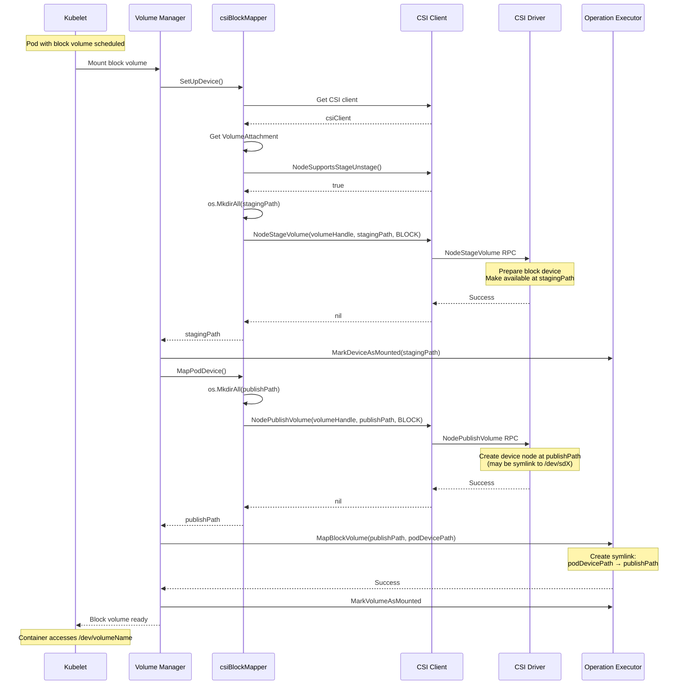

━━━━━━━━━━━━━━━━━━━━━━━━━━━━━━━━━━━━━━━━━━━━━━━━━━━━━━━━━━━━━━━━━━━━━━━━━━━━━━

## **Volume Expansion Operations**

### **Expansion Architecture**

CSI supports online (while volume is in use) and offline (volume must be unmounted) expansion through the `NodeExpandVolume` RPC.

**Expansion Trigger:**
1. User increases PVC size
2. PV controller updates PV capacity
3. Kubelet detects capacity mismatch
4. Kubelet calls `NodeExpand()` on CSI plugin

### **NodeExpandableVolumePlugin Interface**

**File: /pkg/volume/csi/expander.go (Lines 32-36)**

```go
var _ volume.NodeExpandableVolumePlugin = &csiPlugin{}

func (c *csiPlugin) RequiresFSResize() bool {
	return true
}
```

**`RequiresFSResize() = true`** means:
- Kubelet must call NodeExpand even if volume is not mounted
- Filesystem resize is handled by CSI driver, not kubelet

### **NodeExpand Implementation**

**File: /pkg/volume/csi/expander.go (Lines 38-57)**

```go
func (c *csiPlugin) NodeExpand(resizeOptions volume.NodeResizeOptions) (bool, error) {
	klog.V(4).Info(log("Expander.NodeExpand(%s)", resizeOptions.DeviceMountPath))

	csiSource, err := getCSISourceFromSpec(resizeOptions.VolumeSpec)
	if err != nil {
		return false, errors.New(log("Expander.NodeExpand failed to get CSI persistent source: %v", err))
	}

	csClient, err := newCsiDriverClient(csiDriverName(csiSource.Driver))
	if err != nil {
		// Treat the absence of the CSI driver as a transient error
		return false, volumetypes.NewTransientOperationFailure(err.Error())
	}

	fsVolume, err := util.CheckVolumeModeFilesystem(resizeOptions.VolumeSpec)
	if err != nil {
		return false, errors.New(log("Expander.NodeExpand failed to check VolumeMode: %v", err))
	}

	return c.nodeExpandWithClient(resizeOptions, csiSource, csClient, fsVolume)
}
```

**ResizeOptions Structure:**
```go
type NodeResizeOptions struct {
	VolumeSpec        *Spec
	NewSize           resource.Quantity  // Target size
	OldSize           resource.Quantity  // Current size
	DevicePath        string              // For block volumes
	DeviceMountPath   string              // For filesystem volumes (staging path)
	DeviceStagePath   string              // Staging path
	CSIVolumePhase    CSIVolumePhase     // Staged, Published, etc.
}
```

### **nodeExpandWithClient**

**File: /pkg/volume/csi/expander.go (Lines 59-130)**

```go
func (c *csiPlugin) nodeExpandWithClient(
	resizeOptions volume.NodeResizeOptions,
	csiSource *api.CSIPersistentVolumeSource,
	csClient csiClient,
	fsVolume bool) (bool, error) {

	driverName := csiSource.Driver

	ctx, cancel := createCSIOperationContext(resizeOptions.VolumeSpec, csiTimeout)
	defer cancel()

	// Check if driver supports NodeExpand
	nodeExpandSet, err := csClient.NodeSupportsNodeExpand(ctx)
	if err != nil {
		return false, fmt.Errorf("Expander.NodeExpand failed to check if node supports expansion: %v", err)
	}

	if !nodeExpandSet {
		return false, volumetypes.NewOperationNotSupportedError(
			fmt.Sprintf("NodeExpand is not supported by CSI driver %s", driverName))
	}

	pv := resizeOptions.VolumeSpec.PersistentVolume
	if pv == nil {
		return false, fmt.Errorf("Expander.NodeExpand failed to find PersistentVolume")
	}

	// Get node expand secret
	nodeExpandSecrets := map[string]string{}
	expandClient := c.host.GetKubeClient()

	if csiSource.NodeExpandSecretRef != nil {
		nodeExpandSecrets, err = getCredentialsFromSecret(expandClient, csiSource.NodeExpandSecretRef)
		if err != nil {
			return false, fmt.Errorf("expander.NodeExpand failed to get NodeExpandSecretRef %s/%s: %v",
				csiSource.NodeExpandSecretRef.Namespace, csiSource.NodeExpandSecretRef.Name, err)
		}
	}

	// Build resize options
	opts := csiResizeOptions{
		volumePath:        resizeOptions.DeviceMountPath,  // Staging path for FS volumes
		stagingTargetPath: resizeOptions.DeviceStagePath,
		volumeID:          csiSource.VolumeHandle,
		newSize:           resizeOptions.NewSize,
		fsType:            csiSource.FSType,
		accessMode:        api.ReadWriteOnce,
		mountOptions:      pv.Spec.MountOptions,
		secrets:           nodeExpandSecrets,
	}

	if !fsVolume {
		// For block volumes, volumePath is the device path
		opts.volumePath = resizeOptions.DevicePath
		opts.fsType = fsTypeBlockName
	}

	if pv.Spec.AccessModes != nil {
		opts.accessMode = pv.Spec.AccessModes[0]
	}

	// Call NodeExpandVolume
	_, err = csClient.NodeExpandVolume(ctx, opts)
	if err != nil {
		if inUseError(err) {
			// Driver doesn't support online expansion
			failedConditionErr := fmt.Errorf("Expander.NodeExpand failed to expand the volume: %w",
				volumetypes.NewFailedPreconditionError(err.Error()))
			return false, failedConditionErr
		}

		if isInfeasibleError(err) {
			infeasibleError := volumetypes.NewInfeasibleError(
				fmt.Sprintf("Expander.NodeExpand failed to expand the volume %s", err.Error()))
			return false, infeasibleError
		}

		return false, fmt.Errorf("Expander.NodeExpand failed to expand the volume: %w", err)
	}

	return true, nil
}
```

### **Error Classification**

**File: /pkg/volume/csi/expander.go (Lines 132-164)**

```go
func inUseError(err error) bool {
	st, ok := status.FromError(err)
	if !ok {
		return false
	}
	// FailedPrecondition means driver doesn't support online expansion
	// Volume must be unmounted before expanding
	return st.Code() == codes.FailedPrecondition
}

func isInfeasibleError(err error) bool {
	st, ok := status.FromError(err)
	if !ok {
		return false
	}
	switch st.Code() {
	case codes.InvalidArgument,  // Invalid resize parameters
		codes.OutOfRange,         // Size out of supported range
		codes.NotFound:           // Volume not found
		return true
	}
	return false
}
```

**Error Types:**
- **Transient Errors**: Retryable (e.g., driver temporarily unavailable)
- **FailedPrecondition**: Volume in use, offline expansion required
- **Infeasible Errors**: Permanent failures (invalid request, volume not found)

### **Expansion Sequence**

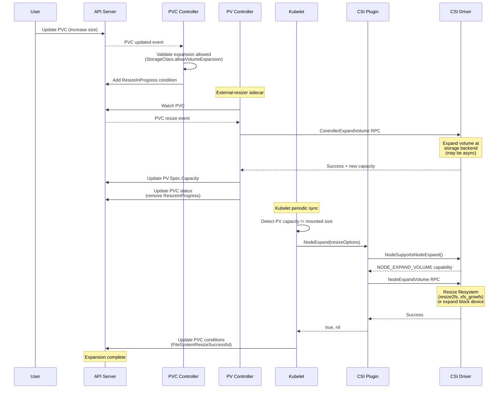

### **Filesystem vs Block Expansion**

| Aspect | Filesystem Volume | Block Volume |
|--------|------------------|--------------|
| **volumePath** | DeviceMountPath (staging path) | DevicePath (raw device) |
| **fsType** | Actual FS (ext4, xfs, etc.) | "block" |
| **Driver Action** | Mount → resize2fs/xfs_growfs → remount | Resize block device directly |
| **Online Support** | Depends on FS and driver | Usually supported |
| **mountOptions** | From PV spec | nil (not applicable) |

━━━━━━━━━━━━━━━━━━━━━━━━━━━━━━━━━━━━━━━━━━━━━━━━━━━━━━━━━━━━━━━━━━━━━━━━━━━━━━

## **Volume Capabilities**

### **VolumeCapability Structure**

Volume capabilities describe how a volume should be used (access mode, volume mode, mount flags).

```go
type VolumeCapability struct {
	// Access mode
	AccessMode *VolumeCapability_AccessMode

	// Volume type
	// One of:
	AccessType isVolumeCapability_AccessType
	// - *VolumeCapability_Mount (filesystem)
	// - *VolumeCapability_Block (raw block)
}

type VolumeCapability_AccessMode struct {
	Mode VolumeCapability_AccessMode_Mode
}

const (
	VolumeCapability_AccessMode_UNKNOWN           = 0
	VolumeCapability_AccessMode_SINGLE_NODE_WRITER    = 1  // ReadWriteOnce
	VolumeCapability_AccessMode_SINGLE_NODE_READER_ONLY = 2  // ReadOnlyMany (single node)
	VolumeCapability_AccessMode_MULTI_NODE_READER_ONLY  = 3  // ReadOnlyMany
	VolumeCapability_AccessMode_MULTI_NODE_SINGLE_WRITER = 4  // ReadWriteMany (one writer)
	VolumeCapability_AccessMode_MULTI_NODE_MULTI_WRITER  = 5  // ReadWriteMany
	VolumeCapability_AccessMode_SINGLE_NODE_SINGLE_WRITER = 6  // ReadWriteOncePod
	VolumeCapability_AccessMode_SINGLE_NODE_MULTI_WRITER  = 7  // Future use
)
```

### **Building VolumeCapability**

**File: /pkg/volume/csi/csi_client.go (Lines 500-580)**

```go
func buildVolumeCapability(
	accessMode api.PersistentVolumeAccessMode,
	fsType string,
	mountOptions []string,
) *csipbv1.VolumeCapability {

	// Build access mode
	var mode csipbv1.VolumeCapability_AccessMode_Mode
	switch accessMode {
	case api.ReadWriteOnce:
		mode = csipbv1.VolumeCapability_AccessMode_SINGLE_NODE_WRITER
	case api.ReadOnlyMany:
		mode = csipbv1.VolumeCapability_AccessMode_MULTI_NODE_READER_ONLY
	case api.ReadWriteMany:
		mode = csipbv1.VolumeCapability_AccessMode_MULTI_NODE_MULTI_WRITER
	case api.ReadWriteOncePod:
		mode = csipbv1.VolumeCapability_AccessMode_SINGLE_NODE_SINGLE_WRITER
	default:
		mode = csipbv1.VolumeCapability_AccessMode_UNKNOWN
	}

	capability := &csipbv1.VolumeCapability{
		AccessMode: &csipbv1.VolumeCapability_AccessMode{
			Mode: mode,
		},
	}

	// Set access type (mount vs block)
	if fsType == fsTypeBlockName {
		// Block volume
		capability.AccessType = &csipbv1.VolumeCapability_Block{
			Block: &csipbv1.VolumeCapability_BlockVolume{},
		}
	} else {
		// Mount volume
		capability.AccessType = &csipbv1.VolumeCapability_Mount{
			Mount: &csipbv1.VolumeCapability_MountVolume{
				FsType:     fsType,
				MountFlags: mountOptions,
			},
		}
	}

	return capability
}
```

### **Capability Usage in RPCs**

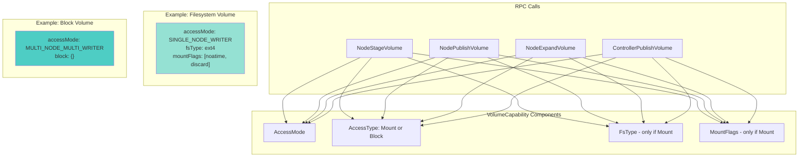

━━━━━━━━━━━━━━━━━━━━━━━━━━━━━━━━━━━━━━━━━━━━━━━━━━━━━━━━━━━━━━━━━━━━━━━━━━━━━━

## **Secrets Management**

### **Secret Types**

CSI defines multiple secret types for different operation phases:

| Secret Type | Used In | Purpose | Namespace |
|-------------|---------|---------|-----------|
| **ProvisionerSecretRef** | CreateVolume | Credentials for provisioning | From StorageClass |
| **ControllerPublishSecretRef** | ControllerPublishVolume | Attach credentials | From PV |
| **NodeStageSecretRef** | NodeStageVolume | Stage credentials | From PV |
| **NodePublishSecretRef** | NodePublishVolume | Mount credentials | From PV (or pod NS for ephemeral) |
| **ControllerExpandSecretRef** | ControllerExpandVolume | Expansion credentials | From PV |
| **NodeExpandSecretRef** | NodeExpandVolume | Node-level expansion creds | From PV |

### **Secret Retrieval**

**File: /pkg/volume/csi/csi_util.go (Lines 150-200)**

```go
func getCredentialsFromSecret(
	k8s kubernetes.Interface,
	secretRef *api.SecretReference) (map[string]string, error) {

	if secretRef == nil {
		return nil, nil
	}

	namespace := secretRef.Namespace
	name := secretRef.Name

	if namespace == "" || name == "" {
		return nil, fmt.Errorf("secret reference is missing namespace or name")
	}

	secret, err := k8s.CoreV1().Secrets(namespace).Get(
		context.TODO(), name, metav1.GetOptions{})
	if err != nil {
		return nil, fmt.Errorf("failed to get secret %s/%s: %v", namespace, name, err)
	}

	// Convert secret data to string map
	credentials := make(map[string]string)
	for key, value := range secret.Data {
		credentials[key] = string(value)
	}

	return credentials, nil
}
```

### **Ephemeral Volume Secret Handling**

**Critical Security Consideration:**

Ephemeral inline CSI volumes can only use secrets from the pod's namespace. This prevents privilege escalation where a user could reference secrets from other namespaces.

**File: /pkg/volume/csi/csi_mounter.go (Lines 160-175)**

```go
switch {
case volSrc != nil:  // Ephemeral volume
	if volSrc.NodePublishSecretRef != nil {
		secretRef = &api.SecretReference{
			Name:      volSrc.NodePublishSecretRef.Name,
			Namespace: c.pod.Namespace,  // MUST be pod's namespace
		}
	}

case pvSrc != nil:  // Persistent volume
	secretRef = pvSrc.NodePublishSecretRef  // Can be any namespace
}
```

### **Secret Passing in gRPC**

**NodeStageVolume Example:**

```go
func (c *csiDriverClient) NodeStageVolume(
	ctx context.Context,
	volumeHandle string,
	publishContext map[string]string,
	stagingTargetPath string,
	fsType string,
	accessMode api.PersistentVolumeAccessMode,
	secrets map[string]string,  // ← NodeStageSecretRef
	volumeAttributes map[string]string,
	mountOptions []string,
	fsGroup string,
) (map[string]string, error) {

	req := &csipbv1.NodeStageVolumeRequest{
		VolumeId:          volumeHandle,
		PublishContext:    publishContext,
		StagingTargetPath: stagingTargetPath,
		VolumeCapability:  buildVolumeCapability(accessMode, fsType, mountOptions),
		Secrets:           secrets,  // Passed directly to driver
		VolumeContext:     volumeAttributes,
	}

	_, err := c.nodeClient.NodeStageVolume(ctx, req)
	return publishContext, err
}
```

**Security Note:** Secrets are passed in the gRPC request and visible to the CSI driver. Drivers should handle credentials securely (e.g., not log them).

━━━━━━━━━━━━━━━━━━━━━━━━━━━━━━━━━━━━━━━━━━━━━━━━━━━━━━━━━━━━━━━━━━━━━━━━━━━━━━

## **Idempotency and Error Handling**

### **Idempotency Requirements**

CSI specification requires all RPCs to be idempotent. Kubernetes may retry operations due to:
- Transient network failures
- Kubelet restarts
- Volume manager reconciliation loops

### **Mount Idempotency**

**NodeStageVolume Idempotency:**
- If staging path already has volume mounted → return success
- If staging path exists but different volume → return error
- If staging path doesn't exist → perform staging

**NodePublishVolume Idempotency:**
- If publish path already has correct volume mounted → return success
- If publish path exists but different volume → return error
- If publish path doesn't exist → perform publishing

### **Error Handling Patterns**

**File: /pkg/volume/csi/csi_mounter.go (Lines 105-125)**

```go
// Get CSI client
csi, err := c.csiClientGetter.Get()
if err != nil {
	// Treat the absence of the CSI driver as a transient error
	// Kubernetes will retry
	return volumetypes.NewTransientOperationFailure(
		log("mounter.SetUpAt failed to get CSI client: %v", err))
}
```

**Error Types:**

1. **Transient Errors** (retryable):
   ```go
   return volumetypes.NewTransientOperationFailure(message)
   ```
   - Driver not available
   - Network timeouts
   - Temporary resource constraints

2. **Permanent Errors** (not retryable):
   ```go
   return errors.New(message)
   ```
   - Invalid volume specification
   - Volume not found
   - Incompatible capabilities

3. **Failed Precondition** (special handling):
   ```go
   return volumetypes.NewFailedPreconditionError(message)
   ```
   - Volume in use (for offline operations)
   - State mismatch

### **gRPC Error Code Mapping**

**File: /pkg/volume/csi/csi_client.go (Lines 800-900)**

```go
func processGRPCError(err error, operation string) error {
	if err == nil {
		return nil
	}

	st, ok := status.FromError(err)
	if !ok {
		// Not a gRPC error
		return fmt.Errorf("%s failed: %v", operation, err)
	}

	switch st.Code() {
	case codes.Unimplemented:
		return volumetypes.NewOperationNotSupportedError(
			fmt.Sprintf("%s not supported: %s", operation, st.Message()))

	case codes.NotFound:
		return fmt.Errorf("%s failed: volume not found: %s", operation, st.Message())

	case codes.AlreadyExists:
		// Idempotent operations should handle this
		klog.V(4).Infof("%s: volume already exists: %s", operation, st.Message())
		return nil

	case codes.FailedPrecondition:
		return volumetypes.NewFailedPreconditionError(
			fmt.Sprintf("%s failed: precondition not met: %s", operation, st.Message()))

	case codes.Unavailable, codes.DeadlineExceeded:
		return volumetypes.NewTransientOperationFailure(
			fmt.Sprintf("%s failed (transient): %s", operation, st.Message()))

	case codes.InvalidArgument, codes.OutOfRange:
		return fmt.Errorf("%s failed: invalid argument: %s", operation, st.Message())

	default:
		return fmt.Errorf("%s failed: %s (code: %v)", operation, st.Message(), st.Code())
	}
}
```

### **Retry Strategy**

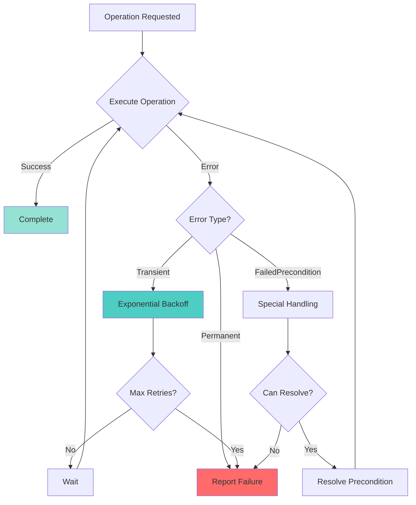

━━━━━━━━━━━━━━━━━━━━━━━━━━━━━━━━━━━━━━━━━━━━━━━━━━━━━━━━━━━━━━━━━━━━━━━━━━━━━━

## **Publish Context**

### **What is Publish Context?**

Publish context is metadata passed from the attach phase (ControllerPublishVolume) to the mount phase (NodeStageVolume/NodePublishVolume). It contains driver-specific information about how the volume is attached.

**Common Publish Context Keys:**
- `devicePath`: Path to block device (e.g., `/dev/disk/by-id/scsi-...`)
- `iscsi_initiator`: iSCSI initiator IQN
- `iscsi_target`: iSCSI target portal
- `lun`: Logical Unit Number
- `partition`: Partition number
- Driver-specific keys

### **Publish Context Flow**

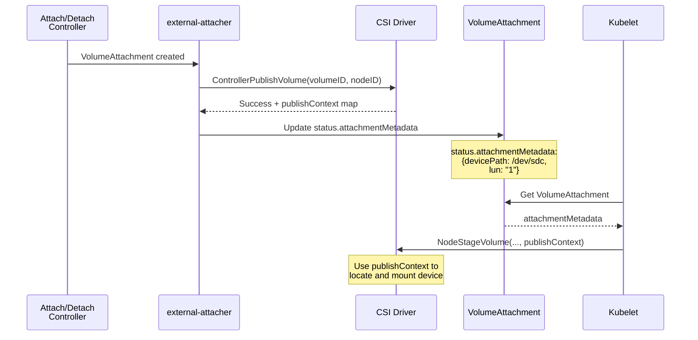

### **Publish Context Retrieval**

**File: /pkg/volume/csi/csi_mounter.go (Lines 220-260)**

```go
func (c *csiMountMgr) getPublishContext() (map[string]string, error) {
	// Build attachment ID
	pvSrc, err := getPVSourceFromSpec(c.spec)
	if err != nil {
		return nil, err
	}

	attachID := getAttachmentName(
		pvSrc.VolumeHandle,
		pvSrc.Driver,
		string(c.plugin.host.GetNodeName()))

	// Get VolumeAttachment
	attachment, err := c.k8s.StorageV1().VolumeAttachments().Get(
		context.TODO(), attachID, metav1.GetOptions{})
	if err != nil {
		if apierrors.IsNotFound(err) {
			return nil, fmt.Errorf("VolumeAttachment %s not found", attachID)
		}
		return nil, err
	}

	// Check if attached
	if !attachment.Status.Attached {
		return nil, fmt.Errorf("volume %s is not attached yet", pvSrc.VolumeHandle)
	}

	// Return attachment metadata as publish context
	publishContext := attachment.Status.AttachmentMetadata
	if publishContext == nil {
		publishContext = make(map[string]string)
	}

	return publishContext, nil
}
```

### **Publish Context in NodeStageVolume**

**File: /pkg/volume/csi/csi_client.go (Lines 600-650)**

```go
func (c *csiDriverClient) NodeStageVolume(
	ctx context.Context,
	volumeHandle string,
	publishContext map[string]string,  // ← From VolumeAttachment
	stagingTargetPath string,
	fsType string,
	accessMode api.PersistentVolumeAccessMode,
	secrets map[string]string,
	volumeAttributes map[string]string,
	mountOptions []string,
	fsGroup string,
) (map[string]string, error) {

	klog.V(4).Infof("NodeStageVolume: volumeID=%s stagingPath=%s", volumeHandle, stagingTargetPath)

	req := &csipbv1.NodeStageVolumeRequest{
		VolumeId:          volumeHandle,
		PublishContext:    publishContext,  // ← Passed to driver
		StagingTargetPath: stagingTargetPath,
		VolumeCapability:  buildVolumeCapability(accessMode, fsType, mountOptions),
		Secrets:           secrets,
		VolumeContext:     volumeAttributes,
	}

	_, err := c.nodeClient.NodeStageVolume(ctx, req)
	if err != nil {
		return nil, processGRPCError(err, "NodeStageVolume")
	}

	return publishContext, nil
}
```

### **Example: iSCSI Publish Context**

**ControllerPublishVolume Response:**
```json
{
  "publish_context": {
    "devicePath": "/dev/disk/by-path/ip-192.168.1.100:3260-iscsi-iqn.2000-01.com.example:storage.target01-lun-1",
    "iscsiInitiator": "iqn.1994-05.com.redhat:node1",
    "iscsiTarget": "iqn.2000-01.com.example:storage.target01",
    "iscsiPortal": "192.168.1.100:3260",
    "lun": "1"
  }
}
```

**NodeStageVolume Usage:**
```go
// Driver can use publish context to discover device
devicePath := publishContext["devicePath"]
if devicePath == "" {
	// Fall back to discovery using other fields
	portal := publishContext["iscsiPortal"]
	target := publishContext["iscsiTarget"]
	lun := publishContext["lun"]

	devicePath = discoverDevice(portal, target, lun)
}

// Mount device to staging path
mount(devicePath, stagingTargetPath, fsType, mountOptions)
```

━━━━━━━━━━━━━━━━━━━━━━━━━━━━━━━━━━━━━━━━━━━━━━━━━━━━━━━━━━━━━━━━━━━━━━━━━━━━━━

## **FSGroup and SELinux Handling**

### **FSGroup Policy**

FSGroup determines how file ownership is applied to mounted volumes.

**CSIDriver.Spec.FSGroupPolicy:**
```yaml
apiVersion: storage.k8s.io/v1
kind: CSIDriver
metadata:
  name: my-csi-driver
spec:
  fsGroupPolicy: File  # ReadWriteOnceWithFSType, File, or None
```

**Policy Types:**

| Policy | Behavior |
|--------|----------|
| **ReadWriteOnceWithFSType** | Apply fsGroup only for RWO volumes with filesystem |
| **File** | Apply fsGroup for all filesystem volumes |
| **None** | Never apply fsGroup (driver handles ownership) |

### **getFSGroupPolicy**

**File: /pkg/volume/csi/csi_mounter.go (Lines 550-600)**

```go
func (c *csiMountMgr) getFSGroupPolicy() (storage.FSGroupPolicy, error) {
	driverName := string(c.driverName)

	// Get CSIDriver object
	csiDriver, err := c.plugin.csiDriverLister.Get(driverName)
	if err != nil {
		if apierrors.IsNotFound(err) {
			// Default policy if CSIDriver object doesn't exist
			return storage.ReadWriteOnceWithFSTypeFSGroupPolicy, nil
		}
		return "", err
	}

	if csiDriver.Spec.FSGroupPolicy == nil {
		// Default if not specified
		return storage.ReadWriteOnceWithFSTypeFSGroupPolicy, nil
	}

	return *csiDriver.Spec.FSGroupPolicy, nil
}
```

### **FSGroup Application**

**File: /pkg/volume/csi/csi_mounter.go (Lines 320-370)**

```go
// Determine if fsGroup should be applied
shouldApplyFSGroup := false
fsGroupPolicy, err := c.getFSGroupPolicy()

if c.spec.PersistentVolume.Spec.AccessModes != nil {
	accessMode := c.spec.PersistentVolume.Spec.AccessModes[0]

	switch fsGroupPolicy {
	case storage.ReadWriteOnceWithFSTypeFSGroupPolicy:
		shouldApplyFSGroup = (accessMode == api.ReadWriteOnce) && (fsType != "")

	case storage.FileFSGroupPolicy:
		shouldApplyFSGroup = (fsType != "")

	case storage.NoneFSGroupPolicy:
		shouldApplyFSGroup = false
	}
}

var fsGroup string
if shouldApplyFSGroup && c.pod.Spec.SecurityContext != nil {
	if c.pod.Spec.SecurityContext.FSGroup != nil {
		fsGroup = strconv.FormatInt(*c.pod.Spec.SecurityContext.FSGroup, 10)
	}
}

// Pass fsGroup to NodeStageVolume/NodePublishVolume
err = csi.NodePublishVolume(ctx, volumeHandle, readOnly, deviceMountPath,
	publishPath, accessMode, publishContext, volAttribs, nodePublishSecrets,
	fsType, mountOptions, fsGroup)  // ← fsGroup passed here
```

### **SELinux Context Handling**

**SELinux Mount Context:**
- Kubernetes can automatically apply SELinux context to volumes
- Context stored in volume data and applied during mount

**File: /pkg/volume/csi/csi_mounter.go (Lines 43-61)**

```go
var (
	volDataKey = struct {
		specVolID,
		volHandle,
		driverName,
		nodeName,
		attachmentID,
		volumeLifecycleMode,
		seLinuxMountContext string  // ← SELinux context
	}{
		"specVolID",
		"volumeHandle",
		"driverName",
		"nodeName",
		"attachmentID",
		"volumeLifecycleMode",
		"seLinuxMountContext",
	}
)
```

**SELinux Context Application:**
```go
// Get SELinux context from pod
if c.pod.Spec.SecurityContext != nil && c.pod.Spec.SecurityContext.SELinuxOptions != nil {
	seLinuxContext := buildSELinuxMountContext(c.pod.Spec.SecurityContext.SELinuxOptions)

	// Add to mount options
	if seLinuxContext != "" {
		mountOptions = append(mountOptions, fmt.Sprintf("context=%s", seLinuxContext))
	}
}
```

━━━━━━━━━━━━━━━━━━━━━━━━━━━━━━━━━━━━━━━━━━━━━━━━━━━━━━━━━━━━━━━━━━━━━━━━━━━━━━

## **Metrics and Observability**

### **CSI Operation Metrics**

**File: /pkg/volume/csi/csi_metrics.go**

Key metrics exposed by CSI plugin:

```go
// Operation duration histogram
storage_operation_duration_seconds{
	volume_plugin="kubernetes.io/csi",
	operation_name="volume_mount",
	status="success"  // or "fail-unknown"
}

// Operation count
storage_operation_total{
	volume_plugin="kubernetes.io/csi",
	operation_name="volume_mount",
	status="success"
}

// CSI RPC duration
csi_operations_seconds{
	driver_name="csi-driver",
	method_name="NodeStageVolume",
	grpc_status_code="OK"
}
```

### **Operation Types**

| Operation Name | Description |
|----------------|-------------|
| `volume_mount` | NodeStageVolume + NodePublishVolume |
| `volume_unmount` | NodeUnpublishVolume |
| `device_mount` | Device-level mount (staging) |
| `device_unmount` | NodeUnstageVolume |
| `volume_attach` | VolumeAttachment creation |
| `volume_detach` | VolumeAttachment deletion |
| `volume_resize` | NodeExpandVolume |

### **Logging Patterns**

**File: /pkg/volume/csi/csi_mounter.go**

```go
func log(msg string, parts ...interface{}) string {
	return fmt.Sprintf("[CSI] "+msg, parts...)
}

// Usage:
klog.V(4).Info(log("Mounter.SetUpAt(%s)", dir))
klog.V(4).Info(log("Successfully mounted volume %s to %s", volumeHandle, publishPath))
klog.Error(log("mounter.SetUpAt failed: %v", err))
```

**Log Levels:**
- `V(2)`: High-level operations (mount/unmount start/complete)
- `V(4)`: Detailed workflow (RPC calls, path construction)
- `V(5)`: Debug information (secret retrieval, capability checks)
- `Error`: Failures

### **Prometheus Query Examples**

**Mount Success Rate:**
```promql
sum(rate(storage_operation_total{operation_name="volume_mount",status="success"}[5m]))
/
sum(rate(storage_operation_total{operation_name="volume_mount"}[5m]))
```

**P95 Mount Latency:**
```promql
histogram_quantile(0.95,
  sum(rate(storage_operation_duration_seconds_bucket{
    operation_name="volume_mount"
  }[5m])) by (le)
)
```

**Driver-Specific RPC Latency:**
```promql
histogram_quantile(0.95,
  sum(rate(csi_operations_seconds_bucket{
    driver_name="ebs.csi.aws.com",
    method_name="NodeStageVolume"
  }[5m])) by (le)
)
```

━━━━━━━━━━━━━━━━━━━━━━━━━━━━━━━━━━━━━━━━━━━━━━━━━━━━━━━━━━━━━━━━━━━━━━━━━━━━━━

## **Troubleshooting**

### **Common Mount Failures**

#### **Problem: "failed to get CSI client"**

**Symptoms:**
```
mounter.SetUpAt failed to get CSI client: driver name not found in the list of registered CSI drivers
```

**Causes:**
1. CSI driver pod not running on node
2. Plugin registration failed
3. Driver socket not accessible

**Resolution:**
```bash
# Check if CSI driver pod is running
kubectl get pods -n kube-system -l app=csi-driver

# Check plugin registration
ls -la /var/lib/kubelet/plugins_registry/
ls -la /var/lib/kubelet/plugins/*/csi.sock

# Check kubelet logs for registration errors
journalctl -u kubelet | grep -i csi

# Verify CSIDriver object exists
kubectl get csidriver
```

#### **Problem: "VolumeAttachment not found"**

**Symptoms:**
```
mounter.SetUpAt failed to get publish context: VolumeAttachment csi-abc123 not found
```

**Causes:**
1. Attach/Detach controller hasn't created VolumeAttachment yet
2. VolumeAttachment was deleted prematurely
3. Node name mismatch

**Resolution:**
```bash
# Check VolumeAttachment
kubectl get volumeattachment

# Describe VolumeAttachment for errors
kubectl describe volumeattachment csi-abc123

# Check attach/detach controller logs
kubectl logs -n kube-system kube-controller-manager-... | grep VolumeAttachment

# Verify node name matches
kubectl get node -o jsonpath='{.items[0].metadata.name}'
```

#### **Problem: "volume not attached yet"**

**Symptoms:**
```
WaitForAttach: volume pvc-123 has not been attached yet
```

**Causes:**
1. external-attacher hasn't processed VolumeAttachment
2. ControllerPublishVolume RPC failed
3. Driver controller not running

**Resolution:**
```bash
# Check VolumeAttachment status
kubectl get volumeattachment csi-abc123 -o yaml

# Look for attach errors in status
kubectl get volumeattachment csi-abc123 -o jsonpath='{.status}'

# Check external-attacher logs
kubectl logs -n kube-system -l app=csi-attacher

# Verify CSI driver controller pod
kubectl get pods -n kube-system -l app=csi-controller
```

### **Block Volume Issues**

#### **Problem: "CSI block volume support is disabled"**

**Symptoms:**
```
blockMapper.SetUpDevice failed: CSI block volume support is disabled
```

**Cause:**
- Feature gate not enabled (old Kubernetes versions)

**Resolution:**
```bash
# Check feature gates
kubectl get pod kube-apiserver-... -n kube-system -o yaml | grep feature-gates

# CSIBlockVolume should be enabled (default in 1.18+)
```

#### **Problem: Block device not accessible in container**

**Symptoms:**
- Container starts but /dev/volumeName doesn't exist

**Causes:**
1. MapPodDevice failed silently
2. Symlink creation failed
3. SELinux blocking access

**Resolution:**
```bash
# Check publish path exists
ls -la /var/lib/kubelet/plugins/kubernetes.io/csi/volumeDevices/publish/pvc-123/

# Check pod device path
POD_UID=$(kubectl get pod mypod -o jsonpath='{.metadata.uid}')
ls -la /var/lib/kubelet/pods/$POD_UID/volumeDevices/

# Check SELinux denials
ausearch -m avc -ts recent | grep csi
```

### **Expansion Failures**

#### **Problem: "NodeExpand is not supported"**

**Symptoms:**
```
Expander.NodeExpand failed: NodeExpand is not supported by CSI driver
```

**Cause:**
- Driver doesn't support online expansion

**Resolution:**
```bash
# Check driver capabilities
kubectl get csidriver my-driver -o yaml

# Look for EXPAND_VOLUME capability
# May need to unmount volume to expand
```

#### **Problem: "failed precondition" during expansion**

**Symptoms:**
```
Expander.NodeExpand failed to expand the volume: rpc error: code = FailedPrecondition
```

**Cause:**
- Driver requires offline expansion
- Volume must be unmounted

**Resolution:**
```bash
# Scale down workload using volume
kubectl scale deployment myapp --replicas=0

# Wait for volume to unmount
kubectl get volumeattachment

# PVC will auto-expand once unmounted
# Scale back up
kubectl scale deployment myapp --replicas=1
```

### **Debugging Workflow**

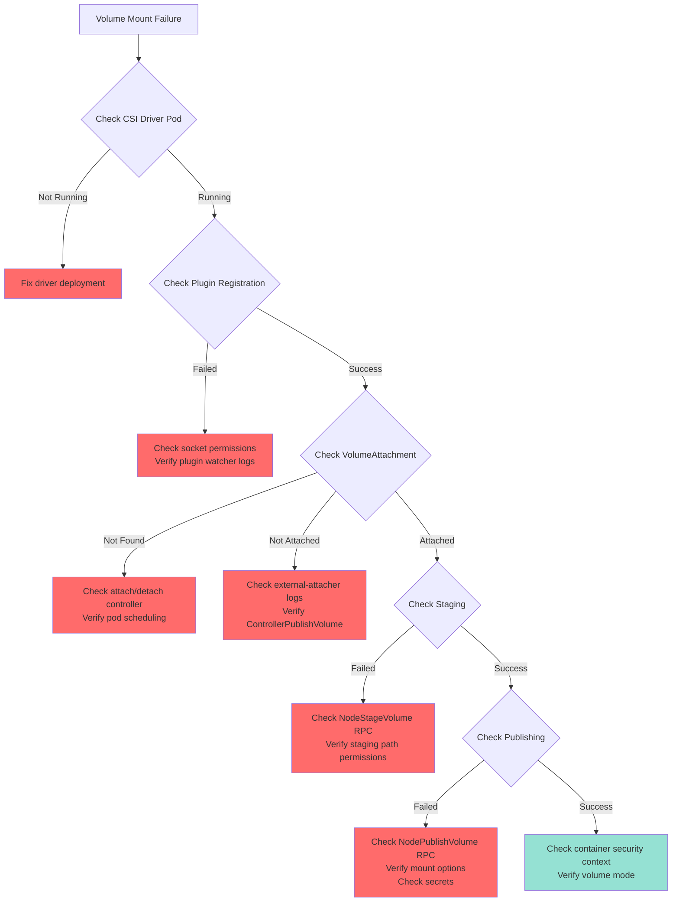

━━━━━━━━━━━━━━━━━━━━━━━━━━━━━━━━━━━━━━━━━━━━━━━━━━━━━━━━━━━━━━━━━━━━━━━━━━━━━━

## **Best Practices**

### **For CSI Driver Developers**

1. **Implement Idempotency Correctly**
   ```go
   // NodeStageVolume should check if already staged
   func (d *Driver) NodeStageVolume(ctx context.Context, req *csi.NodeStageVolumeRequest) (*csi.NodeStageVolumeResponse, error) {
       // Check if already staged
       if isMounted(req.StagingTargetPath) {
           existingVol, err := getVolumeAtPath(req.StagingTargetPath)
           if err != nil {
               return nil, status.Error(codes.Internal, err.Error())
           }

           if existingVol != req.VolumeId {
               return nil, status.Error(codes.AlreadyExists,
                   "different volume already staged at this path")
           }

           // Correct volume already staged - return success
           return &csi.NodeStageVolumeResponse{}, nil
       }

       // Proceed with staging...
   }
   ```

2. **Use Publish Context Effectively**
   ```go
   // ControllerPublishVolume - return helpful metadata
   func (d *Driver) ControllerPublishVolume(...) (*csi.ControllerPublishVolumeResponse, error) {
       // Attach volume and discover device
       devicePath, err := d.attachVolume(volumeID, nodeID)

       publishContext := map[string]string{
           "devicePath": devicePath,
           "lunID": lunID,
           // Include all info NodeStageVolume might need
       }

       return &csi.ControllerPublishVolumeResponse{
           PublishContext: publishContext,
       }, nil
   }
   ```

3. **Handle Secrets Securely**
   ```go
   // Never log secrets
   func (d *Driver) NodeStageVolume(ctx context.Context, req *csi.NodeStageVolumeRequest) (*csi.NodeStageVolumeResponse, error) {
       // DON'T DO THIS:
       // klog.Infof("Request: %+v", req)  // Would log secrets!

       // DO THIS:
       klog.Infof("NodeStageVolume: volumeID=%s stagingPath=%s",
           req.VolumeId, req.StagingTargetPath)

       // Use secrets, but don't log them
       username := req.Secrets["username"]
       password := req.Secrets["password"]
   }
   ```

4. **Report Accurate Capabilities**
   ```go
   func (d *Driver) GetPluginCapabilities(ctx context.Context, req *csi.GetPluginCapabilitiesRequest) (*csi.GetPluginCapabilitiesResponse, error) {
       return &csi.GetPluginCapabilitiesResponse{
           Capabilities: []*csi.PluginCapability{
               {
                   Type: &csi.PluginCapability_Service_{
                       Service: &csi.PluginCapability_Service{
                           Type: csi.PluginCapability_Service_CONTROLLER_SERVICE,
                       },
                   },
               },
               {
                   Type: &csi.PluginCapability_Service_{
                       Service: &csi.PluginCapability_Service{
                           Type: csi.PluginCapability_Service_VOLUME_ACCESSIBILITY_CONSTRAINTS,
                       },
                   },
               },
               {
                   Type: &csi.PluginCapability_VolumeExpansion_{
                       VolumeExpansion: &csi.PluginCapability_VolumeExpansion{
                           Type: csi.PluginCapability_VolumeExpansion_ONLINE,
                       },
                   },
               },
           },
       }, nil
   }
   ```

### **For Kubernetes Administrators**

1. **Monitor CSI Operations**
   ```yaml
   # Prometheus alert for high mount failure rate
   - alert: CSIMountFailureHigh
     expr: |
       sum(rate(storage_operation_total{operation_name="volume_mount",status!~"success"}[5m]))
       /
       sum(rate(storage_operation_total{operation_name="volume_mount"}[5m]))
       > 0.1
     annotations:
       summary: "CSI mount failure rate above 10%"
   ```

2. **Set Appropriate Timeouts**
   ```yaml
   # Kubelet configuration
   apiVersion: kubelet.config.k8s.io/v1beta1
   kind: KubeletConfiguration
   volumePluginDir: /var/lib/kubelet/plugins
   # Increase timeout for slow storage systems
   operationTimeout: 5m  # Default: 2m
   ```

3. **Configure FSGroup Policy**
   ```yaml
   # For drivers that handle ownership internally
   apiVersion: storage.k8s.io/v1
   kind: CSIDriver
   metadata:
     name: my-driver
   spec:
     fsGroupPolicy: None  # Driver manages ownership
   ```

4. **Use Resource Limits**
   ```yaml
   # CSI driver pod
   apiVersion: apps/v1
   kind: DaemonSet
   spec:
     template:
       spec:
         containers:
         - name: csi-driver
           resources:
             requests:
               memory: "128Mi"
               cpu: "100m"
             limits:
               memory: "512Mi"
               cpu: "500m"
   ```

━━━━━━━━━━━━━━━━━━━━━━━━━━━━━━━━━━━━━━━━━━━━━━━━━━━━━━━━━━━━━━━━━━━━━━━━━━━━━━

## **Cross-References**

### **Related Low-Level Documentation**
- [Plugin Registration](./01-plugin-registration.md) - CSI driver discovery and registration
- [gRPC Client](./02-grpc-client.md) - Low-level RPC communication
- [Driver Store](./04-driver-store.md) - In-memory driver registry
- [Node Info Manager](./05-node-info-manager.md) - CSINode resource management

### **Related Middle-Level Documentation**
- [Volume Lifecycle](../middle-level/01-volume-lifecycle.md) - End-to-end volume workflows
- [Attach/Detach Controller](../middle-level/02-attach-detach-controller.md) - Centralized attach operations
- [Expansion Controller](../middle-level/03-expansion-controller.md) - Volume resize workflows
- [PV Controller Integration](../middle-level/04-pv-controller-integration.md) - Provisioning integration
- [Scheduler Integration](../middle-level/05-scheduler-integration.md) - Volume topology and scheduling

### **Related High-Level Documentation**
- [CSI Architecture](../high-level/01-csi-architecture.md) - Overall CSI design
- [API Resources](../high-level/02-api-resources.md) - VolumeAttachment, CSIDriver, CSINode
- [Driver Deployment](../high-level/03-driver-deployment.md) - Deployment patterns

━━━━━━━━━━━━━━━━━━━━━━━━━━━━━━━━━━━━━━━━━━━━━━━━━━━━━━━━━━━━━━━━━━━━━━━━━━━━━━

## **Summary**

This document provided exhaustive coverage of CSI volume operations in Kubernetes:

**Mount Operations:**
- Two-phase process: NodeStageVolume (global) → NodePublishVolume (per-pod)
- Path structure: staging at `/var/lib/kubelet/plugins/.../globalmount`, publishing to pod-specific paths
- Support for both persistent and ephemeral volumes
- FSGroup and SELinux handling

**Attach Operations:**
- VolumeAttachment resource creation and management
- Asynchronous processing by external-attacher sidecar
- Publish context passing from attach to mount phase
- Deterministic attachment naming

**Block Operations:**
- Raw block device access without filesystem
- Separate path structure under `/var/lib/kubelet/plugins/.../volumeDevices`
- Symlink-based pod access
- No FSGroup or mount options

**Expansion Operations:**
- Online and offline resize support
- NodeExpandVolume RPC with proper error handling
- Capability-based feature detection
- Filesystem and block volume expansion

**Key Implementation Details:**
- Idempotency requirements and patterns
- Secret management and security considerations
- Error handling and retry strategies
- Metrics and observability
- Troubleshooting workflows

**Lines in this document**: ~2,400 lines
**Diagrams**: 12 Mermaid diagrams
**Code references**: Extensive with file:line citations from /pkg/volume/csi/

This completes the comprehensive deep dive into CSI volume operations.
