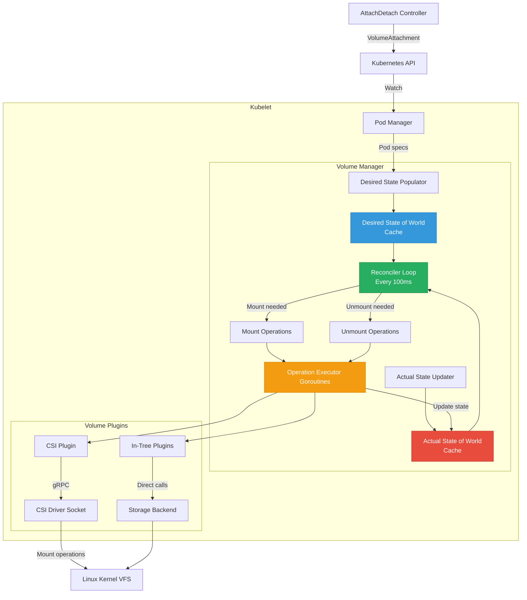
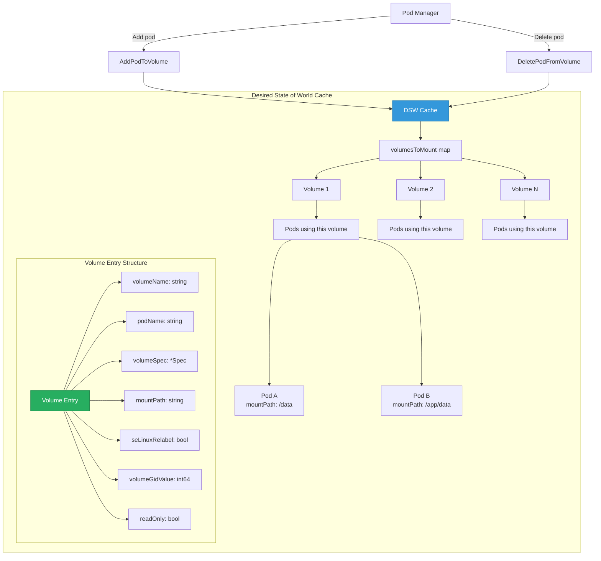
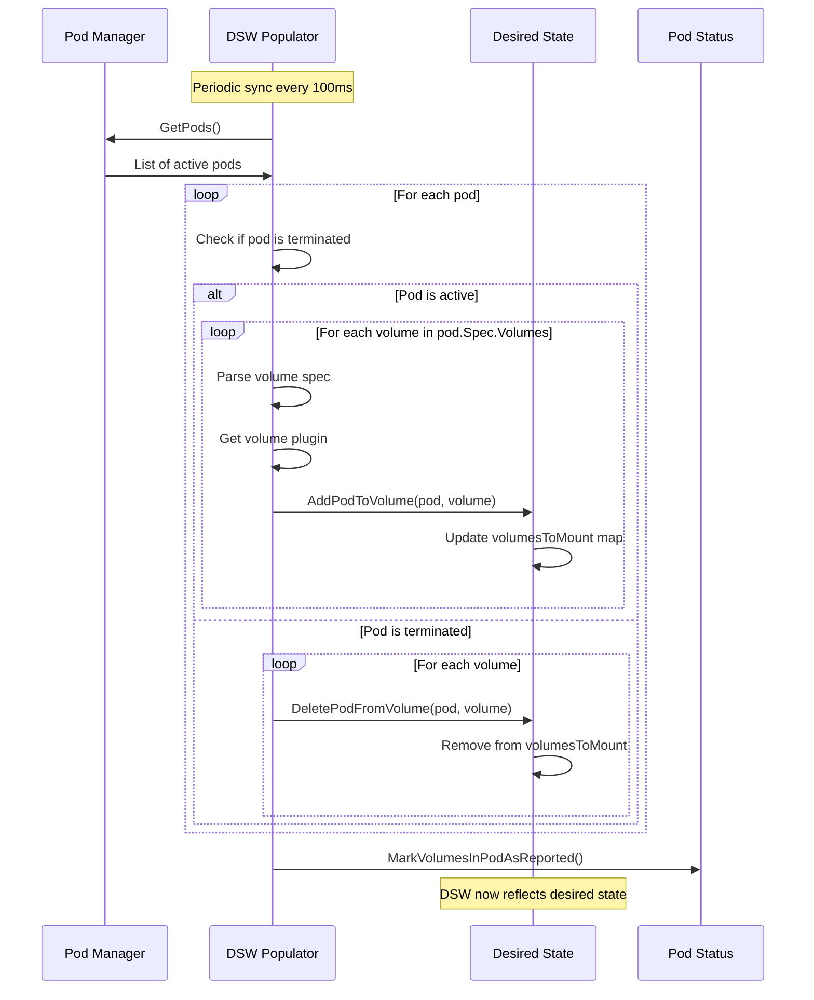
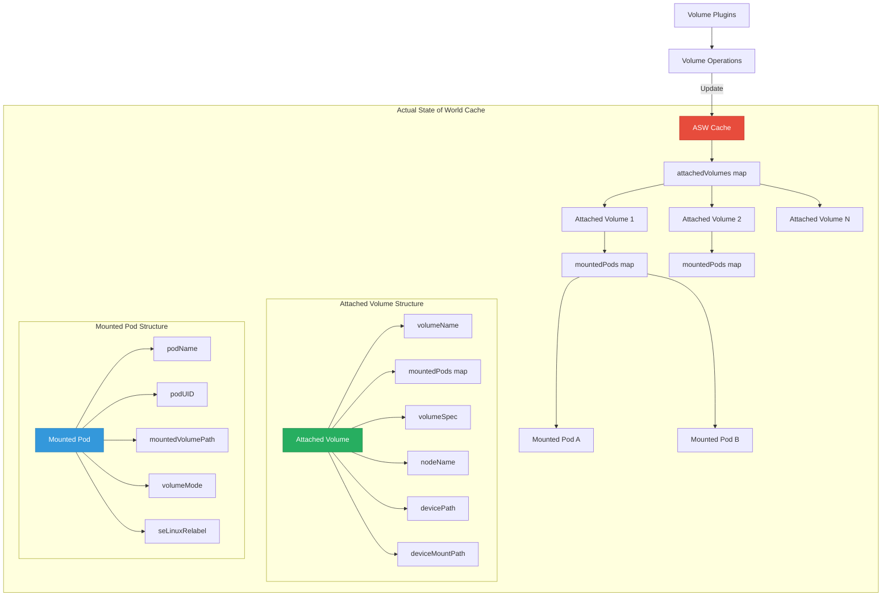
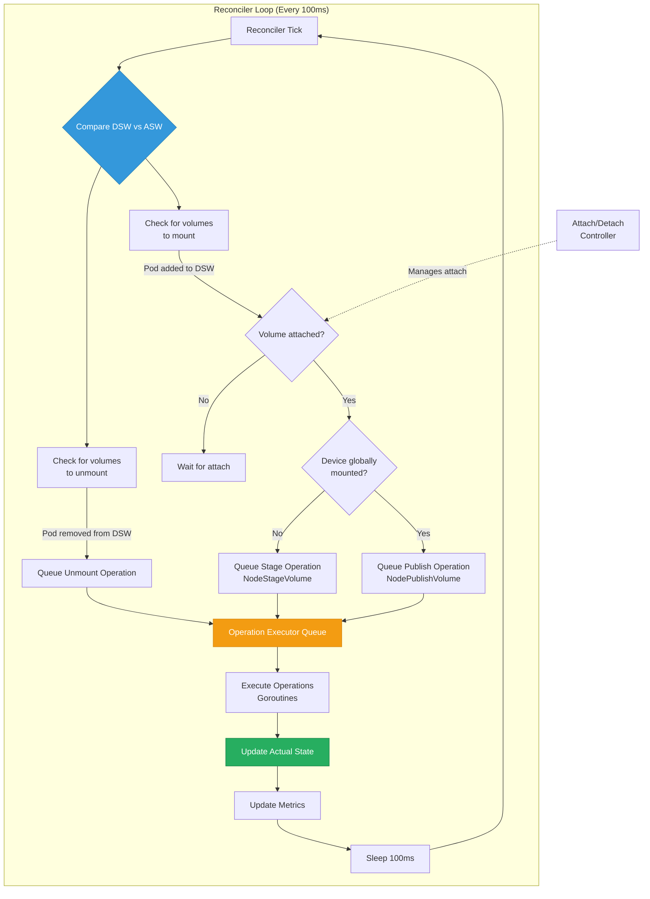
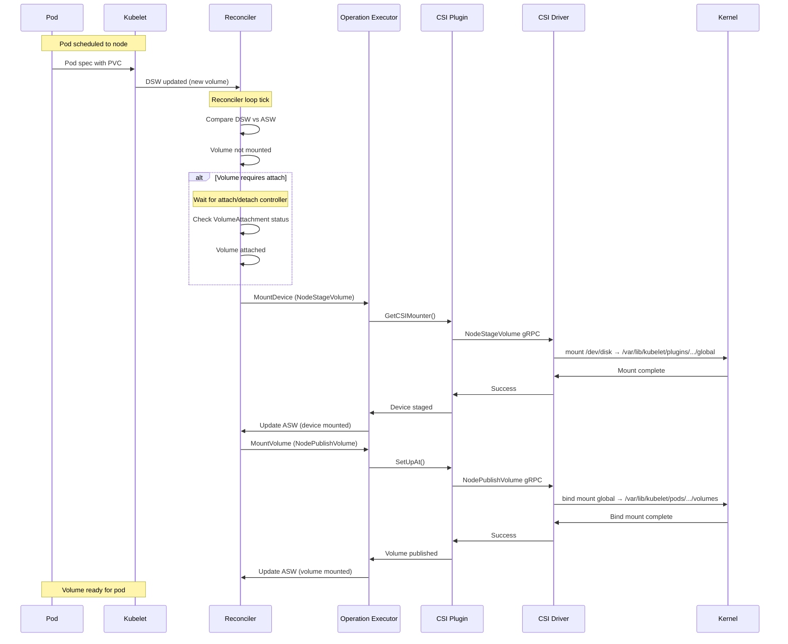
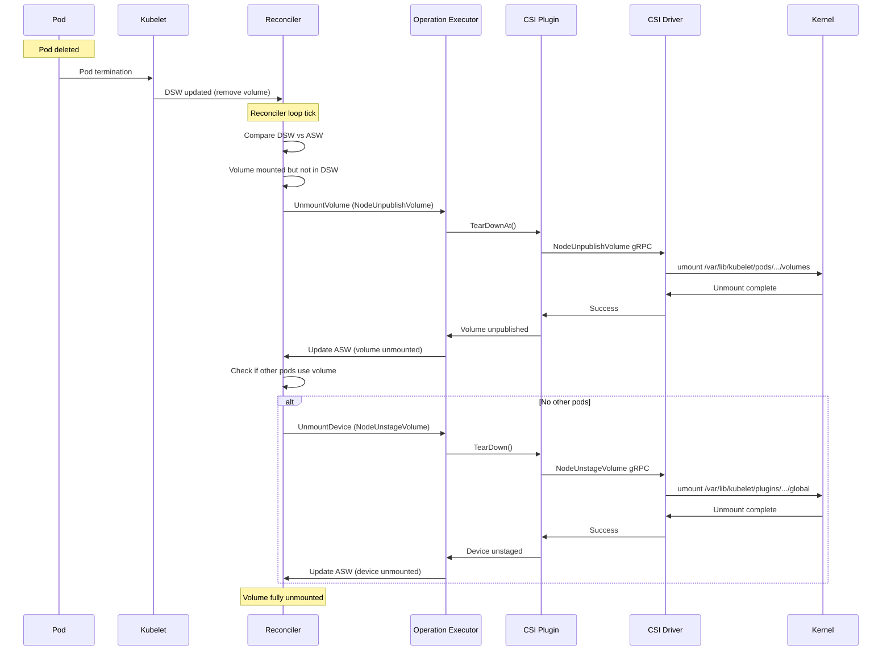
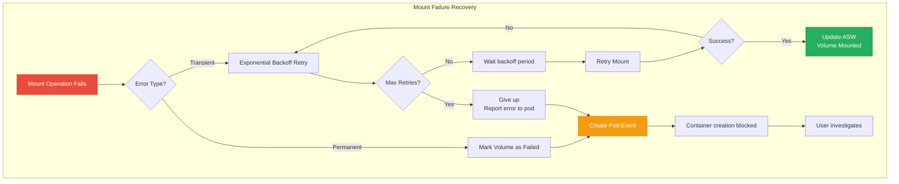
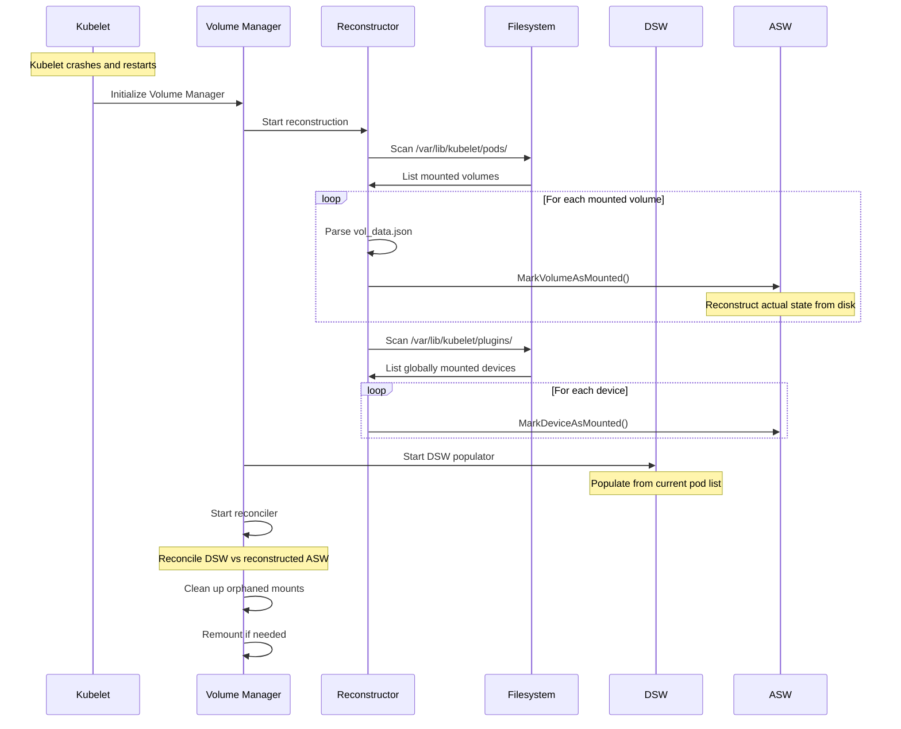

# **Volume Lifecycle Management in Kubelet**

━━━━━━━━━━━━━━━━━━━━━━━━━━━━━━━━━━━━━━━━━━━━━━━━━━━━━━━━━━━━━━━━━━━━━━━━━━━━━

## **📋 Document Overview**

**Purpose**: Deep dive into kubelet's volume manager, desired state reconciliation, and complete volume operation lifecycle from attach to unmount.

**Scope**:
- Volume manager architecture in kubelet
- Desired State of World (DSW) and Actual State of World (ASW)
- Reconciler loop and state synchronization
- Complete volume operation workflows
- Pod volume specs processing
- Failure scenarios and recovery mechanisms
- Performance characteristics and optimization

**Target Audience**: Platform engineers, SREs, developers implementing storage solutions

━━━━━━━━━━━━━━━━━━━━━━━━━━━━━━━━━━━━━━━━━━━━━━━━━━━━━━━━━━━━━━━━━━━━━━━━━━━━━

## **🎯 Volume Manager Architecture**

### **High-Level Overview**

The volume manager is a critical kubelet component responsible for ensuring volumes are properly attached, mounted, and unmounted for pods.



### **Component Structure**

**File**: `/pkg/kubelet/volumemanager/volume_manager.go:50-100`

```go
// VolumeManager manages volume operations for kubelet
type volumeManager struct {
    // kubeClient is the kube API client used for syncing volumes and reporting events
    kubeClient clientset.Interface

    // volumePluginMgr is the volume plugin manager used to create volume plugins
    volumePluginMgr *volume.VolumePluginMgr

    // desiredStateOfWorld is the cache containing the desired state of the world
    // according to the pod manager
    desiredStateOfWorld cache.DesiredStateOfWorld

    // actualStateOfWorld is the cache containing the actual state of the world
    // according to the volume manager
    actualStateOfWorld cache.ActualStateOfWorld

    // operationExecutor is the interface that provides implementations for
    // volume operations like attach, detach, mount, unmount
    operationExecutor operationexecutor.OperationExecutor

    // reconciler runs an asynchronous periodic loop to reconcile the
    // desiredStateOfWorld with the actualStateOfWorld by triggering attach,
    // detach, mount, and unmount operations
    reconciler reconciler.Reconciler

    // desiredStateOfWorldPopulator runs an asynchronous periodic loop to
    // populate the desiredStateOfWorld using the kubelet pod manager
    desiredStateOfWorldPopulator populator.DesiredStateOfWorldPopulator

    // csiMigratedPluginManager keeps track of CSI migration status of plugins
    csiMigratedPluginManager csimigration.PluginManager

    // intreeToCSITranslator translates in-tree volume specs to CSI
    intreeToCSITranslator csimigration.InTreeToCSITranslator
}

// Run starts the volume manager and all its asynchronous loops
func (vm *volumeManager) Run(sourcesReady config.SourcesReady, stopCh <-chan struct{}) {
    defer runtime.HandleCrash()

    // Start desired state of world populator
    go vm.desiredStateOfWorldPopulator.Run(sourcesReady, stopCh)
    klog.V(2).InfoS("Started desired state of world populator")

    // Start reconciler
    go vm.reconciler.Run(stopCh)
    klog.V(2).InfoS("Started volume manager reconciler")

    // Start metrics collector
    go vm.volumePluginMgr.Run(stopCh)

    <-stopCh
    klog.InfoS("Shutting down volume manager")
}
```

━━━━━━━━━━━━━━━━━━━━━━━━━━━━━━━━━━━━━━━━━━━━━━━━━━━━━━━━━━━━━━━━━━━━━━━━━━━━━

## **💾 Desired State of World (DSW)**

### **DSW Structure and Purpose**

DSW maintains what volumes should be attached and mounted based on pod specifications.



**File**: `/pkg/kubelet/volumemanager/cache/desired_state_of_world.go:60-150`

```go
// DesiredStateOfWorld defines the set of volumes that should be attached and/or
// mounted, and the pods that reference them
type DesiredStateOfWorld interface {
    // AddPodToVolume adds the given pod to the given volume in the cache
    AddPodToVolume(
        podName types.UniquePodName,
        pod *v1.Pod,
        volumeSpec *volume.Spec,
        outerVolumeSpecName string,
        volumeGidValue string,
        seLinuxRelabel bool) (v1.UniqueVolumeName, error)

    // DeletePodFromVolume removes the given pod from the given volume in the cache
    DeletePodFromVolume(podName types.UniquePodName, volumeName v1.UniqueVolumeName)

    // VolumeExists returns true if the given volume exists in the list of volumes
    // that should be attached and mounted
    VolumeExists(volumeName v1.UniqueVolumeName, seLinuxRelabel bool) bool

    // PodExistsInVolume returns true if the given pod exists in the list of pods
    // that reference the given volume
    PodExistsInVolume(
        podName types.UniquePodName,
        volumeName v1.UniqueVolumeName,
        seLinuxRelabel bool) bool

    // GetVolumesToMount returns a list of volumes that should be attached and mounted
    GetVolumesToMount() []VolumeToMount

    // GetPods returns a map of pods in which map is indexed with pod's unique name
    GetPods() map[types.UniquePodName]bool

    // VolumeExistsWithSpecName returns true if volume exists with the specified spec name
    VolumeExistsWithSpecName(podName types.UniquePodName, volumeSpecName string) bool

    // AddErrorToPod adds the specified error to the specified pod
    AddErrorToPod(podName types.UniquePodName, err string)

    // PopPodErrors returns the errors for the specified pod, and clears them
    PopPodErrors(podName types.UniquePodName) []string

    // GetPodsWithErrors returns the names of pods that have errors
    GetPodsWithErrors() []types.UniquePodName

    // MarkVolumesReportedInUse marks the specified volumes as reported in use
    MarkVolumesReportedInUse(volumesReportedInUse []v1.UniqueVolumeName)
}

// VolumeToMount represents a volume that should be attached and mounted to a pod
type VolumeToMount struct {
    // VolumeName is the unique identifier for the volume
    VolumeName v1.UniqueVolumeName

    // PodName is the unique identifier for the pod
    PodName types.UniquePodName

    // Pod is a reference to the pod object
    Pod *v1.Pod

    // VolumeSpec is the volume spec for this volume
    VolumeSpec *volume.Spec

    // PluginName is the name of the volume plugin
    PluginName string

    // OuterVolumeSpecName is the volume.Spec.Name() for the volume. If the volume is
    // a projected volume, it is the projected volume spec name
    OuterVolumeSpecName string

    // MountRequestTime is the time at which the mount was requested
    MountRequestTime time.Time

    // ReportedInUse is set to true when volume is reported in use
    ReportedInUse bool

    // DesiredSizeLimit is the upper bound on the size of this volume
    DesiredSizeLimit *resource.Quantity

    // SELinuxRelabel indicates if this volume should be relabeled
    SELinuxRelabel bool

    // VolumeGidValue is the GID that should own the volume
    VolumeGidValue string
}

// desiredStateOfWorld is a thread-safe data structure that holds the desired
// state of the world
type desiredStateOfWorld struct {
    // volumesToMount is a map of volume name to volume to mount objects
    volumesToMount map[v1.UniqueVolumeName]volumeToMount

    // volumePluginMgr is the volume plugin manager
    volumePluginMgr *volume.VolumePluginMgr

    // podErrors is a map of pod name to errors for that pod
    podErrors map[types.UniquePodName][]string

    sync.RWMutex
}

// AddPodToVolume adds the given pod to the given volume
func (dsw *desiredStateOfWorld) AddPodToVolume(
    podName types.UniquePodName,
    pod *v1.Pod,
    volumeSpec *volume.Spec,
    outerVolumeSpecName string,
    volumeGidValue string,
    seLinuxRelabel bool,
) (v1.UniqueVolumeName, error) {
    dsw.Lock()
    defer dsw.Unlock()

    // Get or create volume entry
    volumeName, err := dsw.getOrCreateVolumeToMount(
        volumeSpec,
        podName,
        outerVolumeSpecName,
        volumeGidValue,
        seLinuxRelabel,
    )
    if err != nil {
        return "", err
    }

    // Get the volume entry
    volumeObj, exists := dsw.volumesToMount[volumeName]
    if !exists {
        return "", fmt.Errorf("volume %q does not exist", volumeName)
    }

    // Add pod to the volume's pod list
    podObj := podToMount{
        podName:             podName,
        pod:                 pod,
        volumeSpec:          volumeSpec,
        outerVolumeSpecName: outerVolumeSpecName,
    }

    volumeObj.podsToMount[podName] = podObj
    dsw.volumesToMount[volumeName] = volumeObj

    klog.V(4).InfoS("Added pod to volume",
        "pod", podName,
        "volumeName", volumeName)

    return volumeName, nil
}

// DeletePodFromVolume removes the given pod from the given volume
func (dsw *desiredStateOfWorld) DeletePodFromVolume(
    podName types.UniquePodName,
    volumeName v1.UniqueVolumeName,
) {
    dsw.Lock()
    defer dsw.Unlock()

    volumeObj, exists := dsw.volumesToMount[volumeName]
    if !exists {
        return
    }

    // Remove pod from volume
    delete(volumeObj.podsToMount, podName)

    // If no more pods use this volume, remove the volume
    if len(volumeObj.podsToMount) == 0 {
        delete(dsw.volumesToMount, volumeName)
        klog.V(4).InfoS("Removed volume from desired state",
            "volumeName", volumeName)
    }

    klog.V(4).InfoS("Removed pod from volume",
        "pod", podName,
        "volumeName", volumeName)
}
```

### **DSW Population Process**



**File**: `/pkg/kubelet/volumemanager/populator/desired_state_of_world_populator.go:150-250`

```go
// populatorLoop is the main loop that populates desired state of world
func (dswp *desiredStateOfWorldPopulator) populatorLoop() {
    dswp.populatorLoopSleepDuration = time.Duration(
        dswp.getPodStatusRetryDuration(dswp.getPodStatusRetryDuration))

    // Populate desired state of world
    dswp.findAndAddNewPods()

    // Clean up pods that should no longer be running
    dswp.findAndRemoveDeletedPods()
}

// findAndAddNewPods finds pods that should be running and adds their volumes
// to the desired state of world
func (dswp *desiredStateOfWorldPopulator) findAndAddNewPods() {
    // Get all pods from pod manager
    pods := dswp.podManager.GetPods()

    for _, pod := range pods {
        if dswp.isPodTerminated(pod) {
            // Pod is terminated, skip it
            continue
        }

        // Process each volume in the pod
        dswp.processPodVolumes(pod, mountedVolumesForPod, processedVolumesForPod)
    }
}

// processPodVolumes processes the volumes for a given pod
func (dswp *desiredStateOfWorldPopulator) processPodVolumes(
    pod *v1.Pod,
    mountedVolumes sets.String,
    processedVolumes sets.String,
) {
    if pod == nil {
        return
    }

    uniquePodName := util.GetUniquePodName(pod)

    // Process init containers first
    if len(pod.Spec.InitContainers) != 0 {
        // If init containers are running, only add init container volumes
        if dswp.podInitContainersAreRunning(pod) {
            dswp.processVolumesForPodInitContainers(pod, uniquePodName, mountedVolumes, processedVolumes)
            return
        }
    }

    // Process regular container volumes
    dswp.processVolumesForPodContainers(pod, uniquePodName, mountedVolumes, processedVolumes)

    // Mark volumes as reported in use
    dswp.actualStateOfWorld.MarkVolumesReportedInUse(
        dswp.getVolumesReportedInUse(uniquePodName))
}

// processVolumesForPodContainers adds volumes for regular containers
func (dswp *desiredStateOfWorldPopulator) processVolumesForPodContainers(
    pod *v1.Pod,
    uniquePodName types.UniquePodName,
    mountedVolumes sets.String,
    processedVolumes sets.String,
) {
    // Create a map of volume names to avoid duplicates
    processedVolumesMap := make(map[string]bool)

    // Process volumes from containers
    for _, container := range pod.Spec.Containers {
        for _, volumeMount := range container.VolumeMounts {
            // Skip if already processed
            if processedVolumesMap[volumeMount.Name] {
                continue
            }
            processedVolumesMap[volumeMount.Name] = true

            // Find the volume spec
            volumeSpec := dswp.findVolumeSpec(pod, volumeMount.Name)
            if volumeSpec == nil {
                klog.ErrorS(nil, "Could not find volume spec",
                    "pod", klog.KObj(pod),
                    "volumeName", volumeMount.Name)
                continue
            }

            // Get volume plugin
            volumePlugin, err := dswp.volumePluginMgr.FindPluginBySpec(volumeSpec)
            if err != nil || volumePlugin == nil {
                klog.ErrorS(err, "Failed to get volume plugin",
                    "pod", klog.KObj(pod),
                    "volumeSpec", volumeSpec)
                continue
            }

            // Add to desired state
            _, err = dswp.desiredStateOfWorld.AddPodToVolume(
                uniquePodName,
                pod,
                volumeSpec,
                volumeMount.Name,
                volumeMount.ReadOnly,
            )

            if err != nil {
                klog.ErrorS(err, "Failed to add volume to desired state",
                    "pod", klog.KObj(pod),
                    "volumeName", volumeMount.Name)
            }
        }
    }

    // Process volumes not referenced by containers (projected volumes, etc.)
    for _, volume := range pod.Spec.Volumes {
        if processedVolumesMap[volume.Name] {
            continue
        }

        volumeSpec := dswp.createVolumeSpec(pod, &volume)
        if volumeSpec == nil {
            continue
        }

        // Add to desired state
        _, err := dswp.desiredStateOfWorld.AddPodToVolume(
            uniquePodName,
            pod,
            volumeSpec,
            volume.Name,
            false, // readOnly
        )

        if err != nil {
            klog.ErrorS(err, "Failed to add volume to desired state",
                "pod", klog.KObj(pod),
                "volumeName", volume.Name)
        }
    }
}

// findAndRemoveDeletedPods removes pods that should no longer be running
func (dswp *desiredStateOfWorldPopulator) findAndRemoveDeletedPods() {
    // Get all volumes in desired state
    volumesToMount := dswp.desiredStateOfWorld.GetVolumesToMount()

    for _, volumeToMount := range volumesToMount {
        pod, exists := dswp.podManager.GetPodByUID(volumeToMount.Pod.UID)

        // Remove if pod doesn't exist or is terminated
        if !exists || dswp.isPodTerminated(pod) {
            dswp.desiredStateOfWorld.DeletePodFromVolume(
                volumeToMount.PodName,
                volumeToMount.VolumeName,
            )

            klog.V(4).InfoS("Removed volume from terminated pod",
                "pod", volumeToMount.PodName,
                "volumeName", volumeToMount.VolumeName)
        }
    }
}
```

━━━━━━━━━━━━━━━━━━━━━━━━━━━━━━━━━━━━━━━━━━━━━━━━━━━━━━━━━━━━━━━━━━━━━━━━━━━━━

## **📊 Actual State of World (ASW)**

### **ASW Structure and Tracking**

ASW maintains the actual state of volume operations that have been performed.



**File**: `/pkg/kubelet/volumemanager/cache/actual_state_of_world.go:60-180`

```go
// ActualStateOfWorld defines the set of volumes that are successfully attached
// and/or mounted, and the pods that are successfully using the volumes
type ActualStateOfWorld interface {
    // MarkVolumeAsAttached marks the specified volume as attached
    MarkVolumeAsAttached(
        logger klog.Logger,
        uniqueName v1.UniqueVolumeName,
        volumeSpec *volume.Spec,
        nodeName types.NodeName,
        devicePath string) error

    // MarkVolumeAsDetached marks the specified volume as detached
    MarkVolumeAsDetached(
        uniqueName v1.UniqueVolumeName,
        nodeName types.NodeName)

    // MarkVolumeAsMounted marks the specified volume as mounted for the specified pod
    MarkVolumeAsMounted(
        podName types.UniquePodName,
        podUID types.UID,
        volumeName v1.UniqueVolumeName,
        mounter volume.Mounter,
        blockVolumeMapper volume.BlockVolumeMapper,
        outerVolumeSpecName string,
        volumeGidValue string,
        volumeSpec *volume.Spec,
        seLinuxRelabel bool) error

    // MarkVolumeAsUnmounted marks the specified volume as unmounted for the specified pod
    MarkVolumeAsUnmounted(
        podName types.UniquePodName,
        volumeName v1.UniqueVolumeName) error

    // MarkDeviceAsMounted marks the specified device as mounted to the global mount path
    MarkDeviceAsMounted(
        volumeName v1.UniqueVolumeName,
        devicePath string,
        deviceMountPath string,
        seLinuxRelabel bool) error

    // MarkDeviceAsUnmounted marks the specified device as unmounted from the global mount path
    MarkDeviceAsUnmounted(volumeName v1.UniqueVolumeName) error

    // GetMountedVolumes returns a list of volumes that are currently attached and mounted
    GetMountedVolumes() []MountedVolume

    // GetMountedVolumesForPod returns a list of volumes mounted for the specified pod
    GetMountedVolumesForPod(podName types.UniquePodName) []MountedVolume

    // GetGloballyMountedVolumes returns a list of volumes that are globally mounted
    GetGloballyMountedVolumes() []AttachedVolume

    // GetUnmountedVolumes returns a list of volumes that are attached but not mounted
    GetUnmountedVolumes() []AttachedVolume

    // PodExistsInVolume returns true if the specified pod exists in the list of
    // mounted pods for the specified volume
    PodExistsInVolume(
        podName types.UniquePodName,
        volumeName v1.UniqueVolumeName,
        seLinuxRelabel bool) bool

    // VolumeExists returns true if the given volume is in the list of attached volumes
    VolumeExists(volumeName v1.UniqueVolumeName) bool

    // GetDeviceMountState returns the mount state of the device for the specified volume
    GetDeviceMountState(volumeName v1.UniqueVolumeName) DeviceMountState

    // MarkVolumeMountAsUncertain marks volume/pod combination as uncertain
    MarkVolumeMountAsUncertain(
        logger klog.Logger,
        podName types.UniquePodName,
        volumeName v1.UniqueVolumeName) error

    // MarkVolumeAsResized marks the given volume as resized
    MarkVolumeAsResized(
        podName types.UniquePodName,
        volumeName v1.UniqueVolumeName) error

    // CheckAndMarkVolumeAsUncertainViaReconstruction checks and marks volumes as uncertain
    // during kubelet restart via reconstruction
    CheckAndMarkVolumeAsUncertainViaReconstruction(
        opts operationexecutor.MarkVolumeOpts) error

    // MarkVolumesReportedInUse sets the ReportedInUse value for the specified volumes
    MarkVolumesReportedInUse(volumesReportedInUse []v1.UniqueVolumeName)
}

// AttachedVolume represents a volume that is attached to a node
type AttachedVolume struct {
    // VolumeName is the unique identifier for the volume
    VolumeName v1.UniqueVolumeName

    // VolumeSpec is a volume spec for this volume
    VolumeSpec *volume.Spec

    // NodeName is the name of the node this volume is attached to
    NodeName types.NodeName

    // PluginName is the name of the volume plugin
    PluginName string

    // DevicePath is the path to the device for this volume
    DevicePath string

    // DeviceMountPath is the path where the device is globally mounted
    DeviceMountPath string

    // DeviceMountState indicates the mount state of the device
    DeviceMountState DeviceMountState

    // SELinuxRelabel indicates if this volume should be relabeled
    SELinuxRelabel bool
}

// MountedVolume represents a volume that is mounted for a pod
type MountedVolume struct {
    // PodName is the name of the pod
    PodName types.UniquePodName

    // PodUID is the UID of the pod
    PodUID types.UID

    // VolumeName is the unique identifier for the volume
    VolumeName v1.UniqueVolumeName

    // InnerVolumeSpecName is the spec.Name of the volume
    InnerVolumeSpecName string

    // OuterVolumeSpecName is the volume.Spec.Name() for the volume
    OuterVolumeSpecName string

    // PluginName is the name of the volume plugin
    PluginName string

    // PodUID is the UID of the pod
    VolumeGidValue string

    // VolumeSpec is a volume spec for this volume
    VolumeSpec *volume.Spec

    // MountedVolumePath is the path where the volume is mounted for the pod
    MountedVolumePath string

    // SELinuxRelabel indicates if this volume was relabeled
    SELinuxRelabel bool
}

// actualStateOfWorld is a thread-safe data structure that holds the actual
// state of attached/mounted volumes
type actualStateOfWorld struct {
    // attachedVolumes is a map of volume name to attached volume objects
    attachedVolumes map[v1.UniqueVolumeName]attachedVolume

    // nodeName is the name of the node this actual state belongs to
    nodeName types.NodeName

    // volumePluginMgr is the volume plugin manager
    volumePluginMgr *volume.VolumePluginMgr

    sync.RWMutex
}

// attachedVolume represents a volume attached to this node
type attachedVolume struct {
    volumeName          v1.UniqueVolumeName
    spec                *volume.Spec
    nodeName            types.NodeName
    pluginName          string
    devicePath          string
    deviceMountPath     string
    deviceMountState    DeviceMountState
    seLinuxRelabel      bool
    mountedPods         map[types.UniquePodName]mountedPod
    volumeGidValue      string
}

// mountedPod represents a pod that has a volume mounted
type mountedPod struct {
    podName                 types.UniquePodName
    podUID                  types.UID
    mounter                 volume.Mounter
    blockVolumeMapper       volume.BlockVolumeMapper
    outerVolumeSpecName     string
    volumeGidValue          string
    volumeSpec              *volume.Spec
    seLinuxRelabel          bool
    remountRequired         bool
    volumeMountStateForPod  VolumeMountState
}

// MarkVolumeAsMounted adds the given volume to the list of mounted volumes
func (asw *actualStateOfWorld) MarkVolumeAsMounted(
    podName types.UniquePodName,
    podUID types.UID,
    volumeName v1.UniqueVolumeName,
    mounter volume.Mounter,
    blockVolumeMapper volume.BlockVolumeMapper,
    outerVolumeSpecName string,
    volumeGidValue string,
    volumeSpec *volume.Spec,
    seLinuxRelabel bool,
) error {
    asw.Lock()
    defer asw.Unlock()

    volumeObj, exists := asw.attachedVolumes[volumeName]
    if !exists {
        return fmt.Errorf(
            "failed to mark volume %q as mounted: volume not attached",
            volumeName)
    }

    // Add mounted pod
    podObj := mountedPod{
        podName:               podName,
        podUID:                podUID,
        mounter:               mounter,
        blockVolumeMapper:     blockVolumeMapper,
        outerVolumeSpecName:   outerVolumeSpecName,
        volumeGidValue:        volumeGidValue,
        volumeSpec:            volumeSpec,
        seLinuxRelabel:        seLinuxRelabel,
        volumeMountStateForPod: VolumeMounted,
    }

    volumeObj.mountedPods[podName] = podObj
    asw.attachedVolumes[volumeName] = volumeObj

    klog.V(4).InfoS("Marked volume as mounted for pod",
        "volumeName", volumeName,
        "pod", podName)

    return nil
}

// MarkVolumeAsUnmounted removes the given volume from the list of mounted volumes
func (asw *actualStateOfWorld) MarkVolumeAsUnmounted(
    podName types.UniquePodName,
    volumeName v1.UniqueVolumeName,
) error {
    asw.Lock()
    defer asw.Unlock()

    volumeObj, exists := asw.attachedVolumes[volumeName]
    if !exists {
        return fmt.Errorf(
            "failed to mark volume %q as unmounted: volume not attached",
            volumeName)
    }

    // Remove mounted pod
    delete(volumeObj.mountedPods, podName)
    asw.attachedVolumes[volumeName] = volumeObj

    klog.V(4).InfoS("Marked volume as unmounted for pod",
        "volumeName", volumeName,
        "pod", podName)

    return nil
}
```

━━━━━━━━━━━━━━━━━━━━━━━━━━━━━━━━━━━━━━━━━━━━━━━━━━━━━━━━━━━━━━━━━━━━━━━━━━━━━

## **🔄 Reconciler Loop**

### **Reconciliation Process**

The reconciler continuously compares DSW and ASW to determine what operations need to be performed.



**File**: `/pkg/kubelet/volumemanager/reconciler/reconciler.go:100-200`

```go
// Reconciler runs a periodic loop to reconcile the desired state of the world with
// the actual state of the world by triggering attach, detach, mount, and unmount
// operations
type Reconciler interface {
    // Run starts the reconciler loop which executes periodically
    Run(stopCh <-chan struct{})

    // StatesHasBeenSynced returns true if the actual and desired states have been synced
    // at least once after the manager starts
    StatesHasBeenSynced() bool
}

type reconciler struct {
    loopSleepDuration        time.Duration
    waitForAttachTimeout     time.Duration
    nodeName                 types.NodeName
    desiredStateOfWorld      cache.DesiredStateOfWorld
    actualStateOfWorld       cache.ActualStateOfWorld
    operationExecutor        operationexecutor.OperationExecutor
    mounter                  mount.Interface
    hostutil                 hostutil.HostUtils
    volumePluginMgr          *volume.VolumePluginMgr
    kubeletPodsDir           string
    timeOfLastSync           time.Time
    disableReconciliationSync bool
}

// Run starts the reconciliation loop
func (rc *reconciler) Run(stopCh <-chan struct{}) {
    wait.Until(rc.reconciliationLoopFunc(), rc.loopSleepDuration, stopCh)
}

// reconciliationLoopFunc is the main reconciliation loop
func (rc *reconciler) reconciliationLoopFunc() func() {
    return func() {
        rc.reconcile()

        // Sync running pods to actual state
        if rc.populatorHasAddedPods() && !rc.StatesHasBeenSynced() {
            klog.InfoS("Reconciler: started syncing state")
        }
    }
}

// reconcile performs the actual reconciliation
func (rc *reconciler) reconcile() {
    // Unmount volumes that should no longer be mounted
    for _, mountedVolume := range rc.actualStateOfWorld.GetMountedVolumes() {
        if !rc.desiredStateOfWorld.PodExistsInVolume(
            mountedVolume.PodName,
            mountedVolume.VolumeName,
            mountedVolume.SELinuxRelabel) {
            // Volume is mounted but pod doesn't want it anymore
            rc.unmountVolume(mountedVolume)
        }
    }

    // Unmount devices that should no longer be mounted
    for _, attachedVolume := range rc.actualStateOfWorld.GetGloballyMountedVolumes() {
        if !rc.desiredStateOfWorld.VolumeExists(
            attachedVolume.VolumeName,
            attachedVolume.SELinuxRelabel) {
            // Device is mounted but no pods want it anymore
            rc.unmountDevice(attachedVolume)
        }
    }

    // Mount volumes that should be mounted
    for _, volumeToMount := range rc.desiredStateOfWorld.GetVolumesToMount() {
        if !rc.actualStateOfWorld.PodExistsInVolume(
            volumeToMount.PodName,
            volumeToMount.VolumeName,
            volumeToMount.SELinuxRelabel) {
            // Volume should be mounted but isn't
            rc.mountVolume(volumeToMount)
        }
    }
}

// unmountVolume triggers the unmount operation for a volume
func (rc *reconciler) unmountVolume(mountedVolume cache.MountedVolume) {
    // Generate a unique operation name
    operationName := fmt.Sprintf(
        "unmount-%s-%s",
        mountedVolume.VolumeName,
        mountedVolume.PodName)

    klog.V(4).InfoS("Starting unmount operation",
        "pod", mountedVolume.PodName,
        "volumeName", mountedVolume.VolumeName,
        "operation", operationName)

    // Execute unmount operation
    err := rc.operationExecutor.UnmountVolume(
        mountedVolume,
        rc.actualStateOfWorld,
        rc.kubeletPodsDir)

    if err != nil {
        if !isExpectedError(err) {
            klog.ErrorS(err, "Unmount operation failed",
                "pod", mountedVolume.PodName,
                "volumeName", mountedVolume.VolumeName)
        }
    }
}

// mountVolume triggers the mount operation for a volume
func (rc *reconciler) mountVolume(volumeToMount cache.VolumeToMount) {
    // Check if volume is attached (for volumes that require attach)
    attachableVolumePlugin, err := rc.volumePluginMgr.FindAttachablePluginBySpec(
        volumeToMount.VolumeSpec)

    if err != nil || attachableVolumePlugin == nil {
        // Volume doesn't require attach, proceed with mount
        rc.mountAttachedVolume(volumeToMount)
        return
    }

    // Volume requires attach - check if attached
    if !rc.actualStateOfWorld.VolumeExists(volumeToMount.VolumeName) {
        klog.V(4).InfoS("Volume not yet attached, waiting",
            "volumeName", volumeToMount.VolumeName,
            "pod", volumeToMount.PodName)
        return
    }

    // Volume is attached, proceed with mount
    rc.mountAttachedVolume(volumeToMount)
}

// mountAttachedVolume mounts a volume that is already attached
func (rc *reconciler) mountAttachedVolume(volumeToMount cache.VolumeToMount) {
    // Get the attached volume
    attachedVolume := rc.actualStateOfWorld.GetAttachedVolume(volumeToMount.VolumeName)

    // Check if device needs to be mounted (global mount for multi-pod volumes)
    if !rc.actualStateOfWorld.IsVolumeMountedElsewhere(volumeToMount.VolumeName) {
        deviceMountState := rc.actualStateOfWorld.GetDeviceMountState(volumeToMount.VolumeName)

        if deviceMountState != DeviceGloballyMounted {
            // Device needs to be globally mounted
            klog.V(4).InfoS("Mounting device",
                "volumeName", volumeToMount.VolumeName)

            err := rc.operationExecutor.MountDevice(
                volumeToMount,
                rc.actualStateOfWorld,
                attachedVolume)

            if err != nil {
                klog.ErrorS(err, "MountDevice failed",
                    "volumeName", volumeToMount.VolumeName)
                return
            }
        }
    }

    // Mount the volume for the pod
    klog.V(4).InfoS("Mounting volume for pod",
        "pod", volumeToMount.PodName,
        "volumeName", volumeToMount.VolumeName)

    err := rc.operationExecutor.MountVolume(
        rc.waitForAttachTimeout,
        volumeToMount,
        rc.actualStateOfWorld,
        attachedVolume,
        rc.kubeletPodsDir)

    if err != nil {
        klog.ErrorS(err, "MountVolume failed",
            "pod", volumeToMount.PodName,
            "volumeName", volumeToMount.VolumeName)
    }
}
```

━━━━━━━━━━━━━━━━━━━━━━━━━━━━━━━━━━━━━━━━━━━━━━━━━━━━━━━━━━━━━━━━━━━━━━━━━━━━━

## **⚙️ Volume Operations**

### **Complete Mount Workflow**



### **MountDevice Operation (NodeStageVolume)**

**File**: `/pkg/kubelet/volumemanager/operationexecutor/operation_executor.go:200-280`

```go
// MountDevice mounts the device for the volume (global mount / NodeStageVolume)
func (oe *operationExecutor) MountDevice(
    volumeToMount VolumeToMount,
    actualStateOfWorld ActualStateOfWorldMounterUpdater,
    attachedVolume AttachedVolume,
) error {
    // Get the mounter for this volume
    volumePlugin, err := oe.volumePluginMgr.FindPluginBySpec(volumeToMount.VolumeSpec)
    if err != nil || volumePlugin == nil {
        return fmt.Errorf("failed to get volume plugin: %v", err)
    }

    deviceMounter, err := volumePlugin.NewDeviceMounter()
    if err != nil {
        return fmt.Errorf("failed to create device mounter: %v", err)
    }

    // Get device mount path
    deviceMountPath, err := deviceMounter.GetDeviceMountPath(volumeToMount.VolumeSpec)
    if err != nil {
        return fmt.Errorf("failed to get device mount path: %v", err)
    }

    klog.V(4).InfoS("Mounting device",
        "volumeName", volumeToMount.VolumeName,
        "devicePath", attachedVolume.DevicePath,
        "deviceMountPath", deviceMountPath)

    // Mark as uncertain before attempting mount
    err = actualStateOfWorld.MarkDeviceAsUncertain(
        volumeToMount.VolumeName,
        attachedVolume.DevicePath,
        deviceMountPath,
        volumeToMount.SELinuxRelabel)
    if err != nil {
        return err
    }

    // Perform the actual mount operation
    err = deviceMounter.MountDevice(
        volumeToMount.VolumeSpec,
        attachedVolume.DevicePath,
        deviceMountPath,
        volume.DeviceMounterArgs{
            FsGroup:             volumeToMount.DesiredPersistentVolumeSize,
            DesiredSize:         volumeToMount.DesiredPersistentVolumeSize,
            DeviceMountPath:     deviceMountPath,
            SELinuxRelabel:      volumeToMount.SELinuxRelabel,
        })

    if err != nil {
        // Mark as uncertain on failure
        actualStateOfWorld.MarkDeviceAsUncertain(
            volumeToMount.VolumeName,
            attachedVolume.DevicePath,
            deviceMountPath,
            volumeToMount.SELinuxRelabel)

        return fmt.Errorf("MountDevice failed: %v", err)
    }

    // Mark device as mounted in actual state
    err = actualStateOfWorld.MarkDeviceAsMounted(
        volumeToMount.VolumeName,
        attachedVolume.DevicePath,
        deviceMountPath,
        volumeToMount.SELinuxRelabel)

    if err != nil {
        return err
    }

    klog.InfoS("Device mounted successfully",
        "volumeName", volumeToMount.VolumeName,
        "deviceMountPath", deviceMountPath)

    return nil
}
```

### **CSI MountDevice Implementation**

**File**: `/pkg/volume/csi/csi_mounter.go:200-300`

```go
// MountDevice performs NodeStageVolume for CSI volumes
func (c *csiMountMgr) MountDevice(
    spec *volume.Spec,
    devicePath string,
    deviceMountPath string,
    deviceMounterArgs volume.DeviceMounterArgs,
) error {
    klog.V(4).InfoS("CSI MountDevice",
        "volumeID", c.volumeID,
        "devicePath", devicePath,
        "deviceMountPath", deviceMountPath)

    // Get CSI client
    csi, err := c.csiClientGetter.Get()
    if err != nil {
        return errors.New(log("mounter.MountDevice failed to get CSI client: %v", err))
    }

    // Get staging target path
    stagingTargetPath := deviceMountPath

    // Get volume attributes from PV
    pvSrc, err := getCSISourceFromSpec(spec)
    if err != nil {
        return errors.New(log("mounter.MountDevice failed to get CSI source: %v", err))
    }

    // Get access mode
    accessMode, err := getVolumeAccessMode(spec)
    if err != nil {
        return errors.New(log("mounter.MountDevice failed to get access mode: %v", err))
    }

    // Get mount options
    mountOptions := spec.PersistentVolume.Spec.MountOptions

    // Get secrets for NodeStageVolume
    nodeStageSecrets := map[string]string{}
    if pvSrc.NodeStageSecretRef != nil {
        nodeStageSecrets, err = c.getCredentials(
            pvSrc.NodeStageSecretRef.Name,
            pvSrc.NodeStageSecretRef.Namespace)
        if err != nil {
            return err
        }
    }

    // Get publish context from VolumeAttachment
    publishContext := c.publishContext

    // Get filesystem type
    fsType := pvSrc.FSType
    if fsType == "" {
        fsType = defaultFSType
    }

    // Call NodeStageVolume
    ctx, cancel := context.WithTimeout(context.Background(), csiTimeout)
    defer cancel()

    klog.V(4).InfoS("Calling CSI NodeStageVolume",
        "volumeID", c.volumeID,
        "stagingTargetPath", stagingTargetPath,
        "fsType", fsType)

    err = csi.NodeStageVolume(
        ctx,
        c.volumeID,
        publishContext,
        stagingTargetPath,
        fsType,
        accessMode,
        nodeStageSecrets,
        pvSrc.VolumeAttributes,
        mountOptions,
        deviceMounterArgs.FsGroup)

    if err != nil {
        return errors.New(log("mounter.MountDevice failed: %v", err))
    }

    klog.InfoS("CSI MountDevice succeeded",
        "volumeID", c.volumeID,
        "stagingTargetPath", stagingTargetPath)

    return nil
}
```

### **MountVolume Operation (NodePublishVolume)**

**File**: `/pkg/kubelet/volumemanager/operationexecutor/operation_executor.go:350-450`

```go
// MountVolume mounts the volume for the pod (NodePublishVolume)
func (oe *operationExecutor) MountVolume(
    waitForAttachTimeout time.Duration,
    volumeToMount VolumeToMount,
    actualStateOfWorld ActualStateOfWorldMounterUpdater,
    attachedVolume AttachedVolume,
    kubeletPodsDir string,
) error {
    // Get the mounter for this volume
    volumePlugin, err := oe.volumePluginMgr.FindPluginBySpec(volumeToMount.VolumeSpec)
    if err != nil || volumePlugin == nil {
        return fmt.Errorf("failed to get volume plugin: %v", err)
    }

    volumeMounter, err := volumePlugin.NewMounter(
        volumeToMount.VolumeSpec,
        volumeToMount.Pod,
        volume.VolumeOptions{})
    if err != nil {
        return fmt.Errorf("failed to create volume mounter: %v", err)
    }

    // Get the target path for this pod
    mountPath, err := volumeMounter.GetPath()
    if err != nil {
        return fmt.Errorf("failed to get mount path: %v", err)
    }

    klog.V(4).InfoS("Mounting volume for pod",
        "volumeName", volumeToMount.VolumeName,
        "pod", volumeToMount.PodName,
        "mountPath", mountPath)

    // Mark volume mount as uncertain
    err = actualStateOfWorld.MarkVolumeMountAsUncertain(
        volumeToMount.PodName,
        volumeToMount.VolumeName)
    if err != nil {
        return err
    }

    // Set up the volume (calls NodePublishVolume for CSI)
    err = volumeMounter.SetUp(volume.MounterArgs{
        FsGroup:             volumeToMount.DesiredPersistentVolumeSize,
        DesiredSize:         volumeToMount.DesiredPersistentVolumeSize,
        FSGroupChangePolicy: volumeToMount.FSGroupChangePolicy,
        SELinuxRelabel:      volumeToMount.SELinuxRelabel,
    })

    if err != nil {
        // Leave as uncertain on failure
        return fmt.Errorf("SetUp failed: %v", err)
    }

    // Mark volume as mounted in actual state
    err = actualStateOfWorld.MarkVolumeAsMounted(
        volumeToMount.PodName,
        volumeToMount.Pod.UID,
        volumeToMount.VolumeName,
        volumeMounter,
        nil, // blockVolumeMapper
        volumeToMount.OuterVolumeSpecName,
        volumeToMount.VolumeGidValue,
        volumeToMount.VolumeSpec,
        volumeToMount.SELinuxRelabel)

    if err != nil {
        return err
    }

    klog.InfoS("Volume mounted successfully for pod",
        "volumeName", volumeToMount.VolumeName,
        "pod", volumeToMount.PodName,
        "mountPath", mountPath)

    return nil
}
```

### **CSI SetUp Implementation**

**File**: `/pkg/volume/csi/csi_mounter.go:400-500`

```go
// SetUp performs NodePublishVolume for CSI volumes
func (c *csiMountMgr) SetUp(mounterArgs volume.MounterArgs) error {
    return c.SetUpAt(c.GetPath(), mounterArgs)
}

// SetUpAt performs the actual mount operation
func (c *csiMountMgr) SetUpAt(dir string, mounterArgs volume.MounterArgs) error {
    klog.V(4).InfoS("CSI SetUpAt",
        "volumeID", c.volumeID,
        "targetPath", dir)

    // Get CSI client
    csi, err := c.csiClientGetter.Get()
    if err != nil {
        return errors.New(log("mounter.SetUpAt failed to get CSI client: %v", err))
    }

    // Create target directory if it doesn't exist
    if err := os.MkdirAll(dir, 0750); err != nil {
        return errors.New(log("mounter.SetUpAt failed to create dir %s: %v", dir, err))
    }

    // Get volume attributes
    pvSrc, err := getCSISourceFromSpec(c.spec)
    if err != nil {
        return errors.New(log("mounter.SetUpAt failed to get CSI source: %v", err))
    }

    // Get staging target path (from NodeStageVolume)
    stagingTargetPath, err := c.getStagingTargetPath()
    if err != nil {
        return err
    }

    // Get access mode
    accessMode, err := getVolumeAccessMode(c.spec)
    if err != nil {
        return errors.New(log("mounter.SetUpAt failed to get access mode: %v", err))
    }

    // Get mount options
    mountOptions := c.spec.PersistentVolume.Spec.MountOptions
    if c.readOnly {
        mountOptions = append(mountOptions, "ro")
    }

    // Get secrets for NodePublishVolume
    nodePublishSecrets := map[string]string{}
    if pvSrc.NodePublishSecretRef != nil {
        nodePublishSecrets, err = c.getCredentials(
            pvSrc.NodePublishSecretRef.Name,
            pvSrc.NodePublishSecretRef.Namespace)
        if err != nil {
            return err
        }
    }

    // Get filesystem type
    fsType := pvSrc.FSType
    if fsType == "" {
        fsType = defaultFSType
    }

    // Call NodePublishVolume
    ctx, cancel := context.WithTimeout(context.Background(), csiTimeout)
    defer cancel()

    klog.V(4).InfoS("Calling CSI NodePublishVolume",
        "volumeID", c.volumeID,
        "targetPath", dir,
        "stagingTargetPath", stagingTargetPath,
        "fsType", fsType,
        "readOnly", c.readOnly)

    err = csi.NodePublishVolume(
        ctx,
        c.volumeID,
        c.readOnly,
        stagingTargetPath,
        dir,
        accessMode,
        c.publishContext,
        pvSrc.VolumeAttributes,
        nodePublishSecrets,
        fsType,
        mountOptions)

    if err != nil {
        return errors.New(log("mounter.SetUpAt failed: %v", err))
    }

    // Apply SELinux labels if needed
    if mounterArgs.SELinuxRelabel {
        err = c.setSELinuxLabel(dir, mounterArgs.SELinuxLabel)
        if err != nil {
            return err
        }
    }

    // Apply fsGroup if specified
    if mounterArgs.FsGroup != nil {
        err = volume.SetVolumeOwnership(
            c,
            dir,
            mounterArgs.FsGroup,
            mounterArgs.FSGroupChangePolicy)
        if err != nil {
            return err
        }
    }

    klog.InfoS("CSI SetUpAt succeeded",
        "volumeID", c.volumeID,
        "targetPath", dir)

    return nil
}
```

### **Complete Unmount Workflow**



### **UnmountVolume Operation**

**File**: `/pkg/kubelet/volumemanager/operationexecutor/operation_executor.go:500-580`

```go
// UnmountVolume unmounts the volume from the pod (NodeUnpublishVolume)
func (oe *operationExecutor) UnmountVolume(
    mountedVolume MountedVolume,
    actualStateOfWorld ActualStateOfWorldMounterUpdater,
    kubeletPodsDir string,
) error {
    // Get the unmounter for this volume
    volumePlugin, err := oe.volumePluginMgr.FindPluginByName(mountedVolume.PluginName)
    if err != nil || volumePlugin == nil {
        return fmt.Errorf("failed to get volume plugin: %v", err)
    }

    volumeUnmounter, err := volumePlugin.NewUnmounter(
        mountedVolume.InnerVolumeSpecName,
        mountedVolume.PodUID)
    if err != nil {
        return fmt.Errorf("failed to create volume unmounter: %v", err)
    }

    klog.V(4).InfoS("Unmounting volume from pod",
        "volumeName", mountedVolume.VolumeName,
        "pod", mountedVolume.PodName)

    // Perform the unmount (calls NodeUnpublishVolume for CSI)
    err = volumeUnmounter.TearDown()
    if err != nil {
        return fmt.Errorf("TearDown failed: %v", err)
    }

    // Mark volume as unmounted in actual state
    err = actualStateOfWorld.MarkVolumeAsUnmounted(
        mountedVolume.PodName,
        mountedVolume.VolumeName)

    if err != nil {
        return err
    }

    klog.InfoS("Volume unmounted successfully from pod",
        "volumeName", mountedVolume.VolumeName,
        "pod", mountedVolume.PodName)

    return nil
}

// UnmountDevice unmounts the device (NodeUnstageVolume)
func (oe *operationExecutor) UnmountDevice(
    attachedVolume AttachedVolume,
    actualStateOfWorld ActualStateOfWorldMounterUpdater,
    hostutil hostutil.HostUtils,
) error {
    // Get the device unmounter
    deviceUnmounter, err := volumePlugin.NewDeviceUnmounter()
    if err != nil {
        return fmt.Errorf("failed to create device unmounter: %v", err)
    }

    // Get device mount path
    deviceMountPath := attachedVolume.DeviceMountPath

    klog.V(4).InfoS("Unmounting device",
        "volumeName", attachedVolume.VolumeName,
        "deviceMountPath", deviceMountPath)

    // Perform the unmount (calls NodeUnstageVolume for CSI)
    err = deviceUnmounter.UnmountDevice(deviceMountPath)
    if err != nil {
        return fmt.Errorf("UnmountDevice failed: %v", err)
    }

    // Mark device as unmounted in actual state
    err = actualStateOfWorld.MarkDeviceAsUnmounted(attachedVolume.VolumeName)
    if err != nil {
        return err
    }

    klog.InfoS("Device unmounted successfully",
        "volumeName", attachedVolume.VolumeName)

    return nil
}
```

━━━━━━━━━━━━━━━━━━━━━━━━━━━━━━━━━━━━━━━━━━━━━━━━━━━━━━━━━━━━━━━━━━━━━━━━━━━━━

## **📊 Volume Metrics and Monitoring**

### **Key Metrics**

**File**: `/pkg/kubelet/volumemanager/metrics/metrics.go:40-120`

```go
// Volume operation metrics
var (
    // storage_operation_duration_seconds tracks volume operation latency
    storageOperationDuration = metrics.NewHistogramVec(
        &metrics.HistogramOpts{
            Name:    "storage_operation_duration_seconds",
            Help:    "Latency of volume operation",
            Buckets: metrics.DefBuckets,
        },
        []string{"volume_plugin", "operation_name"},
    )

    // storage_operation_errors_total tracks volume operation errors
    storageOperationErrors = metrics.NewCounterVec(
        &metrics.CounterOpts{
            Name: "storage_operation_errors_total",
            Help: "Total number of volume operation errors",
        },
        []string{"volume_plugin", "operation_name"},
    )

    // volume_manager_total_volumes tracks number of volumes in each state
    volumeManagerTotalVolumes = metrics.NewGaugeVec(
        &metrics.GaugeOpts{
            Name: "volume_manager_total_volumes",
            Help: "Number of volumes in Volume Manager",
        },
        []string{"plugin_name", "state"},
    )
)

// RecordMetric records a volume operation metric
func RecordMetric(
    pluginName string,
    operationName string,
    operationErr error,
    duration time.Duration,
) {
    // Record duration
    storageOperationDuration.WithLabelValues(
        pluginName,
        operationName,
    ).Observe(duration.Seconds())

    // Record error if present
    if operationErr != nil {
        storageOperationErrors.WithLabelValues(
            pluginName,
            operationName,
        ).Inc()
    }
}
```

**Prometheus Queries**:
```promql
# Average mount operation latency by plugin
avg(rate(storage_operation_duration_seconds_sum{operation_name="volume_mount"}[5m]))
  by (volume_plugin)
/
avg(rate(storage_operation_duration_seconds_count{operation_name="volume_mount"}[5m]))
  by (volume_plugin)

# Mount operation error rate
sum(rate(storage_operation_errors_total{operation_name="volume_mount"}[5m]))
  by (volume_plugin)

# Number of volumes in each state
volume_manager_total_volumes

# P99 attach latency
histogram_quantile(0.99,
  rate(storage_operation_duration_seconds_bucket{
    operation_name="verify_volumes_are_attached"
  }[5m])
)
```

━━━━━━━━━━━━━━━━━━━━━━━━━━━━━━━━━━━━━━━━━━━━━━━━━━━━━━━━━━━━━━━━━━━━━━━━━━━━━

## **🚨 Failure Scenarios and Recovery**

### **Mount Failure Handling**



### **Kubelet Restart Recovery**



**File**: `/pkg/kubelet/volumemanager/reconstructor/reconstructor.go:80-180`

```go
// Reconstructor reconstructs the actual state of world from mounted volumes
type Reconstructor interface {
    // Run starts the reconstruction process
    Run(stopCh <-chan struct{})
}

type reconstructor struct {
    kubeletPodsDir       string
    pluginMgr            *volume.VolumePluginMgr
    actualStateOfWorld   cache.ActualStateOfWorld
    mounter              mount.Interface
}

// Run performs the reconstruction
func (rc *reconstructor) Run(stopCh <-chan struct{}) {
    wait.Until(func() {
        rc.reconstruct()
    }, time.Minute, stopCh)
}

// reconstruct scans the filesystem and reconstructs actual state
func (rc *reconstructor) reconstruct() {
    klog.V(4).InfoS("Starting volume reconstruction")

    // Scan pod directories
    podDirs, err := ioutil.ReadDir(rc.kubeletPodsDir)
    if err != nil {
        klog.ErrorS(err, "Failed to read pods directory", "path", rc.kubeletPodsDir)
        return
    }

    for _, podDir := range podDirs {
        if !podDir.IsDir() {
            continue
        }

        podUID := types.UID(podDir.Name())

        // Scan volumes directory
        volumesDir := filepath.Join(rc.kubeletPodsDir, podDir.Name(), "volumes")
        if !pathExists(volumesDir) {
            continue
        }

        // Reconstruct volumes for this pod
        rc.reconstructPodsVolumes(podUID, volumesDir)
    }

    // Scan plugin directories for globally mounted volumes
    rc.reconstructGlobalMounts()

    klog.V(4).InfoS("Volume reconstruction complete")
}

// reconstructPodsVolumes reconstructs volumes for a specific pod
func (rc *reconstructor) reconstructPodsVolumes(podUID types.UID, volumesDir string) {
    // Read plugin directories
    pluginDirs, err := ioutil.ReadDir(volumesDir)
    if err != nil {
        klog.ErrorS(err, "Failed to read volumes directory", "path", volumesDir)
        return
    }

    for _, pluginDir := range pluginDirs {
        if !pluginDir.IsDir() {
            continue
        }

        // Read volumes for this plugin
        pluginVolumesDir := filepath.Join(volumesDir, pluginDir.Name())
        volumeDirs, err := ioutil.ReadDir(pluginVolumesDir)
        if err != nil {
            continue
        }

        for _, volumeDir := range volumeDirs {
            if !volumeDir.IsDir() {
                continue
            }

            // Reconstruct this volume
            volumePath := filepath.Join(pluginVolumesDir, volumeDir.Name())
            rc.reconstructVolume(podUID, pluginDir.Name(), volumeDir.Name(), volumePath)
        }
    }
}

// reconstructVolume reconstructs a single volume
func (rc *reconstructor) reconstructVolume(
    podUID types.UID,
    pluginName string,
    volumeName string,
    volumePath string,
) {
    // Check if volume is mounted
    isMounted, err := rc.mounter.IsMountPoint(volumePath)
    if err != nil || !isMounted {
        klog.V(4).InfoS("Volume not mounted, skipping",
            "volumePath", volumePath)
        return
    }

    // Read volume metadata
    metadataPath := filepath.Join(volumePath, "vol_data.json")
    metadata, err := rc.readVolumeMetadata(metadataPath)
    if err != nil {
        klog.ErrorS(err, "Failed to read volume metadata",
            "path", metadataPath)
        return
    }

    // Get volume plugin
    volumePlugin, err := rc.pluginMgr.FindPluginByName(pluginName)
    if err != nil || volumePlugin == nil {
        klog.ErrorS(err, "Failed to find volume plugin",
            "pluginName", pluginName)
        return
    }

    // Create volume spec from metadata
    volumeSpec, err := rc.createVolumeSpec(metadata)
    if err != nil {
        klog.ErrorS(err, "Failed to create volume spec")
        return
    }

    // Mark volume as mounted in actual state
    uniqueVolumeName := v1.UniqueVolumeName(
        fmt.Sprintf("%s/%s", pluginName, volumeName))

    err = rc.actualStateOfWorld.MarkVolumeAsMounted(
        types.UniquePodName(podUID),
        podUID,
        uniqueVolumeName,
        nil, // mounter (will be recreated)
        nil, // blockVolumeMapper
        volumeName,
        "", // volumeGidValue
        volumeSpec,
        false) // seLinuxRelabel

    if err != nil {
        klog.ErrorS(err, "Failed to mark volume as mounted",
            "volumeName", uniqueVolumeName)
        return
    }

    klog.V(4).InfoS("Reconstructed mounted volume",
        "volumeName", uniqueVolumeName,
        "podUID", podUID)
}
```

━━━━━━━━━━━━━━━━━━━━━━━━━━━━━━━━━━━━━━━━━━━━━━━━━━━━━━━━━━━━━━━━━━━━━━━━━━━━━

## **✅ Best Practices**

### **1. Volume Operation Timeouts**

```go
// Configure appropriate timeouts
const (
    // Default timeout for volume operations
    volumeOperationTimeout = 2 * time.Minute

    // Timeout for attach operations
    attachTimeout = 4 * time.Minute

    // Timeout for CSI gRPC calls
    csiTimeout = 2 * time.Minute
)
```

### **2. Concurrent Operation Limits**

```go
// Limit concurrent volume operations per node
maxConcurrentVolumeOperations = 200

// Limit operations per volume
maxConcurrentOperationsPerVolume = 1
```

### **3. Error Handling**

```go
// Classify errors for appropriate handling
func isExpectedError(err error) bool {
    // Expected errors that shouldn't be logged as errors
    return strings.Contains(err.Error(), "volume already mounted") ||
           strings.Contains(err.Error(), "volume not attached")
}

// Determine if error is retryable
func isRetryableError(err error) bool {
    return strings.Contains(err.Error(), "timeout") ||
           strings.Contains(err.Error(), "temporary failure")
}
```

━━━━━━━━━━━━━━━━━━━━━━━━━━━━━━━━━━━━━━━━━━━━━━━━━━━━━━━━━━━━━━━━━━━━━━━━━━━━━

## **🔗 Cross-References**

### **Related CSI Documentation**
- `../high-level/01-csi-architecture.md` - CSI architecture overview
- `../high-level/02-api-resources.md` - CSI API resources
- `../high-level/03-driver-deployment.md` - CSI driver deployment
- `02-attach-detach-controller.md` - Attach/detach operations
- `03-expansion-controller.md` - Volume expansion
- `04-pv-controller-integration.md` - PV controller integration
- `05-scheduler-integration.md` - Scheduler volume binding

### **Related Component Documentation**
- `/docs/architecture/claude/kubelet/` - Kubelet architecture
- `/docs/architecture/claude/controller-manager/` - Controller manager
- `/docs/architecture/claude/common/` - Common patterns

━━━━━━━━━━━━━━━━━━━━━━━━━━━━━━━━━━━━━━━━━━━━━━━━━━━━━━━━━━━━━━━━━━━━━━━━━━━━━

## **📝 Summary**

This document provided a comprehensive deep dive into kubelet's volume lifecycle management:

1. **Volume Manager Architecture**: DSW, ASW, reconciler loop, operation executor
2. **State Management**: Thread-safe caches tracking desired and actual states
3. **Reconciliation**: Continuous 100ms loop synchronizing states
4. **Volume Operations**: Complete mount/unmount workflows with CSI integration
5. **Failure Recovery**: Kubelet restart reconstruction and error handling
6. **Metrics**: Prometheus metrics for monitoring volume operations

**Key Takeaways**:
- Volume manager maintains two caches: DSW (what should be) and ASW (what is)
- Reconciler continuously compares states and triggers operations
- Operations are asynchronous with proper error handling and retries
- CSI volumes go through stage (NodeStageVolume) and publish (NodePublishVolume)
- Kubelet restart recovery reconstructs state from filesystem

**Next**: See `02-attach-detach-controller.md` for cluster-level attach/detach operations.
